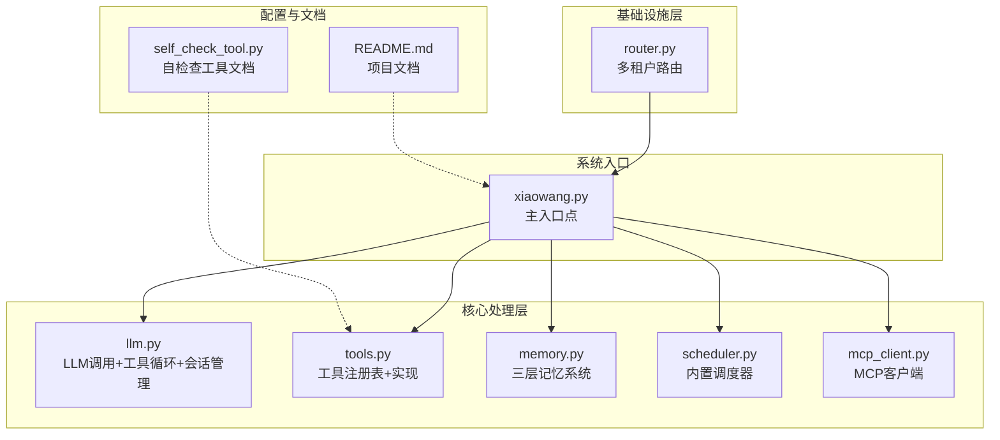
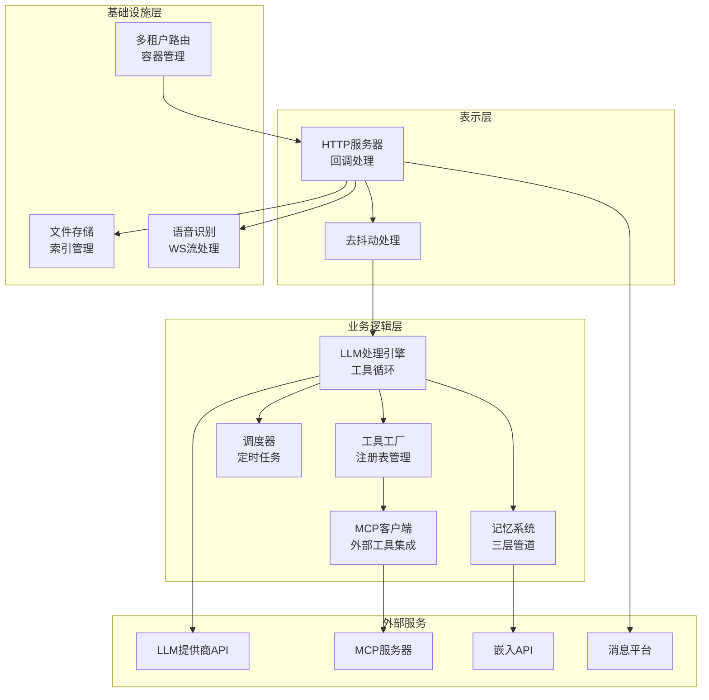
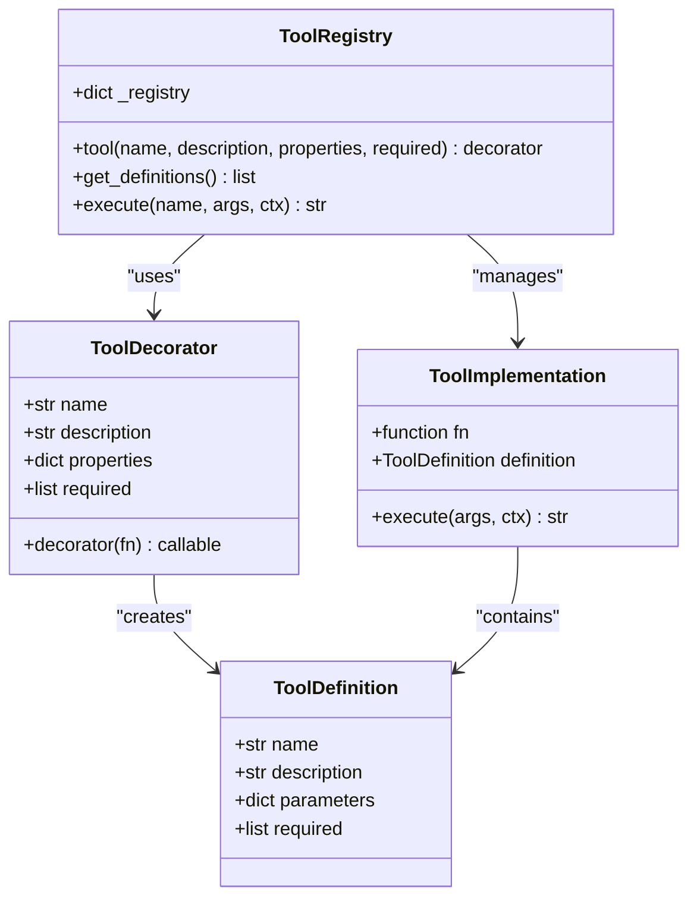
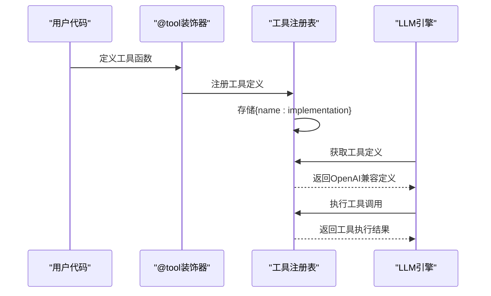
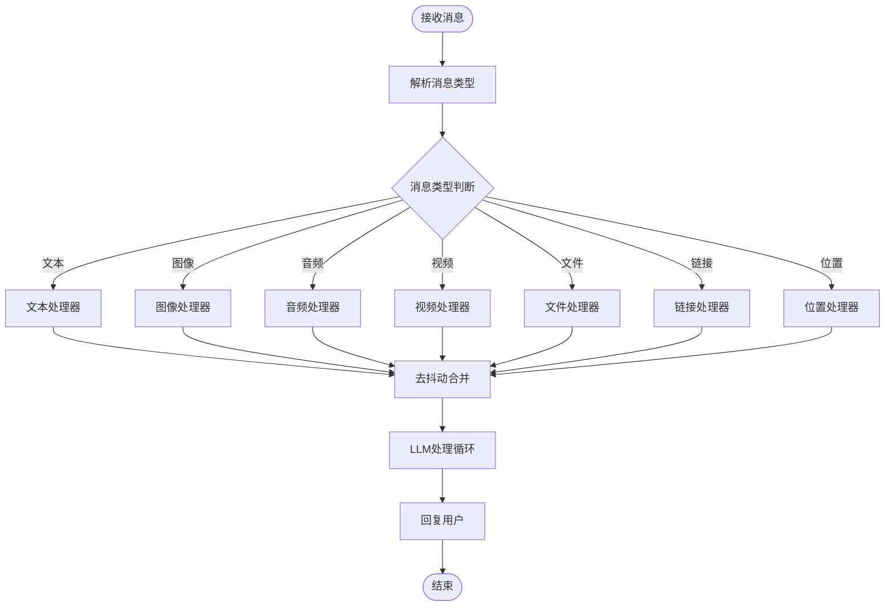
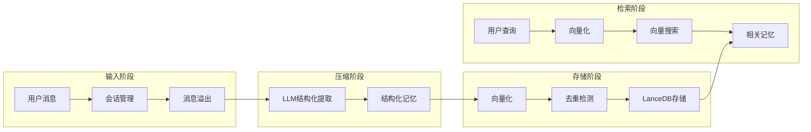
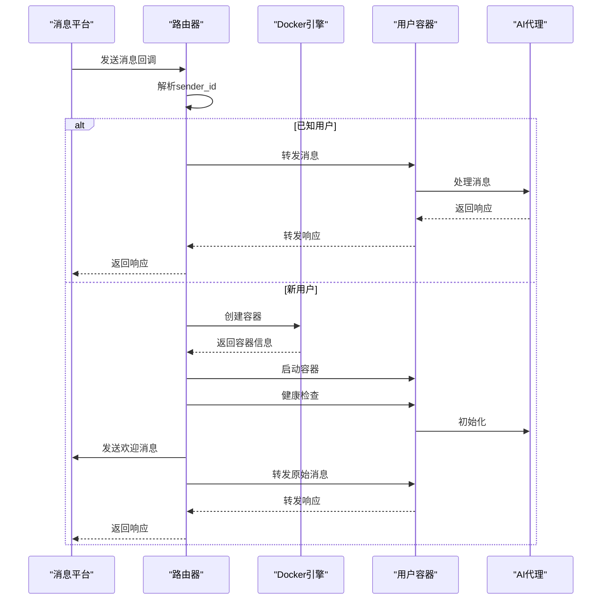
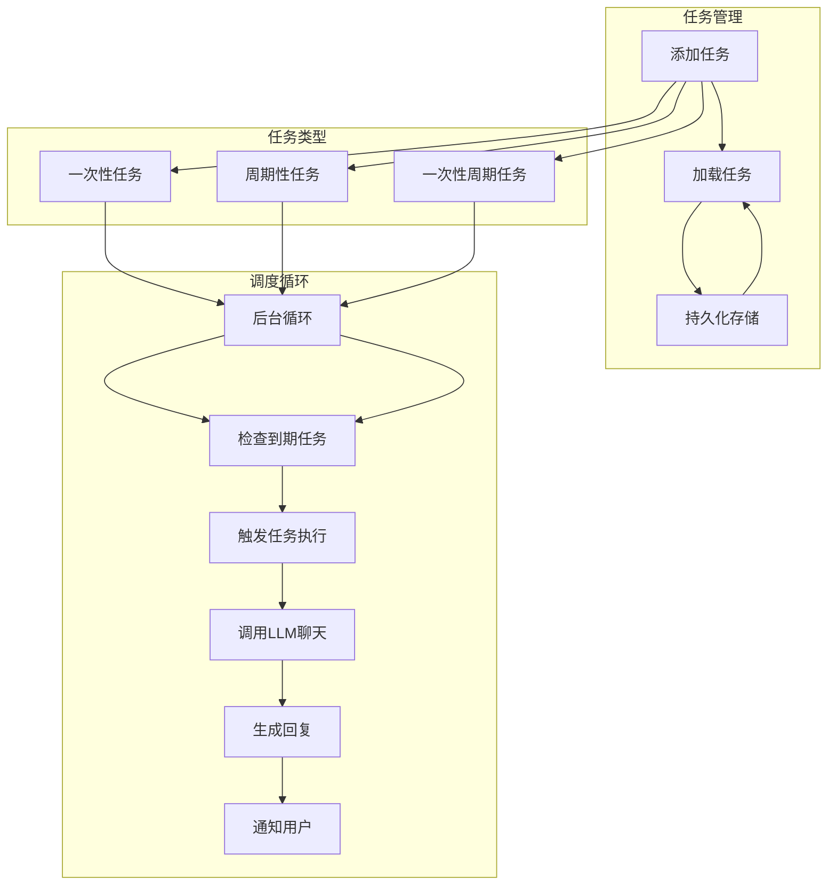
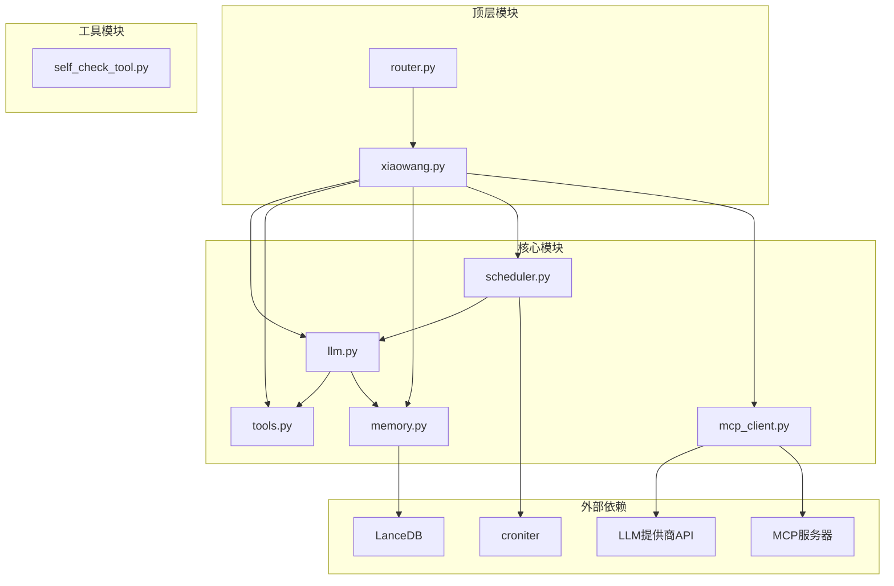

# 设计模式应用

<cite>
**本文档引用的文件**
- [README.md](file://README.md)
- [xiaowang.py](file://xiaowang.py)
- [llm.py](file://llm.py)
- [tools.py](file://tools.py)
- [router.py](file://router.py)
- [scheduler.py](file://scheduler.py)
- [memory.py](file://memory.py)
- [mcp_client.py](file://mcp_client.py)
- [self_check_tool.py](file://self_check_tool.py)
</cite>

## 目录
1. [引言](#引言)
2. [项目结构](#项目结构)
3. [核心组件](#核心组件)
4. [架构概览](#架构概览)
5. [详细组件分析](#详细组件分析)
6. [依赖关系分析](#依赖关系分析)
7. [性能考虑](#性能考虑)
8. [故障排除指南](#故障排除指南)
9. [结论](#结论)

## 引言

724 Office是一个生产级的AI智能体系统，采用纯Python编写（约3500行代码），实现了零框架依赖的设计理念。该系统展现了多种设计模式的优雅应用，包括装饰器模式、工厂模式、观察者模式和策略模式等，为构建可扩展、可维护和可测试的AI代理系统提供了优秀的范例。

系统的核心特性包括：
- 工具使用循环：支持最多20次迭代的OpenAI兼容函数调用
- 三层记忆系统：会话历史、LLM压缩的长期记忆、LanceDB向量检索
- MCP/插件系统：通过JSON-RPC连接外部MCP服务器，支持热重载
- 运行时工具创建：智能体可以动态创建、保存和加载新的Python工具
- 自修复机制：每日自检、会话健康诊断、错误日志分析、失败自动通知
- 定时调度：一次性和周期性任务，跨重启持久化，时区感知

## 项目结构

系统采用模块化的文件组织方式，每个核心功能都封装在独立的模块中：

**图表来源**
- [README.md:23-66](file://README.md#L23-L66)
- [xiaowang.py:1-13](file://xiaowang.py#L1-L13)

**章节来源**
- [README.md:1-162](file://README.md#L1-L162)
- [xiaowang.py:1-13](file://xiaowang.py#L1-L13)

## 核心组件

### 装饰器模式在工具注册中的应用

系统最显著的设计模式体现在工具注册机制中，通过装饰器模式实现了声明式的工具定义和注册。

**实现机制**：
- `@tool`装饰器提供了一种声明式的方式来注册工具
- 装饰器内部维护全局注册表，存储工具名称到实现的映射
- 自动生成OpenAI兼容的函数调用规范定义

**关键实现位置**：
- 装饰器定义：[tools.py:36-55](file://tools.py#L36-L55)
- 注册表管理：[tools.py:33-55](file://tools.py#L33-L55)
- 工具执行：[tools.py:63-74](file://tools.py#L63-L74)

**设计优势**：
- 简化了工具添加流程，只需在函数上添加装饰器即可
- 提供了统一的工具元数据管理（描述、参数模式、必需参数）
- 支持运行时动态加载自定义工具

### 工厂模式在工具创建中的使用

系统实现了灵活的工具工厂模式，支持多种工具来源的统一管理：

**多源工具管理**：
- 内置工具：预定义的标准工具集合
- 插件工具：从plugins目录动态加载的自定义工具
- MCP工具：从外部MCP服务器发现和注册的工具

**实现架构**：
- 工具注册表作为中央工厂，统一管理所有工具
- 支持工具的动态发现、加载和卸载
- 提供统一的工具执行接口

**关键实现位置**：
- 工具工厂接口：[tools.py:58-74](file://tools.py#L58-L74)
- 插件加载机制：[tools.py:527-544](file://tools.py#L527-L544)
- MCP工具集成：[mcp_client.py:269-333](file://mcp_client.py#L269-L333)

### 观察者模式在消息处理中的体现

系统的消息处理管道体现了观察者模式的思想，通过回调机制实现松耦合的消息分发：

**消息处理流程**：
- 接收原始消息回调
- 解析消息类型和内容
- 分发到相应的处理器
- 执行异步处理逻辑

**实现特点**：
- 使用线程池处理并发消息
- 支持消息去抖动（debounce）机制
- 提供统一的消息处理接口

**关键实现位置**：
- 消息回调处理：[xiaowang.py:489-554](file://xiaowang.py#L489-L554)
- 去抖动机制：[xiaowang.py:316-378](file://xiaowang.py#L316-L378)
- 多媒体处理：[xiaowang.py:435-487](file://xiaowang.py#L435-L487)

### 策略模式在多模态处理中的实现

系统采用了策略模式来处理不同类型的多媒体内容，每种媒体类型都有专门的处理策略：

**多模态处理策略**：
- 文本消息：直接转发到LLM
- 图像消息：下载、持久化、传递给视觉模型
- 音频消息：下载→转码→语音识别→文本
- 视频消息：下载、持久化、处理后发送
- 文件消息：下载、持久化、索引管理

**策略选择机制**：
- 基于消息类型的动态策略选择
- 统一的处理接口，隐藏具体实现细节
- 支持策略的扩展和替换

**关键实现位置**：
- 多模态处理入口：[xiaowang.py:489-554](file://xiaowang.py#L489-L554)
- 媒体下载策略：[xiaowang.py:383-432](file://xiaowang.py#L383-L432)
- ASR策略：[xiaowang.py:140-284](file://xiaowang.py#L140-L284)

## 架构概览

系统采用分层架构设计，各层职责明确，耦合度低：

**图表来源**
- [README.md:23-66](file://README.md#L23-L66)
- [xiaowang.py:59-76](file://xiaowang.py#L59-L76)

## 详细组件分析

### 工具注册系统（装饰器模式）

#### 类图展示

**图表来源**
- [tools.py:33-74](file://tools.py#L33-L74)

#### 装饰器工作流程

**图表来源**
- [tools.py:36-74](file://tools.py#L36-L74)

**实现要点**：
- 装饰器返回原函数，保持原有行为
- 在装饰时收集工具元数据
- 维护全局注册表，支持动态查询

**章节来源**
- [tools.py:36-74](file://tools.py#L36-L74)

### 多模态消息处理（策略模式）

#### 多态处理流程

**图表来源**
- [xiaowang.py:489-554](file://xiaowang.py#L489-L554)

**策略实现细节**：
- 文本消息：直接进入去抖动队列
- 图像消息：下载→持久化→传递给视觉模型
- 音频消息：下载→转码→ASR→文本
- 视频消息：下载→处理→发送
- 文件消息：下载→持久化→索引

**章节来源**
- [xiaowang.py:435-487](file://xiaowang.py#L435-L487)
- [xiaowang.py:140-284](file://xiaowang.py#L140-L284)

### 记忆系统（三层管道）

#### 记忆处理架构

**图表来源**
- [memory.py:121-146](file://memory.py#L121-L146)
- [memory.py:88-119](file://memory.py#L88-L119)

**实现特点**：
- 异步压缩：后台线程处理消息压缩
- 结构化提取：LLM提取关键事实、人物、时间、关键词
- 向量检索：基于余弦相似度的语义搜索
- 去重机制：防止重复存储相似记忆

**章节来源**
- [memory.py:194-282](file://memory.py#L194-L282)
- [memory.py:294-361](file://memory.py#L294-L361)

### 多租户路由系统

#### 容器化路由架构

**图表来源**
- [router.py:397-418](file://router.py#L397-L418)

**系统特性**：
- 动态容器创建：按需为新用户创建Docker容器
- 健康检查：确保容器正常运行
- 路由表管理：持久化路由配置
- 资源限制：容器内存和数量限制

**章节来源**
- [router.py:141-250](file://router.py#L141-L250)
- [router.py:433-465](file://router.py#L433-L465)

### 调度器系统

#### 任务调度架构

**图表来源**
- [scheduler.py:49-104](file://scheduler.py#L49-L104)
- [scheduler.py:130-186](file://scheduler.py#L130-L186)

**实现特点**：
- 原子性写入：使用临时文件避免崩溃损坏
- 多种调度策略：延迟触发和Cron表达式
- 异步执行：任务触发后异步处理
- 错误恢复：任务失败时通知所有者

**章节来源**
- [scheduler.py:122-128](file://scheduler.py#L122-L128)
- [scheduler.py:171-186](file://scheduler.py#L171-L186)

## 依赖关系分析

系统采用清晰的依赖层次结构，避免循环依赖：

**图表来源**
- [xiaowang.py:59-76](file://xiaowang.py#L59-L76)
- [llm.py:17-18](file://llm.py#L17-L18)

**依赖特点**：
- 单向依赖：从入口到核心模块
- 松耦合：模块间通过接口通信
- 可替换性：核心接口支持不同的实现

**章节来源**
- [xiaowang.py:59-76](file://xiaowang.py#L59-L76)
- [llm.py:17-18](file://llm.py#L17-L18)

## 性能考虑

### 并发处理优化

系统采用多线程架构处理高并发请求：

- **线程池管理**：使用ThreadingMixIn实现每个请求独立线程
- **锁机制**：针对共享资源使用细粒度锁控制
- **异步I/O**：文件操作和网络请求采用异步处理
- **缓存策略**：内存缓存减少重复计算

### 内存管理

- **会话截断**：超过最大消息数时自动压缩历史
- **懒加载**：模块导入时才加载依赖
- **资源清理**：及时释放临时文件和网络连接
- **容器化隔离**：每个用户容器独立内存空间

### 扩展性设计

- **插件系统**：支持动态加载自定义工具
- **MCP集成**：可扩展外部工具生态
- **配置驱动**：通过配置文件调整行为
- **接口抽象**：便于替换底层实现

## 故障排除指南

### 常见问题诊断

**工具注册问题**：
- 检查装饰器语法是否正确
- 验证工具名称唯一性
- 确认参数模式定义完整

**消息处理异常**：
- 查看去抖动缓冲区状态
- 检查多媒体文件下载权限
- 验证ASR服务可用性

**内存系统故障**：
- 确认嵌入API配置正确
- 检查LanceDB数据库连接
- 验证向量维度匹配

**章节来源**
- [tools.py:63-74](file://tools.py#L63-L74)
- [xiaowang.py:316-378](file://xiaowang.py#L316-L378)
- [memory.py:40-86](file://memory.py#L40-L86)

## 结论

724 Office系统通过精心设计的多种设计模式，成功构建了一个高度可扩展、可维护和可测试的AI智能体平台。装饰器模式简化了工具注册流程，工厂模式提供了灵活的工具管理机制，观察者模式实现了松耦合的消息处理，策略模式支持了多样化的多模态内容处理。

系统的关键优势包括：
- **零框架依赖**：完全基于标准库，易于部署和调试
- **自演化能力**：支持运行时工具创建和系统自修复
- **边缘部署友好**：专为资源受限环境设计
- **生产就绪**：经过实际生产环境验证

这些设计模式的应用不仅提高了代码质量，更重要的是为AI智能体系统的工程化发展提供了宝贵的实践经验。对于希望构建类似系统的开发者来说，724 Office提供了一个优秀的参考实现和最佳实践范例。