# 部署拓扑架构

<cite>
**本文档引用的文件**
- [README.md](file://README.md)
- [config.example.json](file://config.example.json)
- [router.py](file://router.py)
- [xiaowang.py](file://xiaowang.py)
- [llm.py](file://llm.py)
- [tools.py](file://tools.py)
- [memory.py](file://memory.py)
- [scheduler.py](file://scheduler.py)
- [mcp_client.py](file://mcp_client.py)
- [self_check_tool.py](file://self_check_tool.py)
</cite>

## 目录
1. [简介](#简介)
2. [项目结构](#项目结构)
3. [核心组件](#核心组件)
4. [架构概览](#架构概览)
5. [详细组件分析](#详细组件分析)
6. [部署模式设计](#部署模式设计)
7. [容器编排策略](#容器编排策略)
8. [资源限制与隔离](#资源限制与隔离)
9. [负载均衡与自动扩缩容](#负载均衡与自动扩缩容)
10. [监控告警体系](#监控告警体系)
11. [高可用性设计](#高可用性设计)
12. [灾难恢复策略](#灾难恢复策略)
13. [配置示例](#配置示例)
14. [结论](#结论)

## 简介

724 Office 是一个基于纯 Python 构建的生产级 AI 代理系统，具有零框架依赖特性。该系统实现了多租户容器化部署架构，支持单机部署、容器化部署和多租户集群部署三种模式。系统采用 Docker 容器编排策略，通过路由器模块实现用户路由管理，具备完善的健康检查和故障转移机制。

该系统的核心特点包括：
- **零框架依赖**：完全基于标准库和少量小包构建
- **多租户架构**：每个用户拥有独立的容器实例
- **自愈能力**：内置自我诊断和修复机制
- **边缘部署**：可在 Jetson Orin Nano 等设备上运行
- **离线能力**：核心功能无需云 API 即可运行

## 项目结构

系统采用模块化设计，主要文件组织如下：

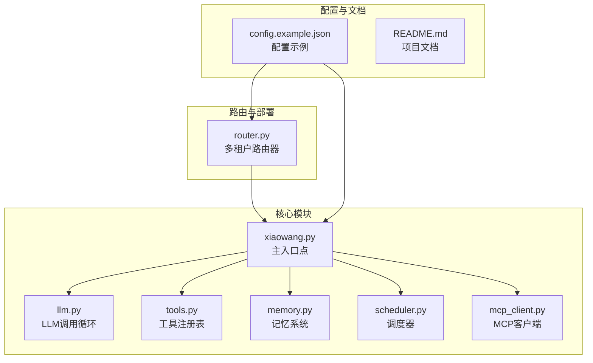

**图表来源**
- [xiaowang.py:1-626](file://xiaowang.py#L1-L626)
- [router.py:1-493](file://router.py#L1-L493)

**章节来源**
- [README.md:1-162](file://README.md#L1-L162)
- [xiaowang.py:1-626](file://xiaowang.py#L1-L626)

## 核心组件

### 主入口模块 (xiaowang.py)
主入口模块负责系统初始化、HTTP 服务器启动和消息回调处理。它整合了所有子模块，包括 LLM 处理、工具执行、消息传递、调度和记忆管理。

### LLM 处理模块 (llm.py)
实现核心的 LLM 调用循环，支持工具使用循环、会话管理和多模态消息处理。该模块是整个系统的核心处理引擎。

### 工具注册模块 (tools.py)
提供工具注册表功能，支持 26 个内置工具和动态插件扩展。工具以装饰器模式注册，支持运行时热加载。

### 记忆系统模块 (memory.py)
实现三层记忆系统：短期会话记忆、压缩长期记忆和向量检索记忆。基于 LanceDB 的向量数据库提供语义搜索能力。

### 调度器模块 (scheduler.py)
提供一次性任务和 Cron 定时任务功能，支持持久化存储和跨重启任务恢复。

### MCP 客户端模块 (mcp_client.py)
实现 MCP (Model Context Protocol) 客户端，支持外部 MCP 服务器连接和工具桥接。

**章节来源**
- [xiaowang.py:1-626](file://xiaowang.py#L1-L626)
- [llm.py:1-401](file://llm.py#L1-L401)
- [tools.py:1-800](file://tools.py#L1-L800)
- [memory.py:1-361](file://memory.py#L1-L361)
- [scheduler.py:1-219](file://scheduler.py#L1-L219)
- [mcp_client.py:1-334](file://mcp_client.py#L1-L334)

## 架构概览

系统采用分层架构设计，从底层基础设施到应用服务形成清晰的层次结构：

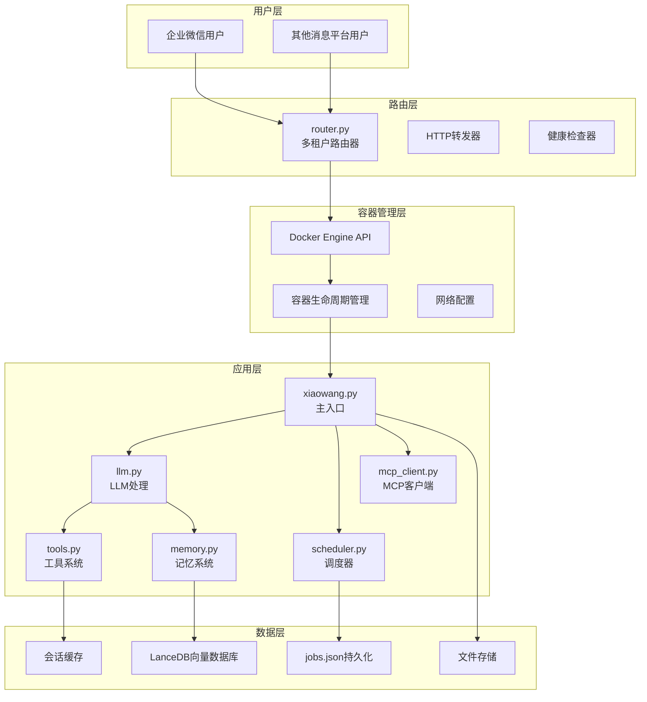

**图表来源**
- [router.py:1-493](file://router.py#L1-L493)
- [xiaowang.py:1-626](file://xiaowang.py#L1-L626)
- [memory.py:1-361](file://memory.py#L1-L361)

## 详细组件分析

### 多租户路由器 (router.py)

路由器模块是系统的核心组件，实现了多租户容器化部署的关键功能：

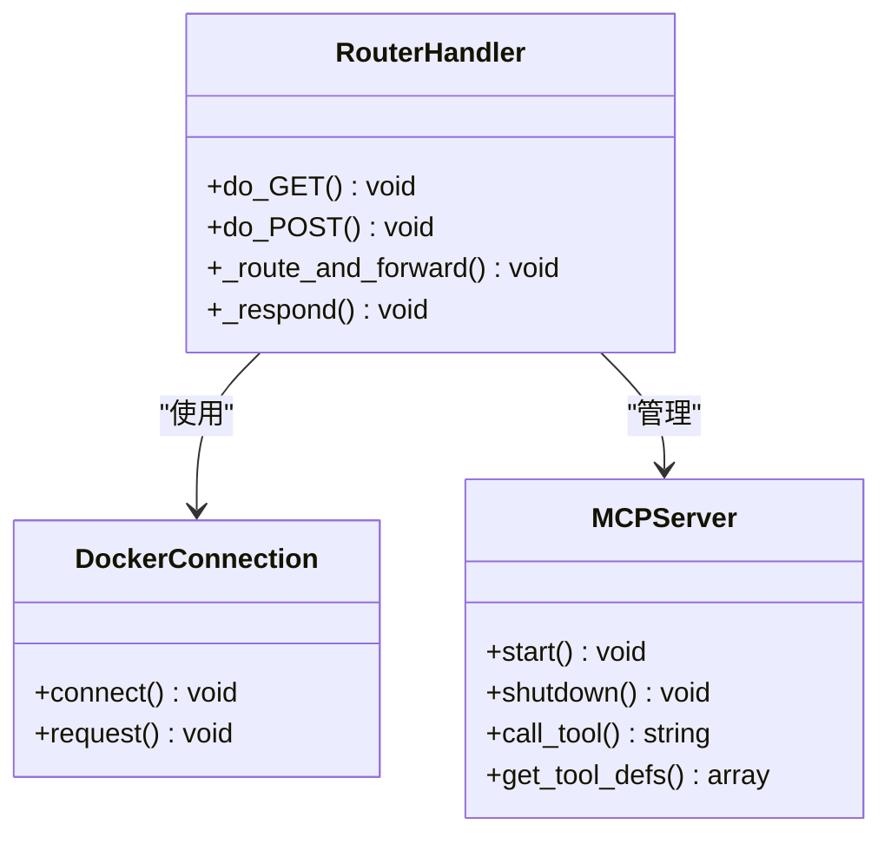

**图表来源**
- [router.py:310-425](file://router.py#L310-L425)
- [router.py:87-116](file://router.py#L87-L116)
- [mcp_client.py:27-242](file://mcp_client.py#L27-L242)

#### 自动供应机制
路由器支持按需自动创建用户容器，每个新用户都会获得独立的容器实例：

- **容器命名规则**：`agent-u{sender_id后8位}`
- **数据卷挂载**：`/data/agent/containers/{container_name}:/data`
- **网络配置**：使用指定的 Docker 网络
- **资源限制**：支持内存限制配置

#### 健康检查机制
容器具备内置健康检查功能：
- **HTTP 健康检查**：检查 `/` 路径可达性
- **超时控制**：5 秒间隔，3 次重试
- **自动清理**：失败时自动清理容器

**章节来源**
- [router.py:141-250](file://router.py#L141-L250)
- [router.py:190-196](file://router.py#L190-L196)

### HTTP 服务器架构

主入口模块实现了轻量级 HTTP 服务器，支持异步请求处理：

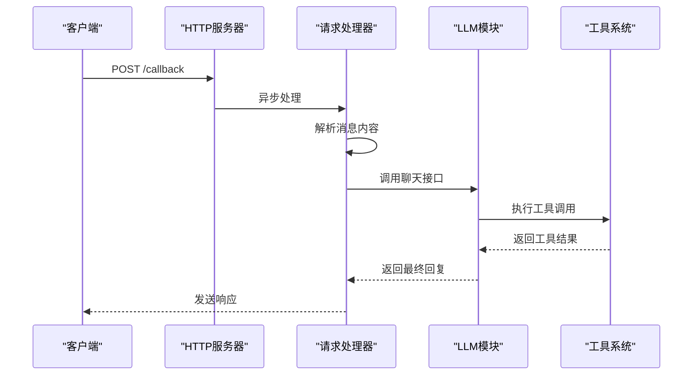

**图表来源**
- [xiaowang.py:559-592](file://xiaowang.py#L559-L592)
- [llm.py:317-401](file://llm.py#L317-L401)

**章节来源**
- [xiaowang.py:559-592](file://xiaowang.py#L559-L592)
- [llm.py:317-401](file://llm.py#L317-L401)

### 记忆系统架构

记忆系统采用三层架构设计，提供完整的记忆管理能力：

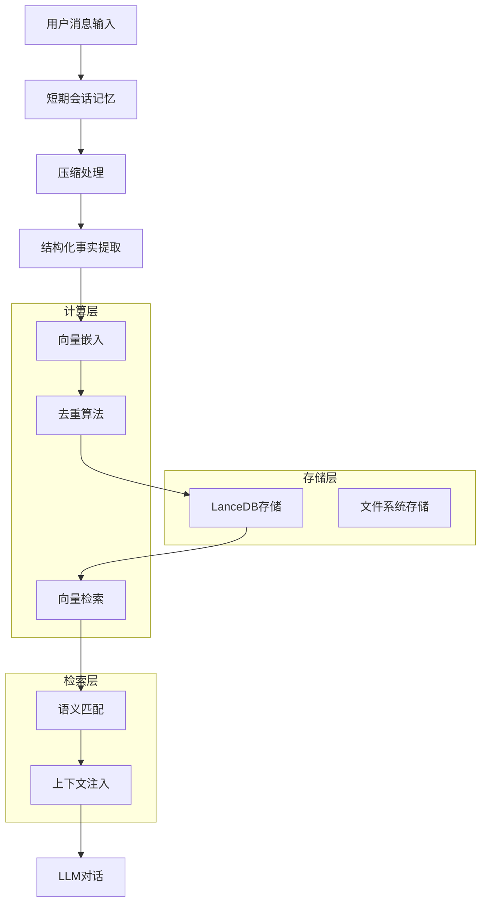

**图表来源**
- [memory.py:88-119](file://memory.py#L88-L119)
- [memory.py:294-361](file://memory.py#L294-L361)

**章节来源**
- [memory.py:88-119](file://memory.py#L88-L119)
- [memory.py:294-361](file://memory.py#L294-L361)

## 部署模式设计

### 单机部署模式

单机部署是最简单的部署方式，适用于开发测试和小型生产环境：

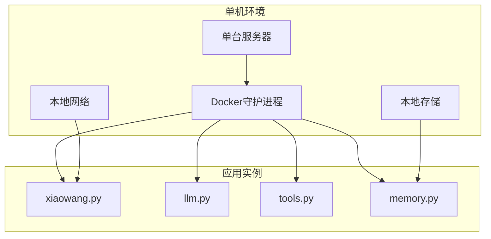

**特点**：
- 无需复杂的网络配置
- 数据存储在本地磁盘
- 简化的监控和维护
- 适合小规模部署

### 容器化部署模式

容器化部署提供了更好的隔离性和可移植性：

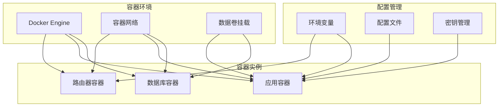

**优势**：
- 完全隔离的应用环境
- 可重复的部署过程
- 灵活的资源配置
- 支持滚动更新

### 多租户集群部署模式

多租户集群提供了高可用性和弹性扩展能力：

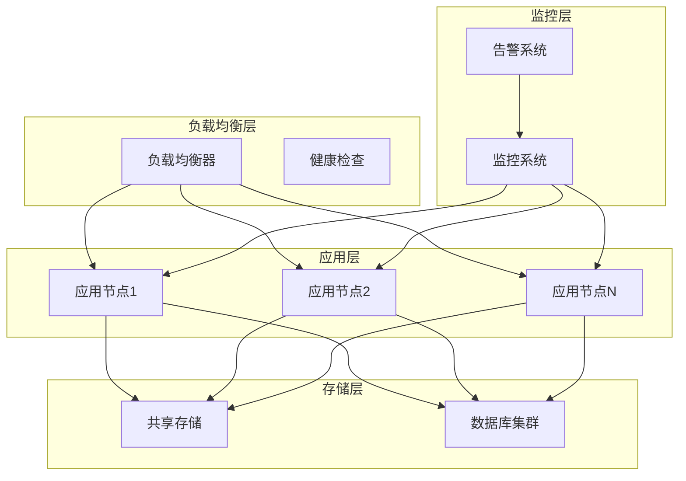

**特性**：
- 动态扩缩容
- 故障自动转移
- 资源池化管理
- 统一监控告警

## 容器编排策略

### Docker 容器管理

系统使用 Docker 进行容器编排，支持多种部署场景：

#### 容器生命周期管理
- **自动创建**：根据用户需求动态创建容器
- **健康检查**：内置 HTTP 健康检查机制
- **资源限制**：支持 CPU 和内存限制
- **自动重启**：配置为 unless-stopped 策略

#### 网络配置策略
- **专用网络**：使用独立的 Docker 网络隔离
- **端口映射**：8080 端口对外暴露
- **容器间通信**：通过容器名称进行内部通信

#### 存储卷管理
- **数据持久化**：用户数据存储在宿主机
- **配置分离**：配置文件独立管理
- **日志收集**：容器日志输出到标准输出

**章节来源**
- [router.py:176-196](file://router.py#L176-L196)
- [router.py:180-189](file://router.py#L180-L189)

### Kubernetes 部署策略

对于大规模部署，系统支持 Kubernetes 编排：

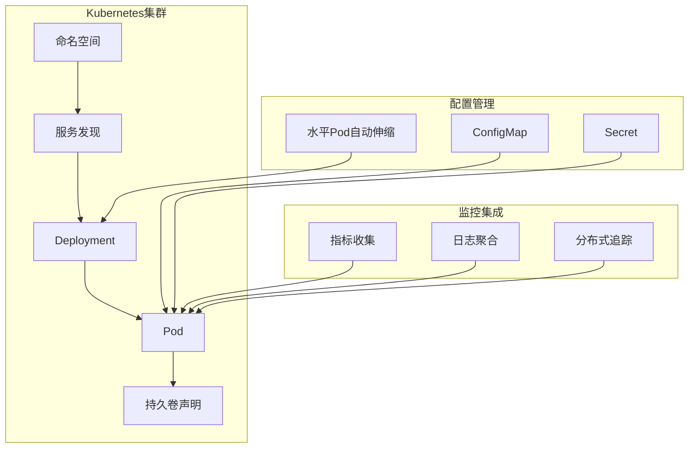

## 资源限制与隔离

### CPU 资源管理

系统支持细粒度的 CPU 资源控制：

#### 容器级 CPU 限制
- **CPU 核心数**：可通过 Docker 参数限制
- **CPU 配额**：支持 CPU 使用率上限
- **优先级设置**：不同容器的 CPU 优先级

#### 应用级资源控制
- **线程池大小**：根据 CPU 核心数动态调整
- **并发限制**：防止过度并发导致资源耗尽
- **内存压力检测**：实时监控内存使用情况

### 内存资源管理

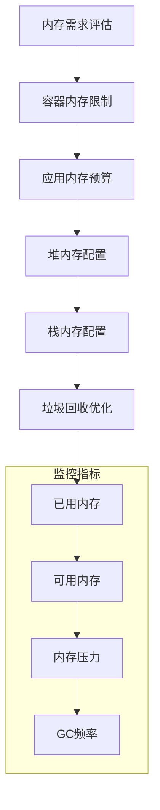

**图表来源**
- [router.py:131-139](file://router.py#L131-L139)

#### 内存限制策略
- **容器内存上限**：默认 256MB，可配置
- **JVM 堆大小**：根据容器限制自动调整
- **缓存大小限制**：防止缓存无限增长

### 存储资源管理

#### 文件系统隔离
- **用户数据隔离**：每个用户独立的数据目录
- **临时文件清理**：定期清理临时文件
- **存储配额**：可配置的存储使用限制

#### 数据持久化策略
- **重要数据备份**：关键配置和数据定期备份
- **增量同步**：只同步变更的数据
- **版本管理**：支持数据版本回滚

**章节来源**
- [router.py:131-139](file://router.py#L131-L139)

## 负载均衡与自动扩缩容

### 负载均衡策略

系统支持多种负载均衡策略：

#### 基于会话的负载均衡
- **粘性会话**：同一用户的请求始终路由到同一容器
- **会话亲和性**：基于用户 ID 的会话保持
- **状态同步**：用户状态在容器间同步

#### 健康检查机制
- **主动健康检查**：定时检查容器健康状态
- **被动健康检查**：基于请求成功率的健康判断
- **故障检测时间**：快速识别和隔离故障容器

### 自动扩缩容机制

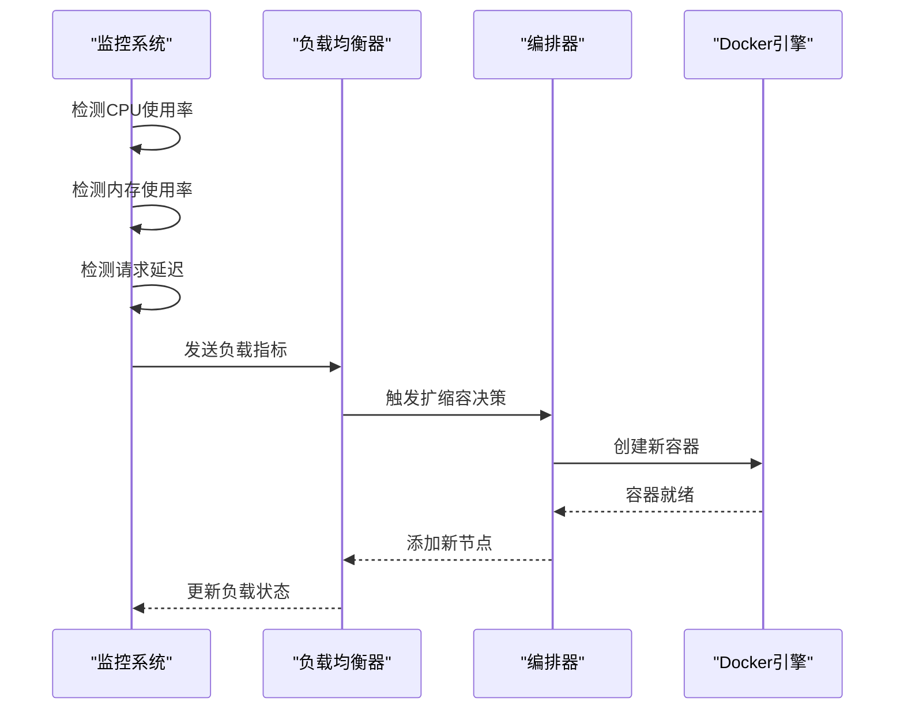

**图表来源**
- [router.py:149-154](file://router.py#L149-L154)

#### 扩展触发条件
- **CPU 使用率 > 80%**：持续 5 分钟
- **内存使用率 > 85%**：持续 3 分钟
- **请求延迟 > 2 秒**：持续 1 分钟
- **队列长度 > 100**：持续 30 秒

#### 缩容触发条件
- **CPU 使用率 < 20%**：持续 10 分钟
- **内存使用率 < 30%**：持续 5 分钟
- **请求量 < 10TPS**：持续 15 分钟

**章节来源**
- [router.py:149-154](file://router.py#L149-L154)

## 监控告警体系

### 系统监控指标

#### 性能监控
- **响应时间**：HTTP 请求的平均响应时间
- **吞吐量**：每秒处理的请求数
- **错误率**：HTTP 5xx 错误的比例
- **资源利用率**：CPU、内存、磁盘、网络使用率

#### 业务监控
- **用户活跃度**：每日活跃用户数
- **工具使用统计**：各工具的调用次数
- **会话质量**：对话完成率和满意度
- **消息处理量**：接收和发送的消息数量

### 告警机制

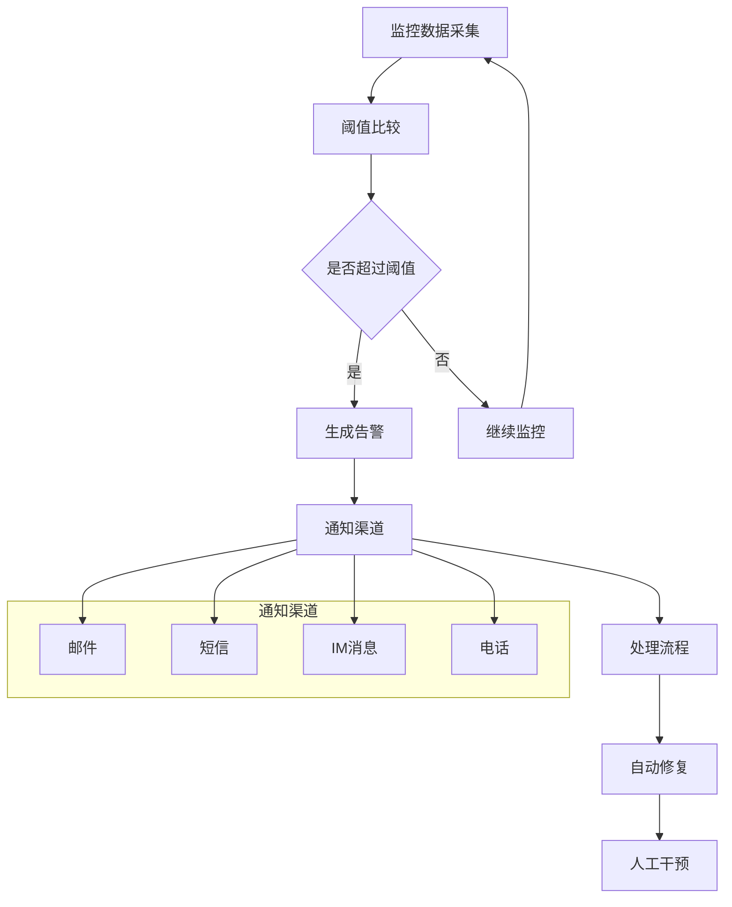

#### 告警级别
- **严重级别**：系统不可用，立即通知
- **警告级别**：性能下降，需要关注
- **信息级别**：正常但需要记录

#### 自动处理
- **重启容器**：容器异常退出时自动重启
- **资源扩容**：资源不足时自动扩容
- **故障转移**：节点故障时自动切换

**章节来源**
- [self_check_tool.py:1-57](file://self_check_tool.py#L1-L57)

## 高可用性设计

### 多实例部署

系统支持多实例部署以提高可用性：

#### 主备模式
- **主实例**：处理所有请求
- **备实例**：实时同步状态
- **自动切换**：主实例故障时自动切换

#### 负载分担模式
- **多个实例**：同时处理请求
- **请求分发**：智能分配到空闲实例
- **故障隔离**：单个实例故障不影响整体

### 数据高可用

#### 数据复制
- **实时复制**：关键数据实时同步
- **异步备份**：定期备份到远程存储
- **多副本存储**：重要数据多副本保存

#### 一致性保证
- **事务处理**：关键操作的原子性
- **冲突解决**：并发写入的冲突处理
- **数据校验**：定期数据完整性检查

### 网络高可用

#### 网络冗余
- **多网络接口**：支持多网卡冗余
- **负载均衡**：网络流量分担
- **故障切换**：网络故障自动切换

#### DNS 高可用
- **多 DNS 服务器**：支持多个 DNS 服务器
- **轮询机制**：DNS 记录轮询
- **健康检查**：DNS 服务器健康检查

## 灾难恢复策略

### 数据备份策略

#### 全量备份
- **定期全备**：每周进行全量数据备份
- **增量备份**：每天进行增量备份
- **实时备份**：关键数据实时备份

#### 备份存储
- **本地存储**：备份数据存储在本地
- **远程存储**：备份数据存储在远程位置
- **云存储**：备份数据存储在云端

### 灾难恢复流程

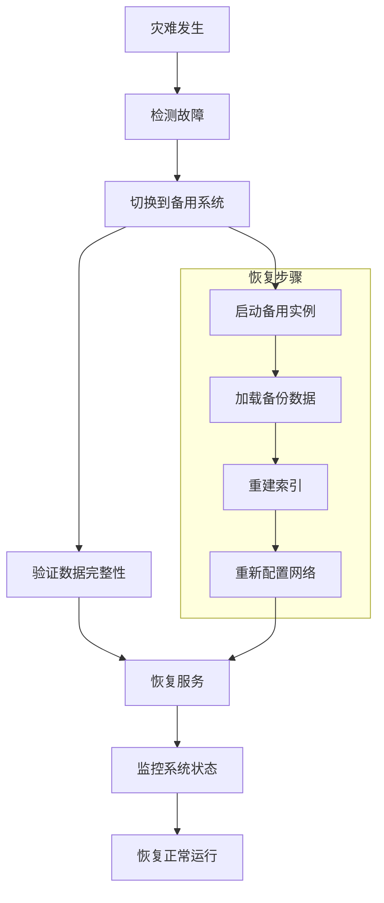

#### 恢复时间目标 (RTO)
- **系统恢复**：5 分钟内
- **数据恢复**：30 分钟内
- **完整恢复**：2 小时内

#### 恢复点目标 (RPO)
- **数据丢失**：< 15 分钟
- **配置丢失**：< 1 分钟
- **状态丢失**：< 5 分钟

### 业务连续性

#### 业务影响分析
- **关键业务**：消息处理和工具调用
- **次要业务**：后台任务和报告
- **非关键业务**：调试和测试功能

#### 应急预案
- **紧急响应**：快速故障定位和处理
- **业务中断**：最小化业务影响
- **客户通知**：及时通知受影响用户

## 配置示例

### 环境变量配置

```json
{
  "ROUTING_FILE": "/data/router/routing.json",
  "DEFAULT_BACKEND": "",
  "HOST_DATA_DIR": "/data/agent/containers",
  "APP_IMAGE": "agent-app:latest",
  "DOCKER_NETWORK": "docker_agent-net",
  "ENV_FILE_PATH": "/data/env/.env",
  "MAX_CONTAINERS": "20",
  "CONTAINER_MEMORY": "256m",
  "PROVISION_TIMEOUT": "45",
  "PORT": "8080"
}
```

### 网络配置示例

```yaml
version: '3.8'
services:
  router:
    image: agent-router:latest
    ports:
      - "8080:8080"
    environment:
      - DOCKER_HOST=unix:///var/run/docker.sock
      - DOCKER_NETWORK=agent-network
    volumes:
      - /var/run/docker.sock:/var/run/docker.sock
      - ./data:/data
    networks:
      - agent-network
  
  agent:
    image: agent-app:latest
    depends_on:
      - router
    environment:
      - OWNER_ID=${OWNER_ID}
      - MODEL_DEFAULT=deepseek-chat
    volumes:
      - ./workspace:/data
    networks:
      - agent-network

networks:
  agent-network:
    driver: bridge
```

### 服务发现机制

系统支持多种服务发现方式：

#### Docker 网络服务发现
- **容器名称解析**：通过容器名称访问
- **端口映射**：容器端口映射到主机
- **网络隔离**：不同应用使用独立网络

#### DNS 服务发现
- **自定义 DNS**：配置自定义 DNS 服务器
- **服务注册**：服务自动注册到 DNS
- **健康检查**：DNS 记录健康检查

#### API 服务发现
- **REST API**：通过 HTTP API 获取服务列表
- **配置中心**：集中式服务配置管理
- **动态更新**：服务变更自动通知

**章节来源**
- [config.example.json:1-61](file://config.example.json#L1-L61)
- [router.py:24-32](file://router.py#L24-L32)

## 结论

724 Office 系统提供了一个完整的企业级 AI 代理部署解决方案。通过多租户容器化架构，系统实现了高可用性、可扩展性和易维护性。

### 主要优势

1. **架构灵活性**：支持单机、容器化和集群三种部署模式
2. **资源隔离**：通过容器实现强隔离和资源限制
3. **自动运维**：内置健康检查和故障转移机制
4. **扩展性强**：支持自动扩缩容和负载均衡
5. **监控完善**：全面的监控告警体系

### 最佳实践建议

1. **生产环境部署**：建议使用 Kubernetes 集群部署
2. **资源规划**：根据预期用户数量规划容器数量
3. **监控配置**：建立完善的监控告警体系
4. **备份策略**：制定定期备份和灾难恢复计划
5. **安全配置**：配置适当的网络安全和访问控制

该系统为构建企业级 AI 代理应用提供了坚实的技术基础，能够满足不同规模和复杂度的部署需求。