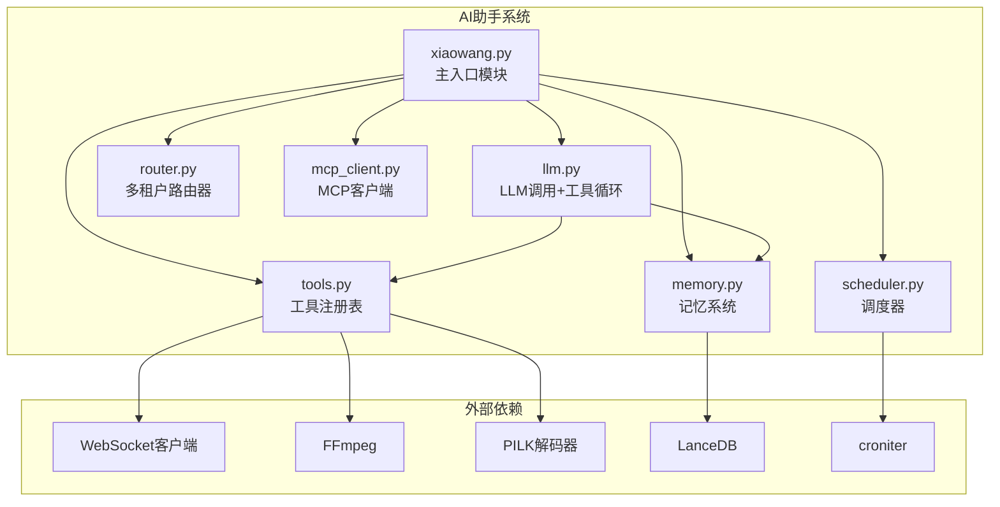
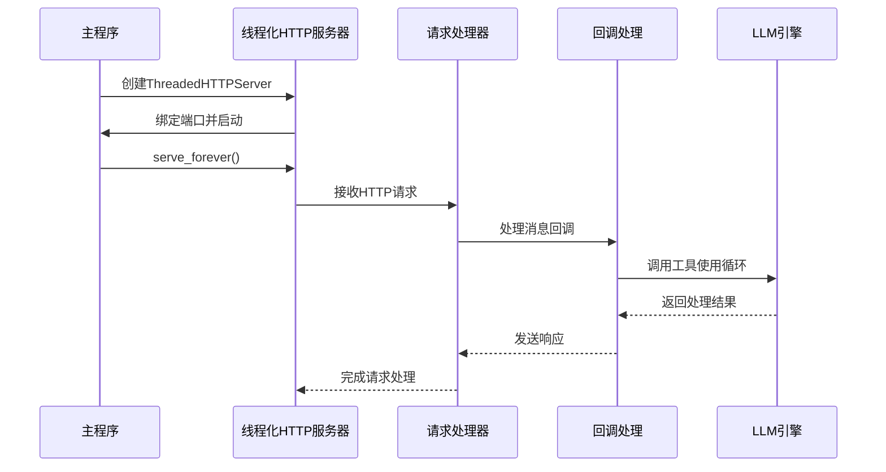
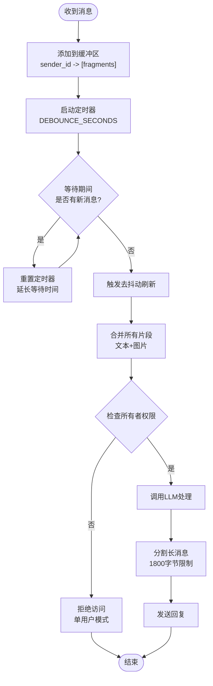
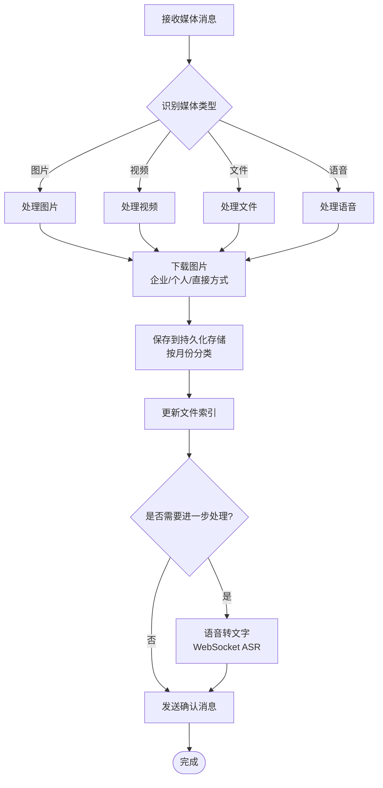
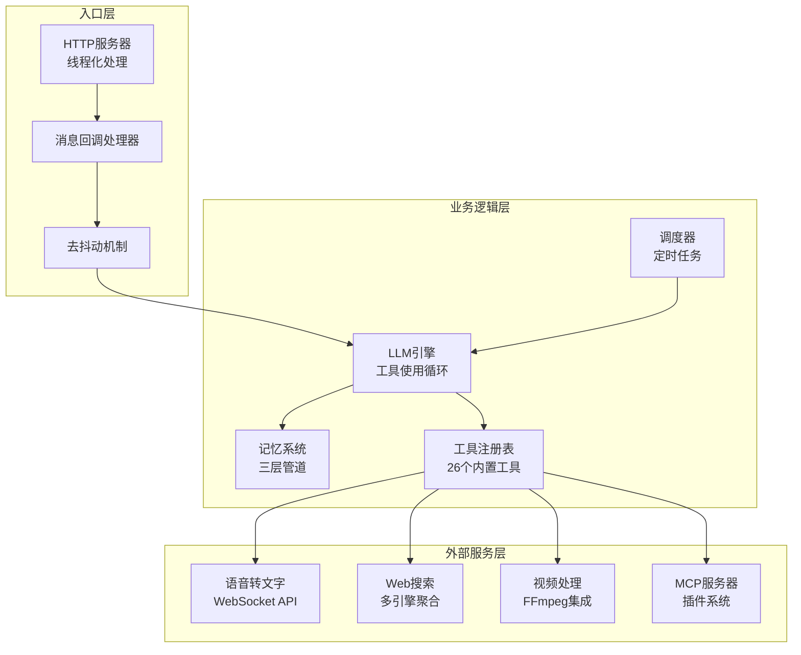
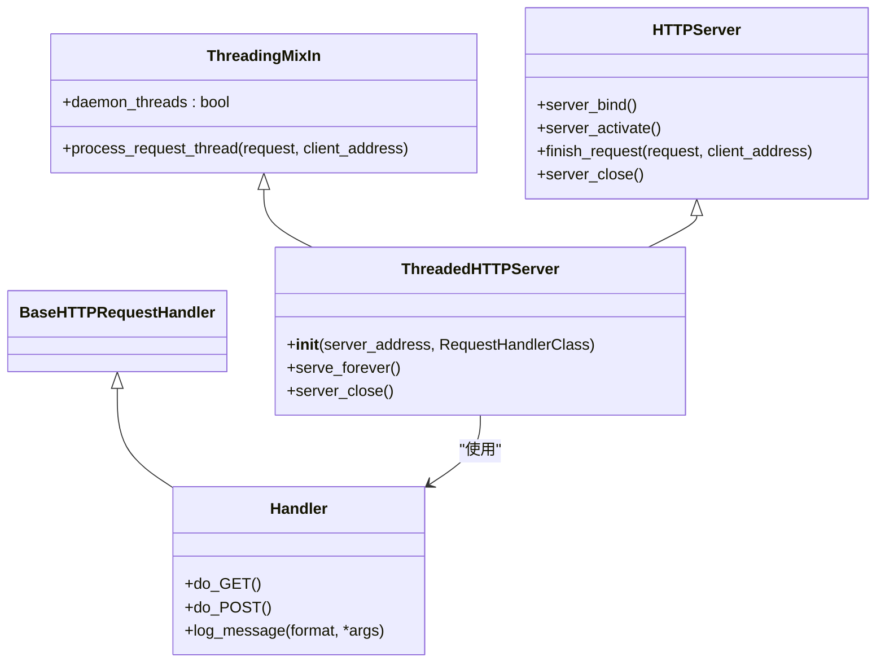
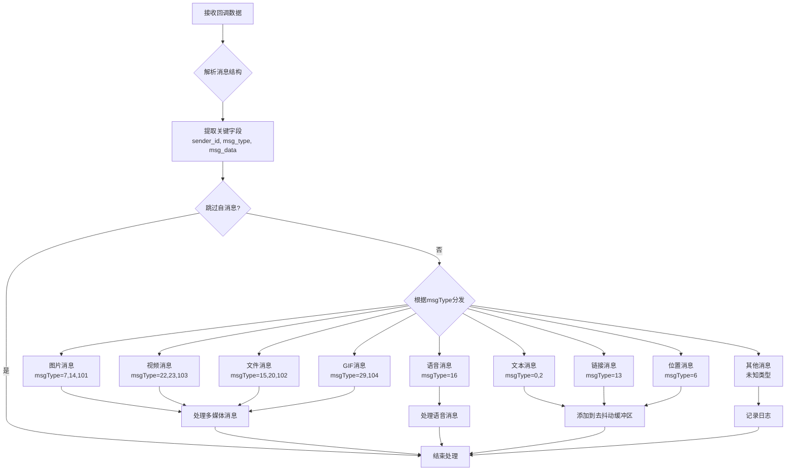
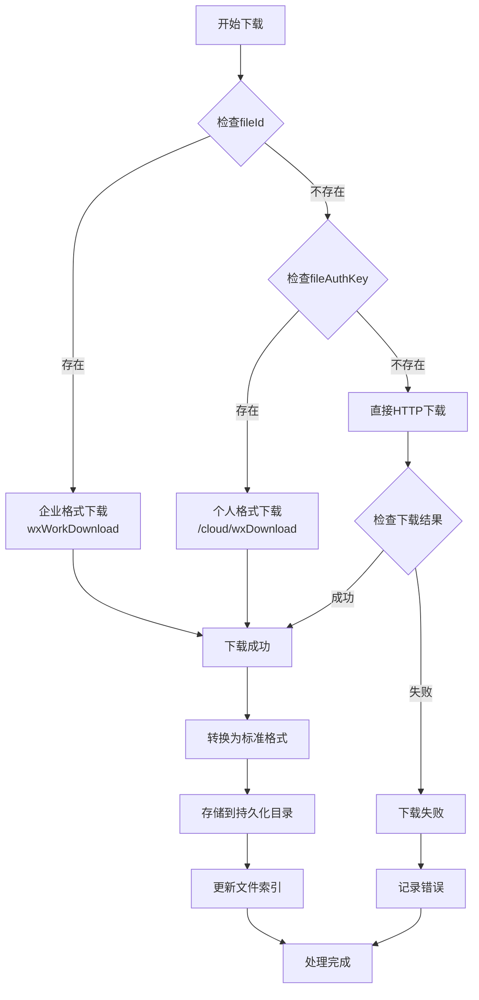
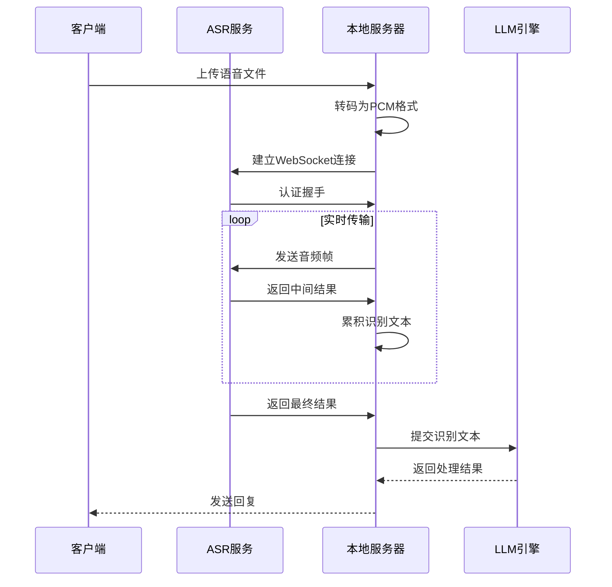
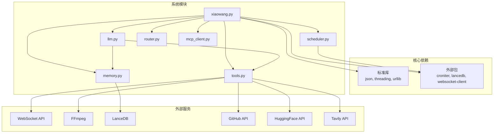

# AI助手主入口 (xiaowang.py)

<cite>
**本文档引用的文件**
- [xiaowang.py](file://xiaowang.py)
- [README.md](file://README.md)
- [config.example.json](file://config.example.json)
- [llm.py](file://llm.py)
- [tools.py](file://tools.py)
- [memory.py](file://memory.py)
- [scheduler.py](file://scheduler.py)
- [router.py](file://router.py)
- [mcp_client.py](file://mcp_client.py)
</cite>

## 目录
1. [简介](#简介)
2. [项目结构](#项目结构)
3. [核心组件](#核心组件)
4. [架构概览](#架构概览)
5. [详细组件分析](#详细组件分析)
6. [依赖关系分析](#依赖关系分析)
7. [性能考虑](#性能考虑)
8. [故障排除指南](#故障排除指南)
9. [结论](#结论)

## 简介

AI助手主入口模块 (`xiaowang.py`) 是一个生产级的AI代理系统的核心入口点，采用纯Python实现（零框架依赖），支持多租户部署和完整的工具使用循环。该模块提供了HTTP服务器配置与启动机制、消息回调处理流程、多媒体文件处理以及ASR语音转文字的完整实现。

本系统具有以下核心特性：
- **零框架依赖**：仅使用标准库和3个小包（`croniter`、`lancedb`、`websocket-client`）
- **多租户路由**：支持按用户ID路由到独立容器实例
- **工具使用循环**：OpenAI兼容的函数调用，最多20次迭代
- **三层记忆系统**：会话历史、LLM压缩长期记忆、LanceDB向量检索
- **多模态处理**：图像、视频、文件、语音、链接处理
- **自修复能力**：每日自检、会话健康诊断、错误日志分析

## 项目结构

**图表来源**
- [xiaowang.py:1-626](file://xiaowang.py#L1-L626)
- [llm.py:1-401](file://llm.py#L1-L401)
- [tools.py:1-1153](file://tools.py#L1-L1153)

**章节来源**
- [README.md:1-162](file://README.md#L1-L162)
- [xiaowang.py:1-100](file://xiaowang.py#L1-L100)

## 核心组件

### HTTP服务器配置与启动

系统采用线程化HTTP服务器实现，每个请求在独立线程中处理，避免阻塞其他请求：

**图表来源**
- [xiaowang.py:597-626](file://xiaowang.py#L597-L626)
- [xiaowang.py:559-592](file://xiaowang.py#L559-L592)

### 消息去抖动机制

系统实现了智能去抖动机制，将短时间内连续的消息合并处理：

**图表来源**
- [xiaowang.py:311-378](file://xiaowang.py#L311-L378)
- [xiaowang.py:365-378](file://xiaowang.py#L365-L378)

### 多媒体文件处理流程

系统支持多种媒体类型的下载、持久化存储和处理：

**图表来源**
- [xiaowang.py:383-432](file://xiaowang.py#L383-L432)
- [xiaowang.py:435-487](file://xiaowang.py#L435-L487)

**章节来源**
- [xiaowang.py:597-626](file://xiaowang.py#L597-L626)
- [xiaowang.py:311-378](file://xiaowang.py#L311-L378)
- [xiaowang.py:383-487](file://xiaowang.py#L383-L487)

## 架构概览

**图表来源**
- [xiaowang.py:1-626](file://xiaowang.py#L1-L626)
- [llm.py:1-401](file://llm.py#L1-L401)
- [tools.py:1-1153](file://tools.py#L1-L1153)

## 详细组件分析

### HTTP服务器实现

系统采用线程化HTTP服务器确保高并发处理能力：

#### 线程化服务器配置

**图表来源**
- [xiaowang.py:608-611](file://xiaowang.py#L608-L611)
- [xiaowang.py:559-592](file://xiaowang.py#L559-L592)

#### 端口配置和安全考虑

服务器配置包含以下关键参数：
- **端口配置**：默认8080，可通过配置文件修改
- **线程安全**：使用守护线程避免主线程阻塞
- **请求处理**：异步处理消息回调，不阻塞HTTP响应
- **错误处理**：捕获解析错误并记录日志

**章节来源**
- [xiaowang.py:43-44](file://xiaowang.py#L43-L44)
- [xiaowang.py:608-611](file://xiaowang.py#L608-L611)

### 消息回调处理流程

系统支持多种消息类型的处理，包括文本、图片、视频、文件、语音、链接和位置信息。

#### 消息类型识别和处理

**图表来源**
- [xiaowang.py:489-554](file://xiaowang.py#L489-L554)
- [xiaowang.py:517-547](file://xiaowang.py#L517-L547)

#### 具体消息类型处理示例

**文本消息处理**：
- 支持普通文本和富文本内容
- 自动去抖动合并连续消息
- 触发LLM工具使用循环

**图片消息处理**：
- 支持企业微信和微信个人格式
- 自动下载和转换为标准格式
- 持久化存储到按月分类的目录

**语音消息处理**：
- 支持SILK和多种音频格式
- 自动转码为PCM格式
- 通过WebSocket ASR服务进行语音转文字

**章节来源**
- [xiaowang.py:489-554](file://xiaowang.py#L489-L554)
- [xiaowang.py:517-547](file://xiaowang.py#L517-L547)

### 多媒体文件处理实现

系统实现了完整的多媒体文件处理管道，包括下载、转换、存储和索引管理。

#### 文件下载策略

**图表来源**
- [xiaowang.py:383-432](file://xiaowang.py#L383-L432)

#### 文件持久化存储

系统采用按月分类的存储策略，确保文件组织的有序性：

**存储结构**：
- 基础目录：`workspace/files/`
- 年月子目录：`YYYY-MM/`
- 文件命名：`timestamp_filename.ext`
- 索引文件：`index.json` 记录所有文件元数据

**文件元数据**：
- 路径：完整文件存储路径
- 类型：image/video/file/voice/gif
- 文件名：原始文件名
- 大小：文件大小（字节）
- 时间：ISO格式时间戳

**章节来源**
- [xiaowang.py:99-131](file://xiaowang.py#L99-L131)
- [xiaowang.py:383-432](file://xiaowang.py#L383-L432)

### ASR语音转文字实现

系统集成了WebSocket流式ASR服务，支持实时语音转文字：

#### ASR处理流程

**图表来源**
- [xiaowang.py:140-284](file://xiaowang.py#L140-L284)

#### 音频转码和认证

ASR实现包含以下关键步骤：

**音频转码**：
- SILK格式：使用pilk库解码
- 其他格式：使用ffmpeg转码为16kHz单声道PCM
- 输出格式：s16le 16kHz 1通道

**WebSocket认证**：
- 使用HMAC-SHA256签名算法
- 包含host、date、request-line头部
- 通过Authorization头传递认证信息

**实时流式传输**：
- 帧大小：8000字节
- 传输间隔：0.04秒模拟实时
- 状态管理：0=开始，1=继续，2=结束

**章节来源**
- [xiaowang.py:140-284](file://xiaowang.py#L140-L284)

## 依赖关系分析

**图表来源**
- [xiaowang.py:15-29](file://xiaowang.py#L15-L29)
- [tools.py:19-25](file://tools.py#L19-L25)

### 模块耦合度分析

系统采用松耦合设计，主要通过以下接口交互：

**配置接口**：统一的配置加载和传递机制
**工具接口**：标准化的工具定义和执行接口  
**消息接口**：统一的消息格式和处理协议
**存储接口**：抽象化的文件存储和索引管理

**章节来源**
- [xiaowang.py:35-75](file://xiaowang.py#L35-L75)
- [llm.py:33-39](file://llm.py#L33-L39)

## 性能考虑

### 线程池和并发控制

系统通过线程化HTTP服务器实现高并发处理，同时采用以下优化策略：

**线程管理**：
- 守护线程：避免主线程阻塞
- 线程池：合理控制并发数量
- 资源清理：自动清理僵尸线程

**内存优化**：
- 消息去抖动：减少重复处理
- 文件缓存：避免重复下载
- 对象复用：重用连接和资源

### 存储优化

**文件存储策略**：
- 按月分目录：避免单目录过大
- 增量索引：只记录新增文件
- 异步写入：非阻塞文件操作

**数据库优化**：
- LanceDB向量存储：高效的相似性搜索
- 内存缓存：热点数据快速访问
- 批量操作：减少I/O次数

### 网络优化

**HTTP客户端优化**：
- 连接复用：重用TCP连接
- 超时控制：防止请求挂起
- 错误重试：提高成功率

**WebSocket优化**：
- 流式传输：实时响应
- 心跳检测：保持连接活跃
- 自动重连：网络异常恢复

## 故障排除指南

### 常见问题和解决方案

**HTTP服务器启动失败**：
- 检查端口占用情况
- 验证配置文件格式
- 确认权限设置

**消息处理异常**：
- 查看日志中的错误堆栈
- 验证消息格式完整性
- 检查去抖动配置

**ASR服务连接失败**：
- 验证ASR配置参数
- 检查网络连通性
- 确认认证信息正确性

**文件下载失败**：
- 检查文件权限
- 验证存储空间
- 确认下载URL有效性

### 日志分析

系统提供详细的日志记录，包括：
- 请求处理状态
- 错误发生位置
- 性能指标统计
- 调试信息输出

**章节来源**
- [xiaowang.py:52-53](file://xiaowang.py#L52-L53)
- [xiaowang.py:589-588](file://xiaowang.py#L589-L588)

## 结论

AI助手主入口模块 (`xiaowang.py`) 展现了优秀的工程实践，通过纯Python实现复杂的AI代理功能。系统的设计特点包括：

**架构优势**：
- 零框架依赖，易于部署和维护
- 模块化设计，职责清晰分离
- 线程化处理，支持高并发场景
- 多租户支持，可扩展性强

**技术特色**：
- 智能去抖动机制，提升用户体验
- 完整的多媒体处理管道
- 实时ASR语音转文字
- 三层记忆系统，支持长期学习

**性能表现**：
- 线程化HTTP服务器，高并发处理
- 智能缓存策略，降低延迟
- 异步处理机制，避免阻塞
- 资源优化配置，节省内存

该系统为生产环境提供了稳定可靠的AI代理解决方案，适合各种应用场景的部署需求。