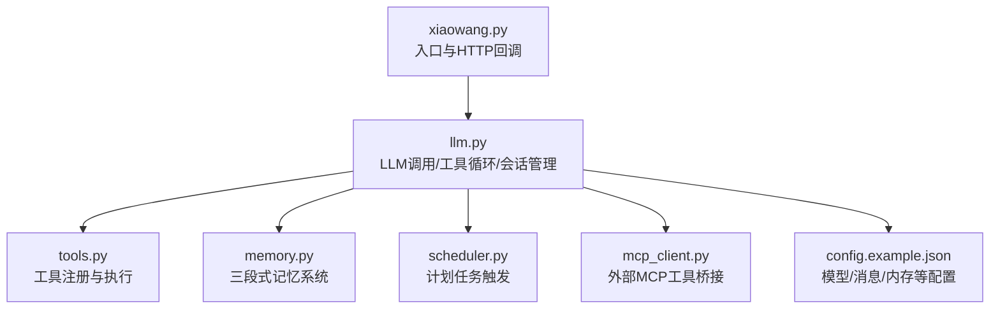
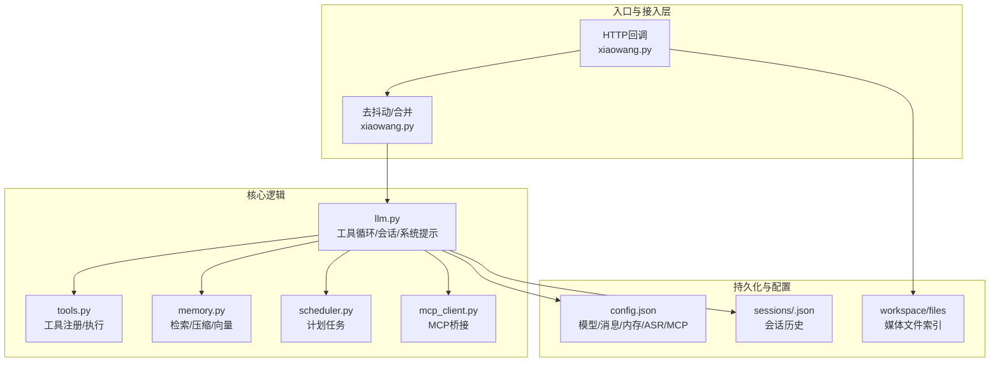
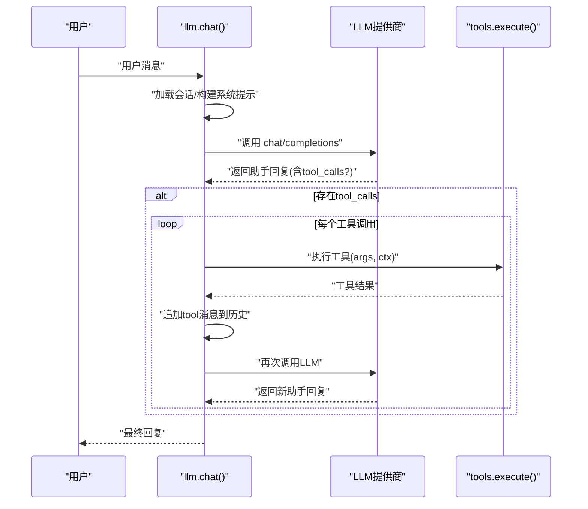
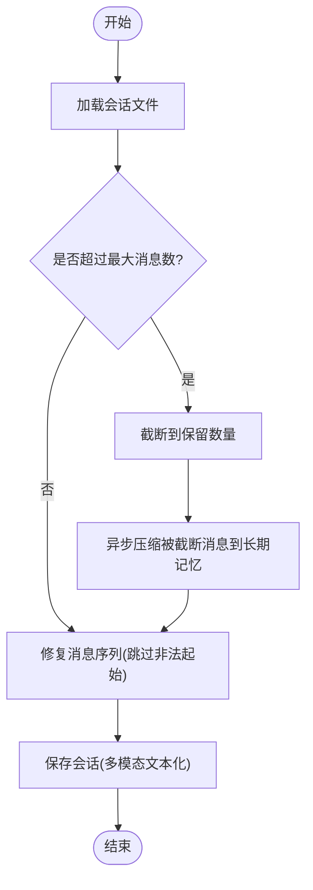
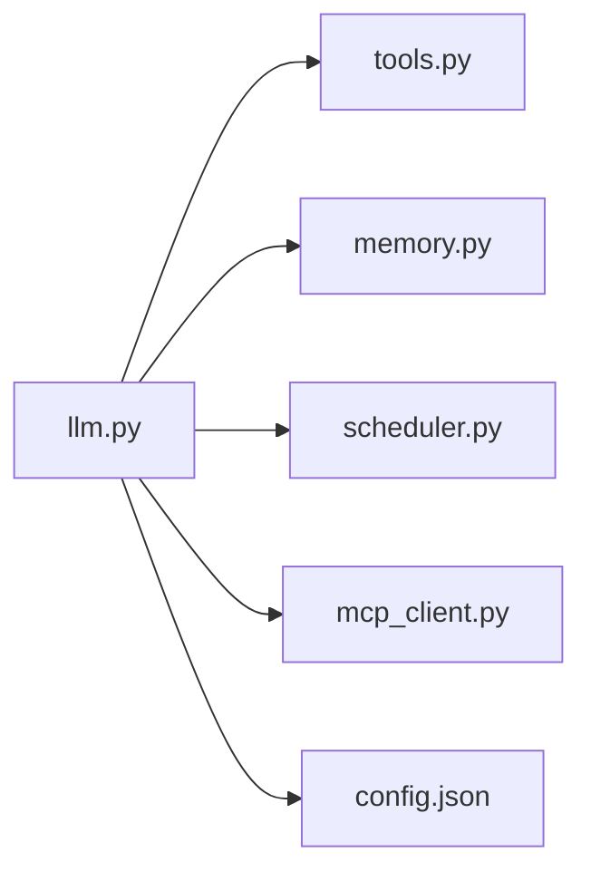

# LLM接口 (llm.py)

<cite>
**本文引用的文件**
- [llm.py](file://llm.py)
- [tools.py](file://tools.py)
- [memory.py](file://memory.py)
- [xiaowang.py](file://xiaowang.py)
- [scheduler.py](file://scheduler.py)
- [mcp_client.py](file://mcp_client.py)
- [README.md](file://README.md)
- [config.example.json](file://config.example.json)
</cite>

## 目录
1. [简介](#简介)
2. [项目结构](#项目结构)
3. [核心组件](#核心组件)
4. [架构总览](#架构总览)
5. [详细组件分析](#详细组件分析)
6. [依赖关系分析](#依赖关系分析)
7. [性能考量](#性能考量)
8. [故障排查指南](#故障排查指南)
9. [结论](#结论)
10. [附录](#附录)

## 简介
本文件为 llm.py 的技术文档，聚焦于以下主题：
- LLM API 调用封装与设计模式：模型初始化、参数配置、响应处理
- 工具使用循环（Tool Use Loop）：OpenAI 函数调用格式兼容、工具选择策略、循环终止条件
- 会话管理与上下文保持：会话状态维护、历史消息管理、内存优化策略
- 多模态支持：图像等多媒体内容的构建与传输
- 性能优化、并发控制与调试方法
- 典型调用示例与错误处理、重试机制

## 项目结构
该系统采用“单文件工具 + 少量核心模块”的极简架构，llm.py 为核心入口之一，负责：
- 初始化与配置注入
- LLM API 调用
- 工具使用循环
- 会话加载/保存与历史截断
- 系统提示词构建与跨会话上下文桥接
- 多模态消息构建（文本+图片）

图表来源
- [llm.py:33-40](file://llm.py#L33-L40)
- [llm.py:50-83](file://llm.py#L50-L83)
- [llm.py:317-400](file://llm.py#L317-L400)
- [tools.py:36-74](file://tools.py#L36-L74)
- [memory.py:40-86](file://memory.py#L40-L86)
- [scheduler.py:30-43](file://scheduler.py#L30-L43)
- [mcp_client.py:272-334](file://mcp_client.py#L272-L334)
- [config.example.json:1-61](file://config.example.json#L1-L61)

章节来源
- [README.md:23-66](file://README.md#L23-L66)
- [config.example.json:1-61](file://config.example.json#L1-L61)

## 核心组件
- 模型初始化与配置注入
  - 通过全局变量注入模型配置、工作区、所有者ID、会话目录
  - 提供默认供应商与额外请求体扩展
- LLM API 调用
  - 构造 OpenAI 兼容的 chat/completions 请求体
  - 统一超时与HTTP错误处理
- 工具使用循环
  - 限制最大迭代次数，逐轮调用 LLM 并执行工具
  - 对工具调用结果进行序列化并回写到消息历史
- 会话管理
  - 会话文件按 session_key 命名存储
  - 加载时进行历史截断与消息合法性修复
  - 保存前对多模态内容进行文本化标记以避免后续400错误
- 系统提示词与跨会话上下文
  - 注入时间戳、个性文件内容
  - 跨会话桥接：从 scheduler 会话提取最近发送内容注入到系统提示
- 多模态消息
  - 图像转 base64 data URI，支持多模态内容列表
- 并发控制
  - 使用线程锁保证同一会话串行化处理

章节来源
- [llm.py:33-40](file://llm.py#L33-L40)
- [llm.py:50-83](file://llm.py#L50-L83)
- [llm.py:317-400](file://llm.py#L317-L400)
- [llm.py:89-160](file://llm.py#L89-L160)
- [llm.py:231-286](file://llm.py#L231-L286)
- [llm.py:204-224](file://llm.py#L204-L224)
- [llm.py:306-322](file://llm.py#L306-L322)

## 架构总览
下图展示了 llm.py 在整体系统中的位置与交互关系。

图表来源
- [xiaowang.py:63-76](file://xiaowang.py#L63-L76)
- [llm.py:33-40](file://llm.py#L33-L40)
- [llm.py:317-400](file://llm.py#L317-L400)
- [tools.py:36-74](file://tools.py#L36-L74)
- [memory.py:40-86](file://memory.py#L40-L86)
- [scheduler.py:30-43](file://scheduler.py#L30-L43)
- [mcp_client.py:272-334](file://mcp_client.py#L272-L334)
- [config.example.json:1-61](file://config.example.json#L1-L61)

## 详细组件分析

### 模型初始化与配置注入
- 全局配置注入
  - 通过 init(models_config, workspace, owner_id, sessions_dir) 注入模型配置、工作区、所有者ID、会话目录
  - 默认供应商由配置中的 default 键决定
- 额外请求体扩展
  - 支持在 provider 中定义 extra_body，作为请求体的键值对直接合并
  - 支持自定义超时 timeout
- OpenAI 兼容参数
  - model、messages、tools、max_tokens 等字段按 OpenAI 格式构造
  - Authorization 头使用 Bearer 方案

章节来源
- [llm.py:33-40](file://llm.py#L33-L40)
- [llm.py:45-83](file://llm.py#L45-L83)
- [config.example.json:2-18](file://config.example.json#L2-L18)

### LLM API 调用封装
- 请求构造
  - 动态拼接 chat/completions 接口地址
  - 统一 Content-Type 与 Authorization
- 超时与错误处理
  - 统一超时控制；HTTPError 时读取响应体用于调试
  - 记录错误日志并抛出异常
- 响应解析
  - 读取 choices[0].message 作为助手回复
  - 支持 reasoning_content 与 tool_calls 字段兼容

章节来源
- [llm.py:50-83](file://llm.py#L50-L83)

### 工具使用循环（核心）
- 循环流程
  - 逐轮调用 LLM，追加助手回复到消息历史
  - 若存在 tool_calls，则逐一执行工具并将结果以 tool 角色消息回写
  - 无 tool_calls 则结束循环，返回最终回复
- 迭代上限与超时
  - 最大迭代次数为 20，超过则返回超时提示
- 并发与线程安全
  - 使用会话级锁保证同一会话串行化处理
- 工具选择与执行
  - 工具定义来自 tools.get_definitions()，OpenAI 函数调用格式
  - 执行时传递上下文 ctx（包含 owner_id、workspace、session_key）

图表来源
- [llm.py:317-400](file://llm.py#L317-L400)
- [tools.py:58-74](file://tools.py#L58-L74)

章节来源
- [llm.py:317-400](file://llm.py#L317-L400)
- [tools.py:36-74](file://tools.py#L36-L74)

### 会话管理与上下文保持
- 会话文件命名与存储
  - 会话键映射为安全文件名，保存在 sessions_dir 下
- 加载与截断
  - 加载后若超过最大消息数，仅保留最后 N 条
  - 截断时触发异步压缩到长期记忆
  - 修复历史消息序列：跳过非合法起始角色，避免 LLM 400
- 保存与历史文本化
  - 保存前将多模态用户消息中的图片替换为占位符，避免历史中出现 image_url 导致后续400
- 会话锁
  - 使用线程锁保证同一会话串行化处理

图表来源
- [llm.py:89-160](file://llm.py#L89-L160)

章节来源
- [llm.py:89-160](file://llm.py#L89-L160)

### 系统提示词与跨会话上下文桥接
- 系统提示词构建
  - 注入当前时间戳
  - 读取 workspace 下的 SOUL.md、AGENT.md、USER.md 文件内容
- 跨会话桥接
  - 从 scheduler 会话读取最近（2小时内）的工具调用内容（message 工具），注入到系统提示
  - 限制长度并添加标识，便于 LLM 知晓用户正在回复最近发送的消息

章节来源
- [llm.py:288-300](file://llm.py#L288-L300)
- [llm.py:231-286](file://llm.py#L231-L286)

### 多模态消息构建
- 图像编码
  - 将本地图片读取为 base64 data URI，自动推断 MIME 类型
- 用户消息构建
  - 文本与图片组合为 OpenAI 兼容的 content 数组
  - 图片加载失败时记录错误并以文本占位

章节来源
- [llm.py:193-224](file://llm.py#L193-L224)

### 工具注册与执行（与 llm.py 的协作）
- 工具注册
  - 通过装饰器 @tool(name, description, properties, required) 注册工具
  - get_definitions() 返回 OpenAI 函数调用格式定义
- 工具执行
  - execute(name, args, ctx) 调用对应函数，异常会被捕获并返回错误信息
- MCP 工具桥接
  - mcp_client 将外部 MCP 服务器工具转换为 OpenAI 函数调用格式并注册到工具表

章节来源
- [tools.py:36-74](file://tools.py#L36-L74)
- [mcp_client.py:243-262](file://mcp_client.py#L243-L262)

### 计划任务与会话桥接
- 计划任务触发
  - scheduler 在到期时调用 llm.chat(message, "scheduler")，使 LLM 可以通过工具发送消息给用户
- 会话桥接
  - llm.chat 在 DM 会话中注入 scheduler 会话最近发送内容，帮助 LLM 理解上下文

章节来源
- [scheduler.py:171-186](file://scheduler.py#L171-L186)
- [llm.py:347-352](file://llm.py#L347-L352)

## 依赖关系分析
- 内部依赖
  - llm.py 依赖 tools.py（工具定义与执行）、memory.py（检索/压缩）、scheduler.py（跨会话桥接）、mcp_client.py（外部工具桥接）
- 外部依赖
  - urllib（HTTP 请求）
  - threading（会话锁、后台压缩）
  - json、base64、os、datetime 等标准库

图表来源
- [llm.py:33-40](file://llm.py#L33-L40)
- [tools.py:36-74](file://tools.py#L36-L74)
- [memory.py:40-86](file://memory.py#L40-L86)
- [scheduler.py:30-43](file://scheduler.py#L30-L43)
- [mcp_client.py:272-334](file://mcp_client.py#L272-L334)

章节来源
- [llm.py:17-19](file://llm.py#L17-L19)

## 性能考量
- 会话截断与压缩
  - 当会话超过阈值时，截断并异步压缩到长期记忆，减少后续请求体积
- 历史文本化
  - 保存前将多模态图片替换为占位符，避免 image_url 导致后续400与体积膨胀
- 线程锁与并发
  - 会话级锁确保同一会话串行化，避免竞态；工具执行在独立线程中进行
- 超时与错误处理
  - 统一超时控制与HTTP错误日志，便于快速定位问题
- 日志与性能统计
  - 记录准备阶段、LLM 调用总耗时、工具调用次数与总耗时，便于性能分析

章节来源
- [llm.py:143-160](file://llm.py#L143-L160)
- [llm.py:354-400](file://llm.py#L354-L400)

## 故障排查指南
- 常见错误与处理
  - HTTP 400/422：读取响应体前500字符用于调试日志
  - 工具执行异常：捕获异常并返回错误信息，不影响主流程
  - 会话文件损坏：加载失败时返回空历史，系统可重建
- 诊断工具
  - diagnose 工具：检查会话文件健康、MCP 连接状态、近期错误详情
  - self_check 工具：收集今日对话统计、错误日志、服务运行时长、内存磁盘、计划任务状态、记忆文件状态
- 调试建议
  - 开启日志级别，关注 llm 与 memory 模块的错误输出
  - 检查会话文件是否以 user/assistant/tool 正确序列开头
  - 确认工具名称与参数匹配 OpenAI 函数调用格式

章节来源
- [llm.py:74-83](file://llm.py#L74-L83)
- [tools.py:929-1019](file://tools.py#L929-L1019)
- [tools.py:818-921](file://tools.py#L818-L921)

## 结论
llm.py 通过简洁而稳健的设计，实现了：
- OpenAI 兼容的 LLM 调用封装
- 可扩展的工具使用循环，支持多模态与跨会话上下文
- 完整的会话管理与内存优化策略
- 易于调试与自愈的系统能力

该模块为上层入口（如 xiaowang.py）提供了稳定、可扩展的对话与工具执行核心。

## 附录

### 调用示例与最佳实践（路径参考）
- 初始化与调用
  - 初始化：[llm.py:33-40](file://llm.py#L33-L40)
  - 调用工具循环：[llm.py:317-400](file://llm.py#L317-L400)
- 工具定义与执行
  - 工具注册与定义：[tools.py:36-74](file://tools.py#L36-L74)
  - 工具执行：[tools.py:63-74](file://tools.py#L63-L74)
- 多模态消息
  - 图像编码与消息构建：[llm.py:193-224](file://llm.py#L193-L224)
- 会话管理
  - 会话加载/保存/截断：[llm.py:89-160](file://llm.py#L89-L160)
- 系统提示与跨会话桥接
  - 系统提示构建：[llm.py:288-300](file://llm.py#L288-L300)
  - 跨会话桥接：[llm.py:231-286](file://llm.py#L231-L286)
- 计划任务与会话桥接
  - 触发与调用：[scheduler.py:171-186](file://scheduler.py#L171-L186)
- 配置参考
  - 模型配置示例：[config.example.json:2-18](file://config.example.json#L2-L18)