# NL2SQL自然语言到SQL系统

<cite>
**本文档引用的文件**
- [app.js](file://NL2SQL/backend/src/app.js)
- [nl2sqlEngine.js](file://NL2SQL/backend/src/core/nl2sqlEngine.js)
- [llmService.js](file://NL2SQL/backend/src/core/llmService.js)
- [schemaLoader.js](file://NL2SQL/backend/src/core/schemaLoader.js)
- [vectorStore.js](file://NL2SQL/backend/src/memory/vectorStore.js)
- [database.js](file://NL2SQL/backend/src/core/database.js)
- [routes.js](file://NL2SQL/backend/src/core/routes.js)
- [wsHandler.js](file://NL2SQL/backend/src/core/wsHandler.js)
- [logger.js](file://NL2SQL/backend/src/utils/logger.js)
- [config.js](file://NL2SQL/backend/src/core/config.js)
- [schema-metadata.json](file://NL2SQL/backend/config/schema-metadata.json)
- [main.js](file://NL2SQL/frontend/src/main.js)
- [router.js](file://NL2SQL/frontend/src/router/index.js)
- [session.js](file://NL2SQL/frontend/src/stores/session.js)
- [markdownRenderer.js](file://NL2SQL/frontend/src/utils/markdownRenderer.js)
- [ChatView.vue](file://NL2SQL/frontend/src/views/ChatView.vue)
- [package.json](file://NL2SQL/backend/package.json)
- [package.json](file://NL2SQL/frontend/package.json)
</cite>

## 更新摘要
**变更内容**
- 新增实体解析系统(resolveEntity)，支持模糊描述到具体ID的映射
- 增强的上下文意图分析(analyzeIntent)，支持对话历史的深度融合
- Markdown渲染系统集成，提供丰富的前端展示功能
- 智能LLM意图更新机制(updateIntentWithLLM)，实现更自然的对话体验
- 增强的SQL生成策略，支持上下文理解和历史信息整合

## 目录
1. [项目概述](#项目概述)
2. [项目结构](#项目结构)
3. [核心组件](#核心组件)
4. [架构概览](#架构概览)
5. [详细组件分析](#详细组件分析)
6. [依赖关系分析](#依赖关系分析)
7. [性能考虑](#性能考虑)
8. [故障排除指南](#故障排除指南)
9. [结论](#结论)

## 项目概述

NL2SQL自然语言到SQL系统是一个智能数据查询平台，能够将用户的自然语言查询转换为精确的SQL语句。该系统结合了大型语言模型（LLM）、向量数据库和传统的关系型数据库技术，为用户提供直观的数据查询体验。

### 主要特性
- **自然语言查询**：用户可以用中文描述数据需求
- **智能SQL生成**：基于Schema元数据生成准确的SQL语句
- **实时交互**：支持WebSocket实时通信和流式响应
- **语义检索**：利用向量数据库实现Schema的语义匹配
- **安全控制**：多重安全验证和访问控制机制
- **会话管理**：完整的对话历史和状态管理
- **实体解析**：支持模糊描述到具体ID的智能映射
- **上下文理解**：深度融合对话历史的智能分析
- **Markdown渲染**：丰富的前端展示和交互体验

## 项目结构

系统采用前后端分离架构，分为三个主要部分：

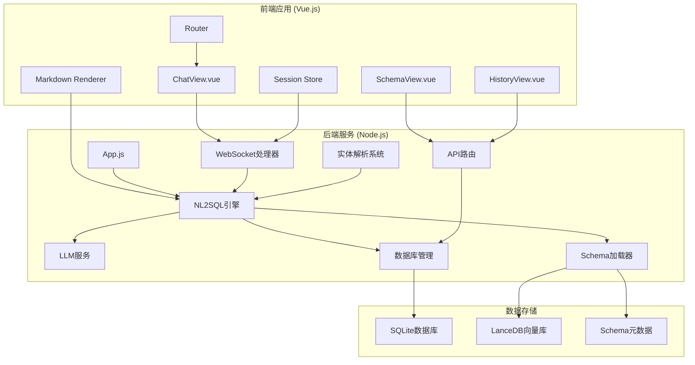

**图表来源**
- [app.js:1-266](file://NL2SQL/backend/src/app.js#L1-L266)
- [main.js:1-89](file://NL2SQL/frontend/src/main.js#L1-L89)
- [markdownRenderer.js:1-258](file://NL2SQL/frontend/src/utils/markdownRenderer.js#L1-L258)

**章节来源**
- [app.js:1-266](file://NL2SQL/backend/src/app.js#L1-L266)
- [main.js:1-89](file://NL2SQL/frontend/src/main.js#L1-L89)
- [markdownRenderer.js:1-258](file://NL2SQL/frontend/src/utils/markdownRenderer.js#L1-L258)

## 核心组件

### 后端核心组件

系统的核心由以下关键组件构成：

#### 1. NL2SQL引擎
负责完整的自然语言到SQL转换流程，包括意图识别、澄清机制、SQL生成、验证和结果格式化。**新增**实体解析系统(resolveEntity)和增强的上下文意图分析(analyzeIntent)。

#### 2. LLM服务
封装与大型语言模型的交互，提供聊天、嵌入向量获取和重试机制。

#### 3. Schema加载器
管理数据库Schema元数据，提供Schema查询、匹配和验证功能。

#### 4. 向量存储
基于LanceDB实现向量数据库，支持Schema和查询历史的语义检索。

#### 5. 数据库管理
使用SQLite存储会话历史、消息记录和查询日志。

#### 6. WebSocket处理器
实现实时通信，支持流式响应和心跳检测。

#### 7. 实体解析系统
**新增**支持模糊描述到具体ID的智能映射，如将"青木"映射到游戏ID。

**章节来源**
- [nl2sqlEngine.js:1-1066](file://NL2SQL/backend/src/core/nl2sqlEngine.js#L1-L1066)
- [llmService.js:1-432](file://NL2SQL/backend/src/core/llmService.js#L1-L432)
- [schemaLoader.js:1-655](file://NL2SQL/backend/src/core/schemaLoader.js#L1-L655)
- [vectorStore.js:1-442](file://NL2SQL/backend/src/memory/vectorStore.js#L1-L442)
- [database.js:1-531](file://NL2SQL/backend/src/core/database.js#L1-L531)
- [wsHandler.js:1-451](file://NL2SQL/backend/src/core/wsHandler.js#L1-L451)

### 前端核心组件

#### 1. Vue.js应用
基于Vue 3构建的现代化前端界面，使用Composition API和TypeScript。

#### 2. 路由系统
使用Vue Router实现单页应用的路由管理。

#### 3. Pinia状态管理
使用Pinia替代Vuex，提供更好的TypeScript支持和开发体验。

#### 4. 组件架构
- ChatView：主要的聊天界面，**集成了Markdown渲染系统**
- SchemaView：数据Schema展示
- HistoryView：查询历史记录
- SchemaViewer：Schema可视化组件

#### 5. Markdown渲染系统
**新增**集成markdown-it、Shiki、Mermaid.js、KaTeX，提供丰富的前端展示功能。

**章节来源**
- [main.js:1-89](file://NL2SQL/frontend/src/main.js#L1-L89)
- [router.js:1-137](file://NL2SQL/frontend/src/router/index.js#L1-L137)
- [session.js:1-383](file://NL2SQL/frontend/src/stores/session.js#L1-L383)
- [ChatView.vue:1-692](file://NL2SQL/frontend/src/views/ChatView.vue#L1-L692)
- [markdownRenderer.js:1-258](file://NL2SQL/frontend/src/utils/markdownRenderer.js#L1-L258)

## 架构概览

系统采用微服务架构设计，具有清晰的分层结构：

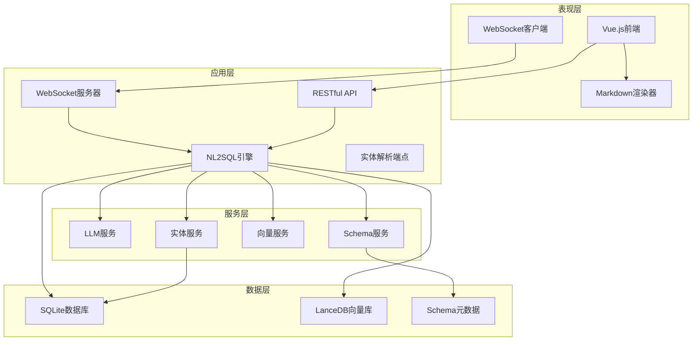

**图表来源**
- [app.js:88-111](file://NL2SQL/backend/src/app.js#L88-L111)
- [routes.js:1-538](file://NL2SQL/backend/src/core/routes.js#L1-L538)
- [markdownRenderer.js:1-258](file://NL2SQL/frontend/src/utils/markdownRenderer.js#L1-L258)

### 数据流架构

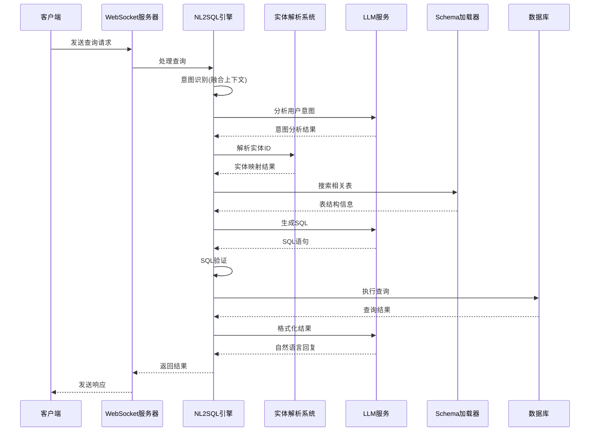

**图表来源**
- [wsHandler.js:197-247](file://NL2SQL/backend/src/core/wsHandler.js#L197-L247)
- [nl2sqlEngine.js:596-778](file://NL2SQL/backend/src/core/nl2sqlEngine.js#L596-L778)

## 详细组件分析

### NL2SQL引擎分析

NL2SQL引擎是系统的核心，实现了完整的自然语言到SQL转换流程：

#### 实体解析系统

**新增**实体解析系统(resolveEntity)支持模糊描述到具体ID的智能映射：

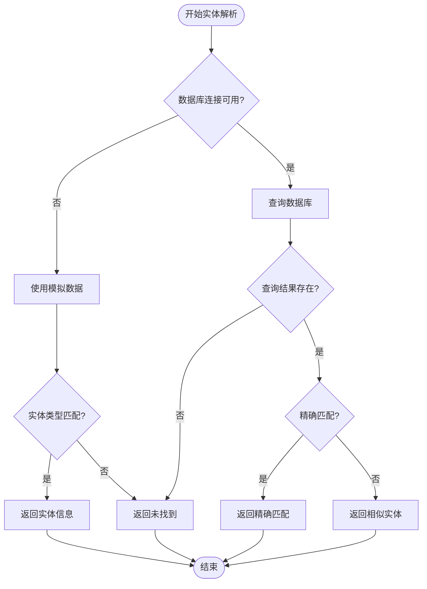

**图表来源**
- [nl2sqlEngine.js:38-104](file://NL2SQL/backend/src/core/nl2sqlEngine.js#L38-L104)

#### 增强的上下文意图分析

**更新**增强的analyzeIntent函数支持深度对话历史理解：

1. **上下文融合**：将最近5轮对话历史融入意图分析
2. **智能修正**：支持用户对之前查询的修改和替换
3. **上下文查询检测**：识别依赖上下文才能理解的查询
4. **置信度评估**：动态调整意图识别的置信度

**章节来源**
- [nl2sqlEngine.js:118-279](file://NL2SQL/backend/src/core/nl2sqlEngine.js#L118-L279)
- [nl2sqlEngine.js:856-891](file://NL2SQL/backend/src/core/nl2sqlEngine.js#L856-L891)

#### 智能LLM意图更新

**新增**updateIntentWithLLM函数实现更自然的对话体验：

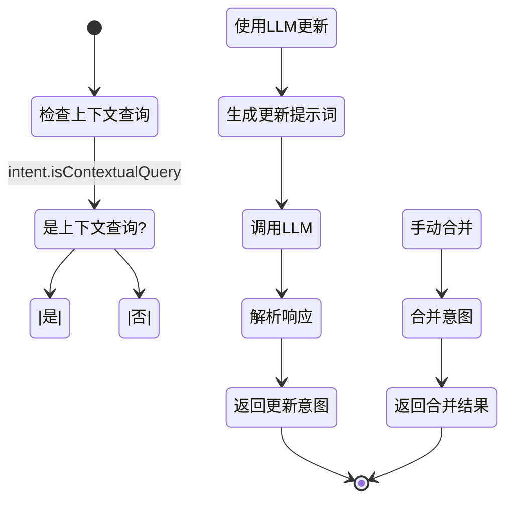

**图表来源**
- [nl2sqlEngine.js:342-406](file://NL2SQL/backend/src/core/nl2sqlEngine.js#L342-L406)

#### SQL生成策略

引擎采用多层次的SQL生成策略：

1. **Schema感知生成**：基于实际数据库结构生成SQL
2. **语义匹配**：使用向量搜索找到相关表
3. **安全验证**：多重安全检查防止恶意查询
4. **结果优化**：自动添加LIMIT限制和CTE结构
5. **上下文整合**：融合历史对话中的澄清信息

**章节来源**
- [nl2sqlEngine.js:490-639](file://NL2SQL/backend/src/core/nl2sqlEngine.js#L490-L639)
- [nl2sqlEngine.js:516-527](file://NL2SQL/backend/src/core/nl2sqlEngine.js#L516-L527)

### LLM服务架构

LLM服务提供了完整的语言模型交互能力：

#### HTTP请求封装

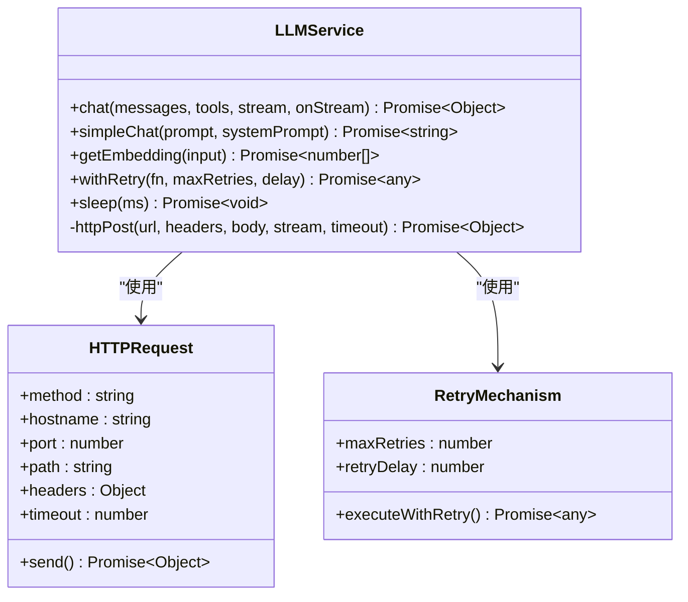

**图表来源**
- [llmService.js:41-152](file://NL2SQL/backend/src/core/llmService.js#L41-L152)
- [llmService.js:167-195](file://NL2SQL/backend/src/core/llmService.js#L167-L195)

#### 嵌入向量处理

LLM服务支持多种嵌入向量生成模式：

- **单文本嵌入**：生成单个文本的向量表示
- **批量嵌入**：支持批量处理提高效率
- **维度控制**：可配置向量维度满足不同需求

**章节来源**
- [llmService.js:287-311](file://NL2SQL/backend/src/core/llmService.js#L287-L311)
- [llmService.js:324-379](file://NL2SQL/backend/src/core/llmService.js#L324-L379)

### Schema加载器设计

Schema加载器负责管理数据库元数据：

#### 数据结构管理

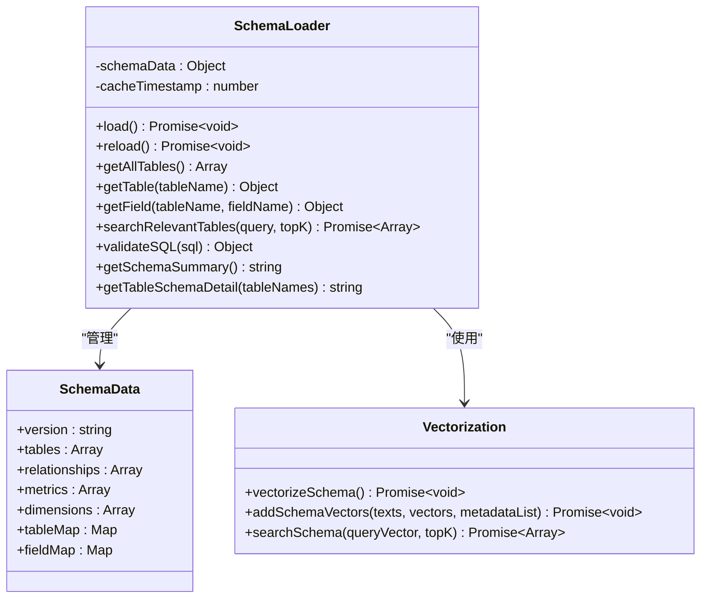

**图表来源**
- [schemaLoader.js:36-51](file://NL2SQL/backend/src/core/schemaLoader.js#L36-L51)
- [schemaLoader.js:195-290](file://NL2SQL/backend/src/core/schemaLoader.js#L195-L290)

#### 语义搜索功能

Schema加载器实现了智能的语义搜索：

1. **向量搜索**：使用LanceDB进行高效的向量相似度搜索
2. **关键词匹配**：作为向量搜索的后备方案
3. **混合排序**：结合语义相似度和关键词匹配结果

**章节来源**
- [schemaLoader.js:404-430](file://NL2SQL/backend/src/core/schemaLoader.js#L404-L430)
- [schemaLoader.js:439-480](file://NL2SQL/backend/src/core/schemaLoader.js#L439-L480)

### 向量存储系统

向量存储基于LanceDB实现，提供高性能的向量检索能力：

#### 存储架构

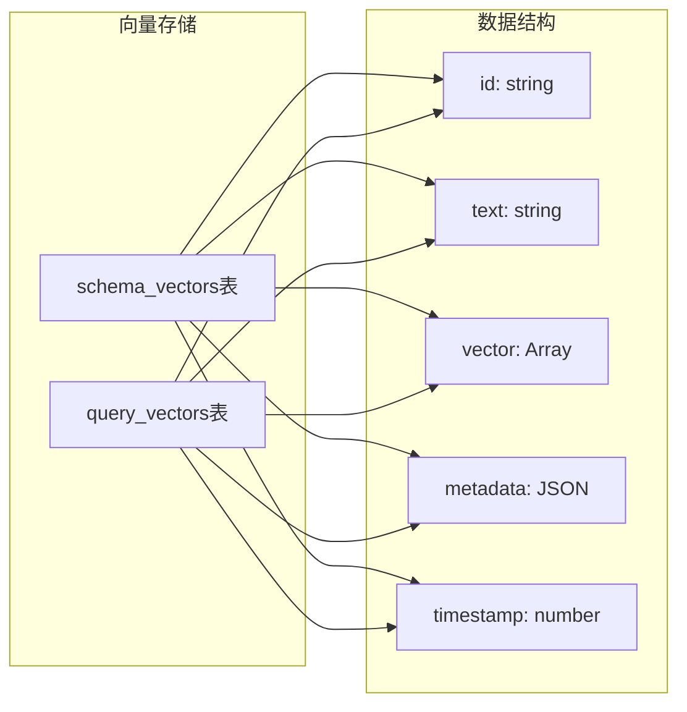

**图表来源**
- [vectorStore.js:101-180](file://NL2SQL/backend/src/memory/vectorStore.js#L101-L180)
- [vectorStore.js:254-271](file://NL2SQL/backend/src/memory/vectorStore.js#L254-L271)

#### 检索算法

向量存储支持多种检索模式：

- **精确匹配**：基于向量相似度的精确搜索
- **模糊匹配**：支持一定的语义偏差
- **批量检索**：支持同时处理多个查询

**章节来源**
- [vectorStore.js:201-230](file://NL2SQL/backend/src/memory/vectorStore.js#L201-L230)
- [vectorStore.js:281-307](file://NL2SQL/backend/src/memory/vectorStore.js#L281-L307)

### 数据库管理系统

数据库使用SQLite作为轻量级解决方案：

#### 表结构设计

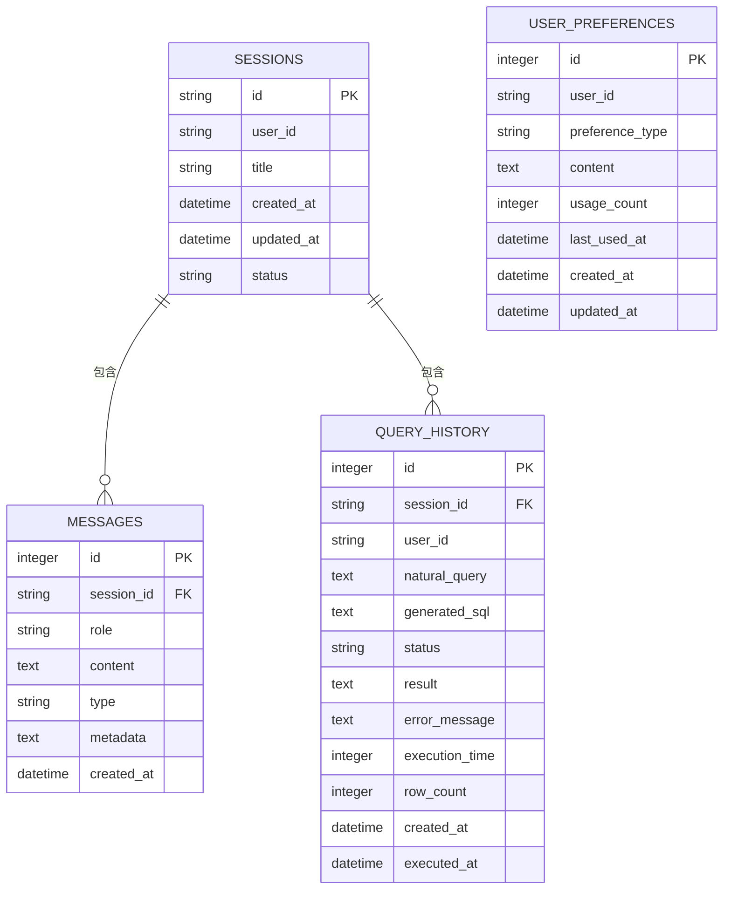

**图表来源**
- [database.js:39-187](file://NL2SQL/backend/src/core/database.js#L39-L187)

#### 事务管理

数据库支持完整的ACID事务：

- **原子性**：单个操作要么全部成功要么全部失败
- **一致性**：保持数据完整性约束
- **隔离性**：并发操作互不干扰
- **持久性**：提交的操作永久保存

**章节来源**
- [database.js:347-361](file://NL2SQL/backend/src/core/database.js#L347-L361)
- [database.js:277-340](file://NL2SQL/backend/src/core/database.js#L277-L340)

### WebSocket实时通信

WebSocket处理器实现了高效的实时通信：

#### 连接管理

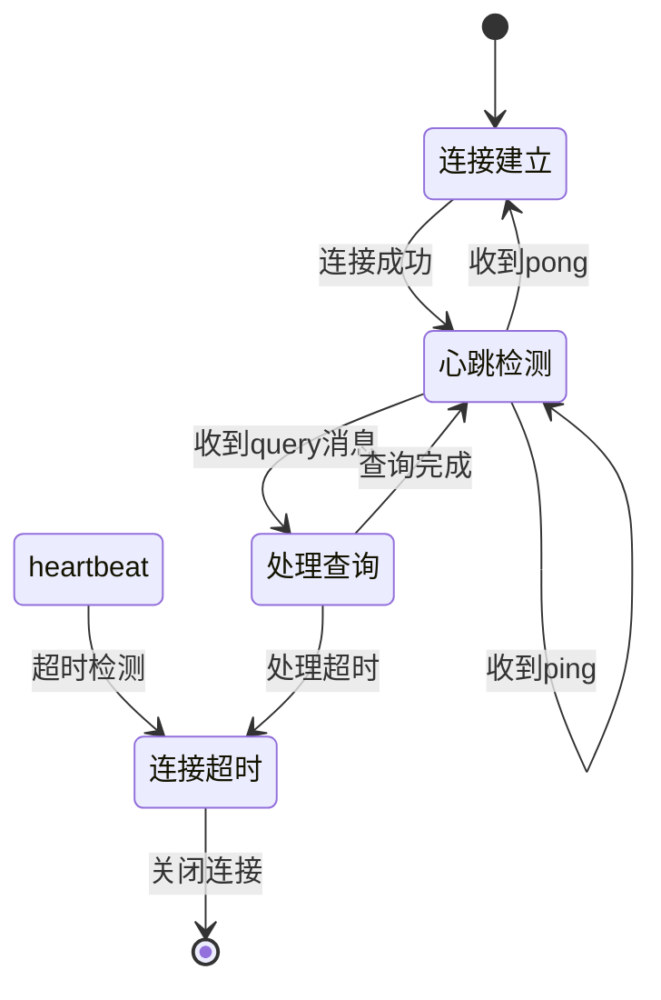

**图表来源**
- [wsHandler.js:37-44](file://NL2SQL/backend/src/core/wsHandler.js#L37-L44)
- [wsHandler.js:373-394](file://NL2SQL/backend/src/core/wsHandler.js#L373-L394)

#### 消息类型

WebSocket支持多种消息类型：

- **connected**：连接建立确认
- **ping/pong**：心跳检测
- **query**：查询请求
- **progress**：处理进度
- **result**：查询结果
- **clarify**：澄清请求
- **error**：错误信息

**章节来源**
- [wsHandler.js:139-175](file://NL2SQL/backend/src/core/wsHandler.js#L139-L175)
- [wsHandler.js:339-362](file://NL2SQL/backend/src/core/wsHandler.js#L339-L362)

### Markdown渲染系统

**新增**前端Markdown渲染系统，提供丰富的展示功能：

#### 渲染架构

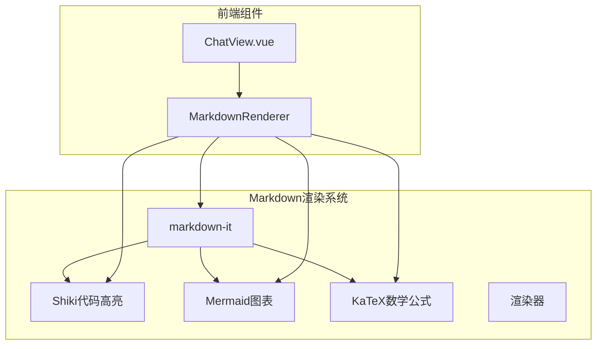

**图表来源**
- [markdownRenderer.js:1-258](file://NL2SQL/frontend/src/utils/markdownRenderer.js#L1-L258)
- [ChatView.vue:223-238](file://NL2SQL/frontend/src/views/ChatView.vue#L223-L238)

#### 功能特性

1. **Markdown解析**：使用markdown-it进行标准Markdown解析
2. **代码高亮**：集成Shiki支持多种编程语言
3. **图表渲染**：支持Mermaid流程图、序列图等
4. **数学公式**：使用KaTeX渲染LaTeX公式
5. **实时渲染**：异步渲染机制避免阻塞UI

**章节来源**
- [markdownRenderer.js:74-100](file://NL2SQL/frontend/src/utils/markdownRenderer.js#L74-L100)
- [markdownRenderer.js:156-170](file://NL2SQL/frontend/src/utils/markdownRenderer.js#L156-L170)
- [ChatView.vue:35-51](file://NL2SQL/frontend/src/views/ChatView.vue#L35-L51)

## 依赖关系分析

系统具有清晰的依赖层次结构：

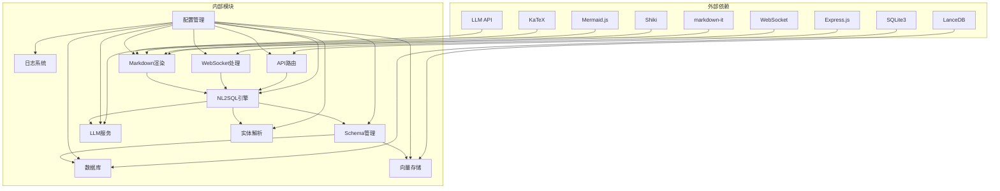

**图表来源**
- [package.json:10-21](file://NL2SQL/backend/package.json#L10-L21)
- [package.json:11-24](file://NL2SQL/frontend/package.json#L11-L24)

### 核心依赖关系

系统的关键依赖关系包括：

1. **配置驱动**：所有模块都依赖配置管理
2. **日志统一**：所有模块使用统一的日志系统
3. **数据层抽象**：数据库和向量存储提供统一接口
4. **服务层封装**：LLM服务和Schema服务提供标准化接口
5. **渲染层集成**：前端组件依赖Markdown渲染系统

**章节来源**
- [config.js:16-246](file://NL2SQL/backend/src/core/config.js#L16-L246)
- [logger.js:51-318](file://NL2SQL/backend/src/utils/logger.js#L51-L318)

## 性能考虑

系统在设计时充分考虑了性能优化：

### 缓存策略

1. **Schema缓存**：Schema元数据缓存1小时
2. **向量缓存**：向量数据持久化存储
3. **会话缓存**：近期会话消息缓存
4. **LLM缓存**：常用查询结果缓存
5. **实体缓存**：实体映射结果缓存

### 并发处理

1. **连接池**：数据库连接池管理
2. **队列处理**：WebSocket消息队列
3. **异步处理**：非阻塞I/O操作
4. **超时控制**：防止资源泄漏
5. **渲染优化**：异步Markdown渲染避免UI阻塞

### 内存管理

1. **流式处理**：大数据流式传输
2. **垃圾回收**：及时释放内存资源
3. **连接复用**：减少连接创建开销
4. **批量操作**：数据库批量处理
5. **渲染节流**：避免频繁的DOM更新

## 故障排除指南

### 常见问题诊断

#### 1. LLM API连接问题

**症状**：查询超时或LLM调用失败

**排查步骤**：
1. 检查API密钥配置
2. 验证网络连接
3. 查看API响应状态
4. 检查重试机制

**解决方法**：
- 更新正确的API密钥
- 检查防火墙设置
- 增加超时时间
- 配置代理服务器

#### 2. 数据库连接问题

**症状**：SQLite连接失败或查询超时

**排查步骤**：
1. 检查数据库文件权限
2. 验证数据库路径配置
3. 查看磁盘空间
4. 检查并发连接数

**解决方法**：
- 修复文件权限
- 更新数据库路径
- 清理磁盘空间
- 调整连接池大小

#### 3. 向量数据库问题

**症状**：向量搜索失败或性能下降

**排查步骤**：
1. 检查LanceDB安装
2. 验证向量维度配置
3. 查看磁盘空间
4. 检查向量索引

**解决方法**：
- 重新安装LanceDB
- 调整向量维度
- 清理向量存储
- 重建向量索引

#### 4. WebSocket连接问题

**症状**：实时通信中断或消息丢失

**排查步骤**：
1. 检查网络连接
2. 验证心跳机制
3. 查看连接数限制
4. 检查消息队列

**解决方法**：
- 修复网络连接
- 调整心跳间隔
- 增加连接数限制
- 清理消息队列

#### 5. 实体解析问题

**症状**：模糊描述无法映射到具体ID

**排查步骤**：
1. 检查数据库连接
2. 验证实体类型配置
3. 查看日志错误信息
4. 检查模拟数据配置

**解决方法**：
- 修复数据库连接
- 更新实体映射配置
- 检查实体表结构
- 增加实体映射规则

#### 6. Markdown渲染问题

**症状**：Markdown内容显示异常

**排查步骤**：
1. 检查Shiki初始化
2. 验证Mermaid配置
3. 查看KaTeX版本
4. 检查CSS样式

**解决方法**：
- 重新初始化Shiki
- 检查Mermaid配置
- 更新KaTeX版本
- 修复CSS样式冲突

### 日志分析

系统提供了详细的日志记录功能：

#### 日志级别

- **DEBUG**：开发调试信息
- **INFO**：一般运行信息
- **WARN**：警告信息
- **ERROR**：错误信息

#### 日志配置

```javascript
// 日志级别配置
LOG_LEVEL=info

// 日志文件配置
LOG_FILE=./logs/app.log
LOG_MAX_SIZE=10MB
LOG_MAX_FILES=5
```

**章节来源**
- [logger.js:28-41](file://NL2SQL/backend/src/utils/logger.js#L28-L41)
- [config.js:195-208](file://NL2SQL/backend/src/core/config.js#L195-L208)

## 结论

NL2SQL自然语言到SQL系统是一个功能完整、架构清晰的智能数据查询平台。系统的主要优势包括：

### 技术优势

1. **架构设计**：采用微服务架构，模块职责清晰
2. **技术栈**：使用成熟稳定的技术栈
3. **扩展性**：良好的模块化设计便于功能扩展
4. **性能**：多层缓存和优化机制保证性能
5. **智能化**：新增实体解析和上下文理解能力
6. **用户体验**：集成Markdown渲染提供丰富展示

### 功能特色

1. **智能查询**：基于LLM的自然语言理解
2. **语义检索**：向量数据库实现智能匹配
3. **实时交互**：WebSocket实现实时通信
4. **安全控制**：多重安全验证机制
5. **实体映射**：模糊描述到具体ID的智能解析
6. **上下文理解**：深度融合对话历史的智能分析
7. **富文本展示**：Markdown渲染提供美观界面

### 应用价值

该系统为企业提供了直观的数据查询方式，降低了数据分析门槛，提高了工作效率。通过自然语言交互，用户可以轻松获取所需的数据洞察，而无需具备专业的SQL知识。

### 发展方向

未来可以考虑的功能增强：
- 支持更多数据库类型
- 增强机器学习能力
- 优化移动端体验
- 扩展多语言支持
- 集成更多图表类型
- 增强实体解析准确性

系统为构建企业级智能数据查询平台奠定了坚实的基础，具有广阔的应用前景和发展潜力。