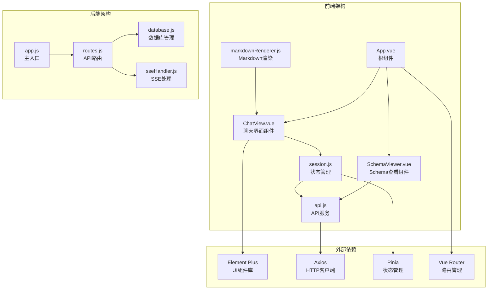
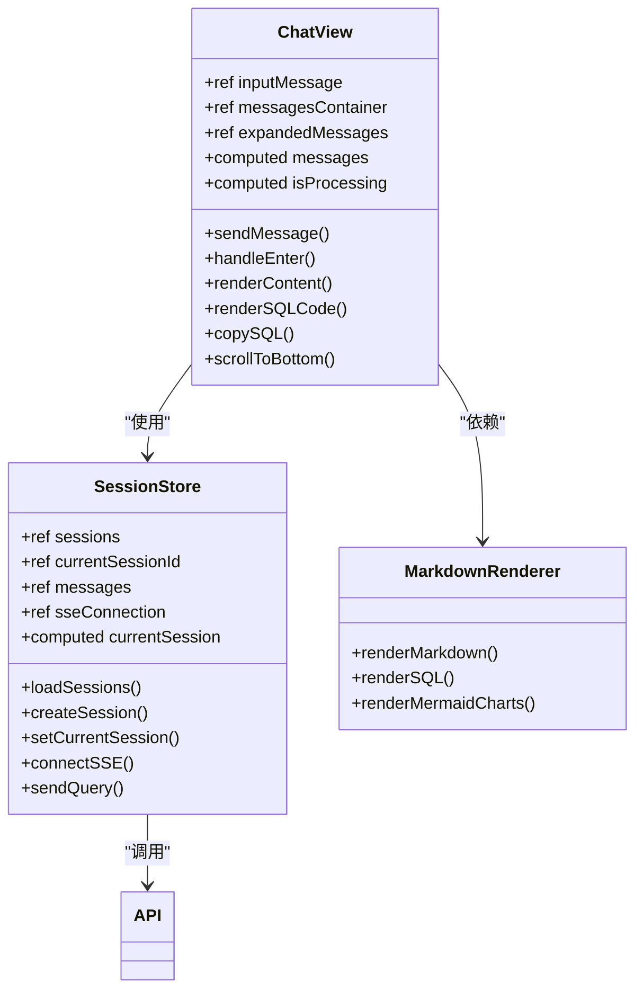
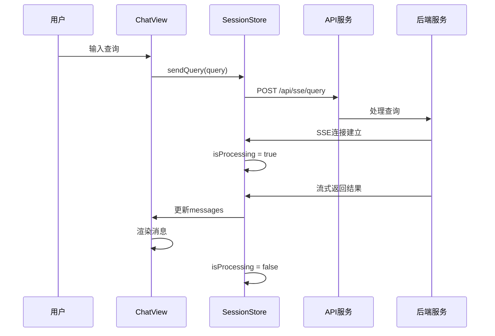
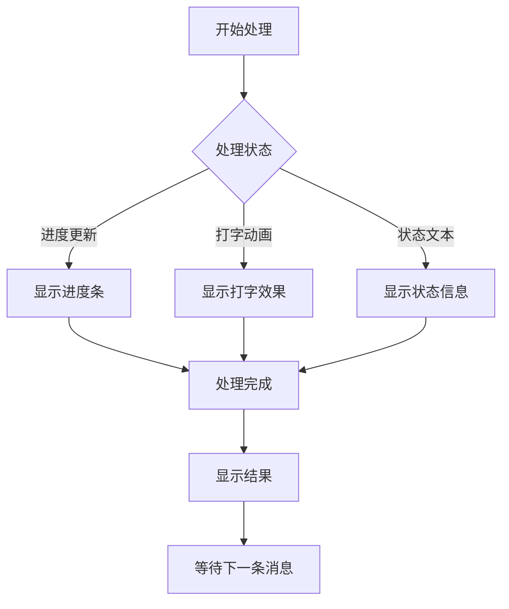
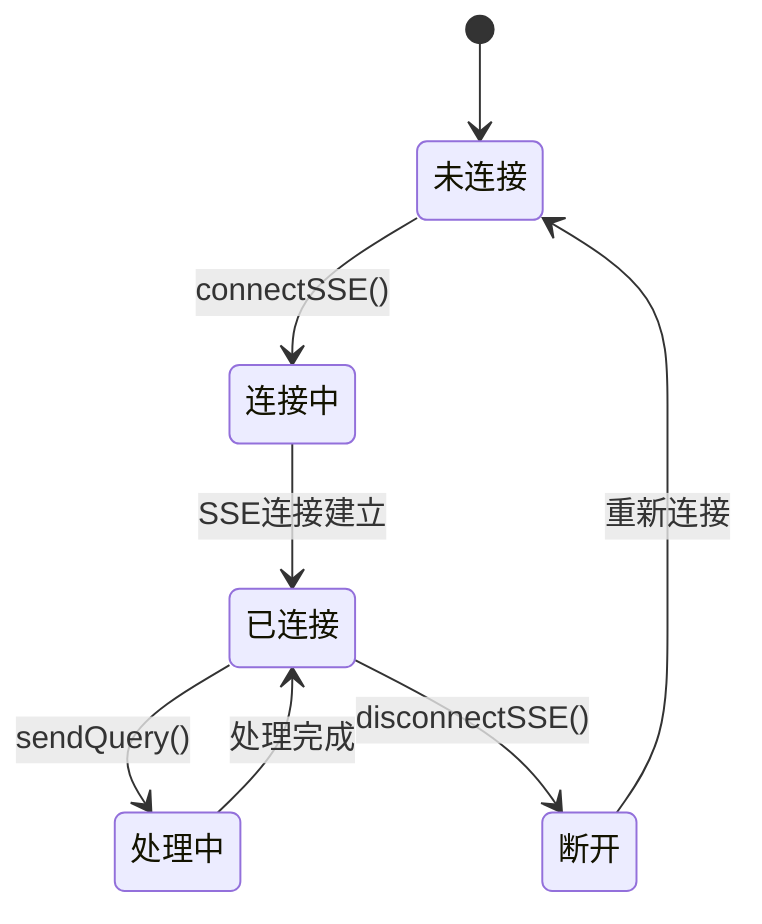
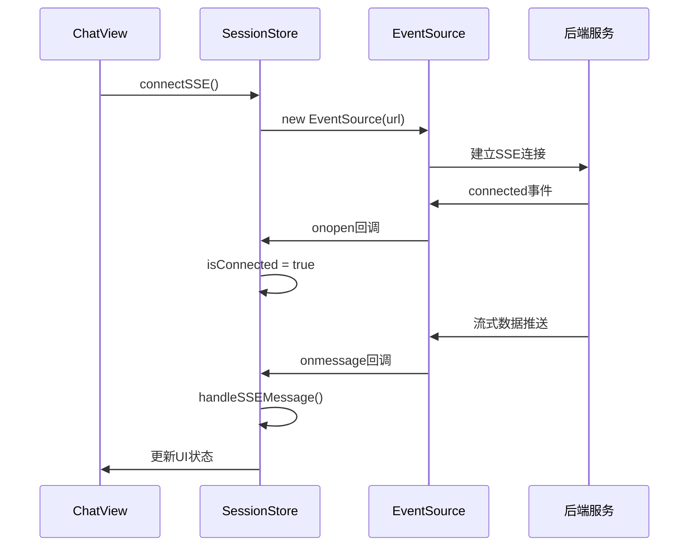
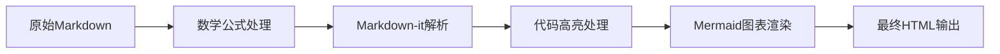
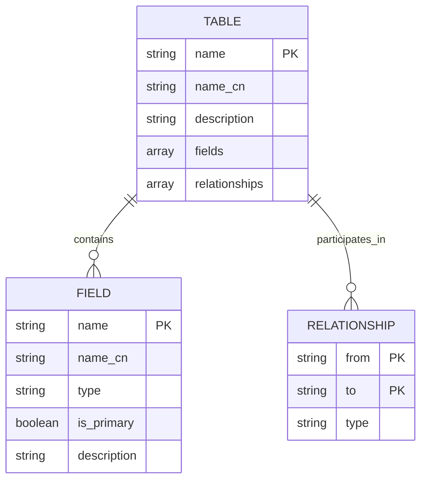

# ChatView UI增强功能

<cite>
**本文档引用的文件**
- [ChatView.vue](file://NL2SQL/frontend/src/views/ChatView.vue)
- [SchemaViewer.vue](file://NL2SQL/frontend/src/components/SchemaViewer.vue)
- [session.js](file://NL2SQL/frontend/src/stores/session.js)
- [api.js](file://NL2SQL/frontend/src/utils/api.js)
- [App.vue](file://NL2SQL/frontend/src/App.vue)
- [markdownRenderer.js](file://NL2SQL/frontend/src/utils/markdownRenderer.js)
- [index.js](file://NL2SQL/frontend/src/router/index.js)
- [vite.config.js](file://NL2SQL/frontend/vite.config.js)
- [app.js](file://NL2SQL/backend/src/app.js)
- [routes.js](file://NL2SQL/backend/src/core/routes.js)
</cite>

## 目录
1. [简介](#简介)
2. [项目结构概览](#项目结构概览)
3. [核心组件架构](#核心组件架构)
4. [ChatView UI增强功能详解](#chatview-ui增强功能详解)
5. [状态管理系统](#状态管理系统)
6. [实时通信机制](#实时通信机制)
7. [Markdown渲染增强](#markdown渲染增强)
8. [Schema集成与数据可视化](#schema集成与数据可视化)
9. [性能优化策略](#性能优化策略)
10. [故障排除指南](#故障排除指南)
11. [总结](#总结)

## 简介

ChatView 是 NL2SQL 项目中的核心聊天界面组件，专门设计用于自然语言到 SQL 查询的转换和展示。该组件实现了现代化的聊天界面，支持实时消息流、智能内容渲染、数据表格展示以及丰富的交互功能。

NL2SQL 是一个基于自然语言的数据查询系统，通过 AI 技术将用户的自然语言查询转换为精确的 SQL 语句，同时提供可视化的数据展示和 Schema 管理功能。

## 项目结构概览

NL2SQL 采用前后端分离架构，前端使用 Vue 3 + Vite 构建，后端使用 Node.js + Express 提供 RESTful API 和 Server-Sent Events 服务。

**图表来源**
- [ChatView.vue:1-776](file://NL2SQL/frontend/src/views/ChatView.vue#L1-L776)
- [session.js:1-398](file://NL2SQL/frontend/src/stores/session.js#L1-L398)
- [app.js:1-200](file://NL2SQL/backend/src/app.js#L1-L200)

**章节来源**
- [ChatView.vue:1-776](file://NL2SQL/frontend/src/views/ChatView.vue#L1-L776)
- [App.vue:1-362](file://NL2SQL/frontend/src/App.vue#L1-L362)
- [vite.config.js:1-93](file://NL2SQL/frontend/vite.config.js#L1-L93)

## 核心组件架构

### ChatView 组件结构

ChatView 采用 Composition API 设计模式，实现了完整的聊天界面功能：

**图表来源**
- [ChatView.vue:132-381](file://NL2SQL/frontend/src/views/ChatView.vue#L132-L381)
- [session.js:33-397](file://NL2SQL/frontend/src/stores/session.js#L33-L397)

### 状态管理模式

系统采用 Pinia 状态管理，实现了响应式的状态共享：

**图表来源**
- [session.js:299-328](file://NL2SQL/frontend/src/stores/session.js#L299-L328)
- [routes.js:564-594](file://NL2SQL/backend/src/core/routes.js#L564-L594)

**章节来源**
- [session.js:1-398](file://NL2SQL/frontend/src/stores/session.js#L1-L398)
- [ChatView.vue:132-381](file://NL2SQL/frontend/src/views/ChatView.vue#L132-L381)

## ChatView UI增强功能详解

### 消息展示系统

ChatView 实现了智能的消息展示系统，支持多种消息类型：

#### 用户消息展示
- **自动折叠长内容**：超过阈值的内容自动折叠，用户可点击展开
- **响应式布局**：右对齐的用户消息气泡
- **展开/折叠控制**：提供直观的展开/折叠按钮

#### 助手消息展示
- **Markdown渲染**：支持标题、列表、代码块、表格等丰富格式
- **SQL代码高亮**：使用 Shiki 实现 SQL 语法高亮
- **数据表格展示**：动态生成数据表格，支持滚动查看

### 实时处理状态指示器

系统提供了完整的实时处理反馈机制：

**图表来源**
- [ChatView.vue:81-100](file://NL2SQL/frontend/src/views/ChatView.vue#L81-L100)
- [session.js:227-293](file://NL2SQL/frontend/src/stores/session.js#L227-L293)

### 输入交互增强

#### 智能键盘处理
- **Enter发送**：默认发送消息
- **Shift+Enter换行**：在文本域中换行
- **输入验证**：防止空消息发送

#### 自动滚动功能
- **消息新增时自动滚动**
- **处理状态变化时滚动到底部**
- **组件卸载时清理滚动位置**

**章节来源**
- [ChatView.vue:196-227](file://NL2SQL/frontend/src/views/ChatView.vue#L196-L227)
- [ChatView.vue:295-302](file://NL2SQL/frontend/src/views/ChatView.vue#L295-L302)

## 状态管理系统

### SessionStore 状态架构

SessionStore 使用 Pinia 的组合式 API，实现了完整的会话管理：

**图表来源**
- [session.js:185-221](file://NL2SQL/frontend/src/stores/session.js#L185-L221)
- [session.js:299-328](file://NL2SQL/frontend/src/stores/session.js#L299-L328)

### 状态响应式更新

系统实现了多层次的状态响应式更新：

1. **消息状态**：实时更新聊天消息列表
2. **处理状态**：跟踪查询处理进度
3. **连接状态**：监控 SSE 连接状态
4. **路由状态**：响应会话切换

**章节来源**
- [session.js:33-397](file://NL2SQL/frontend/src/stores/session.js#L33-L397)
- [ChatView.vue:171-180](file://NL2SQL/frontend/src/views/ChatView.vue#L171-L180)

## 实时通信机制

### SSE（Server-Sent Events）集成

系统采用 SSE 实现后端到前端的实时数据推送：

#### 连接建立流程

**图表来源**
- [session.js:185-221](file://NL2SQL/frontend/src/stores/session.js#L185-L221)
- [routes.js:549-551](file://NL2SQL/backend/src/core/routes.js#L549-L551)

#### 消息类型处理

系统支持多种 SSE 消息类型：

| 消息类型 | 用途 | 数据结构 |
|---------|------|----------|
| `connected` | 连接确认 | `{ message: string }` |
| `processing` | 开始处理 | `{ message: string }` |
| `progress` | 进度更新 | `{ message: string, progress: number }` |
| `result` | 查询结果 | `{ message: string, sql: string, data: array }` |
| `clarify` | 需要澄清 | `{ message: string }` |
| `error` | 错误信息 | `{ message: string }` |

**章节来源**
- [session.js:227-293](file://NL2SQL/frontend/src/stores/session.js#L227-L293)
- [routes.js:549-594](file://NL2SQL/backend/src/core/routes.js#L549-L594)

## Markdown渲染增强

### 多格式支持

markdownRenderer.js 提供了丰富的 Markdown 渲染能力：

#### 支持的渲染格式
- **标准 Markdown**：标题、段落、列表、链接
- **代码高亮**：多语言语法高亮支持
- **Mermaid 图表**：流程图、序列图、甘特图
- **数学公式**：KaTeX 数学公式渲染
- **表格渲染**：复杂表格格式支持

#### 渲染流程优化

**图表来源**
- [markdownRenderer.js:181-196](file://NL2SQL/frontend/src/utils/markdownRenderer.js#L181-L196)
- [markdownRenderer.js:203-220](file://NL2SQL/frontend/src/utils/markdownRenderer.js#L203-L220)

**章节来源**
- [markdownRenderer.js:1-258](file://NL2SQL/frontend/src/utils/markdownRenderer.js#L1-L258)
- [ChatView.vue:263-278](file://NL2SQL/frontend/src/views/ChatView.vue#L263-L278)

## Schema集成与数据可视化

### SchemaViewer 组件

SchemaViewer 提供了完整的数据 Schema 查看功能：

#### 核心功能特性
- **搜索过滤**：支持表名、字段名、描述的多维搜索
- **折叠面板**：组织化的表结构展示
- **关联关系**：显示表之间的关联关系
- **字段详情**：展示字段类型、主键标识等信息

#### 数据结构展示

**图表来源**
- [SchemaViewer.vue:138-143](file://NL2SQL/frontend/src/components/SchemaViewer.vue#L138-L143)

**章节来源**
- [SchemaViewer.vue:1-317](file://NL2SQL/frontend/src/components/SchemaViewer.vue#L1-L317)
- [App.vue:74-76](file://NL2SQL/frontend/src/App.vue#L74-L76)

## 性能优化策略

### 前端性能优化

#### 懒加载与代码分割
- **路由懒加载**：非关键页面组件按需加载
- **第三方库分离**：Element Plus、ECharts 独立打包
- **手动分块**：关键依赖独立打包优化加载

#### 内存管理
- **组件卸载清理**：自动清理 SSE 连接
- **状态清理**：组件销毁时清理响应式状态
- **DOM 优化**：虚拟滚动避免大量 DOM 元素

#### 渲染优化
- **条件渲染**：根据状态动态渲染组件
- **计算属性缓存**：避免重复计算
- **响应式更新优化**：批量更新状态

### 后端性能优化

#### SSE 连接管理
- **连接池管理**：合理管理并发连接
- **心跳机制**：维持连接稳定性
- **错误恢复**：自动重连机制

#### 数据库优化
- **索引优化**：Schema 查询使用索引
- **查询缓存**：常用查询结果缓存
- **连接池**：数据库连接复用

**章节来源**
- [vite.config.js:72-91](file://NL2SQL/frontend/vite.config.js#L72-L91)
- [session.js:333-339](file://NL2SQL/frontend/src/stores/session.js#L333-L339)

## 故障排除指南

### 常见问题诊断

#### SSE 连接问题
**症状**：消息无法实时更新
**排查步骤**：
1. 检查后端服务是否启动
2. 验证 CORS 配置
3. 检查网络连接状态
4. 查看浏览器控制台错误

#### 消息渲染问题
**症状**：Markdown 或 SQL 无法正确显示
**排查步骤**：
1. 验证 Shiki 高亮器初始化
2. 检查 Markdown-it 配置
3. 确认代码语言标识
4. 查看渲染错误日志

#### 状态同步问题
**症状**：UI 状态与实际状态不一致
**排查步骤**：
1. 检查 Pinia 状态更新
2. 验证响应式绑定
3. 确认组件生命周期
4. 查看状态变更日志

### 调试工具使用

#### 浏览器开发者工具
- **Network 面板**：监控 API 请求和 SSE 连接
- **Vue DevTools**：调试 Vue 组件状态
- **Performance 面板**：分析性能瓶颈
- **Elements 面板**：检查 DOM 结构

#### 后端日志分析
- **请求日志**：分析 API 调用链
- **错误日志**：定位异常原因
- **性能日志**：监控系统性能
- **SSE 日志**：跟踪连接状态

**章节来源**
- [session.js:214-217](file://NL2SQL/frontend/src/stores/session.js#L214-L217)
- [routes.js:616-622](file://NL2SQL/backend/src/core/routes.js#L616-L622)

## 总结

ChatView UI 增强功能展现了现代前端开发的最佳实践，通过以下关键技术实现了优秀的用户体验：

### 核心优势

1. **实时性**：基于 SSE 的实时消息推送，提供流畅的交互体验
2. **智能化**：自动内容折叠、智能状态指示、响应式布局
3. **丰富性**：支持多种内容格式，包括 Markdown、SQL、数据表格
4. **可靠性**：完善的错误处理和状态管理机制
5. **性能**：优化的渲染策略和资源管理

### 技术亮点

- **Composition API**：现代化的 Vue 3 开发模式
- **Pinia 状态管理**：类型安全的状态管理方案
- **SSE 集成**：高效的实时通信机制
- **Markdown 渲染**：丰富的内容展示能力
- **Schema 集成**：完整的数据模型管理

### 应用价值

NL2SQL 系统通过 ChatView 的增强功能，为用户提供了一个专业、易用、可靠的自然语言数据查询平台，显著提升了数据分析的效率和准确性。

该系统不仅展示了技术实现的先进性，更重要的是体现了以用户为中心的设计理念，通过直观的界面和智能的功能，降低了数据查询的技术门槛，让非技术用户也能轻松进行复杂的数据分析。