# NL2SQL前端增强功能

<cite>
**本文档引用的文件**
- [package.json](file://NL2SQL/frontend/package.json)
- [main.js](file://NL2SQL/frontend/src/main.js)
- [App.vue](file://NL2SQL/frontend/src/App.vue)
- [vite.config.js](file://NL2SQL/frontend/vite.config.js)
- [index.js](file://NL2SQL/frontend/src/router/index.js)
- [session.js](file://NL2SQL/frontend/src/stores/session.js)
- [index.js](file://NL2SQL/frontend/src/stores/index.js)
- [ChatView.vue](file://NL2SQL/frontend/src/views/ChatView.vue)
- [HomeView.vue](file://NL2SQL/frontend/src/views/HomeView.vue)
- [SchemaViewer.vue](file://NL2SQL/frontend/src/components/SchemaViewer.vue)
- [api.js](file://NL2SQL/frontend/src/utils/api.js)
- [markdownRenderer.js](file://NL2SQL/frontend/src/utils/markdownRenderer.js)
- [global.css](file://NL2SQL/frontend/src/styles/global.css)
- [HistoryView.vue](file://NL2SQL/frontend/src/views/HistoryView.vue)
- [MemoryView.vue](file://NL2SQL/frontend/src/views/MemoryView.vue)
</cite>

## 目录
1. [项目概述](#项目概述)
2. [项目结构](#项目结构)
3. [核心组件](#核心组件)
4. [架构概览](#架构概览)
5. [详细组件分析](#详细组件分析)
6. [依赖关系分析](#依赖关系分析)
7. [性能考虑](#性能考虑)
8. [故障排除指南](#故障排除指南)
9. [结论](#结论)

## 项目概述

NL2SQL前端增强功能是一个基于Vue 3的现代化自然语言数据查询系统，旨在通过自然语言描述自动生成SQL查询。该项目集成了多种前沿技术栈，包括Vue 3 Composition API、Element Plus UI组件库、Pinia状态管理、以及丰富的可视化和渲染工具。

### 主要功能特性

- **自然语言查询**：用户可以通过自然语言描述数据需求，系统自动转换为SQL查询
- **实时会话管理**：支持多会话创建、切换和历史记录管理
- **SSE流式传输**：实时接收查询处理进度和结果
- **Schema可视化**：提供数据表结构的交互式查看功能
- **Markdown渲染**：支持富文本格式化和代码高亮
- **长期记忆管理**：维护用户偏好和查询模式

## 项目结构

NL2SQL前端采用模块化的Vue 3应用架构，主要分为以下几个核心模块：

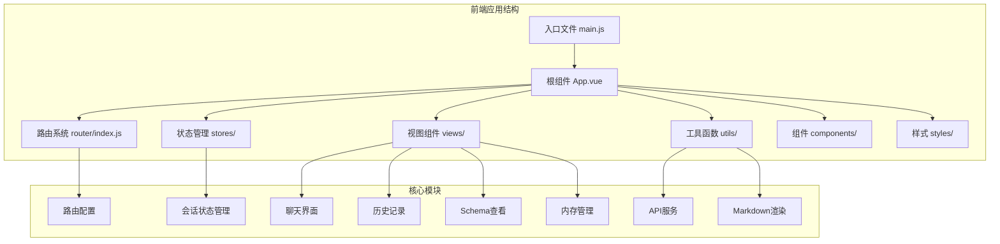

**图表来源**
- [main.js:1-89](file://NL2SQL/frontend/src/main.js#L1-L89)
- [App.vue:1-373](file://NL2SQL/frontend/src/App.vue#L1-L373)
- [index.js:1-147](file://NL2SQL/frontend/src/router/index.js#L1-L147)

**章节来源**
- [package.json:1-36](file://NL2SQL/frontend/package.json#L1-L36)
- [vite.config.js:1-93](file://NL2SQL/frontend/vite.config.js#L1-L93)

## 核心组件

### Vue 3应用入口

应用入口文件负责初始化Vue应用实例、安装必要的插件，并配置全局组件。

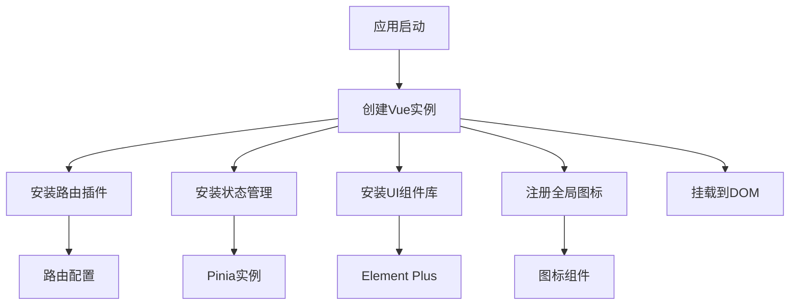

**图表来源**
- [main.js:55-89](file://NL2SQL/frontend/src/main.js#L55-L89)

### 根组件架构

根组件App.vue实现了完整的应用布局，包含侧边栏导航、主内容区域和Schema查看弹窗。

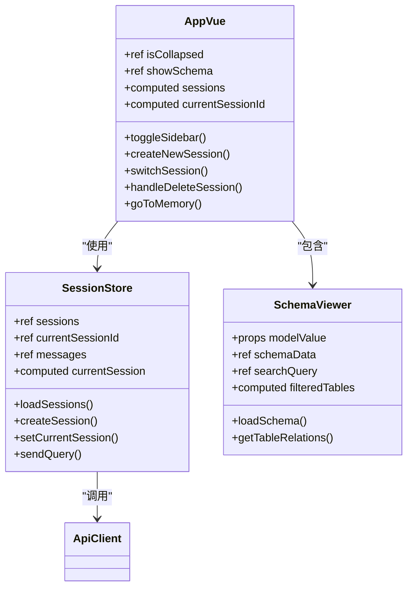

**图表来源**
- [App.vue:82-230](file://NL2SQL/frontend/src/App.vue#L82-L230)
- [session.js:33-397](file://NL2SQL/frontend/src/stores/session.js#L33-L397)
- [SchemaViewer.vue:89-257](file://NL2SQL/frontend/src/components/SchemaViewer.vue#L89-L257)

**章节来源**
- [App.vue:1-373](file://NL2SQL/frontend/src/App.vue#L1-L373)
- [session.js:1-398](file://NL2SQL/frontend/src/stores/session.js#L1-L398)

## 架构概览

NL2SQL前端采用分层架构设计，清晰分离关注点并提供良好的可扩展性。

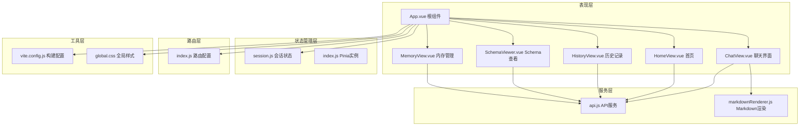

**图表来源**
- [App.vue:1-373](file://NL2SQL/frontend/src/App.vue#L1-L373)
- [session.js:1-398](file://NL2SQL/frontend/src/stores/session.js#L1-L398)
- [index.js:1-147](file://NL2SQL/frontend/src/router/index.js#L1-L147)
- [api.js:1-252](file://NL2SQL/frontend/src/utils/api.js#L1-L252)

## 详细组件分析

### 会话状态管理系统

会话状态管理是整个应用的核心，负责管理用户会话、消息历史和SSE连接。

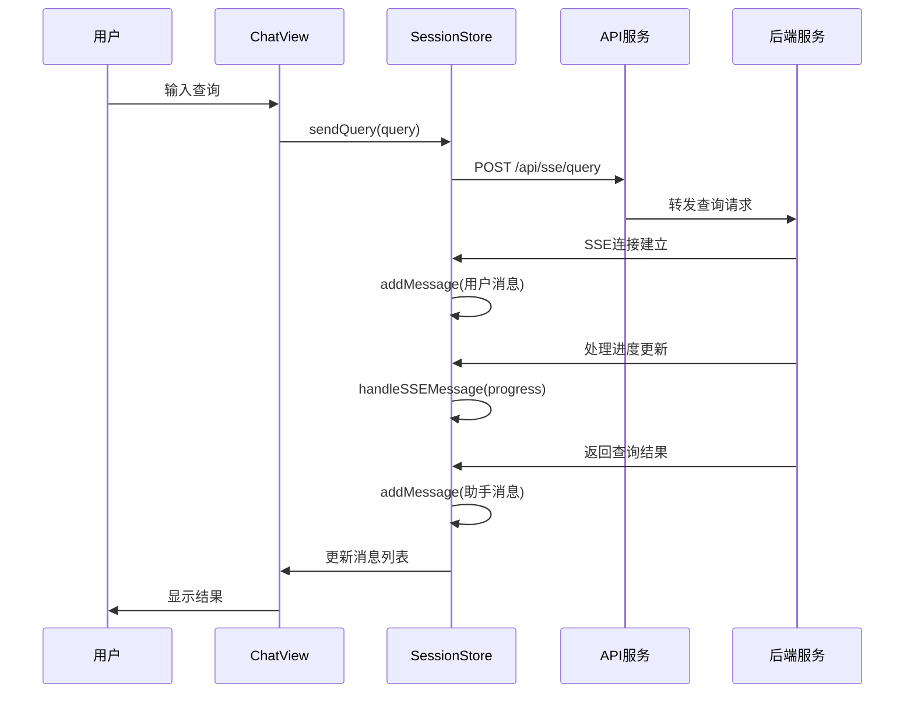

**图表来源**
- [ChatView.vue:196-325](file://NL2SQL/frontend/src/views/ChatView.vue#L196-L325)
- [session.js:299-328](file://NL2SQL/frontend/src/stores/session.js#L299-L328)

#### 状态管理架构

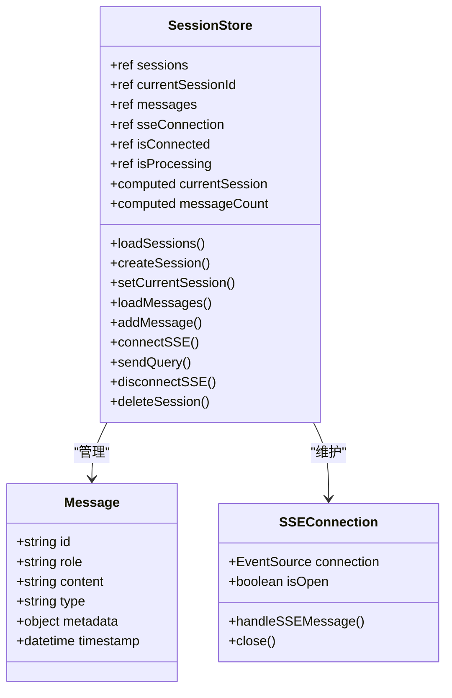

**图表来源**
- [session.js:33-397](file://NL2SQL/frontend/src/stores/session.js#L33-L397)

**章节来源**
- [session.js:1-398](file://NL2SQL/frontend/src/stores/session.js#L1-L398)

### 聊天界面组件

聊天界面提供了完整的自然语言查询体验，支持消息显示、实时更新和结果展示。

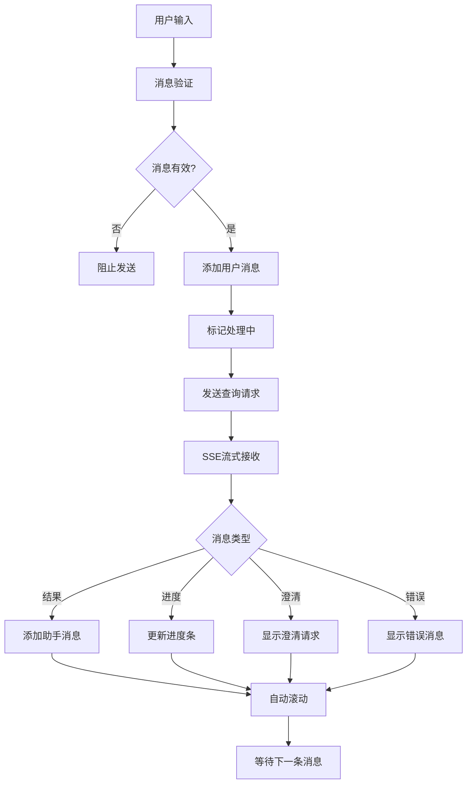

**图表来源**
- [ChatView.vue:196-381](file://NL2SQL/frontend/src/views/ChatView.vue#L196-L381)

#### Markdown渲染系统

应用集成了强大的Markdown渲染能力，支持多种格式化选项和代码高亮。

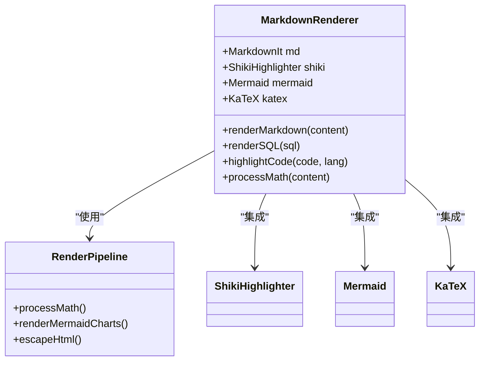

**图表来源**
- [markdownRenderer.js:15-258](file://NL2SQL/frontend/src/utils/markdownRenderer.js#L15-L258)

**章节来源**
- [ChatView.vue:1-776](file://NL2SQL/frontend/src/views/ChatView.vue#L1-L776)
- [markdownRenderer.js:1-258](file://NL2SQL/frontend/src/utils/markdownRenderer.js#L1-L258)

### Schema查看组件

Schema查看组件提供了数据表结构的交互式浏览功能，支持搜索和筛选。

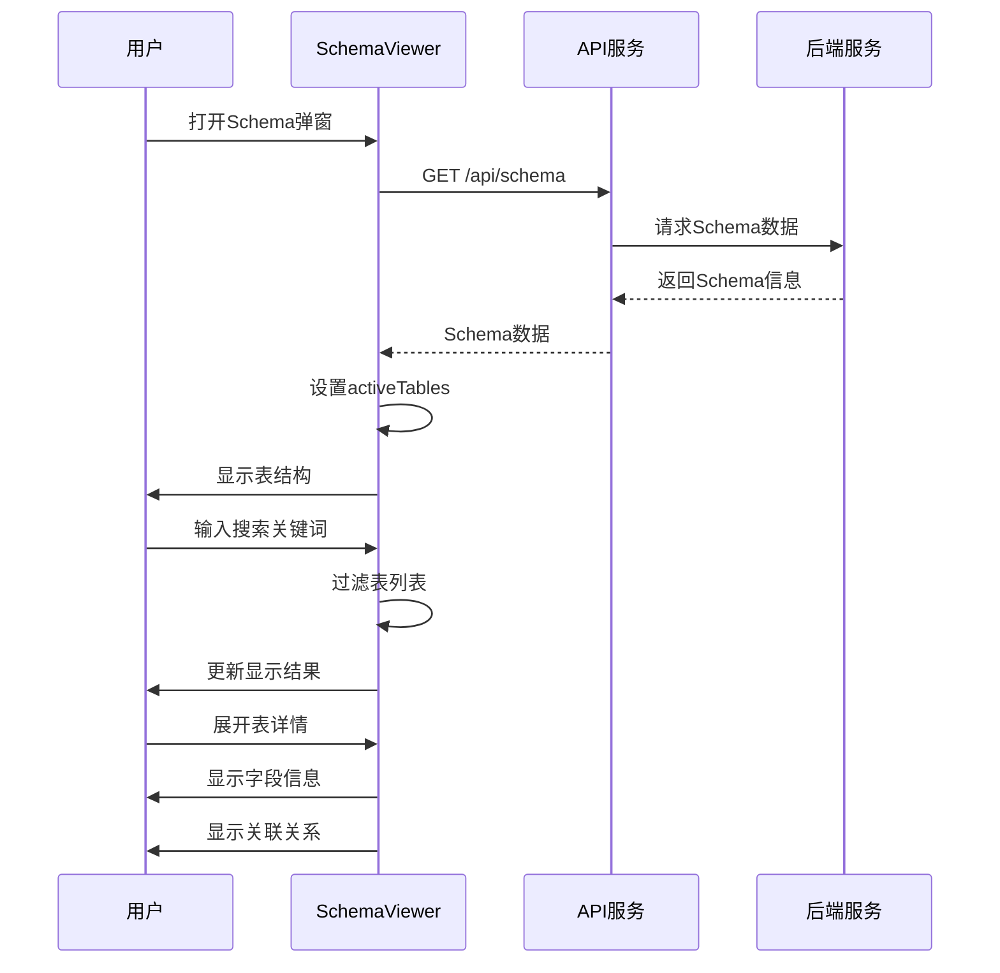

**图表来源**
- [SchemaViewer.vue:191-256](file://NL2SQL/frontend/src/components/SchemaViewer.vue#L191-L256)

**章节来源**
- [SchemaViewer.vue:1-317](file://NL2SQL/frontend/src/components/SchemaViewer.vue#L1-L317)

### 路由系统

应用使用Vue Router实现单页面应用的路由管理，支持动态路由和路由守卫。

```mermaid
flowchart LR
A[路由配置] --> B[首页 /]
A --> C[聊天 /chat/:sessionId?]
A --> D[历史记录 /history]
A --> E[Schema /schema]
A --> F[内存 /memory]
A --> G[404 /:pathMatch(.*)*]
B --> H[HomeView]
C --> I[ChatView]
D --> J[HistoryView]
E --> K[SchemaView]
F --> L[MemoryView]
G --> M[NotFoundView]
N[全局前置守卫] --> O[设置页面标题]
O --> P[导航放行]
```

**图表来源**
- [index.js:34-99](file://NL2SQL/frontend/src/router/index.js#L34-L99)
- [index.js:132-140](file://NL2SQL/frontend/src/router/index.js#L132-L140)

**章节来源**
- [index.js:1-147](file://NL2SQL/frontend/src/router/index.js#L1-L147)

## 依赖关系分析

### 技术栈依赖

NL2SQL前端采用了现代化的技术栈，每个依赖都有其特定的作用和价值。

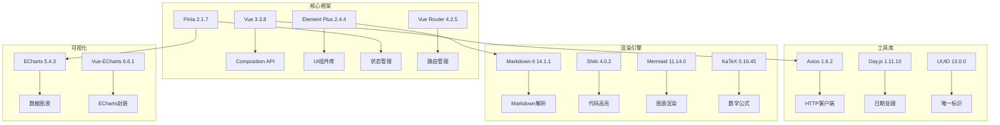

**图表来源**
- [package.json:11-29](file://NL2SQL/frontend/package.json#L11-L29)

### 构建配置分析

Vite配置提供了高效的开发体验和优化的生产构建。

```mermaid
flowchart TD
A[Vite配置] --> B[开发服务器]
A --> C[路径别名]
A --> D[插件系统]
A --> E[CSS预处理器]
A --> F[构建优化]
B --> G[端口5173]
B --> H[自动打开浏览器]
B --> I[API代理]
C --> J[@ -> src]
C --> K[@components -> src/components]
C --> L[@views -> src/views]
D --> M[Vue插件]
E --> N[SCSS支持]
E --> O[Element Plus变量]
F --> P[手动分包]
F --> Q[第三方库分离]
```

**图表来源**
- [vite.config.js:17-92](file://NL2SQL/frontend/vite.config.js#L17-L92)

**章节来源**
- [package.json:1-36](file://NL2SQL/frontend/package.json#L1-L36)
- [vite.config.js:1-93](file://NL2SQL/frontend/vite.config.js#L1-L93)

## 性能考虑

### 代码分割策略

应用采用了智能的代码分割策略，将第三方库和业务代码分离，优化加载性能。

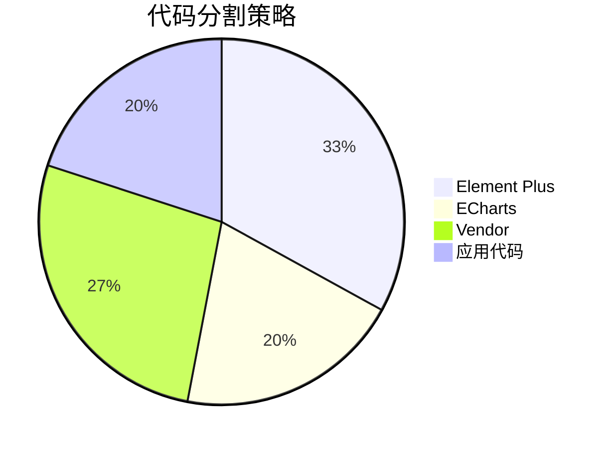

### 缓存和优化

- **组件懒加载**：路由级别的组件懒加载减少初始包大小
- **图片和资源优化**：生产环境自动压缩和优化静态资源
- **状态持久化**：会话状态在本地存储中持久化，提升用户体验

### 内存管理

- **SSE连接管理**：及时清理不再使用的SSE连接，避免内存泄漏
- **组件生命周期**：正确处理组件的挂载和卸载，释放资源
- **事件监听器**：在组件销毁时移除事件监听器

## 故障排除指南

### 常见问题诊断

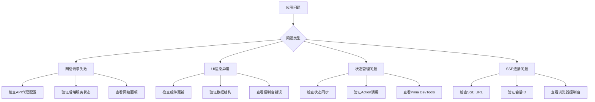

### 开发调试技巧

1. **使用Vue DevTools**：检查组件树和状态变化
2. **启用严格模式**：在开发环境中启用严格模式捕获状态修改错误
3. **监控网络请求**：使用浏览器开发者工具监控API调用
4. **SSE调试**：检查服务器发送事件的连接状态

**章节来源**
- [api.js:44-88](file://NL2SQL/frontend/src/utils/api.js#L44-L88)
- [session.js:185-221](file://NL2SQL/frontend/src/stores/session.js#L185-L221)

## 结论

NL2SQL前端增强功能展现了现代Vue 3应用的最佳实践，通过精心设计的架构和丰富的功能特性，为用户提供了一个强大而易用的自然语言数据查询平台。

### 主要优势

- **模块化设计**：清晰的组件分离和职责划分
- **现代化技术栈**：采用最新的前端技术和工具链
- **用户体验优化**：流畅的交互和实时反馈机制
- **可扩展性**：良好的架构设计支持功能扩展

### 技术亮点

- **SSE实时通信**：提供即时的查询反馈和进度更新
- **智能Markdown渲染**：支持丰富的文本格式化和代码高亮
- **Schema可视化**：直观的数据结构浏览体验
- **状态管理最佳实践**：使用Pinia实现清晰的状态管理

该系统为后续的功能扩展和技术演进奠定了坚实的基础，是一个值得学习和参考的优秀前端项目实现。