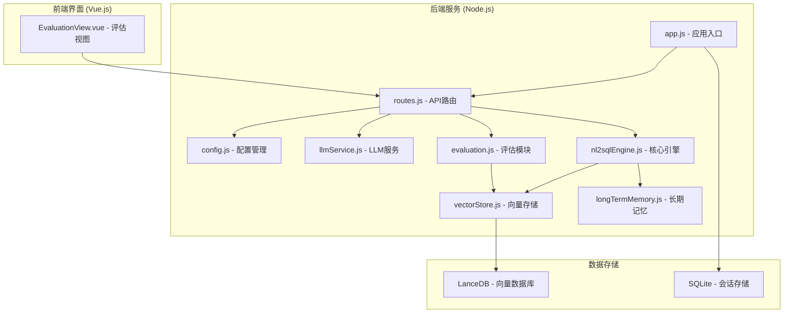
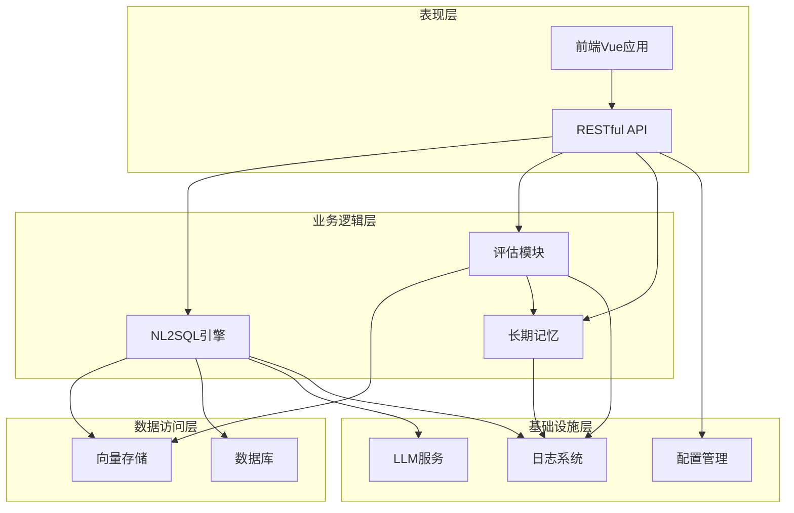
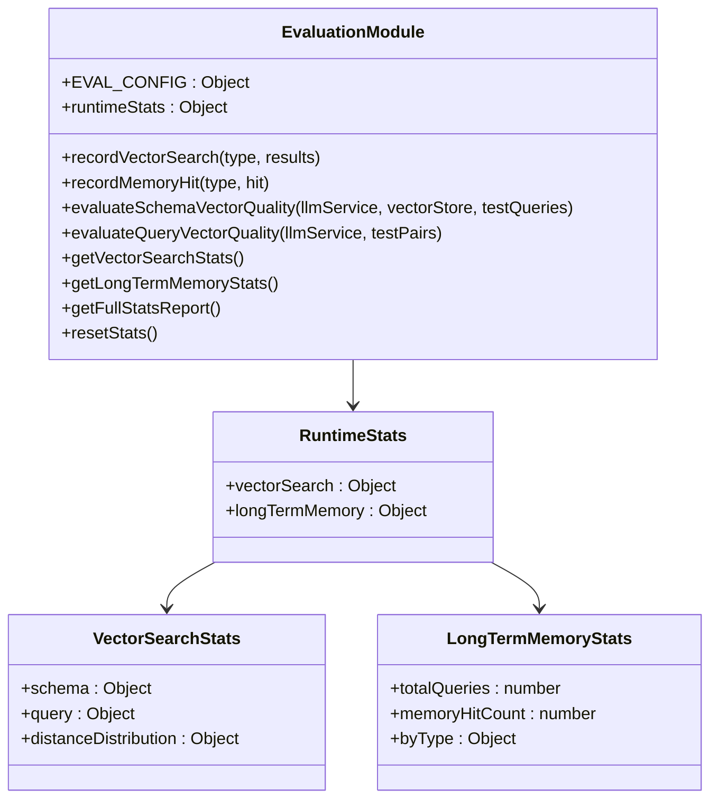
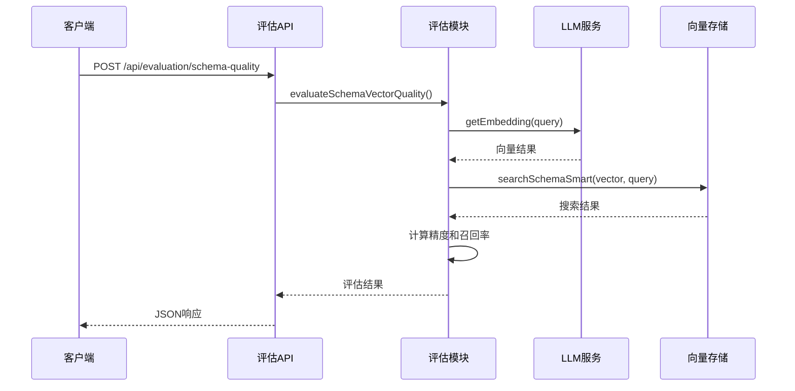
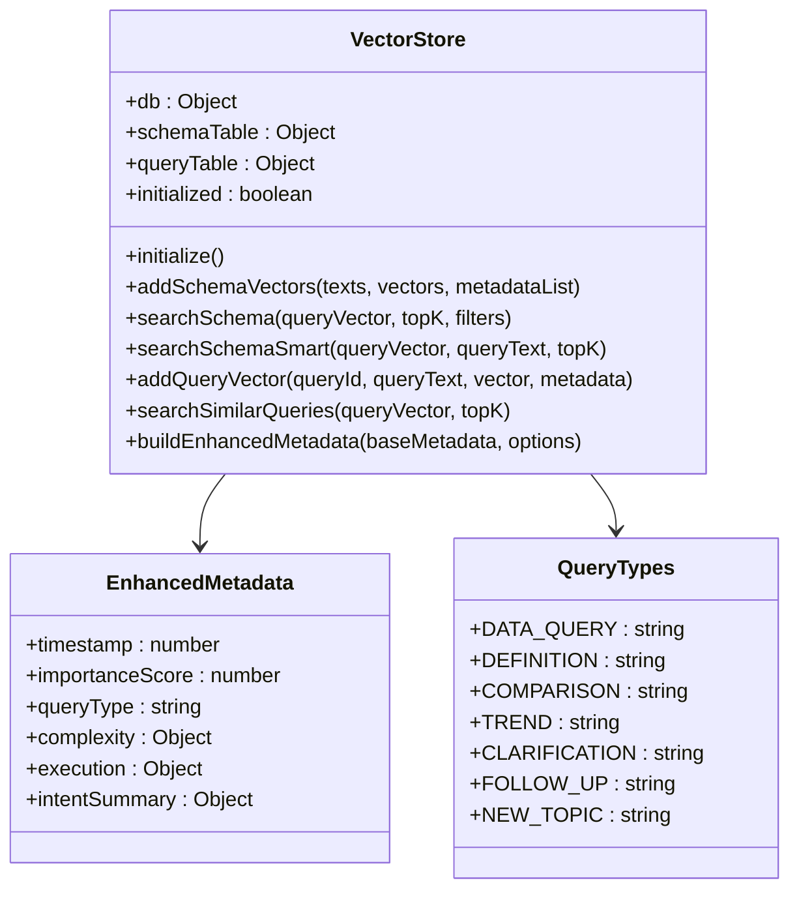
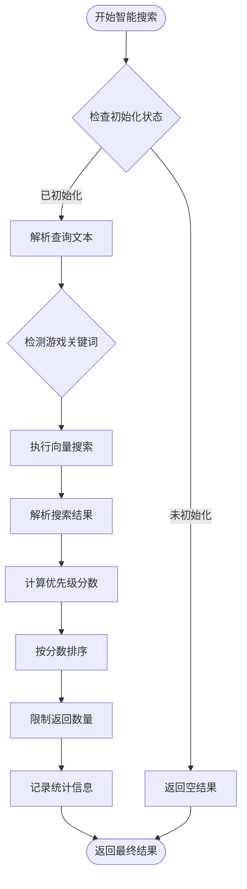
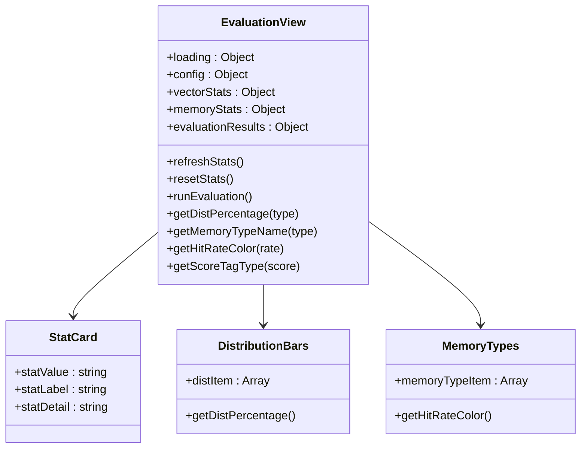
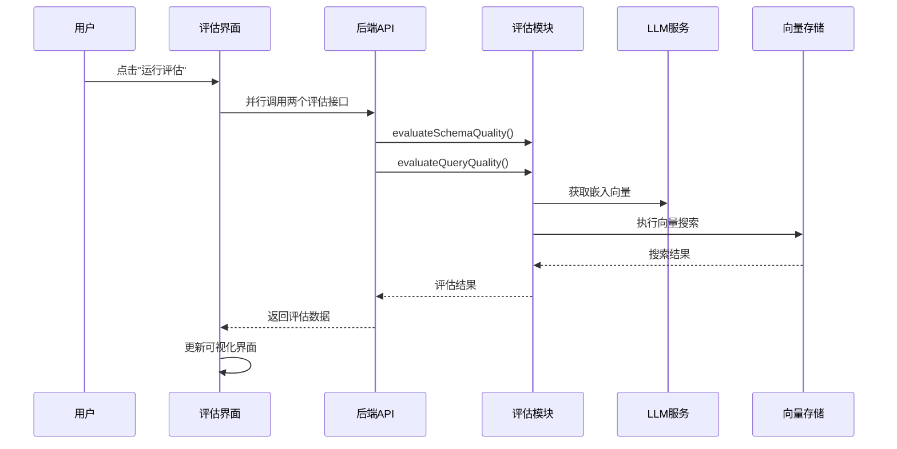
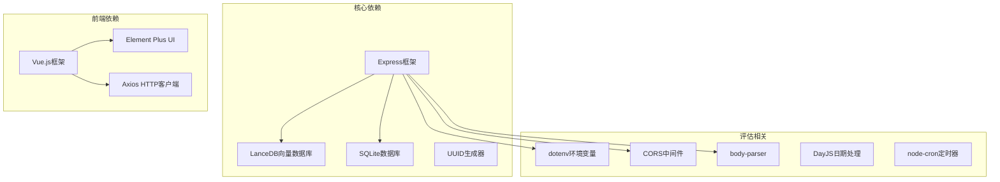

# NL2SQL向量评估系统

<cite>
**本文档引用的文件**
- [app.js](file://NL2SQL/backend/src/app.js)
- [routes.js](file://NL2SQL/backend/src/core/routes.js)
- [evaluation.js](file://NL2SQL/backend/src/utils/evaluation.js)
- [vectorStore.js](file://NL2SQL/backend/src/memory/vectorStore.js)
- [nl2sqlEngine.js](file://NL2SQL/backend/src/core/nl2sqlEngine.js)
- [longTermMemory.js](file://NL2SQL/backend/src/memory/longTermMemory.js)
- [config.js](file://NL2SQL/backend/src/core/config.js)
- [llmService.js](file://NL2SQL/backend/src/core/llmService.js)
- [EvaluationView.vue](file://NL2SQL/frontend/src/views/EvaluationView.vue)
- [package.json](file://NL2SQL/backend/package.json)
- [config.example.json](file://config.example.json)
- [context-management.test.js](file://NL2SQL/backend/test/context-management.test.js)
</cite>

## 目录
1. [简介](#简介)
2. [项目结构](#项目结构)
3. [核心组件](#核心组件)
4. [架构概览](#架构概览)
5. [详细组件分析](#详细组件分析)
6. [依赖关系分析](#依赖关系分析)
7. [性能考虑](#性能考虑)
8. [故障排除指南](#故障排除指南)
9. [结论](#结论)

## 简介

NL2SQL向量评估系统是一个基于人工智能技术的自然语言到SQL查询转换系统，专门设计用于评估和监控向量化质量以及长期记忆系统的性能表现。该系统采用先进的机器学习技术和向量数据库技术，能够实时监控和评估系统的各项性能指标，为系统优化提供数据支撑。

系统的核心特色包括：
- **向量化质量评估**：通过Schema向量和查询历史向量的质量评估，监控语义检索的准确性
- **长期记忆命中率统计**：跟踪用户偏好学习和记忆系统的使用效果
- **实时监控面板**：提供直观的可视化界面展示系统性能指标
- **非侵入式设计**：评估功能不影响主业务流程的正常运行

## 项目结构

NL2SQL系统采用前后端分离的架构设计，后端基于Node.js和Express框架，前端使用Vue.js构建现代化的用户界面。

**图表来源**
- [app.js:1-238](file://NL2SQL/backend/src/app.js#L1-L238)
- [routes.js:1-800](file://NL2SQL/backend/src/core/routes.js#L1-L800)
- [EvaluationView.vue:1-699](file://NL2SQL/frontend/src/views/EvaluationView.vue#L1-L699)

**章节来源**
- [app.js:1-238](file://NL2SQL/backend/src/app.js#L1-L238)
- [package.json:1-28](file://NL2SQL/backend/package.json#L1-L28)

## 核心组件

### 1. 应用入口与初始化

应用入口文件负责整个系统的启动和初始化过程，包括环境变量加载、模块初始化和服务器启动。

### 2. API路由系统

路由模块定义了完整的RESTful API接口，涵盖健康检查、Schema查询、会话管理、查询历史、用户偏好管理和评估功能。

### 3. 评估模块

评估模块提供向量化质量和长期记忆命中率的统计分析功能，支持手动触发评估和运行时统计记录。

### 4. 向量存储系统

基于LanceDB的向量数据库，支持Schema信息和查询历史的向量化存储和语义检索。

### 5. 核心引擎

NL2SQL核心引擎负责自然语言到SQL的转换，包括意图识别、实体解析、SQL生成和验证等功能。

**章节来源**
- [routes.js:1-800](file://NL2SQL/backend/src/core/routes.js#L1-L800)
- [evaluation.js:1-488](file://NL2SQL/backend/src/utils/evaluation.js#L1-L488)
- [vectorStore.js:1-759](file://NL2SQL/backend/src/memory/vectorStore.js#L1-L759)
- [nl2sqlEngine.js:1-800](file://NL2SQL/backend/src/core/nl2sqlEngine.js#L1-L800)

## 架构概览

系统采用分层架构设计，确保各组件之间的松耦合和高内聚。

**图表来源**
- [app.js:97-166](file://NL2SQL/backend/src/app.js#L97-L166)
- [routes.js:1-800](file://NL2SQL/backend/src/core/routes.js#L1-L800)
- [config.js:16-398](file://NL2SQL/backend/src/core/config.js#L16-L398)

## 详细组件分析

### 评估模块分析

评估模块是系统的核心监控组件，提供全面的性能指标统计和质量评估功能。

#### 核心功能架构

**图表来源**
- [evaluation.js:19-60](file://NL2SQL/backend/src/utils/evaluation.js#L19-L60)
- [evaluation.js:344-429](file://NL2SQL/backend/src/utils/evaluation.js#L344-L429)

#### 评估流程序列图

**图表来源**
- [routes.js:771-795](file://NL2SQL/backend/src/core/routes.js#L771-L795)
- [evaluation.js:158-266](file://NL2SQL/backend/src/utils/evaluation.js#L158-L266)

**章节来源**
- [evaluation.js:1-488](file://NL2SQL/backend/src/utils/evaluation.js#L1-L488)
- [routes.js:722-760](file://NL2SQL/backend/src/core/routes.js#L722-L760)

### 向量存储系统分析

向量存储系统基于LanceDB实现，提供高效的语义检索和向量管理功能。

#### 向量存储架构

**图表来源**
- [vectorStore.js:204-220](file://NL2SQL/backend/src/memory/vectorStore.js#L204-L220)
- [vectorStore.js:139-195](file://NL2SQL/backend/src/memory/vectorStore.js#L139-L195)
- [vectorStore.js:30-38](file://NL2SQL/backend/src/memory/vectorStore.js#L30-L38)

#### 智能搜索算法流程

**图表来源**
- [vectorStore.js:450-536](file://NL2SQL/backend/src/memory/vectorStore.js#L450-L536)

**章节来源**
- [vectorStore.js:1-759](file://NL2SQL/backend/src/memory/vectorStore.js#L1-L759)

### 前端评估界面分析

前端评估界面提供直观的可视化展示，支持实时监控和手动评估功能。

#### 界面组件架构

**图表来源**
- [EvaluationView.vue:330-499](file://NL2SQL/frontend/src/views/EvaluationView.vue#L330-L499)

#### 评估执行流程

**图表来源**
- [EvaluationView.vue:466-491](file://NL2SQL/frontend/src/views/EvaluationView.vue#L466-L491)
- [routes.js:771-800](file://NL2SQL/backend/src/core/routes.js#L771-L800)

**章节来源**
- [EvaluationView.vue:1-699](file://NL2SQL/frontend/src/views/EvaluationView.vue#L1-L699)

## 依赖关系分析

系统采用模块化设计，各组件之间的依赖关系清晰明确。

**图表来源**
- [package.json:10-27](file://NL2SQL/backend/package.json#L10-L27)

### 配置管理分析

系统采用集中式配置管理模式，所有配置项都通过config.js统一管理。

**章节来源**
- [config.js:16-398](file://NL2SQL/backend/src/core/config.js#L16-L398)
- [package.json:1-28](file://NL2SQL/backend/package.json#L1-L28)

## 性能考虑

### 向量检索性能优化

系统在向量检索方面采用了多项优化策略：

1. **智能搜索算法**：基于查询意图的智能重排序，提高检索准确性
2. **元数据过滤**：支持按数据类型和作用域进行过滤
3. **距离分布统计**：实时监控向量距离分布，优化检索参数
4. **缓存机制**：利用LanceDB的内置缓存提升查询性能

### 评估性能监控

评估模块提供了全面的性能监控指标：

- **向量检索命中率**：监控Schema和查询历史的检索准确性
- **长期记忆命中率**：跟踪用户偏好学习的效果
- **距离分布统计**：分析向量相似度的分布情况
- **运行时统计**：非侵入式的性能数据收集

## 故障排除指南

### 常见问题诊断

#### 1. 向量数据库初始化失败

**症状**：系统启动时出现向量数据库初始化错误

**解决方案**：
- 检查VECTOR_DB_PATH配置是否正确
- 确认数据库文件权限设置
- 验证LanceDB依赖安装完整性

#### 2. LLM API调用失败

**症状**：评估功能无法获取嵌入向量

**解决方案**：
- 验证LLM_API_KEY配置
- 检查网络连接和API端点
- 确认API配额和使用限制

#### 3. 评估功能未启用

**症状**：前端评估界面显示功能未启用

**解决方案**：
- 设置EVALUATION_ENABLED=true
- 验证评估相关的环境变量配置
- 检查评估模块的依赖安装

**章节来源**
- [config.js:366-388](file://NL2SQL/backend/src/core/config.js#L366-L388)
- [evaluation.js:773-778](file://NL2SQL/backend/src/utils/evaluation.js#L773-L778)

## 结论

NL2SQL向量评估系统是一个功能完备、设计合理的AI驱动查询系统。系统的主要优势包括：

### 技术优势
- **模块化设计**：清晰的组件分离和职责划分
- **非侵入式评估**：评估功能不影响主业务流程
- **实时监控**：提供全面的性能指标统计
- **智能优化**：基于查询意图的智能搜索算法

### 应用价值
- **质量保证**：通过持续的评估确保系统性能
- **用户体验**：通过长期记忆提升个性化体验
- **成本控制**：通过向量化检索减少查询复杂度
- **扩展性强**：模块化设计便于功能扩展

### 发展方向
- **模型优化**：持续改进LLM模型的准确性和效率
- **算法升级**：优化向量检索算法和评估指标
- **功能扩展**：增加更多评估维度和监控指标
- **性能优化**：进一步提升系统的响应速度和吞吐量

该系统为自然语言查询转换领域提供了一个优秀的参考实现，具有较高的实用价值和技术借鉴意义。