# NL2SQL自然语言到SQL系统

<cite>
**本文档引用的文件**
- [app.js](file://NL2SQL/backend/src/app.js)
- [nl2sqlEngine.js](file://NL2SQL/backend/src/core/nl2sqlEngine.js)
- [llmService.js](file://NL2SQL/backend/src/core/llmService.js)
- [schemaLoader.js](file://NL2SQL/backend/src/core/schemaLoader.js)
- [vectorStore.js](file://NL2SQL/backend/src/memory/vectorStore.js)
- [database.js](file://NL2SQL/backend/src/core/database.js)
- [routes.js](file://NL2SQL/backend/src/core/routes.js)
- [wsHandler.js](file://NL2SQL/backend/src/core/wsHandler.js)
- [logger.js](file://NL2SQL/backend/src/utils/logger.js)
- [config.js](file://NL2SQL/backend/src/core/config.js)
- [longTermMemory.js](file://NL2SQL/backend/src/memory/longTermMemory.js)
- [memoryMaintenance.js](file://NL2SQL/backend/src/memory/memoryMaintenance.js)
- [summarizer.js](file://NL2SQL/backend/src/memory/summarizer.js)
- [tokenBudget.js](file://NL2SQL/backend/src/utils/tokenBudget.js)
- [evaluation.js](file://NL2SQL/backend/src/utils/evaluation.js)
- [main.js](file://NL2SQL/frontend/src/main.js)
- [router.js](file://NL2SQL/frontend/src/router/index.js)
- [session.js](file://NL2SQL/frontend/src/stores/session.js)
- [markdownRenderer.js](file://NL2SQL/frontend/src/utils/markdownRenderer.js)
- [ChatView.vue](file://NL2SQL/frontend/src/views/ChatView.vue)
- [MemoryView.vue](file://NL2SQL/frontend/src/views/MemoryView.vue)
- [EvaluationView.vue](file://NL2SQL/frontend/src/views/EvaluationView.vue)
- [package.json](file://NL2SQL/backend/package.json)
- [package.json](file://NL2SQL/frontend/package.json)
- [context-management.test.js](file://NL2SQL/backend/test/context-management.test.js)
</cite>

## 更新摘要
**变更内容**
- 实现表级向量化而非字段级向量化，显著提升向量检索效率
- 引入智能搜索策略，基于查询意图进行表级重排序
- 优化Schema加载和向量化系统，增强元数据管理和特征提取
- 完善向量评估系统，支持表级向量的质量评估和统计监控
- 增强长期记忆系统的即时学习能力，支持澄清轮中的映射提取

## 目录
1. [项目概述](#项目概述)
2. [项目结构](#项目结构)
3. [核心组件](#核心组件)
4. [架构概览](#架构概览)
5. [详细组件分析](#详细组件分析)
6. [依赖关系分析](#依赖关系分析)
7. [性能考虑](#性能考虑)
8. [故障排除指南](#故障排除指南)
9. [结论](#结论)

## 项目概述

NL2SQL自然语言到SQL系统是一个智能数据查询平台，能够将用户的自然语言查询转换为精确的SQL语句。该系统结合了大型语言模型（LLM）、向量数据库和传统的关系型数据库技术，为用户提供直观的数据查询体验。

### 主要特性
- **自然语言查询**：用户可以用中文描述数据需求
- **智能SQL生成**：基于Schema元数据生成准确的SQL语句
- **实时交互**：支持WebSocket实时通信和流式响应
- **语义检索**：利用向量数据库实现Schema的语义匹配
- **安全控制**：多重安全验证和访问控制机制
- **会话管理**：完整的对话历史和状态管理
- **实体解析**：支持模糊描述到具体ID的智能映射
- **上下文理解**：深度融合对话历史的智能分析
- **Markdown渲染**：丰富的前端展示和交互体验
- **长期记忆**：智能学习用户偏好和查询模式
- **记忆维护**：自动清理和相似模式合并
- **偏好管理**：完整的用户偏好可视化界面
- **平台识别**：智能识别"新平台"/"老平台"等平台术语
- **多轮对话**：增强的澄清机制和上下文理解
- **智能上下文管理**：动态令牌估算和预算控制
- **对话摘要**：基于令牌预算的智能压缩机制
- **紧凑Schema输出**：优化的Schema信息展示和处理
- **智能字段过滤**：精准的Schema字段选择和展示
- **向量评估系统**：完整的监控和质量保证能力
- **实时统计跟踪**：向量检索命中率和记忆命中率统计
- **质量评估接口**：Schema向量化质量和查询相似度评估
- **阈值控制机制**：可配置的质量评估阈值和标准
- **表级向量化**：从字段级向量化升级为表级向量化，提升检索效率
- **智能搜索策略**：基于查询意图的表级重排序算法
- **增强元数据管理**：表级向量包含域标签、数据类型等元数据
- **核心特征词提取**：从表名、描述和字段中提取强动作特征词

## 项目结构

系统采用前后端分离架构，分为三个主要部分：

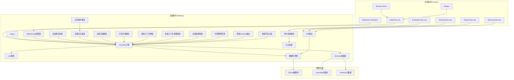

**图表来源**
- [app.js:1-266](file://NL2SQL/backend/src/app.js#L1-L266)
- [main.js:1-89](file://NL2SQL/frontend/src/main.js#L1-L89)
- [markdownRenderer.js:1-258](file://NL2SQL/frontend/src/utils/markdownRenderer.js#L1-L258)
- [MemoryView.vue:1-511](file://NL2SQL/frontend/src/views/MemoryView.vue#L1-L511)
- [EvaluationView.vue:1-699](file://NL2SQL/frontend/src/views/EvaluationView.vue#L1-L699)

**章节来源**
- [app.js:1-266](file://NL2SQL/backend/src/app.js#L1-L266)
- [main.js:1-89](file://NL2SQL/frontend/src/main.js#L1-L89)
- [markdownRenderer.js:1-258](file://NL2SQL/frontend/src/utils/markdownRenderer.js#L1-L258)
- [MemoryView.vue:1-511](file://NL2SQL/frontend/src/views/MemoryView.vue#L1-L511)
- [EvaluationView.vue:1-699](file://NL2SQL/frontend/src/views/EvaluationView.vue#L1-L699)

## 核心组件

### 后端核心组件

系统的核心由以下关键组件构成：

#### 1. NL2SQL引擎
负责完整的自然语言到SQL转换流程，包括意图识别、澄清机制、SQL生成、验证和结果格式化。**新增**紧凑Schema输出机制和增强的智能字段过滤功能。

#### 2. LLM服务
封装与大型语言模型的交互，提供聊天、嵌入向量获取和重试机制。

#### 3. Schema加载器
管理数据库Schema元数据，提供Schema查询、匹配和验证功能。**优化**表选择逻辑，支持智能上下文匹配和紧凑Schema输出。

#### 4. 向量存储模块
基于LanceDB实现向量数据库，支持Schema和查询历史的语义检索。**增强**元数据管理和查询类型分类，**新增**智能搜索功能。

#### 5. 数据库管理
使用SQLite存储会话历史、消息记录、查询日志和用户偏好。

#### 6. WebSocket处理器
实现实时通信，支持流式响应和心跳检测。

#### 7. 实体解析系统
**新增**支持模糊描述到具体ID的智能映射，如将"青木"映射到游戏ID。

#### 8. 长期记忆模块
**新增**用户长期记忆管理，包括偏好提取、存储、检索和维护功能。**新增**澄清轮即时学习能力。

#### 9. 记忆维护模块
**新增**实现长期记忆的自动清理、相似模式合并和统计报告。

#### 10. 平台术语解析系统
**新增**专门处理"新平台"/"老平台"等平台术语识别，支持数据源映射学习。

#### 11. 澄清上下文增强
**新增**改进的多轮对话上下文理解，支持默认选项确认和澄清历史整合。

#### 12. 智能上下文管理系统
**新增**集成动态令牌估算、预算控制和智能压缩功能，确保系统稳定性。

#### 13. 对话摘要机制
**新增**基于令牌预算的智能压缩机制，有效管理长对话历史。

#### 14. 令牌预算管理
**新增**独立的tokenBudget.js模块，提供精确的上下文令牌估算和预算控制。

#### 15. 紧凑Schema输出机制
**新增**优化的Schema信息输出，只包含关键字段和相关信息，显著减少Token消耗。

#### 16. 智能字段过滤功能
**新增**基于查询意图的字段智能过滤，自动识别和展示相关字段。

#### 17. 向量评估系统
**新增**完整的监控和质量保证系统，提供实时向量搜索质量评估、历史查询相似性测试和统计跟踪机制。

#### 18. 日志系统
**新增**增强的日志记录功能，支持评估相关的详细日志记录和追踪。

**章节来源**
- [nl2sqlEngine.js:1-2010](file://NL2SQL/backend/src/core/nl2sqlEngine.js#L1-L2010)
- [llmService.js:1-432](file://NL2SQL/backend/src/core/llmService.js#L1-L432)
- [schemaLoader.js:1-1071](file://NL2SQL/backend/src/core/schemaLoader.js#L1-L1071)
- [vectorStore.js:1-759](file://NL2SQL/backend/src/memory/vectorStore.js#L1-L759)
- [database.js:1-850](file://NL2SQL/backend/src/core/database.js#L1-L850)
- [wsHandler.js:1-451](file://NL2SQL/backend/src/core/wsHandler.js#L1-L451)
- [longTermMemory.js:1-1141](file://NL2SQL/backend/src/memory/longTermMemory.js#L1-L1141)
- [memoryMaintenance.js:1-415](file://NL2SQL/backend/src/memory/memoryMaintenance.js#L1-L415)
- [summarizer.js:1-518](file://NL2SQL/backend/src/memory/summarizer.js#L1-L518)
- [tokenBudget.js:1-435](file://NL2SQL/backend/src/utils/tokenBudget.js#L1-L435)
- [evaluation.js:1-488](file://NL2SQL/backend/src/utils/evaluation.js#L1-L488)
- [logger.js:1-442](file://NL2SQL/backend/src/utils/logger.js#L1-L442)

### 前端核心组件

#### 1. Vue.js应用
基于Vue 3构建的现代化前端界面，使用Composition API和TypeScript。

#### 2. 路由系统
使用Vue Router实现单页应用的路由管理。

#### 3. Pinia状态管理
使用Pinia替代Vuex，提供更好的TypeScript支持和开发体验。

#### 4. 组件架构
- ChatView：主要的聊天界面，**集成了Markdown渲染系统**
- SchemaView：数据Schema展示
- HistoryView：查询历史记录
- MemoryView：**新增**长期记忆管理界面
- EvaluationView：**新增**系统评估和监控界面
- SchemaViewer：Schema可视化组件

#### 5. Markdown渲染系统
**新增**集成markdown-it、Shiki、Mermaid.js、KaTeX，提供丰富的前端展示功能。

#### 6. 评估界面
**新增**EvaluationView组件，提供向量化质量评估和统计监控功能。

**章节来源**
- [main.js:1-89](file://NL2SQL/frontend/src/main.js#L1-L89)
- [router.js:1-137](file://NL2SQL/frontend/src/router/index.js#L1-L137)
- [session.js:1-383](file://NL2SQL/frontend/src/stores/session.js#L1-L383)
- [ChatView.vue:1-692](file://NL2SQL/frontend/src/views/ChatView.vue#L1-L692)
- [MemoryView.vue:1-511](file://NL2SQL/frontend/src/views/MemoryView.vue#L1-L511)
- [EvaluationView.vue:1-699](file://NL2SQL/frontend/src/views/EvaluationView.vue#L1-L699)
- [markdownRenderer.js:1-258](file://NL2SQL/frontend/src/utils/markdownRenderer.js#L1-L258)

## 架构概览

系统采用微服务架构设计，具有清晰的分层结构：

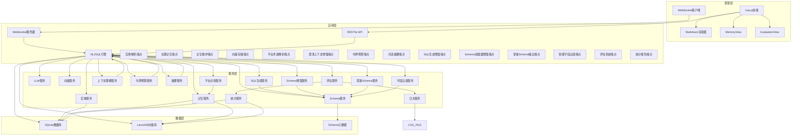

**图表来源**
- [app.js:88-111](file://NL2SQL/backend/src/app.js#L88-L111)
- [routes.js:1-1037](file://NL2SQL/backend/src/core/routes.js#L1-L1037)
- [markdownRenderer.js:1-258](file://NL2SQL/frontend/src/utils/markdownRenderer.js#L1-L258)
- [MemoryView.vue:1-511](file://NL2SQL/frontend/src/views/MemoryView.vue#L1-L511)
- [EvaluationView.vue:1-699](file://NL2SQL/frontend/src/views/EvaluationView.vue#L1-L699)

### 数据流架构

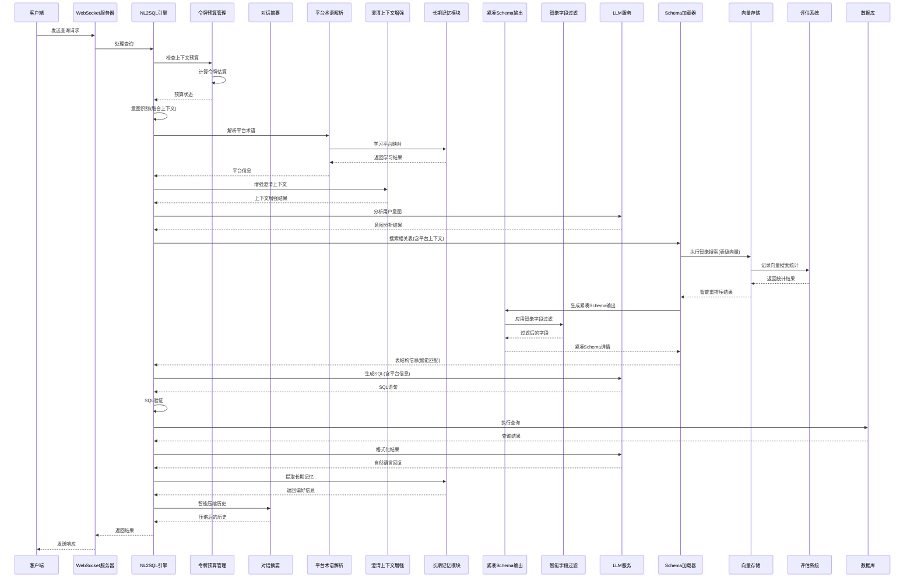

**图表来源**
- [wsHandler.js:197-247](file://NL2SQL/backend/src/core/wsHandler.js#L197-L247)
- [nl2sqlEngine.js:596-778](file://NL2SQL/backend/src/core/nl2sqlEngine.js#L596-L778)
- [longTermMemory.js:827-965](file://NL2SQL/backend/src/memory/longTermMemory.js#L827-L965)
- [vectorStore.js:426-427](file://NL2SQL/backend/src/memory/vectorStore.js#L426-L427)
- [evaluation.js:71-96](file://NL2SQL/backend/src/utils/evaluation.js#L71-L96)

## 详细组件分析

### NL2SQL引擎分析

NL2SQL引擎是系统的核心，实现了完整的自然语言到SQL转换流程：

#### 紧凑Schema输出机制

**新增**紧凑Schema输出机制显著优化了Schema信息的处理和展示：

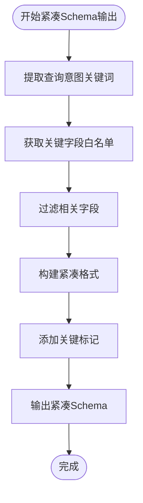

**图表来源**
- [nl2sqlEngine.js:1377-1378](file://NL2SQL/backend/src/core/nl2sqlEngine.js#L1377-L1378)
- [schemaLoader.js:704-769](file://NL2SQL/backend/src/core/schemaLoader.js#L704-L769)

紧凑Schema输出的主要特点：
- **关键字段优先**：只展示主键、外键、时间字段等关键字段
- **智能相关性过滤**：根据查询意图自动识别相关字段
- **紧凑格式**：减少字段描述，使用简洁格式
- **标签标注**：为主键、外键、分区键等添加标记

#### 智能字段过滤功能

**新增**智能字段过滤功能实现了基于查询意图的字段选择：

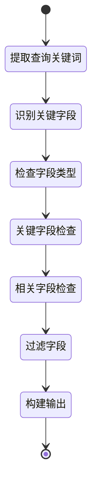

**图表来源**
- [schemaLoader.js:708-739](file://NL2SQL/backend/src/core/schemaLoader.js#L708-L739)

智能字段过滤的工作流程：
1. **关键词提取**：从查询意图中提取业务关键词
2. **关键字段识别**：识别主键、外键、时间字段等关键字段
3. **相关性匹配**：根据关键词匹配相关字段
4. **字段过滤**：只保留关键字段和相关字段
5. **格式优化**：使用紧凑格式输出字段信息

#### 优化的表选择逻辑

**更新**表选择逻辑经过重大优化，提升了处理效率和准确性：

```mermaid
flowchart TD
Start([开始表选择]) --> CheckContext{检查上下文}
CheckContext --> |有上下文| EnhanceQuery[增强查询文本]
CheckContext --> |无上下文| DirectSearch[直接搜索]
EnhanceQuery --> SmartSearch[智能搜索(表级向量)]
DirectSearch --> VectorSearch[向量语义搜索]
SmartSearch --> CheckResults{检查结果}
CheckResults --> |成功| FilterResults[过滤结果]
CheckResults --> |失败| KeywordMatch[关键词匹配]
FilterResults --> DataSourcePriority[数据源优先级]
DataSourcePriority --> PlatformPriority[平台优先级]
PlatformPriority --> LimitResults[限制结果数量]
LimitResults --> ReturnTables[返回表列表]
KeywordMatch --> LimitResults
```

**图表来源**
- [schemaLoader.js:430-519](file://NL2SQL/backend/src/core/schemaLoader.js#L430-L519)

优化的表选择逻辑包括：
- **上下文增强**：根据game_id和datasource增强查询
- **智能搜索优先**：优先使用语义搜索，失败时回退到关键词匹配
- **表级向量搜索**：使用优化后的表级向量进行高效检索
- **数据源优先**：优先匹配对应数据源的表
- **平台智能匹配**：根据game_id推断平台类型并匹配相应表
- **结果限制**：限制返回表数量，避免过度处理

#### 令牌预算管理模块

**新增**tokenBudget.js模块提供了精确的令牌估算和预算控制：

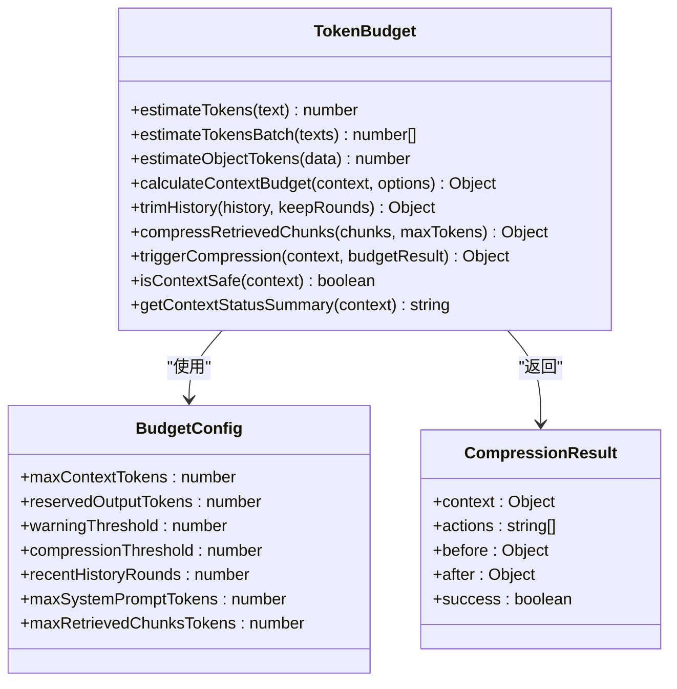

**图表来源**
- [tokenBudget.js:29-44](file://NL2SQL/backend/src/utils/tokenBudget.js#L29-L44)
- [tokenBudget.js:414-434](file://NL2SQL/backend/src/utils/tokenBudget.js#L414-L434)

#### 对话摘要机制

**新增**基于令牌预算的智能压缩机制：

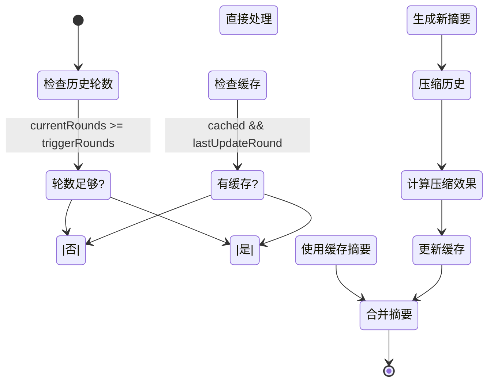

**图表来源**
- [summarizer.js:450-492](file://NL2SQL/backend/src/memory/summarizer.js#L450-L492)

#### 平台术语解析系统

**更新**resolvePlatformInIntent函数实现了智能的平台术语识别：

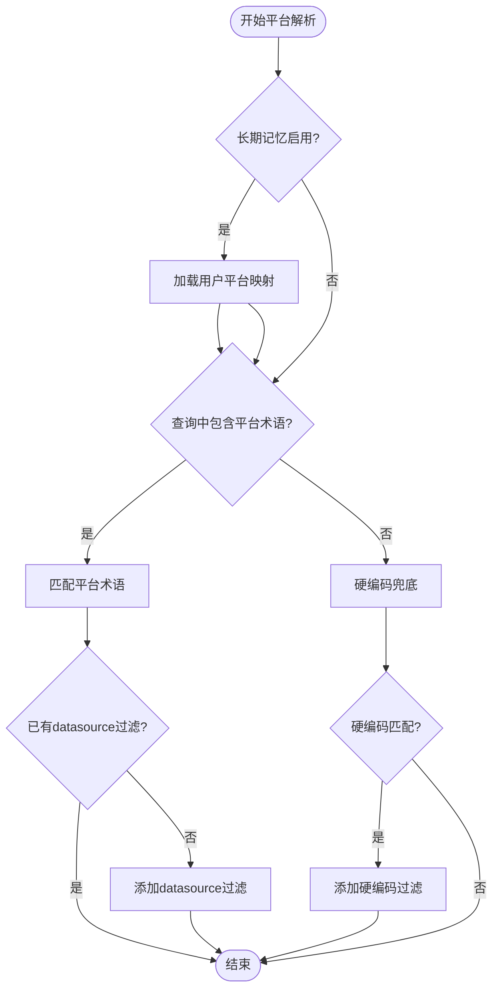

**图表来源**
- [nl2sqlEngine.js:534-607](file://NL2SQL/backend/src/core/nl2sqlEngine.js#L534-L607)
- [longTermMemory.js:844-965](file://NL2SQL/backend/src/memory/longTermMemory.js#L844-L965)

#### 澄清上下文增强

**更新**enrichIntentWithClarificationContext函数改进了多轮对话理解：

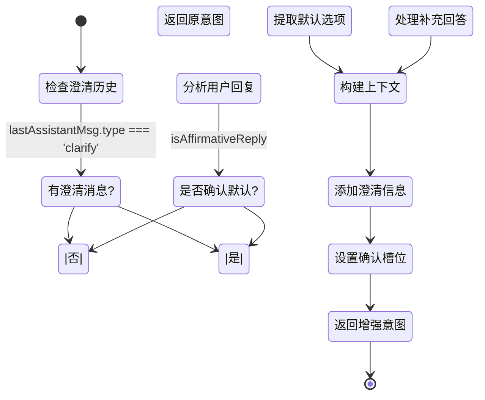

**图表来源**
- [nl2sqlEngine.js:689-728](file://NL2SQL/backend/src/core/nl2sqlEngine.js#L689-L728)

#### 意图完整性检查改进

**更新**checkIntentComplete函数实现了更严格的完整性验证：

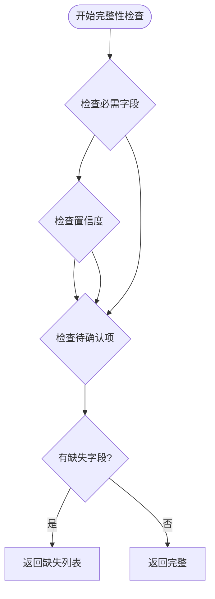

**图表来源**
- [nl2sqlEngine.js:2042-2056](file://NL2SQL/backend/src/core/nl2sqlEngine.js#L2042-L2056)

#### SQL生成增强

**更新**generateSQL函数支持平台上下文的智能SQL生成：

```mermaid
flowchart TD
Start([开始SQL生成]) --> ExtractContext[提取上下文信息]
ExtractContext --> SearchTables[搜索相关表(含平台上下文)]
SearchTables --> BuildPrompt[构建SQL生成提示词]
BuildPrompt --> GenerateSQL[生成SQL]
GenerateSQL --> ValidateSQL[验证SQL安全性]
ValidateSQL --> ReturnResult[返回结果]
```

**图表来源**
- [nl2sqlEngine.js:1090-1288](file://NL2SQL/backend/src/core/nl2sqlEngine.js#L1090-L1288)

#### 澄清轮即时学习

**新增**extractMappingsFromText函数实现了澄清轮中的智能学习：

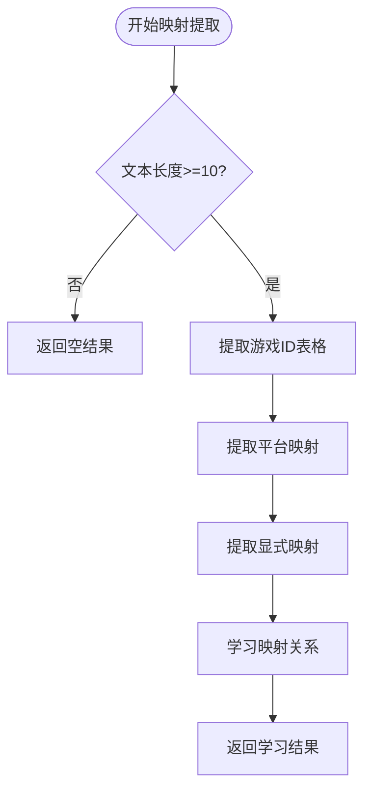

**图表来源**
- [longTermMemory.js:844-965](file://NL2SQL/backend/src/memory/longTermMemory.js#L844-L965)

### 向量评估系统分析

**新增**向量评估系统是系统的重要创新，提供了完整的监控和质量保证能力：

#### 核心功能架构

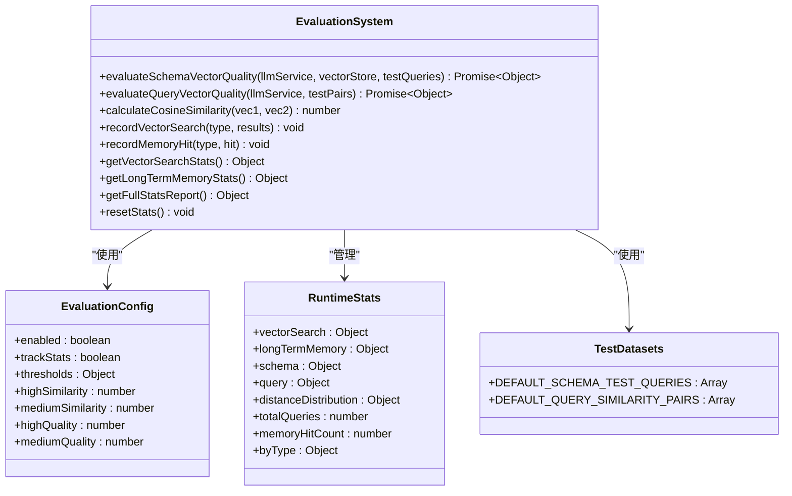

**图表来源**
- [evaluation.js:19-31](file://NL2SQL/backend/src/utils/evaluation.js#L19-L31)
- [evaluation.js:37-60](file://NL2SQL/backend/src/utils/evaluation.js#L37-L60)
- [evaluation.js:435-459](file://NL2SQL/backend/src/utils/evaluation.js#L435-L459)

#### 实时向量搜索质量评估

**新增**实时向量搜索质量评估功能：

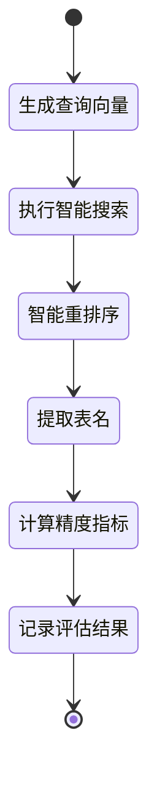

**图表来源**
- [evaluation.js:158-266](file://NL2SQL/backend/src/utils/evaluation.js#L158-L266)

评估流程包括：
1. **查询向量生成**：使用LLM服务生成查询向量
2. **智能搜索执行**：使用searchSchemaSmart进行语义搜索
3. **结果重排序**：基于游戏提及、平台优先级等策略重排序
4. **表名提取**：从元数据中提取检索到的表名
5. **精度计算**：计算精确率、召回率、F1分数等指标
6. **统计记录**：记录评估结果和详细信息

#### 历史查询相似性测试

**新增**历史查询相似性测试功能：

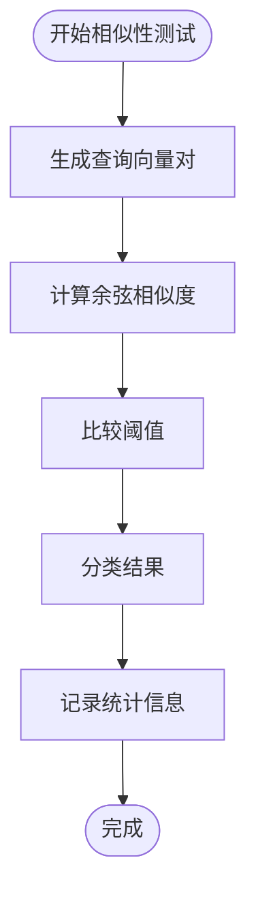

**图表来源**
- [evaluation.js:276-334](file://NL2SQL/backend/src/utils/evaluation.js#L276-L334)

相似性测试工作流程：
1. **向量生成**：并行生成查询对的向量表示
2. **相似度计算**：使用余弦相似度计算相似度
3. **阈值比较**：与预设阈值比较进行分类
4. **统计记录**：记录高、中、低相似度对的数量
5. **误差计算**：计算平均误差指标

#### 运行时统计跟踪

**新增**运行时统计跟踪功能：

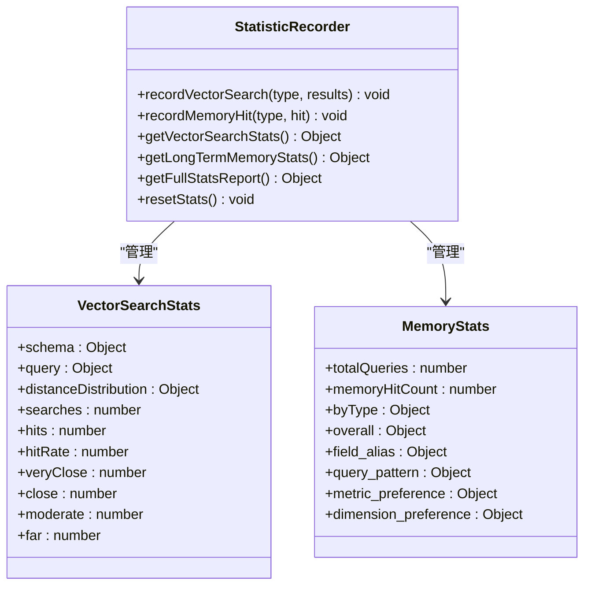

**图表来源**
- [evaluation.js:71-122](file://NL2SQL/backend/src/utils/evaluation.js#L71-L122)
- [evaluation.js:344-391](file://NL2SQL/backend/src/utils/evaluation.js#L344-L391)

统计跟踪功能包括：
- **向量搜索统计**：记录Schema和查询向量的检索命中率
- **距离分布统计**：记录向量距离分布情况
- **长期记忆统计**：记录不同类型记忆的命中率
- **实时更新**：在向量搜索和记忆查询时实时更新统计

#### 评估配置管理

**新增**评估配置管理功能：

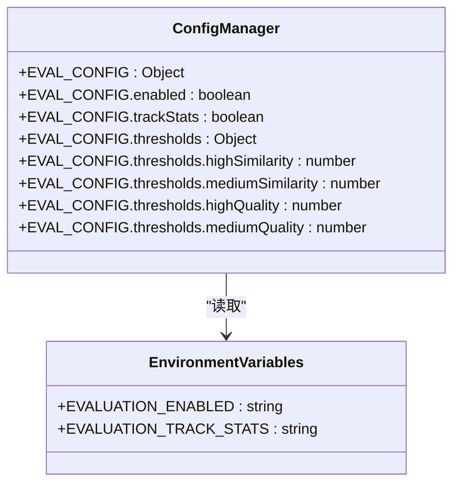

**图表来源**
- [evaluation.js:19-31](file://NL2SQL/backend/src/utils/evaluation.js#L19-L31)
- [config.js:342-354](file://NL2SQL/backend/src/core/config.js#L342-L354)

评估配置包括：
- **功能开关**：通过环境变量控制评估功能启用
- **统计跟踪**：控制运行时统计的记录
- **阈值配置**：定义相似度和质量评估的阈值
- **环境变量支持**：支持通过环境变量动态配置

**章节来源**
- [evaluation.js:1-488](file://NL2SQL/backend/src/utils/evaluation.js#L1-L488)
- [config.js:342-354](file://NL2SQL/backend/src/core/config.js#L342-L354)

### 长期记忆模块分析

**新增**长期记忆模块是系统的重要创新，实现了用户偏好的智能学习和管理：

#### 核心功能架构

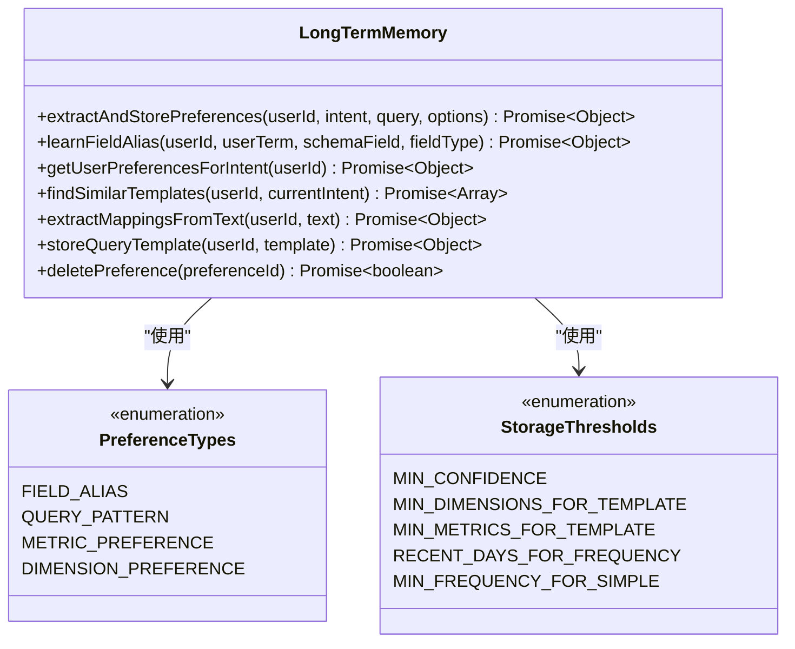

**图表来源**
- [longTermMemory.js:311-484](file://NL2SQL/backend/src/memory/longTermMemory.js#L311-L484)
- [longTermMemory.js:36-41](file://NL2SQL/backend/src/memory/longTermMemory.js#L36-L41)

#### 智能偏好提取

长期记忆模块实现了多层级的偏好提取机制：

1. **LLM智能分析**：使用LLM判断查询价值和提取个人偏好
2. **逻辑判断筛选**：基于配置阈值进行智能筛选
3. **存储策略**：区分字段别名、查询模式、指标偏好和维度偏好
4. **即时学习**：支持澄清轮中的映射关系学习

**章节来源**
- [longTermMemory.js:56-188](file://NL2SQL/backend/src/memory/longTermMemory.js#L56-L188)
- [longTermMemory.js:251-295](file://NL2SQL/backend/src/memory/longTermMemory.js#L251-L295)
- [longTermMemory.js:844-965](file://NL2SQL/backend/src/memory/longTermMemory.js#L844-L965)

### 记忆维护模块分析

**新增**记忆维护模块负责长期记忆的生命周期管理：

#### 清理策略

```mermaid
graph LR
subgraph "记忆清理策略"
High[高频偏好<br/>≥10次<br/>永久保留]
Medium[中频偏好<br/>3-9次<br/>90天未用清理]
Low[低频偏好<br/><3次<br/>30天未用清理]
Alias[字段别名<br/>365天未用清理]
End([清理完成])
high --> End
medium --> End
low --> End
alias --> End
```

**图表来源**
- [memoryMaintenance.js:69-189](file://NL2SQL/backend/src/memory/memoryMaintenance.js#L69-L189)

#### 相似模式合并

记忆维护模块实现了智能的相似模式合并功能：

1. **相似度计算**：基于维度重合度和指标重合度判断
2. **模式合并**：自动合并高度相似的查询模式
3. **使用次数合并**：合并后累加使用次数
4. **统计报告**：提供系统记忆健康报告

**章节来源**
- [memoryMaintenance.js:201-309](file://NL2SQL/backend/src/memory/memoryMaintenance.js#L201-L309)
- [memoryMaintenance.js:315-395](file://NL2SQL/backend/src/memory/memoryMaintenance.js#L315-L395)

### LLM服务架构

LLM服务提供了完整的语言模型交互能力：

#### HTTP请求封装

```mermaid
classDiagram
class LLMService {
+chat(messages, tools, stream, onStream) Promise~Object~
+simpleChat(prompt, systemPrompt) Promise~string~
+getEmbedding(input) Promise~number[]~
+withRetry(fn, maxRetries, delay) Promise~any~
+sleep(ms) Promise~void~
-httpPost(url, headers, body, stream, timeout) Promise~Object~
}
class HTTPRequest {
+method : string
+hostname : string
+port : number
+path : string
+headers : Object
+timeout : number
+send() Promise~Object~
}
class RetryMechanism {
+maxRetries : number
+retryDelay : number
+executeWithRetry() Promise~any~
}
LLMService --> HTTPRequest : "使用"
LLMService --> RetryMechanism : "使用"
```

**图表来源**
- [llmService.js:41-152](file://NL2SQL/backend/src/core/llmService.js#L41-L152)
- [llmService.js:167-195](file://NL2SQL/backend/src/core/llmService.js#L167-L195)

#### 嵌入向量处理

LLM服务支持多种嵌入向量生成模式：

- **单文本嵌入**：生成单个文本的向量表示
- **批量嵌入**：支持批量处理提高效率
- **维度控制**：可配置向量维度满足不同需求

**章节来源**
- [llmService.js:287-311](file://NL2SQL/backend/src/core/llmService.js#L287-L311)
- [llmService.js:324-379](file://NL2SQL/backend/src/core/llmService.js#L324-L379)

### Schema加载器设计

**更新**Schema加载器负责管理数据库元数据，现已支持平台和数据源上下文：

#### 数据结构管理

```mermaid
classDiagram
class SchemaLoader {
-schemaData : Object
-cacheTimestamp : number
+load() Promise~void~
+reload() Promise~void~
+getAllTables() Array
+getTable(tableName) Object
+getField(tableName, fieldName) Object
+searchRelevantTables(query, topK, context) Promise~Array~
+validateSQL(sql) Object
+getSchemaSummary() string
+getTableSchemaDetail(tableNames) string
+getTableSchemaDetailCompact(tableNames, intent) string
+buildTableRepresentation(table) Object
+extractKeyFeatures(table) Array
}
class SchemaData {
+version : string
+tables : Array
+relationships : Array
+metrics : Array
+dimensions : Array
+tableMap : Map
+fieldMap : Map
}
class Vectorization {
+vectorizeSchema() Promise~void~
+addSchemaVectors(texts, vectors, metadataList) Promise~void~
+searchSchema(queryVector, topK) Promise~Array~
+searchSchemaSmart(queryVector, queryText, topK) Promise~Array~
}
class PlatformContext {
+gameId : string
+datasource : string
+inferPlatformByGameId(gameId) string
+extractExplicitTableNames(query) Array
}
SchemaLoader --> SchemaData : "管理"
SchemaLoader --> Vectorization : "使用"
SchemaLoader --> PlatformContext : "使用"
```

**图表来源**
- [schemaLoader.js:36-51](file://NL2SQL/backend/src/core/schemaLoader.js#L36-L51)
- [schemaLoader.js:195-290](file://NL2SQL/backend/src/core/schemaLoader.js#L195-L290)
- [schemaLoader.js:390-407](file://NL2SQL/backend/src/core/schemaLoader.js#L390-L407)

#### 表级向量化实现

**更新**Schema加载器实现了革命性的表级向量化：

```mermaid
flowchart TD
Start([开始表级向量化]) --> CheckRevectorize{检查强制重新向量化}
CheckRevectorize --> |是| ClearVectors[清空现有向量]
CheckRevectorize --> |否| CheckExisting{检查已有向量}
CheckExisting --> |有| SkipVectorization[跳过向量化]
CheckExisting --> |无| BuildRepresentations[构建表级表征]
SkipVectorization --> End([完成])
ClearVectors --> BuildRepresentations
BuildRepresentations --> ExtractFeatures[提取核心特征词]
ExtractFeatures --> BuildMetadata[构建元数据]
BuildMetadata --> GenerateEmbeddings[生成向量]
GenerateEmbeddings --> StoreVectors[存储向量]
StoreVectors --> End
```

**图表来源**
- [schemaLoader.js:201-281](file://NL2SQL/backend/src/core/schemaLoader.js#L201-L281)

表级向量化的核心改进：
- **表级表征**：每个表生成一个向量，包含域标签、数据类型、核心特征词
- **元数据增强**：向量元数据包含scope、data_type、key_features等标签
- **特征词提取**：从表名、描述和关键字段中提取强动作特征词
- **批量处理**：支持批量生成和存储向量，提高效率

#### 智能搜索功能

**新增**智能搜索功能实现了基于查询意图的重排序：

```mermaid
stateDiagram-v2
[*] --> 意图识别
意图识别 --> 执行向量搜索
执行向量搜索 --> 结果重排序
结果重排序 --> 优先级计算
优先级计算 --> 限制返回数量
限制返回数量 --> 记录统计
记录统计 --> [*]
```

**图表来源**
- [vectorStore.js:450-536](file://NL2SQL/backend/src/memory/vectorStore.js#L450-L536)

智能搜索策略包括：
1. **游戏提及检测**：识别查询中的游戏关键词
2. **优先级计算**：根据游戏提及、平台类型、数据类型等因素计算优先级
3. **距离归一化**：将向量距离转换为优先级分数
4. **结果重排序**：按优先级分数排序返回结果
5. **统计记录**：记录智能搜索的统计信息

**章节来源**
- [schemaLoader.js:401-407](file://NL2SQL/backend/src/core/schemaLoader.js#L401-L407)
- [schemaLoader.js:429-519](file://NL2SQL/backend/src/core/schemaLoader.js#L429-L519)
- [schemaLoader.js:439-450](file://NL2SQL/backend/src/core/schemaLoader.js#L439-L450)
- [schemaLoader.js:201-281](file://NL2SQL/backend/src/core/schemaLoader.js#L201-L281)
- [schemaLoader.js:296-336](file://NL2SQL/backend/src/core/schemaLoader.js#L296-L336)
- [schemaLoader.js:347-427](file://NL2SQL/backend/src/core/schemaLoader.js#L347-L427)
- [vectorStore.js:450-536](file://NL2SQL/backend/src/memory/vectorStore.js#L450-L536)

### 向量存储系统

向量存储基于LanceDB实现，提供高性能的向量检索能力：

#### 存储架构

```mermaid
graph LR
subgraph "向量存储"
ST[schema_vectors表]
QT[query_vectors表]
end
subgraph "数据结构"
ID[id: string]
TXT[text: string]
VEC[vector: Array<number>]
META[metadata: JSON]
TS[timestamp: number]
end
ST --> ID
ST --> TXT
ST --> VEC
ST --> META
ST --> TS
QT --> ID
QT --> TXT
QT --> VEC
QT --> META
QT --> TS
```

**图表来源**
- [vectorStore.js:101-180](file://NL2SQL/backend/src/memory/vectorStore.js#L101-L180)
- [vectorStore.js:254-271](file://NL2SQL/backend/src/memory/vectorStore.js#L254-L271)

#### 检索算法

向量存储支持多种检索模式：

- **精确匹配**：基于向量相似度的精确搜索
- **模糊匹配**：支持一定的语义偏差
- **批量检索**：支持同时处理多个查询

#### 增强元数据管理

**扩展**向量存储增强了元数据管理功能：

```mermaid
classDiagram
class EnhancedMetadata {
+importanceScore : number
+queryType : string
+complexity : Object
+execution : Object
+intentSummary : Object
+timestamp : number
+calculateImportance(intent, success) number
+classifyQueryType(intent, queryText) string
+buildEnhancedMetadata(baseMetadata, options) Object
}
class QueryTypes {
<<enumeration>>
DEFINITION
COMPARISON
TREND
CLARIFICATION
FOLLOW_UP
DATA_QUERY
NEW_TOPIC
}
EnhancedMetadata --> QueryTypes : "使用"
```

**图表来源**
- [vectorStore.js:137-193](file://NL2SQL/backend/src/memory/vectorStore.js#L137-L193)
- [vectorStore.js:100-128](file://NL2SQL/backend/src/memory/vectorStore.js#L100-L128)

#### 智能搜索功能

**新增**智能搜索功能实现了基于查询意图的重排序：

```mermaid
stateDiagram-v2
[*] --> 意图识别
意图识别 --> 执行向量搜索
执行向量搜索 --> 结果重排序
结果重排序 --> 优先级计算
优先级计算 --> 限制返回数量
限制返回数量 --> 记录统计
记录统计 --> [*]
```

**图表来源**
- [vectorStore.js:450-536](file://NL2SQL/backend/src/memory/vectorStore.js#L450-L536)

智能搜索策略包括：
1. **游戏提及检测**：识别查询中的游戏关键词
2. **优先级计算**：根据游戏提及、平台类型、数据类型等因素计算优先级
3. **距离归一化**：将向量距离转换为优先级分数
4. **结果重排序**：按优先级分数排序返回结果
5. **统计记录**：记录智能搜索的统计信息

**章节来源**
- [vectorStore.js:201-230](file://NL2SQL/backend/src/memory/vectorStore.js#L201-L230)
- [vectorStore.js:281-307](file://NL2SQL/backend/src/memory/vectorStore.js#L281-L307)
- [vectorStore.js:137-193](file://NL2SQL/backend/src/memory/vectorStore.js#L137-L193)
- [vectorStore.js:100-128](file://NL2SQL/backend/src/memory/vectorStore.js#L100-L128)
- [vectorStore.js:450-536](file://NL2SQL/backend/src/memory/vectorStore.js#L450-L536)

### 数据库管理系统

数据库使用SQLite作为轻量级解决方案：

#### 表结构设计

```mermaid
erDiagram
SESSIONS {
string id PK
string user_id
string title
datetime created_at
datetime updated_at
string status
}
MESSAGES {
integer id PK
string session_id FK
string role
text content
string type
text metadata
datetime created_at
}
QUERY_HISTORY {
integer id PK
string session_id FK
string user_id
text natural_query
text generated_sql
string status
text result
text error_message
integer execution_time
integer row_count
datetime created_at
datetime executed_at
}
USER_PREFERENCES {
integer id PK
string user_id
string preference_type
text content
integer usage_count
datetime last_used_at
datetime created_at
datetime updated_at
}
SYSTEM_LOGS {
integer id PK
string level
string message
string source
text metadata
datetime created_at
}
SESSIONS ||--o{ MESSAGES : "包含"
SESSIONS ||--o{ QUERY_HISTORY : "包含"
USER_PREFERENCES ||--o{ QUERY_HISTORY : "关联"
```

**图表来源**
- [database.js:39-187](file://NL2SQL/backend/src/core/database.js#L39-L187)

#### 事务管理

数据库支持完整的ACID事务：

- **原子性**：单个操作要么全部成功要么全部失败
- **一致性**：保持数据完整性约束
- **隔离性**：并发操作互不干扰
- **持久性**：提交的操作永久保存

**章节来源**
- [database.js:347-361](file://NL2SQL/backend/src/core/database.js#L347-L361)
- [database.js:277-340](file://NL2SQL/backend/src/core/database.js#L277-L340)

### WebSocket实时通信

WebSocket处理器实现了高效的实时通信：

#### 连接管理

```mermaid
stateDiagram-v2
[*] --> 连接建立
连接建立 --> 心跳检测 : 连接成功
心跳检测 --> 心跳检测 : 收到ping
心跳检测 --> 连接建立 : 收到pong
heartbeat --> 连接超时 : 超时检测
连接超时 --> [*] : 关闭连接
心跳检测 --> 处理查询 : 收到query消息
处理查询 --> 心跳检测 : 查询完成
处理查询 --> 连接超时 : 处理超时
```

**图表来源**
- [wsHandler.js:37-44](file://NL2SQL/backend/src/core/wsHandler.js#L37-L44)
- [wsHandler.js:373-394](file://NL2SQL/backend/src/core/wsHandler.js#L373-L394)

#### 消息类型

WebSocket支持多种消息类型：

- **connected**：连接建立确认
- **ping/pong**：心跳检测
- **query**：查询请求
- **progress**：处理进度
- **result**：查询结果
- **clarify**：澄清请求
- **error**：错误信息

**章节来源**
- [wsHandler.js:139-175](file://NL2SQL/backend/src/core/wsHandler.js#L139-L175)
- [wsHandler.js:339-362](file://NL2SQL/backend/src/core/wsHandler.js#L339-L362)

### Markdown渲染系统

**新增**前端Markdown渲染系统，提供丰富的展示功能：

#### 渲染架构

```mermaid
graph TB
subgraph "Markdown渲染系统"
MD[markdown-it]
SH[Shiki代码高亮]
ME[Mermaid图表]
KA[KaTeX数学公式]
END[渲染器]
end
subgraph "前端组件"
CV[ChatView.vue]
MR[MarkdownRenderer]
MV[MemoryView.vue]
EV[EvaluationView.vue]
end
MD --> SH
MD --> ME
MD --> KA
MR --> MD
MR --> SH
MR --> ME
MR --> KA
CV --> MR
MV --> MR
EV --> MR
```

**图表来源**
- [markdownRenderer.js:1-258](file://NL2SQL/frontend/src/utils/markdownRenderer.js#L1-L258)
- [ChatView.vue:223-238](file://NL2SQL/frontend/src/views/ChatView.vue#L223-L238)
- [MemoryView.vue:1-511](file://NL2SQL/frontend/src/views/MemoryView.vue#L1-L511)
- [EvaluationView.vue:1-699](file://NL2SQL/frontend/src/views/EvaluationView.vue#L1-L699)

#### 功能特性

1. **Markdown解析**：使用markdown-it进行标准Markdown解析
2. **代码高亮**：集成Shiki支持多种编程语言
3. **图表渲染**：支持Mermaid流程图、序列图等
4. **数学公式**：使用KaTeX渲染LaTeX公式
5. **实时渲染**：异步渲染机制避免阻塞UI

**章节来源**
- [markdownRenderer.js:74-100](file://NL2SQL/frontend/src/utils/markdownRenderer.js#L74-L100)
- [markdownRenderer.js:156-170](file://NL2SQL/frontend/src/utils/markdownRenderer.js#L156-L170)
- [ChatView.vue:35-51](file://NL2SQL/frontend/src/views/ChatView.vue#L35-L51)

### 前端记忆管理视图

**新增**MemoryView组件提供用户偏好可视化管理：

#### 视图功能

```mermaid
graph TB
subgraph "记忆管理视图"
Header[头部区域<br/>用户ID选择]
Stats[统计卡片<br/>总记录数、各类偏好数量]
Filter[类型筛选<br/>字段别名、查询模式、常用指标、常用维度]
FieldAlias[字段别名表格<br/>用户术语、映射类型、目标值、使用次数]
QueryPattern[查询模式表格<br/>模式名称、维度、指标、使用次数]
MetricPref[常用指标表格<br/>指标名称、使用次数]
DimensionPref[常用维度表格<br/>维度名称、使用次数]
JsonViewer[原始数据查看<br/>JSON格式显示]
end
Header --> Stats
Stats --> Filter
Filter --> FieldAlias
Filter --> QueryPattern
Filter --> MetricPref
Filter --> DimensionPref
FieldAlias --> JsonViewer
QueryPattern --> JsonViewer
MetricPref --> JsonViewer
DimensionPref --> JsonViewer
```

**图表来源**
- [MemoryView.vue:1-511](file://NL2SQL/frontend/src/views/MemoryView.vue#L1-L511)

#### 管理功能

1. **用户选择**：支持按用户ID加载记忆数据
2. **类型筛选**：按偏好类型查看和管理
3. **删除功能**：支持删除单条或多条偏好记录
4. **统计展示**：提供各类偏好的数量统计
5. **原始数据**：支持JSON格式查看原始数据

**章节来源**
- [MemoryView.vue:1-511](file://NL2SQL/frontend/src/views/MemoryView.vue#L1-L511)

### 前端评估界面分析

**新增**EvaluationView组件提供系统评估和监控功能：

#### 视图功能架构

```mermaid
graph TB
subgraph "评估界面"
Header[头部区域<br/>系统评估标题]
ConfigAlert[配置状态提示<br/>评估功能未启用提示]
StatsOverview[统计概览卡片<br/>Schema检索命中率、查询历史命中率、长期记忆命中率]
ActionButtons[操作按钮<br/>刷新统计、重置数据]
DetailStats[详细统计<br/>向量检索距离分布、记忆类型命中率]
QualityEvaluation[质量评估<br/>Schema向量化质量、查询相似度评估]
EvaluationResults[评估结果<br/>详细指标和表格]
end
Header --> ConfigAlert
ConfigAlert --> StatsOverview
StatsOverview --> ActionButtons
StatsOverview --> DetailStats
DetailStats --> QualityEvaluation
QualityEvaluation --> EvaluationResults
```

**图表来源**
- [EvaluationView.vue:1-699](file://NL2SQL/frontend/src/views/EvaluationView.vue#L1-L699)

#### 统计监控功能

评估界面提供了全面的统计监控功能：

1. **实时统计展示**：显示向量检索命中率、记忆命中率等关键指标
2. **距离分布可视化**：通过进度条展示向量距离分布
3. **记忆类型分析**：按类型展示长期记忆的命中率统计
4. **评估结果展示**：提供Schema向量化质量和查询相似度评估结果
5. **操作控制**：支持刷新统计和重置数据操作

#### API集成

**新增**EvaluationView与后端API的完整集成：

```mermaid
sequenceDiagram
participant UI as EvaluationView
participant API as EvaluationAPI
participant Backend as 后端评估接口
UI->>API : 获取统计数据
API->>Backend : GET /api/evaluation/stats
Backend-->>API : 返回统计报告
API-->>UI : 返回统计数据
UI->>API : 运行评估
API->>Backend : POST /api/evaluation/schema-quality
Backend-->>API : 返回Schema评估结果
API->>Backend : POST /api/evaluation/query-quality
Backend-->>API : 返回查询评估结果
API-->>UI : 返回评估结果
UI->>API : 重置统计数据
API->>Backend : POST /api/evaluation/stats/reset
Backend-->>API : 确认重置
API-->>UI : 返回重置结果
```

**图表来源**
- [EvaluationView.vue:417-491](file://NL2SQL/frontend/src/views/EvaluationView.vue#L417-L491)
- [routes.js:722-856](file://NL2SQL/backend/src/core/routes.js#L722-L856)

**章节来源**
- [EvaluationView.vue:1-699](file://NL2SQL/frontend/src/views/EvaluationView.vue#L1-L699)
- [routes.js:722-856](file://NL2SQL/backend/src/core/routes.js#L722-L856)

## 依赖关系分析

系统具有清晰的依赖层次结构：

```mermaid
graph TB
subgraph "外部依赖"
EX1[Express.js]
EX2[WebSocket]
EX3[SQLite3]
EX4[LanceDB]
EX5[LLM API]
EX6[markdown-it]
EX7[Shiki]
EX8[Mermaid.js]
EX9[KaTeX]
end
subgraph "内部模块"
IM1[配置管理]
IM2[日志系统]
IM3[数据库]
IM4[向量存储]
IM5[Schema管理]
IM6[LLM服务]
IM7[NL2SQL引擎]
IM8[WebSocket处理]
IM9[API路由]
IM10[实体解析]
IM11[Markdown渲染]
IM12[长期记忆]
IM13[记忆维护]
IM14[平台术语解析]
IM15[澄清上下文增强]
IM16[智能上下文管理]
IM17[对话摘要]
IM18[令牌预算]
IM19[SQL生成增强]
IM20[Schema加载器增强]
IM21[紧凑Schema输出]
IM22[智能字段过滤]
IM23[评估系统]
IM24[统计服务]
IM25[日志服务]
end
EX1 --> IM9
EX2 --> IM8
EX3 --> IM3
EX4 --> IM4
EX5 --> IM6
EX6 --> IM11
EX7 --> IM11
EX8 --> IM11
EX9 --> IM11
IM1 --> IM2
IM1 --> IM3
IM1 --> IM4
IM1 --> IM5
IM1 --> IM6
IM1 --> IM7
IM1 --> IM8
IM1 --> IM9
IM1 --> IM10
IM1 --> IM11
IM1 --> IM12
IM1 --> IM13
IM1 --> IM14
IM1 --> IM15
IM1 --> IM16
IM1 --> IM17
IM1 --> IM18
IM1 --> IM19
IM1 --> IM20
IM1 --> IM21
IM1 --> IM22
IM1 --> IM23
IM1 --> IM24
IM1 --> IM25
IM9 --> IM7
IM8 --> IM7
IM7 --> IM5
IM7 --> IM6
IM7 --> IM10
IM7 --> IM12
IM7 --> IM14
IM7 --> IM15
IM7 --> IM16
IM7 --> IM17
IM7 --> IM18
IM7 --> IM19
IM7 --> IM20
IM7 --> IM21
IM7 --> IM22
IM7 --> IM23
IM12 --> IM13
IM12 --> IM3
IM12 --> IM4
IM14 --> IM12
IM15 --> IM7
IM16 --> IM7
IM17 --> IM7
IM18 --> IM7
IM19 --> IM5
IM20 --> IM5
IM21 --> IM5
IM22 --> IM5
IM23 --> IM24
IM23 --> IM25
IM24 --> IM3
IM24 --> IM4
IM25 --> IM2
IM5 --> IM4
IM5 --> IM3
IM11 --> IM7
IM16 --> IM18
IM17 --> IM18
IM18 --> IM7
```

**图表来源**
- [package.json:10-21](file://NL2SQL/backend/package.json#L10-L21)
- [package.json:11-24](file://NL2SQL/frontend/package.json#L11-L24)

### 核心依赖关系

系统的关键依赖关系包括：

1. **配置驱动**：所有模块都依赖配置管理
2. **日志统一**：所有模块使用统一的日志系统
3. **数据层抽象**：数据库和向量存储提供统一接口
4. **服务层封装**：LLM服务和Schema服务提供标准化接口
5. **渲染层集成**：前端组件依赖Markdown渲染系统
6. **记忆层集成**：长期记忆模块深度集成到核心流程
7. **平台层集成**：平台术语解析系统集成到意图识别
8. **上下文层集成**：智能上下文管理系统集成到查询处理
9. **摘要层集成**：对话摘要机制集成到历史管理
10. **预算层集成**：令牌预算管理集成到上下文控制
11. **紧凑Schema层集成**：紧凑Schema输出集成到SQL生成
12. **字段过滤层集成**：智能字段过滤集成到Schema处理
13. **评估层集成**：评估系统集成到向量存储和记忆模块
14. **统计层集成**：统计服务集成到评估系统
15. **日志层集成**：日志服务集成到评估系统

**章节来源**
- [config.js:16-246](file://NL2SQL/backend/src/core/config.js#L16-L246)
- [logger.js:51-318](file://NL2SQL/backend/src/utils/logger.js#L51-L318)

## 性能考虑

系统在设计时充分考虑了性能优化：

### 缓存策略

1. **Schema缓存**：Schema元数据缓存1小时
2. **向量缓存**：向量数据持久化存储
3. **会话缓存**：近期会话消息缓存
4. **LLM缓存**：常用查询结果缓存
5. **实体缓存**：实体映射结果缓存
6. **偏好缓存**：用户偏好查询缓存
7. **平台映射缓存**：平台术语映射缓存
8. **澄清上下文缓存**：多轮对话上下文缓存
9. **摘要缓存**：对话摘要缓存，避免重复生成
10. **预算状态缓存**：令牌预算状态缓存
11. **紧凑Schema缓存**：紧凑Schema输出缓存
12. **字段过滤缓存**：智能字段过滤结果缓存
13. **评估统计缓存**：评估统计数据缓存，避免重复计算
14. **表级向量缓存**：表级向量结果缓存，提升搜索性能

### 并发处理

1. **连接池**：数据库连接池管理
2. **队列处理**：WebSocket消息队列
3. **异步处理**：非阻塞I/O操作
4. **超时控制**：防止资源泄漏
5. **渲染优化**：异步Markdown渲染避免UI阻塞
6. **记忆异步存储**：长期记忆提取采用异步方式
7. **平台解析异步**：平台术语解析异步执行
8. **SQL生成优化**：SQL生成采用流式处理
9. **摘要异步生成**：对话摘要生成异步处理
10. **预算计算优化**：令牌估算采用批量处理
11. **紧凑Schema异步**：紧凑Schema输出异步处理
12. **字段过滤优化**：智能字段过滤采用缓存机制
13. **评估异步执行**：质量评估采用异步方式
14. **统计异步更新**：运行时统计采用异步更新
15. **表级向量异步**：表级向量生成采用异步处理

### 内存管理

1. **流式处理**：大数据流式传输
2. **垃圾回收**：及时释放内存资源
3. **连接复用**：减少连接创建开销
4. **批量操作**：数据库批量处理
5. **渲染节流**：避免频繁的DOM更新
6. **记忆压缩**：定期清理低价值偏好
7. **平台上下文缓存**：平台信息缓存避免重复计算
8. **澄清历史压缩**：对话历史智能压缩
9. **摘要缓存管理**：智能缓存过期清理
10. **预算状态跟踪**：令牌预算状态智能跟踪
11. **紧凑Schema缓存**：紧凑Schema结果缓存
12. **字段过滤缓存**：智能字段过滤结果缓存
13. **评估统计内存管理**：运行时统计采用内存缓存
14. **表级向量内存管理**：表级向量采用内存缓存

### 评估系统性能优化

**新增**评估系统的性能优化策略：

1. **阈值控制**：通过配置阈值避免过度评估
2. **统计采样**：运行时统计采用采样策略
3. **异步评估**：质量评估采用异步执行
4. **缓存策略**：评估结果和统计数据缓存
5. **批量处理**：多个评估任务批量执行
6. **资源限制**：评估过程中的资源使用限制
7. **错误恢复**：评估失败时的自动恢复机制
8. **表级向量优化**：表级向量搜索采用智能重排序

## 故障排除指南

### 常见问题诊断

#### 1. LLM API连接问题

**症状**：查询超时或LLM调用失败

**排查步骤**：
1. 检查API密钥配置
2. 验证网络连接
3. 查看API响应状态
4. 检查重试机制

**解决方法**：
- 更新正确的API密钥
- 检查防火墙设置
- 增加超时时间
- 配置代理服务器

#### 2. 数据库连接问题

**症状**：SQLite连接失败或查询超时

**排查步骤**：
1. 检查数据库文件权限
2. 验证数据库路径配置
3. 查看磁盘空间
4. 检查并发连接数

**解决方法**：
- 修复文件权限
- 更新数据库路径
- 清理磁盘空间
- 调整连接池大小

#### 3. 向量数据库问题

**症状**：向量搜索失败或性能下降

**排查步骤**：
1. 检查LanceDB安装
2. 验证向量维度配置
3. 查看磁盘空间
4. 检查向量索引

**解决方法**：
- 重新安装LanceDB
- 调整向量维度
- 清理向量存储
- 重建向量索引

#### 4. WebSocket连接问题

**症状**：实时通信中断或消息丢失

**排查步骤**：
1. 检查网络连接
2. 验证心跳机制
3. 查看连接数限制
4. 检查消息队列

**解决方法**：
- 修复网络连接
- 调整心跳间隔
- 增加连接数限制
- 清理消息队列

#### 5. 长期记忆问题

**症状**：用户偏好无法正确学习或存储

**排查步骤**：
1. 检查长期记忆配置
2. 验证用户ID有效性
3. 查看偏好类型配置
4. 检查数据库连接

**解决方法**：
- 更新长期记忆配置
- 确认用户ID格式
- 验证偏好类型设置
- 修复数据库连接

#### 6. 记忆维护问题

**症状**：记忆清理或合并功能异常

**排查步骤**：
1. 检查清理规则配置
2. 验证用户偏好数据
3. 查看日志错误信息
4. 检查数据库索引

**解决方法**：
- 更新清理规则配置
- 清理异常偏好数据
- 检查数据库索引完整性
- 重启记忆维护服务

#### 7. 平台术语解析问题

**症状**：平台术语无法正确识别

**排查步骤**：
1. 检查平台映射配置
2. 验证用户学习的平台映射
3. 查看日志错误信息
4. 检查模拟数据配置

**解决方法**：
- 更新平台映射配置
- 验证平台术语学习
- 检查平台表结构
- 增加平台映射规则

#### 8. 澄清上下文增强问题

**症状**：多轮对话上下文理解失败

**排查步骤**：
1. 检查澄清历史记录
2. 验证用户回复分析
3. 查看日志错误信息
4. 检查默认选项提取

**解决方法**：
- 修复澄清历史记录
- 更新用户回复分析规则
- 检查默认选项提取逻辑
- 增加上下文理解规则

#### 9. 智能上下文管理问题

**症状**：令牌预算检查或上下文压缩失败

**排查步骤**：
1. 检查令牌预算配置
2. 验证上下文估算
3. 查看压缩策略
4. 检查日志错误信息

**解决方法**：
- 更新令牌预算配置
- 验证上下文估算逻辑
- 检查压缩策略设置
- 修复上下文压缩功能

#### 10. 对话摘要机制问题

**症状**：摘要生成或压缩功能异常

**排查步骤**：
1. 检查摘要配置
2. 验证历史轮数
3. 查看摘要缓存
4. 检查LLM调用

**解决方法**：
- 更新摘要配置
- 验证历史轮数阈值
- 清理摘要缓存
- 检查LLM服务状态

#### 11. 令牌预算管理问题

**症状**：令牌估算或预算控制异常

**排查步骤**：
1. 检查令牌估算配置
2. 验证预算阈值
3. 查看日志统计
4. 检查内存使用

**解决方法**：
- 更新令牌估算配置
- 调整预算阈值
- 检查内存使用情况
- 优化令牌估算算法

#### 12. 紧凑Schema输出问题

**症状**：紧凑Schema输出格式异常或字段缺失

**排查步骤**：
1. 检查紧凑Schema配置
2. 验证字段过滤逻辑
3. 查看关键词提取
4. 检查缓存状态

**解决方法**：
- 更新紧凑Schema配置
- 验证字段过滤规则
- 检查关键词提取逻辑
- 清理紧凑Schema缓存

#### 13. 智能字段过滤问题

**症状**：字段过滤结果不准确或性能问题

**排查步骤**：
1. 检查字段过滤配置
2. 验证意图关键词提取
3. 查看字段相关性计算
4. 检查过滤缓存

**解决方法**：
- 更新字段过滤配置
- 验证意图关键词提取
- 检查字段相关性算法
- 清理字段过滤缓存

#### 14. Markdown渲染问题

**症状**：Markdown内容显示异常

**排查步骤**：
1. 检查Shiki初始化
2. 验证Mermaid配置
3. 查看KaTeX版本
4. 检查CSS样式

**解决方法**：
- 重新初始化Shiki
- 检查Mermaid配置
- 更新KaTeX版本
- 修复CSS样式冲突

#### 15. 记忆管理视图问题

**症状**：记忆数据无法正确显示或删除

**排查步骤**：
1. 检查API接口状态
2. 验证用户ID格式
3. 查看前端错误信息
4. 检查网络请求

**解决方法**：
- 修复API接口问题
- 验证用户ID格式
- 检查前端错误日志
- 重新发起网络请求

#### 16. 评估系统问题

**症状**：评估功能无法正常工作或结果异常

**排查步骤**：
1. 检查评估配置
2. 验证环境变量设置
3. 查看评估日志
4. 检查向量存储状态

**解决方法**：
- 更新评估配置
- 设置正确的环境变量
- 检查评估日志错误
- 修复向量存储问题
- 清理评估统计数据

#### 17. 评估界面问题

**症状**：评估界面无法正确显示或操作异常

**排查步骤**：
1. 检查API连接状态
2. 验证评估配置
3. 查看前端错误信息
4. 检查网络请求

**解决方法**：
- 修复API连接问题
- 验证评估配置
- 检查前端错误日志
- 重新发起网络请求

#### 18. 表级向量化问题

**症状**：表级向量化失败或性能问题

**排查步骤**：
1. 检查向量维度配置
2. 验证表级表征生成
3. 查看特征词提取
4. 检查向量存储状态

**解决方法**：
- 调整向量维度配置
- 验证表级表征逻辑
- 检查特征词提取算法
- 重建向量存储
- 清理表级向量缓存

### 日志分析

系统提供了详细的日志记录功能：

#### 日志级别

- **DEBUG**：开发调试信息
- **INFO**：一般运行信息
- **WARN**：警告信息
- **ERROR**：错误信息

#### 日志配置

```javascript
// 日志级别配置
LOG_LEVEL=info

// 日志文件配置
LOG_FILE=./logs/app.log
LOG_MAX_SIZE=10MB
LOG_MAX_FILES=5
```

#### 评估相关日志

**新增**评估系统的日志记录：

- **评估开始**：记录评估任务的开始和配置
- **评估结果**：记录评估的具体结果和指标
- **统计更新**：记录运行时统计的更新
- **错误处理**：记录评估过程中的错误和异常
- **表级向量化**：记录表级向量生成和存储过程
- **智能搜索**：记录智能搜索的执行和重排序过程

**章节来源**
- [logger.js:28-41](file://NL2SQL/backend/src/utils/logger.js#L28-L41)
- [config.js:195-208](file://NL2SQL/backend/src/core/config.js#L195-L208)
- [evaluation.js:158-266](file://NL2SQL/backend/src/utils/evaluation.js#L158-L266)

## 结论

NL2SQL自然语言到SQL系统是一个功能完整、架构清晰的智能数据查询平台。系统的主要优势包括：

### 技术优势

1. **架构设计**：采用微服务架构，模块职责清晰
2. **技术栈**：使用成熟稳定的技术栈
3. **扩展性**：良好的模块化设计便于功能扩展
4. **性能**：多层缓存和优化机制保证性能
5. **智能化**：新增长期记忆和上下文理解能力
6. **用户体验**：集成Markdown渲染提供丰富展示
7. **记忆管理**：完整的用户偏好学习和管理
8. **自动化维护**：智能清理和相似模式合并
9. **平台识别**：智能识别"新平台"/"老平台"等平台术语
10. **多轮对话**：增强的澄清机制和上下文理解
11. **智能上下文管理**：动态令牌估算和预算控制
12. **对话摘要**：基于令牌预算的智能压缩机制
13. **令牌预算管理**：精确的上下文令牌控制
14. **增强向量存储**：智能元数据和查询类型分类
15. **紧凑Schema输出**：显著减少Token消耗和处理时间
16. **智能字段过滤**：精准的Schema字段选择和展示
17. **向量评估系统**：完整的监控和质量保证能力
18. **实时统计跟踪**：向量检索命中率和记忆命中率统计
19. **质量评估接口**：Schema向量化质量和查询相似度评估
20. **阈值控制机制**：可配置的质量评估阈值和标准
21. **表级向量化**：从字段级向量化升级为表级向量化，显著提升检索效率
22. **智能搜索策略**：基于查询意图的表级重排序算法
23. **增强元数据管理**：表级向量包含域标签、数据类型等元数据
24. **核心特征词提取**：从表名、描述和字段中提取强动作特征词
25. **评估系统增强**：支持表级向量的质量评估和统计监控

### 功能特色

1. **智能查询**：基于LLM的自然语言理解
2. **语义检索**：向量数据库实现智能匹配
3. **实时交互**：WebSocket实现实时通信
4. **安全控制**：多重安全验证机制
5. **实体映射**：模糊描述到具体ID的智能解析
6. **上下文理解**：深度融合对话历史的智能分析
7. **富文本展示**：Markdown渲染提供美观界面
8. **长期记忆**：智能学习用户偏好和查询模式
9. **记忆维护**：自动清理和相似模式合并
10. **偏好管理**：完整的用户偏好可视化界面
11. **平台识别**：智能识别平台术语和数据源
12. **澄清学习**：澄清轮中的智能业务术语学习
13. **智能预算控制**：动态令牌估算和预算管理
14. **对话压缩**：基于令牌预算的智能历史压缩
15. **增强元数据**：智能查询类型分类和重要性评分
16. **紧凑Schema输出**：优化的Schema信息展示和处理
17. **智能字段过滤**：基于查询意图的字段精准过滤
18. **向量评估系统**：实时监控和质量保证能力
19. **统计报告功能**：详细的运行时统计和报告
20. **阈值配置管理**：灵活的质量评估标准设置
21. **表级向量化优化**：提升向量检索效率和准确性
22. **智能搜索重排序**：基于查询意图的表级优先级计算
23. **元数据标签增强**：表级向量包含域标签和数据类型
24. **特征词提取优化**：强动作特征词提升检索区分度
25. **评估系统完善**：支持表级向量的质量评估

### 应用价值

该系统为企业提供了直观的数据查询方式，降低了数据分析门槛，提高了工作效率。通过自然语言交互，用户可以轻松获取所需的数据洞察，而无需具备专业的SQL知识。

### 发展方向

未来可以考虑的功能增强：
- 支持更多数据库类型
- 增强机器学习能力
- 优化移动端体验
- 扩展多语言支持
- 集成更多图表类型
- 增强实体解析准确性
- 实现记忆共享功能
- 增加记忆导入导出
- 支持团队协作记忆
- 增强平台识别能力
- 优化多轮对话体验
- 扩展业务术语库
- 增加智能推荐功能
- 集成更多AI能力
- 优化性能监控
- 增强安全防护
- 支持更多部署方式
- 增强紧凑Schema输出的自适应能力
- 优化智能字段过滤的准确性
- 扩展令牌预算管理的智能化程度
- 增强向量评估系统的实时性
- 优化统计跟踪的准确性
- 扩展评估阈值的自适应能力
- 优化表级向量化算法
- 增强智能搜索的准确性
- 扩展元数据标签体系
- 优化特征词提取算法
- 增强评估系统的可扩展性

系统为构建企业级智能数据查询平台奠定了坚实的基础，具有广阔的应用前景和发展潜力。