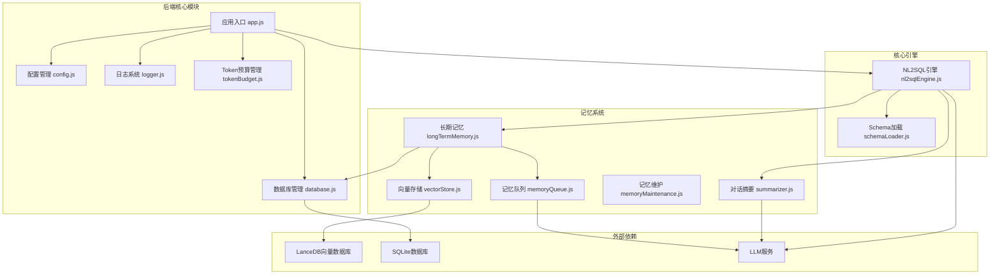
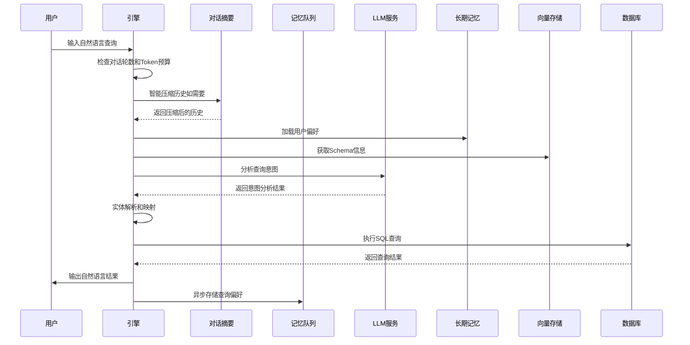
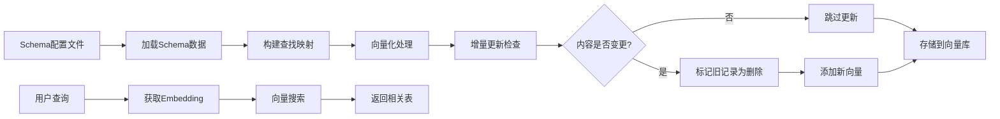
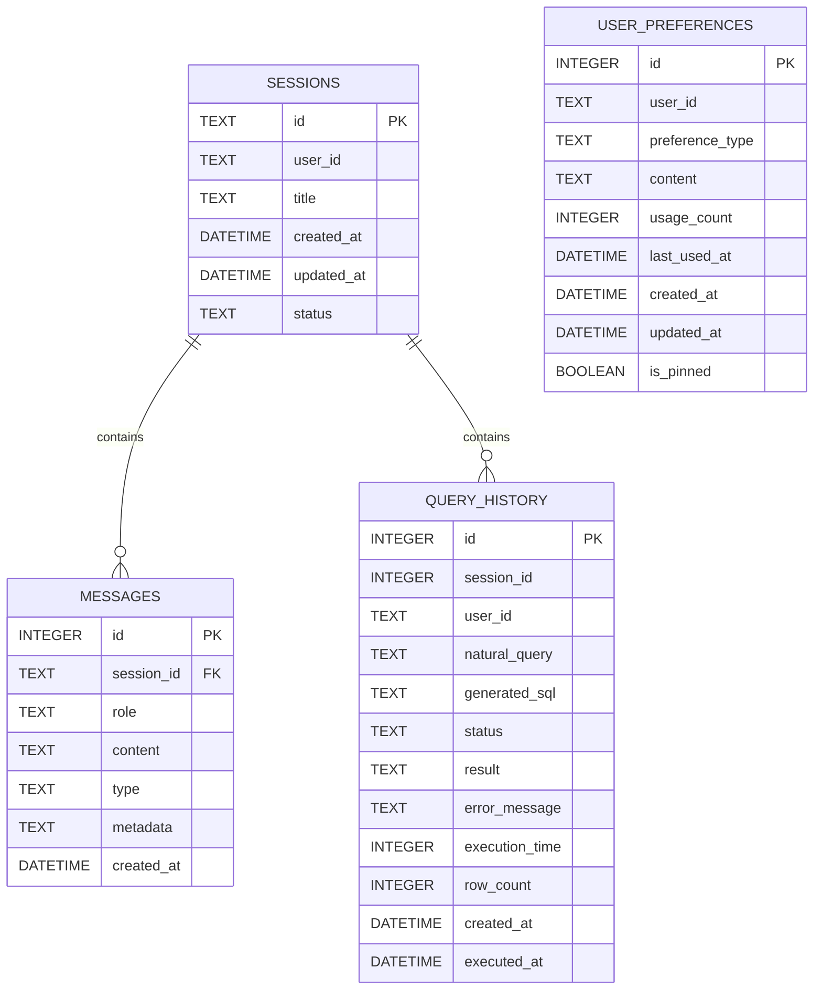
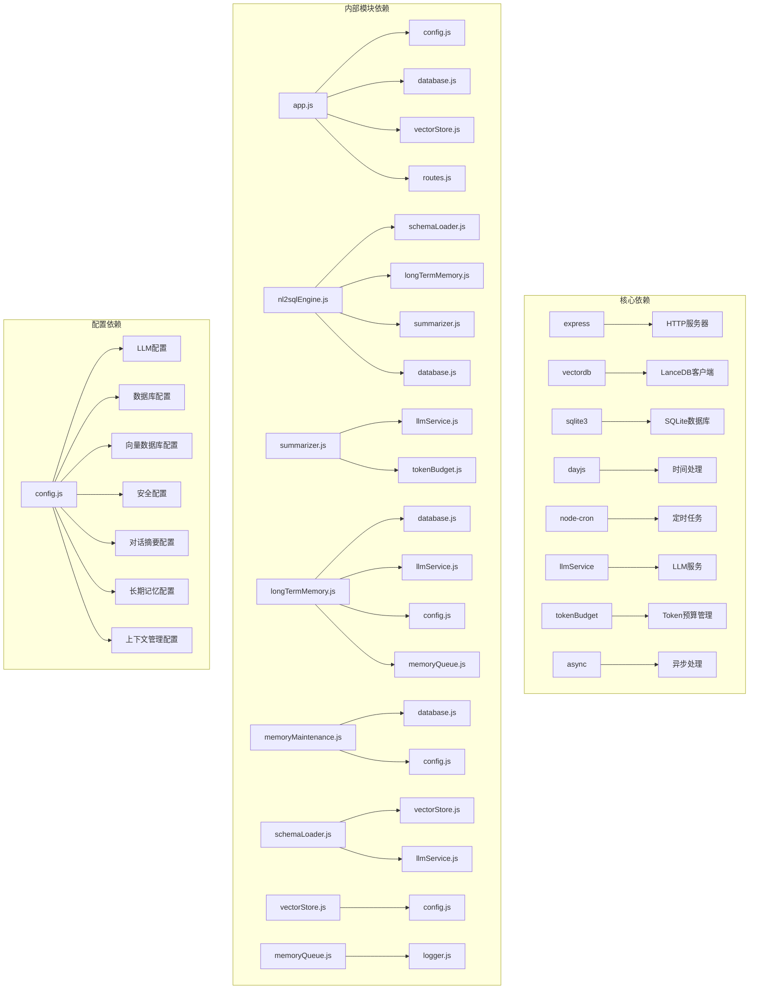

# NL2SQL长期记忆系统

<cite>
**本文档引用的文件**
- [memoryQueue.js](file://NL2SQL/backend/src/memory/memoryQueue.js)
- [longTermMemory.js](file://NL2SQL/backend/src/memory/longTermMemory.js)
- [vectorStore.js](file://NL2SQL/backend/src/memory/vectorStore.js)
- [summarizer.js](file://NL2SQL/backend/src/memory/summarizer.js)
- [memoryMaintenance.js](file://NL2SQL/backend/src/memory/memoryMaintenance.js)
- [nl2sqlEngine.js](file://NL2SQL/backend/src/core/nl2sqlEngine.js)
- [schemaLoader.js](file://NL2SQL/backend/src/core/schemaLoader.js)
- [database.js](file://NL2SQL/backend/src/core/database.js)
- [config.js](file://NL2SQL/backend/src/core/config.js)
- [app.js](file://NL2SQL/backend/src/app.js)
- [logger.js](file://NL2SQL/backend/src/utils/logger.js)
- [tokenBudget.js](file://NL2SQL/backend/src/utils/tokenBudget.js)
- [schema-metadata.json](file://NL2SQL/backend/config/schema-metadata.json)
- [package.json](file://NL2SQL/backend/package.json)
</cite>

## 更新摘要
**变更内容**
- 新增异步记忆存储队列，提升高并发场景下的系统性能
- 增强智能对话摘要触发机制，支持更灵活的压缩策略
- 实现置顶记忆保护功能，确保重要偏好不被清理
- 新增Schema增量更新机制，避免不必要的向量化调用
- 优化LLM智能分析功能，支持更精细的偏好提取

## 目录
1. [简介](#简介)
2. [项目结构](#项目结构)
3. [核心组件](#核心组件)
4. [架构概览](#架构概览)
5. [详细组件分析](#详细组件分析)
6. [依赖关系分析](#依赖关系分析)
7. [性能考虑](#性能考虑)
8. [故障排除指南](#故障排除指南)
9. [结论](#结论)

## 简介

NL2SQL长期记忆系统是一个基于三层记忆架构的智能数据查询系统，专门设计用于自然语言到SQL的转换。该系统通过机器学习和向量检索技术，实现了用户查询习惯的智能学习和长期记忆管理。

系统采用分层设计：
- **第一层：会话记忆** - 短期对话上下文
- **第二层：长期记忆** - 用户偏好和查询模式（本系统重点）
- **第三层：检索记忆** - 向量数据库中的语义检索

**更新** 系统现已新增异步记忆存储队列，能够将记忆存储操作异步化，避免阻塞主流程，显著提升高并发场景下的系统性能。同时增强了智能对话摘要系统，能够智能触发摘要压缩，将早期对话压缩为摘要，保留近期对话原文。新增置顶记忆保护功能，确保重要偏好不会被清理。增强的向量存储功能支持Schema增量更新，避免不必要的Embedding调用。

该系统能够智能识别用户的查询模式、字段别名、常用指标和维度偏好，并通过机器学习算法进行智能提炼和存储。

## 项目结构

NL2SQL系统采用模块化架构，主要分为以下几个核心模块：



**图表来源**
- [app.js:1-238](file://NL2SQL/backend/src/app.js#L1-L238)
- [config.js:1-398](file://NL2SQL/backend/src/core/config.js#L1-L398)

**章节来源**
- [app.js:1-238](file://NL2SQL/backend/src/app.js#L1-L238)
- [package.json:1-28](file://NL2SQL/backend/package.json#L1-L28)

## 核心组件

### 异步记忆存储队列

**新增** 异步记忆存储队列是系统的新功能，负责将记忆存储操作异步化，避免阻塞主流程，显著提升高并发场景下的系统性能。

#### 主要功能特性

1. **队列管理**：
   - 内存队列存储待处理的存储操作
   - 防止重复处理，避免队列拥塞
   - 支持队列状态监控和管理

2. **批量处理**：
   - 批量大小控制（默认5个操作）
   - 并行执行多个存储操作
   - 统一处理结果统计

3. **异步处理**：
   - 非阻塞存储操作
   - 支持操作超时和错误处理
   - 自动重试机制

4. **性能优化**：
   - 处理间隔控制（100ms）
   - 队列状态监控
   - 清理和等待机制

#### 配置管理

系统支持多种配置选项：
- 批量处理大小：控制每次处理的操作数量
- 处理间隔：控制队列处理的频率
- 超时时间：等待队列完成的超时时间

**章节来源**
- [memoryQueue.js:1-217](file://NL2SQL/backend/src/memory/memoryQueue.js#L1-L217)

### 增强智能对话摘要模块

**更新** 智能对话摘要模块现已增强，支持更灵活的触发机制和智能压缩策略。

#### 主要功能特性

1. **智能触发机制**：
   - 基于轮数阈值（默认8轮）触发摘要
   - 基于Token数量阈值触发（默认6000 tokens）
   - 动态压缩效果评估

2. **缓存优化**：
   - 内存缓存机制，避免重复生成摘要
   - 缓存过期时间控制（默认30分钟）
   - 智能缓存更新策略

3. **增量更新**：
   - 支持将新对话增量融合到现有摘要
   - 基于轮数间隔的更新策略
   - 缓存命中率优化

4. **高级压缩策略**：
   - 智能历史分割算法
   - Token预算优化
   - 压缩效果统计

**章节来源**
- [summarizer.js:1-530](file://NL2SQL/backend/src/memory/summarizer.js#L1-L530)

### 置顶记忆保护功能

**新增** 置顶记忆保护功能确保重要偏好不会被清理，实现分级保留策略。

#### 主要功能特性

1. **置顶标记**：
   - 支持为重要偏好设置置顶标记
   - 置顶记忆不受清理规则影响
   - 置顶状态持久化存储

2. **智能清理策略**：
   - 高频偏好（≥10次）：永久保留
   - 中频偏好（3-9次）：90天未用则清理
   - 低频偏好（<3次）：30天未用则清理
   - 字段别名：365天未用则清理（跳过置顶）

3. **清理保护**：
   - 清理操作自动跳过置顶记忆
   - 置顶记忆统计和监控
   - 置顶状态变更通知

**章节来源**
- [memoryMaintenance.js:134-192](file://NL2SQL/backend/src/memory/memoryMaintenance.js#L134-L192)

### Schema增量更新机制

**新增** Schema增量更新机制支持根据内容哈希判断是否需要更新，避免不必要的Embedding调用。

#### 主要功能特性

1. **内容哈希检测**：
   - 基于内容计算MD5哈希
   - 自动检测Schema内容变更
   - 避免重复向量化

2. **智能更新策略**：
   - 内容未变更时跳过更新
   - 内容变更时标记旧记录为删除
   - 新记录添加到向量库

3. **软删除机制**：
   - 标记旧记录为已删除状态
   - 实际清理在维护任务中处理
   - 支持内容恢复

4. **性能优化**：
   - 减少不必要的Embedding调用
   - 降低向量数据库写入压力
   - 提升Schema更新效率

**章节来源**
- [vectorStore.js:799-852](file://NL2SQL/backend/src/memory/vectorStore.js#L799-L852)

### 增强长期记忆管理模块

**更新** 长期记忆管理模块现已集成异步存储队列，支持更高效的偏好存储。

#### 主要功能特性

1. **异步存储集成**：
   - 存储操作自动入队处理
   - 支持批量存储优化
   - 非阻塞存储操作

2. **智能筛选策略**：
   - 置信度阈值过滤（≥0.7）
   - 排除一次性查询
   - 高频模式识别（7天内≥2次）
   - 高价值模板识别（维度≥2且指标≥1）

3. **LLM智能分析增强**：
   - 更精细的偏好提取
   - 支持置顶记忆标记
   - 增强的字段别名学习
   - 智能存储价值评估

4. **即时学习功能增强**：
   - 支持Markdown表格学习
   - 支持平台映射学习
   - 增强的映射关系提取
   - 实时学习反馈

**章节来源**
- [longTermMemory.js:412-446](file://NL2SQL/backend/src/memory/longTermMemory.js#L412-L446)

### 增强记忆维护模块

**更新** 记忆维护模块现已支持置顶记忆保护，确保重要偏好不会被清理。

#### 分级保留策略增强

1. **高频偏好（≥10次）**：永久保留（跳过置顶）
2. **中频偏好（3-9次）**：90天未用则清理（跳过置顶）
3. **低频偏好（<3次）**：30天未用则清理（跳过置顶）
4. **字段别名**：365天未用则清理（跳过置顶）

#### 高级功能增强

1. **置顶记忆保护**：
   - 自动跳过置顶记忆清理
   - 置顶状态统计和监控
   - 置顶记忆使用追踪

2. **相似模式合并增强**：
   - 更精确的相似度计算
   - 支持维度和指标的智能合并
   - 合并历史追踪

**章节来源**
- [memoryMaintenance.js:134-192](file://NL2SQL/backend/src/memory/memoryMaintenance.js#L134-L192)

## 架构概览

NL2SQL长期记忆系统采用分层架构设计，各层之间职责清晰，耦合度低。

```mermaid
graph TB
subgraph "用户界面层"
UI[前端Vue应用]
end
subgraph "API网关层"
API[RESTful API]
SSE[SSE实时通信]
end
subgraph "业务逻辑层"
CORE[核心引擎]
MEM[记忆系统]
SCHEMA[Schema管理]
SUM[对话摘要]
QUEUE[记忆队列]
end
subgraph "数据持久化层"
DB[SQLite数据库]
VDB[LanceDB向量库]
FS[文件系统]
end
subgraph "外部服务"
LLM[LLM服务]
DS[数据源]
END
UI --> API
API --> CORE
API --> MEM
API --> SCHEMA
CORE --> DB
CORE --> LLM
CORE --> SUM
CORE --> QUEUE
MEM --> DB
MEM --> VDB
MEM --> QUEUE
SCHEMA --> DB
SCHEMA --> VDB
SCHEMA --> QUEUE
CORE --> DS
MEM --> FS
SUM --> LLM
QUEUE --> LLM
```

**图表来源**
- [app.js:78-158](file://NL2SQL/backend/src/app.js#L78-L158)
- [nl2sqlEngine.js:1-2583](file://NL2SQL/backend/src/core/nl2sqlEngine.js#L1-L2583)

系统架构特点：

1. **模块化设计**：每个组件都有明确的职责边界
2. **可扩展性**：支持插件式扩展和自定义工具
3. **容错性**：具备优雅降级和错误处理机制
4. **性能优化**：采用缓存、向量化、异步处理等技术提升性能
5. **智能压缩**：对话历史自动压缩，优化上下文管理
6. **异步处理**：记忆存储异步化，提升系统响应速度

## 详细组件分析

### NL2SQL核心引擎

**更新** NL2SQL核心引擎现已集成智能对话摘要功能和异步记忆存储队列，在处理长对话时自动进行历史压缩，优化上下文管理和性能。

#### 意图识别流程



**图表来源**
- [nl2sqlEngine.js:1969-2050](file://NL2SQL/backend/src/core/nl2sqlEngine.js#L1969-L2050)

#### 对话历史压缩流程

系统在对话轮数达到阈值或Token预算不足时自动触发压缩：

1. **轮数检查**：检测当前对话轮数是否达到触发阈值（默认8轮）
2. **Token预算检查**：检测历史Token数量是否超过阈值（默认6000 tokens）
3. **智能压缩**：使用summarizer模块进行历史压缩
4. **缓存优化**：检查缓存避免重复生成摘要
5. **历史融合**：将摘要与近期对话融合

**章节来源**
- [nl2sqlEngine.js:2008-2037](file://NL2SQL/backend/src/core/nl2sqlEngine.js#L2008-L2037)

### Schema元数据管理系统

Schema元数据管理系统负责加载和管理数据表的Schema信息，为查询意图识别提供上下文支持。

#### Schema向量化流程



**图表来源**
- [schemaLoader.js:69-122](file://NL2SQL/backend/src/core/schemaLoader.js#L69-L122)
- [schemaLoader.js:195-290](file://NL2SQL/backend/src/core/schemaLoader.js#L195-L290)

**章节来源**
- [schemaLoader.js:1-1071](file://NL2SQL/backend/src/core/schemaLoader.js#L1-L1071)

### 数据库管理系统

数据库管理系统负责会话历史、查询日志等数据的持久化存储，使用SQLite轻量级数据库。

#### 数据表设计



**图表来源**
- [database.js:39-189](file://NL2SQL/backend/src/core/database.js#L39-L189)

**章节来源**
- [database.js:1-850](file://NL2SQL/backend/src/core/database.js#L1-L850)

### 增强向量存储功能

**更新** 向量存储模块现已增强，新增查询分类和重要性评分机制，提供更精细的查询管理和检索优化。

#### 查询分类机制

系统能够智能识别和分类不同类型的查询：

1. **定义/解释查询**：识别"什么是"、"定义"、"意思"等关键词
2. **对比查询**：识别"对比"、"比较"、"vs"等关键词
3. **趋势查询**：识别"趋势"、"走势"、"变化"等关键词
4. **澄清回复**：识别简短回复和确认信息
5. **跟进查询**：识别依赖上下文的"那"、"还有"等开头
6. **新话题**：识别长查询且高置信度的新话题

#### 重要性评分算法

重要性评分综合考虑多个因素：

1. **基础分**：0.5（所有查询的基础价值）
2. **成功状态**：成功查询额外+0.1
3. **维度数量**：每增加一个维度最多+0.15
4. **指标数量**：每增加一个指标最多+0.15
5. **筛选条件**：每增加一个筛选条件最多+0.1
6. **置信度**：高置信度查询额外+0.1
7. **上下文查询**：需要理解上下文的查询额外+0.05

**章节来源**
- [vectorStore.js:38-193](file://NL2SQL/backend/src/memory/vectorStore.js#L38-L193)

### 增强长期记忆功能

**更新** 系统新增了强大的平台术语学习功能，能够智能识别和学习用户对平台术语的个性化映射。

#### 平台术语学习机制

系统现在能够学习用户对"新平台"/"老平台"等术语的个性化映射：

1. **术语识别**：自动识别用户查询中的平台术语
2. **映射学习**：将用户术语映射到相应的数据库标识
3. **智能存储**：支持datasource类型的字段别名学习
4. **自动应用**：在后续查询中自动使用学习到的映射

#### 即时学习功能

系统支持从澄清轮中提取映射关系：

1. **Markdown表格学习**：支持游戏ID映射表格的学习
2. **键值对学习**：支持"新平台：new_tzpingtai"等格式
3. **显式声明学习**：支持"华夏对应 game_id=88"等声明
4. **平台映射学习**：专门支持"新平台"/"老平台"的数据库标识映射

**章节来源**
- [longTermMemory.js:828-965](file://NL2SQL/backend/src/memory/longTermMemory.js#L828-L965)

## 依赖关系分析

系统采用模块化设计，各组件之间的依赖关系清晰明确。



**图表来源**
- [package.json:10-20](file://NL2SQL/backend/package.json#L10-L20)
- [app.js:39-50](file://NL2SQL/backend/src/app.js#L39-L50)

### 外部服务集成

系统通过LLM服务实现智能查询意图识别和偏好提取：

1. **LLM API集成**：支持OpenAI兼容的API服务
2. **Embedding服务**：文本向量化处理
3. **向量检索**：基于语义相似度的查询推荐
4. **对话摘要**：LLM驱动的对话历史压缩

**章节来源**
- [config.js:60-87](file://NL2SQL/backend/src/core/config.js#L60-L87)

## 性能考虑

### 缓存策略

系统实现了多层次的缓存机制：

1. **Schema缓存**：Schema元数据缓存，支持过期检查
2. **向量缓存**：向量数据库连接缓存
3. **查询结果缓存**：常用查询结果缓存
4. **摘要缓存**：对话摘要内存缓存（默认30分钟过期）
5. **记忆队列缓存**：异步存储操作缓存

### 性能优化措施

1. **批量处理**：向量嵌入获取采用批量处理，提高效率
2. **索引优化**：数据库表建立适当的索引
3. **内存管理**：合理控制内存使用，避免内存泄漏
4. **异步处理**：大量使用Promise和async/await
5. **智能压缩**：对话历史自动压缩，减少Token消耗
6. **增量更新**：Schema向量采用增量更新，避免重复处理
7. **队列处理**：记忆存储异步化，提升系统响应速度

### 扩展性设计

1. **插件系统**：支持动态加载自定义工具
2. **配置驱动**：通过配置文件控制各种行为
3. **模块化架构**：易于添加新功能和修改现有功能
4. **环境变量支持**：便于不同环境的配置管理

## 故障排除指南

### 常见问题及解决方案

#### 向量数据库初始化失败

**问题症状**：
- 启动时出现向量数据库初始化错误
- 语义搜索功能不可用

**解决方案**：
1. 检查LanceDB依赖是否正确安装
2. 验证向量数据库路径权限
3. 确认磁盘空间充足

#### LLM服务连接失败

**问题症状**：
- 意图识别功能异常
- 偏好提取失败
- 对话摘要生成失败

**解决方案**：
1. 检查LLM API密钥配置
2. 验证网络连接
3. 确认API服务可用性

#### 数据库连接问题

**问题症状**：
- 会话历史无法保存
- 查询日志丢失

**解决方案**：
1. 检查SQLite数据库文件权限
2. 验证数据库文件完整性
3. 确认磁盘空间充足

#### 对话摘要缓存问题

**问题症状**：
- 摘要缓存失效
- 重复生成摘要
- 内存占用过高

**解决方案**：
1. 检查缓存过期时间设置
2. 验证缓存清理机制
3. 监控内存使用情况

#### 异步记忆队列问题

**问题症状**：
- 队列积压严重
- 存储操作超时
- 队列处理异常

**解决方案**：
1. 检查队列处理间隔设置
2. 验证批量处理大小
3. 监控队列状态和处理性能

**章节来源**
- [logger.js:283-293](file://NL2SQL/backend/src/utils/logger.js#L283-L293)

### 日志分析

系统提供了完善的日志记录功能，支持多级别日志输出：

1. **调试日志**：详细的操作流程记录
2. **信息日志**：系统状态和关键事件
3. **警告日志**：潜在问题的预警
4. **错误日志**：异常情况的详细记录

**章节来源**
- [logger.js:1-318](file://NL2SQL/backend/src/utils/logger.js#L1-L318)

## 结论

NL2SQL长期记忆系统是一个功能完整、架构清晰的智能数据查询系统。通过三层记忆架构设计，系统能够有效学习和利用用户查询习惯，提供个性化的查询体验。

### 系统优势

1. **智能化程度高**：通过LLM实现智能查询意图识别和偏好提取
2. **可扩展性强**：模块化设计支持功能扩展和定制
3. **性能优异**：采用向量化、缓存、异步处理等技术提升查询效率
4. **可靠性强**：完善的错误处理和监控机制
5. **智能压缩**：对话历史自动压缩，优化上下文管理
6. **精细分类**：查询分类和重要性评分机制
7. **异步处理**：记忆存储异步化，提升系统响应速度
8. **置顶保护**：重要偏好不会被清理，确保用户体验
9. **增量更新**：Schema向量采用增量更新，避免重复处理
10. **智能缓存**：多层缓存机制，提升系统性能

**更新** 新增的异步记忆存储队列大大提升了系统在高并发场景下的性能表现，现在系统能够高效处理大量并发的记忆存储请求。增强的智能对话摘要功能支持更灵活的压缩策略，能够根据轮数和Token预算智能触发压缩。置顶记忆保护功能确保重要偏好不会被清理，提升了用户体验的稳定性。Schema增量更新机制避免了不必要的Embedding调用，降低了系统开销。

### 技术特色

1. **三层记忆架构**：从短期到长期的记忆管理
2. **语义检索能力**：基于向量相似度的智能搜索
3. **智能偏好学习**：自动识别和存储用户查询习惯
4. **分级保留策略**：智能清理过期记忆，优化存储空间
5. **平台术语学习**：支持用户个性化平台术语映射
6. **对话历史压缩**：LLM驱动的智能对话管理
7. **查询分类机制**：精细化的查询类型识别
8. **重要性评分**：基于多因素的查询价值评估
9. **异步存储队列**：非阻塞的记忆存储处理
10. **置顶记忆保护**：重要偏好的保护机制
11. **增量更新机制**：避免重复处理的优化策略

### 发展方向

1. **增强学习算法**：改进偏好提取的准确性和效率
2. **多模态支持**：支持图片、语音等多种输入方式
3. **实时协作**：支持多用户实时协作查询
4. **边缘计算**：支持在边缘设备上部署
5. **智能缓存优化**：进一步优化缓存策略和内存使用
6. **置顶记忆智能管理**：支持更智能的置顶记忆标记和管理
7. **增量更新智能检测**：改进内容变更检测算法
8. **异步队列智能调度**：优化队列处理策略和性能

该系统为自然语言数据查询提供了一个完整的解决方案，具有良好的实用价值和推广前景。