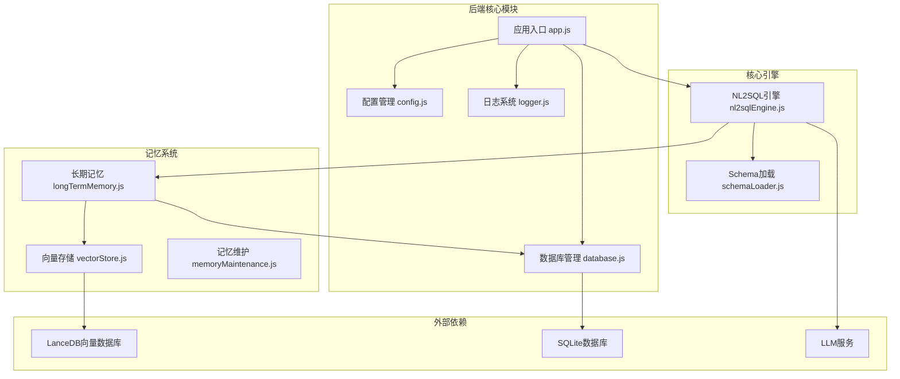
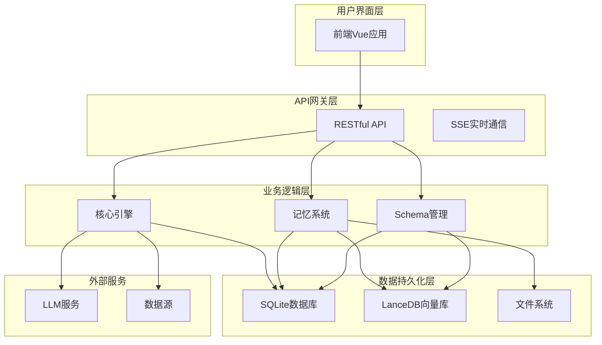
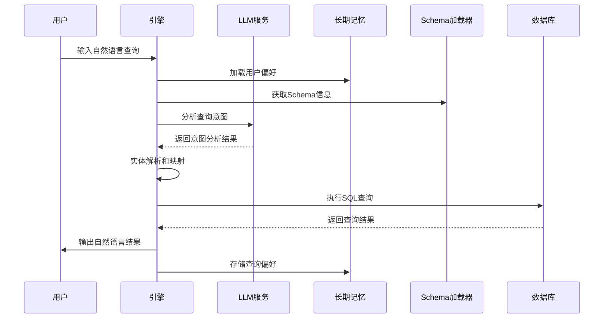
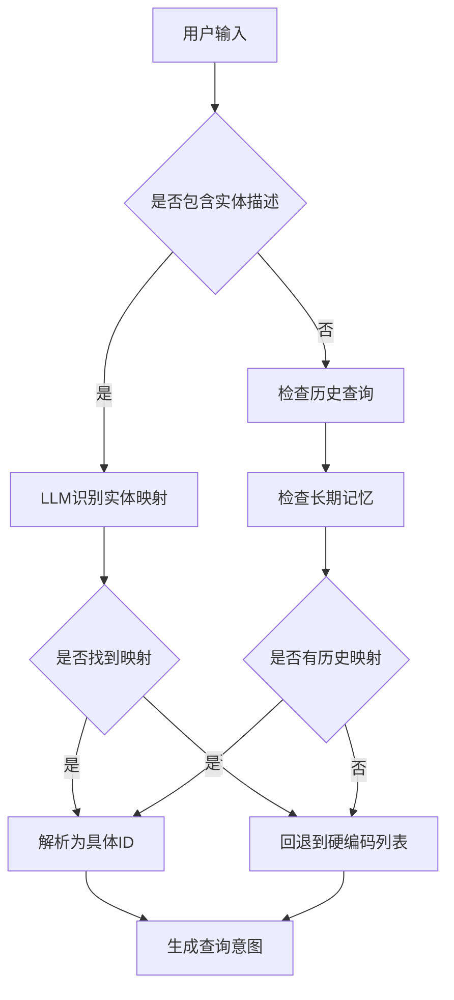
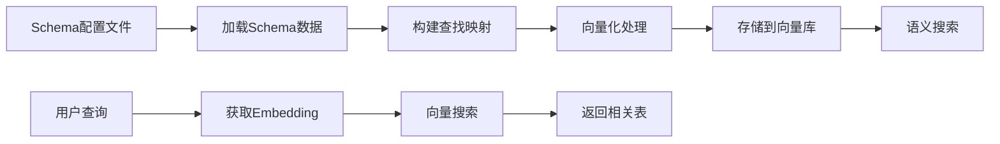
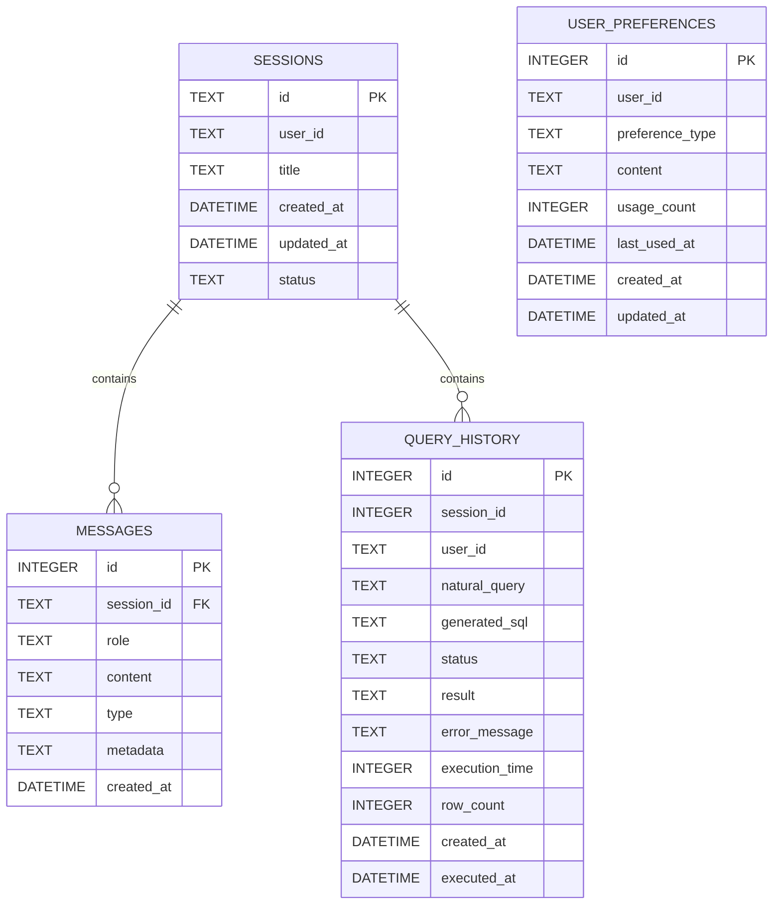
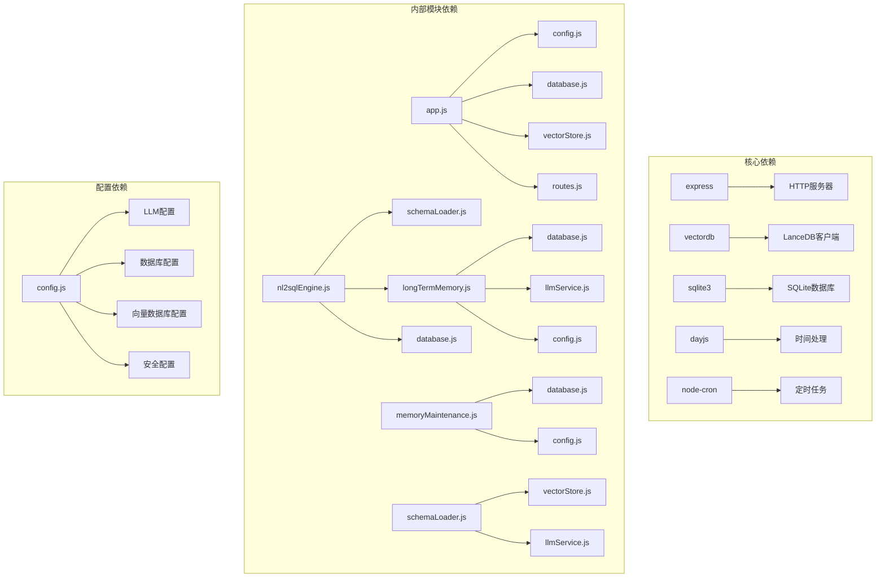

# NL2SQL长期记忆系统

<cite>
**本文档引用的文件**
- [longTermMemory.js](file://NL2SQL/backend/src/memory/longTermMemory.js)
- [vectorStore.js](file://NL2SQL/backend/src/memory/vectorStore.js)
- [memoryMaintenance.js](file://NL2SQL/backend/src/memory/memoryMaintenance.js)
- [nl2sqlEngine.js](file://NL2SQL/backend/src/core/nl2sqlEngine.js)
- [schemaLoader.js](file://NL2SQL/backend/src/core/schemaLoader.js)
- [database.js](file://NL2SQL/backend/src/core/database.js)
- [config.js](file://NL2SQL/backend/src/core/config.js)
- [app.js](file://NL2SQL/backend/src/app.js)
- [logger.js](file://NL2SQL/backend/src/utils/logger.js)
- [schema-metadata.json](file://NL2SQL/backend/config/schema-metadata.json)
- [package.json](file://NL2SQL/backend/package.json)
</cite>

## 更新摘要
**变更内容**
- 新增平台术语学习功能，支持用户对"新平台"/"老平台"等术语的个性化映射
- 增强datasource类型的字段别名学习能力
- 更新LLM智能分析功能，支持更精细的偏好提取
- 改进实体解析机制，支持平台术语的自动识别和映射

## 目录
1. [简介](#简介)
2. [项目结构](#项目结构)
3. [核心组件](#核心组件)
4. [架构概览](#架构概览)
5. [详细组件分析](#详细组件分析)
6. [依赖关系分析](#依赖关系分析)
7. [性能考虑](#性能考虑)
8. [故障排除指南](#故障排除指南)
9. [结论](#结论)

## 简介

NL2SQL长期记忆系统是一个基于三层记忆架构的智能数据查询系统，专门设计用于自然语言到SQL的转换。该系统通过机器学习和向量检索技术，实现了用户查询习惯的智能学习和长期记忆管理。

系统采用分层设计：
- **第一层：会话记忆** - 短期对话上下文
- **第二层：长期记忆** - 用户偏好和查询模式（本系统重点）
- **第三层：检索记忆** - 向量数据库中的语义检索

**更新** 系统现已增强平台术语学习功能，能够智能识别和学习用户对"新平台"/"老平台"等术语的个性化映射，支持datasource类型的字段别名学习，大大增强了系统的个性化服务能力。

该系统能够智能识别用户的查询模式、字段别名、常用指标和维度偏好，并通过机器学习算法进行智能提炼和存储。

## 项目结构

NL2SQL系统采用模块化架构，主要分为以下几个核心模块：

**图表来源**
- [app.js:1-238](file://NL2SQL/backend/src/app.js#L1-L238)
- [config.js:1-332](file://NL2SQL/backend/src/core/config.js#L1-L332)

**章节来源**
- [app.js:1-238](file://NL2SQL/backend/src/app.js#L1-L238)
- [package.json:1-28](file://NL2SQL/backend/package.json#L1-L28)

## 核心组件

### 长期记忆管理模块

长期记忆管理模块是系统的核心组件，负责用户长期记忆的提取、存储、检索和维护。该模块实现了智能筛选策略，确保只有有价值的查询模式才会被存储。

#### 主要功能特性

1. **智能筛选策略**：
   - 置信度阈值过滤（≥0.7）
   - 排除一次性查询
   - 高频模式识别（7天内≥2次）
   - 高价值模板识别（维度≥2且指标≥1）

2. **偏好类型分类**：
   - 查询模式（query_pattern）
   - 字段别名（field_alias）
   - 指标偏好（metric_preference）
   - 维度偏好（dimension_preference）

3. **LLM智能分析**：
   - 字段别名映射识别
   - 分析习惯提取
   - 业务逻辑定义识别
   - 通用知识过滤

**更新** 新增平台术语学习功能，支持用户对"新平台"/"老平台"等术语的个性化映射学习，特别增强了datasource类型的字段别名学习能力。

4. **即时学习功能**：
   - 从澄清轮中提取映射关系
   - 支持Markdown表格格式的游戏ID映射
   - 支持键值对格式的平台映射
   - 支持显式声明的映射关系

**章节来源**
- [longTermMemory.js:1-1134](file://NL2SQL/backend/src/memory/longTermMemory.js#L1-L1134)

### 向量存储模块

向量存储模块基于LanceDB实现，提供语义相似度搜索功能。该模块存储Schema信息和查询历史的向量表示，支持高效的语义检索。

#### 核心功能

1. **Schema向量存储**：
   - 表结构向量化
   - 字段信息向量化
   - 语义相似度搜索

2. **查询历史向量存储**：
   - 用户查询向量化
   - 历史查询相似度检索
   - 相似查询推荐

3. **向量数据库管理**：
   - 自动初始化
   - 数据统计
   - 清理和维护

**章节来源**
- [vectorStore.js:1-621](file://NL2SQL/backend/src/memory/vectorStore.js#L1-L621)

### 记忆维护模块

记忆维护模块负责长期记忆的定期压缩、清理和维护，实现分级保留策略。

#### 分级保留策略

1. **高频偏好（≥10次）**：永久保留
2. **中频偏好（3-9次）**：90天未用则清理
3. **低频偏好（<3次）**：30天未用则清理
4. **字段别名**：365天未用则清理

#### 高级功能

1. **相似模式合并**：合并高度相似的查询模式
2. **记忆健康报告**：生成系统记忆使用统计
3. **自动清理机制**：定期清理过期记忆

**章节来源**
- [memoryMaintenance.js:1-415](file://NL2SQL/backend/src/memory/memoryMaintenance.js#L1-L415)

## 架构概览

NL2SQL长期记忆系统采用分层架构设计，各层之间职责清晰，耦合度低。

**图表来源**
- [app.js:78-158](file://NL2SQL/backend/src/app.js#L78-L158)
- [nl2sqlEngine.js:1-800](file://NL2SQL/backend/src/core/nl2sqlEngine.js#L1-L800)

系统架构特点：

1. **模块化设计**：每个组件都有明确的职责边界
2. **可扩展性**：支持插件式扩展和自定义工具
3. **容错性**：具备优雅降级和错误处理机制
4. **性能优化**：采用缓存、向量化等技术提升性能

## 详细组件分析

### NL2SQL核心引擎

NL2SQL核心引擎是系统的大脑，负责自然语言到SQL的完整转换流程。

#### 意图识别流程

**图表来源**
- [nl2sqlEngine.js:311-567](file://NL2SQL/backend/src/core/nl2sqlEngine.js#L311-L567)

#### 实体解析机制

系统实现了智能的实体解析机制，能够处理用户提供的模糊描述并解析为具体ID。

**更新** 新增平台术语解析功能，能够识别"新平台"/"老平台"等术语并映射到相应的数据库标识。

**章节来源**
- [nl2sqlEngine.js:1-2010](file://NL2SQL/backend/src/core/nl2sqlEngine.js#L1-L2010)

### Schema元数据管理系统

Schema元数据管理系统负责加载和管理数据表的Schema信息，为查询意图识别提供上下文支持。

#### Schema向量化流程

**图表来源**
- [schemaLoader.js:69-122](file://NL2SQL/backend/src/core/schemaLoader.js#L69-L122)
- [schemaLoader.js:195-290](file://NL2SQL/backend/src/core/schemaLoader.js#L195-L290)

**章节来源**
- [schemaLoader.js:1-751](file://NL2SQL/backend/src/core/schemaLoader.js#L1-L751)

### 数据库管理系统

数据库管理系统负责会话历史、查询日志等数据的持久化存储，使用SQLite轻量级数据库。

#### 数据表设计

**图表来源**
- [database.js:39-189](file://NL2SQL/backend/src/core/database.js#L39-L189)

**章节来源**
- [database.js:1-850](file://NL2SQL/backend/src/core/database.js#L1-L850)

### 长期记忆增强功能

**更新** 系统新增了强大的平台术语学习功能，能够智能识别和学习用户对平台术语的个性化映射。

#### 平台术语学习机制

系统现在能够学习用户对"新平台"/"老平台"等术语的个性化映射：

1. **术语识别**：自动识别用户查询中的平台术语
2. **映射学习**：将用户术语映射到相应的数据库标识
3. **智能存储**：支持datasource类型的字段别名学习
4. **自动应用**：在后续查询中自动使用学习到的映射

#### 即时学习功能

系统支持从澄清轮中提取映射关系：

1. **Markdown表格学习**：支持游戏ID映射表格的学习
2. **键值对学习**：支持"新平台：new_tzpingtai"等格式
3. **显式声明学习**：支持"华夏对应 game_id=88"等声明
4. **平台映射学习**：专门支持"新平台"/"老平台"的数据库标识映射

**章节来源**
- [longTermMemory.js:828-965](file://NL2SQL/backend/src/memory/longTermMemory.js#L828-L965)

## 依赖关系分析

系统采用模块化设计，各组件之间的依赖关系清晰明确。

**图表来源**
- [package.json:10-20](file://NL2SQL/backend/package.json#L10-L20)
- [app.js:39-50](file://NL2SQL/backend/src/app.js#L39-L50)

### 外部服务集成

系统通过LLM服务实现智能查询意图识别和偏好提取：

1. **LLM API集成**：支持OpenAI兼容的API服务
2. **Embedding服务**：文本向量化处理
3. **向量检索**：基于语义相似度的查询推荐

**章节来源**
- [config.js:60-87](file://NL2SQL/backend/src/core/config.js#L60-L87)

## 性能考虑

### 缓存策略

系统实现了多层次的缓存机制：

1. **Schema缓存**：Schema元数据缓存，支持过期检查
2. **向量缓存**：向量数据库连接缓存
3. **查询结果缓存**：常用查询结果缓存

### 性能优化措施

1. **批量处理**：向量嵌入获取采用批量处理，提高效率
2. **索引优化**：数据库表建立适当的索引
3. **内存管理**：合理控制内存使用，避免内存泄漏
4. **异步处理**：大量使用Promise和async/await

### 扩展性设计

1. **插件系统**：支持动态加载自定义工具
2. **配置驱动**：通过配置文件控制各种行为
3. **模块化架构**：易于添加新功能和修改现有功能

## 故障排除指南

### 常见问题及解决方案

#### 向量数据库初始化失败

**问题症状**：
- 启动时出现向量数据库初始化错误
- 语义搜索功能不可用

**解决方案**：
1. 检查LanceDB依赖是否正确安装
2. 验证向量数据库路径权限
3. 确认磁盘空间充足

#### LLM服务连接失败

**问题症状**：
- 意图识别功能异常
- 偏好提取失败

**解决方案**：
1. 检查LLM API密钥配置
2. 验证网络连接
3. 确认API服务可用性

#### 数据库连接问题

**问题症状**：
- 会话历史无法保存
- 查询日志丢失

**解决方案**：
1. 检查SQLite数据库文件权限
2. 验证数据库文件完整性
3. 确认磁盘空间充足

**章节来源**
- [logger.js:283-293](file://NL2SQL/backend/src/utils/logger.js#L283-L293)

### 日志分析

系统提供了完善的日志记录功能，支持多级别日志输出：

1. **调试日志**：详细的操作流程记录
2. **信息日志**：系统状态和关键事件
3. **警告日志**：潜在问题的预警
4. **错误日志**：异常情况的详细记录

**章节来源**
- [logger.js:1-318](file://NL2SQL/backend/src/utils/logger.js#L1-L318)

## 结论

NL2SQL长期记忆系统是一个功能完整、架构清晰的智能数据查询系统。通过三层记忆架构设计，系统能够有效学习和利用用户查询习惯，提供个性化的查询体验。

### 系统优势

1. **智能化程度高**：通过LLM实现智能查询意图识别和偏好提取
2. **可扩展性强**：模块化设计支持功能扩展和定制
3. **性能优异**：采用向量化和缓存技术提升查询效率
4. **可靠性强**：完善的错误处理和监控机制

**更新** 新增的平台术语学习功能大大增强了系统的个性化服务能力，现在系统能够智能识别和学习用户对"新平台"/"老平台"等术语的个性化映射，支持datasource类型的字段别名学习。

### 技术特色

1. **三层记忆架构**：从短期到长期的记忆管理
2. **语义检索能力**：基于向量相似度的智能搜索
3. **智能偏好学习**：自动识别和存储用户查询习惯
4. **分级保留策略**：智能清理过期记忆，优化存储空间
5. **平台术语学习**：支持用户个性化平台术语映射

### 发展方向

1. **增强学习算法**：改进偏好提取的准确性和效率
2. **多模态支持**：支持图片、语音等多种输入方式
3. **实时协作**：支持多用户实时协作查询
4. **边缘计算**：支持在边缘设备上部署

该系统为自然语言数据查询提供了一个完整的解决方案，具有良好的实用价值和推广前景。