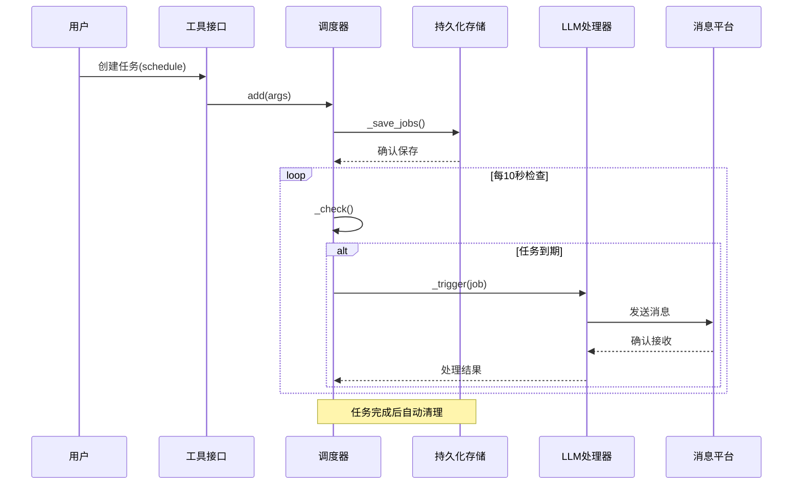
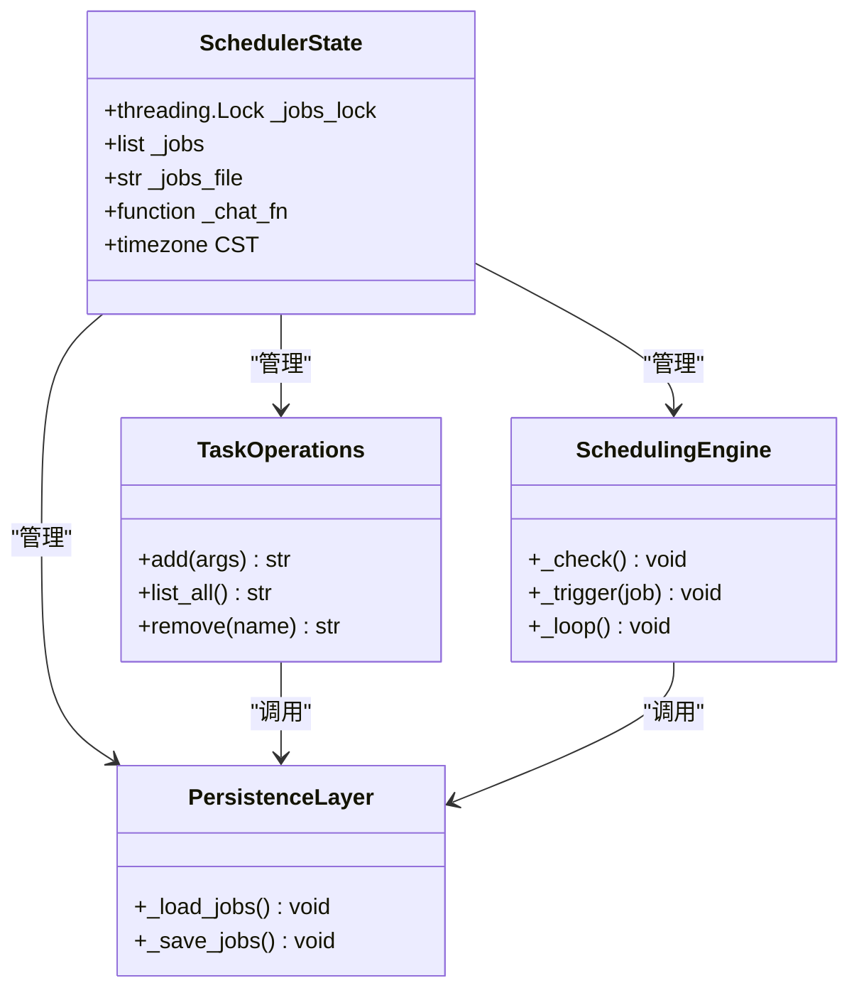
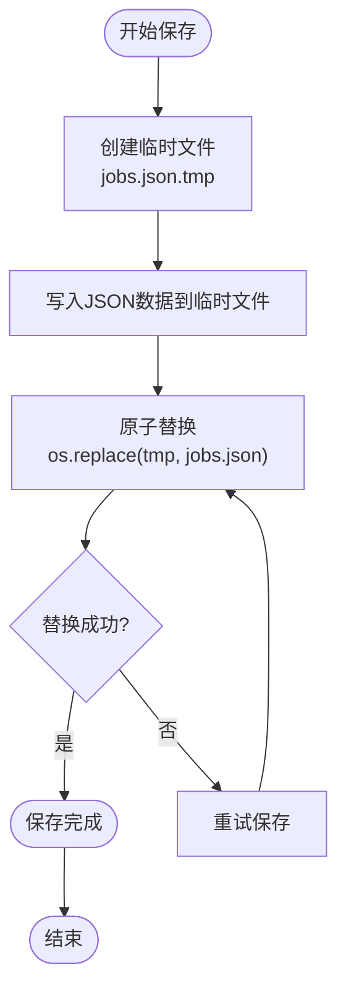
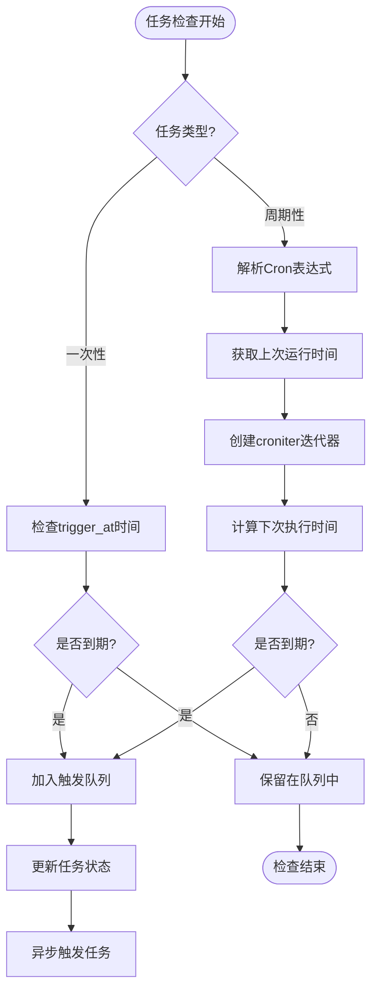
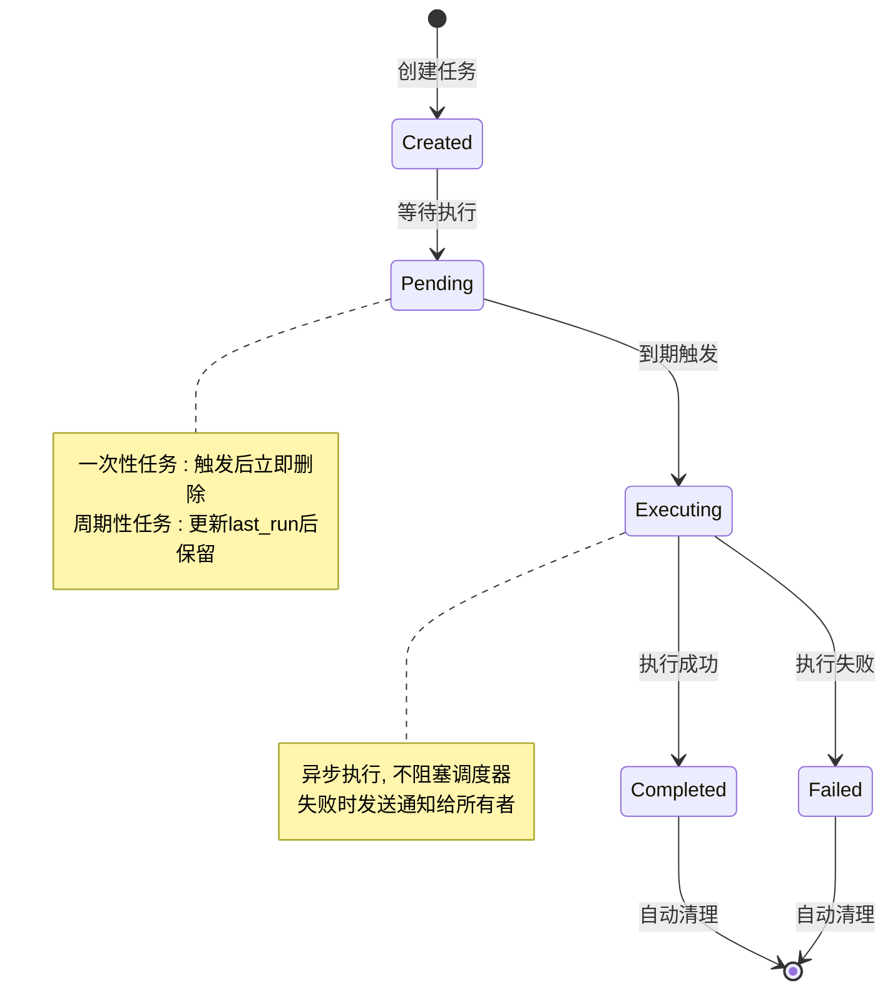
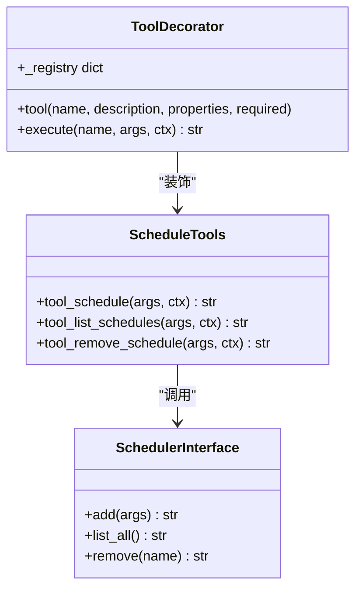
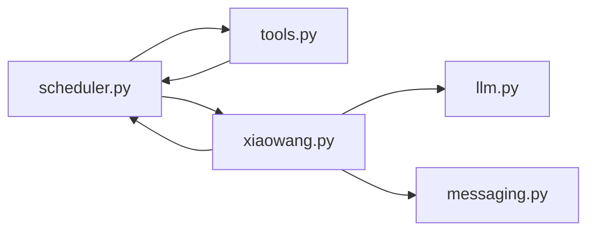

# 任务调度系统 (scheduler.py) 技术文档

<cite>
**本文档引用的文件**
- [scheduler.py](file://scheduler.py)
- [tools.py](file://tools.py)
- [xiaowang.py](file://xiaowang.py)
- [README.md](file://README.md)
- [config.example.json](file://config.example.json)
</cite>

## 目录
1. [简介](#简介)
2. [项目结构](#项目结构)
3. [核心组件](#核心组件)
4. [架构概览](#架构概览)
5. [详细组件分析](#详细组件分析)
6. [依赖关系分析](#依赖关系分析)
7. [性能考虑](#性能考虑)
8. [故障排查指南](#故障排查指南)
9. [结论](#结论)
10. [附录](#附录)

## 简介
本任务调度系统是7/24办公自动化AI代理系统的核心组件之一，提供一次性任务和周期性任务的统一管理能力。系统采用纯Python实现，无需任何框架依赖，集成了croniter库用于Cron表达式解析，并实现了完整的任务持久化机制。

该系统的主要特性包括：
- 支持一次性延迟任务和周期性任务（Cron）
- 基于jobs.json的持久化存储
- 多线程安全的任务调度
- 时区感知的时间计算
- 自动化的故障通知机制

## 项目结构
基于仓库的整体架构，任务调度系统位于独立的scheduler.py文件中，通过工具接口与主系统集成。

```mermaid
graph TB
subgraph "系统架构"
A[xiaowang.py<br/>入口点] --> B[scheduler.py<br/>任务调度器]
A --> C[tools.py<br/>工具注册]
A --> D[llm.py<br/>LLM处理]
A --> E[memory.py<br/>记忆系统]
F[jobs.json<br/>持久化存储] <- --> B
G[croniter库<br/>Cron解析] --> B
H[消息平台] --> D
I[文件系统] --> B
end
```

**图表来源**
- [xiaowang.py:60-75](file://xiaowang.py#L60-L75)
- [scheduler.py:10-18](file://scheduler.py#L10-L18)

**章节来源**
- [README.md:23-66](file://README.md#L23-L66)
- [xiaowang.py:60-75](file://xiaowang.py#L60-L75)

## 核心组件
任务调度系统由以下核心组件构成：

### 1. 调度器内核
- **状态管理**：全局任务列表、锁机制、配置参数
- **持久化层**：jobs.json文件的读写操作
- **调度循环**：后台检查线程，每10秒检查一次

### 2. 任务类型
- **一次性任务**：基于时间戳触发，触发后自动删除
- **周期性任务**：基于Cron表达式重复执行
- **一次性周期任务**：基于Cron表达式执行一次后删除

### 3. 工具接口
- **schedule工具**：创建新任务
- **list_schedules工具**：列出所有任务
- **remove_schedule工具**：删除指定任务

**章节来源**
- [scheduler.py:24-27](file://scheduler.py#L24-L27)
- [scheduler.py:49-104](file://scheduler.py#L49-L104)
- [tools.py:240-261](file://tools.py#L240-L261)

## 架构概览
系统采用模块化设计，通过清晰的职责分离实现高内聚低耦合。



**图表来源**
- [scheduler.py:130-169](file://scheduler.py#L130-L169)
- [tools.py:240-249](file://tools.py#L240-L249)

## 详细组件分析

### 1. 线程安全机制
系统通过细粒度的锁机制确保多线程环境下的数据一致性：



**图表来源**
- [scheduler.py:24-27](file://scheduler.py#L24-L27)
- [scheduler.py:49-104](file://scheduler.py#L49-L104)
- [scheduler.py:110-127](file://scheduler.py#L110-L127)

#### 锁机制设计要点：
- 使用`threading.Lock()`保护全局任务列表
- 在任务增删改查操作中统一加锁
- 避免竞态条件导致的数据不一致

**章节来源**
- [scheduler.py:24](file://scheduler.py#L24)
- [scheduler.py:73](file://scheduler.py#L73)
- [scheduler.py:83](file://scheduler.py#L83)
- [scheduler.py:97](file://scheduler.py#L97)

### 2. 任务持久化存储
系统采用原子写入策略确保数据完整性：



**图表来源**
- [scheduler.py:122-127](file://scheduler.py#L122-L127)

#### 持久化策略优势：
- 防止系统崩溃导致的数据损坏
- 确保任务状态在重启后可恢复
- 支持断电保护机制

**章节来源**
- [scheduler.py:122-127](file://scheduler.py#L122-L127)

### 3. Cron表达式解析与时间计算
系统集成了croniter库进行精确的Cron表达式解析：



**图表来源**
- [scheduler.py:140-168](file://scheduler.py#L140-L168)

#### Cron处理关键特性：
- 使用中国标准时间(CST)进行解析，避免UTC转换问题
- 支持`last_run`和`created_ts`两种时间源
- 自动处理Cron表达式错误和异常情况

**章节来源**
- [scheduler.py:142-159](file://scheduler.py#L142-L159)
- [scheduler.py:188-205](file://scheduler.py#L188-L205)

### 4. 任务生命周期管理
系统实现了完整的任务生命周期管理：



**图表来源**
- [scheduler.py:130-169](file://scheduler.py#L130-L169)

**章节来源**
- [scheduler.py:130-169](file://scheduler.py#L130-L169)

### 5. 工具接口实现
系统通过装饰器模式提供标准化的工具接口：



**图表来源**
- [tools.py:36-74](file://tools.py#L36-L74)
- [tools.py:240-261](file://tools.py#L240-L261)
- [scheduler.py:49-104](file://scheduler.py#L49-L104)

**章节来源**
- [tools.py:36-74](file://tools.py#L36-L74)
- [tools.py:240-261](file://tools.py#L240-L261)

## 依赖关系分析

### 外部依赖
系统依赖以下外部库：
- **croniter**：Cron表达式解析库
- **标准库**：json、logging、os、threading、time、datetime

### 内部模块依赖


**图表来源**
- [xiaowang.py:60-66](file://xiaowang.py#L60-L66)
- [tools.py:81-82](file://tools.py#L81-L82)

**章节来源**
- [scheduler.py:10-15](file://scheduler.py#L10-L15)
- [xiaowang.py:60-66](file://xiaowang.py#L60-L66)
- [tools.py:81-82](file://tools.py#L81-L82)

## 性能考虑

### 1. 时间复杂度分析
- **任务检查**：O(n)，其中n为任务数量
- **任务添加**：O(n)，需要去重和排序
- **任务删除**：O(n)，线性扫描匹配
- **Cron解析**：O(1)，每次检查仅解析当前任务

### 2. 内存使用优化
- 任务状态仅保存在内存中，减少磁盘I/O
- 使用生成器表达式进行列表过滤
- 及时清理已完成的一次性任务

### 3. 并发性能
- 使用细粒度锁避免全局阻塞
- 异步执行任务触发，不阻塞调度循环
- 后台线程定期检查，避免频繁唤醒

## 故障排查指南

### 常见问题及解决方案

#### 1. Cron表达式解析错误
**症状**：日志中出现cron错误信息
**原因**：Cron表达式格式不正确
**解决**：检查Cron表达式的语法格式

#### 2. 任务未按预期触发
**症状**：任务延迟或提前触发
**原因**：时区设置或系统时间问题
**解决**：确认系统时间和时区配置

#### 3. 数据持久化失败
**症状**：jobs.json文件损坏或丢失
**原因**：系统崩溃或磁盘故障
**解决**：检查磁盘空间和权限，系统重启后自动恢复

#### 4. 线程死锁
**症状**：系统响应缓慢或无响应
**原因**：锁竞争或死锁
**解决**：检查锁的使用模式，避免嵌套锁

**章节来源**
- [scheduler.py:157-158](file://scheduler.py#L157-L158)
- [scheduler.py:213-214](file://scheduler.py#L213-L214)

## 结论
任务调度系统通过简洁而高效的架构设计，实现了可靠的定时任务管理功能。系统的主要优势包括：

1. **可靠性**：原子文件写入确保数据完整性
2. **易用性**：简单的API设计，支持多种任务类型
3. **可维护性**：模块化设计，职责清晰
4. **扩展性**：基于装饰器的工具接口便于扩展

该系统为7/24办公自动化AI代理提供了坚实的任务管理基础，支持复杂的业务场景需求。

## 附录

### 1. 任务类型对照表
| 任务类型 | 参数 | 触发条件 | 生命周期 |
|---------|------|----------|----------|
| 一次性任务 | delay_seconds | 到达trigger_at时间 | 触发后删除 |
| 周期性任务 | cron_expr | Cron表达式匹配 | 保留并更新last_run |
| 一次性周期任务 | cron_expr, once=true | 第一次Cron匹配 | 触发后删除 |

### 2. 配置示例
系统通过config.json进行配置，关键配置项包括：
- **jobs.json路径**：任务持久化文件位置
- **时区设置**：默认使用中国标准时间
- **日志级别**：INFO级别输出运行状态

### 3. 最佳实践建议
- 合理设置Cron表达式，避免过于频繁的执行
- 为重要任务添加适当的错误处理和重试机制
- 定期备份jobs.json文件
- 监控系统资源使用情况，避免任务过多导致性能问题

**章节来源**
- [config.example.json:1-61](file://config.example.json#L1-L61)
- [scheduler.py:18](file://scheduler.py#L18)