# 多租户路由器 (router.py) 技术文档

<cite>
**本文档引用的文件**
- [router.py](file://router.py)
- [README.md](file://README.md)
- [config.example.json](file://config.example.json)
- [xiaowang.py](file://xiaowang.py)
- [llm.py](file://llm.py)
- [scheduler.py](file://scheduler.py)
- [tools.py](file://tools.py)
- [mcp_client.py](file://mcp_client.py)
- [memory.py](file://memory.py)
- [self_check_tool.py](file://self_check_tool.py)
</cite>

## 目录
1. [简介](#简介)
2. [项目结构](#项目结构)
3. [核心组件](#核心组件)
4. [架构概览](#架构概览)
5. [详细组件分析](#详细组件分析)
6. [依赖关系分析](#依赖关系分析)
7. [性能考虑](#性能考虑)
8. [故障排除指南](#故障排除指南)
9. [结论](#结论)

## 简介

多租户路由器是一个基于Docker容器自动编排的智能路由系统，专为AI代理平台设计。该系统实现了按用户ID自动创建和管理Docker容器，确保每个用户拥有独立的运行环境，实现完美的资源隔离和安全隔离。

该路由器的核心特性包括：
- **自动容器编排**：根据用户ID动态创建Docker容器
- **多租户隔离**：每个用户独立的容器环境
- **健康检查机制**：自动监控容器状态和健康状况
- **故障转移**：容器异常时的自动恢复和降级策略
- **资源限制**：内存和CPU使用限制
- **负载均衡**：通过容器数量限制实现天然的负载控制

## 项目结构

7/24 Office项目采用模块化设计，包含多个核心组件协同工作：

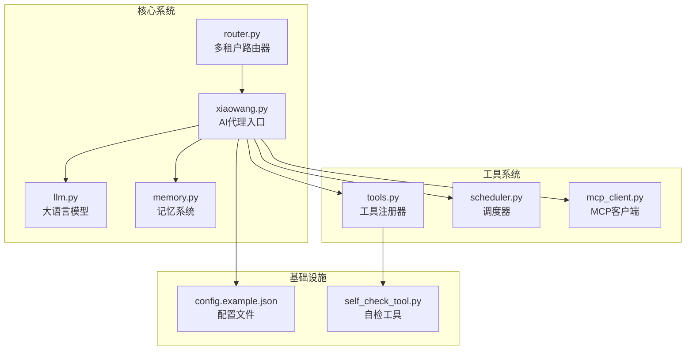

**图表来源**
- [router.py:1-493](file://router.py#L1-L493)
- [xiaowang.py:1-626](file://xiaowang.py#L1-L626)
- [llm.py:1-401](file://llm.py#L1-L401)
- [tools.py:1-800](file://tools.py#L1-L800)

**章节来源**
- [README.md:1-162](file://README.md#L1-L162)
- [router.py:1-493](file://router.py#L1-L493)

## 核心组件

### 路由器核心功能

路由器系统包含以下关键组件：

#### 1. 用户路由表管理
- **路由表持久化**：使用JSON文件存储用户ID到容器URL的映射
- **线程安全**：使用锁机制确保并发访问的安全性
- **动态更新**：支持运行时加载和保存路由表

#### 2. Docker容器自动编排
- **容器创建**：根据用户ID自动创建独立容器
- **网络配置**：加入专用Docker网络
- **资源限制**：内存使用限制和重启策略
- **健康检查**：内置健康检查机制

#### 3. 消息处理和转发
- **回调处理**：接收消息平台回调
- **异步处理**：后台线程处理路由和转发
- **错误处理**：完善的异常捕获和错误响应

**章节来源**
- [router.py:45-63](file://router.py#L45-L63)
- [router.py:141-250](file://router.py#L141-L250)
- [router.py:291-306](file://router.py#L291-L306)

## 架构概览

多租户路由器采用分层架构设计，实现了清晰的职责分离：

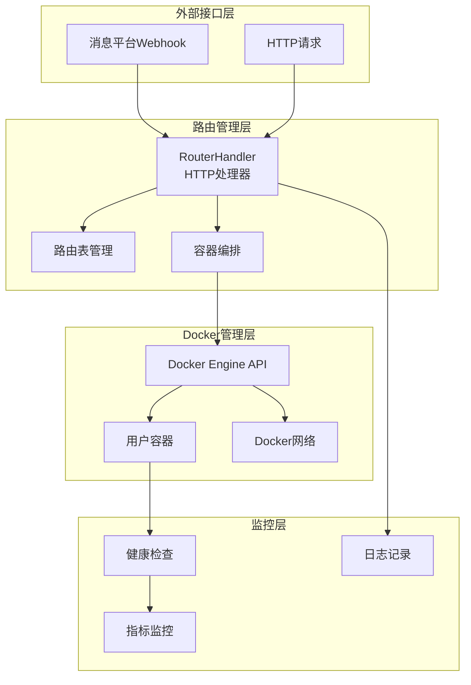

**图表来源**
- [router.py:310-425](file://router.py#L310-L425)
- [router.py:87-116](file://router.py#L87-L116)
- [router.py:433-465](file://router.py#L433-L465)

### 部署拓扑

系统支持多种部署模式：

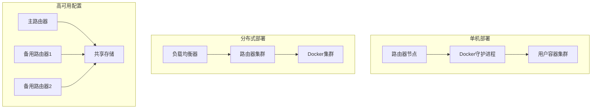

## 详细组件分析

### Docker连接管理

路由器通过自定义的Docker连接类实现与Docker Engine API的通信：

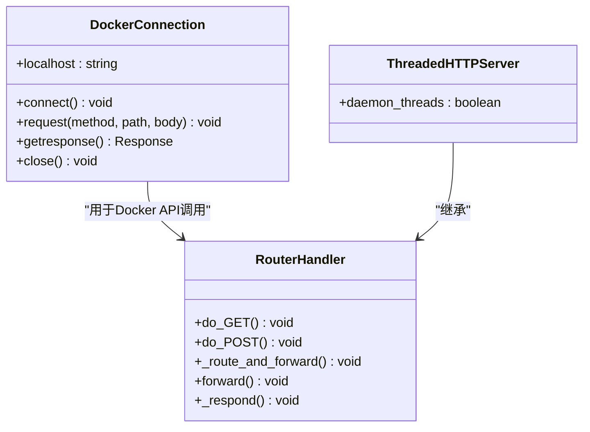

**图表来源**
- [router.py:87-116](file://router.py#L87-L116)
- [router.py:427-429](file://router.py#L427-L429)

#### Docker API调用流程

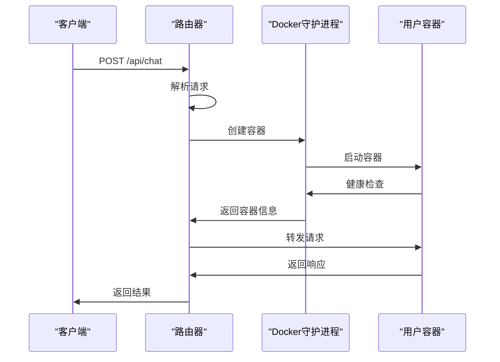

**图表来源**
- [router.py:198-218](file://router.py#L198-L218)
- [router.py:291-306](file://router.py#L291-L306)

**章节来源**
- [router.py:87-116](file://router.py#L87-L116)
- [router.py:198-249](file://router.py#L198-L249)

### 容器自动编排机制

#### 容器创建流程

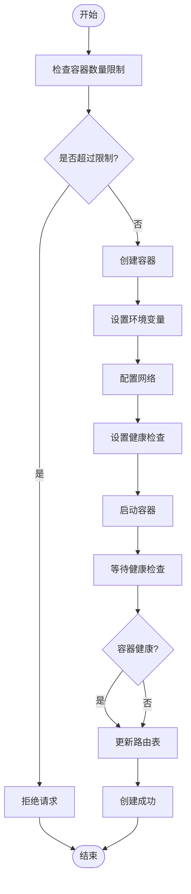

**图表来源**
- [router.py:141-250](file://router.py#L141-L250)

#### 资源限制配置

容器资源限制通过Docker API配置：

| 配置项 | 默认值 | 描述 |
|--------|--------|------|
| CONTAINER_MEMORY | 256m | 单容器内存限制 |
| MAX_CONTAINERS | 20 | 最大容器数量 |
| PROVISION_TIMEOUT | 45s | 容器创建超时时间 |

**章节来源**
- [router.py:131-139](file://router.py#L131-L139)
- [router.py:176-196](file://router.py#L176-L196)

### 用户路由表管理

#### 路由表数据结构

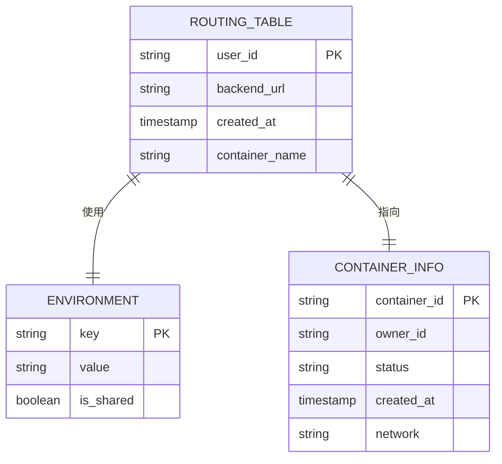

**图表来源**
- [router.py:34-36](file://router.py#L34-L36)
- [router.py:45-62](file://router.py#L45-L62)

#### 路由表操作流程

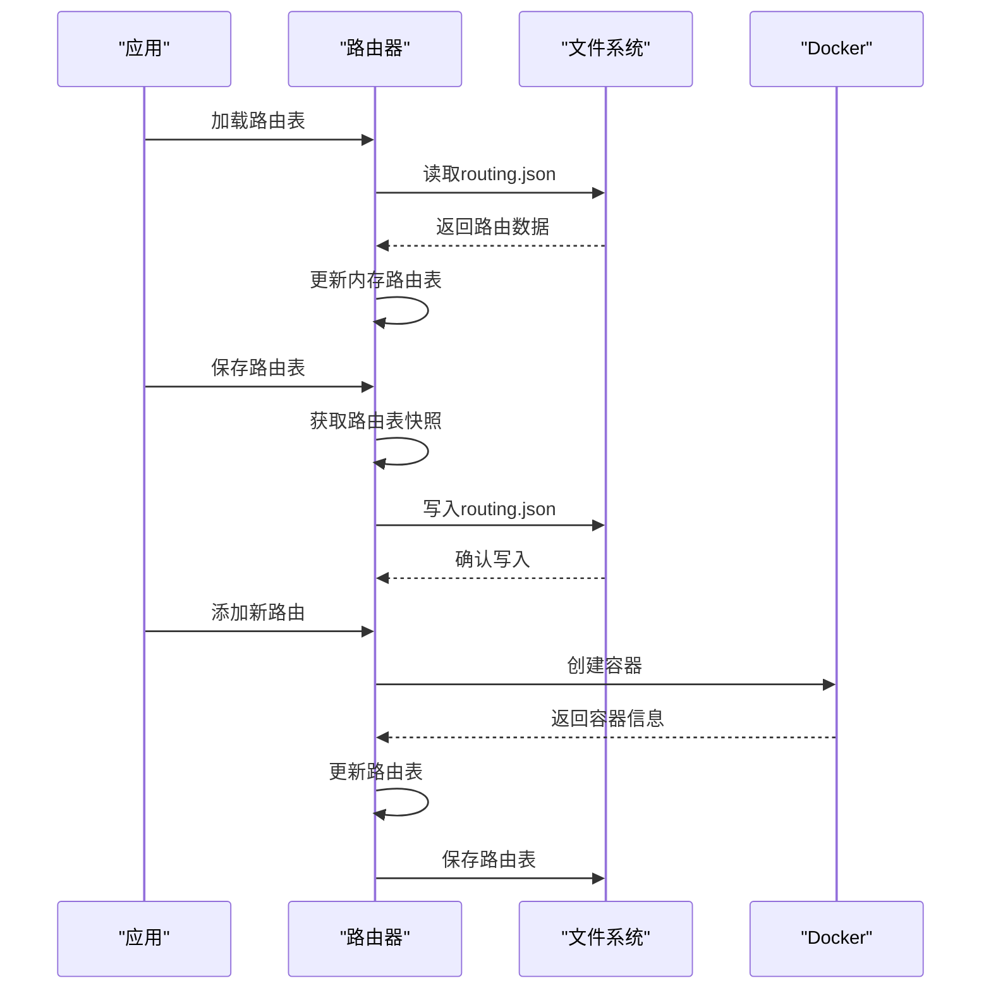

**图表来源**
- [router.py:45-62](file://router.py#L45-L62)
- [router.py:433-465](file://router.py#L433-L465)

**章节来源**
- [router.py:45-62](file://router.py#L45-L62)
- [router.py:433-465](file://router.py#L433-L465)

### 健康检查和故障转移

#### 健康检查机制

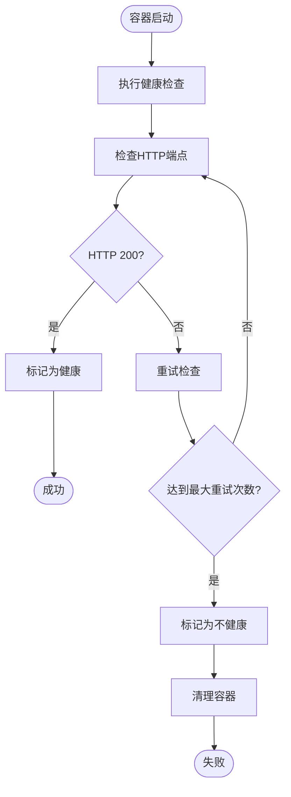

**图表来源**
- [router.py:221-238](file://router.py#L221-L238)

#### 故障转移策略

系统实现了多层次的故障转移机制：

1. **容器级别故障转移**：容器崩溃时自动清理并重新创建
2. **网络级别故障转移**：Docker守护进程异常时的降级处理
3. **路由级别故障转移**：路由表损坏时的自动修复

**章节来源**
- [router.py:215-217](file://router.py#L215-L217)
- [router.py:433-465](file://router.py#L433-L465)

## 依赖关系分析

### 组件间依赖关系

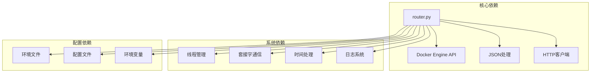

**图表来源**
- [router.py:9-21](file://router.py#L9-L21)

### 外部依赖分析

系统对外部依赖的使用情况：

| 依赖库 | 版本要求 | 使用场景 | 作用描述 |
|--------|----------|----------|----------|
| Docker Engine API | 任意版本 | 容器管理 | 创建、启动、停止容器 |
| Python标准库 | 3.x | 核心功能 | HTTP服务器、JSON处理等 |
| croniter | 任意版本 | 调度器 | Cron表达式解析 |
| lancedb | 任意版本 | 记忆系统 | 向量数据库存储 |
| websocket-client | 任意版本 | ASR功能 | WebSocket通信 |

**章节来源**
- [router.py:9-21](file://router.py#L9-L21)
- [scheduler.py:142-158](file://scheduler.py#L142-L158)

## 性能考虑

### 并发处理优化

路由器采用了多线程架构来处理高并发请求：

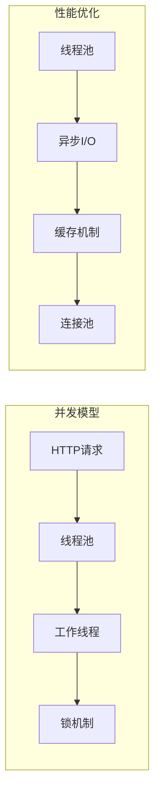

### 资源使用优化

1. **内存优化**：使用线程锁避免竞态条件
2. **CPU优化**：异步处理减少阻塞
3. **网络优化**：连接复用和超时控制
4. **磁盘优化**：最小化文件I/O操作

### 扩展性考虑

系统支持水平扩展和垂直扩展：

- **水平扩展**：通过增加路由器实例实现负载分担
- **垂直扩展**：增加单实例的容器数量限制
- **弹性伸缩**：根据流量自动调整容器数量

## 故障排除指南

### 常见问题诊断

#### Docker相关问题

| 问题类型 | 症状 | 可能原因 | 解决方案 |
|----------|------|----------|----------|
| 容器创建失败 | 返回500错误 | Docker守护进程异常 | 检查Docker服务状态 |
| 容器启动超时 | PROVISION_TIMEOUT错误 | 资源不足或镜像拉取慢 | 增加超时时间或优化资源 |
| 健康检查失败 | 容器被标记为不健康 | 应用未正确监听端口 | 检查容器内应用配置 |
| 网络连接失败 | 无法访问容器 | Docker网络配置错误 | 检查网络设置和防火墙 |

#### 路由表问题

| 问题类型 | 症状 | 可能原因 | 解决方案 |
|----------|------|----------|----------|
| 路由表损坏 | 无法找到用户路由 | 文件损坏或权限问题 | 重启服务自动重建 |
| 内存路由不同步 | 运行时路由与文件不一致 | 锁机制问题 | 检查线程同步 |
| 路由表过大 | 加载缓慢 | 路由数量过多 | 清理不需要的路由 |

### 监控和调试

#### 健康检查端点

路由器提供了完整的健康检查接口：

```bash
# 健康状态检查
curl http://localhost:8080/health

# 路由表查看
curl http://localhost:8080/routes

# 配置重载
curl http://localhost:8080/reload
```

#### 日志分析

系统使用结构化日志记录关键事件：

- **INFO级别**：正常操作和状态信息
- **WARNING级别**：潜在问题但不影响功能
- **ERROR级别**：严重错误需要人工干预

**章节来源**
- [router.py:314-336](file://router.py#L314-L336)

## 结论

多租户路由器系统展现了优秀的工程实践，通过以下关键设计实现了高可用性和可扩展性：

### 设计优势

1. **模块化架构**：清晰的职责分离和接口定义
2. **线程安全**：完善的并发控制机制
3. **容错设计**：多层次的故障检测和恢复
4. **资源隔离**：Docker容器实现真正的多租户隔离
5. **可观测性**：完整的日志和监控机制

### 技术创新

- **自动编排**：按需创建容器，实现资源的弹性分配
- **健康检查**：内置的容器健康监控机制
- **故障转移**：自动化的故障检测和恢复
- **配置管理**：灵活的环境变量和配置文件支持

### 应用价值

该系统为AI代理平台提供了可靠的基础设施，支持：
- **多用户并发**：支持大量用户的并发访问
- **资源隔离**：确保用户间的资源安全
- **快速扩展**：根据需求动态调整资源
- **成本优化**：按需使用的资源管理模式

通过持续的监控和优化，该系统能够稳定支持生产环境的长期运行，为用户提供高质量的服务体验。