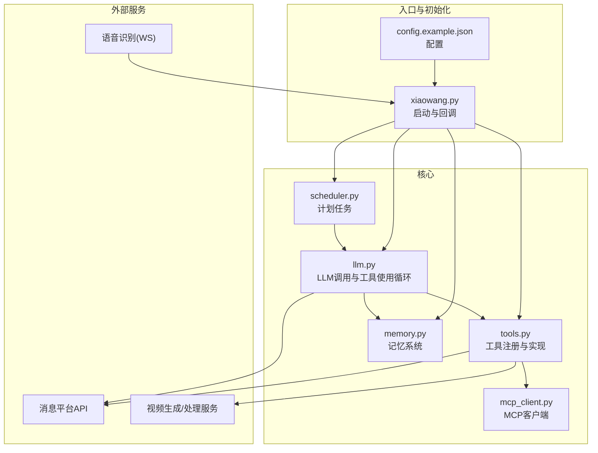
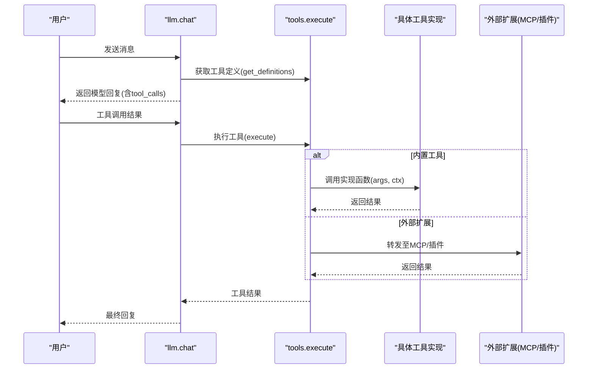
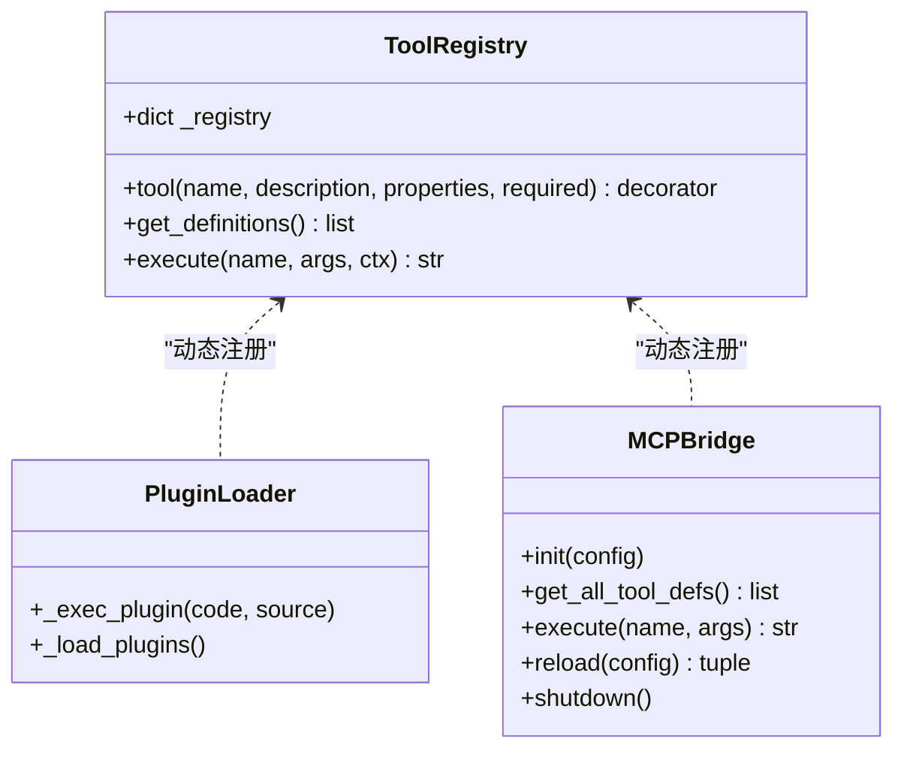
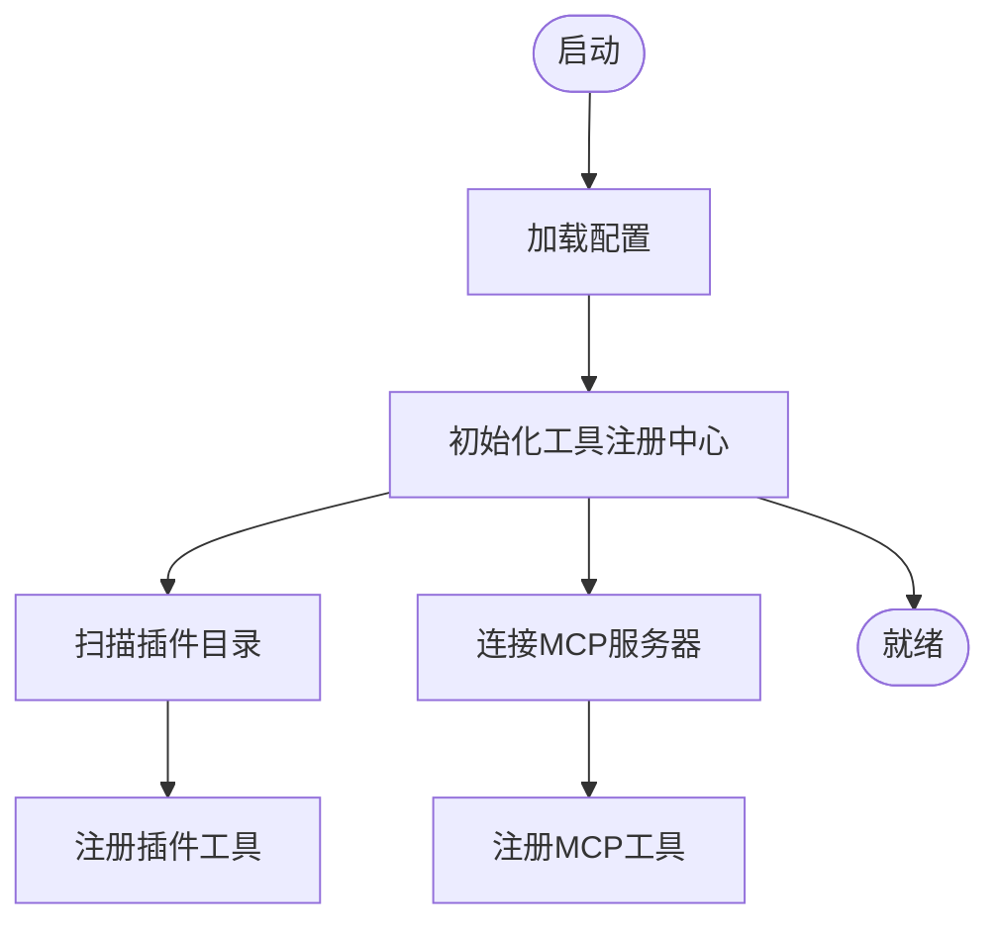
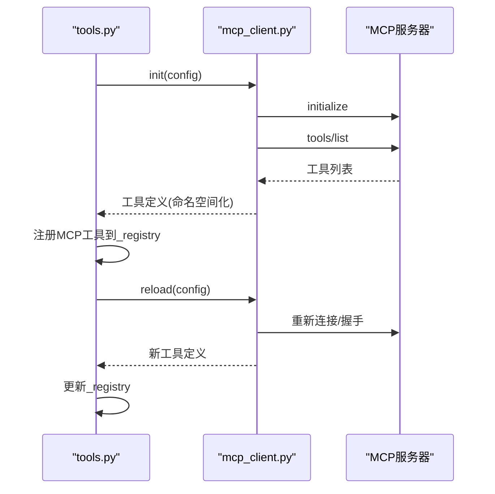
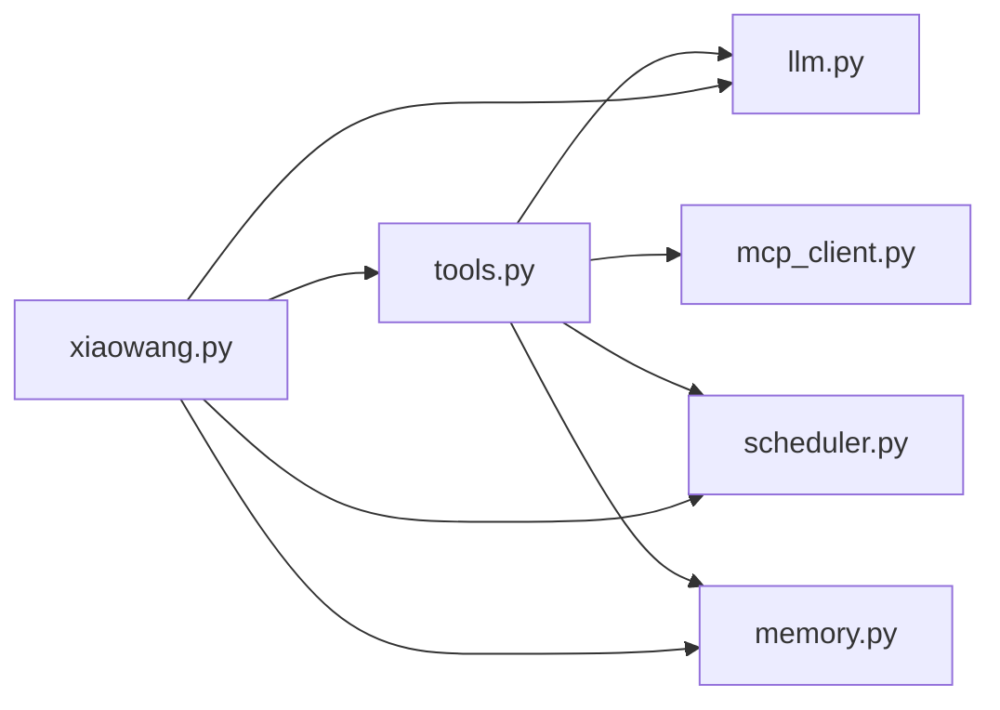

# 工具注册系统 (tools.py)

<cite>
**本文引用的文件**
- [tools.py](file://tools.py)
- [llm.py](file://llm.py)
- [mcp_client.py](file://mcp_client.py)
- [router.py](file://router.py)
- [scheduler.py](file://scheduler.py)
- [memory.py](file://memory.py)
- [xiaowang.py](file://xiaowang.py)
- [config.example.json](file://config.example.json)
- [self_check_tool.py](file://self_check_tool.py)
</cite>

## 目录
1. [简介](#简介)
2. [项目结构](#项目结构)
3. [核心组件](#核心组件)
4. [架构总览](#架构总览)
5. [详细组件分析](#详细组件分析)
6. [依赖分析](#依赖分析)
7. [性能考量](#性能考量)
8. [故障排查指南](#故障排查指南)
9. [结论](#结论)
10. [附录](#附录)

## 简介
本文件面向“工具注册系统”的技术文档，围绕 tools.py 的装饰器模式与工具注册机制展开，覆盖：
- 装饰器模式在工具注册中的应用与实现原理
- 工具元数据管理与动态注册机制
- 内置工具的功能分类与实现细节（文件管理、系统命令执行、消息发送、视频处理、网络搜索、语音识别等）
- 运行时工具创建与加载机制（工具工厂模式、依赖注入、生命周期管理）
- 插件系统架构与 MCP 协议集成
- 开发自定义工具的最佳实践与示例路径

## 项目结构
该系统以“工具注册中心”为核心，配合 LLM 调用循环、消息平台适配、计划任务调度、内存检索、MCP 客户端与多租户路由等模块协同工作。

图表来源
- [xiaowang.py:59-76](file://xiaowang.py#L59-L76)
- [tools.py:506-512](file://tools.py#L506-L512)
- [llm.py:317-401](file://llm.py#L317-L401)
- [mcp_client.py:272-334](file://mcp_client.py#L272-L334)
- [scheduler.py:30-43](file://scheduler.py#L30-L43)
- [memory.py:40-86](file://memory.py#L40-L86)

章节来源
- [xiaowang.py:59-76](file://xiaowang.py#L59-L76)
- [tools.py:506-512](file://tools.py#L506-L512)
- [llm.py:317-401](file://llm.py#L317-L401)
- [mcp_client.py:272-334](file://mcp_client.py#L272-L334)
- [scheduler.py:30-43](file://scheduler.py#L30-L43)
- [memory.py:40-86](file://memory.py#L40-L86)

## 核心组件
- 工具注册中心：维护工具名到实现函数与定义的映射，提供工具定义导出与执行入口
- 装饰器工具：通过 @tool 注册工具，自动构建 OpenAI 函数调用格式的工具定义
- 工具实现：包含文件操作、系统命令、消息发送、视频处理、网络搜索、记忆检索、诊断与自检、插件管理、MCP 工具桥接等
- 运行时加载：支持插件目录扫描与热加载、MCP 服务器连接与工具注册
- 生命周期管理：工具注册、热重载、MCP 断线重连、会话持久化与压缩

章节来源
- [tools.py:36-74](file://tools.py#L36-L74)
- [tools.py:506-512](file://tools.py#L506-L512)
- [tools.py:518-545](file://tools.py#L518-L545)
- [tools.py:1138-1153](file://tools.py#L1138-L1153)

## 架构总览
工具注册系统采用“装饰器 + 工厂 + 动态加载”的组合模式：
- 装饰器负责收集工具元数据并注册到全局注册表
- 工具工厂（get_definitions、execute）统一暴露工具定义与执行接口
- 插件系统与 MCP 客户端作为扩展点，动态注入新工具
- LLM 循环通过工具定义驱动工具调用，形成“对话—工具—结果”的闭环

图表来源
- [llm.py:356-396](file://llm.py#L356-L396)
- [tools.py:58-74](file://tools.py#L58-L74)
- [mcp_client.py:296-310](file://mcp_client.py#L296-L310)

章节来源
- [llm.py:356-396](file://llm.py#L356-L396)
- [tools.py:58-74](file://tools.py#L58-L74)
- [mcp_client.py:296-310](file://mcp_client.py#L296-L310)

## 详细组件分析

### 装饰器模式与工具注册
- @tool 装饰器
  - 接收工具名、描述、参数模式与必填字段
  - 将实现函数与 OpenAI 函数调用定义写入全局注册表
  - 返回原函数，保持可直接调用性
- 全局注册表
  - 键为工具名，值包含实现函数与定义对象
  - 提供 get_definitions 导出工具定义，execute 统一执行入口
- 运行时扩展
  - 插件目录扫描与热加载：支持在运行时新增自定义工具
  - MCP 服务器连接：将远端工具转换为命名空间化的本地工具

图表来源
- [tools.py:36-74](file://tools.py#L36-L74)
- [tools.py:518-545](file://tools.py#L518-L545)
- [tools.py:1138-1153](file://tools.py#L1138-L1153)
- [mcp_client.py:272-334](file://mcp_client.py#L272-L334)

章节来源
- [tools.py:36-74](file://tools.py#L36-L74)
- [tools.py:518-545](file://tools.py#L518-L545)
- [tools.py:1138-1153](file://tools.py#L1138-L1153)
- [mcp_client.py:272-334](file://mcp_client.py#L272-L334)

### 工具实现与功能分类
以下为内置工具的分类与职责概览（具体实现位于 tools.py 中对应函数）：
- 文件管理类
  - 读取/写入/编辑文件；列出接收的文件索引
- 系统命令执行类
  - 在受限工作目录下执行 shell 命令，带超时控制
- 消息发送类
  - 文本消息、图片/文件/视频/链接卡片发送
- 视频处理类
  - 视频裁剪、添加背景音乐、AI 视频生成（异步轮询）、输出归档
- 网络搜索类
  - 多源搜索（Tavily、通用 Web、GitHub、HuggingFace），自动路由与聚合
- 记忆检索类
  - 关键词检索与语义检索（recall）
- 计划任务类
  - 一次性延迟任务与周期性 Cron 任务
- 自检与诊断类
  - 系统健康检查、会话文件健康检查、MCP 连接状态检查
- 插件管理类
  - 创建/列出/删除自定义工具插件，支持热加载与覆盖保护

章节来源
- [tools.py:110-132](file://tools.py#L110-L132)
- [tools.py:134-146](file://tools.py#L134-L146)
- [tools.py:150-203](file://tools.py#L150-L203)
- [tools.py:205-236](file://tools.py#L205-L236)
- [tools.py:240-262](file://tools.py#L240-L262)
- [tools.py:266-302](file://tools.py#L266-L302)
- [tools.py:306-496](file://tools.py#L306-L496)
- [tools.py:498-761](file://tools.py#L498-L761)
- [tools.py:766-800](file://tools.py#L766-L800)
- [tools.py:806-814](file://tools.py#L806-L814)
- [tools.py:818-921](file://tools.py#L818-L921)
- [tools.py:925-1020](file://tools.py#L925-L1020)
- [tools.py:1024-1091](file://tools.py#L1024-L1091)
- [tools.py:1097-1132](file://tools.py#L1097-L1132)

### 运行时工具创建与加载机制
- 工具工厂模式
  - get_definitions：统一导出所有工具定义（OpenAI 函数调用格式）
  - execute：按名称分派到具体实现，捕获异常并记录日志
- 依赖注入
  - 执行上下文 ctx 包含 owner_id、workspace、session_key 等
  - 工具实现通过 ctx 获取运行时环境信息
- 生命周期管理
  - 插件：扫描 plugins/ 目录，逐个加载；支持热创建/删除
  - MCP：启动/断线重连、工具列表发现、命名空间化注册、热重载
  - 计划任务：持久化 jobs.json，后台线程定时检查触发
  - 记忆系统：压缩旧会话为向量记忆，检索增强对话

图表来源
- [tools.py:506-512](file://tools.py#L506-L512)
- [tools.py:518-545](file://tools.py#L518-L545)
- [tools.py:1138-1153](file://tools.py#L1138-L1153)

章节来源
- [tools.py:506-512](file://tools.py#L506-L512)
- [tools.py:518-545](file://tools.py#L518-L545)
- [tools.py:1138-1153](file://tools.py#L1138-L1153)

### 插件系统架构
- 插件目录：plugins/
- 加载流程：遍历 .py 文件，读取源码，使用受控 exec 环境执行，允许插件内使用 @tool 注册工具
- 热管理：支持创建、列出、删除插件；删除后从注册表移除；创建前先在受控环境中校验代码

章节来源
- [tools.py:518-545](file://tools.py#L518-L545)
- [tools.py:1024-1091](file://tools.py#L1024-L1091)

### MCP 协议集成
- 协议：自实现 JSON-RPC，仅需 initialize、tools/list、tools/call 三方法
- 命名空间：工具名格式为 servername__toolname，避免冲突
- 生命周期：启动/重连、工具发现、调用转发、热重载、关闭
- 集成点：tools.py 中的 _load_mcp_servers 与 reload_mcp 工具

图表来源
- [tools.py:1138-1153](file://tools.py#L1138-L1153)
- [mcp_client.py:272-334](file://mcp_client.py#L272-L334)

章节来源
- [tools.py:1138-1153](file://tools.py#L1138-L1153)
- [mcp_client.py:272-334](file://mcp_client.py#L272-L334)

### 开发自定义工具最佳实践
- 工具接口规范
  - 使用 @tool 装饰器注册，提供 name、description、parameters（properties/required）
  - 实现函数签名：fn(args, ctx)，返回字符串结果
- 参数验证
  - 在工具内部对必填参数进行显式检查与错误提示
  - 对外部输入（如文件路径、URL）进行安全校验与边界控制
- 错误处理
  - 捕获异常并返回统一格式的错误信息
  - 记录日志以便诊断
- 示例路径
  - 参考现有工具的参数模式与实现风格，例如文件读写、消息发送、视频处理等

章节来源
- [tools.py:36-74](file://tools.py#L36-L74)
- [tools.py:150-203](file://tools.py#L150-L203)
- [tools.py:266-302](file://tools.py#L266-L302)
- [tools.py:306-496](file://tools.py#L306-L496)

## 依赖分析
- 模块耦合
  - tools.py 与 llm.py：通过工具定义与执行接口耦合
  - tools.py 与 mcp_client.py：通过工具注册与执行桥接
  - tools.py 与 scheduler.py/memory.py：通过上下文注入与工具调用
  - xiaowang.py：初始化各模块并注入配置
- 外部依赖
  - 多源搜索 API、视频生成 API、消息平台 API、MCP 服务器进程
  - 本地文件系统、子进程、网络请求、WebSocket

图表来源
- [llm.py:356-396](file://llm.py#L356-L396)
- [tools.py:506-512](file://tools.py#L506-L512)
- [mcp_client.py:272-334](file://mcp_client.py#L272-L334)
- [scheduler.py:30-43](file://scheduler.py#L30-L43)
- [memory.py:40-86](file://memory.py#L40-L86)
- [xiaowang.py:59-76](file://xiaowang.py#L59-L76)

章节来源
- [llm.py:356-396](file://llm.py#L356-L396)
- [tools.py:506-512](file://tools.py#L506-L512)
- [mcp_client.py:272-334](file://mcp_client.py#L272-L334)
- [scheduler.py:30-43](file://scheduler.py#L30-L43)
- [memory.py:40-86](file://memory.py#L40-L86)
- [xiaowang.py:59-76](file://xiaowang.py#L59-L76)

## 性能考量
- 工具执行并发
  - LLM 循环对同一会话加锁，避免并发冲突
  - 工具内部尽量避免阻塞操作，必要时使用子进程或异步
- I/O 优化
  - 文件读写与视频处理使用流式与分块策略
  - 搜索与网络请求设置合理超时
- 缓存与压缩
  - 记忆系统对长对话进行压缩，减少历史消息长度
  - 会话保存前清理图像 URL，降低后续请求体积

[本节为通用指导，不直接分析特定文件]

## 故障排查指南
- 常见问题定位
  - 工具未注册：确认 @tool 装饰器是否正确使用，插件目录是否存在
  - MCP 工具不可用：检查服务器连接、命令可用性、命名空间格式
  - 会话文件异常：使用 diagnose 工具检查会话文件健康度
  - 系统资源不足：查看 self_check 报告中的内存/磁盘使用情况
- 日志与诊断
  - 工具执行异常会记录错误日志
  - diagnose 工具提供会话、MCP、错误详情的综合诊断
  - reload_mcp 工具支持热重载 MCP 服务器

章节来源
- [tools.py:925-1020](file://tools.py#L925-L1020)
- [tools.py:1097-1132](file://tools.py#L1097-L1132)
- [tools.py:818-921](file://tools.py#L818-L921)

## 结论
工具注册系统通过装饰器模式与动态注册机制，实现了高度可扩展的工具生态。结合插件系统与 MCP 协议，系统能够无缝集成外部能力，并通过 LLM 循环实现“对话—工具—结果”的自动化闭环。内置工具覆盖文件、命令、消息、视频、搜索、记忆、诊断等多个领域，满足日常办公场景需求。建议在扩展新工具时遵循参数校验、错误处理与日志记录的最佳实践，确保系统的稳定性与可观测性。

[本节为总结性内容，不直接分析特定文件]

## 附录
- 配置参考
  - 模型提供商、消息平台、工作空间、端口、去抖间隔、内存嵌入、ASR、视频生成、搜索密钥、MCP 服务器等
- 自检与自修复
  - 自检工具与诊断工具配合计划任务，形成零干预的自监控与自修复闭环

章节来源
- [config.example.json:1-61](file://config.example.json#L1-L61)
- [self_check_tool.py:18-57](file://self_check_tool.py#L18-L57)