# 智能记忆系统 (memory.py)

<cite>
**本文档引用的文件**
- [memory.py](file://memory.py)
- [llm.py](file://llm.py)
- [README.md](file://README.md)
- [config.example.json](file://config.example.json)
- [tools.py](file://tools.py)
- [xiaowang.py](file://xiaowang.py)
- [memoryQueue.js](file://NL2SQL/backend/src/memory/memoryQueue.js)
- [summarizer.js](file://NL2SQL/backend/src/memory/summarizer.js)
- [memoryMaintenance.js](file://NL2SQL/backend/src/memory/memoryMaintenance.js)
- [longTermMemory.js](file://NL2SQL/backend/src/memory/longTermMemory.js)
- [database.js](file://NL2SQL/backend/src/core/database.js)
- [tokenBudget.js](file://NL2SQL/backend/src/utils/tokenBudget.js)
- [vectorStore.js](file://NL2SQL/backend/src/memory/vectorStore.js)
- [schemaLoader.js](file://NL2SQL/backend/src/core/schemaLoader.js)
- [config.js](file://NL2SQL/backend/src/core/config.js)
</cite>

## 更新摘要
**变更内容**
- 新增异步队列功能：memoryQueue.js 提供非阻塞的记忆存储队列
- 新增智能摘要触发：summarizer.js 基于Token感知的动态摘要触发机制
- 新增置顶保护功能：memoryMaintenance.js 支持记忆置顶和优先级管理
- 更新三层记忆管道架构：明确异步处理和智能触发机制
- 增强NL2SQL长期记忆系统的对比分析

## 目录
1. [简介](#简介)
2. [系统定位与区别](#系统定位与区别)
3. [项目结构](#项目结构)
4. [核心组件](#核心组件)
5. [架构概览](#架构概览)
6. [详细组件分析](#详细组件分析)
7. [异步队列系统](#异步队列系统)
8. [智能摘要触发](#智能摘要触发)
9. [置顶保护机制](#置顶保护机制)
10. [依赖关系分析](#依赖关系分析)
11. [性能考虑](#性能考虑)
12. [故障排除指南](#故障排除指南)
13. [结论](#结论)
14. [附录](#附录)

## 简介

智能记忆系统是7/24办公室AI代理系统的核心组成部分，采用三层记忆管道设计，实现了从短期记忆到长期记忆再到检索记忆的完整记忆管理流程。该系统集成了LanceDB向量数据库，支持语义相似度计算和查询优化，提供了高效的记忆压缩、去重和检索功能。

**重要区别**：本系统与NL2SQL长期记忆系统不同，后者专注于数据查询场景的用户偏好记忆管理，而本系统服务于通用AI代理的多模态记忆需求。

系统的主要特点包括：
- **三层记忆管道**：短期记忆（会话历史）、长期记忆（压缩事实）和检索记忆（向量搜索）
- **LanceDB集成**：嵌入式向量数据库，无需独立服务
- **语义相似度计算**：基于余弦相似度的智能去重
- **异步压缩处理**：后台线程处理记忆压缩，不影响主流程
- **零延迟缓存**：为硬件/语音通道提供预计算的记忆摘要
- **异步队列系统**：支持非阻塞的记忆存储操作
- **智能摘要触发**：基于Token感知的动态摘要生成
- **置顶保护机制**：支持关键记忆的置顶保护和优先级管理

## 系统定位与区别

### 7/24办公室AI代理智能记忆系统

本系统专为通用AI代理设计，提供跨领域的记忆管理能力：

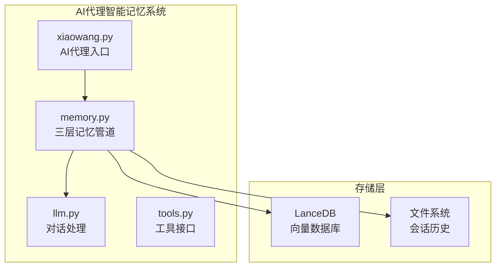

**图表来源**
- [xiaowang.py:71-76](file://xiaowang.py#L71-L76)
- [llm.py:328-346](file://llm.py#L328-L346)
- [memory.py:40-86](file://memory.py#L40-L86)

### NL2SQL长期记忆系统对比

NL2SQL系统专注于数据查询场景的记忆管理，包含以下增强功能：

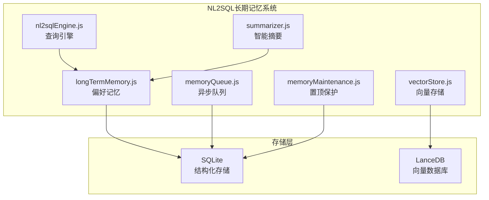

**关键差异**：
- **应用场景**：AI代理 vs 数据查询
- **存储方式**：向量数据库 vs 结构化数据库
- **记忆类型**：通用事实 vs 查询偏好
- **管理策略**：语义去重 vs 使用频率分级
- **异步处理**：后台线程 vs 异步队列
- **智能触发**：固定轮数 vs Token感知
- **保护机制**：无置顶 vs 置顶保护

## 项目结构

智能记忆系统在整体项目中的位置和作用如下：

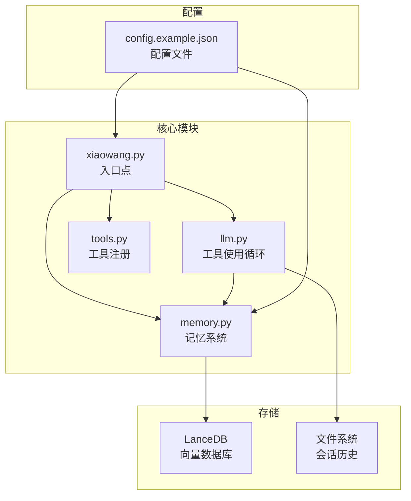

**图表来源**
- [xiaowang.py:71-76](file://xiaowang.py#L71-L76)
- [llm.py:328-346](file://llm.py#L328-L346)
- [memory.py:40-86](file://memory.py#L40-L86)

**章节来源**
- [README.md:23-66](file://README.md#L23-L66)
- [xiaowang.py:55-76](file://xiaowang.py#L55-L76)

## 核心组件

智能记忆系统包含以下核心组件：

### 1. 初始化组件
- **配置加载**：从config.json中读取记忆系统配置
- **LanceDB连接**：建立向量数据库连接
- **表结构初始化**：创建或打开memories表

### 2. 记忆压缩组件
- **对话格式化**：将消息列表转换为对话文本
- **LLM结构化提取**：使用提示词模板提取关键事实
- **向量化处理**：调用嵌入API生成向量表示

### 3. 去重组件
- **余弦相似度计算**：比较新记忆与现有记忆的相似度
- **阈值过滤**：根据相似度阈值跳过重复记忆

### 4. 检索组件
- **向量搜索**：用户消息嵌入到向量空间进行搜索
- **结果格式化**：将检索到的记忆格式化为可读文本
- **零延迟缓存**：硬件/语音通道的快速响应

### 5. 异步处理组件
- **后台线程**：处理记忆压缩的异步执行
- **队列管理**：支持非阻塞的记忆存储操作
- **批量处理**：提高存储操作的效率

**章节来源**
- [memory.py:28-34](file://memory.py#L28-L34)
- [memory.py:40-86](file://memory.py#L40-L86)
- [memory.py:121-146](file://memory.py#L121-L146)
- [memory.py:294-360](file://memory.py#L294-L360)

## 架构概览

智能记忆系统采用三层记忆管道架构，每层都有明确的功能分工：

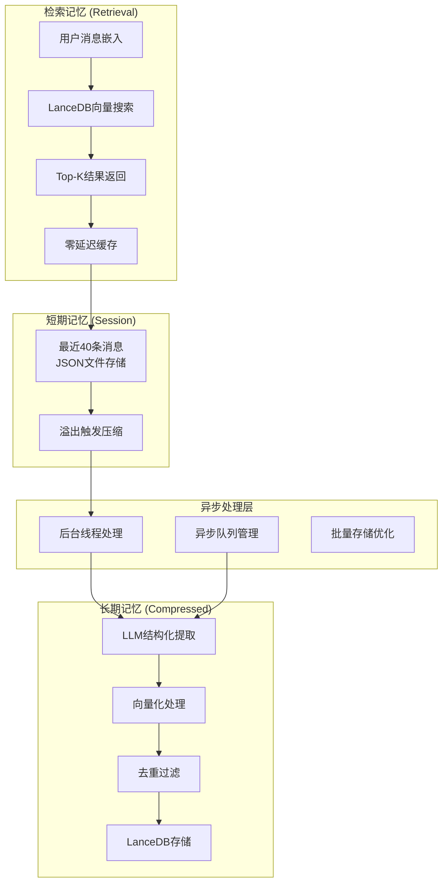

**图表来源**
- [README.md:71-84](file://README.md#L71-L84)
- [llm.py:103-106](file://llm.py#L103-L106)
- [memory.py:294-360](file://memory.py#L294-L360)

### 数据流分析

记忆系统的数据流遵循以下模式：

1. **短期记忆阶段**：用户消息保存在会话文件中，达到阈值后触发压缩
2. **异步处理阶段**：后台线程异步处理记忆压缩，支持队列管理
3. **长期记忆阶段**：LLM提取结构化事实并存储到LanceDB
4. **检索记忆阶段**：用户查询时进行向量搜索，返回最相关的记忆

**章节来源**
- [llm.py:103-106](file://llm.py#L103-L106)
- [memory.py:121-146](file://memory.py#L121-L146)
- [memory.py:88-118](file://memory.py#L88-L118)

## 详细组件分析

### 初始化组件

初始化过程负责建立记忆系统的基础设施：

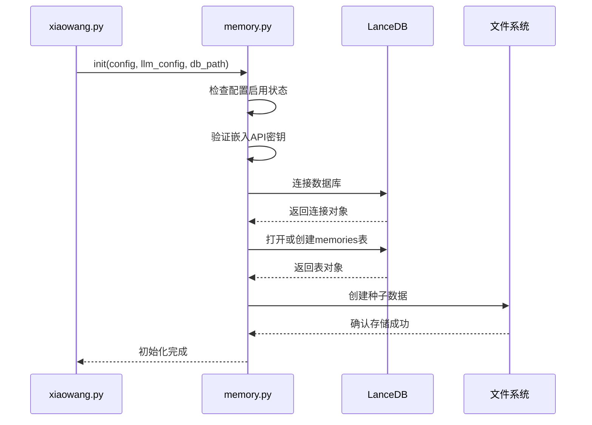

**图表来源**
- [memory.py:40-86](file://memory.py#L40-L86)
- [xiaowang.py:71-76](file://xiaowang.py#L71-L76)

初始化的关键步骤包括：
- 配置验证和启用检查
- LanceDB连接建立
- 表结构初始化和种子数据创建
- 全局状态变量设置

**章节来源**
- [memory.py:40-86](file://memory.py#L40-L86)
- [config.example.json:28-38](file://config.example.json#L28-L38)

### 记忆压缩组件

记忆压缩是三层管道的核心处理逻辑：

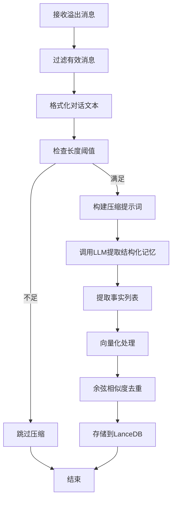

**图表来源**
- [memory.py:121-146](file://memory.py#L121-L146)
- [memory.py:294-360](file://memory.py#L294-L360)

压缩过程的具体实现：

1. **消息过滤**：只保留用户和助手的有效文本消息
2. **对话格式化**：将消息转换为结构化的对话文本
3. **LLM提取**：使用专门的提示词模板提取结构化记忆
4. **向量化**：调用嵌入API生成向量表示
5. **去重处理**：通过余弦相似度比较避免重复存储

**章节来源**
- [memory.py:121-146](file://memory.py#L121-L146)
- [memory.py:294-360](file://memory.py#L294-L360)

### 去重算法

去重算法基于余弦相似度计算，确保记忆库的质量和效率：

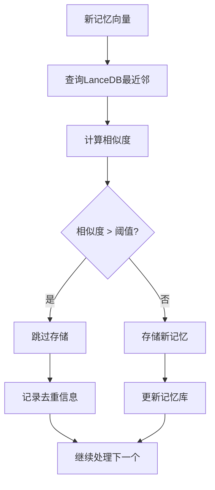

**图表来源**
- [memory.py:320-338](file://memory.py#L320-L338)
- [memory.py:284-292](file://memory.py#L284-L292)

去重算法的关键参数：
- **相似度阈值**：默认0.92，可根据需求调整
- **距离计算**：使用1 - _distance作为相似度
- **异常处理**：去重查询失败不应阻塞存储过程

**章节来源**
- [memory.py:320-338](file://memory.py#L320-L338)
- [config.example.json:37](file://config.example.json#L37)

### 检索组件

检索组件提供语义相似度搜索功能：

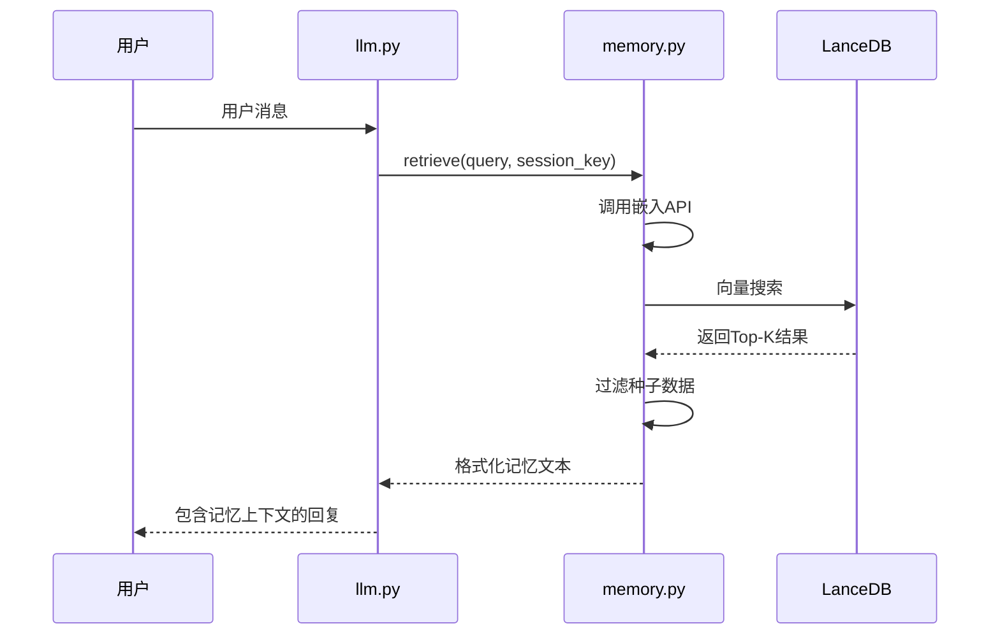

**图表来源**
- [llm.py:337-346](file://llm.py#L337-L346)
- [memory.py:88-118](file://memory.py#L88-L118)

检索过程的特点：
- **同步处理**：检索操作是同步的，确保上下文完整性
- **结果过滤**：自动过滤种子数据和低质量结果
- **格式化输出**：将检索到的记忆转换为易读的文本格式

**章节来源**
- [llm.py:337-346](file://llm.py#L337-L346)
- [memory.py:88-118](file://memory.py#L88-L118)

### 零延迟缓存

为硬件/语音通道提供快速响应的缓存机制：

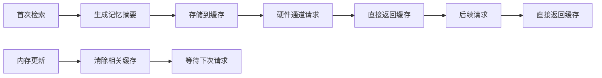

**图表来源**
- [memory.py:148-151](file://memory.py#L148-L151)

缓存机制的优势：
- **硬件优化**：为语音和硬件通道提供零延迟响应
- **状态管理**：维护session_key到记忆摘要的映射
- **更新策略**：内存更新时自动清理相关缓存

**章节来源**
- [memory.py:148-151](file://memory.py#L148-L151)

## 异步队列系统

NL2SQL项目中的异步队列系统提供了非阻塞的记忆存储能力：

### 队列管理架构

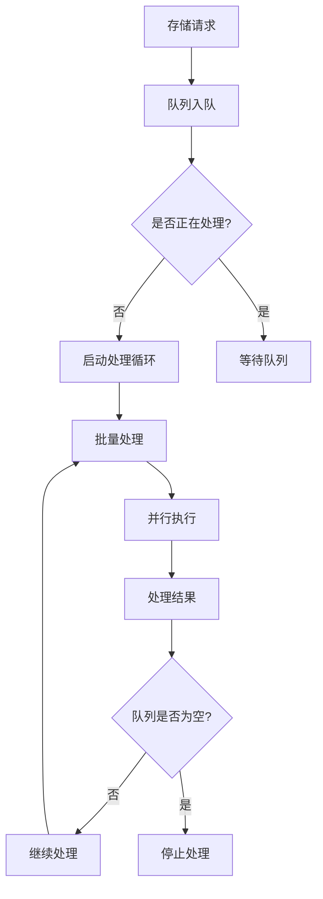

**图表来源**
- [memoryQueue.js:72-118](file://NL2SQL/backend/src/memory/memoryQueue.js#L72-L118)

### 核心功能特性

1. **非阻塞存储**：使用队列避免阻塞主流程
2. **批量处理**：支持批量大小为5的并行处理
3. **处理间隔**：100ms的处理间隔避免CPU占用过高
4. **错误处理**：单个操作失败不影响整体队列处理
5. **状态监控**：提供队列状态查询和等待完成功能

**章节来源**
- [memoryQueue.js:46-66](file://NL2SQL/backend/src/memory/memoryQueue.js#L46-L66)
- [memoryQueue.js:160-177](file://NL2SQL/backend/src/memory/memoryQueue.js#L160-L177)

## 智能摘要触发

NL2SQL项目中的智能摘要触发机制基于Token感知的动态触发：

### 触发条件分析

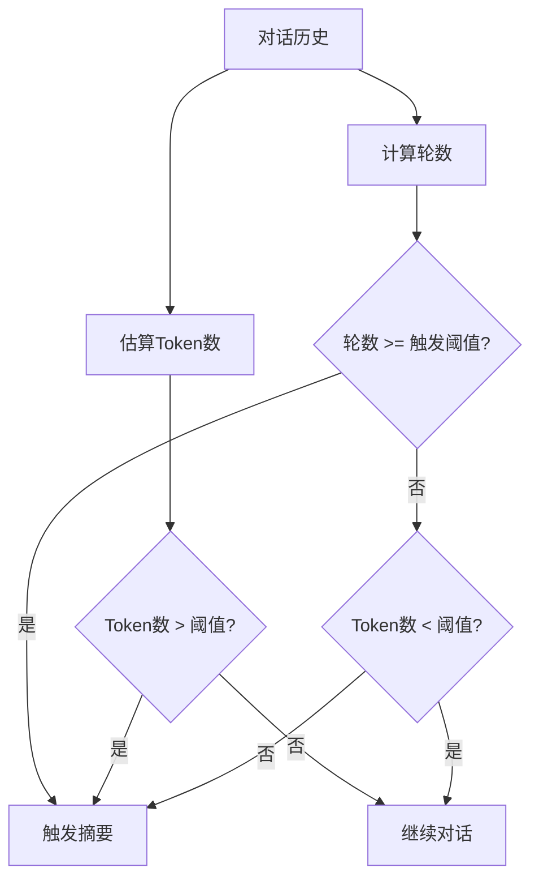

**图表来源**
- [summarizer.js:457-476](file://NL2SQL/backend/src/memory/summarizer.js#L457-L476)

### 触发阈值配置

智能摘要触发的关键参数：
- **触发轮数**：8轮（默认值）
- **Token阈值**：6000 tokens（约60%的10k预算）
- **缓存策略**：使用缓存避免重复生成
- **更新间隔**：4轮的更新间隔

**章节来源**
- [summarizer.js:23-34](file://NL2SQL/backend/src/memory/summarizer.js#L23-L34)
- [summarizer.js:457-476](file://NL2SQL/backend/src/memory/summarizer.js#L457-L476)

## 置顶保护机制

NL2SQL项目中的置顶保护机制支持关键记忆的保护和优先级管理：

### 数据库结构增强

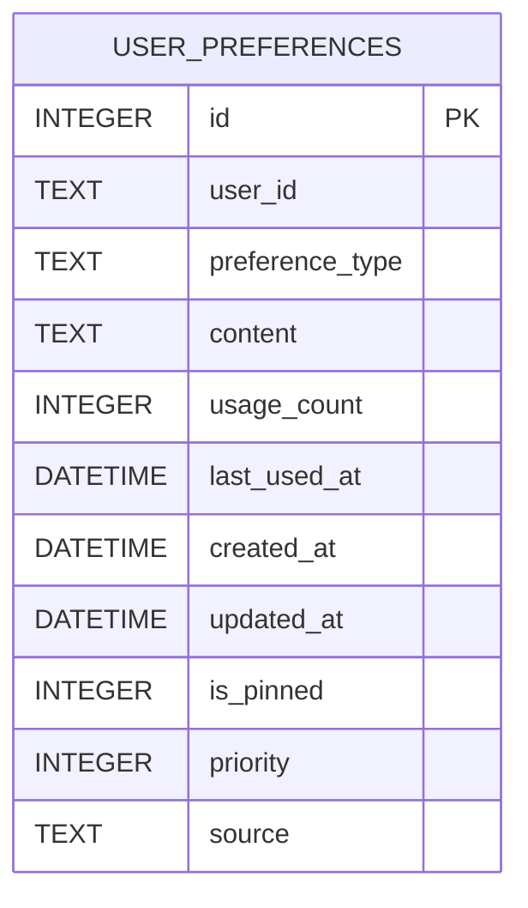

**图表来源**
- [database.js:140-163](file://NL2SQL/backend/src/core/database.js#L140-L163)

### 清理逻辑优化

置顶保护的清理逻辑：
- **跳过置顶记忆**：is_pinned = 0 条件确保置顶记忆不被清理
- **分级保留策略**：高频(≥10次)永久保留，中频(3-9次)90天未用清理
- **优先级管理**：priority字段支持自动、手动、置顶三种优先级

**章节来源**
- [memoryMaintenance.js:135-144](file://NL2SQL/backend/src/memory/memoryMaintenance.js#L135-L144)
- [database.js:157-162](file://NL2SQL/backend/src/core/database.js#L157-L162)

## 依赖关系分析

智能记忆系统与其他模块的依赖关系：

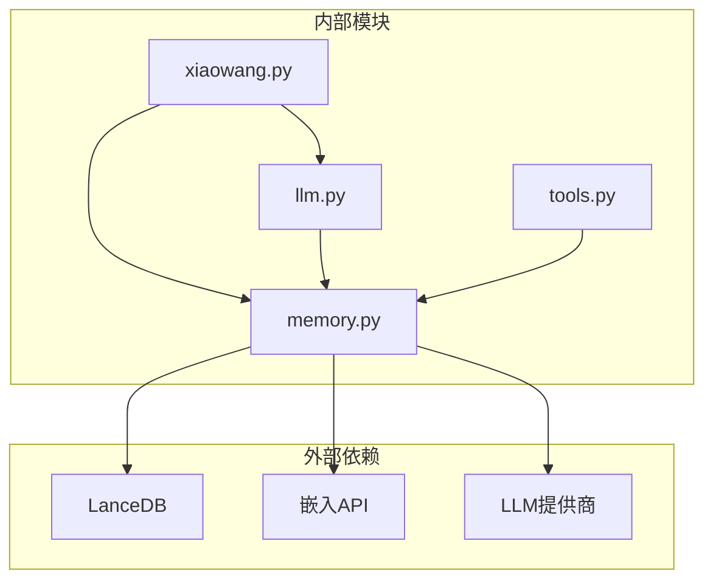

**图表来源**
- [memory.py:58](file://memory.py#L58)
- [memory.py:158-187](file://memory.py#L158-L187)
- [memory.py:228-281](file://memory.py#L228-L281)

### 外部依赖分析

1. **LanceDB**：嵌入式向量数据库，提供高效的向量搜索能力
2. **嵌入API**：支持任何OpenAI兼容的嵌入服务
3. **LLM提供商**：用于记忆压缩的结构化提取

### 内部依赖分析

1. **llm.py集成**：会话管理和记忆检索的紧密集成
2. **tools.py工具**：提供记忆检索的工具接口
3. **xiaowang.py初始化**：系统启动时的统一初始化

**章节来源**
- [memory.py:58](file://memory.py#L58)
- [memory.py:158-187](file://memory.py#L158-L187)
- [memory.py:228-281](file://memory.py#L228-L281)

## 性能考虑

智能记忆系统在设计时充分考虑了性能优化：

### 存储策略

1. **分层存储**：短期记忆使用轻量级文件存储，长期记忆使用高效的向量数据库
2. **异步处理**：压缩过程在后台线程执行，不影响主流程响应
3. **批量操作**：支持批量向量搜索和存储，提高I/O效率
4. **队列管理**：异步队列系统避免阻塞主流程

### 查询优化

1. **Top-K限制**：默认返回5个最相关的结果，平衡准确性和性能
2. **早期过滤**：在数据库层面过滤种子数据和无效结果
3. **缓存机制**：硬件通道的零延迟缓存减少重复计算
4. **Token预算**：智能摘要触发避免上下文爆炸

### 内存管理

1. **渐进式压缩**：只有溢出的消息才会被压缩，避免不必要的处理
2. **阈值控制**：相似度阈值防止重复存储，保持数据库大小可控
3. **异常容错**：去重查询失败不会影响存储过程
4. **置顶保护**：关键记忆的保护避免误删

**章节来源**
- [config.example.json:36-37](file://config.example.json#L36-L37)
- [memory.py:121-146](file://memory.py#L121-L146)
- [memory.py:320-338](file://memory.py#L320-L338)

## 故障排除指南

### 常见问题及解决方案

1. **初始化失败**
   - 检查嵌入API密钥是否正确配置
   - 确认LanceDB依赖已正确安装
   - 验证数据库路径权限

2. **检索无结果**
   - 检查嵌入API是否正常工作
   - 验证记忆库中是否有足够的数据
   - 调整相似度阈值参数

3. **压缩失败**
   - 检查LLM提供商配置
   - 验证消息格式是否符合要求
   - 查看日志获取详细错误信息

4. **异步队列问题**
   - 检查队列状态和处理间隔
   - 验证批量处理大小配置
   - 监控队列积压情况

5. **摘要触发异常**
   - 检查Token预算配置
   - 验证触发阈值设置
   - 监控摘要生成性能

### 日志分析

系统提供了详细的日志记录，包括：
- 初始化状态信息
- 压缩进度和结果
- 检索操作详情
- 错误和异常情况
- 队列处理状态
- 摘要生成统计

**章节来源**
- [memory.py:84](file://memory.py#L84)
- [memory.py:116](file://memory.py#L116)
- [memory.py:360](file://memory.py#L360)

## 结论

智能记忆系统通过三层记忆管道设计，实现了高效、智能的记忆管理。系统的核心优势包括：

1. **架构清晰**：三层管道各司其职，逻辑清晰
2. **性能优秀**：异步处理、缓存机制和查询优化
3. **易于扩展**：模块化设计，便于功能增强
4. **可靠性高**：完善的错误处理和异常容错

**重要提醒**：本系统与NL2SQL长期记忆系统在设计理念、存储方式和应用场景上存在根本差异，应根据具体需求选择合适的记忆管理方案。

该系统为AI代理提供了强大的记忆能力，支持长期学习和智能回忆，是构建真正智能代理的重要基础。

## 附录

### 配置参数说明

| 参数名 | 类型 | 默认值 | 描述 |
|--------|------|--------|------|
| enabled | boolean | true | 是否启用记忆系统 |
| embedding_api.api_base | string | https://api.openai.com/v1 | 嵌入API基础URL |
| embedding_api.api_key | string | 无 | 嵌入API密钥 |
| embedding_api.model | string | text-embedding-3-small | 嵌入模型名称 |
| embedding_api.dimension | integer | 1024 | 嵌入向量维度 |
| retrieve_top_k | integer | 5 | 检索返回的Top-K数量 |
| similarity_threshold | float | 0.92 | 去重相似度阈值 |

### NL2SQL增强功能配置

| 功能 | 参数名 | 默认值 | 描述 |
|------|--------|--------|------|
| 异步队列 | memoryQueue.batchSize | 5 | 批量处理大小 |
| 异步队列 | memoryQueue.processInterval | 100ms | 处理间隔 |
| 智能摘要 | summarizer.triggerRounds | 8 | 触发轮数阈值 |
| 智能摘要 | tokenBudget.tokenThreshold | 6000 | Token阈值 |
| 置顶保护 | retention.highUsage | null | 高频保留天数 |
| 置顶保护 | retention.mediumUsage | 90 | 中频保留天数 |

### 使用示例

虽然本节不包含具体代码内容，但可以提供使用路径参考：

- **初始化记忆系统**：[memory.py:40-86](file://memory.py#L40-L86)
- **添加记忆**：通过会话溢出触发压缩，参见[llm.py:103-106](file://llm.py#L103-L106)
- **查询记忆**：使用工具函数，参见[tools.py:809-813](file://tools.py#L809-L813)
- **清理操作**：系统自动管理，无需手动干预
- **异步队列使用**：参见[memoryQueue.js:46-66](file://NL2SQL/backend/src/memory/memoryQueue.js#L46-L66)
- **智能摘要触发**：参见[summarizer.js:457-476](file://NL2SQL/backend/src/memory/summarizer.js#L457-L476)
- **置顶保护**：参见[memoryMaintenance.js:135-144](file://NL2SQL/backend/src/memory/memoryMaintenance.js#L135-L144)

**章节来源**
- [config.example.json:28-38](file://config.example.json#L28-L38)
- [tools.py:809-813](file://tools.py#L809-L813)
- [memoryQueue.js:46-66](file://NL2SQL/backend/src/memory/memoryQueue.js#L46-L66)
- [summarizer.js:457-476](file://NL2SQL/backend/src/memory/summarizer.js#L457-L476)
- [memoryMaintenance.js:135-144](file://NL2SQL/backend/src/memory/memoryMaintenance.js#L135-L144)