# 核心模块详解

<cite>
**本文档引用的文件**
- [README.md](file://README.md)
- [config.example.json](file://config.example.json)
- [xiaowang.py](file://xiaowang.py)
- [llm.py](file://llm.py)
- [tools.py](file://tools.py)
- [memory.py](file://memory.py)
- [scheduler.py](file://scheduler.py)
- [router.py](file://router.py)
- [mcp_client.py](file://mcp_client.py)
- [self_check_tool.py](file://self_check_tool.py)
</cite>

## 目录
1. [简介](#简介)
2. [项目结构](#项目结构)
3. [核心组件](#核心组件)
4. [架构概览](#架构概览)
5. [详细组件分析](#详细组件分析)
6. [依赖关系分析](#依赖关系分析)
7. [性能考虑](#性能考虑)
8. [故障排除指南](#故障排除指南)
9. [结论](#结论)

## 简介

724 Office是一个生产级的AI代理系统，采用纯Python编写（约3500行代码），零框架依赖。该系统提供了完整的AI助手功能，包括工具使用循环、智能记忆系统、MCP插件架构、任务调度器和多租户路由器等核心模块。

系统特点：
- **零框架依赖**：仅使用标准库和3个小包（croniter、lancedb、websocket-client）
- **26个内置工具**：涵盖文件操作、媒体处理、搜索、内存管理等功能
- **三阶段记忆系统**：短期会话记忆 + 长期压缩记忆 + 向量检索记忆
- **MCP插件系统**：支持外部MCP服务器连接和热重载
- **自修复能力**：每日自检、会话健康诊断、错误日志分析
- **多租户容器编排**：基于Docker的自动用户容器分配

## 项目结构

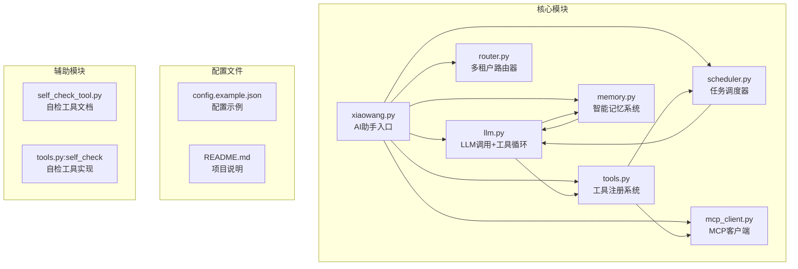

**图表来源**
- [xiaowang.py:1-626](file://xiaowang.py#L1-L626)
- [llm.py:1-401](file://llm.py#L1-L401)
- [tools.py:1-1153](file://tools.py#L1-L1153)
- [memory.py:1-361](file://memory.py#L1-L361)
- [scheduler.py:1-219](file://scheduler.py#L1-L219)
- [mcp_client.py:1-334](file://mcp_client.py#L1-L334)
- [router.py:1-493](file://router.py#L1-L493)

**章节来源**
- [README.md:1-162](file://README.md#L1-L162)
- [config.example.json:1-61](file://config.example.json#L1-L61)

## 核心组件

### AI助手主入口（xiaowang.py）

AI助手的主入口模块，负责HTTP服务器配置、消息回调处理和去抖动机制。

**主要功能**：
- HTTP服务器启动和请求处理
- 消息平台回调接收和解析
- 去抖动机制实现（合并连续消息）
- 文件持久化存储管理
- 语音转文字（ASR）集成
- 多媒体消息处理

**关键特性**：
- 支持多线程HTTP服务器
- 配置驱动的端口和工作空间设置
- 可选的单用户模式
- 媒体文件下载和保存
- 语音消息的ASR处理

**章节来源**
- [xiaowang.py:1-626](file://xiaowang.py#L1-L626)

### LLM接口（llm.py）

核心的LLM调用模块，实现工具使用循环、会话管理和错误处理。

**主要功能**：
- OpenAI兼容的函数调用
- 最多20次迭代的工具使用循环
- 会话历史管理（最多40条消息）
- 多模态消息支持（文本+图片）
- 跨会话上下文桥接
- 性能监控和日志记录

**关键特性**：
- 线程安全的聊天锁机制
- 自动会话截断和压缩
- 图像内容的序列化处理
- 系统提示构建和记忆注入
- 错误恢复和超时处理

**章节来源**
- [llm.py:1-401](file://llm.py#L1-L401)

### 工具注册系统（tools.py）

基于装饰器模式的工具注册系统，支持内置工具和插件架构。

**主要功能**：
- 装饰器模式的工具注册
- 内置26个工具的实现
- 插件系统支持
- MCP服务器工具桥接
- 运行时工具创建能力

**工具分类**：
- **核心工具**：执行命令、发送消息
- **文件工具**：读写编辑文件、列出文件
- **调度工具**：创建、列出、删除定时任务
- **媒体发送工具**：图片、文件、视频、链接发送
- **视频处理工具**：剪辑、添加背景音乐、生成视频
- **搜索工具**：多引擎网络搜索
- **内存工具**：内存搜索、回忆功能
- **诊断工具**：自检、诊断
- **插件工具**：运行时创建工具

**章节来源**
- [tools.py:1-1153](file://tools.py#L1-L1153)

### 智能记忆系统（memory.py）

三阶段管道设计的记忆系统，包含向量存储和检索机制。

**三阶段流程**：
1. **压缩阶段**：对话 -> LLM提取结构化记忆
2. **去重阶段**：新记忆vs现有记忆余弦相似度比较（阈值0.92）
3. **检索阶段**：用户消息 -> 嵌入 -> LanceDB向量搜索

**关键特性**：
- LanceDB嵌入式数据库
- OpenAI兼容的嵌入API
- 零延迟缓存机制
- 异步压缩处理
- 结构化记忆提取

**章节来源**
- [memory.py:1-361](file://memory.py#L1-L361)

### 任务调度器（scheduler.py）

支持一次性任务和周期性任务的调度系统，具备持久化存储。

**主要功能**：
- 一次性延迟任务
- Cron表达式周期性任务
- 任务持久化存储（jobs.json）
- 线程安全的任务管理
- 心跳监控和日志

**关键特性**：
- 基于croniter的精确调度
- 本地时区感知
- 原子文件写入
- 异步触发执行
- 故障通知机制

**章节来源**
- [scheduler.py:1-219](file://scheduler.py#L1-L219)

### 多租户路由器（router.py）

基于Docker容器编排的多租户路由系统，实现用户路由管理。

**核心功能**：
- 基于sender_id的用户路由
- 自动容器编排和管理
- 健康检查和故障恢复
- 动态路由表管理
- 消息平台API集成

**关键特性**：
- Docker Engine API直接调用
- 自动容器创建和配置
- 路由表持久化
- 并发容器限制
- 智能故障转移

**章节来源**
- [router.py:1-493](file://router.py#L1-L493)

## 架构概览

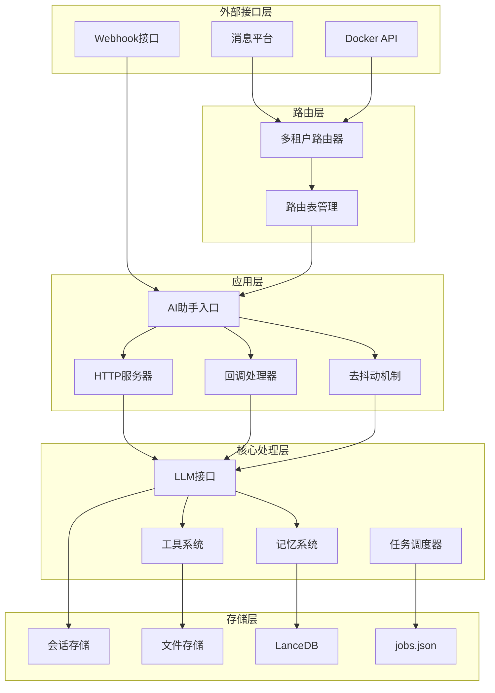

**图表来源**
- [router.py:1-493](file://router.py#L1-L493)
- [xiaowang.py:1-626](file://xiaowang.py#L1-L626)
- [llm.py:1-401](file://llm.py#L1-L401)
- [memory.py:1-361](file://memory.py#L1-L361)
- [scheduler.py:1-219](file://scheduler.py#L1-L219)

## 详细组件分析

### AI助手主入口详细分析

#### HTTP服务器配置

AI助手入口模块实现了完整的HTTP服务器配置，支持多线程处理和异步回调。

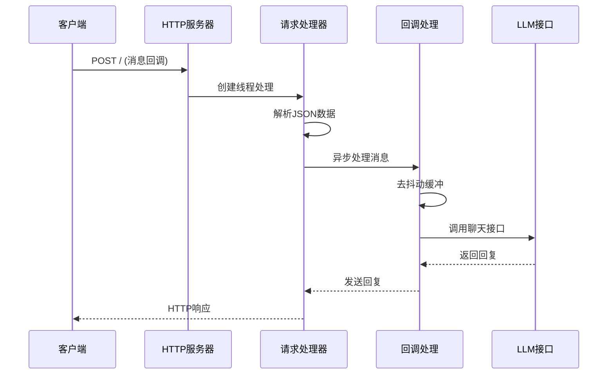

**图表来源**
- [xiaowang.py:559-592](file://xiaowang.py#L559-L592)
- [xiaowang.py:489-588](file://xiaowang.py#L489-L588)

#### 去抖动机制实现

去抖动机制通过时间窗口合并连续的消息，减少不必要的LLM调用。

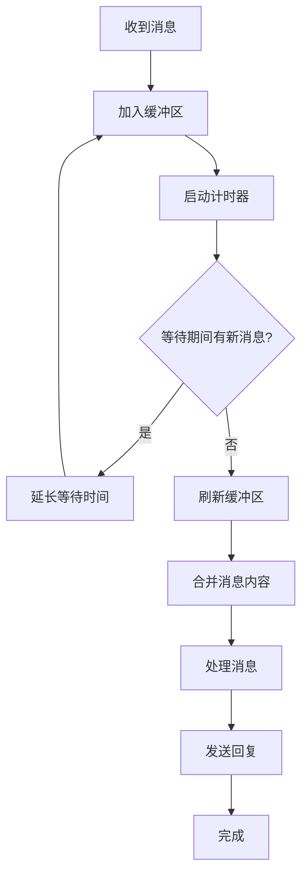

**图表来源**
- [xiaowang.py:311-378](file://xiaowang.py#L311-L378)

**章节来源**
- [xiaowang.py:311-378](file://xiaowang.py#L311-L378)
- [xiaowang.py:559-592](file://xiaowang.py#L559-L592)

### LLM接口详细分析

#### 工具使用循环

LLM接口实现了完整的工具使用循环，支持最多20次迭代。

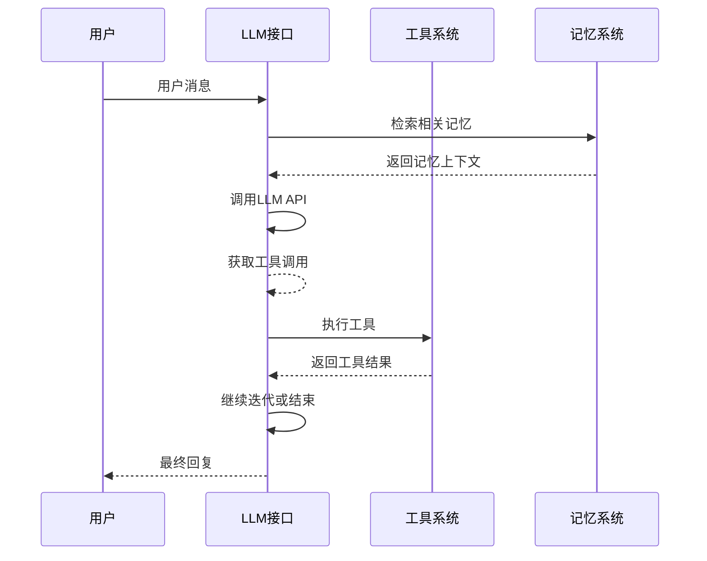

**图表来源**
- [llm.py:324-400](file://llm.py#L324-L400)

#### 会话管理系统

会话管理实现了消息历史的持久化和压缩机制。

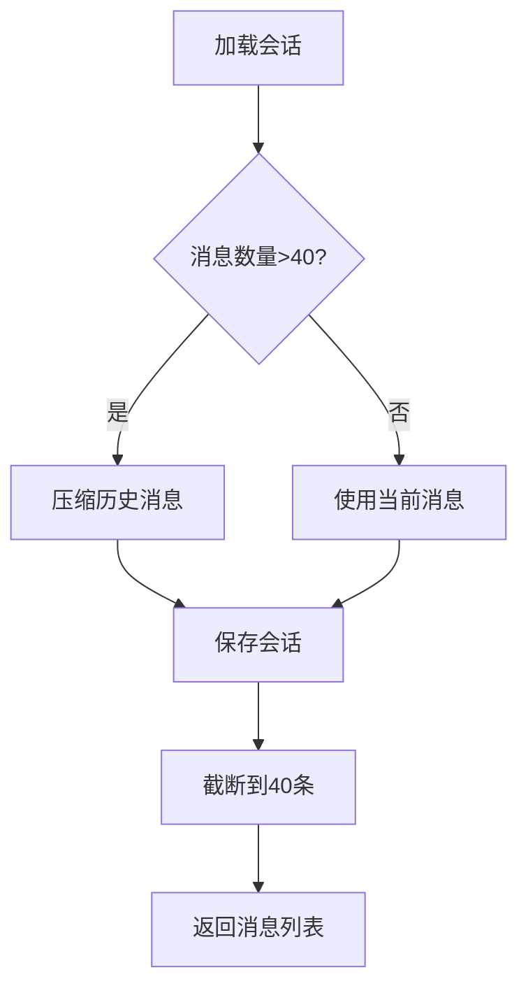

**图表来源**
- [llm.py:94-160](file://llm.py#L94-L160)

**章节来源**
- [llm.py:324-400](file://llm.py#L324-L400)
- [llm.py:94-160](file://llm.py#L94-L160)

### 工具注册系统详细分析

#### 装饰器模式实现

工具注册系统采用装饰器模式，提供简洁的工具定义语法。

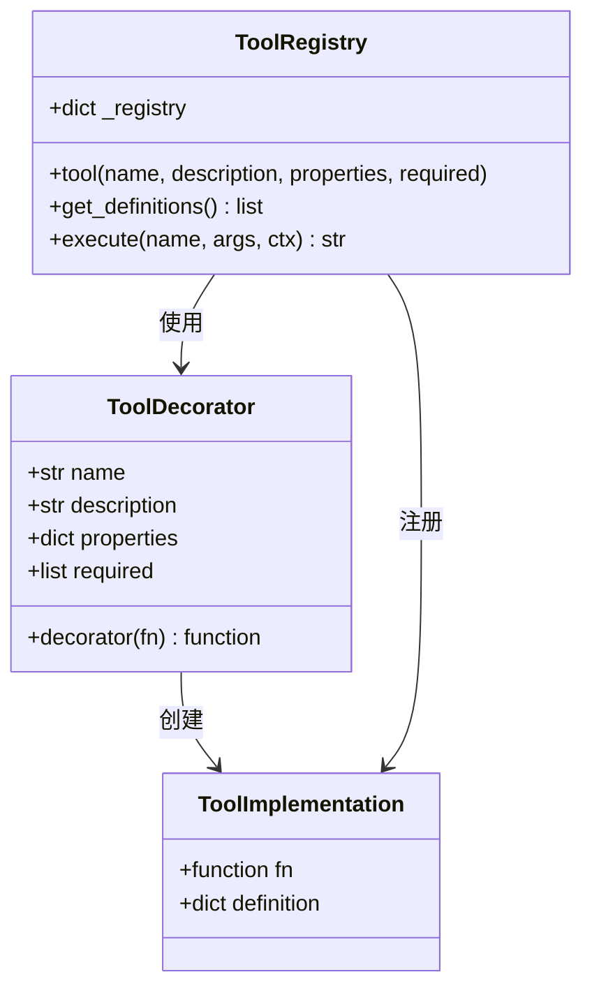

**图表来源**
- [tools.py:36-74](file://tools.py#L36-L74)

#### 插件架构设计

插件系统支持运行时动态加载自定义工具。

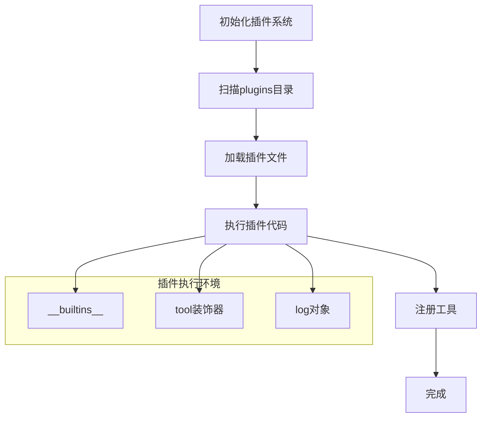

**图表来源**
- [tools.py:518-545](file://tools.py#L518-L545)

**章节来源**
- [tools.py:36-74](file://tools.py#L36-L74)
- [tools.py:518-545](file://tools.py#L518-L545)

### 智能记忆系统详细分析

#### 三阶段管道设计

记忆系统实现了完整的三阶段处理管道。

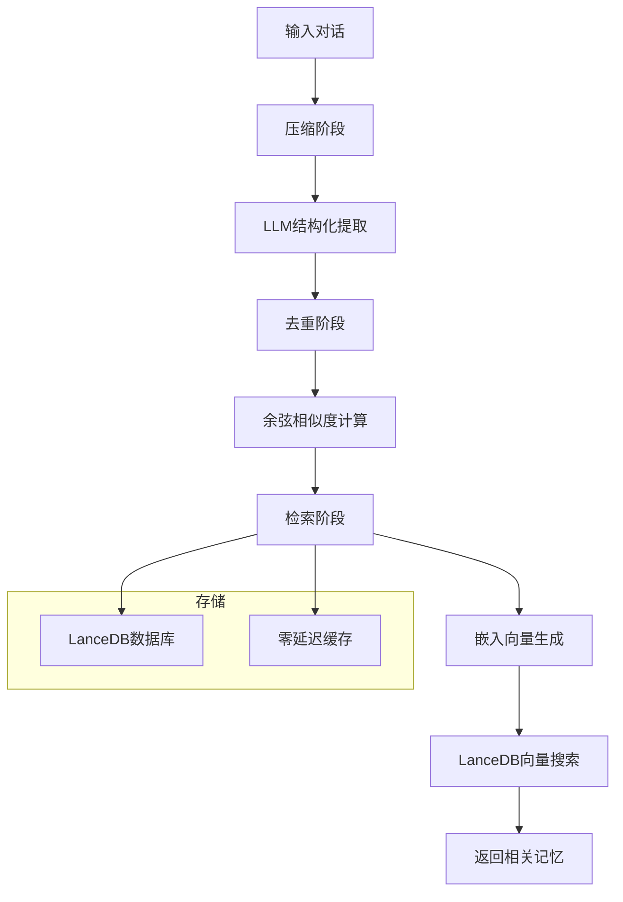

**图表来源**
- [memory.py:121-146](file://memory.py#L121-L146)
- [memory.py:294-361](file://memory.py#L294-L361)

#### 向量存储和检索

向量存储系统基于LanceDB实现高效的相似度搜索。

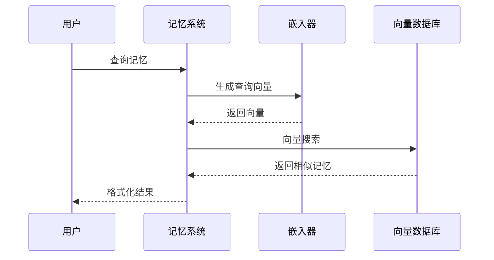

**图表来源**
- [memory.py:88-119](file://memory.py#L88-L119)
- [memory.py:158-188](file://memory.py#L158-L188)

**章节来源**
- [memory.py:88-119](file://memory.py#L88-L119)
- [memory.py:158-188](file://memory.py#L158-L188)

### 任务调度器详细分析

#### 任务生命周期管理

任务调度器实现了完整的一次性和周期性任务管理。

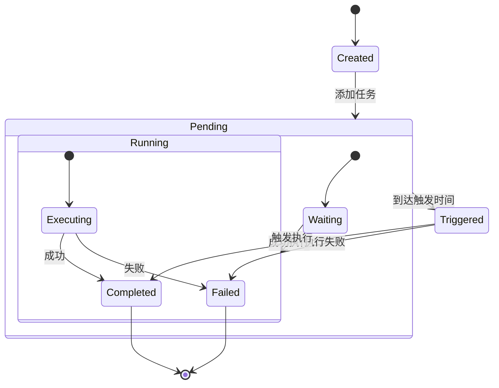

**图表来源**
- [scheduler.py:130-186](file://scheduler.py#L130-L186)

#### Cron表达式处理

调度器使用croniter库精确处理Cron表达式。

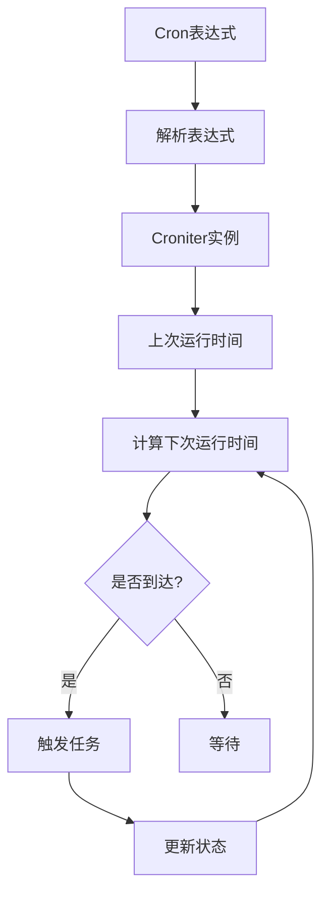

**图表来源**
- [scheduler.py:140-162](file://scheduler.py#L140-L162)

**章节来源**
- [scheduler.py:130-186](file://scheduler.py#L130-L186)
- [scheduler.py:140-162](file://scheduler.py#L140-L162)

### 多租户路由器详细分析

#### Docker容器编排

路由器实现了完整的Docker容器编排和管理。

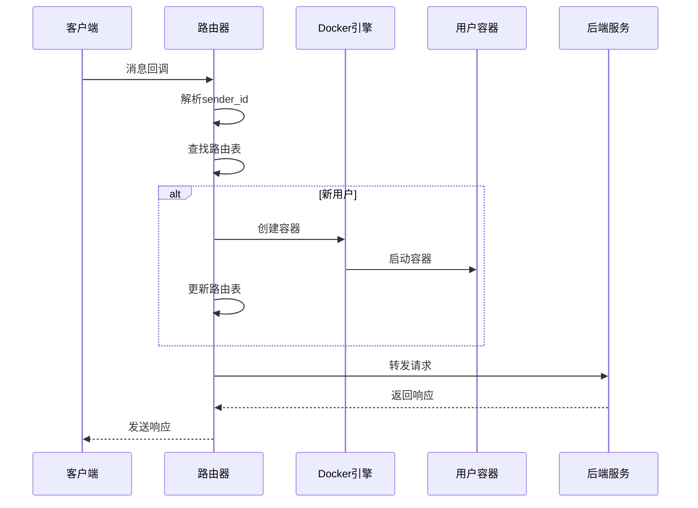

**图表来源**
- [router.py:397-418](file://router.py#L397-L418)

#### 自动容器管理

路由器具备自动容器创建和健康检查能力。

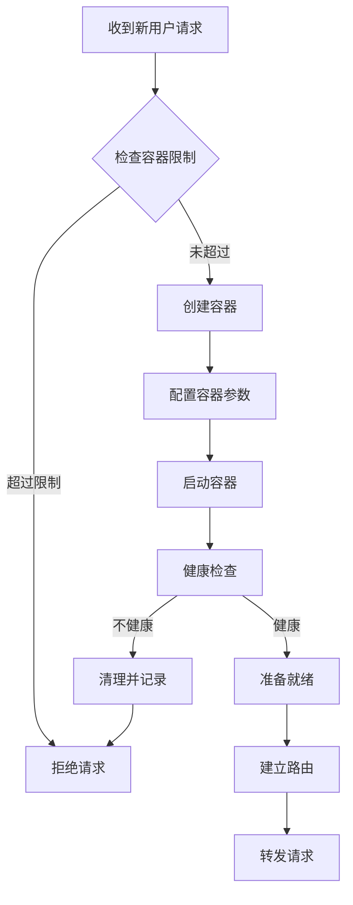

**图表来源**
- [router.py:141-250](file://router.py#L141-L250)

**章节来源**
- [router.py:397-418](file://router.py#L397-L418)
- [router.py:141-250](file://router.py#L141-L250)

## 依赖关系分析

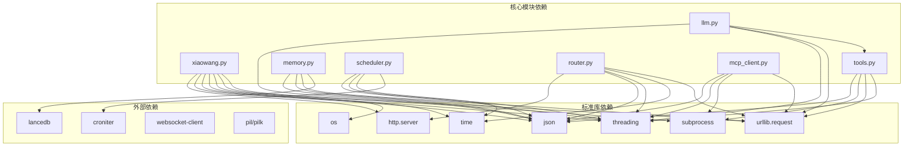

**图表来源**
- [xiaowang.py:15-30](file://xiaowang.py#L15-L30)
- [llm.py:8-16](file://llm.py#L8-L16)
- [tools.py:19-26](file://tools.py#L19-L26)
- [memory.py:12-19](file://memory.py#L12-L19)
- [scheduler.py:10-16](file://scheduler.py#L10-L16)
- [router.py:9-19](file://router.py#L9-L19)
- [mcp_client.py:14-20](file://mcp_client.py#L14-L20)

**章节来源**
- [xiaowang.py:15-30](file://xiaowang.py#L15-L30)
- [llm.py:8-16](file://llm.py#L8-L16)
- [tools.py:19-26](file://tools.py#L19-L26)
- [memory.py:12-19](file://memory.py#L12-L19)
- [scheduler.py:10-16](file://scheduler.py#L10-L16)
- [router.py:9-19](file://router.py#L9-L19)
- [mcp_client.py:14-20](file://mcp_client.py#L14-L20)

## 性能考虑

### 内存优化策略

1. **会话消息限制**：每会话最多40条消息，超出自动压缩
2. **异步压缩处理**：后台线程处理压缩，不影响主线程响应
3. **零延迟缓存**：硬件/语音通道使用预计算的记忆摘要
4. **图像内容优化**：历史消息中用占位符替代图片URL

### 并发处理

1. **线程安全设计**：每个会话使用独立锁，避免竞态条件
2. **异步I/O**：文件操作和网络请求使用非阻塞方式
3. **连接池管理**：MCP服务器连接自动重连和复用
4. **背压控制**：去抖动机制防止消息风暴

### 存储优化

1. **LanceDB嵌入式**：无需独立服务进程，降低资源消耗
2. **向量索引**：高效的相似度搜索算法
3. **原子文件写入**：确保数据一致性
4. **增量更新**：只存储新增的记忆条目

## 故障排除指南

### 常见问题诊断

#### LLM调用失败

**症状**：LLM接口返回错误消息
**排查步骤**：
1. 检查API密钥配置
2. 验证网络连接
3. 查看超时设置
4. 检查模型兼容性

**解决方案**：
- 更新配置文件中的API密钥
- 调整超时参数
- 切换到兼容的模型

#### 记忆系统异常

**症状**：记忆检索返回空结果或错误
**排查步骤**：
1. 验证嵌入API配置
2. 检查LanceDB数据库状态
3. 确认相似度阈值设置
4. 查看压缩日志

**解决方案**：
- 重新初始化记忆数据库
- 调整相似度阈值
- 清理损坏的记忆条目

#### Docker容器问题

**症状**：新用户无法创建容器或路由失败
**排查步骤**：
1. 检查Docker守护进程状态
2. 验证容器镜像可用性
3. 确认网络配置正确
4. 查看容器日志

**解决方案**：
- 重启Docker服务
- 拉取最新镜像
- 检查防火墙设置

**章节来源**
- [llm.py:74-83](file://llm.py#L74-L83)
- [memory.py:84-86](file://memory.py#L84-L86)
- [router.py:247-250](file://router.py#L247-L250)

## 结论

724 Office系统展现了优秀的工程设计和实现质量。通过模块化架构、清晰的职责分离和完善的错误处理机制，系统实现了高度的可维护性和扩展性。

**核心优势**：
1. **零依赖设计**：完全基于标准库，部署简单可靠
2. **模块化架构**：各组件职责明确，便于测试和维护
3. **自修复能力**：内置自检和诊断工具，实现系统自治
4. **扩展性强**：插件系统和MCP架构支持第三方扩展
5. **性能优化**：多层缓存和异步处理提升响应速度

**未来改进方向**：
1. 增加更多的监控指标和告警机制
2. 实现更精细的权限控制和审计日志
3. 支持更多类型的多媒体处理
4. 提供更丰富的配置选项和模板系统

该系统为AI助手应用提供了一个完整、可靠且易于扩展的基础设施，适合在生产环境中长期稳定运行。