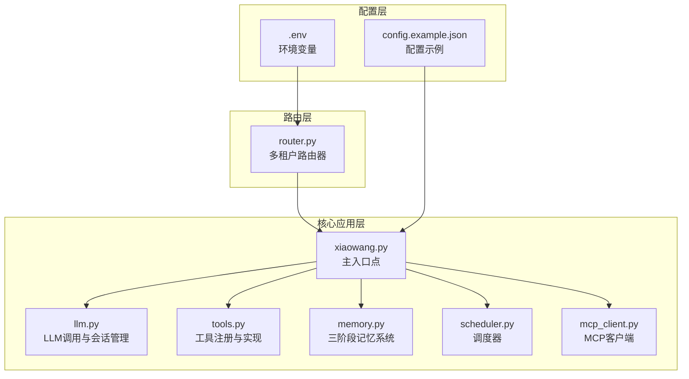
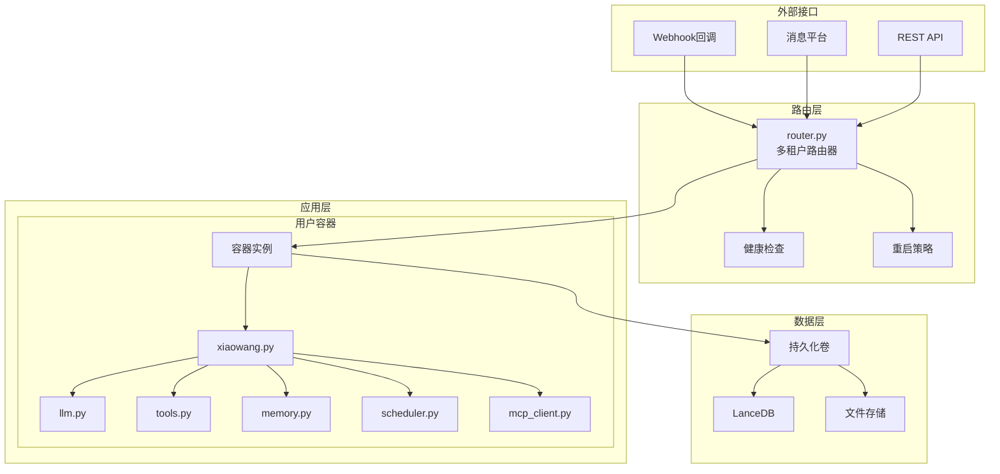
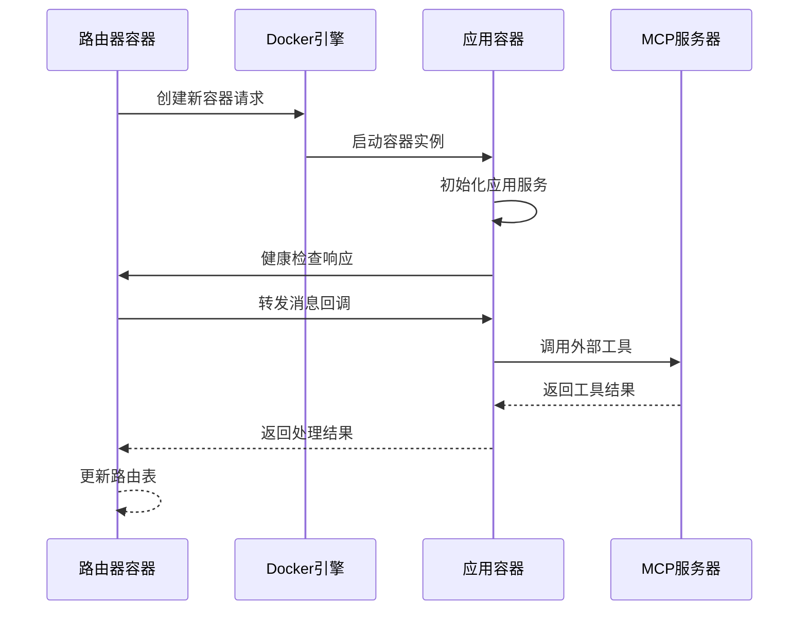

# Docker容器化部署

<cite>
**本文档引用的文件**
- [README.md](file://README.md)
- [config.example.json](file://config.example.json)
- [xiaowang.py](file://xiaowang.py)
- [router.py](file://router.py)
- [llm.py](file://llm.py)
- [tools.py](file://tools.py)
- [memory.py](file://memory.py)
- [scheduler.py](file://scheduler.py)
- [mcp_client.py](file://mcp_client.py)
- [self_check_tool.py](file://self_check_tool.py)
</cite>

## 目录
1. [简介](#简介)
2. [项目结构](#项目结构)
3. [核心组件](#核心组件)
4. [架构概览](#架构概览)
5. [Docker镜像构建](#docker镜像构建)
6. [容器运行配置](#容器运行配置)
7. [容器编排方案](#容器编排方案)
8. [健康检查与重启策略](#健康检查与重启策略)
9. [监控与日志管理](#监控与日志管理)
10. [性能优化建议](#性能优化建议)
11. [故障排除指南](#故障排除指南)
12. [结论](#结论)

## 简介

724 Office是一个生产级的AI智能体系统，采用纯Python开发，包含26个内置工具和8个核心文件，支持24/7全天候运行。该系统具有自修复能力、多租户路由、内存管理、MCP插件系统等高级特性。

本指南专注于如何将该系统容器化部署，包括Docker镜像构建、容器运行配置、容器编排以及监控管理等方面。

## 项目结构

724 Office项目采用模块化设计，主要文件及其职责如下：



**图表来源**
- [xiaowang.py:1-626](file://xiaowang.py#L1-L626)
- [router.py:1-493](file://router.py#L1-L493)
- [config.example.json:1-61](file://config.example.json#L1-L61)

**章节来源**
- [README.md:1-162](file://README.md#L1-L162)
- [xiaowang.py:1-626](file://xiaowang.py#L1-L626)

## 核心组件

### 主应用组件

**xiaowang.py** - 系统主入口点，负责：
- HTTP服务器启动和回调处理
- 配置加载和模块初始化
- 文件持久化存储管理
- 语音转文字(ASR)功能
- 消息去抖动和合并

**llm.py** - 核心LLM处理组件：
- LLM API调用封装
- 工具使用循环实现
- 会话管理和历史记录
- 多模态消息处理(图像、视频等)

**tools.py** - 工具系统：
- 26个内置工具的定义和实现
- 工具装饰器系统
- 插件扩展机制
- 自定义工具创建

**memory.py** - 三阶段记忆系统：
- 压缩阶段：对话内容结构化提取
- 去重阶段：向量相似度比较
- 检索阶段：向量搜索和上下文注入

**scheduler.py** - 内置调度器：
- 单次延迟任务
- Cron周期性任务
- 任务持久化存储
- 异步执行机制

**mcp_client.py** - MCP协议客户端：
- 外部MCP服务器连接
- JSON-RPC协议实现
- 工具热重载支持

**章节来源**
- [xiaowang.py:1-626](file://xiaowang.py#L1-L626)
- [llm.py:1-401](file://llm.py#L1-L401)
- [tools.py:1-800](file://tools.py#L1-L800)
- [memory.py:1-361](file://memory.py#L1-L361)
- [scheduler.py:1-219](file://scheduler.py#L1-L219)
- [mcp_client.py:1-334](file://mcp_client.py#L1-L334)

## 架构概览

系统采用多租户架构，支持每个用户独立的容器实例：



**图表来源**
- [router.py:1-493](file://router.py#L1-L493)
- [xiaowang.py:1-626](file://xiaowang.py#L1-L626)

## Docker镜像构建

### 基础镜像选择

推荐使用Python官方基础镜像，确保兼容性和安全性：

```dockerfile
FROM python:3.11-slim

# 设置工作目录
WORKDIR /app

# 安装系统依赖
RUN apt-get update && apt-get install -y \
    ffmpeg \
    && rm -rf /var/lib/apt/lists/*

# 复制依赖文件
COPY requirements.txt .

# 安装Python依赖
RUN pip install --no-cache-dir -r requirements.txt

# 复制应用代码
COPY . .

# 创建非root用户
RUN useradd --create-home --shell /bin/bash app \
    && chown -R app:app /app
USER app

# 暴露端口
EXPOSE 8080

# 健康检查
HEALTHCHECK --interval=30s --timeout=3s --start-period=5s --retries=3 \
    CMD curl -f http://localhost:8080/ || exit 1

# 启动命令
CMD ["python3", "xiaowang.py"]
```

### 多阶段构建优化

对于生产环境，建议使用多阶段构建以减小镜像大小：

```dockerfile
# 第一阶段：构建阶段
FROM python:3.11-slim as builder

WORKDIR /app

# 安装构建依赖
RUN apt-get update && apt-get install -y \
    gcc \
    g++ \
    && rm -rf /var/lib/apt/lists/*

# 安装Python依赖
COPY requirements.txt .
RUN pip install --no-cache-dir -r requirements.txt

# 第二阶段：运行阶段
FROM python:3.11-alpine as runtime

WORKDIR /app

# 安装运行时依赖
RUN apk add --no-cache \
    ffmpeg \
    ca-certificates

# 复制已安装的依赖
COPY --from=builder /usr/local/lib/python3.11/site-packages /usr/local/lib/python3.11/site-packages

# 复制应用代码
COPY --chown=app:app . .

# 创建非root用户
RUN adduser -D -s /bin/sh app
USER app

EXPOSE 8080
CMD ["python3", "xiaowang.py"]
```

### Dockerfile编写要点

1. **分层优化**：将经常变化的代码层放在后面，依赖安装层放在前面
2. **安全考虑**：使用非root用户运行容器
3. **资源限制**：在Dockerfile中设置合理的资源限制
4. **健康检查**：内置健康检查机制
5. **日志配置**：配置标准输出日志

**章节来源**
- [router.py:157-250](file://router.py#L157-L250)
- [xiaowang.py:597-626](file://xiaowang.py#L597-L626)

## 容器运行配置

### 端口映射

系统默认监听8080端口，需要正确映射到主机：

```yaml
ports:
  - "8080:8080"  # 应用服务端口
  - "8081:8081"  # 路由器端口(可选)
```

### 卷挂载

需要挂载以下目录以实现数据持久化：

```yaml
volumes:
  # 配置文件卷
  - ./config.json:/app/config.json
  
  # 数据存储卷
  - ./workspace:/app/workspace
  
  # 记忆数据库卷
  - ./memory_db:/app/memory_db
  
  # 日志卷
  - ./logs:/app/logs
  
  # 临时文件卷
  - ./tmp:/tmp
```

### 环境变量配置

```yaml
environment:
  # 应用配置
  AGENT_CONFIG: /app/config.json
  PORT: 8080
  
  # 路由器配置
  ROUTING_FILE: /data/router/routing.json
  DEFAULT_BACKEND: ""
  HOST_DATA_DIR: /data/agent/containers
  APP_IMAGE: agent-app:latest
  DOCKER_NETWORK: docker_agent-net
  ENV_FILE_PATH: /data/env/.env
  MAX_CONTAINERS: 20
  CONTAINER_MEMORY: 256m
  PROVISION_TIMEOUT: 45
  
  # Docker引擎访问
  DOCKER_HOST: unix:///var/run/docker.sock
```

### 网络配置

```yaml
networks:
  agent-network:
    driver: bridge
    ipam:
      config:
        - subnet: 172.20.0.0/16
          gateway: 172.20.0.1

# 容器网络配置
network_mode: "agent-network"
```

**章节来源**
- [router.py:23-32](file://router.py#L23-L32)
- [xiaowang.py:35-47](file://xiaowang.py#L35-L47)

## 容器编排方案

### docker-compose.yml配置

```yaml
version: '3.8'

services:
  # 主应用服务
  agent-app:
    build:
      context: .
      dockerfile: Dockerfile
    image: agent-app:latest
    container_name: agent-app
    ports:
      - "8080:8080"
    volumes:
      - ./config.json:/app/config.json
      - ./workspace:/app/workspace
      - ./memory_db:/app/memory_db
      - ./logs:/app/logs
      - ./tmp:/tmp
    environment:
      - AGENT_CONFIG=/app/config.json
      - PORT=8080
      - PYTHONPATH=/app
    networks:
      - agent-network
    restart: unless-stopped
    healthcheck:
      test: ["CMD", "curl", "-f", "http://localhost:8080/"]
      interval: 30s
      timeout: 10s
      retries: 3
      start_period: 40s
    
    # 路由器服务(多租户)
    agent-router:
      build:
        context: .
        dockerfile: Dockerfile.router
      image: agent-router:latest
      container_name: agent-router
      ports:
        - "8081:8080"
      volumes:
        - ./router-config.json:/data/router/config.json
        - ./router-data:/data/router
        - /var/run/docker.sock:/var/run/docker.sock:ro
      environment:
        - ROUTING_FILE=/data/router/routing.json
        - DEFAULT_BACKEND=http://agent-app:8080
        - HOST_DATA_DIR=/data/agent/containers
        - APP_IMAGE=agent-app:latest
        - DOCKER_NETWORK=agent-network
        - ENV_FILE_PATH=/data/env/.env
        - MAX_CONTAINERS=20
        - CONTAINER_MEMORY=256m
        - PROVISION_TIMEOUT=45
      networks:
        - agent-network
      restart: unless-stopped
      depends_on:
        - agent-app

  # 外部MCP服务器(可选)
  mcp-server:
    image: mcp-server:latest
    container_name: mcp-server
    ports:
      - "3000:3000"
    networks:
      - agent-network
    restart: unless-stopped

networks:
  agent-network:
    driver: bridge
    ipam:
      config:
        - subnet: 172.20.0.0/16
```

### 容器间通信设置



**图表来源**
- [router.py:141-250](file://router.py#L141-L250)

**章节来源**
- [router.py:175-250](file://router.py#L175-L250)

## 健康检查与重启策略

### 健康检查机制

系统实现了多层次的健康检查：

```python
# 应用容器健康检查
"Healthcheck": {
    "Test": ["CMD", "curl", "-f", "http://localhost:8080/"],
    "Interval": 30000000000,  # 30s
    "Timeout": 3000000000,    # 3s
    "Retries": 3,
    "StartPeriod": 40000000000  # 40s
}

# 路由器健康检查
"Healthcheck": {
    "Test": ["CMD", "curl", "-f", "http://localhost:8080/health"],
    "Interval": 5000000000,   # 5s
    "Timeout": 3000000000,    # 3s
    "Retries": 3
}
```

### 重启策略配置

```yaml
restart: unless-stopped
# 或者更严格的策略
restart:
  condition: on-failure
  delay: 5s
  max_attempts: 3
  window: 60s
```

### 自愈机制

```python
# 路由器自愈逻辑
def reconcile_routes():
    """启动时扫描现有容器，重建路由表"""
    status, containers = docker_api(
        'GET',
        '/containers/json?filters={"name":["agent-u"]}',
    )
    # 重建路由表逻辑...
```

**章节来源**
- [router.py:190-250](file://router.py#L190-L250)
- [router.py:433-465](file://router.py#L433-L465)

## 监控与日志管理

### 日志配置

系统支持多种日志级别和输出方式：

```python
# 应用日志配置
logging.basicConfig(
    level=logging.INFO,
    format="%(asctime)s [%(levelname)s] %(message)s"
)

# 路由器日志配置
logging.basicConfig(
    level=logging.INFO,
    format="%(asctime)s [%(levelname)s] %(message)s"
)
```

### 性能监控指标

```python
# 关键性能指标收集
perf_metrics = {
    "prep_time": t_prep,           # 准备时间(ms)
    "llm_time": t_llm_total,       # LLM调用时间(ms)
    "tool_count": tool_count,      # 工具调用次数
    "total_time": total_time,      # 总处理时间(ms)
    "memory_usage": memory_usage   # 内存使用情况
}
```

### 监控配置

```yaml
# Prometheus监控配置
prometheus:
  scrape_interval: 15s
  targets:
    - job_name: agent-app
      static_configs:
        - targets: ['agent-app:8080']
    - job_name: agent-router
      static_configs:
        - targets: ['agent-router:8080']
```

### 日志轮转

```python
# 使用RotatingFileHandler进行日志轮转
from logging.handlers import RotatingFileHandler

handler = RotatingFileHandler(
    'app.log',
    maxBytes=10485760,  # 10MB
    backupCount=5
)
```

**章节来源**
- [llm.py:380-400](file://llm.py#L380-L400)
- [xiaowang.py:52](file://xiaowang.py#L52)

## 性能优化建议

### 内存优化

1. **容器内存限制**：为每个容器设置合理的内存上限
2. **垃圾回收**：定期清理未使用的对象和缓存
3. **连接池**：复用LLM API连接和数据库连接

### 并发优化

```python
# 线程池配置
thread_pool = ThreadPoolExecutor(max_workers=10)

# 会话锁优化
_chat_locks = {}
_chat_locks_lock = threading.Lock()

def _get_chat_lock(session_key):
    with _chat_locks_lock:
        if session_key not in _chat_locks:
            _chat_locks[session_key] = threading.Lock()
        return _chat_locks[session_key]
```

### 存储优化

1. **文件系统缓存**：合理配置文件系统缓存策略
2. **数据库优化**：LanceDB索引优化和查询优化
3. **内存映射**：大文件使用内存映射而非完全加载

### 网络优化

1. **连接复用**：HTTP客户端连接池
2. **超时配置**：合理的请求超时和重试策略
3. **负载均衡**：多实例部署时的负载均衡

**章节来源**
- [router.py:131-139](file://router.py#L131-L139)
- [llm.py:306-322](file://llm.py#L306-L322)

## 故障排除指南

### 常见问题诊断

1. **容器无法启动**
   - 检查端口占用情况
   - 验证配置文件权限
   - 查看Docker守护进程状态

2. **健康检查失败**
   - 检查应用服务是否正常启动
   - 验证端口映射配置
   - 查看应用日志输出

3. **多租户路由问题**
   - 检查Docker Unix套接字权限
   - 验证网络配置
   - 查看路由表状态

### 调试工具

```bash
# 查看容器状态
docker ps -a
docker stats

# 查看容器日志
docker logs -f agent-app

# 进入容器调试
docker exec -it agent-app bash

# 检查Docker网络
docker network ls
docker network inspect agent-network
```

### 错误处理机制

```python
# 统一错误处理
try:
    # 业务逻辑
    pass
except Exception as e:
    logger.error(f"Operation failed: {e}")
    # 执行回退策略
    pass
```

**章节来源**
- [router.py:118-127](file://router.py#L118-L127)
- [xiaowang.py:357-363](file://xiaowang.py#L357-L363)

## 结论

724 Office系统的Docker容器化部署提供了高度可扩展和可靠的生产环境解决方案。通过多租户架构、自动路由和健康检查机制，系统能够支持大量并发用户同时使用。

关键优势包括：
- **高可用性**：自动重启和健康检查确保服务连续性
- **可扩展性**：按需创建容器实例，支持水平扩展
- **安全性**：隔离的容器环境和非root用户运行
- **可观测性**：完善的日志记录和监控指标
- **维护性**：热重载和自动更新机制

建议在生产环境中结合监控系统、备份策略和容量规划，以确保系统的长期稳定运行。