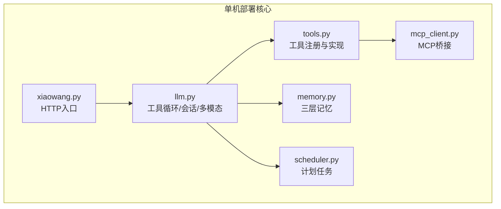
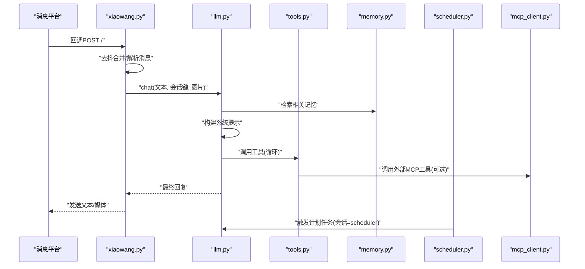
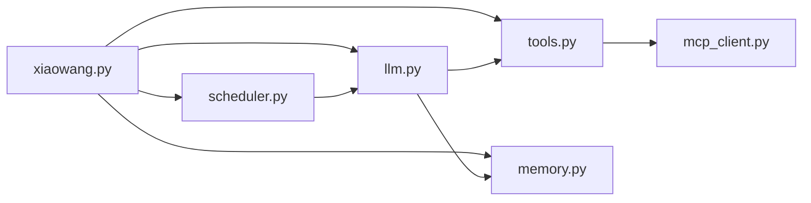

# 单机部署

<cite>
**本文引用的文件**
- [README.md](file://README.md)
- [config.example.json](file://config.example.json)
- [xiaowang.py](file://xiaowang.py)
- [llm.py](file://llm.py)
- [tools.py](file://tools.py)
- [memory.py](file://memory.py)
- [scheduler.py](file://scheduler.py)
- [mcp_client.py](file://mcp_client.py)
- [router.py](file://router.py)
- [self_check_tool.py](file://self_check_tool.py)
</cite>

## 目录
1. [简介](#简介)
2. [项目结构](#项目结构)
3. [核心组件](#核心组件)
4. [架构总览](#架构总览)
5. [详细组件分析](#详细组件分析)
6. [依赖分析](#依赖分析)
7. [性能考虑](#性能考虑)
8. [故障排除指南](#故障排除指南)
9. [结论](#结论)
10. [附录](#附录)

## 简介
本指南面向希望在单机环境下部署 724 Office 的用户，提供从环境准备、依赖安装、配置设置到完整启动与验证的全流程说明。该系统以纯 Python 实现，零框架依赖，核心运行于标准库与少量小包（croniter、lancedb、websocket-client），支持多模态对话、三段式记忆、计划任务、MCP 插件桥接、ASR 语音转写等能力，并提供自修复与自演进机制。

## 项目结构
仓库采用“按职责分层”的文件组织方式：
- 入口与服务：xiaowang.py（HTTP 服务入口）
- 核心对话：llm.py（工具循环、会话管理、多模态）
- 工具系统：tools.py（内置工具注册与实现）
- 记忆系统：memory.py（压缩-去重-检索三层记忆）
- 调度系统：scheduler.py（一次性与周期性任务）
- MCP 客户端：mcp_client.py（外部 MCP 服务器连接与热重载）
- 多租户路由（可选）：router.py（Docker 多容器路由，适合多用户场景）
- 自检工具文档：self_check_tool.py（自修复模式说明）

图表来源
- [xiaowang.py:59-76](file://xiaowang.py#L59-L76)
- [llm.py:33-40](file://llm.py#L33-L40)
- [tools.py:36-74](file://tools.py#L36-L74)
- [memory.py:40-86](file://memory.py#L40-L86)
- [scheduler.py:30-43](file://scheduler.py#L30-L43)
- [mcp_client.py:272-286](file://mcp_client.py#L272-L286)

章节来源
- [README.md:23-66](file://README.md#L23-L66)
- [xiaowang.py:59-76](file://xiaowang.py#L59-L76)

## 核心组件
- HTTP 服务与回调处理：接收消息平台回调，去抖合并，触发工具循环，回复消息。
- LLM 对话与工具循环：构建系统提示、注入记忆上下文、执行工具、保存会话。
- 工具系统：内置 26+ 工具，支持插件扩展与 MCP 服务器工具桥接。
- 记忆系统：会话短记忆 + 压缩长记忆 + 向量检索，支持相似度去重与零延迟缓存。
- 调度系统：持久化任务列表，后台线程定时检查，支持一次性与周期性任务。
- MCP 客户端：JSON-RPC 连接外部 MCP 服务器，支持 stdio/http 传输与热重载。
- 多租户路由（可选）：基于 Docker 的多用户容器隔离与自动编排。

章节来源
- [xiaowang.py:490-588](file://xiaowang.py#L490-L588)
- [llm.py:317-401](file://llm.py#L317-L401)
- [tools.py:108-800](file://tools.py#L108-L800)
- [memory.py:88-120](file://memory.py#L88-L120)
- [scheduler.py:130-186](file://scheduler.py#L130-L186)
- [mcp_client.py:272-334](file://mcp_client.py#L272-L334)
- [router.py:469-493](file://router.py#L469-L493)

## 架构总览
下图展示单机部署时各模块的交互关系与数据流。

图表来源
- [xiaowang.py:489-588](file://xiaowang.py#L489-L588)
- [llm.py:317-401](file://llm.py#L317-L401)
- [tools.py:63-74](file://tools.py#L63-L74)
- [memory.py:88-120](file://memory.py#L88-L120)
- [scheduler.py:166-186](file://scheduler.py#L166-L186)
- [mcp_client.py:296-310](file://mcp_client.py#L296-L310)

## 详细组件分析

### 环境准备与硬件要求
- Python 版本：使用标准库与少量第三方包，建议使用 Python 3.8+（具体以系统兼容为准）。
- 系统依赖：
  - croniter：用于计划任务解析。
  - lancedb：嵌入式向量数据库，无需独立服务。
  - websocket-client：用于 ASR WebSocket 流式识别。
  - 可选：pilk（微信 silk 音频解码）、ffmpeg（视频处理工具链）。
- 硬件配置（参考设计原则）：
  - 边缘设备友好，内存预算建议低于 2GB（可在资源受限设备上运行）。
  - Jetson Orin Nano（8GB RAM，ARM64 + GPU）为参考目标，单机部署可按需调整资源上限。

章节来源
- [README.md:155](file://README.md#L155)
- [README.md:115](file://README.md#L115)
- [README.md:116](file://README.md#L116)

### 依赖安装步骤
- 安装 Python 第三方包：
  - pip install croniter lancedb websocket-client
  - 可选：pip install pilk（若需要微信 silk 音频解码）
- 系统库配置（可选但推荐）：
  - ffmpeg：用于视频剪辑、添加背景音乐、生成视频后的下载与发送。
  - Docker（仅多租户路由场景）：用于容器自动编排与隔离。

章节来源
- [README.md:112-117](file://README.md#L112-L117)

### 配置文件设置
- 复制示例配置并编辑：
  - cp config.example.json config.json
  - 编辑 config.json 中的模型、消息平台、内存、ASR、视频、搜索、MCP 等配置项。
- 关键配置项说明（节选）：
  - models.default：默认模型名称
  - models.providers.{name}.api_base/api_key/model/max_tokens：提供商配置
  - messaging.token/guid/api_url：消息平台凭据与发送接口
  - owner_ids：所有者 ID 列表（单用户模式下用于过滤）
  - workspace：工作区根目录
  - port：HTTP 服务端口
  - debounce_seconds：消息去抖间隔
  - memory.enabled/embedding_api：三层记忆开关与嵌入 API 配置
  - asr.app_id/api_key/api_secret/ws_url：ASR WebSocket 凭据
  - video_api.api_base/api_key/model：视频生成 API 配置
  - tavily_api_key/search_api_key：搜索 API 密钥
  - mcp_servers：MCP 服务器连接（stdio/http 两种传输）
- 环境变量（单机部署常用）：
  - AGENT_CONFIG：指定 config.json 路径（默认为当前目录下的 config.json）
  - PORT：覆盖 config.json 中的端口（默认 8080）
  - 其他环境变量（多租户路由场景）：ROUTING_FILE、DEFAULT_BACKEND、HOST_DATA_DIR、APP_IMAGE、DOCKER_NETWORK、ENV_FILE_PATH、MAX_CONTAINERS、CONTAINER_MEMORY、PROVISION_TIMEOUT

章节来源
- [config.example.json:1-61](file://config.example.json#L1-L61)
- [xiaowang.py:35-47](file://xiaowang.py#L35-L47)
- [router.py:24-32](file://router.py#L24-L32)

### 启动流程
- 准备工作：
  - 创建工作区目录：mkdir -p workspace/memory workspace/files
  - 可选：创建个性文件（workspace/SOUL.md、AGENT.md、USER.md）
- 启动服务：
  - 单机模式：python3 xiaowang.py
  - 多租户路由模式：python3 router.py（需 Docker 环境）
- 端口与访问：
  - 默认监听 8080 端口；可通过 config.json 或环境变量 PORT 覆盖
  - 将消息平台的回调地址指向 http://YOUR_SERVER_IP:8080/
- 基本验证：
  - GET /：返回健康状态
  - POST /：接收回调，内部异步处理
  - /test 接口可用于测试对话（异步执行）

章节来源
- [README.md:119-139](file://README.md#L119-L139)
- [xiaowang.py:559-592](file://xiaowang.py#L559-L592)
- [router.py:469-493](file://router.py#L469-L493)

### 单机部署适用场景与限制
- 适用场景：
  - 个人助理、小型团队或单用户场景
  - 需要边缘部署、低延迟响应与本地数据隐私保护
  - 需要多模态处理、计划任务、记忆增强与工具扩展能力
- 限制：
  - 单机模式默认仅接受所有者 ID 的消息（非所有者会被拒绝）
  - 多租户路由模式需要 Docker 支持与网络配置
  - 记忆系统依赖嵌入 API（可本地替代方案，但默认使用 OpenAI 兼容接口）

章节来源
- [README.md:151-157](file://README.md#L151-L157)
- [xiaowang.py:340-342](file://xiaowang.py#L340-L342)
- [router.py:469-493](file://router.py#L469-L493)

### 性能调优建议
- 会话与记忆：
  - 控制会话长度（默认保留最近 40 条消息），避免过长历史导致 LLM 调用成本上升
  - 合理设置记忆检索 top_k 与相似度阈值，减少无关上下文注入
- 工具循环：
  - 工具循环最大迭代次数为 20，可根据业务需求评估是否需要增加
- 并发与去抖：
  - debounce_seconds 可根据消息频率调整，降低重复对话带来的 LLM 调用压力
- 资源限制：
  - 在资源受限设备上，建议关闭不必要的功能（如视频处理、ASR），或降低并发线程数

章节来源
- [llm.py:306-322](file://llm.py#L306-L322)
- [llm.py:356-358](file://llm.py#L356-L358)
- [xiaowang.py:44-44](file://xiaowang.py#L44-L44)
- [memory.py:93-94](file://memory.py#L93-L94)

## 依赖分析
- 内部模块耦合：
  - xiaowang.py 初始化 messaging、llm、scheduler、tools、memory，并在回调中驱动工具循环
  - llm.py 依赖 tools、memory，负责会话加载/保存、系统提示构建、工具循环
  - tools.py 注册工具并调用 messaging/scheduler 等模块
  - memory.py 依赖 lancedb 与嵌入 API，提供检索与压缩
  - scheduler.py 依赖 croniter，持久化任务列表
  - mcp_client.py 与 tools.py 协作，桥接外部 MCP 工具
- 外部依赖：
  - croniter：计划任务解析
  - lancedb：嵌入式向量数据库
  - websocket-client：ASR WebSocket
  - 可选：pilk（微信 silk 解码）、ffmpeg（视频处理）

图表来源
- [xiaowang.py:59-76](file://xiaowang.py#L59-L76)
- [llm.py:33-40](file://llm.py#L33-L40)
- [tools.py:36-74](file://tools.py#L36-L74)
- [memory.py:40-86](file://memory.py#L40-L86)
- [scheduler.py:30-43](file://scheduler.py#L30-L43)
- [mcp_client.py:272-286](file://mcp_client.py#L272-L286)

章节来源
- [README.md:3](file://README.md#L3)
- [README.md:115](file://README.md#L115)

## 故障排除指南
- 服务无法启动：
  - 检查端口占用与权限；确认 config.json 存在且可读
  - 查看日志输出，定位初始化阶段错误（如模型配置、内存初始化）
- 回调不生效：
  - 确认消息平台回调地址指向正确端口
  - 检查去抖缓冲区是否被清空（debounce_seconds 设置）
- 工具调用失败：
  - 查看工具执行日志，确认参数与权限
  - 若使用 MCP，检查服务器连接与热重载
- 记忆检索异常：
  - 确认嵌入 API 配置与可用性
  - 检查 LanceDB 数据库路径与权限
- ASR 识别失败：
  - 确认 ASR 凭据与 WebSocket 地址
  - 检查音频转码（silk/ffmpeg）是否成功
- 自检与自修复：
  - 使用 self_check 工具收集今日统计、错误日志、任务状态等
  - 通过调度器每日触发自检报告，必要时使用诊断与修复工具

章节来源
- [xiaowang.py:340-362](file://xiaowang.py#L340-L362)
- [tools.py:63-74](file://tools.py#L63-L74)
- [memory.py:88-120](file://memory.py#L88-L120)
- [mcp_client.py:312-322](file://mcp_client.py#L312-L322)
- [self_check_tool.py:18-31](file://self_check_tool.py#L18-L31)

## 结论
724 Office 提供了在单机环境下快速部署与稳定运行的完整方案。通过清晰的模块划分与极简依赖，用户可以在资源受限的环境中获得强大的多模态对话、记忆增强与自动化能力。建议在生产部署前完成充分的配置校验、资源评估与监控接入，确保系统在高负载与异常情况下仍能保持稳定。

## 附录
- 快速开始命令（单机模式）
  - git clone 仓库后复制配置并编辑
  - pip install croniter lancedb websocket-client
  - mkdir -p workspace/memory workspace/files
  - python3 xiaowang.py
- 多租户路由（可选）
  - 需要 Docker 环境与网络配置
  - 启动 router.py，按需设置环境变量与 .env 文件

章节来源
- [README.md:103-139](file://README.md#L103-L139)
- [router.py:469-493](file://router.py#L469-L493)