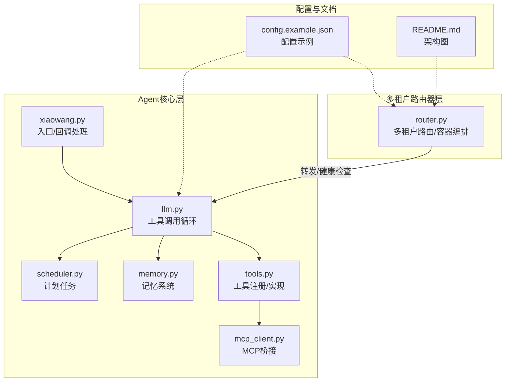
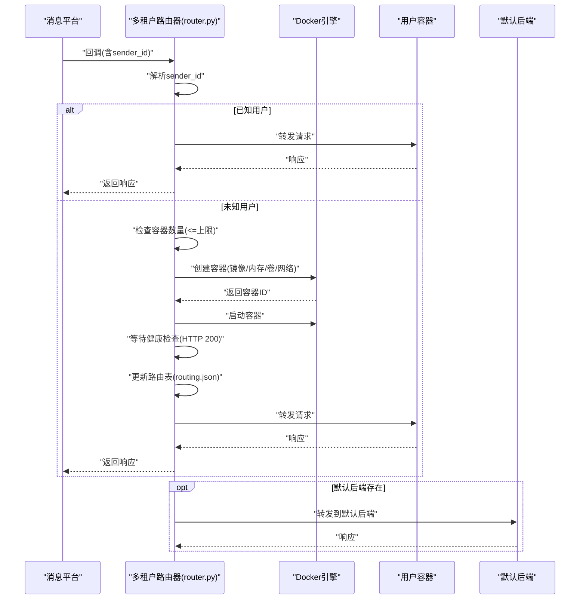
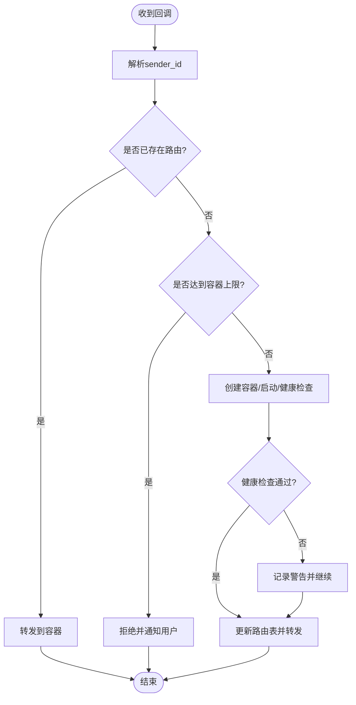
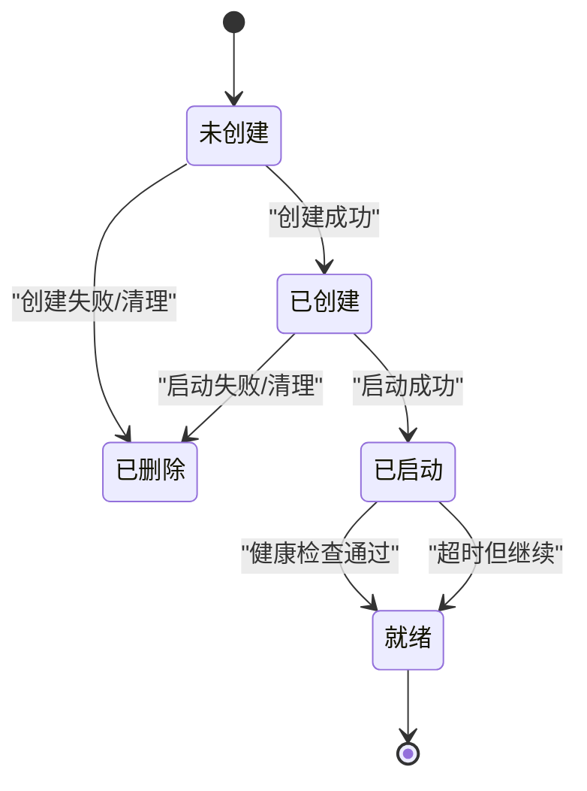
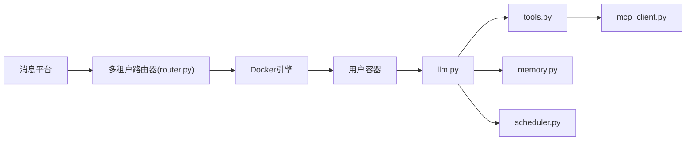
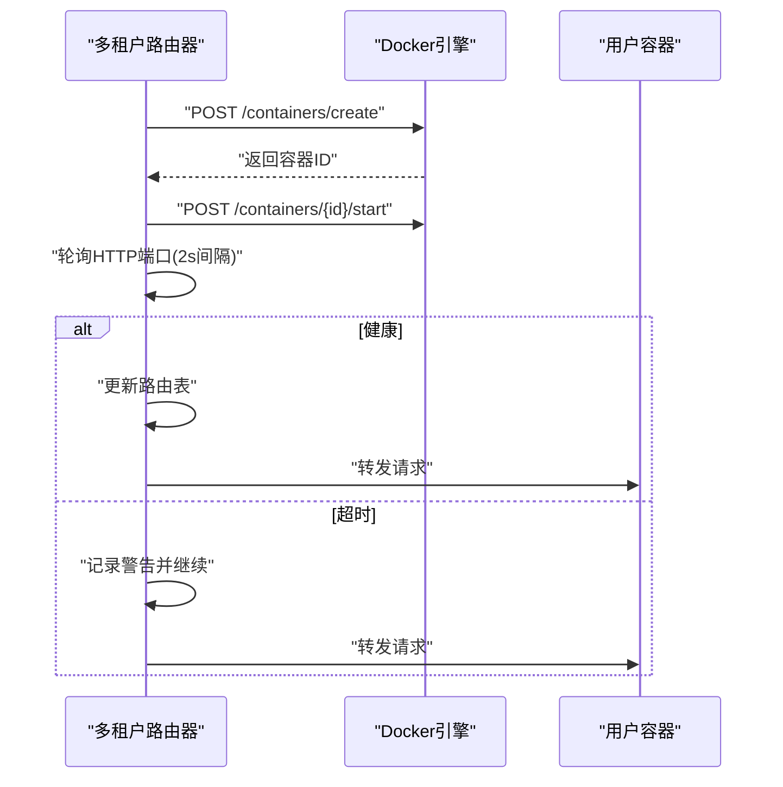

# 多租户管理

<cite>
**本文档引用的文件**
- [router.py](file://router.py)
- [llm.py](file://llm.py)
- [tools.py](file://tools.py)
- [scheduler.py](file://scheduler.py)
- [memory.py](file://memory.py)
- [mcp_client.py](file://mcp_client.py)
- [xiaowang.py](file://xiaowang.py)
- [config.example.json](file://config.example.json)
- [README.md](file://README.md)
</cite>

## 目录
1. [简介](#简介)
2. [项目结构](#项目结构)
3. [核心组件](#核心组件)
4. [架构总览](#架构总览)
5. [详细组件分析](#详细组件分析)
6. [依赖分析](#依赖分析)
7. [性能考虑](#性能考虑)
8. [故障排查指南](#故障排查指南)
9. [结论](#结论)
10. [附录](#附录)

## 简介
本文件面向724 Office多租户管理场景，聚焦“多租户路由器”的工作原理与实现细节，涵盖以下主题：
- 用户ID路由机制：基于回调中的sender_id进行路由查找与未知用户自动编排
- 容器自动编排流程：容器创建、启动、健康检查与路由表更新
- 路由表管理：持久化存储、加载、重载与自愈重建
- 用户容器生命周期管理：从创建到销毁的全链路
- 容器资源限制与隔离：内存限制、网络隔离、存储隔离
- 多租户配置参数：最大容器数量、容器内存限制、自动扩容策略
- 路由表维护与故障处理：容量告警、健康检查失败回退、自愈扫描

## 项目结构
该仓库采用按职责分层的模块化组织方式：
- 入口与路由：router.py负责多租户路由与容器编排；xiaowang.py作为Agent入口（非多租户路由器）
- 核心对话与工具：llm.py负责工具调用循环；tools.py注册内置工具；memory.py提供记忆系统；scheduler.py提供计划任务
- 外部桥接：mcp_client.py连接外部MCP服务器，扩展工具集
- 配置示例：config.example.json提供模型、消息平台、内存、ASR、视频生成等配置项

**图表来源**
- [router.py](file://router.py)
- [xiaowang.py](file://xiaowang.py)
- [llm.py](file://llm.py)
- [tools.py](file://tools.py)
- [memory.py](file://memory.py)
- [scheduler.py](file://scheduler.py)
- [mcp_client.py](file://mcp_client.py)
- [config.example.json](file://config.example.json)
- [README.md](file://README.md)

**章节来源**
- [README.md](file://README.md)
- [router.py](file://router.py)
- [xiaowang.py](file://xiaowang.py)

## 核心组件
- 多租户路由器（router.py）：接收消息平台回调，解析sender_id；已知用户直接转发至对应容器；未知用户自动创建容器并等待健康检查后转发；支持路由表持久化与自愈重建
- 容器编排与健康检查：通过Docker Engine API创建容器、设置内存限制、绑定数据卷、加入指定网络、配置健康检查；等待容器HTTP端口可达
- 路由表管理：路由表文件持久化，支持加载、保存、重载；启动时扫描现有容器恢复路由
- 计划任务（scheduler.py）：一次性与周期性任务调度，持久化存储在jobs.json
- 记忆系统（memory.py）：三阶段记忆管线（压缩/去重/检索），向对话注入上下文
- 工具系统（tools.py）：内置工具注册与执行，支持插件扩展与MCP工具桥接
- MCP客户端（mcp_client.py）：JSON-RPC对接外部MCP服务器，命名空间化工具名

**章节来源**
- [router.py](file://router.py)
- [scheduler.py](file://scheduler.py)
- [memory.py](file://memory.py)
- [tools.py](file://tools.py)
- [mcp_client.py](file://mcp_client.py)

## 架构总览
多租户路由器位于消息平台与Agent容器之间，承担“按用户路由”和“按需编排”的双重职责。其核心流程如下：
- 接收回调：解析sender_id，若存在路由则直接转发
- 自动编排：若不存在路由且未达容量上限，则创建容器、启动并等待健康检查，随后写入路由表并转发
- 健康检查：轮询容器HTTP端口，超时容忍但会记录警告
- 自愈重建：启动时扫描agent-u*容器，根据容器环境变量恢复缺失的路由

**图表来源**
- [router.py](file://router.py)

## 详细组件分析

### 多租户路由器（router.py）
- 路由表管理
  - 加载/保存：从持久化文件读取/写入路由映射，避免rename不支持的挂载目录
  - 重载接口：支持运行时重新加载路由表
  - 自愈重建：启动时扫描agent-u*容器，提取OWNER_ID并补全路由
- 用户ID路由机制
  - 解析回调中的sender_id，兼容多种字段名
  - 忽略自回复消息（sender_id等于userId且cmd为特定值）
  - 已知用户：直接转发至对应容器
  - 未知用户：进入自动编排流程
- 自动编排与健康检查
  - 容器命名：agent-u{sender_id后8位}
  - 数据卷：绑定主机目录到容器/data
  - 内存限制：解析CONTAINER_MEMORY字符串为字节
  - 网络：加入DOCKER_NETWORK
  - 健康检查：HTTP GET /，超时PROVISION_TIMEOUT秒
  - 路由更新：成功后写入路由表
- 容器数量限制
  - 通过统计agent-u*容器数量与MAX_CONTAINERS比较，超过则拒绝新用户
- 消息平台集成
  - 支持欢迎消息发送（通过.env中令牌与GUID）

**图表来源**
- [router.py](file://router.py)

**章节来源**
- [router.py](file://router.py)

### 容器生命周期管理
- 创建：使用Docker Engine API创建容器，设置镜像、环境变量、暴露端口、卷绑定、重启策略、网络与健康检查
- 启动：启动容器并处理启动失败，失败时删除容器
- 健康检查：轮询容器HTTP端口，超时容忍但记录日志
- 销毁：启动失败时清理容器；系统关闭时可配合外部脚本或重启策略

**图表来源**
- [router.py](file://router.py)

**章节来源**
- [router.py](file://router.py)

### 路由表维护与故障处理
- 维护
  - 持久化：路由表写入/读取文件，避免rename不支持的挂载
  - 运行时重载：/reload接口触发重新加载
  - 自愈：启动时扫描agent-u*容器，恢复缺失路由
- 故障处理
  - 容量告警：达到MAX_CONTAINERS时拒绝新用户并发送提示消息
  - 健康检查失败：记录错误并继续（容忍短暂启动时间）
  - 异常回退：创建/启动失败时清理容器并返回None

**章节来源**
- [router.py](file://router.py)

### 容器资源限制与隔离
- 内存限制：通过CONTAINER_MEMORY环境变量解析为字节，传递给Docker HostConfig.Memory
- 网络隔离：容器加入DOCKER_NETWORK，实现网络隔离
- 存储隔离：容器数据卷绑定到HOST_DATA_DIR/{container_name}/data，实现持久化与隔离
- 重启策略：unless-stopped，保证服务稳定性

**章节来源**
- [router.py](file://router.py)

### 多租户配置参数
- 路由与编排
  - ROUTING_FILE：路由表文件路径
  - DEFAULT_BACKEND：默认后端地址（用于非回调路径转发）
  - HOST_DATA_DIR：宿主数据目录，用于容器卷绑定
  - APP_IMAGE：应用镜像名称
  - DOCKER_NETWORK：Docker网络名称
  - ENV_FILE_PATH：.env文件路径（包含消息平台令牌/GUID）
  - MAX_CONTAINERS：最大容器数量
  - CONTAINER_MEMORY：容器内存限制（如256m、1g）
  - PROVISION_TIMEOUT：容器健康检查超时秒数
- 消息平台
  - MSG_API_TOKEN、MSG_API_GUID、MSG_API_URL：消息发送所需的令牌、GUID与API地址
- 其他
  - PORT：监听端口

**章节来源**
- [router.py](file://router.py)
- [config.example.json](file://config.example.json)

## 依赖分析
- 多租户路由器依赖Docker Engine API（Unix Socket）进行容器生命周期管理
- 路由器与消息平台通过回调交互，消息平台负责将用户消息推送到路由器
- 路由器与Agent容器之间通过HTTP转发，容器内运行llm.py及tools.py等组件
- 计划任务与记忆系统在Agent侧独立运行，不影响多租户路由器的核心流程

**图表来源**
- [router.py](file://router.py)
- [llm.py](file://llm.py)
- [tools.py](file://tools.py)
- [memory.py](file://memory.py)
- [scheduler.py](file://scheduler.py)
- [mcp_client.py](file://mcp_client.py)

**章节来源**
- [router.py](file://router.py)
- [llm.py](file://llm.py)
- [tools.py](file://tools.py)
- [memory.py](file://memory.py)
- [scheduler.py](file://scheduler.py)
- [mcp_client.py](file://mcp_client.py)

## 性能考虑
- 并发控制：容器创建使用_provision_lock，确保同一时刻仅处理一个新用户，避免资源竞争
- 路由并发：路由表访问使用_routing_lock，保障多线程下的一致性
- 健康检查轮询：每2秒轮询一次，PROVISION_TIMEOUT秒超时，平衡启动时间与响应速度
- I/O优化：路由表文件采用直接覆盖写入，避免rename不支持的挂载目录
- 资源限制：通过CONTAINER_MEMORY限制单容器内存，防止资源争抢

**章节来源**
- [router.py](file://router.py)

## 故障排查指南
- 容器无法创建/启动
  - 检查APP_IMAGE是否存在、权限是否正确
  - 查看Docker API返回状态与错误信息
  - 启动失败时会自动删除容器，确认日志中是否有“Start failed”
- 健康检查失败
  - 确认容器内部HTTP端口8080可达
  - 检查PROVISION_TIMEOUT是否过短
  - 观察日志中“Container not healthy”警告
- 路由表异常
  - 使用/health查看当前路由与容器数量
  - 使用/reload重载路由表
  - 启动时观察“Recovered route”日志，确认自愈是否生效
- 容量上限
  - 当达到MAX_CONTAINERS时，新用户会被拒绝
  - 可通过清理不再使用的容器或提升上限解决
- 消息平台集成
  - 若未配置MSG_API_TOKEN/MSG_API_GUID，欢迎消息不会发送
  - 检查.env文件格式与权限

**章节来源**
- [router.py](file://router.py)

## 结论
多租户路由器通过“按用户ID路由 + 自动容器编排”的模式，实现了高可用、可扩展的多租户架构。其关键优势包括：
- 路由表持久化与自愈重建，保障系统重启后的连续性
- 容器级资源限制与网络隔离，确保租户间安全与稳定
- 健康检查与容量上限控制，兼顾用户体验与系统稳定性
建议在生产环境中结合监控与告警，持续优化容器启动时间与资源配额。

## 附录

### 关键流程时序（容器编排）

**图表来源**
- [router.py](file://router.py)