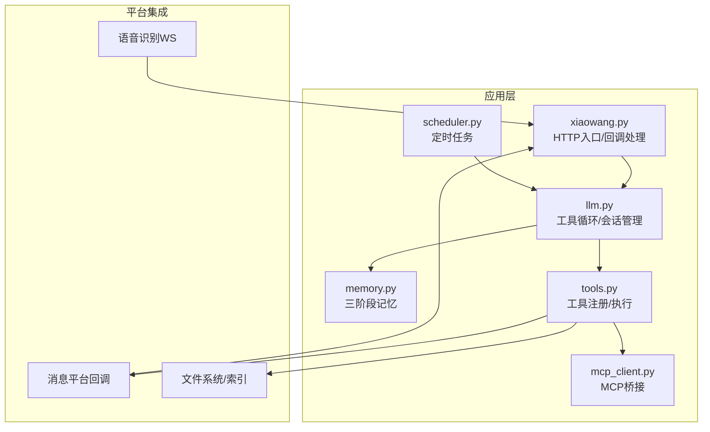
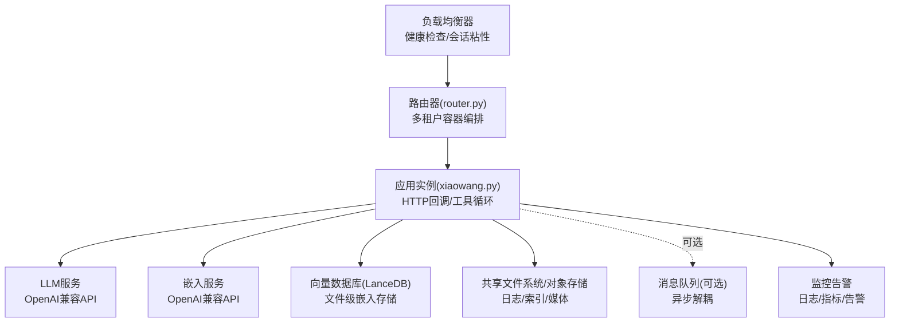
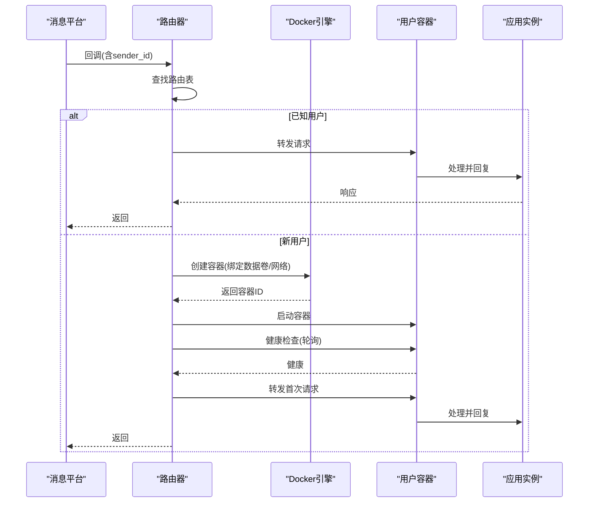
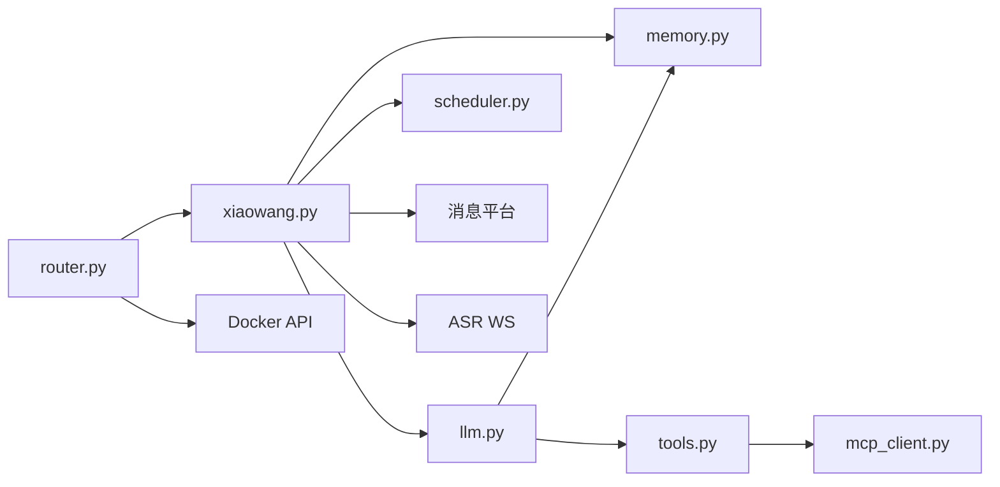

# 生产环境部署

<cite>
**本文档引用的文件**
- [README.md](file://README.md)
- [config.example.json](file://config.example.json)
- [xiaowang.py](file://xiaowang.py)
- [router.py](file://router.py)
- [llm.py](file://llm.py)
- [memory.py](file://memory.py)
- [tools.py](file://tools.py)
- [scheduler.py](file://scheduler.py)
- [mcp_client.py](file://mcp_client.py)
- [self_check_tool.py](file://self_check_tool.py)
</cite>

## 目录
1. [简介](#简介)
2. [项目结构](#项目结构)
3. [核心组件](#核心组件)
4. [架构总览](#架构总览)
5. [详细组件分析](#详细组件分析)
6. [依赖关系分析](#依赖关系分析)
7. [性能考虑](#性能考虑)
8. [故障排查指南](#故障排查指南)
9. [结论](#结论)
10. [附录](#附录)

## 简介
本指南面向724 Office生产环境部署与运维，基于仓库中提供的纯Python实现与多租户容器化路由能力，给出可落地的架构设计、高可用与灾备、安全加固、性能优化、备份恢复、运维自动化与监控告警等最佳实践。文档同时结合代码实现细节，帮助读者在不引入外部框架的前提下，构建稳定、可观测、可扩展的AI代理系统。

## 项目结构
项目采用“单机入口 + 多模块协作”的轻量架构：
- 入口模块负责HTTP回调接收、去抖合并、多媒体处理与ASR、消息分发到工具循环
- LLM模块负责会话管理、工具循环、多模态消息构建与系统提示词注入
- 内存模块负责三阶段记忆压缩、向量化检索与持久化
- 工具模块注册与执行，包含内置工具与插件/插件式MCP工具
- 调度器模块负责一次性与周期性任务的持久化与触发
- 路由器模块负责多租户容器自动编排与转发

图表来源
- [xiaowang.py:1-626](file://xiaowang.py#L1-L626)
- [llm.py:1-401](file://llm.py#L1-L401)
- [memory.py:1-361](file://memory.py#L1-L361)
- [tools.py:1-1153](file://tools.py#L1-L1153)
- [scheduler.py:1-219](file://scheduler.py#L1-L219)
- [mcp_client.py:1-334](file://mcp_client.py#L1-L334)

章节来源
- [README.md:1-162](file://README.md#L1-L162)
- [xiaowang.py:1-626](file://xiaowang.py#L1-L626)

## 核心组件
- HTTP入口与回调处理：接收消息平台回调，进行去抖合并、多媒体下载与持久化、ASR转写、分发至工具循环
- 工具循环与会话管理：构建系统提示词、注入跨会话上下文、执行工具链、保存会话历史
- 记忆系统：三阶段压缩/去重/检索，使用嵌入API与向量数据库
- 工具注册与执行：装饰器注册、参数校验、错误捕获与结果序列化
- 定时调度：一次性与周期性任务，持久化作业表，后台轮询触发
- MCP桥接：自实现JSON-RPC客户端，支持stdio与HTTP传输，热重载
- 多租户路由：基于Docker的按用户容器隔离与自动编排

章节来源
- [xiaowang.py:1-626](file://xiaowang.py#L1-L626)
- [llm.py:1-401](file://llm.py#L1-L401)
- [memory.py:1-361](file://memory.py#L1-L361)
- [tools.py:1-1153](file://tools.py#L1-L1153)
- [scheduler.py:1-219](file://scheduler.py#L1-L219)
- [mcp_client.py:1-334](file://mcp_client.py#L1-L334)
- [router.py:1-493](file://router.py#L1-L493)

## 架构总览
生产环境建议采用“边缘节点 + 负载均衡 + 多实例 + 多租户容器隔离”的架构，结合配置中心与持久化存储，确保高可用与灾备。

图表来源
- [router.py:1-493](file://router.py#L1-L493)
- [xiaowang.py:1-626](file://xiaowang.py#L1-L626)
- [memory.py:1-361](file://memory.py#L1-L361)

## 详细组件分析

### 负载均衡与高可用部署
- 前端接入：使用反向代理/负载均衡器（如Nginx/HAProxy/Tengine）监听80/443，开启健康检查与会话保持
- 应用实例：每个实例独立运行，避免共享状态；通过只读共享卷挂载配置与静态资源
- 多实例：至少部署2个实例以实现滚动升级与故障切换
- 会话保持：针对语音/视频等长连接场景，建议启用会话亲和或使用消息队列解耦
- 自动扩缩容：结合CPU/内存/请求延迟指标，配合容器编排平台实现弹性伸缩

章节来源
- [router.py:314-425](file://router.py#L314-L425)
- [xiaowang.py:559-592](file://xiaowang.py#L559-L592)

### 多租户容器隔离与自动编排
- 路由器负责按用户ID路由到对应容器，未知用户自动创建容器并等待健康检查
- 容器限制：设置内存上限、重启策略、健康检查端点
- 数据隔离：每个用户容器绑定独立数据卷，避免共享状态
- 容器数量上限：防止资源耗尽，超出阈值拒绝新用户

图表来源
- [router.py:141-249](file://router.py#L141-L249)
- [router.py:397-417](file://router.py#L397-L417)

章节来源
- [router.py:1-493](file://router.py#L1-L493)

### 安全加固
- 网络安全
  - 仅暴露必要端口，内部服务通过私网/容器网络互通
  - 使用TLS终止于LB，后端服务间通信可启用mTLS或内网白名单
  - 配置防火墙规则，限制来源IP与端口扫描
- 访问控制
  - 在入口处实现API密钥/签名验证（如需），结合速率限制
  - 对回调接口进行来源校验与签名认证
  - 限制容器权限，最小化特权容器
- 数据加密
  - 配置文件与密钥通过环境变量/密钥管理服务注入
  - 日志脱敏，敏感字段不落盘或加密存储
  - 传输层使用TLS，存储层启用加密（如需要）

章节来源
- [config.example.json:1-61](file://config.example.json#L1-L61)
- [router.py:39-41](file://router.py#L39-L41)

### 性能优化
- 资源配置
  - 为容器设置合理的内存上限与CPU配额，避免资源争抢
  - 将日志与索引目录挂载到高性能磁盘或SSD
- 缓存优化
  - 记忆模块对硬件/语音通道提供零延迟上下文缓存
  - 会话锁保证同一会话串行处理，避免并发冲突
- 数据库调优
  - 向量检索使用LanceDB文件级存储，减少服务依赖
  - 压缩阶段使用低开销模型，降低推理成本
  - 去重阈值与Top-K参数根据业务调整

章节来源
- [memory.py:148-151](file://memory.py#L148-L151)
- [llm.py:306-322](file://llm.py#L306-L322)
- [memory.py:88-118](file://memory.py#L88-L118)

### 数据备份与恢复
- 配置备份
  - 将config.json与.env文件纳入版本控制或配置中心
  - 关键参数（API密钥、令牌）通过密钥管理服务注入
- 数据导出
  - 会话历史与文件索引定期归档
  - 记忆库（LanceDB）作为文件级数据库，可直接备份整个目录
- 系统还原
  - 通过容器镜像与数据卷快照实现快速回滚
  - 路由表与作业表具备原子写入与重载能力，便于恢复

章节来源
- [xiaowang.py:84-132](file://xiaowang.py#L84-L132)
- [memory.py:40-86](file://memory.py#L40-L86)
- [router.py:45-63](file://router.py#L45-L63)
- [scheduler.py:122-128](file://scheduler.py#L122-L128)

### 运维自动化
- CI/CD流水线
  - 构建容器镜像，推送至镜像仓库
  - 执行静态检查与单元测试（如适用）
  - 发布到预生产环境进行冒烟测试
- 自动化部署
  - 使用编排平台（如Kubernetes/Docker Swarm）进行滚动更新
  - 配置健康检查与就绪探针，确保平滑切换
- 变更管理
  - 采用蓝绿/金丝雀发布策略
  - 回滚脚本与一键降级机制

章节来源
- [router.py:176-196](file://router.py#L176-L196)
- [router.py:221-238](file://router.py#L221-L238)

### 监控与告警
- 指标采集
  - 应用层：请求QPS/延迟/P95/P99、错误率、会话数、工具调用次数
  - 系统层：CPU/内存/磁盘/网络、容器健康状态、Docker API调用成功率
  - 记忆层：向量检索耗时、压缩吞吐、去重命中率
- 日志聚合
  - 统一收集容器日志，保留最近7天
  - 关键事件（失败、容量预警、健康检查失败）记录到专门索引
- 告警策略
  - 错误率阈值、延迟突增、容器不可用、磁盘空间不足、内存泄漏
  - 结合值班与自动修复（如重启容器、清理缓存）

章节来源
- [self_check_tool.py:1-57](file://self_check_tool.py#L1-L57)
- [scheduler.py:171-186](file://scheduler.py#L171-L186)
- [router.py:314-336](file://router.py#L314-L336)

### 应急响应预案
- 服务不可用
  - 快速回滚至上一版本镜像
  - 启动备用实例，临时提升副本数
- 数据异常
  - 检查LanceDB目录完整性，必要时从备份恢复
  - 清理损坏的会话文件与索引
- 安全事件
  - 撤销受影响的API密钥
  - 限制来源IP，封禁异常流量
  - 审计日志与取证

章节来源
- [router.py:211-218](file://router.py#L211-L218)
- [memory.py:359-361](file://memory.py#L359-L361)

## 依赖关系分析

图表来源
- [xiaowang.py:59-76](file://xiaowang.py#L59-L76)
- [llm.py:17-39](file://llm.py#L17-L39)
- [tools.py:80-83](file://tools.py#L80-L83)
- [mcp_client.py:272-286](file://mcp_client.py#L272-L286)
- [router.py:87-116](file://router.py#L87-L116)

章节来源
- [xiaowang.py:1-626](file://xiaowang.py#L1-L626)
- [llm.py:1-401](file://llm.py#L1-L401)
- [tools.py:1-1153](file://tools.py#L1-L1153)
- [mcp_client.py:1-334](file://mcp_client.py#L1-L334)
- [router.py:1-493](file://router.py#L1-L493)

## 性能考虑
- 并发与锁
  - 会话级锁避免并发冲突，适合高并发场景下的有序处理
  - 去抖缓冲减少重复请求，降低LLM与工具调用压力
- I/O与存储
  - 文件索引与媒体持久化采用原子写入，避免部分写入
  - 媒体下载优先企业格式，其次个人格式，最后直链下载
- 推理与检索
  - 记忆检索Top-K与相似度阈值影响延迟与准确性
  - 压缩阶段使用低成本模型，减少推理成本

章节来源
- [llm.py:306-322](file://llm.py#L306-L322)
- [xiaowang.py:315-378](file://xiaowang.py#L315-L378)
- [memory.py:88-118](file://memory.py#L88-L118)

## 故障排查指南
- 常见问题定位
  - 回调未到达：检查LB健康检查、应用端口、回调地址
  - 用户无法接收消息：检查消息平台凭据、路由表、容器健康
  - ASR失败：检查音频转码、WS鉴权参数、网络连通性
  - 记忆检索异常：检查嵌入API连通性、阈值与Top-K配置
- 自检与诊断
  - 使用自检工具汇总今日会话统计、错误日志、服务状态
  - 调度器每日触发自检报告，便于自动化运维

章节来源
- [router.py:254-281](file://router.py#L254-L281)
- [xiaowang.py:140-285](file://xiaowang.py#L140-L285)
- [memory.py:158-188](file://memory.py#L158-L188)
- [self_check_tool.py:1-57](file://self_check_tool.py#L1-L57)

## 结论
724 Office以极简实现提供了完整的AI代理能力，生产部署的关键在于：合理的多实例与多租户容器化架构、完善的监控与告警体系、严格的配置与密钥管理、以及可追溯的备份与恢复流程。通过上述最佳实践，可在不引入复杂框架的前提下，构建稳定、可观测、可扩展的生产系统。

## 附录
- 快速启动参考
  - 准备工作：创建工作目录、准备配置文件、安装依赖
  - 启动应用：运行入口脚本，确认端口与日志
  - 集成消息平台：配置回调地址与凭据
- 配置要点
  - 模型提供商、嵌入API、消息平台、ASR、MCP服务器等均在配置文件中集中管理

章节来源
- [README.md:101-140](file://README.md#L101-L140)
- [config.example.json:1-61](file://config.example.json#L1-L61)