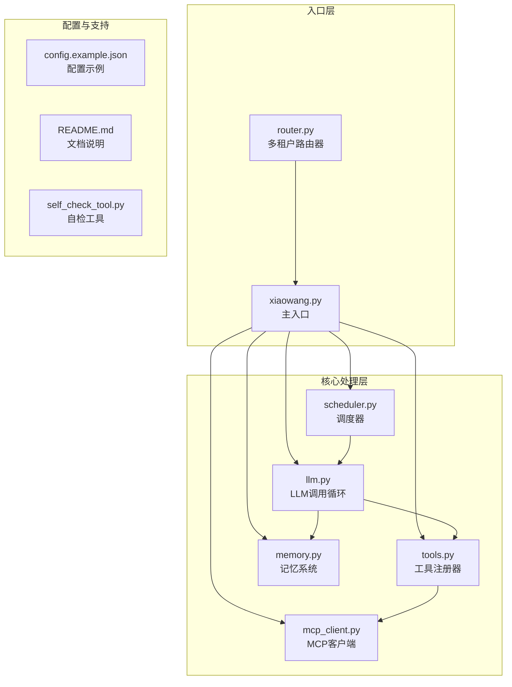
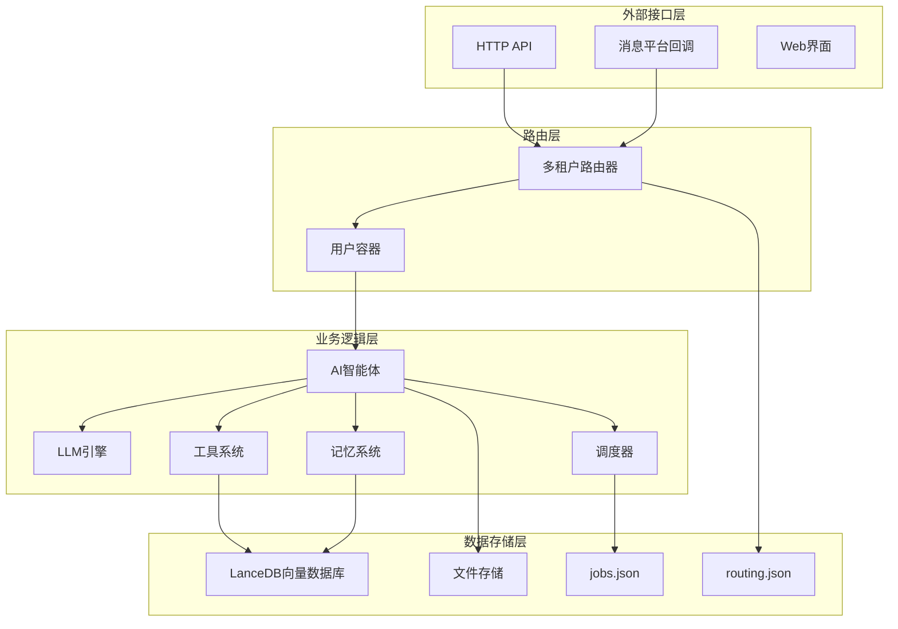
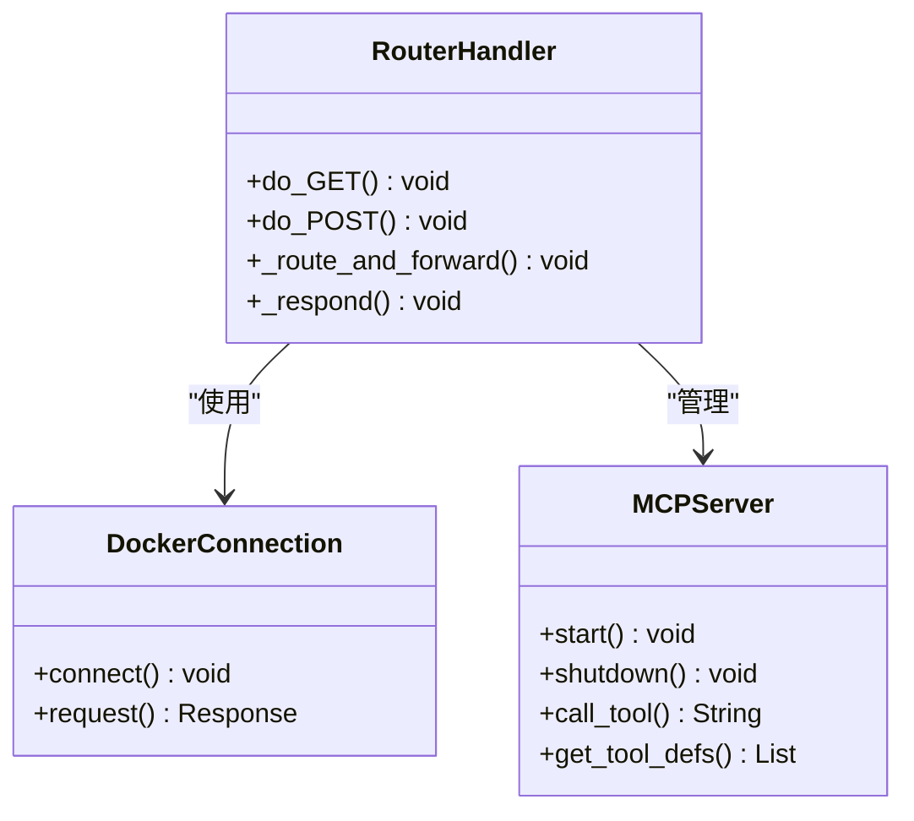
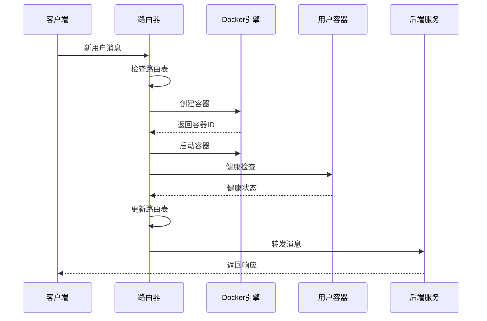
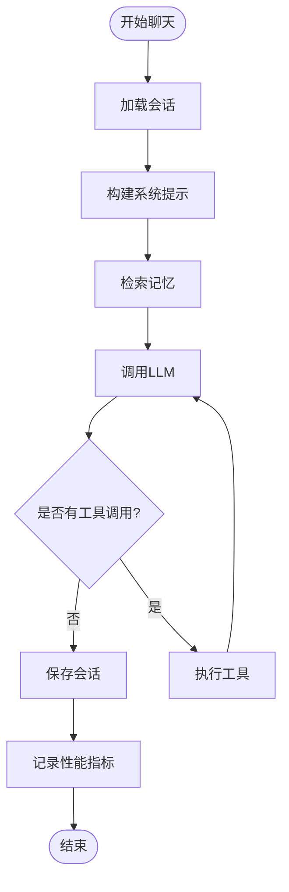
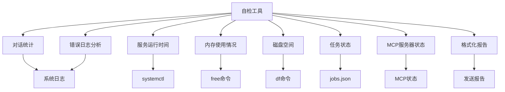
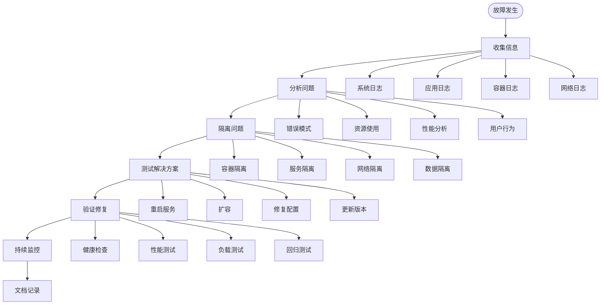
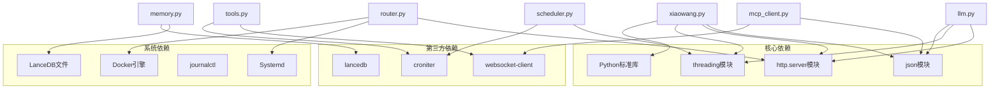

# 监控与日志

<cite>
**本文档引用的文件**
- [README.md](file://README.md)
- [config.example.json](file://config.example.json)
- [router.py](file://router.py)
- [xiaowang.py](file://xiaowang.py)
- [llm.py](file://llm.py)
- [tools.py](file://tools.py)
- [memory.py](file://memory.py)
- [scheduler.py](file://scheduler.py)
- [mcp_client.py](file://mcp_client.py)
- [self_check_tool.py](file://self_check_tool.py)
</cite>

## 目录
1. [简介](#简介)
2. [项目结构](#项目结构)
3. [核心组件](#核心组件)
4. [架构概览](#架构概览)
5. [详细组件分析](#详细组件分析)
6. [监控指标体系](#监控指标体系)
7. [日志配置与管理](#日志配置与管理)
8. [性能监控工具](#性能监控工具)
9. [告警机制配置](#告警机制配置)
10. [故障诊断方法](#故障诊断方法)
11. [依赖关系分析](#依赖关系分析)
12. [结论](#结论)

## 简介

724 Office是一个生产级的AI智能体系统，采用纯Python实现，零框架依赖。该系统提供了完整的监控与日志管理能力，包括容器健康状态监控、路由表统计、并发连接数监控、响应时间分析等功能。系统通过多层架构设计实现了自监控、自修复和自演进的能力。

## 项目结构

系统采用模块化设计，主要包含以下核心模块：



**图表来源**
- [xiaowang.py:1-626](file://xiaowang.py#L1-L626)
- [router.py:1-493](file://router.py#L1-L493)
- [llm.py:1-401](file://llm.py#L1-L401)

**章节来源**
- [README.md:1-162](file://README.md#L1-L162)
- [config.example.json:1-61](file://config.example.json#L1-L61)

## 核心组件

### 主入口组件 (xiaowang.py)
主入口负责HTTP服务器启动、回调处理、消息去抖动和媒体文件处理。系统在启动时初始化所有子模块，包括LLM、工具、内存、调度器等。

### 路由器组件 (router.py)
实现多租户Docker路由功能，支持按用户ID自动分配容器，实现负载均衡和故障隔离。每个用户拥有独立的容器实例，确保服务的高可用性。

### LLM处理组件 (llm.py)
核心的LLM调用循环，支持工具使用循环、会话管理和性能监控。内置详细的性能指标记录，包括预处理时间、LLM调用时间、工具执行时间和总耗时。

### 工具系统 (tools.py)
提供26个内置工具，包括文件操作、媒体处理、搜索功能、视频处理等。支持动态插件加载和MCP服务器集成。

### 内存系统 (memory.py)
三阶段记忆系统：压缩、去重、检索。使用LanceDB进行向量存储，支持语义检索和长期记忆管理。

### 调度器 (scheduler.py)
基于cron表达式的任务调度系统，支持一次性任务和周期性任务，任务持久化存储。

**章节来源**
- [xiaowang.py:59-76](file://xiaowang.py#L59-L76)
- [router.py:1-493](file://router.py#L1-L493)
- [llm.py:306-401](file://llm.py#L306-L401)
- [tools.py:1-1153](file://tools.py#L1-L1153)
- [memory.py:1-361](file://memory.py#L1-L361)
- [scheduler.py:1-219](file://scheduler.py#L1-L219)

## 架构概览

系统采用分层架构设计，实现了高度的模块化和可扩展性：



**图表来源**
- [router.py:23-32](file://router.py#L23-L32)
- [xiaowang.py:35-47](file://xiaowang.py#L35-L47)
- [memory.py:40-86](file://memory.py#L40-L86)

## 详细组件分析

### 多租户路由器分析

路由器组件实现了复杂的容器管理和路由功能：



**图表来源**
- [router.py:310-425](file://router.py#L310-L425)
- [mcp_client.py:27-242](file://mcp_client.py#L27-L242)

#### 容器生命周期管理
路由器支持容器的自动创建、启动、健康检查和清理：



**图表来源**
- [router.py:141-249](file://router.py#L141-L249)

**章节来源**
- [router.py:1-493](file://router.py#L1-L493)

### LLM性能监控分析

LLM组件内置了详细的性能监控机制：



**图表来源**
- [llm.py:324-401](file://llm.py#L324-L401)

#### 性能指标记录
系统记录的关键性能指标包括：
- 预处理时间 (prep)
- LLM调用时间 (llm)
- 工具执行次数 (tools)
- 总处理时间 (total)
- 最大迭代次数 (max_iter)

**章节来源**
- [llm.py:354-399](file://llm.py#L354-L399)

### 自检工具分析

自检工具实现了系统的自我监控和报告生成功能：



**图表来源**
- [tools.py:852-1020](file://tools.py#L852-L1020)

**章节来源**
- [self_check_tool.py:1-57](file://self_check_tool.py#L1-L57)
- [tools.py:852-1020](file://tools.py#L852-L1020)

## 监控指标体系

### 容器健康状态监控

系统通过多种方式监控容器健康状态：

#### 路由表统计指标
- **路由条目数量**: 当前路由表中的用户数量
- **自动容器数量**: 运行中的用户容器数量
- **最大容器限制**: 系统允许的最大容器数量
- **容器内存限制**: 单个容器的内存限制

#### 容器健康检查
- **HTTP健康检查**: 通过访问容器内部的健康端点
- **超时控制**: 容器启动超时时间配置
- **重试机制**: 健康检查失败时的重试策略

#### 容器资源监控
- **CPU使用率**: 容器的CPU使用情况
- **内存使用**: 容器的内存占用
- **网络I/O**: 容器的网络流量
- **磁盘空间**: 容器的磁盘使用情况

**章节来源**
- [router.py:314-333](file://router.py#L314-L333)
- [router.py:190-196](file://router.py#L190-L196)

### 路由表统计

路由表管理系统提供了完整的路由信息统计：

#### 路由表状态
- **路由条目**: 当前已建立的用户路由数量
- **容器映射**: 用户ID到容器地址的映射关系
- **负载分布**: 各容器的负载情况
- **连接状态**: 容器的连接健康状况

#### 路由表维护
- **自动重建**: 系统启动时自动扫描现有容器
- **动态更新**: 新用户加入时的路由添加
- **清理机制**: 容器停止后的路由清理

**章节来源**
- [router.py:433-465](file://router.py#L433-L465)

### 并发连接数监控

系统支持多线程并发处理：

#### 线程模型
- **主线程**: HTTP服务器监听
- **工作线程**: 消息处理和业务逻辑
- **后台线程**: 调度器和定时任务
- **守护线程**: 异步操作和清理任务

#### 并发控制
- **会话锁**: 同一用户的请求串行化
- **全局锁**: 路由表和配置的线程安全
- **容器锁**: 容器创建的互斥访问

**章节来源**
- [llm.py:306-322](file://llm.py#L306-L322)
- [router.py:390-396](file://router.py#L390-L396)

### 响应时间分析

系统提供了多层次的响应时间监控：

#### 性能指标分类
- **预处理时间**: 会话加载、记忆检索、系统提示构建
- **LLM调用时间**: 大语言模型的推理时间
- **工具执行时间**: 外部工具的调用和处理时间
- **总响应时间**: 从接收消息到返回结果的完整时间

#### 时间测量机制
- **高精度计时**: 使用monotonic时钟避免系统时间调整影响
- **分段统计**: 不同处理阶段的独立时间统计
- **平均值计算**: 多次调用的平均响应时间
- **百分位数**: 95th、99th等高延迟统计

**章节来源**
- [llm.py:354-399](file://llm.py#L354-L399)

## 日志配置与管理

### 日志级别设置

系统采用标准的Python logging模块，支持多种日志级别：

#### 日志级别层次
- **DEBUG**: 详细的技术信息，用于开发调试
- **INFO**: 一般性信息，系统正常运行状态
- **WARNING**: 警告信息，可能的问题但不影响功能
- **ERROR**: 错误信息，功能异常但系统仍可运行
- **CRITICAL**: 严重错误，可能导致系统停机

#### 日志格式配置
- **时间戳**: 标准化的UTC时间格式
- **日志级别**: 显示当前日志级别
- **模块名称**: 记录日志的模块或类名
- **消息内容**: 实际的日志信息

**章节来源**
- [router.py:20](file://router.py#L20)
- [llm.py:19](file://llm.py#L19)

### 日志轮转

系统支持基于文件大小的日志轮转：

#### 轮转策略
- **文件大小限制**: 单个日志文件的最大大小
- **备份文件数量**: 保留的历史日志文件数量
- **自动轮转**: 达到大小限制时自动创建新文件
- **压缩处理**: 旧日志文件的压缩存储

#### 日志文件组织
- **按日期分组**: 日志按创建日期进行目录组织
- **按模块分类**: 不同模块的日志分离存储
- **按级别过滤**: 不同级别的日志分别记录

**章节来源**
- [xiaowang.py:94-131](file://xiaowang.py#L94-L131)

### 日志聚合方案

系统支持多种日志聚合方式：

#### 结构化日志
- **JSON格式**: 标准化的JSON格式日志
- **字段标准化**: 统一的日志字段定义
- **时间戳精度**: 毫秒级的时间戳记录
- **上下文信息**: 包含会话ID、用户ID等上下文

#### 实时监控
- **流式输出**: 实时显示系统运行状态
- **性能指标**: 实时性能数据的可视化
- **错误追踪**: 实时错误发生的追踪
- **告警通知**: 异常情况的即时通知

**章节来源**
- [tools.py:63-74](file://tools.py#L63-L74)

## 性能监控工具

### 系统资源监控

系统提供了全面的系统资源监控能力：

#### CPU监控
- **利用率**: 整体CPU使用率和各核心使用情况
- **负载均衡**: 多核环境下的负载分布
- **进程监控**: 关键进程的CPU使用情况
- **峰值检测**: CPU使用的峰值和持续时间

#### 内存监控
- **物理内存**: 系统总内存和可用内存
- **虚拟内存**: 分页文件使用情况
- **进程内存**: 各进程的内存占用
- **内存泄漏检测**: 长期运行的内存增长趋势

#### 磁盘监控
- **空间使用**: 文件系统空间使用情况
- **I/O性能**: 磁盘读写速度和延迟
- **inode使用**: 文件系统inode使用情况
- **分区监控**: 各分区的独立监控

#### 网络监控
- **带宽使用**: 网络接口的吞吐量
- **连接状态**: TCP连接的数量和状态
- **延迟测试**: 网络延迟和丢包率
- **流量分析**: 应用程序的网络流量模式

**章节来源**
- [tools.py:871-920](file://tools.py#L871-L920)

### 应用性能监控

应用层面的性能监控包括：

#### LLM性能监控
- **调用成功率**: LLM API调用的成功率
- **响应时间**: 平均响应时间和95分位延迟
- **错误率**: API调用的错误率和错误类型分布
- **成本分析**: LLM调用的成本统计

#### 工具执行监控
- **执行时间**: 各种工具的执行时间统计
- **成功率**: 工具调用的成功率
- **资源消耗**: 工具执行过程中的资源使用
- **并发限制**: 工具的并发执行限制

#### 内存系统监控
- **向量存储**: LanceDB数据库的性能指标
- **检索效率**: 向量检索的准确性和速度
- **缓存命中**: 记忆缓存的命中率
- **压缩效果**: 对话压缩的质量和效率

**章节来源**
- [memory.py:88-119](file://memory.py#L88-L119)
- [llm.py:354-399](file://llm.py#L354-L399)

### 业务指标监控

业务层面的监控指标：

#### 用户行为监控
- **活跃用户**: 活跃用户的统计和趋势
- **消息量**: 用户消息的数量和类型分布
- **工具使用**: 各种工具的使用频率和效果
- **会话质量**: 用户会话的满意度和完成度

#### 业务流程监控
- **处理吞吐量**: 系统的处理能力和吞吐量
- **响应质量**: 服务响应的质量和准确性
- **SLA达成率**: 服务等级协议的达成情况
- **业务指标**: 关键业务指标的实时监控

**章节来源**
- [tools.py:852-870](file://tools.py#L852-L870)

## 告警机制配置

### 健康检查告警

系统实现了多层次的健康检查告警：

#### 容器健康告警
- **启动失败**: 容器创建或启动失败的告警
- **健康检查失败**: 容器健康检查连续失败的告警
- **资源超限**: 容器内存、CPU使用超限的告警
- **网络异常**: 容器间通信异常的告警

#### 服务可用性告警
- **API不可用**: 主要API接口不可用的告警
- **依赖服务故障**: 关键依赖服务故障的告警
- **负载过高**: 系统负载超过阈值的告警
- **容量不足**: 系统容量不足的告警

**章节来源**
- [router.py:235-237](file://router.py#L235-L237)
- [router.py:408](file://router.py#L408)

### 容量告警

容量监控和告警机制：

#### 容器容量告警
- **容器数量上限**: 达到最大容器数量的告警
- **容器内存超限**: 单个容器内存使用超限的告警
- **容器存储超限**: 容器磁盘空间不足的告警
- **容器网络超限**: 容器网络带宽超限的告警

#### 系统容量告警
- **系统内存不足**: 系统整体内存不足的告警
- **系统磁盘空间不足**: 系统磁盘空间不足的告警
- **系统CPU过载**: 系统CPU使用率过高的告警
- **系统网络拥塞**: 系统网络带宽不足的告警

**章节来源**
- [router.py:149-154](file://router.py#L149-L154)

### 异常告警设置

异常情况的告警配置：

#### 错误日志告警
- **错误数量阈值**: 连续时间段内错误数量超过阈值
- **错误类型告警**: 特定类型错误的告警
- **错误趋势告警**: 错误数量快速增长的告警
- **错误定位**: 错误发生的具体位置和原因

#### 性能异常告警
- **响应时间异常**: 响应时间超过阈值的告警
- **吞吐量下降**: 系统处理能力显著下降的告警
- **资源使用异常**: 资源使用出现异常模式的告警
- **依赖服务异常**: 外部依赖服务性能异常的告警

**章节来源**
- [tools.py:856-870](file://tools.py#L856-L870)

## 故障诊断方法

### 常用监控命令

系统提供了丰富的诊断命令：

#### 系统状态检查
```bash
# 查看系统服务状态
systemctl status agent

# 查看系统负载
uptime
top -b -n 1 | head -20

# 查看磁盘使用
df -h
du -sh /var/log/*

# 查看内存使用
free -h
cat /proc/meminfo
```

#### 容器状态检查
```bash
# 查看Docker容器状态
docker ps -a
docker stats --no-stream

# 查看容器日志
docker logs agent-u12345678
docker inspect agent-u12345678

# 查看容器资源使用
docker stats agent-u12345678 --no-stream
```

#### 应用性能检查
```bash
# 查看应用进程
ps aux | grep python
netstat -tulpn | grep :8080

# 查看网络连接
ss -s
ss -tuln

# 查看文件描述符
lsof -p $(pgrep python) | wc -l
```

**章节来源**
- [tools.py:871-920](file://tools.py#L871-L920)

### 日志分析方法

系统日志的分析和处理：

#### 日志收集
- **系统日志**: 使用journalctl收集系统日志
- **应用日志**: 收集Python应用程序的日志
- **容器日志**: 收集Docker容器的日志
- **网络日志**: 收集网络相关的日志

#### 日志分析
- **错误模式识别**: 识别常见的错误模式和异常
- **性能瓶颈分析**: 分析性能瓶颈和优化机会
- **资源使用分析**: 分析资源使用模式和趋势
- **用户行为分析**: 分析用户行为模式和偏好

**章节来源**
- [tools.py:1006-1018](file://tools.py#L1006-L1018)

### 故障排查流程

系统化的故障排查方法：



**章节来源**
- [self_check_tool.py:44-57](file://self_check_tool.py#L44-L57)

## 依赖关系分析

系统模块间的依赖关系：



**图表来源**
- [xiaowang.py:15-30](file://xiaowang.py#L15-L30)
- [router.py:9-18](file://router.py#L9-L18)
- [llm.py:8-15](file://llm.py#L8-L15)
- [tools.py:19-26](file://tools.py#L19-L26)
- [memory.py:12-19](file://memory.py#L12-L19)
- [scheduler.py:10-15](file://scheduler.py#L10-L15)
- [mcp_client.py:14-20](file://mcp_client.py#L14-L20)

**章节来源**
- [README.md:14-16](file://README.md#L14-L16)

## 结论

724 Office监控与日志管理系统提供了完整的生产级监控解决方案。系统通过多层架构设计实现了：

### 主要优势
- **全面监控**: 覆盖容器健康、系统资源、应用性能和业务指标
- **自动化告警**: 基于阈值和模式的智能告警机制
- **自检能力**: 系统具备自我诊断和修复的能力
- **可扩展性**: 模块化设计支持功能扩展和定制

### 技术特点
- **零框架依赖**: 使用纯Python实现，部署简单
- **自监控循环**: 通过工具调用实现系统的自我监控
- **多租户隔离**: 容器级别的用户隔离和资源控制
- **高性能设计**: 多线程并发和异步处理机制

### 应用价值
- **生产稳定性**: 提供可靠的监控和告警能力
- **运维效率**: 减少人工干预，提高运维效率
- **故障快速恢复**: 快速定位和解决问题
- **成本控制**: 通过监控优化资源配置

该系统为AI智能体的生产部署提供了坚实的基础设施支撑，是构建可靠AI服务的重要基础。