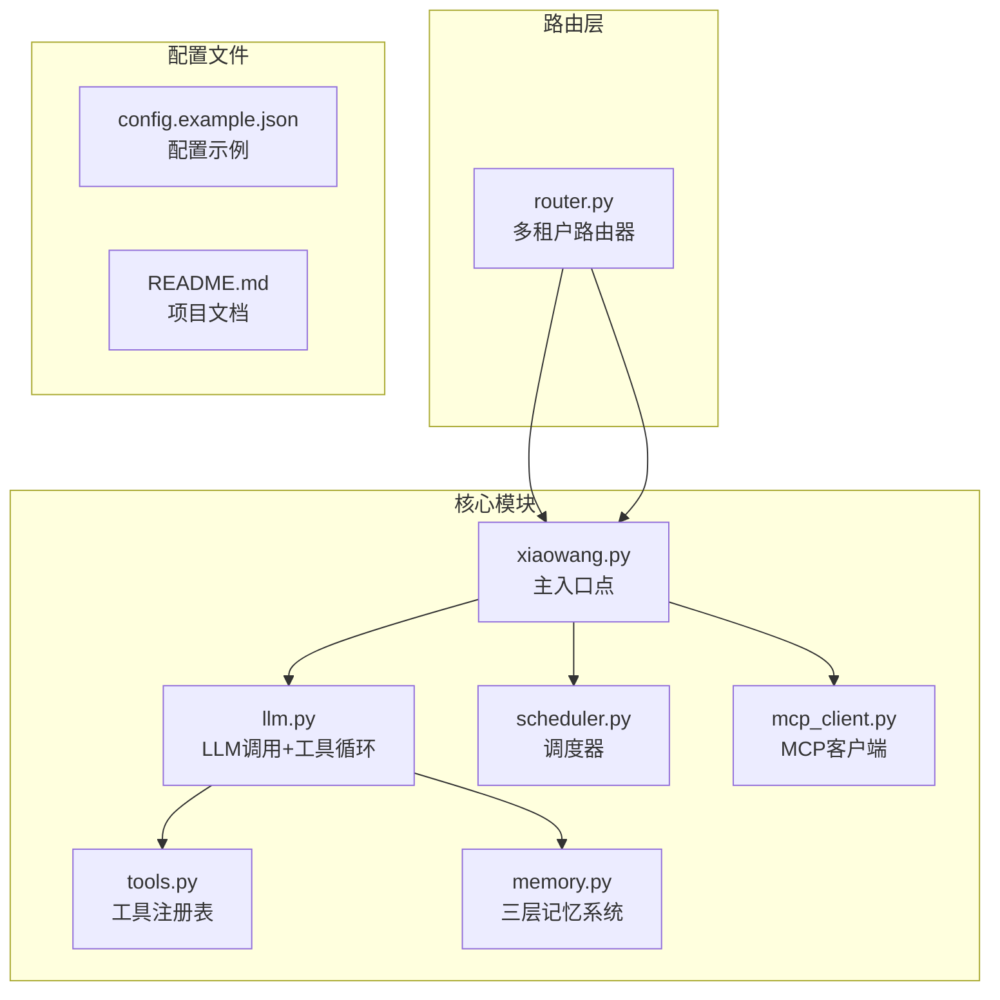
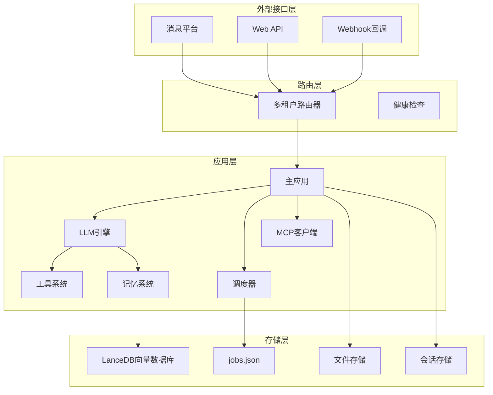
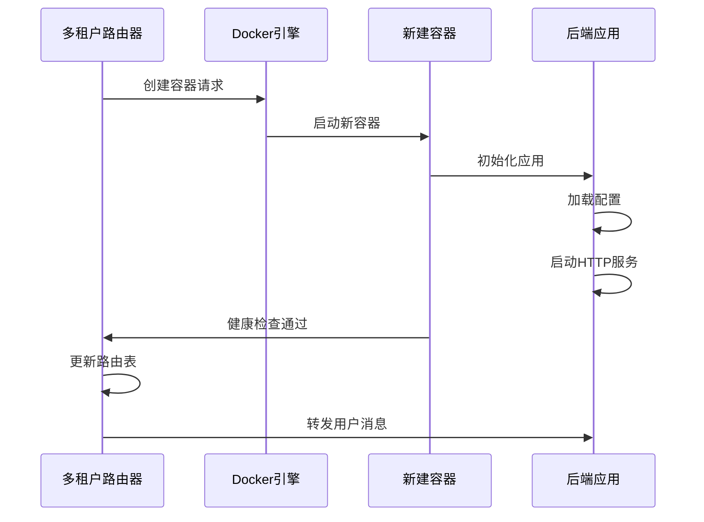
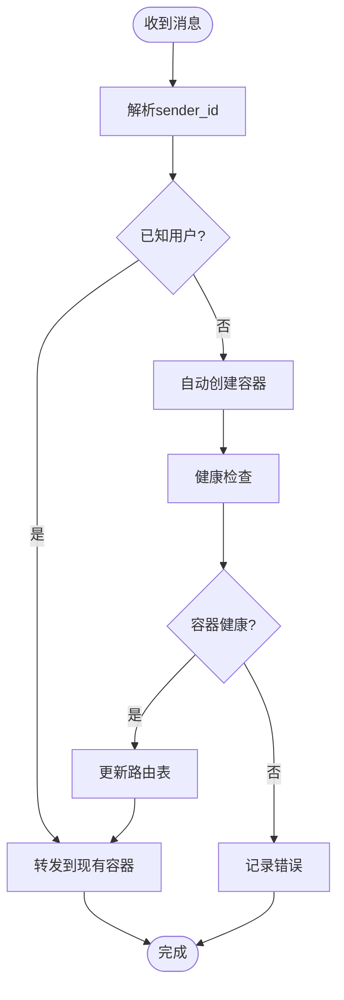
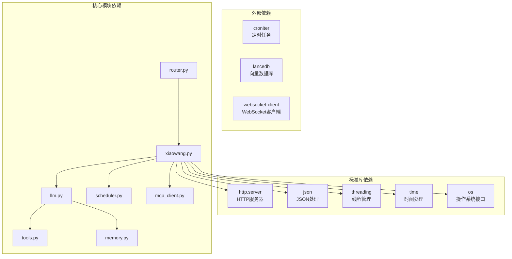

# 部署与运维

<cite>
**本文档引用的文件**
- [README.md](file://README.md)
- [config.example.json](file://config.example.json)
- [router.py](file://router.py)
- [xiaowang.py](file://xiaowang.py)
- [llm.py](file://llm.py)
- [tools.py](file://tools.py)
- [memory.py](file://memory.py)
- [scheduler.py](file://scheduler.py)
- [self_check_tool.py](file://self_check_tool.py)
- [mcp_client.py](file://mcp_client.py)
</cite>

## 目录
1. [简介](#简介)
2. [项目结构](#项目结构)
3. [核心组件](#核心组件)
4. [架构总览](#架构总览)
5. [详细组件分析](#详细组件分析)
6. [依赖关系分析](#依赖关系分析)
7. [性能考虑](#性能考虑)
8. [故障排除指南](#故障排除指南)
9. [结论](#结论)
10. [附录](#附录)

## 简介

724 Office 是一个基于纯Python构建的生产级AI智能体系统，具有零框架依赖的特点。该系统包含26个内置工具，支持多租户路由、Docker容器化部署、自我修复机制等高级特性。系统采用三层记忆体系，具备工具使用循环、MCP插件系统、运行时工具创建等核心功能。

## 项目结构

项目采用模块化设计，每个核心功能都封装在独立的Python文件中：



**图表来源**
- [README.md:1-162](file://README.md#L1-L162)
- [router.py:1-493](file://router.py#L1-L493)
- [xiaowang.py:1-626](file://xiaowang.py#L1-L626)

**章节来源**
- [README.md:1-162](file://README.md#L1-L162)
- [config.example.json:1-61](file://config.example.json#L1-L61)

## 核心组件

### 主入口点 (xiaowang.py)
主入口点负责：
- HTTP服务器启动和回调处理
- 消息去抖动处理
- 多媒体文件下载和持久化
- ASR语音转文字
- 与各子模块的初始化协调

### LLM核心 (llm.py)
实现核心的工具使用循环：
- 用户消息处理和会话管理
- LLM API调用和响应解析
- 工具执行和结果处理
- 多模态消息构建（文本、图片）
- 性能监控和错误处理

### 工具系统 (tools.py)
提供26个内置工具：
- 文件操作工具（读写、编辑、列表）
- 媒体发送工具（图片、文件、视频、链接）
- 视频处理工具（裁剪、添加背景音乐、生成视频）
- 搜索工具（多引擎搜索）
- 记忆搜索工具
- 调度工具
- 自诊断工具

### 记忆系统 (memory.py)
三层记忆体系：
1. **压缩阶段**：对话内容结构化提取
2. **去重阶段**：余弦相似度去重
3. **检索阶段**：向量搜索和语义检索

### 调度器 (scheduler.py)
支持一次性任务和周期性任务：
- 延迟执行任务
- Cron表达式定时任务
- 任务持久化存储
- 故障通知机制

### 多租户路由器 (router.py)
Docker容器化多租户解决方案：
- 按用户ID路由到对应容器
- 自动创建新用户容器
- 健康检查和重启机制
- 路由表管理和持久化

**章节来源**
- [xiaowang.py:1-626](file://xiaowang.py#L1-L626)
- [llm.py:1-401](file://llm.py#L1-L401)
- [tools.py:1-800](file://tools.py#L1-L800)
- [memory.py:1-361](file://memory.py#L1-L361)
- [scheduler.py:1-219](file://scheduler.py#L1-L219)
- [router.py:1-493](file://router.py#L1-L493)

## 架构总览

系统采用分层架构设计，支持单机部署和Docker容器化部署两种模式：



**图表来源**
- [README.md:23-66](file://README.md#L23-L66)
- [router.py:23-493](file://router.py#L23-L493)
- [xiaowang.py:35-76](file://xiaowang.py#L35-L76)

## 详细组件分析

### 单机部署流程

#### 环境准备
1. **系统要求**：Python 3.x，至少8GB内存（推荐16GB以上）
2. **依赖安装**：
   ```
   pip install croniter lancedb websocket-client
   # 可选：pilk（用于微信音频解码）
   ```

#### 配置设置
1. 复制配置文件：`cp config.example.json config.json`
2. 编辑关键配置项：
   - LLM提供商配置（API密钥、端点）
   - 消息平台凭证
   - 内存系统设置
   - ASR语音识别配置
   - MCP服务器连接

#### 启动方法
```bash
# 创建工作空间目录
mkdir -p workspace/memory workspace/files

# 创建个性文件（可选）
# workspace/SOUL.md  -- 代理人格和行为规则
# workspace/AGENT.md -- 运营程序和故障排除指南  
# workspace/USER.md  -- 用户偏好和上下文

# 启动主应用
python3 xiaowang.py
```

#### 监控端点
- 健康检查：`GET /health`
- 路由表查看：`GET /routes`
- 路由表重载：`GET /reload`

**章节来源**
- [README.md:101-140](file://README.md#L101-L140)
- [config.example.json:1-61](file://config.example.json#L1-L61)
- [xiaowang.py:559-592](file://xiaowang.py#L559-L592)

### Docker容器化部署

#### 容器镜像构建
基于Docker的多租户部署架构：



**图表来源**
- [router.py:141-250](file://router.py#L141-L250)

#### 容器编排参数
- **环境变量**：
  - `ROUTING_FILE`: 路由表文件路径
  - `DEFAULT_BACKEND`: 默认后端地址
  - `HOST_DATA_DIR`: 主机数据卷挂载目录
  - `APP_IMAGE`: 应用镜像名称
  - `DOCKER_NETWORK`: Docker网络名称
  - `ENV_FILE_PATH`: 环境变量文件路径
  - `MAX_CONTAINERS`: 最大容器数量
  - `CONTAINER_MEMORY`: 单容器内存限制

- **健康检查**：容器启动后通过HTTP GET `/` 进行健康检查

#### 多租户集群部署
1. **容器隔离**：每个用户拥有独立容器实例
2. **资源限制**：通过Docker内存限制防止资源争用
3. **网络隔离**：使用专用Docker网络进行通信
4. **数据持久化**：通过绑定挂载实现数据持久化

**章节来源**
- [router.py:23-32](file://router.py#L23-L32)
- [router.py:141-250](file://router.py#L141-L250)

### 多租户路由器工作原理

#### 用户路由管理
路由器的核心功能是根据用户ID进行智能路由：



**图表来源**
- [router.py:397-418](file://router.py#L397-L418)

#### 容器自动编排
1. **容器命名**：`agent-u{用户ID后8位}`
2. **数据卷挂载**：`/data/agent/containers/agent-u{ID}:/data`
3. **网络配置**：加入指定Docker网络
4. **重启策略**：unless-stopped

#### 健康检查机制
- **检查方式**：HTTP GET请求到容器内部8080端口
- **超时设置**：3秒请求超时，5秒间隔重试
- **重试次数**：最多3次
- **超时处理**：超时后仍添加路由，但标记为可能未完全就绪

**章节来源**
- [router.py:118-250](file://router.py#L118-L250)
- [router.py:308-425](file://router.py#L308-L425)

### 监控和日志管理最佳实践

#### 系统状态监控
1. **健康检查端点**：
   ```bash
   curl http://localhost:8080/health
   ```
   返回包含状态、路由数量、容器数量等信息

2. **路由表管理**：
   - 查看路由表：`GET /routes`
   - 重载路由表：`GET /reload`

3. **性能指标收集**：
   - LLM调用耗时统计
   - 工具执行计数
   - 会话处理时间

#### 日志管理
系统采用结构化日志格式：
- 时间戳、日志级别、消息内容
- 模块级别的日志分类
- 错误堆栈跟踪

#### 故障诊断方法
1. **容器状态检查**：`docker ps -a`
2. **日志查看**：`docker logs {container_id}`
3. **路由表验证**：检查`/data/router/routing.json`文件
4. **健康检查验证**：确认容器HTTP服务可达

**章节来源**
- [router.py:314-336](file://router.py#L314-L336)
- [router.py:433-465](file://router.py#L433-L465)

### 自修复机制

#### 每日自检
系统通过调度器实现每日自检：
1. **触发条件**：每天22:00执行
2. **检查内容**：
   - 当日对话统计数据
   - 错误日志摘要
   - 服务运行时长
   - 内存和磁盘使用情况
   - 调度任务状态

3. **报告机制**：通过消息工具发送给所有者

#### 会话健康诊断
- **会话完整性检查**：验证会话文件完整性
- **工具执行监控**：跟踪工具调用成功率
- **内存使用监控**：检测异常内存增长

#### 错误日志分析
- **错误分类统计**：按类型统计错误发生频率
- **根因分析**：结合时间窗口分析错误模式
- **自动修复建议**：基于历史数据提供修复建议

**章节来源**
- [self_check_tool.py:1-57](file://self_check_tool.py#L1-L57)
- [scheduler.py:188-219](file://scheduler.py#L188-L219)

## 依赖关系分析

系统采用松耦合设计，主要依赖关系如下：



**图表来源**
- [README.md:3-5](file://README.md#L3-L5)
- [router.py:9-18](file://router.py#L9-L18)
- [xiaowang.py:15-29](file://xiaowang.py#L15-L29)

**章节来源**
- [README.md:3-5](file://README.md#L3-L5)
- [router.py:9-18](file://router.py#L9-L18)
- [xiaowang.py:15-29](file://xiaowang.py#L15-L29)

## 性能考虑

### 内存优化
1. **会话管理**：每会话保留最近40条消息，超出部分自动压缩
2. **工具执行锁**：同一会话串行处理，避免并发冲突
3. **缓存机制**：硬件/语音通道使用零延迟缓存

### 并发处理
1. **线程模型**：每个HTTP请求独立线程处理
2. **工具执行**：工具调用异步执行，避免阻塞
3. **容器隔离**：多租户容器独立运行，互不干扰

### I/O优化
1. **文件存储**：多媒体文件按月目录组织，便于清理
2. **数据库优化**：LanceDB向量索引，支持快速相似度搜索
3. **网络优化**：Docker网络通信，减少网络开销

## 故障排除指南

### 常见问题及解决方案

#### 启动失败
1. **依赖缺失**：确保安装所有必需的Python包
2. **端口占用**：检查8080端口是否被占用
3. **权限问题**：确保对工作目录有读写权限

#### Docker部署问题
1. **Docker守护进程**：确认Docker服务正常运行
2. **权限不足**：确保运行用户有访问`/var/run/docker.sock`的权限
3. **网络配置**：检查Docker网络是否存在且可用

#### 多租户路由问题
1. **容器创建失败**：检查镜像是否存在，资源是否充足
2. **健康检查失败**：验证容器内HTTP服务是否正常
3. **路由表不同步**：手动执行`GET /reload`重新加载

#### 记忆系统问题
1. **向量数据库初始化失败**：检查嵌入API配置
2. **内存压缩失败**：验证LLM提供商配置
3. **检索性能下降**：重建向量索引或清理重复数据

**章节来源**
- [router.py:118-127](file://router.py#L118-L127)
- [router.py:221-238](file://router.py#L221-L238)
- [memory.py:40-86](file://memory.py#L40-L86)

## 结论

724 Office提供了一个功能完整、架构清晰的AI智能体系统。其核心优势包括：

1. **零框架依赖**：所有代码均可调试，无隐藏抽象层
2. **多租户支持**：Docker容器化实现真正的多用户隔离
3. **自我修复能力**：完善的监控、诊断和自动修复机制
4. **高性能设计**：优化的内存管理、并发处理和I/O性能
5. **易于扩展**：插件系统和MCP协议支持第三方扩展

该系统适合部署在生产环境中，特别是需要多用户隔离和高可靠性的应用场景。

## 附录

### 生产环境部署建议

#### 负载均衡
- 使用反向代理（如Nginx）进行流量分发
- 配置SSL证书和HTTPS支持
- 实现健康检查和自动故障转移

#### 数据备份
- 定期备份工作空间数据
- 备份路由表和配置文件
- 备份LanceDB向量数据库

#### 安全加固
- 限制Docker权限，使用非root用户
- 配置防火墙规则，仅开放必要端口
- 使用环境变量管理敏感信息
- 实施访问控制和身份验证

#### 性能优化策略
- 根据实际负载调整容器数量
- 优化LLM提供商选择和API调用
- 监控系统资源使用情况
- 定期清理临时文件和日志