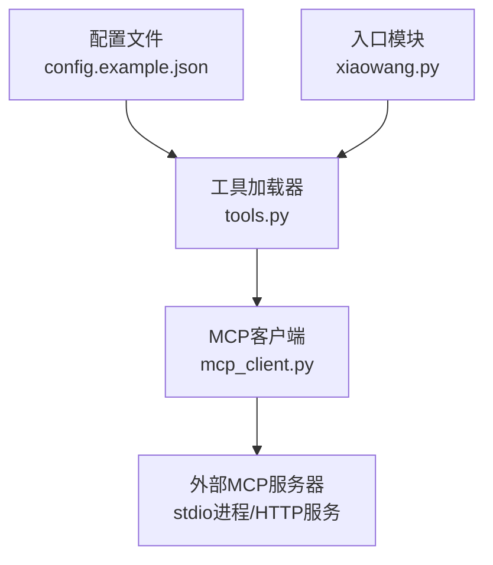
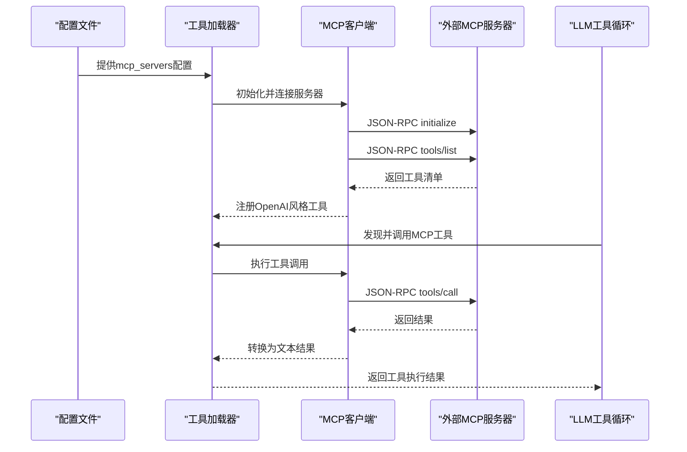
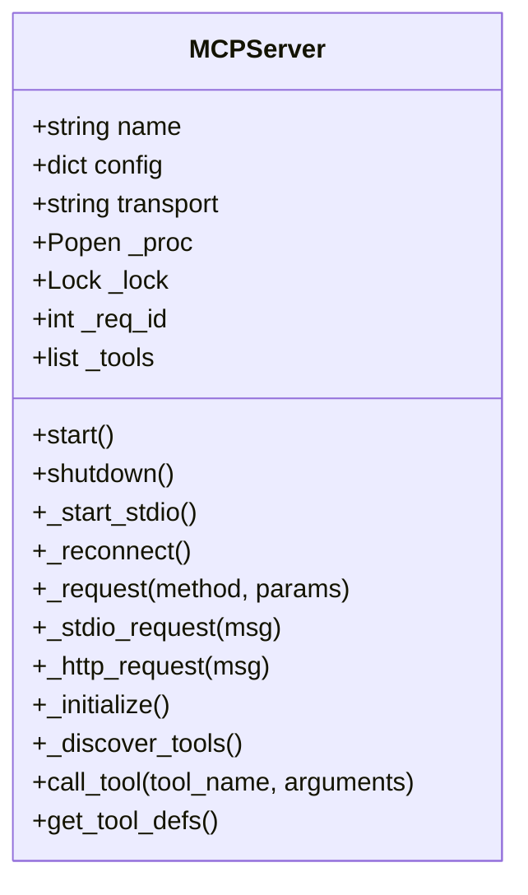
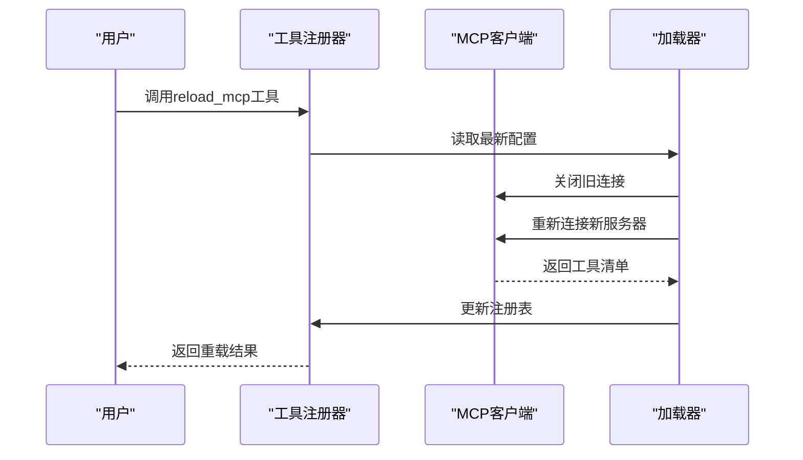
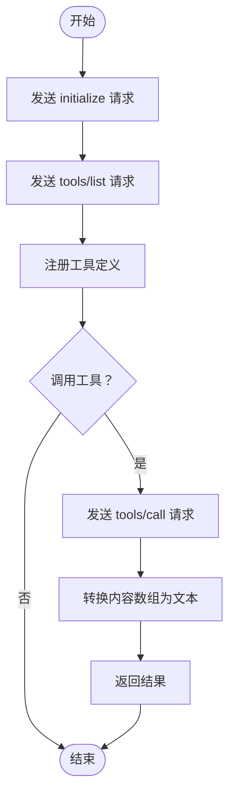
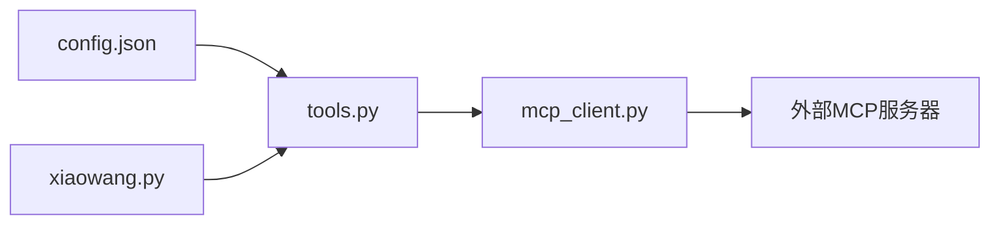

# MCP服务器配置

<cite>
**本文档引用的文件**
- [README.md](file://README.md)
- [config.example.json](file://config.example.json)
- [mcp_client.py](file://mcp_client.py)
- [tools.py](file://tools.py)
- [xiaowang.py](file://xiaowang.py)
</cite>

## 目录
1. [简介](#简介)
2. [项目结构](#项目结构)
3. [核心组件](#核心组件)
4. [架构总览](#架构总览)
5. [详细组件分析](#详细组件分析)
6. [依赖关系分析](#依赖关系分析)
7. [性能考虑](#性能考虑)
8. [故障排查指南](#故障排查指南)
9. [结论](#结论)
10. [附录](#附录)

## 简介
本文件面向724 Office MCP服务器配置，系统性阐述mcp_servers配置部分的完整结构与实现细节，重点覆盖：
- 传输方式（transport）：stdio与HTTP两种模式的配置与差异
- 命令与参数（command、args）：如何启动外部MCP服务器进程
- 环境变量（env）：如何注入运行时环境
- MCP协议对接：JSON-RPC初始化、工具发现与调用流程
- 实际集成示例与配置模板
- 调试方法与常见问题定位

## 项目结构
围绕MCP配置与集成的关键文件与职责如下：
- config.example.json：包含mcp_servers配置示例，展示标准输入/输出（stdio）模式的典型用法
- mcp_client.py：MCP客户端实现，负责连接外部MCP服务器、注册工具、执行工具调用
- tools.py：工具注册与加载，包含MCP工具的动态注册与热重载
- xiaowang.py：入口模块，负责初始化各子系统，包括MCP工具的加载

图表来源
- [config.example.json:52-59](file://config.example.json#L52-L59)
- [tools.py:506-512](file://tools.py#L506-L512)
- [mcp_client.py:272-286](file://mcp_client.py#L272-L286)
- [xiaowang.py:68-69](file://xiaowang.py#L68-L69)

章节来源
- [README.md:13](file://README.md#L13)
- [config.example.json:52-59](file://config.example.json#L52-L59)
- [mcp_client.py:272-286](file://mcp_client.py#L272-L286)
- [tools.py:506-512](file://tools.py#L506-L512)
- [xiaowang.py:68-69](file://xiaowang.py#L68-L69)

## 核心组件
- mcp_servers配置结构
  - transport：传输方式，支持"stdio"（默认）与"HTTP"
  - command：启动外部MCP服务器的可执行命令
  - args：命令行参数列表
  - env：环境变量字典，与系统环境合并后传递给子进程
- MCP客户端（MCPServer）
  - 生命周期管理：启动/关闭、断线重连
  - JSON-RPC通信：stdio或HTTP两种传输
  - MCP协议对接：initialize、tools/list、tools/call
  - 工具定义转换：将MCP工具schema映射为OpenAI函数调用格式
- 工具注册与热重载
  - 启动时自动加载mcp_servers中的工具
  - 提供reload_mcp工具进行热重载，无需重启服务

章节来源
- [config.example.json:52-59](file://config.example.json#L52-L59)
- [mcp_client.py:27-262](file://mcp_client.py#L27-L262)
- [tools.py:1138-1152](file://tools.py#L1138-L1152)
- [tools.py:1096-1131](file://tools.py#L1096-L1131)

## 架构总览
MCP集成在系统中的位置与交互如下：
- 配置层：config.json中定义mcp_servers
- 加载层：tools.py在启动时调用mcp_client.init加载MCP服务器
- 客户端层：mcp_client.py通过JSON-RPC与外部MCP服务器通信
- 工具层：MCP工具被注册为OpenAI风格的函数，可在LLM对话中被调用
- 入口层：xiaowang.py负责初始化并启动HTTP服务

图表来源
- [config.example.json:52-59](file://config.example.json#L52-L59)
- [tools.py:506-512](file://tools.py#L506-L512)
- [mcp_client.py:191-242](file://mcp_client.py#L191-L242)

## 详细组件分析

### MCP客户端类（MCPServer）
MCPServer负责单个MCP服务器的生命周期与JSON-RPC通信，核心能力包括：
- 传输选择：stdio或HTTP
- 进程管理：stdio模式下启动子进程，HTTP模式下仅验证可达性
- JSON-RPC请求封装：统一方法名与参数，自动区分传输类型
- MCP协议对接：initialize握手、tools/list工具发现、tools/call工具调用
- 结果处理：将MCP内容数组转换为字符串返回

图表来源
- [mcp_client.py:27-262](file://mcp_client.py#L27-L262)

章节来源
- [mcp_client.py:27-262](file://mcp_client.py#L27-L262)

### 工具注册与热重载
- 启动时注册：tools.py在init_extra阶段调用_load_mcp_servers，将MCP工具注册为OpenAI风格函数
- 热重载：提供reload_mcp工具，重新读取配置、断开旧连接、建立新连接，并更新工具注册表

图表来源
- [tools.py:1096-1131](file://tools.py#L1096-L1131)
- [mcp_client.py:312-322](file://mcp_client.py#L312-L322)

章节来源
- [tools.py:1096-1131](file://tools.py#L1096-L1131)
- [mcp_client.py:312-322](file://mcp_client.py#L312-L322)

### 配置结构详解
- mcp_servers：服务器集合，键名为服务器名称，值为配置对象
- 单个服务器配置对象包含：
  - transport：传输方式，"stdio"或"HTTP"
  - command：启动命令（stdio模式必填）
  - args：命令行参数列表（stdio模式可选）
  - env：环境变量字典（stdio模式可选）

章节来源
- [config.example.json:52-59](file://config.example.json#L52-L59)

### 传输方式对比与使用场景
- stdio（标准输入/输出）
  - 适用场景：本地或容器内运行的MCP服务器进程
  - 特点：通过子进程stdin/stdout直接通信；支持断线重连；适合快速集成与开发调试
  - 配置要点：command与args构成可执行命令；env用于注入环境变量
- HTTP（超文本传输）
  - 适用场景：远程或独立部署的MCP服务器
  - 特点：通过HTTP POST JSON-RPC；无需启动子进程；适合生产环境与跨网络部署
  - 配置要点：需确保服务器可达且支持JSON-RPC；无需command与args字段

章节来源
- [mcp_client.py:41-48](file://mcp_client.py#L41-L48)
- [mcp_client.py:167-187](file://mcp_client.py#L167-L187)

### MCP协议对接流程
- initialize：客户端向服务器发送初始化请求，包含协议版本与客户端信息
- tools/list：客户端请求工具清单，服务器返回工具定义数组
- tools/call：客户端调用具体工具，服务器返回内容数组，客户端将其拼接为字符串

图表来源
- [mcp_client.py:191-242](file://mcp_client.py#L191-L242)

章节来源
- [mcp_client.py:191-242](file://mcp_client.py#L191-L242)

## 依赖关系分析
- 配置到加载：config.json中的mcp_servers配置驱动tools.py的加载逻辑
- 加载到客户端：tools.py调用mcp_client.init完成MCP服务器连接
- 客户端到服务器：mcp_client.py通过JSON-RPC与外部MCP服务器交互
- 入口到加载：xiaowang.py在启动时初始化各模块，触发MCP工具加载

图表来源
- [config.example.json:52-59](file://config.example.json#L52-L59)
- [tools.py:506-512](file://tools.py#L506-L512)
- [mcp_client.py:272-286](file://mcp_client.py#L272-L286)
- [xiaowang.py:68-69](file://xiaowang.py#L68-L69)

章节来源
- [config.example.json:52-59](file://config.example.json#L52-L59)
- [tools.py:506-512](file://tools.py#L506-L512)
- [mcp_client.py:272-286](file://mcp_client.py#L272-L286)
- [xiaowang.py:68-69](file://xiaowang.py#L68-L69)

## 性能考虑
- 连接复用：MCP客户端维护每个服务器的连接实例，避免频繁重建
- 并发安全：stdio传输使用锁保护stdin/stdout读写，防止竞态
- 超时控制：JSON-RPC请求设置超时时间，避免阻塞
- 断线重连：stdio模式下支持一次自动重连，提升稳定性
- 工具注册缓存：工具定义转换后缓存在内存中，减少重复计算

章节来源
- [mcp_client.py:35-36](file://mcp_client.py#L35-L36)
- [mcp_client.py:113-150](file://mcp_client.py#L113-L150)
- [mcp_client.py:167-187](file://mcp_client.py#L167-L187)
- [mcp_client.py:74-90](file://mcp_client.py#L74-L90)

## 故障排查指南
- 无法连接MCP服务器
  - 检查transport配置是否正确（stdio vs HTTP）
  - 对于stdio：确认command是否存在、args是否正确、env是否包含必要变量
  - 对于HTTP：确认URL可达、服务器支持JSON-RPC
- 工具未出现在LLM工具列表
  - 使用reload_mcp工具进行热重载，检查日志输出
  - 确认服务器已成功initialize与tools/list
- 调用失败或超时
  - 查看客户端日志中的错误信息（包含服务器返回的错误码与消息）
  - 对stdio模式，检查子进程是否正常运行
- 环境变量问题
  - 确认env字典中的键值对正确，且与服务器期望一致
  - 注意stdio模式下env会与系统环境合并

章节来源
- [mcp_client.py:113-165](file://mcp_client.py#L113-L165)
- [mcp_client.py:167-187](file://mcp_client.py#L167-L187)
- [tools.py:1096-1131](file://tools.py#L1096-L1131)

## 结论
724 Office通过mcp_client.py实现了对MCP协议的轻量级支持，结合tools.py的动态注册机制，提供了灵活的MCP服务器集成方案。配置层采用简洁的mcp_servers结构，既支持本地stdio进程，也兼容HTTP远程服务。配合reload_mcp工具，可在不重启服务的情况下完成热重载，满足生产环境的持续演进需求。

## 附录

### 配置模板与示例
- stdio模式示例（来自配置文件）
  - transport: "stdio"
  - command: "npx"
  - args: ["-y", "@example/mcp-server"]
  - env: {}
- HTTP模式示例（概念性说明）
  - transport: "HTTP"
  - url: "http://localhost:3000/jsonrpc"
  - 其他字段（如command、args、env）在HTTP模式下不适用

章节来源
- [config.example.json:52-59](file://config.example.json#L52-L59)

### MCP协议配置要求
- 协议版本：initialize请求中指定协议版本
- 工具清单：tools/list返回工具数组
- 工具调用：tools/call携带工具名与参数
- 内容格式：工具返回内容数组，客户端将其拼接为字符串

章节来源
- [mcp_client.py:191-242](file://mcp_client.py#L191-L242)

### 调试方法
- 日志级别：使用INFO级别日志查看连接状态与工具数量
- 热重载：通过reload_mcp工具验证配置变更是否生效
- 进程检查：stdio模式下可通过系统命令检查进程状态
- 错误码：关注客户端日志中的错误码与消息，便于定位问题

章节来源
- [mcp_client.py:272-286](file://mcp_client.py#L272-L286)
- [tools.py:1096-1131](file://tools.py#L1096-L1131)