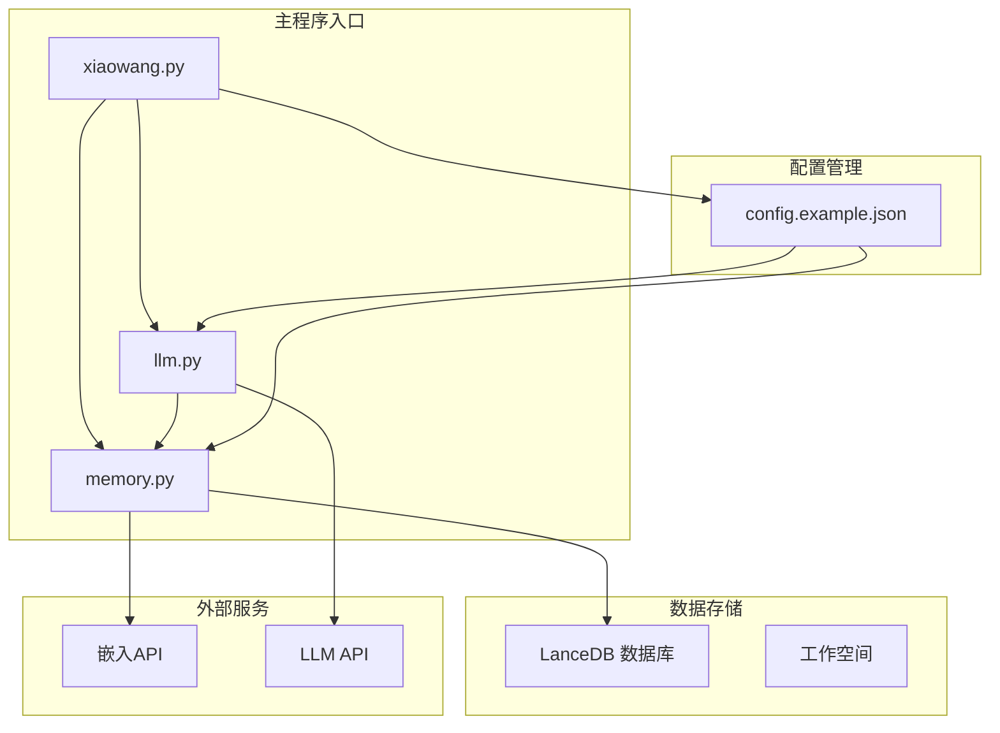
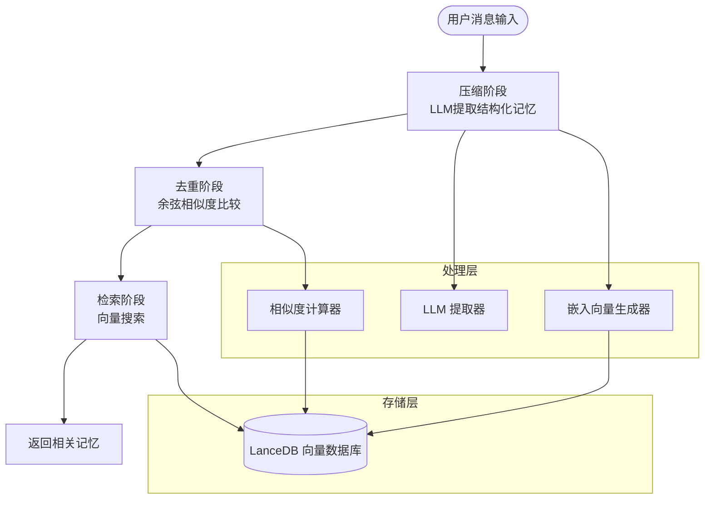
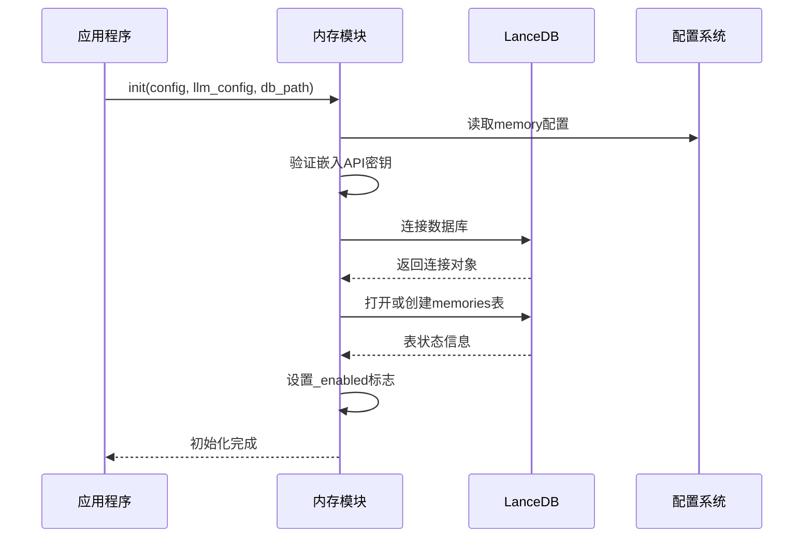
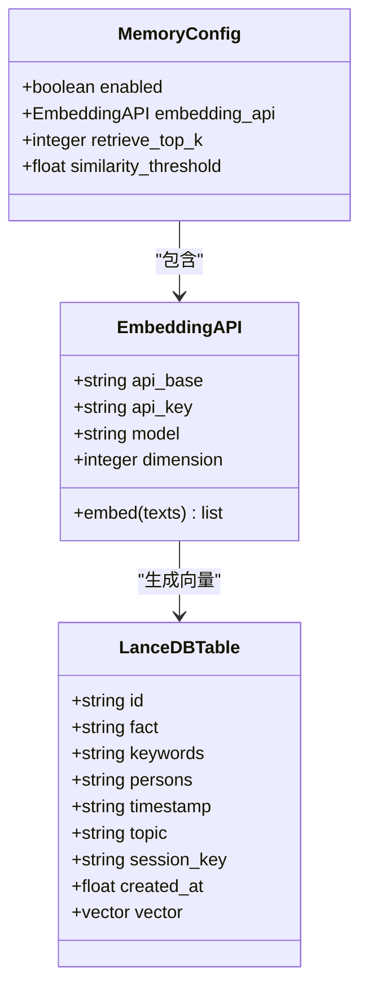
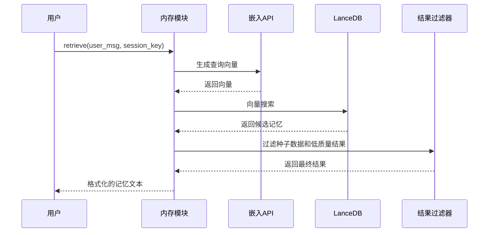
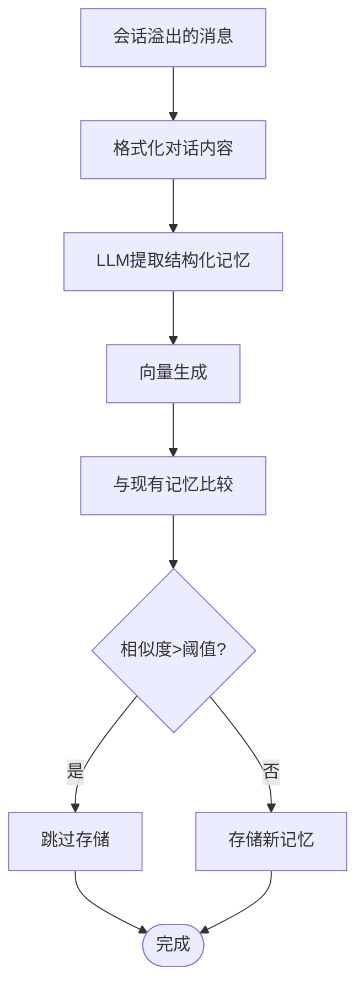
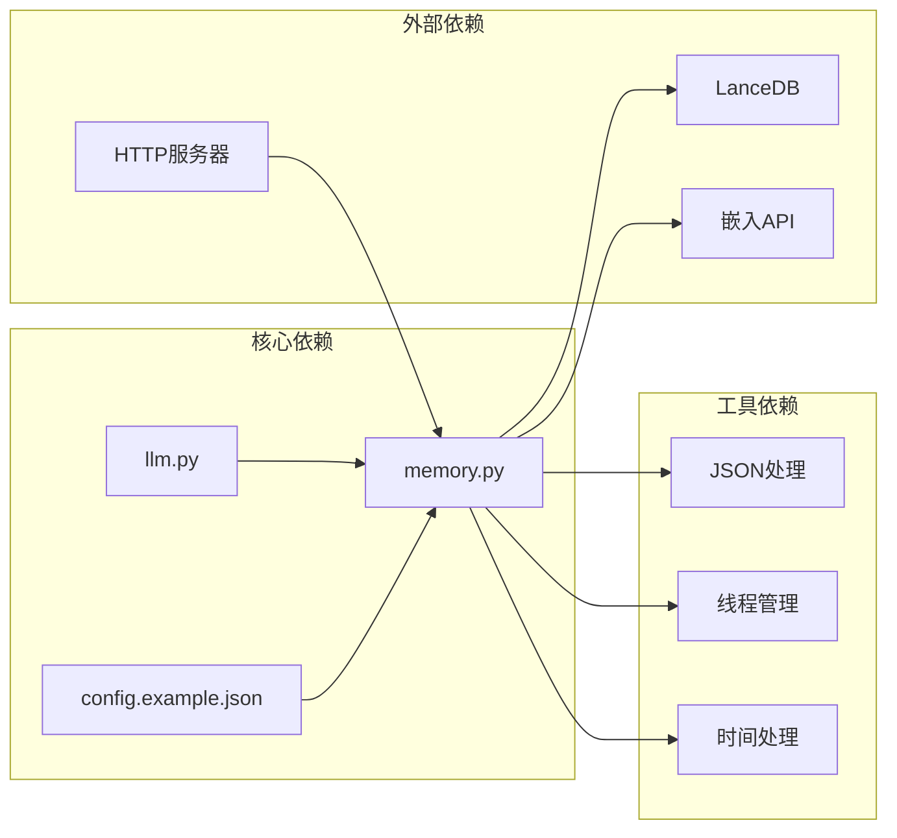

# 内存系统配置

<cite>
**本文档引用的文件**
- [config.example.json](file://config.example.json)
- [memory.py](file://memory.py)
- [README.md](file://README.md)
- [llm.py](file://llm.py)
- [xiaowang.py](file://xiaowang.py)
</cite>

## 目录
1. [简介](#简介)
2. [项目结构](#项目结构)
3. [核心组件](#核心组件)
4. [架构概览](#架构概览)
5. [详细组件分析](#详细组件分析)
6. [依赖关系分析](#依赖关系分析)
7. [性能考虑](#性能考虑)
8. [故障排除指南](#故障排除指南)
9. [结论](#结论)

## 简介

724 Office 内存系统是一个三层记忆架构，包含短期会话记忆、压缩长期记忆和向量检索记忆三个层次。该系统通过嵌入式向量数据库 LanceDB 实现智能记忆检索，支持基于 OpenAI 兼容 API 的嵌入模型。

内存系统的核心功能包括：
- **三层记忆架构**：会话历史、LLM 压缩的记忆、向量数据库中的长期记忆
- **智能检索**：基于语义相似度的向量搜索
- **去重机制**：使用余弦相似度避免重复记忆
- **零延迟缓存**：为硬件/语音通道提供预计算的记忆摘要

## 项目结构

该项目采用模块化设计，内存系统作为独立模块与其他核心组件协同工作：



**图表来源**
- [xiaowang.py:71-75](file://xiaowang.py#L71-L75)
- [memory.py:40-86](file://memory.py#L40-L86)
- [config.example.json:28-38](file://config.example.json#L28-L38)

**章节来源**
- [README.md:23-66](file://README.md#L23-L66)
- [xiaowang.py:35-75](file://xiaowang.py#L35-L75)

## 核心组件

### 配置结构详解

内存系统的配置位于 `config.example.json` 文件中，包含以下关键部分：

#### 基础配置
- **enabled**: 内存系统开关，默认启用
- **embedding_api**: 嵌入模型配置
- **retrieve_top_k**: 检索返回的最相似记忆数量
- **similarity_threshold**: 记忆去重的相似度阈值

#### 嵌入API配置
嵌入API配置支持多种 OpenAI 兼容的服务提供商：

| 参数 | 类型 | 默认值 | 描述 |
|------|------|--------|------|
| api_base | string | "https://api.openai.com/v1" | API 基础URL |
| api_key | string | "YOUR_EMBEDDING_API_KEY_HERE" | API 密钥 |
| model | string | "text-embedding-3-small" | 嵌入模型名称 |
| dimension | integer | 1024 | 向量维度 |

#### 检索参数
- **retrieve_top_k**: 默认值 5，控制每次检索返回的记忆数量
- **similarity_threshold**: 默认值 0.92，用于去重判断的相似度阈值

**章节来源**
- [config.example.json:28-38](file://config.example.json#L28-L38)
- [memory.py:44-52](file://memory.py#L44-L52)

## 架构概览

内存系统采用三阶段处理流程：



**图表来源**
- [memory.py:1-10](file://memory.py#L1-L10)
- [memory.py:294-360](file://memory.py#L294-L360)

## 详细组件分析

### 初始化流程

内存系统在启动时进行初始化，建立与 LanceDB 的连接并验证配置：



**图表来源**
- [memory.py:40-86](file://memory.py#L40-L86)
- [xiaowang.py:71-75](file://xiaowang.py#L71-L75)

### 嵌入向量生成

嵌入系统支持多种 OpenAI 兼容的嵌入模型：



**图表来源**
- [memory.py:158-187](file://memory.py#L158-L187)
- [config.example.json:30-34](file://config.example.json#L30-L34)

**章节来源**
- [memory.py:158-187](file://memory.py#L158-L187)
- [config.example.json:30-34](file://config.example.json#L30-L34)

### 检索流程

检索过程包含查询向量化、向量搜索和结果过滤：



**图表来源**
- [memory.py:88-118](file://memory.py#L88-L118)
- [memory.py:158-187](file://memory.py#L158-L187)

**章节来源**
- [memory.py:88-118](file://memory.py#L88-L118)

### 压缩和去重流程

压缩阶段执行三步处理：LLM 结构化提取、向量生成和去重：



**图表来源**
- [memory.py:294-360](file://memory.py#L294-L360)
- [memory.py:320-337](file://memory.py#L320-L337)

**章节来源**
- [memory.py:294-360](file://memory.py#L294-L360)

## 依赖关系分析

内存系统与其他组件的依赖关系：



**图表来源**
- [memory.py:12-19](file://memory.py#L12-L19)
- [llm.py:17-20](file://llm.py#L17-L20)
- [xiaowang.py:71-75](file://xiaowang.py#L71-L75)

**章节来源**
- [memory.py:12-19](file://memory.py#L12-L19)
- [llm.py:17-20](file://llm.py#L17-L20)

## 性能考虑

### 配置优化建议

#### 嵌入模型选择
- **高精度模型**：适合需要精确语义理解的场景，但成本较高
- **中等精度模型**：平衡性能和成本的理想选择
- **低精度模型**：适合资源受限环境

#### 检索参数调优
- **retrieve_top_k**: 
  - 小型对话：3-5
  - 中型对话：5-8  
  - 复杂任务：8-12
- **similarity_threshold**:
  - 严格去重：0.95-0.98
  - 宽松去重：0.85-0.92
  - 灵活匹配：0.75-0.85

#### 性能监控指标
- **检索延迟**：单次检索应在 100-500ms 内完成
- **存储吞吐量**：每秒可处理 10-50 条新记忆
- **内存使用**：单用户记忆占用约 1-10MB

### 最佳实践

#### 不同场景配置建议

**客服机器人场景**
```json
{
  "memory": {
    "enabled": true,
    "embedding_api": {
      "api_base": "https://api.openai.com/v1",
      "api_key": "YOUR_API_KEY",
      "model": "text-embedding-3-small",
      "dimension": 1024
    },
    "retrieve_top_k": 5,
    "similarity_threshold": 0.92
  }
}
```

**知识问答场景**
```json
{
  "memory": {
    "enabled": true,
    "embedding_api": {
      "api_base": "https://api.openai.com/v1", 
      "api_key": "YOUR_API_KEY",
      "model": "text-embedding-3-large",
      "dimension": 1536
    },
    "retrieve_top_k": 8,
    "similarity_threshold": 0.90
  }
}
```

**实时对话场景**
```json
{
  "memory": {
    "enabled": true,
    "embedding_api": {
      "api_base": "https://api.deepseek.com/v1",
      "api_key": "YOUR_API_KEY", 
      "model": "text-embedding-3-small",
      "dimension": 1024
    },
    "retrieve_top_k": 3,
    "similarity_threshold": 0.95
  }
}
```

**章节来源**
- [config.example.json:28-38](file://config.example.json#L28-L38)
- [memory.py:320-337](file://memory.py#L320-L337)

## 故障排除指南

### 常见问题及解决方案

#### 内存系统未启用
**症状**：日志显示 "disabled in config"
**原因**：memory.enabled 设置为 false
**解决**：将 enabled 设置为 true

#### 嵌入API密钥缺失
**症状**：日志显示 "no embedding API key, disabled"
**原因**：embedding_api.api_key 为空
**解决**：配置有效的 API 密钥

#### LanceDB 连接失败
**症状**：初始化失败，数据库连接异常
**原因**：数据库路径不可写或权限不足
**解决**：检查数据库目录权限和磁盘空间

#### 检索结果为空
**症状**：retrieve 返回空字符串
**原因**：嵌入向量生成失败或数据库无记录
**解决**：检查嵌入API连通性和数据库状态

**章节来源**
- [memory.py:45-52](file://memory.py#L45-L52)
- [memory.py:88-91](file://memory.py#L88-L91)

## 结论

724 Office 内存系统提供了完整的三层记忆架构，通过灵活的配置选项支持不同的应用场景。关键配置要点包括：

1. **基础配置**：确保 memory.enabled 为 true，正确配置嵌入API密钥
2. **嵌入模型**：根据场景选择合适的模型和维度
3. **检索参数**：平衡检索质量和性能的 retrieve_top_k 和 similarity_threshold
4. **性能监控**：定期检查检索延迟和存储吞吐量指标

通过合理的配置和持续的性能调优，内存系统能够在保证响应速度的同时提供高质量的记忆检索体验。