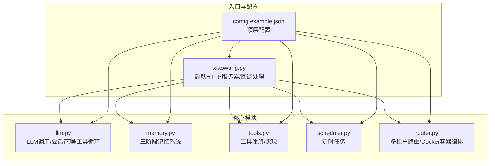
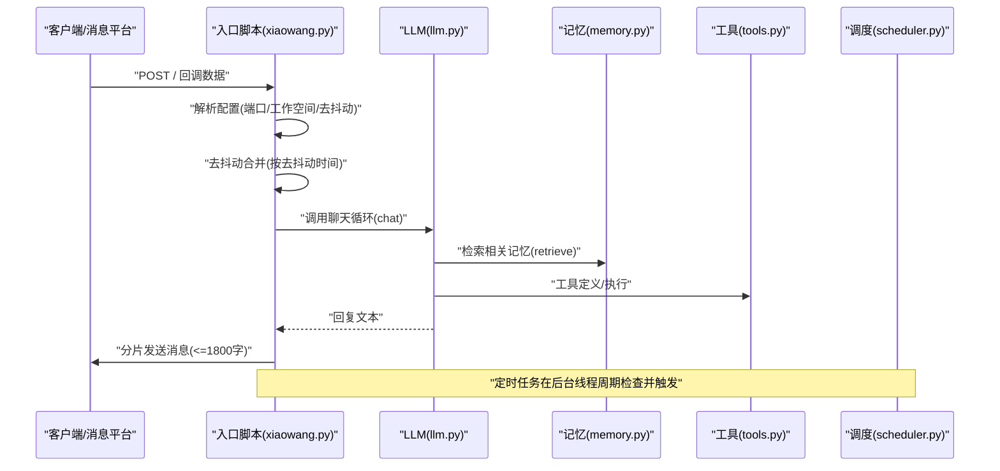
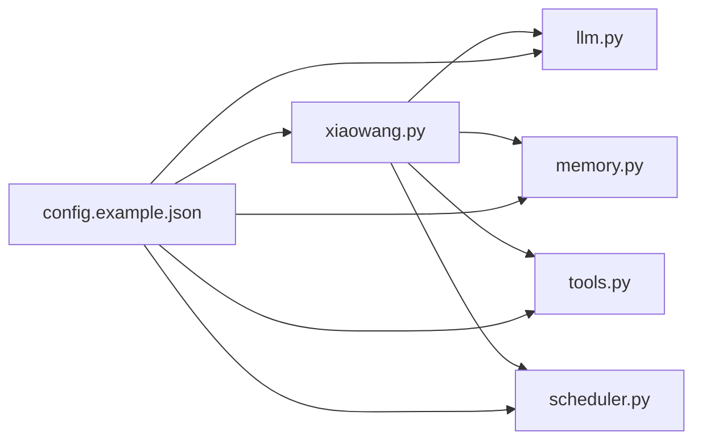

# 基础配置

<cite>
**本文引用的文件**
- [config.example.json](file://config.example.json)
- [README.md](file://README.md)
- [xiaowang.py](file://xiaowang.py)
- [llm.py](file://llm.py)
- [memory.py](file://memory.py)
- [tools.py](file://tools.py)
- [router.py](file://router.py)
- [scheduler.py](file://scheduler.py)
</cite>

## 目录
1. [简介](#简介)
2. [项目结构](#项目结构)
3. [核心组件](#核心组件)
4. [架构总览](#架构总览)
5. [详细组件分析](#详细组件分析)
6. [依赖关系分析](#依赖关系分析)
7. [性能考量](#性能考量)
8. [故障排查指南](#故障排查指南)
9. [结论](#结论)
10. [附录](#附录)

## 简介
本章节聚焦于724 Office的基础配置项，特别是config.example.json中的顶层配置项，解释其作用与重要性，并说明它们如何影响系统运行行为。重点覆盖以下配置项：
- 端口配置（port）
- 工作空间配置（workspace）
- 去抖动时间配置（debounce_seconds）
- 所有者ID配置（owner_ids）

同时提供配置修改的最佳实践、性能优化建议、验证方法以及常见配置错误的排查指南，帮助读者在部署与运维中快速定位问题并稳定运行。

## 项目结构
该仓库采用“单入口 + 多模块”的组织方式，入口脚本负责加载配置、初始化各子系统，并对外提供HTTP回调服务；核心模块包括LLM对话循环、工具注册、内存系统、定时任务、消息平台集成等。

图表来源
- [xiaowang.py:35-75](file://xiaowang.py#L35-L75)
- [config.example.json:1-61](file://config.example.json#L1-L61)

章节来源
- [README.md:1-162](file://README.md#L1-L162)
- [config.example.json:1-61](file://config.example.json#L1-L61)
- [xiaowang.py:35-75](file://xiaowang.py#L35-L75)

## 核心组件
本节从配置角度梳理关键组件与其依赖关系，明确基础配置项如何驱动系统行为。

- 配置加载与注入
  - 入口脚本读取配置文件并将其注入到各模块，如LLM初始化需要模型配置、工作空间路径、所有者ID、会话目录等。
  - 参考路径：[xiaowang.py:38-66](file://xiaowang.py#L38-L66)

- LLM模块
  - 使用配置中的默认模型与提供商信息进行API调用；会话目录与工作空间影响历史消息持久化与系统提示构建。
  - 参考路径：[llm.py:33-38](file://llm.py#L33-L38)

- 记忆系统
  - 初始化时读取memory段配置，决定是否启用嵌入向量化、检索Top-K、相似度阈值等；这些参数直接影响检索质量与性能。
  - 参考路径：[memory.py:40-86](file://memory.py#L40-L86)

- 工具系统
  - 通过额外配置传递搜索API密钥、视频生成API等，供工具使用。
  - 参考路径：[tools.py:506-511](file://tools.py#L506-L511)

- 定时任务
  - 依赖聊天函数作为触发器，执行后通过消息工具回传结果。
  - 参考路径：[scheduler.py:30-36](file://scheduler.py#L30-L36)

- 多租户路由
  - 路由器独立运行，不直接依赖主配置中的port/workspace/debounce_seconds，但会读取环境变量控制容器编排与健康检查。
  - 参考路径：[router.py:23-32](file://router.py#L23-L32)

章节来源
- [xiaowang.py:38-75](file://xiaowang.py#L38-L75)
- [llm.py:33-38](file://llm.py#L33-L38)
- [memory.py:40-86](file://memory.py#L40-L86)
- [tools.py:506-511](file://tools.py#L506-L511)
- [scheduler.py:30-36](file://scheduler.py#L30-L36)
- [router.py:23-32](file://router.py#L23-L32)

## 架构总览
下图展示配置如何贯穿系统生命周期：从入口加载配置，到模块初始化，再到运行期回调处理与消息去抖动。

图表来源
- [xiaowang.py:365-378](file://xiaowang.py#L365-L378)
- [xiaowang.py:489-554](file://xiaowang.py#L489-L554)
- [llm.py:317-400](file://llm.py#L317-L400)
- [memory.py:88-118](file://memory.py#L88-L118)
- [scheduler.py:130-168](file://scheduler.py#L130-L168)

## 详细组件分析

### 端口配置（port）
- 作用
  - 控制入口HTTP服务监听的端口，默认为8080。系统会在启动时读取该配置并绑定到0.0.0.0地址。
  - 参考路径：[xiaowang.py:43](file://xiaowang.py#L43)、[xiaowang.py:609-611](file://xiaowang.py#L609-L611)

- 影响范围
  - 外部消息平台需将回调指向 http://YOUR_SERVER_IP:port/。
  - 若端口被占用或防火墙未开放，回调无法到达，导致无响应或超时。
  - 多实例部署时必须确保端口唯一，避免冲突。

- 最佳实践
  - 生产环境建议固定端口并在反向代理后暴露，便于统一管理与安全策略。
  - 如需容器化部署，确保容器端口映射与宿主机一致。

- 性能优化
  - 端口本身不直接影响LLM推理性能，但高并发回调可能受网络栈与线程池限制，建议结合负载均衡与连接数上限调整。

- 常见错误
  - 端口被占用：启动报错或立即退出。
  - 防火墙/安全组未放行：外部回调不可达。
  - 反向代理未正确转发：出现404或空响应。

章节来源
- [xiaowang.py:43](file://xiaowang.py#L43)
- [xiaowang.py:609-611](file://xiaowang.py#L609-L611)
- [README.md:139](file://README.md#L139)

### 工作空间配置（workspace）
- 作用
  - 定义工作目录绝对路径，用于存放会话、文件索引、记忆文件等。系统会在此目录下创建必要的子目录。
  - 参考路径：[xiaowang.py:42](file://xiaowang.py#L42)、[xiaowang.py:49-50](file://xiaowang.py#L49-L50)

- 影响范围
  - 会话持久化：会话文件保存在工作空间下的sessions目录。
  - 文件存储：收到的图片/视频/语音/文件会被持久化到工作空间/files。
  - 记忆文件：长期记忆与日志文件位于工作空间/memory。
  - 工具读写：工具读取/写入文件均以工作空间为相对根路径。

- 最佳实践
  - 将工作空间置于高性能磁盘，确保I/O吞吐满足媒体文件处理需求。
  - 为不同环境准备独立的工作空间，避免跨环境污染。
  - 定期清理旧文件与日志，防止磁盘空间不足。

- 性能优化
  - 将工作空间挂载到SSD或高速存储，减少I/O瓶颈。
  - 对大文件操作（如视频处理）预留充足磁盘空间与带宽。

- 常见错误
  - 权限不足：无法创建目录或写入文件。
  - 路径不存在：启动时报错或功能异常。
  - 磁盘空间不足：文件保存失败或内存数据库写入失败。

章节来源
- [xiaowang.py:42](file://xiaowang.py#L42)
- [xiaowang.py:49-50](file://xiaowang.py#L49-L50)
- [README.md:121-123](file://README.md#L121-L123)

### 去抖动时间配置（debounce_seconds）
- 作用
  - 控制消息合并的时间窗口。当同一用户在短时间内发送多条消息时，系统会将这些消息合并为一次处理，减少重复调用与资源消耗。
  - 参考路径：[xiaowang.py:44](file://xiaowang.py#L44)、[xiaowang.py:365-378](file://xiaowang.py#L365-L378)

- 影响范围
  - 单用户模式：仅允许所有者ID对应的用户进入聊天循环，其他用户将收到“单用户模式”提示。
  - 合并策略：同一去抖动周期内的多条消息会被拼接文本并合并图片列表，然后一次性进入LLM处理。
  - 响应节奏：较长的去抖动时间可降低LLM调用频率，但会增加延迟；较短时间可提升实时性，但增加成本。

- 最佳实践
  - 默认3秒适合大多数场景；若用户频繁发送短消息，可适当缩短以提升交互体验。
  - 对高并发场景，建议配合限流与队列策略，避免瞬时洪峰。

- 性能优化
  - 合理设置去抖动时间，平衡延迟与吞吐。
  - 对硬件/语音通道可使用零延迟缓存（由记忆模块提供），进一步降低感知延迟。

- 常见错误
  - 去抖动时间过长：用户感知延迟过高。
  - 去抖动时间过短：LLM调用过于频繁，增加成本与失败率。
  - 单用户模式误判：当owner_ids为空或不匹配时，非所有者消息不会进入聊天循环。

章节来源
- [xiaowang.py:44](file://xiaowang.py#L44)
- [xiaowang.py:365-378](file://xiaowang.py#L365-L378)
- [xiaowang.py:340-342](file://xiaowang.py#L340-L342)

### 所有者ID配置（owner_ids）
- 作用
  - 定义“所有者”用户ID集合，系统在单用户模式下仅接受来自这些ID的消息进入聊天循环。
  - 参考路径：[xiaowang.py:41](file://xiaowang.py#L41)、[xiaowang.py:340-342](file://xiaowang.py#L340-L342)

- 影响范围
  - 单用户模式：非所有者ID的消息将被拒绝，提示“单用户模式”。
  - 调度通知：调度任务触发后可通过消息工具向所有者发送报告。
  - 多租户隔离：在多租户路由场景下，每个容器内的所有者ID由路由注入，互不影响。

- 最佳实践
  - 明确区分“所有者”与“普通用户”，避免误将普通用户ID加入所有者列表。
  - 在生产环境中，建议使用稳定且唯一的用户标识符。

- 常见错误
  - 所有者ID为空：系统无法进入聊天循环，所有消息都会被拒绝。
  - 类型不匹配：配置为字符串而非数组，或包含非字符串元素，导致比较失败。
  - 多租户场景：未正确注入容器内所有者ID，导致路由到错误实例。

章节来源
- [xiaowang.py:41](file://xiaowang.py#L41)
- [xiaowang.py:340-342](file://xiaowang.py#L340-L342)
- [router.py:166-173](file://router.py#L166-L173)

## 依赖关系分析
基础配置项与模块之间的依赖关系如下：

图表来源
- [config.example.json:1-61](file://config.example.json#L1-L61)
- [xiaowang.py:38-75](file://xiaowang.py#L38-L75)
- [llm.py:33-38](file://llm.py#L33-L38)
- [memory.py:40-86](file://memory.py#L40-L86)
- [tools.py:506-511](file://tools.py#L506-L511)
- [scheduler.py:30-36](file://scheduler.py#L30-L36)

章节来源
- [config.example.json:1-61](file://config.example.json#L1-L61)
- [xiaowang.py:38-75](file://xiaowang.py#L38-L75)
- [llm.py:33-38](file://llm.py#L33-L38)
- [memory.py:40-86](file://memory.py#L40-L86)
- [tools.py:506-511](file://tools.py#L506-L511)
- [scheduler.py:30-36](file://scheduler.py#L30-L36)

## 性能考量
- 端口与网络
  - 确保端口监听正常、防火墙放行、反向代理正确转发，避免回调失败或超时。
- 工作空间与I/O
  - 将工作空间置于高性能存储，定期清理日志与临时文件，避免磁盘空间不足。
- 去抖动策略
  - 合理设置去抖动时间，兼顾实时性与成本；对高频场景可考虑限流与队列。
- 单用户模式
  - 通过owner_ids严格控制访问，减少无效请求与资源浪费。

[本节为通用指导，无需特定文件来源]

## 故障排查指南
- 配置加载失败
  - 症状：启动时报错或无法读取配置。
  - 排查：确认config.json存在且格式合法；检查AGENT_CONFIG环境变量是否正确指向配置文件。
  - 参考路径：[xiaowang.py:36-39](file://xiaowang.py#L36-L39)

- 端口冲突或不可达
  - 症状：启动后立即退出或回调404/502。
  - 排查：更换端口、检查防火墙/安全组、确认反向代理配置。
  - 参考路径：[xiaowang.py:609-611](file://xiaowang.py#L609-L611)

- 工作空间权限/磁盘问题
  - 症状：无法创建目录、文件保存失败、内存数据库写入失败。
  - 排查：检查工作空间路径权限与可用空间，必要时切换到更高性能存储。
  - 参考路径：[xiaowang.py:49-50](file://xiaowang.py#L49-L50)

- 去抖动导致的延迟过高
  - 症状：用户感知明显延迟。
  - 排查：适当降低debounce_seconds；检查是否有大量小消息连续发送。
  - 参考路径：[xiaowang.py:44](file://xiaowang.py#L44)

- 单用户模式误拒
  - 症状：非所有者消息被拒绝。
  - 排查：确认owner_ids配置正确且类型为数组；核对消息平台回调中的senderId。
  - 参考路径：[xiaowang.py:41](file://xiaowang.py#L41)、[xiaowang.py:340-342](file://xiaowang.py#L340-L342)

- 记忆系统初始化失败
  - 症状：记忆功能不可用或报错。
  - 排查：确认memory.enabled为true且embedding_api.api_key已配置；检查嵌入API连通性与维度设置。
  - 参考路径：[memory.py:44-52](file://memory.py#L44-L52)、[memory.py:158-187](file://memory.py#L158-L187)

章节来源
- [xiaowang.py:36-39](file://xiaowang.py#L36-L39)
- [xiaowang.py:44](file://xiaowang.py#L44)
- [xiaowang.py:49-50](file://xiaowang.py#L49-L50)
- [xiaowang.py:340-342](file://xiaowang.py#L340-L342)
- [memory.py:44-52](file://memory.py#L44-L52)
- [memory.py:158-187](file://memory.py#L158-L187)

## 结论
基础配置项（port、workspace、debounce_seconds、owner_ids）是724 Office运行的关键开关。正确设置这些参数能够显著提升系统的稳定性、性能与用户体验。建议在生产环境中：
- 明确端口与网络策略，确保回调可达；
- 选择高性能工作空间并定期维护；
- 根据业务特征调整去抖动时间；
- 严格管理所有者ID，避免误拒或越权访问。

[本节为总结，无需特定文件来源]

## 附录
- 快速对照表
  - 端口（port）：HTTP服务监听端口，默认8080。
  - 工作空间（workspace）：工作目录绝对路径，用于会话、文件、记忆等持久化。
  - 去抖动时间（debounce_seconds）：消息合并时间窗口，默认3秒。
  - 所有者ID（owner_ids）：允许进入聊天循环的用户ID集合。

- 参考配置文件
  - [config.example.json:1-61](file://config.example.json#L1-L61)

章节来源
- [config.example.json:1-61](file://config.example.json#L1-L61)