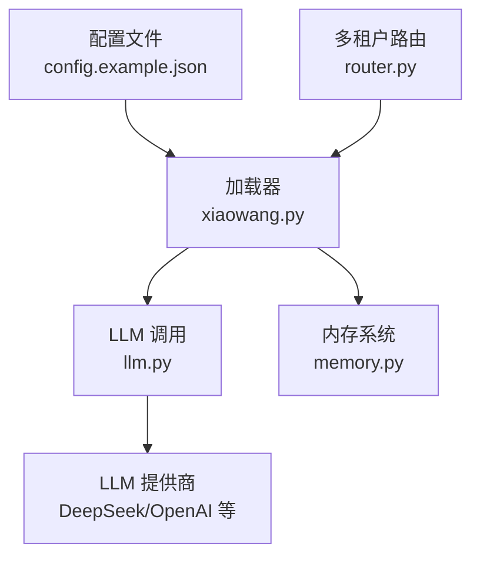
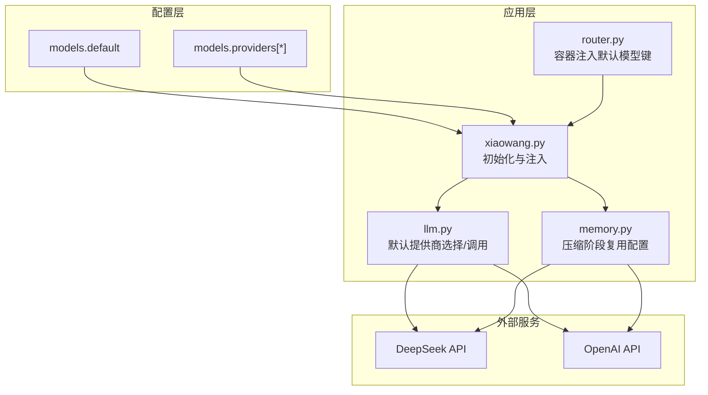
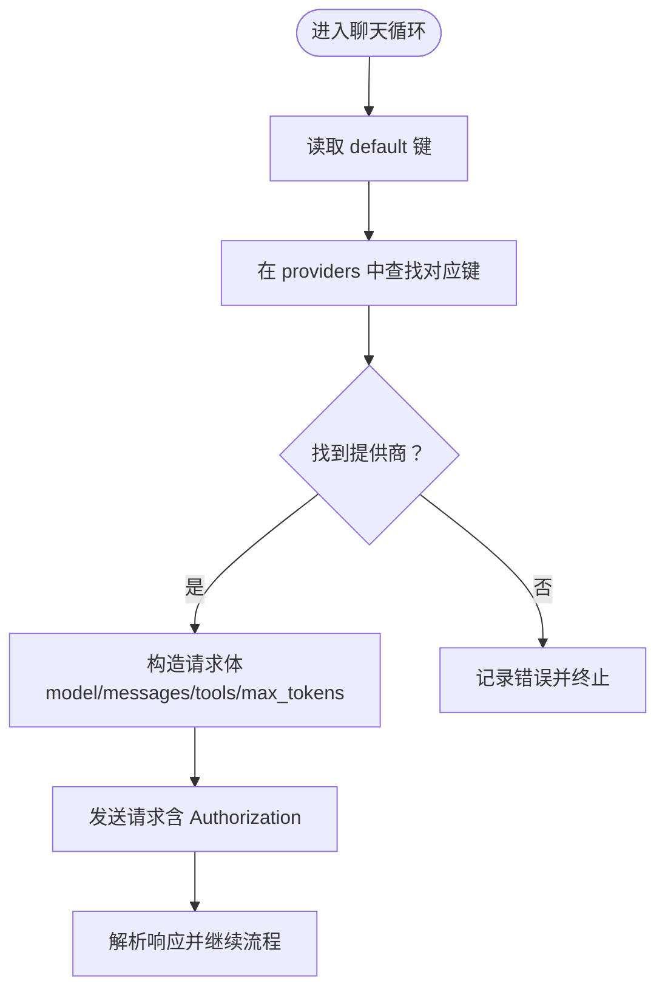
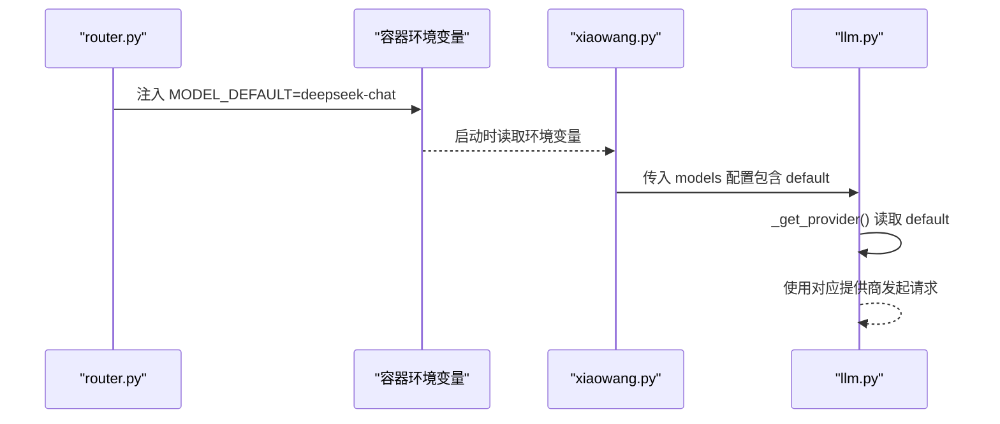
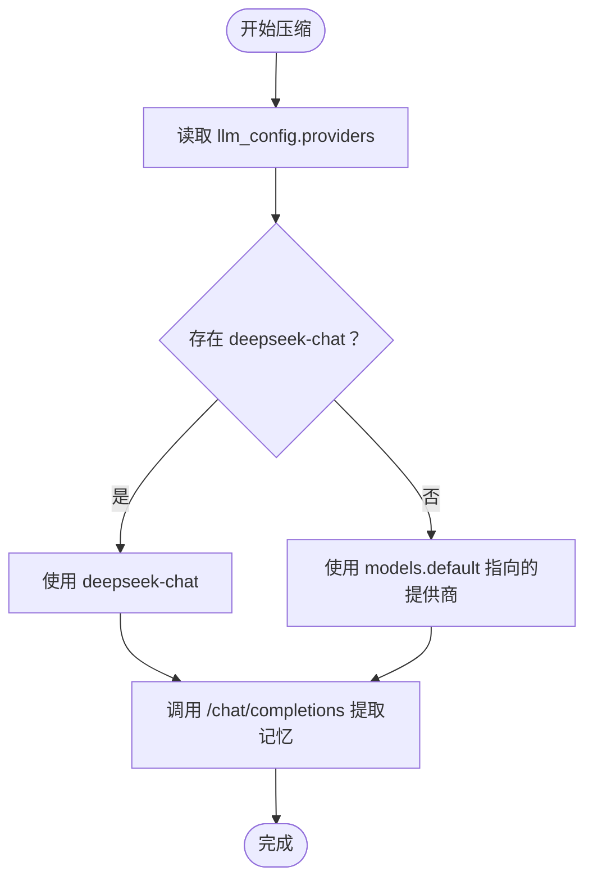
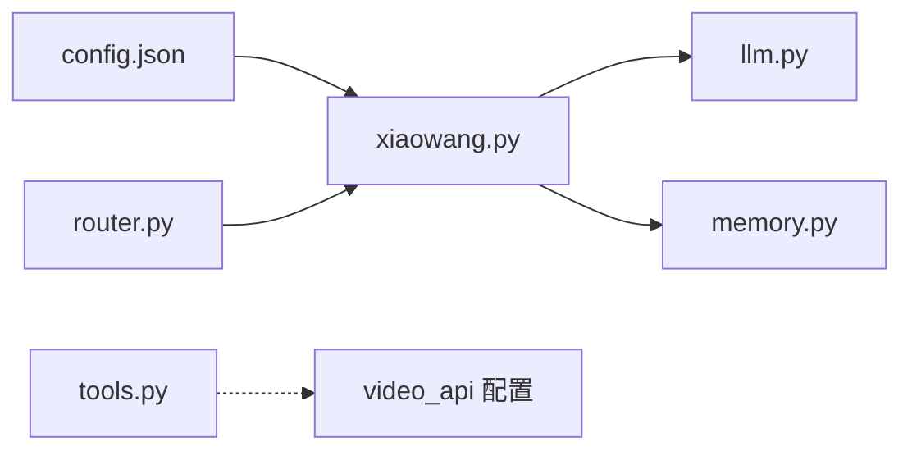

# 模型配置

<cite>
**本文引用的文件**
- [README.md](file://README.md)
- [config.example.json](file://config.example.json)
- [llm.py](file://llm.py)
- [xiaowang.py](file://xiaowang.py)
- [router.py](file://router.py)
- [memory.py](file://memory.py)
- [tools.py](file://tools.py)
</cite>

## 目录
1. [简介](#简介)
2. [项目结构与入口](#项目结构与入口)
3. [核心组件：模型配置与调用](#核心组件模型配置与调用)
4. [架构总览](#架构总览)
5. [详细组件解析](#详细组件解析)
6. [依赖关系分析](#依赖关系分析)
7. [性能与稳定性考量](#性能与稳定性考量)
8. [故障排查指南](#故障排查指南)
9. [结论](#结论)

## 简介
本节面向“724 Office”系统中的模型配置部分，聚焦于 models 配置段的完整结构与使用方式，包括：
- 默认模型 default 的设定与作用域
- 多提供商 providers 的组织与切换
- 关键配置项：API 基础地址、API 密钥、模型名、最大令牌数、超时、额外请求体等
- 不同 LLM 提供商（如 DeepSeek、OpenAI）的配置示例与切换方法
- 模型配置的优先级规则与动态切换机制

## 项目结构与入口
- 配置文件：config.example.json 定义了 models 配置段的完整结构与示例
- 入口模块：xiaowang.py 负责加载配置并将 models 配置注入到 llm.py 中
- 核心调用：llm.py 使用 models 配置进行 LLM API 调用与工具循环
- 内存压缩：memory.py 在压缩阶段也复用 models 配置选择合适的 LLM 提供商
- 多租户路由：router.py 在容器自动 Provision 时为新用户注入默认模型键值

图表来源
- [config.example.json:1-61](file://config.example.json#L1-L61)
- [xiaowang.py:35-76](file://xiaowang.py#L35-L76)
- [llm.py:33-83](file://llm.py#L33-L83)
- [memory.py:40-86](file://memory.py#L40-L86)
- [router.py:141-249](file://router.py#L141-L249)

章节来源
- [README.md:101-140](file://README.md#L101-L140)
- [config.example.json:1-61](file://config.example.json#L1-L61)
- [xiaowang.py:35-76](file://xiaowang.py#L35-L76)
- [router.py:141-249](file://router.py#L141-L249)

## 核心组件：模型配置与调用
本节详解 models 配置段在系统中的角色与实现要点。

- 配置结构
  - default：指定当前会话使用的默认提供商键名
  - providers：以键值对形式定义多个提供商，每个提供商包含：
    - api_base：LLM API 基础地址（末尾斜杠会被清理）
    - api_key：访问凭证
    - model：模型名（用于请求体中的 model 字段）
    - max_tokens：最大生成长度（默认 8192）
    - timeout：请求超时秒数（默认 120）
    - extra_body：附加请求体字段（用于兼容特定提供商的扩展参数）

- 初始化与注入
  - xiaowang.py 加载 config.json 并将 models 配置传递给 llm.init
  - llm.init 将 models 配置保存为全局状态，供后续调用使用

- 请求构建与调用
  - llm._get_provider 读取 default 键对应的提供商
  - llm._call_llm 构造 /chat/completions 请求，填充 model、messages、tools、max_tokens 等
  - 支持 extra_body 合并与 timeout 控制

- 动态切换与优先级
  - 当前实现采用“全局默认提供商”的策略：default 指向的提供商即为默认
  - 若需要切换，可在运行时修改配置文件并重启服务；或在容器化场景中通过环境变量 MODEL_DEFAULT 进行注入

章节来源
- [config.example.json:2-18](file://config.example.json#L2-L18)
- [llm.py:33-83](file://llm.py#L33-L83)
- [xiaowang.py:63-66](file://xiaowang.py#L63-L66)
- [router.py:168-173](file://router.py#L168-L173)

## 架构总览
下图展示模型配置在系统中的位置与交互关系，以及默认提供商与多提供商之间的关系。

图表来源
- [config.example.json:2-18](file://config.example.json#L2-L18)
- [xiaowang.py:63-76](file://xiaowang.py#L63-L76)
- [llm.py:45-83](file://llm.py#L45-L83)
- [memory.py:228-252](file://memory.py#L228-L252)
- [router.py:168-173](file://router.py#L168-L173)

## 详细组件解析

### 组件一：默认模型与多提供商管理
- 默认模型（default）
  - 作用：决定 llm._get_provider 返回的提供商键名
  - 影响范围：全局生效，影响聊天循环、内存压缩等所有 LLM 调用
- 多提供商（providers）
  - 结构：键名为提供商标识（如 deepseek-chat、openai-gpt4），值为该提供商的配置对象
  - 配置项：api_base、api_key、model、max_tokens、timeout、extra_body
  - 切换方式：通过修改 default 指向不同的提供商键名实现切换

图表来源
- [llm.py:45-83](file://llm.py#L45-L83)

章节来源
- [config.example.json:2-18](file://config.example.json#L2-L18)
- [llm.py:45-83](file://llm.py#L45-L83)

### 组件二：关键配置项详解
- api_base
  - 用途：LLM API 基础地址，最终拼接为 /chat/completions
  - 注意：内部会去除末尾斜杠，确保路径正确
- api_key
  - 用途：请求头 Authorization: Bearer {api_key}
- model
  - 用途：请求体中的 model 字段，指示具体模型
- max_tokens
  - 用途：控制最大生成长度，默认 8192
- timeout
  - 用途：请求超时秒数，默认 120
- extra_body
  - 用途：合并到请求体中的额外字段，用于兼容特定提供商的扩展参数

章节来源
- [llm.py:50-83](file://llm.py#L50-L83)
- [config.example.json:5-16](file://config.example.json#L5-L16)

### 组件三：不同 LLM 提供商的配置示例与切换
- 示例一：DeepSeek
  - 键名：deepseek-chat
  - api_base：https://api.deepseek.com/v1
  - model：deepseek-chat
  - 可选：max_tokens、timeout、extra_body
- 示例二：OpenAI
  - 键名：openai-gpt4
  - api_base：https://api.openai.com/v1
  - model：gpt-4o
  - 可选：max_tokens、timeout、extra_body
- 切换方法
  - 修改 config.json 中 models.default 指向目标提供商键名
  - 重启服务后生效
  - 容器化场景可通过环境变量 MODEL_DEFAULT 注入

章节来源
- [config.example.json:4-17](file://config.example.json#L4-L17)
- [router.py:168-173](file://router.py#L168-L173)

### 组件四：模型配置的优先级规则与动态切换机制
- 优先级规则
  - 全局默认：由 models.default 指定
  - 访问路径：llm._get_provider 仅读取 default 对应的提供商
  - 无显式覆盖：不支持在同一会话内动态切换；需通过修改配置并重启实现
- 动态切换机制
  - 当前未实现运行时动态切换
  - 容器化场景：router.py 在创建新容器时注入 MODEL_DEFAULT 环境变量，从而影响该容器内的默认提供商
  - 建议实践：通过外部配置中心或环境变量管理 default 键，结合容器编排实现灰度切换

图表来源
- [router.py:168-173](file://router.py#L168-L173)
- [xiaowang.py:63-66](file://xiaowang.py#L63-L66)
- [llm.py:45-47](file://llm.py#L45-L47)

章节来源
- [router.py:141-249](file://router.py#L141-L249)
- [xiaowang.py:63-66](file://xiaowang.py#L63-L66)
- [llm.py:45-47](file://llm.py#L45-L47)

### 组件五：内存压缩阶段的模型选择
- 压缩阶段逻辑
  - memory.py 在压缩阶段会从 llm_config 中读取 providers
  - 优先尝试 deepseek-chat，否则回退到 default 指向的提供商
  - 使用 /chat/completions 接口提取结构化记忆
- 设计意图
  - 选择更便宜的模型进行压缩，避免与“思考型”模型的兼容性问题
  - 保持与主流程一致的配置来源，便于统一管理

图表来源
- [memory.py:228-252](file://memory.py#L228-L252)

章节来源
- [memory.py:228-252](file://memory.py#L228-L252)

## 依赖关系分析
- 配置依赖
  - xiaowang.py 依赖 config.json 中的 models 配置
  - llm.py 依赖 xiaowang.py 注入的 models 配置
  - memory.py 依赖 llm.py 的配置（通过初始化传入）
- 运行时依赖
  - router.py 在容器创建时注入 MODEL_DEFAULT，间接影响默认提供商
  - tools.py 中的视频生成工具使用独立的 video_api 配置，与 models 配置解耦

图表来源
- [xiaowang.py:38-76](file://xiaowang.py#L38-L76)
- [llm.py:33-39](file://llm.py#L33-L39)
- [memory.py:40-56](file://memory.py#L40-L56)
- [router.py:168-173](file://router.py#L168-L173)
- [tools.py:406-412](file://tools.py#L406-L412)

章节来源
- [xiaowang.py:38-76](file://xiaowang.py#L38-L76)
- [llm.py:33-39](file://llm.py#L33-L39)
- [memory.py:40-56](file://memory.py#L40-L56)
- [router.py:168-173](file://router.py#L168-L173)
- [tools.py:406-412](file://tools.py#L406-L412)

## 性能与稳定性考量
- 超时控制
  - 默认 timeout 为 120 秒，可根据提供商与网络状况调整
  - 建议在高延迟网络环境下适当提高 timeout，避免误判
- 最大令牌数
  - 默认 max_tokens 为 8192，可按模型能力与任务需求调整
  - 过小可能导致内容截断，过大可能增加成本与延迟
- 请求体扩展
  - extra_body 可用于传递提供商特定参数（如温度、频率惩罚等）
  - 使用时需确保与提供商接口规范一致
- 容器化默认模型
  - 通过 MODEL_DEFAULT 注入默认提供商，便于多租户隔离与资源分配

## 故障排查指南
- 常见错误与定位
  - HTTP 401/403：检查 api_key 是否正确配置
  - HTTP 400/422：查看日志中打印的响应体片段，定位请求体字段问题
  - 超时：检查 timeout 设置与网络状况
  - 无法切换：确认是否通过修改 config.json 的 default 或容器环境变量 MODEL_DEFAULT 实现
- 日志与调试
  - llm.py 在 HTTPError 时会输出响应体片段，便于快速定位问题
  - memory.py 在压缩阶段失败时会记录警告信息，注意相似度阈值与向量维度设置

章节来源
- [llm.py:74-82](file://llm.py#L74-L82)
- [memory.py:359-361](file://memory.py#L359-L361)

## 结论
- models 配置段提供了清晰的默认模型与多提供商管理能力
- 当前实现采用“全局默认提供商”的静态切换策略，适合稳定生产环境
- 容器化场景可通过 MODEL_DEFAULT 实现租户级默认提供商注入
- 建议在高并发与高延迟场景下合理设置 timeout 与 max_tokens，并通过 extra_body 适配提供商特性