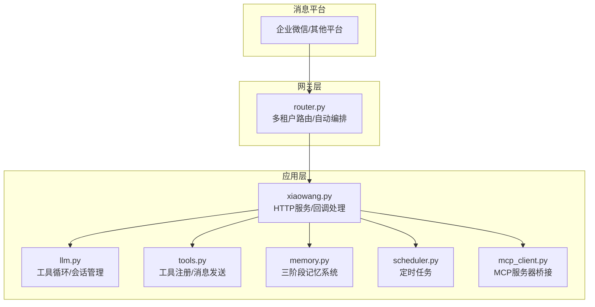
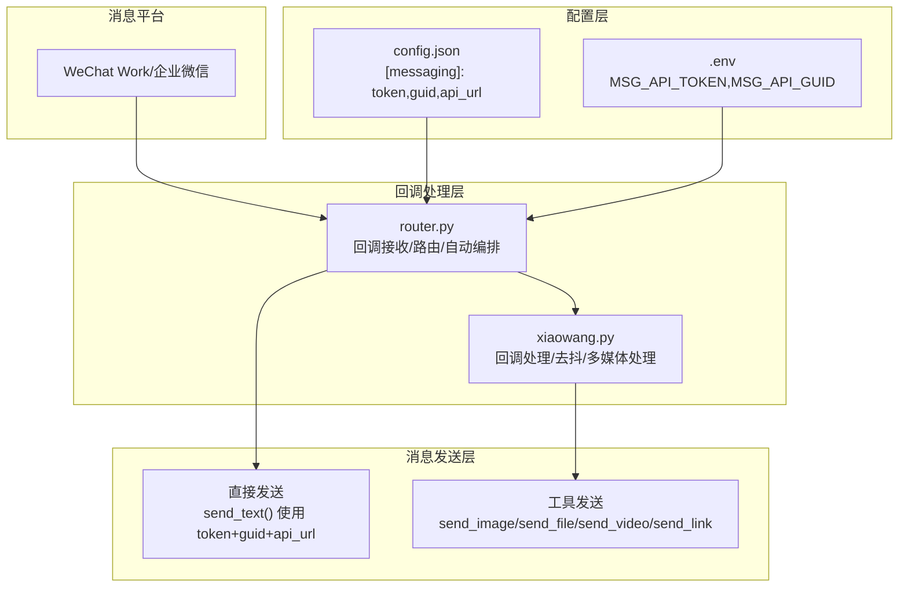
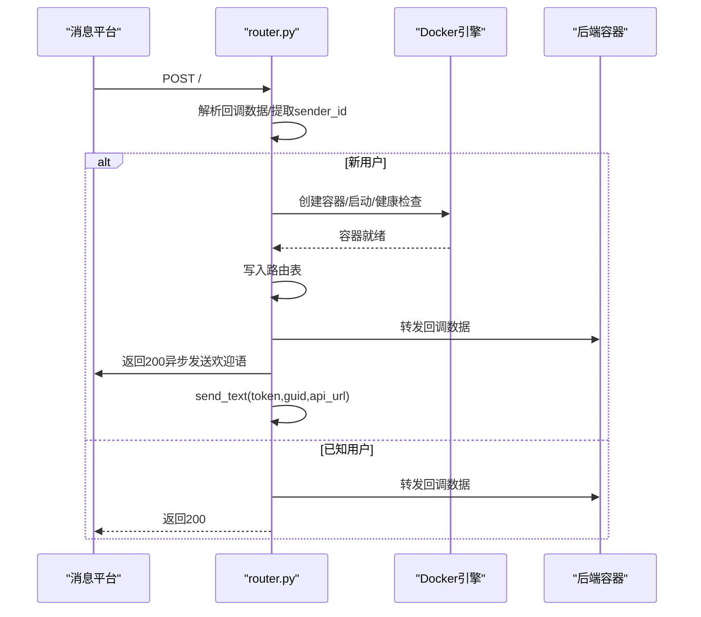
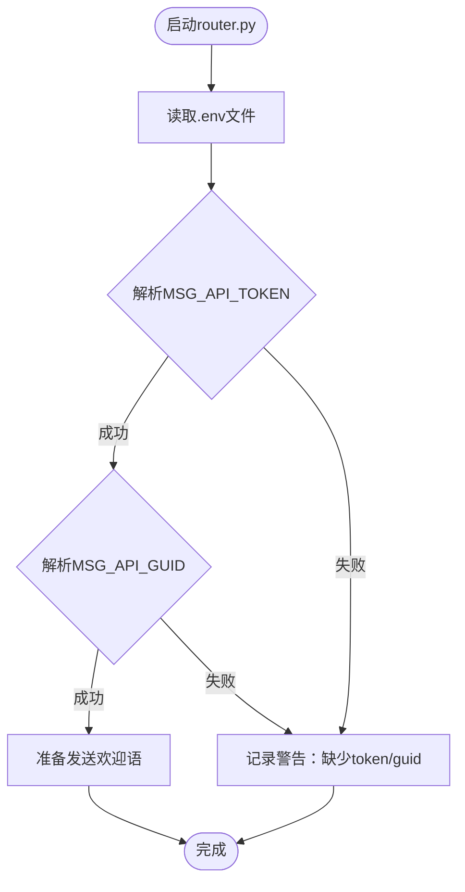
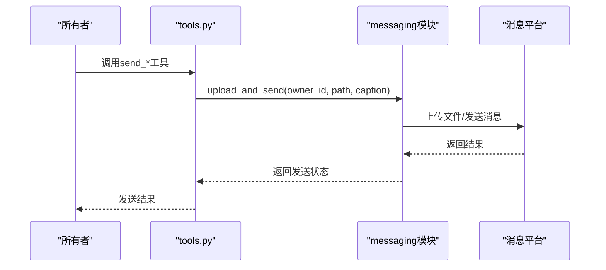
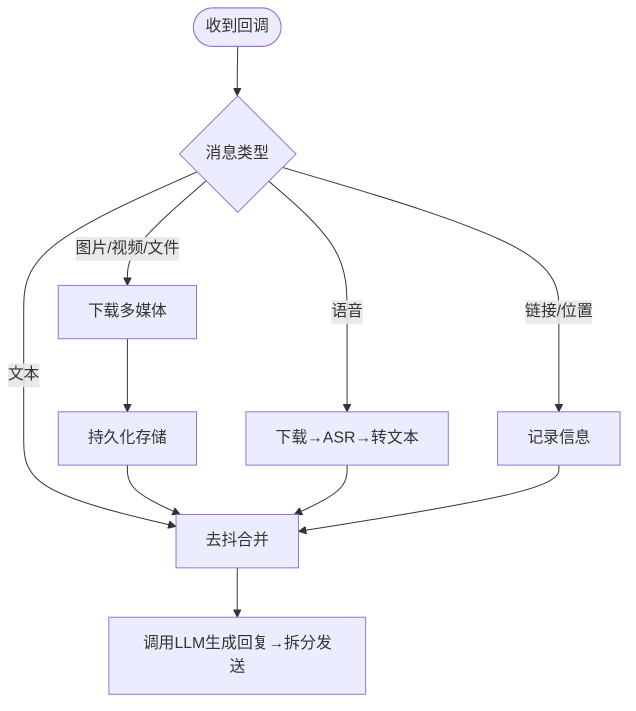
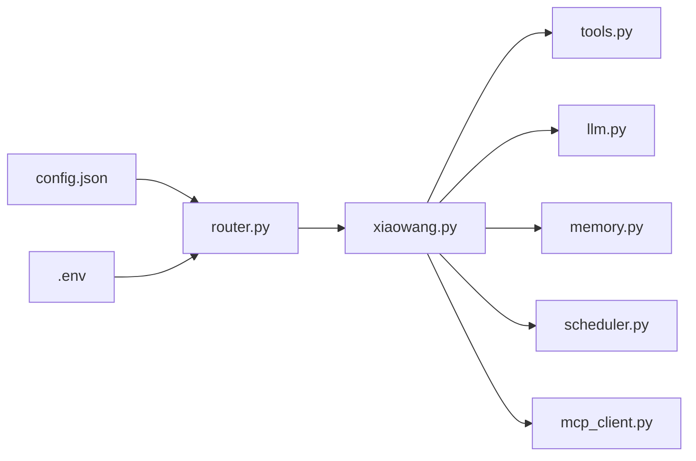

# 消息平台配置

<cite>
**本文档引用的文件**
- [README.md](file://README.md)
- [config.example.json](file://config.example.json)
- [router.py](file://router.py)
- [xiaowang.py](file://xiaowang.py)
- [tools.py](file://tools.py)
- [llm.py](file://llm.py)
- [memory.py](file://memory.py)
- [scheduler.py](file://scheduler.py)
- [mcp_client.py](file://mcp_client.py)
</cite>

## 目录
1. [简介](#简介)
2. [项目结构](#项目结构)
3. [核心组件](#核心组件)
4. [架构总览](#架构总览)
5. [详细组件分析](#详细组件分析)
6. [依赖关系分析](#依赖关系分析)
7. [性能考量](#性能考量)
8. [故障排除指南](#故障排除指南)
9. [结论](#结论)
10. [附录](#附录)

## 简介
本文件面向724 Office消息平台配置，重点解释config.json中[messaging]配置段的作用与配置方法，涵盖访问令牌(token)、全局唯一标识符(guid)、API端点(api_url)等关键参数，并详细说明如何为不同消息平台（如企业微信）配置回调接口、认证机制、回调地址以及安全注意事项。同时提供配置模板与集成示例，帮助快速完成消息平台对接。

## 项目结构
该项目采用纯Python实现，核心围绕“消息回调接收—多租户路由—容器化后端”展开。消息平台通过HTTP回调将用户消息推送到统一入口，系统解析消息并转发至对应用户的容器化后端进行处理。

图表来源
- [router.py:1-493](file://router.py#L1-L493)
- [xiaowang.py:1-626](file://xiaowang.py#L1-L626)
- [llm.py:1-401](file://llm.py#L1-L401)
- [tools.py:1-1153](file://tools.py#L1-L1153)
- [memory.py:1-361](file://memory.py#L1-L361)
- [scheduler.py:1-219](file://scheduler.py#L1-L219)
- [mcp_client.py:1-334](file://mcp_client.py#L1-L334)

章节来源
- [README.md:1-162](file://README.md#L1-L162)
- [router.py:1-493](file://router.py#L1-L493)
- [xiaowang.py:1-626](file://xiaowang.py#L1-L626)

## 核心组件
本节聚焦[messaging]配置段及其在系统中的作用与实现要点：

- 配置项说明
  - token：消息平台回调认证使用的访问令牌，用于校验回调请求来源合法性
  - guid：消息平台侧的全局唯一标识符，用于区分不同应用或租户
  - api_url：消息平台提供的直接发送消息的API端点，用于系统主动向用户发送欢迎语等

- 配置加载与使用
  - 在router.py中，系统从.env文件加载MSG_API_TOKEN与MSG_API_GUID，并在需要时调用MSG_API_URL发送文本消息
  - 在xiaowang.py中，messaging模块负责接收回调、去抖合并、多媒体下载与持久化、ASR语音识别、消息拆分与发送等

- 关键流程
  - 回调接收：router.py监听回调端点，解析sender_id并转发到对应容器
  - 主动发送：router.py在新用户首次接入时，使用token+guid+api_url发送欢迎语
  - 工具发送：tools.py中的send_*工具通过messaging模块上传并发送多媒体内容

章节来源
- [config.example.json:19-23](file://config.example.json#L19-L23)
- [router.py:38-482](file://router.py#L38-L482)
- [xiaowang.py:59-75](file://xiaowang.py#L59-L75)

## 架构总览
下图展示消息平台配置在整体架构中的位置与交互关系：

图表来源
- [config.example.json:19-23](file://config.example.json#L19-L23)
- [router.py:38-482](file://router.py#L38-L482)
- [xiaowang.py:59-75](file://xiaowang.py#L59-L75)

## 详细组件分析

### 组件A：消息平台回调处理（router.py）
- 职责
  - 接收来自消息平台的回调请求，解析sender_id
  - 对未知用户执行容器自动编排（Docker），建立路由表
  - 将回调数据转发至对应容器后端
  - 当存在MSG_API_TOKEN与MSG_API_GUID时，向新用户发送欢迎语

- 关键实现点
  - 回调端点：/（或空路径），收到POST后立即返回200，避免平台重试失败
  - 解析兼容：支持data为字典或列表，兼容多种回调格式
  - 自动编排：根据sender_id创建agent-u*容器，健康检查后写入路由表
  - 发送欢迎语：send_text()构造JSON请求体，携带X-API-TOKEN头

图表来源
- [router.py:338-418](file://router.py#L338-L418)
- [router.py:254-280](file://router.py#L254-L280)

章节来源
- [router.py:338-418](file://router.py#L338-L418)
- [router.py:254-280](file://router.py#L254-L280)

### 组件B：消息平台配置与初始化（config.json + router.py）
- 配置项
  - token：回调认证令牌
  - guid：平台侧全局唯一标识
  - api_url：直接发送消息的API端点

- 加载方式
  - router.py启动时从.env文件解析MSG_API_TOKEN与MSG_API_GUID
  - 若未配置，则禁用欢迎语发送功能

图表来源
- [router.py:469-482](file://router.py#L469-L482)

章节来源
- [config.example.json:19-23](file://config.example.json#L19-L23)
- [router.py:469-482](file://router.py#L469-L482)

### 组件C：消息发送工具链（tools.py + messaging）
- 工具定义
  - send_image/send_file/send_video/send_link：封装上传与发送流程
  - message：向所有者发送文本消息（用于通知）

- 实现要点
  - 通过messaging模块完成上传与发送
  - 文本消息按1800字节拆分，逐条发送
  - 多媒体消息先下载到本地，再持久化存储

图表来源
- [tools.py:266-301](file://tools.py#L266-L301)
- [xiaowang.py:352-356](file://xiaowang.py#L352-L356)

章节来源
- [tools.py:266-301](file://tools.py#L266-L301)
- [xiaowang.py:352-356](file://xiaowang.py#L352-L356)

### 组件D：回调处理与多媒体下载（xiaowang.py）
- 回调处理
  - 支持文本、图片、视频、文件、语音、链接、位置等多种消息类型
  - 去抖合并：将短时间内多条消息合并为一次回复
  - 单用户模式：仅允许owner_ids内的用户对话

- 多媒体下载策略
  - 优先级：企业微信下载（fileId+fileAesKey）> 个人下载（fileAuthKey+URL）> 直接HTTP下载
  - 下载后持久化到/workspace/files/YYYY-MM/目录

图表来源
- [xiaowang.py:489-554](file://xiaowang.py#L489-L554)
- [xiaowang.py:383-432](file://xiaowang.py#L383-L432)

章节来源
- [xiaowang.py:489-554](file://xiaowang.py#L489-L554)
- [xiaowang.py:383-432](file://xiaowang.py#L383-L432)

## 依赖关系分析
- 配置依赖
  - config.json提供[messaging]配置，router.py与xiaowang.py均依赖该配置
  - .env提供运行时环境变量（MSG_API_TOKEN/MSG_API_GUID），router.py在启动时解析

- 模块依赖
  - xiaowang.py导入messaging模块，用于回调处理与消息发送
  - tools.py导入messaging模块，提供send_*工具
  - router.py内部实现直接发送逻辑，不依赖外部messaging模块

图表来源
- [config.example.json:19-23](file://config.example.json#L19-L23)
- [router.py:469-482](file://router.py#L469-L482)
- [xiaowang.py:59-75](file://xiaowang.py#L59-L75)
- [tools.py:80-82](file://tools.py#L80-L82)

章节来源
- [config.example.json:19-23](file://config.example.json#L19-L23)
- [router.py:469-482](file://router.py#L469-L482)
- [xiaowang.py:59-75](file://xiaowang.py#L59-L75)
- [tools.py:80-82](file://tools.py#L80-L82)

## 性能考量
- 去抖机制：通过debounce_seconds（默认3秒）合并高频消息，降低LLM调用频率与平台压力
- 分片发送：文本消息按1800字节拆分，避免单次超长消息被拦截或限流
- 多媒体下载：优先使用平台提供的下载接口，减少中间代理环节
- 容器编排：新用户首次接入时可能需要等待容器启动与健康检查，建议合理设置PROVISION_TIMEOUT

## 故障排除指南
- 回调无法到达
  - 确认消息平台回调地址指向系统根路径（/），router.py仅对/路径进行处理
  - 检查防火墙与反向代理是否正确转发POST请求

- 认证失败
  - 确认config.json中的token与guid正确无误
  - 确认.env中MSG_API_TOKEN与MSG_API_GUID已正确加载

- 欢迎语未发送
  - 检查router.py启动日志中关于“Messaging API credentials loaded”的提示
  - 确认MSG_API_URL可访问且返回code=0

- 多媒体下载失败
  - 检查fileId/fileAesKey或fileAuthKey是否完整
  - 确认网络可达性与临时目录权限

- 单用户模式限制
  - 确认sender_id在owner_ids中
  - 如需多用户，请调整owner_ids配置或移除单用户限制逻辑

章节来源
- [router.py:338-418](file://router.py#L338-L418)
- [router.py:254-280](file://router.py#L254-L280)
- [xiaowang.py:340-362](file://xiaowang.py#L340-L362)

## 结论
[messaging]配置段是连接消息平台与系统的核心桥梁。通过正确配置token、guid与api_url，结合router.py的回调处理与自动编排能力，系统能够稳定地接收多租户消息并提供欢迎语、多媒体处理与工具发送等能力。建议在生产环境中严格管理密钥与回调地址，确保安全与稳定性。

## 附录

### 配置模板与集成示例
- 配置模板（config.json）
  - [config.example.json:19-23](file://config.example.json#L19-L23)
- .env文件示例（MSG_API_TOKEN/MSG_API_GUID）
  - [router.py:469-482](file://router.py#L469-L482)

### 回调地址与安全注意事项
- 回调地址
  - 系统根路径（/）即为回调入口，消息平台应将回调URL指向该路径
  - 参考：[README.md:139](file://README.md#L139)
- 安全建议
  - 仅在可信网络内部署，避免公网暴露
  - 使用强token并定期轮换
  - 限制owner_ids范围，防止未授权访问
  - 对回调数据进行最小必要验证与过滤