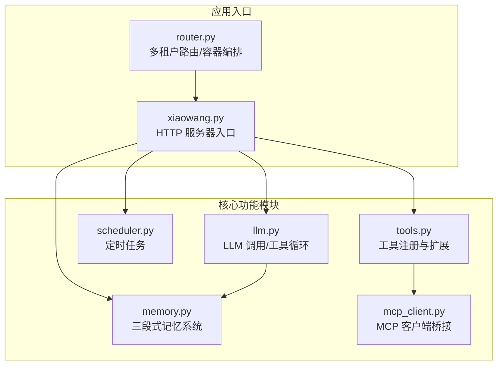
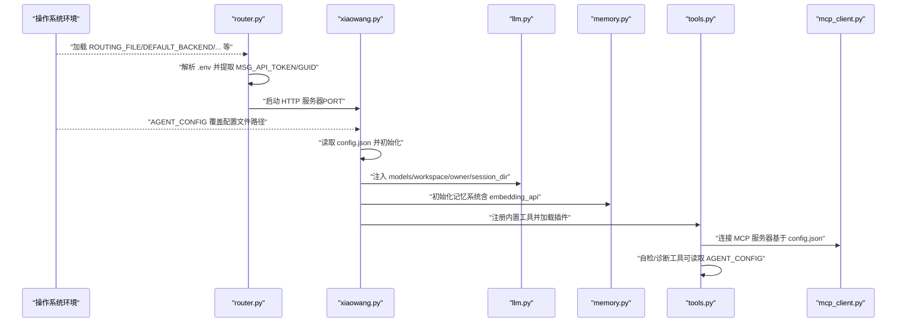
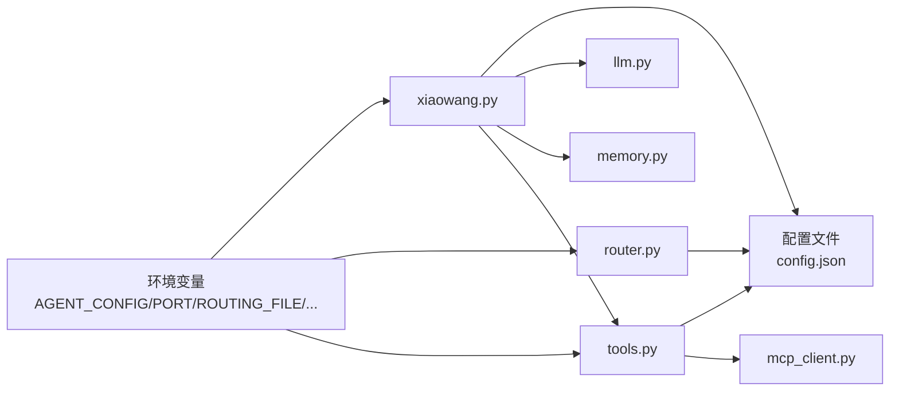

# 环境变量配置

<cite>
**本文档引用的文件**
- [README.md](file://README.md)
- [config.example.json](file://config.example.json)
- [xiaowang.py](file://xiaowang.py)
- [router.py](file://router.py)
- [tools.py](file://tools.py)
- [llm.py](file://llm.py)
- [memory.py](file://memory.py)
- [mcp_client.py](file://mcp_client.py)
- [scheduler.py](file://scheduler.py)
</cite>

## 目录
1. [简介](#简介)
2. [项目结构](#项目结构)
3. [核心组件](#核心组件)
4. [架构总览](#架构总览)
5. [详细组件分析](#详细组件分析)
6. [依赖关系分析](#依赖关系分析)
7. [性能考虑](#性能考虑)
8. [故障排除指南](#故障排除指南)
9. [结论](#结论)
10. [附录](#附录)

## 简介
本文件系统性阐述 724 Office 的环境变量配置与加载机制，重点说明以下内容：
- 如何通过环境变量覆盖配置文件中的设置
- 环境变量的命名规范与优先级规则
- 常见配置项（如 API 密钥、端口、工作目录等）的安全管理方法
- 环境变量的加载顺序与配置继承机制
- 多环境部署的配置管理策略

## 项目结构
该项目采用“单机入口 + 多模块协作”的结构，核心入口为 HTTP 服务，负责接收回调、会话管理、工具调用与定时任务调度。环境变量在不同模块中以“默认值 + 覆盖”的方式参与初始化。

图表来源
- [xiaowang.py:35-67](file://xiaowang.py#L35-L67)
- [router.py:469-492](file://router.py#L469-L492)
- [llm.py:33-39](file://llm.py#L33-L39)
- [memory.py:40-86](file://memory.py#L40-L86)
- [scheduler.py:30-36](file://scheduler.py#L30-L36)
- [mcp_client.py:272-286](file://mcp_client.py#L272-L286)
- [tools.py:506-512](file://tools.py#L506-L512)

章节来源
- [README.md:101-137](file://README.md#L101-L137)
- [config.example.json:1-61](file://config.example.json#L1-L61)

## 核心组件
本节聚焦环境变量在各模块中的使用与覆盖行为，帮助读者理解“配置文件 + 环境变量”的组合模式。

- 配置文件加载与覆盖
  - 应用入口通过环境变量 AGENT_CONFIG 指定配置文件路径，默认指向项目根目录下的 config.json；随后读取配置文件并注入到各子系统。
  - 其他模块（如 MCP 工具诊断）也通过环境变量 AGENT_CONFIG 间接复用同一份配置，确保一致性。

- 环境变量覆盖优先级
  - 在所有模块中，环境变量以“os.environ.get(KEY, 默认值)”的形式出现，这意味着：
    - 若环境变量存在，则覆盖配置文件中的对应字段；
    - 若不存在，则回退到配置文件中的值；
    - 若配置文件中也未定义，则使用硬编码的默认值。

- 关键环境变量清单
  - AGENT_CONFIG：指定配置文件路径（默认项目根目录 config.json）
  - PORT：HTTP 服务监听端口（router.py 中使用）
  - ROUTING_FILE、DEFAULT_BACKEND、HOST_DATA_DIR、APP_IMAGE、DOCKER_NETWORK、ENV_FILE_PATH、MAX_CONTAINERS、CONTAINER_MEMORY、PROVISION_TIMEOUT：多租户路由与容器编排相关参数
  - 其他：如 OWNER_ID、MODEL_DEFAULT、AGENT_DATA、AGENT_CONFIG（在容器编排时注入）

章节来源
- [xiaowang.py:35-46](file://xiaowang.py#L35-L46)
- [router.py:23-31](file://router.py#L23-L31)
- [router.py:470-486](file://router.py#L470-L486)
- [tools.py:975-976](file://tools.py#L975-L976)
- [tools.py:1101-1102](file://tools.py#L1101-L1102)

## 架构总览
下图展示环境变量在启动流程中的作用点与覆盖链路：

图表来源
- [router.py:23-31](file://router.py#L23-L31)
- [router.py:470-486](file://router.py#L470-L486)
- [xiaowang.py:35-67](file://xiaowang.py#L35-L67)
- [llm.py:33-39](file://llm.py#L33-L39)
- [memory.py:40-86](file://memory.py#L40-L86)
- [tools.py:506-512](file://tools.py#L506-L512)
- [tools.py:975-976](file://tools.py#L975-L976)
- [tools.py:1101-1102](file://tools.py#L1101-L1102)

## 详细组件分析

### 组件A：配置加载与覆盖（xiaowang.py）
- 行为要点
  - 通过环境变量 AGENT_CONFIG 指定配置文件路径，若未设置则默认为项目根目录 config.json。
  - 从配置文件读取 owner_ids、workspace、port、debounce_seconds 等基础配置，并据此初始化日志、会话目录、文件目录等。
  - 将 models、workspace、owner_id、sessions_dir 注入 llm 模块，作为运行期配置。

- 覆盖优先级
  - AGENT_CONFIG > config.json（默认值）；其余配置项同理遵循“环境变量优先”。

- 安全建议
  - 将 AGENT_CONFIG 设置为绝对路径，避免相对路径导致的歧义。
  - 在 CI/CD 中通过环境变量注入敏感配置，不直接修改 config.json。

章节来源
- [xiaowang.py:35-46](file://xiaowang.py#L35-L46)
- [xiaowang.py:63-75](file://xiaowang.py#L63-L75)
- [llm.py:33-39](file://llm.py#L33-L39)

### 组件B：多租户路由与容器编排（router.py）
- 行为要点
  - 通过多个环境变量控制路由表、容器镜像、网络、数据卷、并发限制等。
  - 启动时加载 .env 文件，解析其中的 KEY=VALUE，提取 MSG_API_TOKEN、MSG_API_GUID 等凭据。
  - 在自动编配新用户容器时，向容器注入 OWNER_ID、USER_NAME、MODEL_DEFAULT、AGENT_DATA、AGENT_CONFIG、MCP_SERVERS 等环境变量。

- 覆盖优先级
  - 环境变量 > .env > 硬编码默认值；容器内注入的环境变量可进一步覆盖宿主机环境。

- 安全建议
  - 将 .env 放置于受控目录（如只读挂载），避免泄露。
  - 使用只读权限的容器运行时，减少凭据暴露风险。

章节来源
- [router.py:23-31](file://router.py#L23-L31)
- [router.py:67-79](file://router.py#L67-L79)
- [router.py:165-173](file://router.py#L165-L173)
- [router.py:470-486](file://router.py#L470-L486)

### 组件C：工具与 MCP 扩展（tools.py）
- 行为要点
  - 自检/诊断工具在读取 MCP 状态时，同样通过环境变量 AGENT_CONFIG 读取配置文件，确保与主进程一致。
  - 热重载 MCP 时，先清理旧工具定义，再基于新配置重新注册。

- 覆盖优先级
  - 环境变量 AGENT_CONFIG 决定配置文件位置，进而影响 MCP 服务器列表与传输方式。

- 安全建议
  - 对插件目录 plugins/ 进行最小权限控制，仅允许必要用户写入。
  - 禁止在插件中直接硬编码敏感信息，统一通过环境变量注入。

章节来源
- [tools.py:975-976](file://tools.py#L975-L976)
- [tools.py:1101-1102](file://tools.py#L1101-L1102)
- [tools.py:1138-1153](file://tools.py#L1138-L1153)

### 组件D：LLM 与记忆系统（llm.py、memory.py）
- 行为要点
  - llm 模块从注入的 models 配置中读取默认模型、API 基地址与密钥，用于 LLM 调用。
  - memory 模块从配置中读取 embedding_api 的密钥与维度，用于向量嵌入与检索。

- 覆盖优先级
  - 环境变量通过上层模块注入，最终体现在 providers 字段中，从而影响 LLM 与记忆系统的调用参数。

- 安全建议
  - 将 API 密钥与模型名称通过环境变量注入，避免提交到版本库。
  - 使用专用的 embedding 模型与 API，降低跨域风险。

章节来源
- [llm.py:45-66](file://llm.py#L45-L66)
- [memory.py:40-86](file://memory.py#L40-L86)

### 组件E：定时任务（scheduler.py）
- 行为要点
  - 该模块不直接读取环境变量，但其触发的消息由 llm 模块处理，因此仍受“配置文件 + 环境变量”覆盖链路影响。

- 安全建议
  - 定时任务脚本应尽量避免直接访问敏感资源，通过工具接口与消息通道完成操作。

章节来源
- [scheduler.py:30-36](file://scheduler.py#L30-L36)

## 依赖关系分析
下图展示环境变量在模块间的传递与覆盖关系：

图表来源
- [xiaowang.py:35-46](file://xiaowang.py#L35-L46)
- [router.py:23-31](file://router.py#L23-L31)
- [tools.py:975-976](file://tools.py#L975-L976)
- [tools.py:1101-1102](file://tools.py#L1101-L1102)

章节来源
- [xiaowang.py:35-67](file://xiaowang.py#L35-L67)
- [router.py:470-486](file://router.py#L470-L486)
- [tools.py:506-512](file://tools.py#L506-L512)

## 性能考虑
- 环境变量读取成本极低，通常在进程启动阶段一次性完成，对运行时性能影响可忽略。
- 通过环境变量集中管理敏感配置，可避免频繁磁盘 IO 与配置解析开销。
- 在多租户场景中，合理设置 MAX_CONTAINERS、CONTAINER_MEMORY 等参数，有助于控制资源占用与启动时间。

## 故障排除指南
- 症状：HTTP 服务未按预期端口启动
  - 排查：确认 PORT 环境变量是否正确设置；检查 router.py 的端口解析逻辑。
  - 参考
    - [router.py:485-486](file://router.py#L485-L486)

- 症状：路由表无法加载或保存失败
  - 排查：确认 ROUTING_FILE 环境变量指向的路径可读写；检查文件权限与挂载状态。
  - 参考
    - [router.py:45-62](file://router.py#L45-L62)

- 症状：MCP 服务器无法连接或工具缺失
  - 排查：确认 AGENT_CONFIG 指向正确的 config.json；检查 mcp_servers 配置与传输方式；验证热重载后工具是否重新注册。
  - 参考
    - [tools.py:975-976](file://tools.py#L975-L976)
    - [tools.py:1101-1102](file://tools.py#L1101-L1102)
    - [tools.py:1138-1153](file://tools.py#L1138-L1153)

- 症状：LLM 或记忆系统报错（如 401/403）
  - 排查：确认 AGENT_CONFIG 指向的配置包含正确的 API 密钥与模型信息；检查 providers 字段是否被环境变量覆盖。
  - 参考
    - [llm.py:45-66](file://llm.py#L45-L66)
    - [memory.py:40-86](file://memory.py#L40-L86)

## 结论
- 环境变量在 724 Office 中扮演“覆盖层”的角色，优先于配置文件生效，便于在不同环境（开发、测试、生产）间快速切换。
- 建议将敏感信息（API 密钥、令牌、端口范围）全部通过环境变量注入，避免直接修改配置文件。
- 多租户场景下，结合 .env 与容器编排参数，可实现细粒度的凭据隔离与资源控制。

## 附录

### 环境变量命名规范与优先级规则
- 命名规范
  - 使用全大写与下划线分隔（如 AGENT_CONFIG、MAX_CONTAINERS）。
  - 与模块职责相关（如 ROUTING_FILE、ENV_FILE_PATH、DOCKER_NETWORK）。
- 优先级规则
  - 环境变量 > 配置文件（config.json） > 硬编码默认值。
  - 多租户容器编排时，容器注入的环境变量可进一步覆盖宿主机环境变量。

### 常见环境变量配置示例（说明性）
- 应用配置
  - AGENT_CONFIG：配置文件路径（建议绝对路径）
- 服务端口
  - PORT：HTTP 服务监听端口（router.py 使用）
- 多租户与容器
  - ROUTING_FILE：路由表文件路径
  - DEFAULT_BACKEND：默认后端容器地址
  - HOST_DATA_DIR：宿主机数据卷挂载目录
  - APP_IMAGE：应用容器镜像
  - DOCKER_NETWORK：Docker 网络名称
  - ENV_FILE_PATH：.env 文件路径
  - MAX_CONTAINERS：最大容器数量
  - CONTAINER_MEMORY：容器内存限制
  - PROVISION_TIMEOUT：容器健康检查超时
- 容器注入（编排时）
  - OWNER_ID、USER_NAME、MODEL_DEFAULT、AGENT_DATA、AGENT_CONFIG、MCP_SERVERS

### 安全管理最佳实践
- 不将任何敏感信息写入配置文件或代码仓库。
- 使用只读挂载 .env 与配置文件，限制权限。
- 在 CI/CD 中通过密钥管理服务注入环境变量。
- 对外暴露的 API 密钥使用最小权限策略与短期令牌。