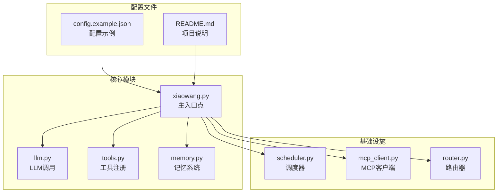
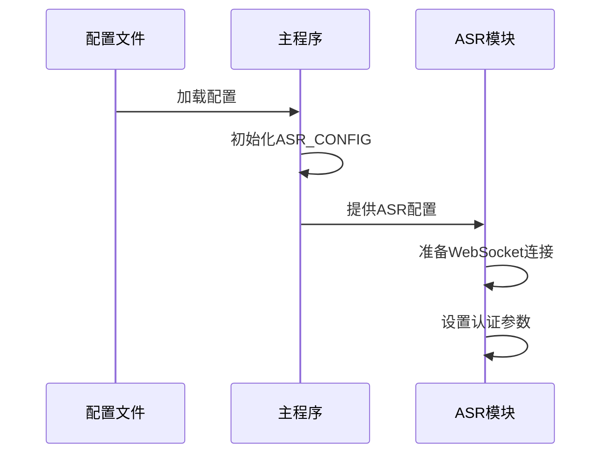
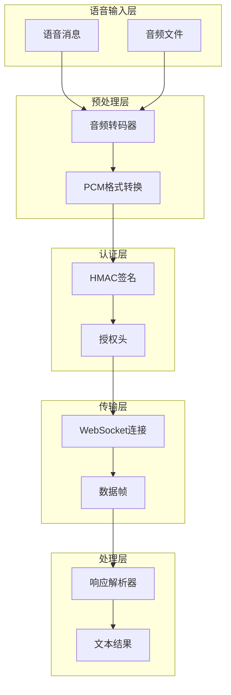
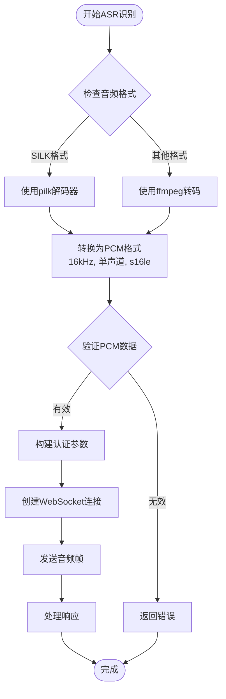
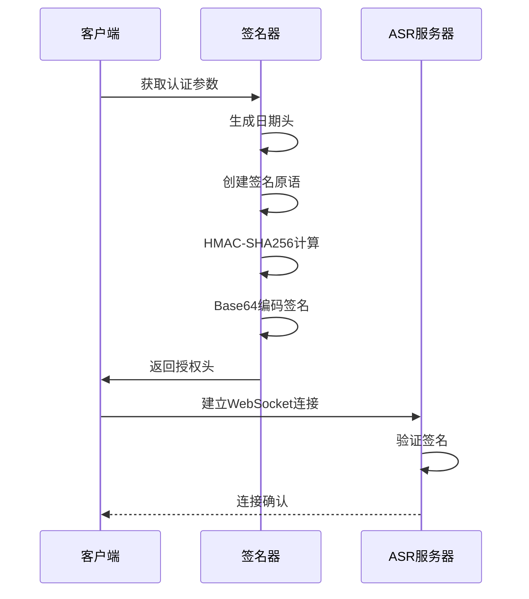
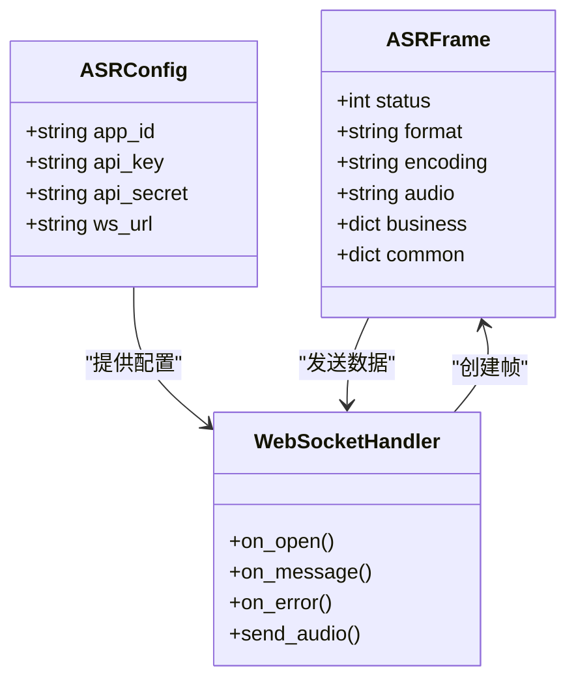
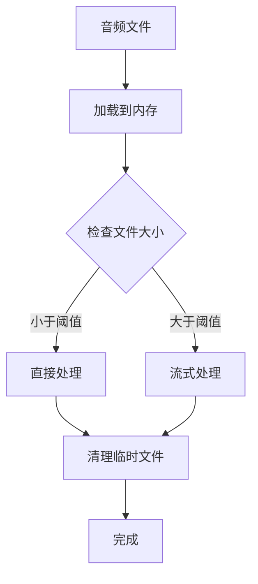
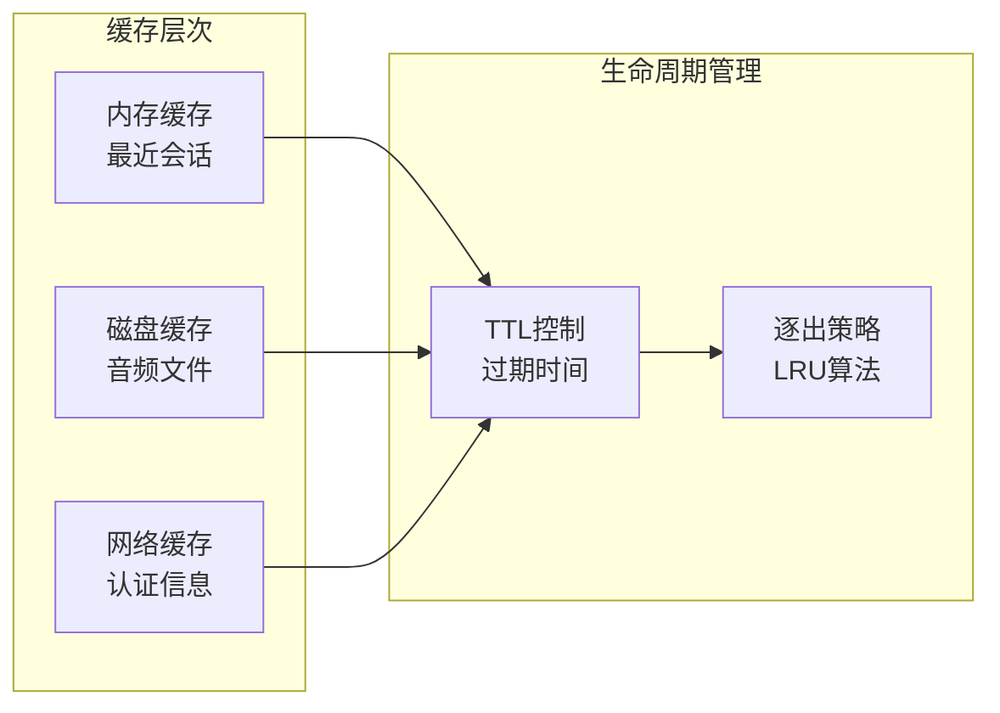
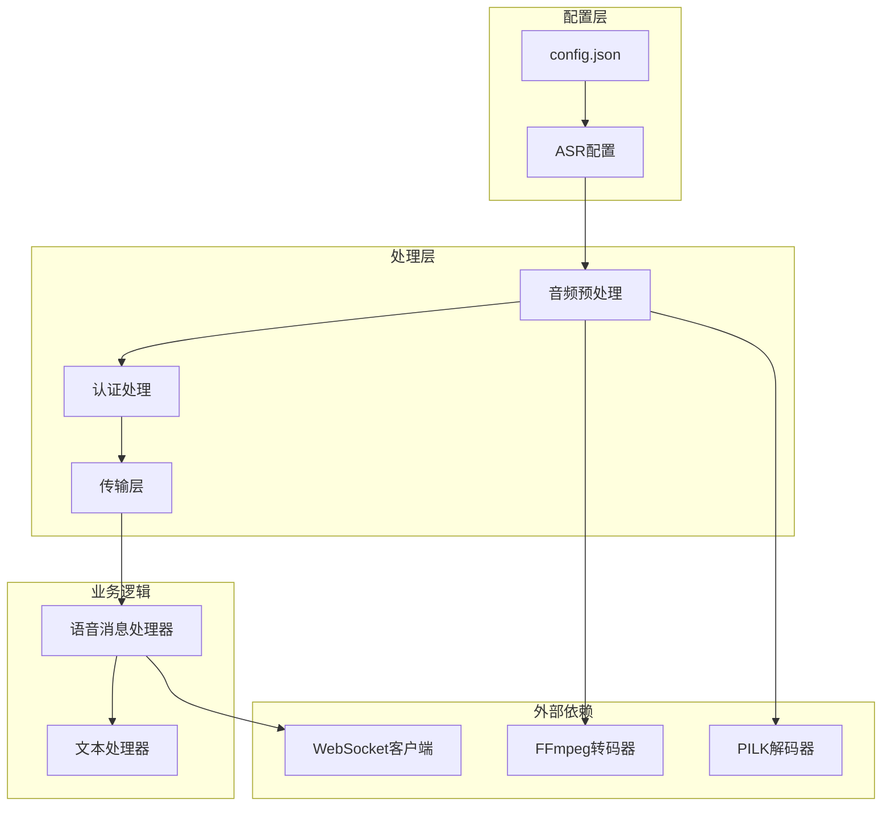
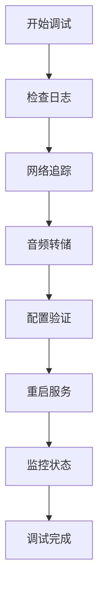

# 语音识别配置

<cite>
**本文档引用的文件**
- [README.md](file://README.md)
- [config.example.json](file://config.example.json)
- [xiaowang.py](file://xiaowang.py)
- [llm.py](file://llm.py)
- [tools.py](file://tools.py)
- [memory.py](file://memory.py)
- [router.py](file://router.py)
- [scheduler.py](file://scheduler.py)
- [mcp_client.py](file://mcp_client.py)
- [self_check_tool.py](file://self_check_tool.py)
</cite>

## 目录
1. [简介](#简介)
2. [项目结构](#项目结构)
3. [核心组件](#核心组件)
4. [架构概览](#架构概览)
5. [详细组件分析](#详细组件分析)
6. [依赖关系分析](#依赖关系分析)
7. [性能考虑](#性能考虑)
8. [故障排除指南](#故障排除指南)
9. [结论](#结论)

## 简介

724 Office是一个基于纯Python构建的生产级AI代理系统，具有零框架依赖性。该系统包含完整的多模态功能，其中包括实时语音识别（ASR）能力。本文档专注于语音识别配置部分，详细解释ASR配置的作用和配置方法，包括应用ID（app_id）、API密钥（api_key）、API密钥（api_secret）和WebSocket端点（ws_url）等关键参数。

## 项目结构

724 Office项目采用模块化设计，主要文件包括：



**图表来源**
- [README.md:1-162](file://README.md#L1-L162)
- [config.example.json:1-61](file://config.example.json#L1-L61)

**章节来源**
- [README.md:1-162](file://README.md#L1-L162)
- [config.example.json:1-61](file://config.example.json#L1-L61)

## 核心组件

### ASR配置结构

ASR配置位于配置文件的`asr`部分，包含以下关键参数：

| 参数名称 | 类型 | 必需 | 描述 |
|---------|------|------|------|
| app_id | 字符串 | 是 | 应用程序标识符，用于身份验证 |
| api_key | 字符串 | 是 | API访问密钥 |
| api_secret | 字符串 | 是 | API密钥的加密密钥 |
| ws_url | 字符串 | 是 | WebSocket服务端点URL |

### ASR配置初始化

在主入口文件中，ASR配置通过以下方式初始化：



**图表来源**
- [xiaowang.py:137-138](file://xiaowang.py#L137-L138)

**章节来源**
- [config.example.json:39-44](file://config.example.json#L39-L44)
- [xiaowang.py:137-138](file://xiaowang.py#L137-L138)

## 架构概览

724 Office的ASR系统采用分层架构设计：



**图表来源**
- [xiaowang.py:140-285](file://xiaowang.py#L140-L285)

## 详细组件分析

### ASR识别流程

ASR识别过程包含多个关键步骤：

#### 1. 音频预处理

系统支持多种音频格式的自动检测和转换：



**图表来源**
- [xiaowang.py:140-285](file://xiaowang.py#L140-L285)

#### 2. 认证机制

ASR系统使用HMAC-SHA256进行安全认证：



**图表来源**
- [xiaowang.py:177-201](file://xiaowang.py#L177-L201)

#### 3. 实时流式传输

音频数据以8KB帧大小进行实时传输：



**图表来源**
- [xiaowang.py:207-277](file://xiaowang.py#L207-L277)

**章节来源**
- [xiaowang.py:140-285](file://xiaowang.py#L140-L285)

### 不同语音识别服务提供商配置

#### 1. 通用ASR配置模板

```json
{
  "asr": {
    "app_id": "YOUR_ASR_APP_ID",
    "api_key": "YOUR_ASR_API_KEY", 
    "api_secret": "YOUR_ASR_API_SECRET",
    "ws_url": "wss://asr-api.example.com/v2/asr"
  }
}
```

#### 2. 支持的音频格式

系统自动检测和处理以下音频格式：

| 音频格式 | 检测方法 | 转换目标 | 处理工具 |
|---------|---------|---------|---------|
| SILK | 文件头检查 | PCM 16kHz | pilk解码器 |
| 其他格式 | FFmpeg检测 | PCM 16kHz | ffmpeg转码器 |
| WAV | 扩展名识别 | PCM 16kHz | ffmpeg转码器 |
| MP3 | 扩展名识别 | PCM 16kHz | ffmpeg转码器 |

#### 3. WebSocket连接参数

| 参数 | 默认值 | 描述 |
|------|--------|------|
| 帧大小 | 8000字节 | 每帧8KB，模拟实时流 |
| 发送间隔 | 0.04秒 | 控制音频播放速度 |
| VAD超时 | 3000毫秒 | 语音活动检测超时 |
| 采样率 | 16000Hz | 标准语音识别采样率 |
| 通道数 | 1 | 单声道处理 |

**章节来源**
- [xiaowang.py:145-162](file://xiaowang.py#L145-L162)
- [xiaowang.py:232-265](file://xiaowang.py#L232-L265)

### 性能优化配置

#### 1. 内存管理优化



**图表来源**
- [xiaowang.py:168-176](file://xiaowang.py#L168-L176)

#### 2. 并发处理优化

系统采用多线程架构确保高并发处理能力：

- **音频转码线程**：独立处理音频格式转换
- **WebSocket线程**：专门负责实时音频传输
- **回调线程**：处理ASR响应和结果解析
- **错误处理线程**：监控连接状态和异常情况

#### 3. 缓存策略



**章节来源**
- [xiaowang.py:168-176](file://xiaowang.py#L168-L176)
- [xiaowang.py:204-206](file://xiaowang.py#L204-L206)

## 依赖关系分析

### 组件间依赖关系



**图表来源**
- [xiaowang.py:137-285](file://xiaowang.py#L137-L285)

### 外部依赖分析

| 依赖项 | 版本要求 | 用途 | 可选性 |
|-------|---------|------|-------|
| websocket-client | 最新版本 | WebSocket通信 | 必需 |
| ffmpeg | 4.0+ | 音频转码 | 推荐 |
| pilk | 0.1+ | SILK格式解码 | 可选 |
| croniter | 1.0+ | 调度任务 | 可选 |
| lancedb | 0.1+ | 向量数据库 | 可选 |

**章节来源**
- [README.md:114-117](file://README.md#L114-L117)
- [xiaowang.py:28-29](file://xiaowang.py#L28-L29)

## 性能考虑

### 1. 实时性能指标

- **延迟目标**：< 5秒的端到端延迟
- **吞吐量**：支持同时处理多个ASR请求
- **资源占用**：单实例内存占用 < 2GB
- **CPU使用率**：音频转码期间 < 80%

### 2. 网络优化

- **连接池**：复用WebSocket连接减少握手开销
- **压缩传输**：启用WebSocket压缩减少带宽占用
- **断线重连**：自动重连机制保证服务连续性
- **超时设置**：合理的超时配置避免资源泄露

### 3. 存储优化

- **临时文件管理**：及时清理转码产生的临时文件
- **内存映射**：大文件采用内存映射提高I/O效率
- **批量处理**：合并小文件减少系统调用次数

## 故障排除指南

### 常见问题及解决方案

#### 1. 认证失败

**症状**：ASR连接建立后立即断开，返回认证错误

**可能原因**：
- app_id配置错误
- api_key格式不正确
- api_secret与api_key不匹配
- 时间同步问题导致签名过期

**解决步骤**：
1. 验证配置文件中的ASR参数
2. 检查API密钥的有效期
3. 确认系统时间同步
4. 查看详细的错误日志

#### 2. 音频转码失败

**症状**：音频文件无法转换为PCM格式

**可能原因**：
- ffmpeg未安装或版本过低
- 音频格式不受支持
- 磁盘空间不足
- 权限问题

**解决步骤**：
1. 安装并验证ffmpeg安装
2. 检查音频文件完整性
3. 确保有足够的磁盘空间
4. 验证文件读写权限

#### 3. WebSocket连接超时

**症状**：连接建立但无法发送音频数据

**可能原因**：
- 网络防火墙阻断
- 代理服务器配置错误
- 服务器负载过高
- SSL证书问题

**解决步骤**：
1. 检查网络连通性
2. 验证代理配置
3. 监控服务器资源使用
4. 验证SSL证书有效性

### 调试工具

系统提供了多种调试工具来帮助诊断问题：



**章节来源**
- [xiaowang.py:278-284](file://xiaowang.py#L278-L284)

## 结论

724 Office的ASR配置系统提供了完整、灵活且高性能的语音识别解决方案。通过合理的配置管理和优化策略，系统能够满足生产环境的各种需求。

### 关键优势

1. **零框架依赖**：完全基于标准库实现，部署简单
2. **多格式支持**：自动检测和处理多种音频格式
3. **实时性能**：优化的流式传输确保低延迟
4. **安全可靠**：完善的认证机制和错误处理
5. **易于扩展**：模块化设计便于功能扩展

### 最佳实践建议

1. **配置管理**：使用环境变量管理敏感配置
2. **监控告警**：建立完善的性能监控体系
3. **备份策略**：定期备份重要的配置和数据
4. **测试验证**：在生产部署前进行全面的功能测试
5. **文档维护**：保持配置文档的及时更新

通过遵循本文档的指导和最佳实践，您可以成功部署和维护724 Office的语音识别功能，为用户提供高质量的语音交互体验。