# 配置管理

<cite>
**本文档引用的文件**
- [config.example.json](file://config.example.json)
- [xiaowang.py](file://xiaowang.py)
- [llm.py](file://llm.py)
- [memory.py](file://memory.py)
- [mcp_client.py](file://mcp_client.py)
- [tools.py](file://tools.py)
- [router.py](file://router.py)
</cite>

## 目录
1. [简介](#简介)
2. [项目结构](#项目结构)
3. [核心配置组件](#核心配置组件)
4. [架构概览](#架构概览)
5. [详细组件分析](#详细组件分析)
6. [依赖关系分析](#依赖关系分析)
7. [性能考虑](#性能考虑)
8. [故障排除指南](#故障排除指南)
9. [结论](#结论)

## 简介

724 Office是一个基于Python构建的智能办公助手系统，采用模块化设计，支持多平台消息集成、语音识别、内存管理和MCP服务器扩展。本项目的核心特性包括：

- **多模型支持**：支持多个LLM提供商（DeepSeek、OpenAI等）
- **多平台消息集成**：支持企业微信、个人微信等多种消息平台
- **智能记忆系统**：基于向量数据库的记忆存储和检索
- **MCP服务器扩展**：通过MCP协议连接外部工具服务器
- **语音识别**：WebSocket流式ASR支持
- **容器化部署**：支持Docker多租户路由

## 项目结构

724 Office项目采用清晰的模块化架构，每个模块负责特定的功能领域：

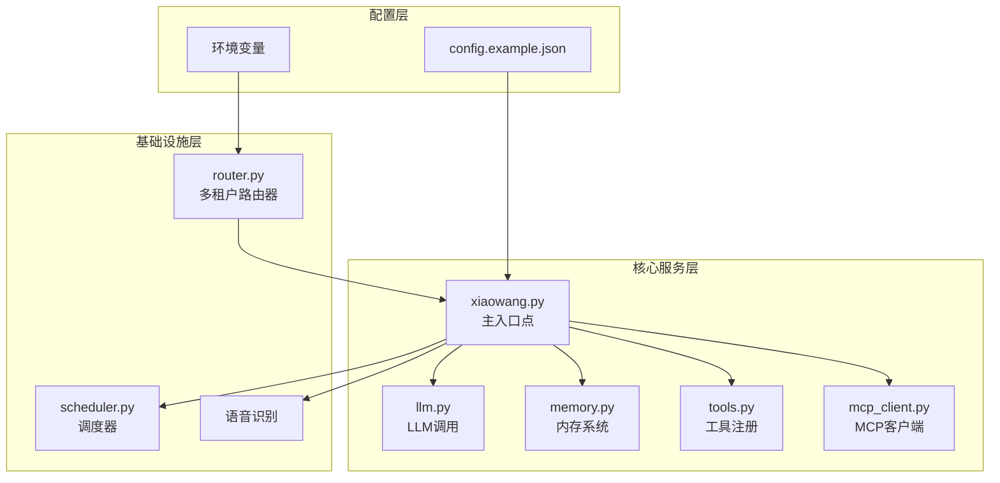

**图表来源**
- [config.example.json:1-61](file://config.example.json#L1-L61)
- [xiaowang.py:35-75](file://xiaowang.py#L35-L75)

**章节来源**
- [config.example.json:1-61](file://config.example.json#L1-L61)
- [xiaowang.py:1-626](file://xiaowang.py#L1-L626)

## 核心配置组件

### 主配置文件结构

配置文件采用JSON格式，包含以下主要部分：

#### 基础配置
- **models**: LLM模型配置
- **messaging**: 消息平台配置
- **owner_ids**: 系统所有者ID列表
- **workspace**: 工作空间路径
- **port**: 服务端口
- **debounce_seconds**: 消息去抖动时间间隔

#### 内存系统配置
- **memory.enabled**: 是否启用内存系统
- **memory.embedding_api**: 嵌入向量API配置
- **memory.retrieve_top_k**: 检索结果数量
- **memory.similarity_threshold**: 相似度阈值

#### 语音识别配置
- **asr.app_id**: 应用ID
- **asr.api_key**: API密钥
- **asr.api_secret**: API密钥
- **asr.ws_url**: WebSocket URL

#### 扩展功能配置
- **video_api**: 视频生成API配置
- **tavily_api_key**: Tavily搜索API密钥
- **search_api_key**: 通用搜索API密钥
- **mcp_servers**: MCP服务器配置

**章节来源**
- [config.example.json:1-61](file://config.example.json#L1-L61)

## 架构概览

724 Office采用分层架构设计，各层职责明确：

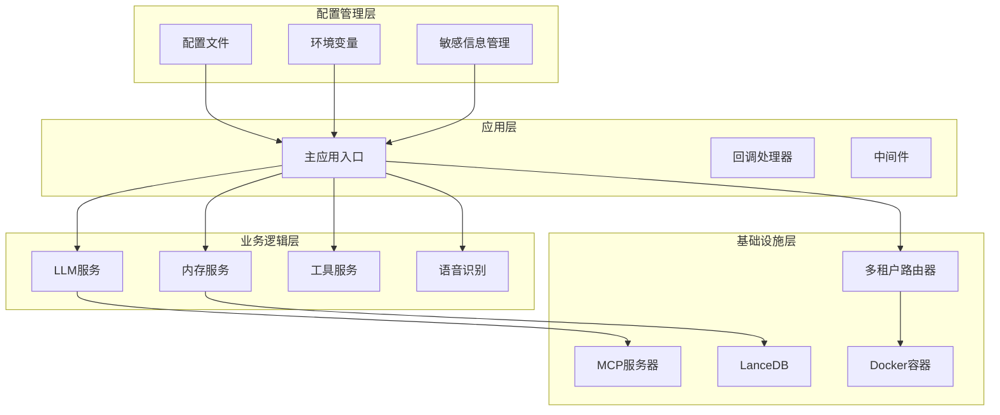

**图表来源**
- [xiaowang.py:35-75](file://xiaowang.py#L35-L75)
- [llm.py:33-401](file://llm.py#L33-L401)
- [memory.py:40-86](file://memory.py#L40-L86)

## 详细组件分析

### 模型配置（Models）

模型配置支持多提供商切换，具有以下特点：

#### 配置结构
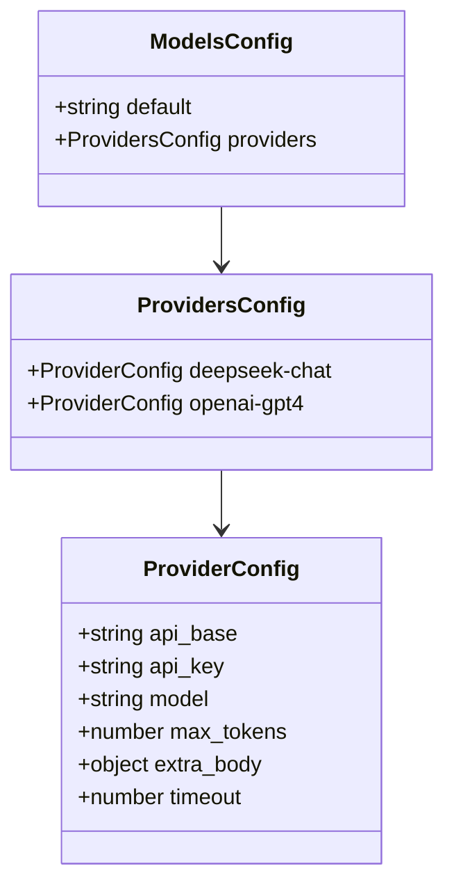

**图表来源**
- [config.example.json:2-18](file://config.example.json#L2-L18)
- [llm.py:45-83](file://llm.py#L45-L83)

#### 关键参数说明

| 参数名 | 类型 | 必需 | 默认值 | 描述 |
|--------|------|------|--------|------|
| default | string | 是 | - | 默认使用的模型名称 |
| api_base | string | 是 | - | LLM API的基础URL |
| api_key | string | 是 | - | API访问密钥 |
| model | string | 是 | - | 具体的模型标识符 |
| max_tokens | integer | 否 | 8192 | 最大生成token数 |
| extra_body | object | 否 | {} | 额外的请求参数 |
| timeout | integer | 否 | 120 | 请求超时时间（秒） |

#### 动态模型切换机制

系统支持运行时模型切换，通过以下流程实现：

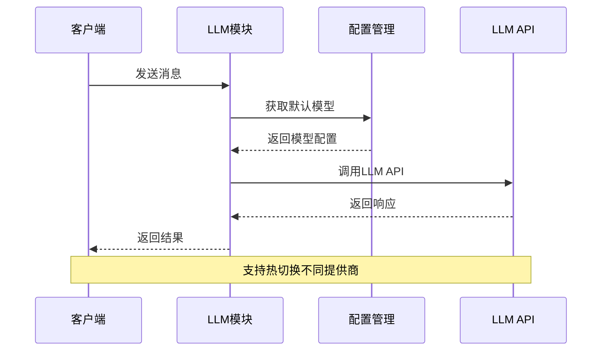

**图表来源**
- [llm.py:45-83](file://llm.py#L45-L83)

**章节来源**
- [config.example.json:2-18](file://config.example.json#L2-L18)
- [llm.py:33-83](file://llm.py#L33-L83)

### 消息平台配置（Messaging）

消息平台配置支持多种消息渠道的统一接入：

#### 配置结构
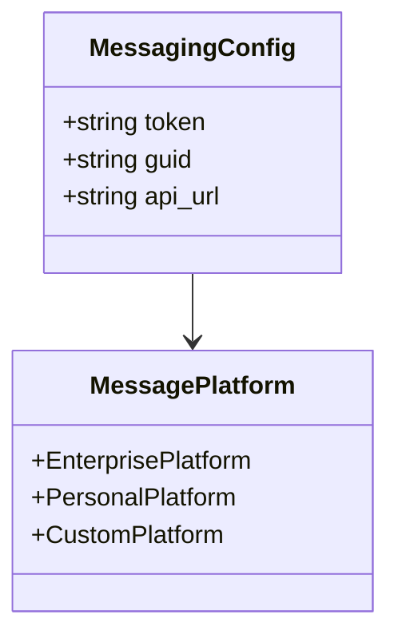

**图表来源**
- [config.example.json:19-23](file://config.example.json#L19-L23)

#### 支持的消息类型

| 消息类型 | 描述 | 处理方式 |
|----------|------|----------|
| 文本消息 | 纯文本内容 | 直接转发到LLM |
| 图片消息 | 图片文件 | 下载后转为视觉输入 |
| 视频消息 | 视频文件 | 下载后转为多媒体处理 |
| 文件消息 | 各类文件 | 下载后转为文件工具 |
| 语音消息 | 音频文件 | 下载后转ASR识别 |
| 链接消息 | 网页链接 | 提取标题和描述 |
| 位置消息 | 地理位置 | 提取地点信息 |

#### 单用户模式控制

系统支持单用户模式，通过`owner_ids`配置限制访问权限：

**图表来源**
- [xiaowang.py:340-342](file://xiaowang.py#L340-L342)

**章节来源**
- [config.example.json:19-23](file://config.example.json#L19-L23)
- [xiaowang.py:339-362](file://xiaowang.py#L339-L362)

### 内存系统配置（Memory）

内存系统采用三层处理管道，支持长期记忆存储和检索：

#### 配置结构
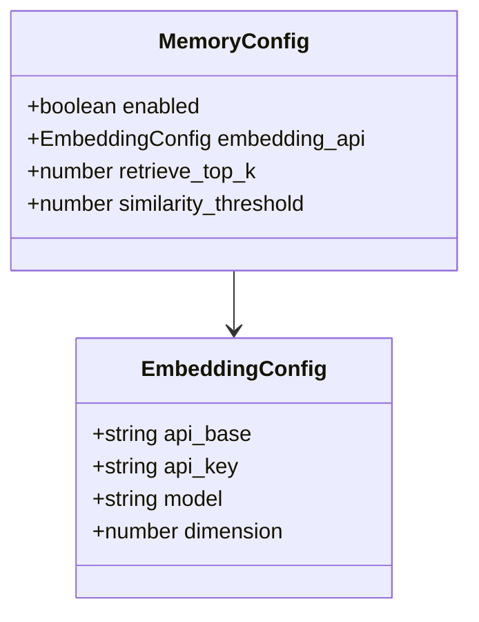

**图表来源**
- [config.example.json:28-38](file://config.example.json#L28-L38)
- [memory.py:40-86](file://memory.py#L40-L86)

#### 三层处理管道

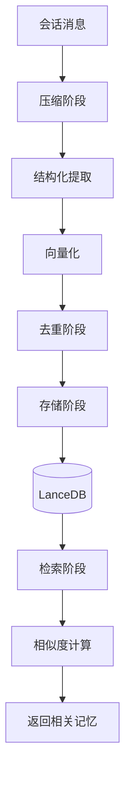

**图表来源**
- [memory.py:194-282](file://memory.py#L194-L282)

#### 关键配置参数

| 参数名 | 类型 | 必需 | 默认值 | 描述 |
|--------|------|------|--------|------|
| enabled | boolean | 否 | false | 是否启用内存系统 |
| embedding_api.api_base | string | 是 | - | 嵌入向量API基础URL |
| embedding_api.api_key | string | 是 | - | 嵌入向量API密钥 |
| embedding_api.model | string | 否 | "text-embedding-3-small" | 嵌入模型名称 |
| embedding_api.dimension | integer | 否 | 1024 | 向量维度 |
| retrieve_top_k | integer | 否 | 5 | 检索返回数量 |
| similarity_threshold | number | 否 | 0.92 | 相似度阈值 |

#### 记忆压缩流程

系统自动压缩长时间对话为结构化记忆：

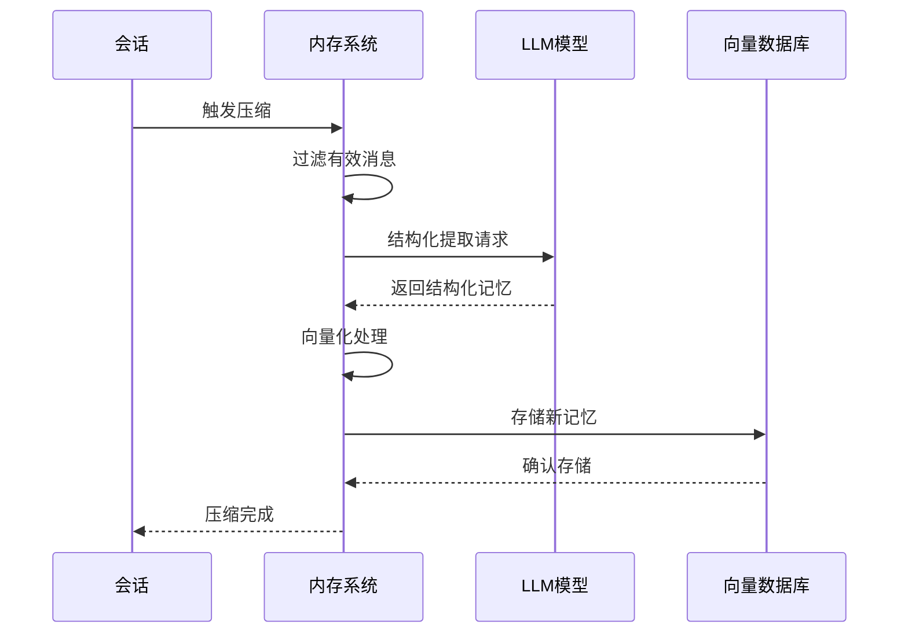

**图表来源**
- [memory.py:294-361](file://memory.py#L294-L361)

**章节来源**
- [config.example.json:28-38](file://config.example.json#L28-L38)
- [memory.py:40-187](file://memory.py#L40-L187)

### 语音识别配置（ASR）

语音识别系统支持WebSocket流式识别，适用于实时语音转文字：

#### 配置结构
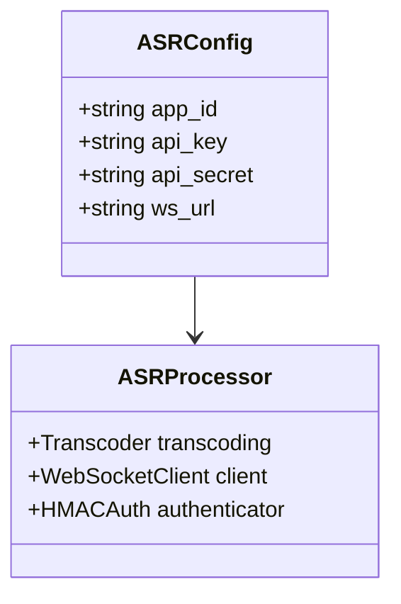

**图表来源**
- [config.example.json:39-44](file://config.example.json#L39-L44)
- [xiaowang.py:140-284](file://xiaowang.py#L140-L284)

#### ASR处理流程

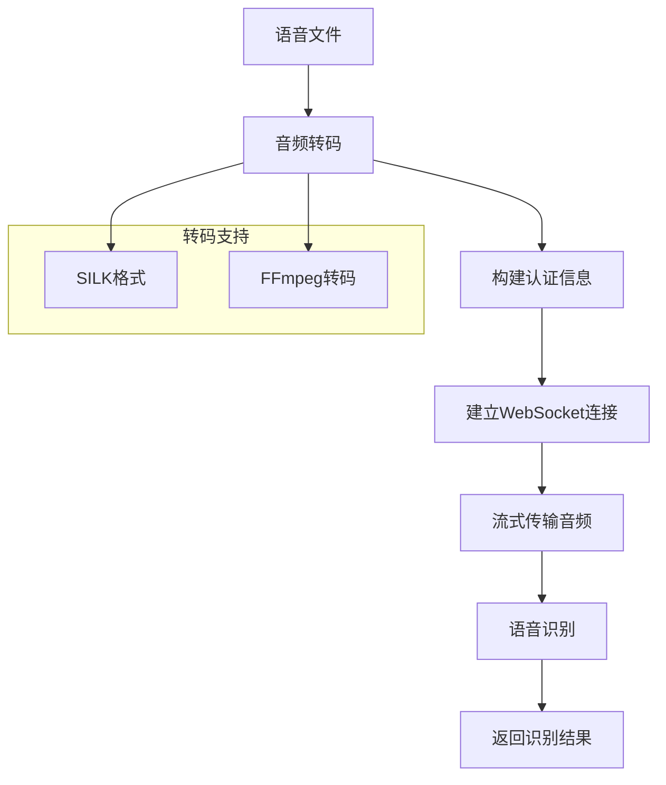

**图表来源**
- [xiaowang.py:140-284](file://xiaowang.py#L140-L284)

#### 认证机制

ASR使用HMAC-SHA256签名进行安全认证：

| 认证要素 | 用途 | 生成方式 |
|----------|------|----------|
| app_id | 应用标识 | 配置文件中的应用ID |
| api_key | API密钥 | 配置文件中的API密钥 |
| api_secret | 密钥 | 配置文件中的API密钥 |
| date | 时间戳 | 当前UTC时间 |
| signature | 签名 | HMAC-SHA256计算 |

**章节来源**
- [config.example.json:39-44](file://config.example.json#L39-L44)
- [xiaowang.py:140-284](file://xiaowang.py#L140-L284)

### MCP服务器配置（MCP Servers）

MCP（Model Context Protocol）服务器配置支持外部工具扩展：

#### 配置结构
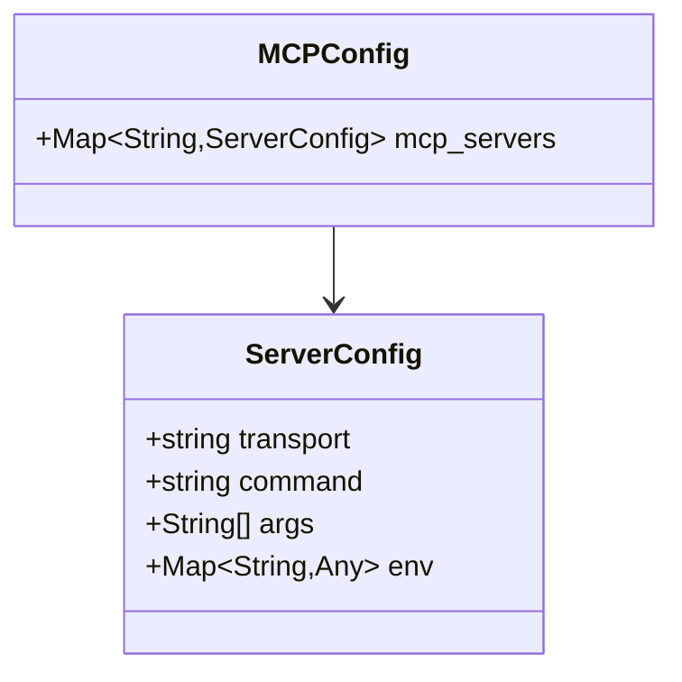

**图表来源**
- [config.example.json:52-59](file://config.example.json#L52-L59)
- [mcp_client.py:27-48](file://mcp_client.py#L27-L48)

#### 支持的传输方式

| 传输方式 | 描述 | 使用场景 |
|----------|------|----------|
| stdio | 标准输入输出 | 本地进程通信 |
| http | HTTP协议 | 远程服务器通信 |

#### MCP协议实现

系统实现了MCP协议的核心方法：

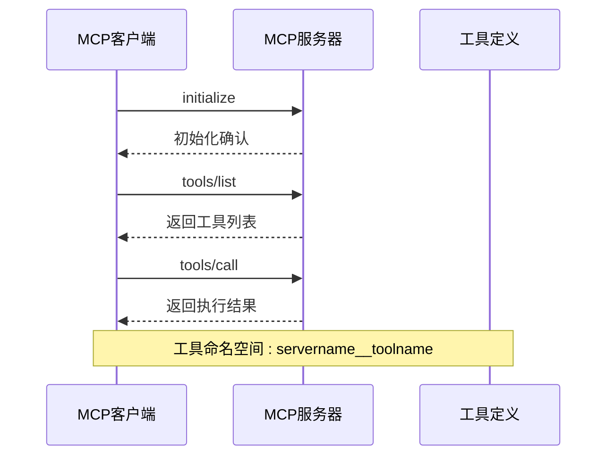

**图表来源**
- [mcp_client.py:191-242](file://mcp_client.py#L191-L242)

#### 热重载机制

系统支持MCP服务器的热重载：

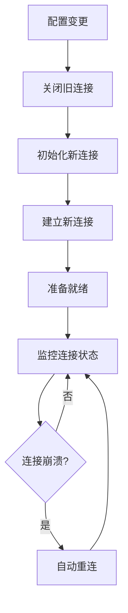

**图表来源**
- [mcp_client.py:312-322](file://mcp_client.py#L312-L322)

**章节来源**
- [config.example.json:52-59](file://config.example.json#L52-L59)
- [mcp_client.py:27-334](file://mcp_client.py#L27-L334)

## 依赖关系分析

### 配置依赖图

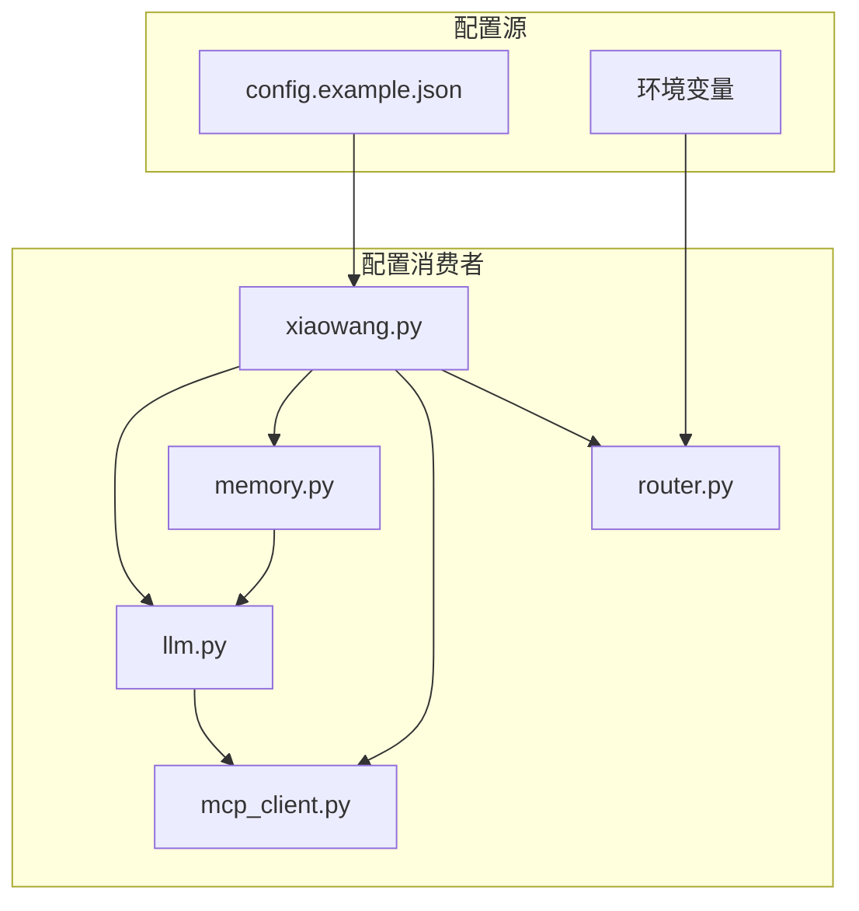

**图表来源**
- [xiaowang.py:35-75](file://xiaowang.py#L35-L75)
- [llm.py:33-401](file://llm.py#L33-L401)
- [memory.py:40-361](file://memory.py#L40-L361)
- [mcp_client.py:272-334](file://mcp_client.py#L272-L334)
- [router.py:23-42](file://router.py#L23-L42)

### 配置加载流程

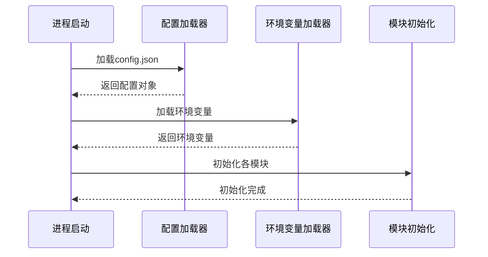

**图表来源**
- [xiaowang.py:38-75](file://xiaowang.py#L38-L75)

**章节来源**
- [xiaowang.py:35-75](file://xiaowang.py#L35-L75)
- [router.py:467-493](file://router.py#L467-L493)

## 性能考虑

### 配置性能优化

1. **缓存策略**
   - LLM响应缓存
   - 工具调用结果缓存
   - 消息去抖动减少重复处理

2. **异步处理**
   - 内存压缩后台线程
   - 文件下载异步处理
   - WebSocket流式识别

3. **资源管理**
   - 连接池管理
   - 内存使用监控
   - 超时控制机制

### 配置最佳实践

- **模型选择**：根据任务复杂度选择合适的模型
- **超时设置**：合理设置API调用超时时间
- **并发控制**：限制同时进行的任务数量
- **错误重试**：实现指数退避重试机制

## 故障排除指南

### 常见配置问题

#### LLM模型配置问题
- **问题**：API密钥无效
- **解决方案**：检查API密钥格式和有效期
- **验证方法**：测试API连通性

#### 内存系统问题
- **问题**：向量数据库初始化失败
- **解决方案**：检查数据库路径权限和磁盘空间
- **验证方法**：查看日志错误信息

#### MCP服务器问题
- **问题**：服务器连接失败
- **解决方案**：检查服务器进程状态和网络连接
- **验证方法**：使用热重载功能重新连接

### 调试技巧

1. **启用详细日志**：设置日志级别为DEBUG
2. **监控资源使用**：观察CPU和内存使用情况
3. **检查网络连接**：验证API端点可达性
4. **验证配置格式**：确保JSON配置语法正确

**章节来源**
- [llm.py:74-82](file://llm.py#L74-L82)
- [memory.py:84-86](file://memory.py#L84-L86)
- [mcp_client.py:312-322](file://mcp_client.py#L312-L322)

## 结论

724 Office的配置管理系统提供了灵活而强大的配置管理能力，支持：

- **多模型支持**：轻松切换不同的LLM提供商
- **可扩展架构**：通过MCP协议扩展外部工具
- **智能记忆**：长期记忆存储和检索
- **多平台集成**：统一的消息平台接入
- **安全配置**：敏感信息保护和访问控制

系统的配置管理遵循以下原则：
- **模块化设计**：每个功能模块独立配置
- **环境隔离**：开发、测试、生产环境分离
- **安全优先**：敏感信息加密存储和传输
- **可观测性**：完善的日志和监控机制

通过合理的配置管理，724 Office能够适应各种应用场景，为企业提供智能化的办公助手服务。