# 配置管理

<cite>
**本文档引用的文件**
- [config.example.json](file://config.example.json)
- [xiaowang.py](file://xiaowang.py)
- [llm.py](file://llm.py)
- [memory.py](file://memory.py)
- [mcp_client.py](file://mcp_client.py)
- [tools.py](file://tools.py)
- [router.py](file://router.py)
- [config.js](file://NL2SQL/backend/src/core/config.js)
- [longTermMemory.js](file://NL2SQL/backend/src/memory/longTermMemory.js)
- [memoryMaintenance.js](file://NL2SQL/backend/src/memory/memoryMaintenance.js)
- [vectorStore.js](file://NL2SQL/backend/src/memory/vectorStore.js)
- [tokenBudget.js](file://NL2SQL/backend/src/utils/tokenBudget.js)
- [logger.js](file://NL2SQL/backend/src/utils/logger.js)
- [summarizer.js](file://NL2SQL/backend/src/memory/summarizer.js)
- [context-management.test.js](file://NL2SQL/backend/test/context-management.test.js)
</cite>

## 更新摘要
**变更内容**
- 新增上下文管理配置选项，支持令牌预算控制和对话摘要功能
- 新增trace级别日志配置，提供详细的流程追踪能力
- 扩展环境变量配置，支持动态上下文管理功能开关
- 新增令牌预算管理和对话摘要的详细配置说明

## 目录
1. [简介](#简介)
2. [项目结构](#项目结构)
3. [核心配置组件](#核心配置组件)
4. [架构概览](#架构概览)
5. [详细组件分析](#详细组件分析)
6. [依赖关系分析](#依赖关系分析)
7. [性能考虑](#性能考虑)
8. [故障排除指南](#故障排除指南)
9. [结论](#结论)

## 简介

724 Office是一个基于Python构建的智能办公助手系统，采用模块化设计，支持多平台消息集成、语音识别、内存管理和MCP服务器扩展。本项目的核心特性包括：

- **多模型支持**：支持多个LLM提供商（DeepSeek、OpenAI等）
- **多平台消息集成**：支持企业微信、个人微信等多种消息平台
- **智能记忆系统**：基于向量数据库的记忆存储和检索
- **长期记忆系统**：新增的Layer 2长期记忆管理，支持智能偏好提取和分级保留策略
- **MCP服务器扩展**：通过MCP协议连接外部工具服务器
- **语音识别**：WebSocket流式ASR支持
- **容器化部署**：支持Docker多租户路由
- **上下文管理**：新增的令牌预算控制和对话摘要功能
- **高级日志系统**：支持trace级别日志追踪

## 项目结构

724 Office项目采用清晰的模块化架构，每个模块负责特定的功能领域：

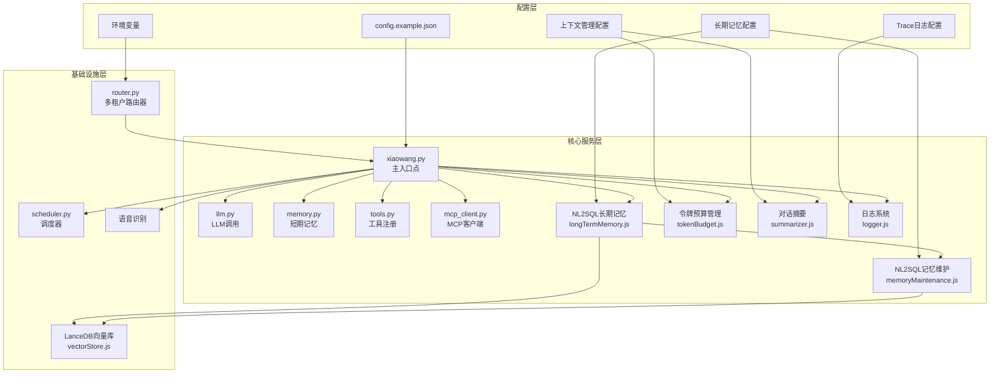
```mermaid
graph TB
subgraph "配置层"
Config[config.example.json]
Env[环境变量]
LongTermConfig[长期记忆配置]
ContextConfig[上下文管理配置]
TraceConfig[Trace日志配置]
end
subgraph "核心服务层"
Agent[xiaowang.py<br/>主入口点]
LLM[llm.py<br/>LLM调用]
Memory[memory.py<br/>短期记忆]
Tools[tools.py<br/>工具注册]
MCP[mcp_client.py<br/>MCP客户端]
LongTermMemory[NL2SQL长期记忆<br/>longTermMemory.js]
MemoryMaintenance[NL2SQL记忆维护<br/>memoryMaintenance.js]
TokenBudget[令牌预算管理<br/>tokenBudget.js]
Summarizer[对话摘要<br/>summarizer.js]
Logger[日志系统<br/>logger.js]
end
subgraph "基础设施层"
Router[router.py<br/>多租户路由器]
Scheduler[scheduler.py<br/>调度器]
ASR[语音识别]
VectorDB[LanceDB向量库<br/>vectorStore.js]
end
Config --> Agent
Env --> Router
LongTermConfig --> LongTermMemory
ContextConfig --> TokenBudget
ContextConfig --> Summarizer
TraceConfig --> Logger
LongTermConfig --> MemoryMaintenance
Agent --> LLM
Agent --> Memory
Agent --> Tools
Agent --> MCP
Agent --> LongTermMemory
Agent --> TokenBudget
Agent --> Summarizer
Agent --> Logger
LongTermMemory --> MemoryMaintenance
LongTermMemory --> VectorDB
MemoryMaintenance --> VectorDB
Agent --> Scheduler
Agent --> ASR
Router --> Agent
```

**图表来源**
- [config.example.json:1-61](file://config.example.json#L1-L61)
- [xiaowang.py:35-75](file://xiaowang.py#L35-L75)
- [config.js:247-333](file://NL2SQL/backend/src/core/config.js#L247-L333)
- [longTermMemory.js:1-50](file://NL2SQL/backend/src/memory/longTermMemory.js#L1-L50)
- [memoryMaintenance.js:1-10](file://NL2SQL/backend/src/memory/memoryMaintenance.js#L1-L10)
- [vectorStore.js:1-20](file://NL2SQL/backend/src/memory/vectorStore.js#L1-L20)
- [tokenBudget.js:1-392](file://NL2SQL/backend/src/utils/tokenBudget.js#L1-L392)
- [summarizer.js:1-518](file://NL2SQL/backend/src/memory/summarizer.js#L1-L518)
- [logger.js:1-442](file://NL2SQL/backend/src/utils/logger.js#L1-L442)

**章节来源**
- [config.example.json:1-61](file://config.example.json#L1-L61)
- [xiaowang.py:1-626](file://xiaowang.py#L1-L626)
- [config.js:247-333](file://NL2SQL/backend/src/core/config.js#L247-L333)

## 核心配置组件

### 主配置文件结构

配置文件采用JSON格式，包含以下主要部分：

#### 基础配置
- **models**: LLM模型配置
- **messaging**: 消息平台配置
- **owner_ids**: 系统所有者ID列表
- **workspace**: 工作空间路径
- **port**: 服务端口
- **debounce_seconds**: 消息去抖动时间间隔

#### 内存系统配置
- **memory.enabled**: 是否启用内存系统
- **memory.embedding_api**: 嵌入向量API配置
- **memory.retrieve_top_k**: 检索结果数量
- **memory.similarity_threshold**: 相似度阈值

#### 长期记忆系统配置（新增）
- **longTermMemory.enabled**: 是否启用长期记忆功能
- **longTermMemory.useLLMForExtraction**: 是否使用LLM进行智能提炼
- **longTermMemory.thresholds**: 存储筛选阈值配置
- **longTermMemory.retention**: 分级保留策略配置

#### 上下文管理配置（新增）
- **contextManagement.enableTokenBudget**: 是否启用令牌预算检查
- **contextManagement.enableSummarizer**: 是否启用对话摘要
- **contextManagement.tokenBudget**: 令牌预算详细配置
- **contextManagement.summarizer**: 对话摘要详细配置

#### 语音识别配置
- **asr.app_id**: 应用ID
- **asr.api_key**: API密钥
- **asr.api_secret**: API密钥
- **asr.ws_url**: WebSocket URL

#### 扩展功能配置
- **video_api**: 视频生成API配置
- **tavily_api_key**: Tavily搜索API密钥
- **search_api_key**: 通用搜索API密钥
- **mcp_servers**: MCP服务器配置

**章节来源**
- [config.example.json:1-61](file://config.example.json#L1-L61)
- [config.js:247-333](file://NL2SQL/backend/src/core/config.js#L247-L333)

## 架构概览

724 Office采用分层架构设计，各层职责明确，新增了上下文管理和高级日志系统的配置管理：

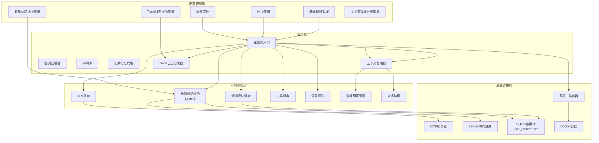
```mermaid
graph TB
subgraph "配置管理层"
Config[配置文件]
Env[环境变量]
Secrets[敏感信息管理]
LongTermEnv[长期记忆环境变量]
ContextEnv[上下文管理环境变量]
TraceEnv[Trace日志环境变量]
end
subgraph "应用层"
Main[主应用入口]
Handlers[回调处理器]
Middleware[中间件]
LongTermAgent[长期记忆代理]
ContextManager[上下文管理器]
TraceLogger[Trace日志记录器]
end
subgraph "业务逻辑层"
LLM[LLM服务]
Memory[短期记忆服务]
LongTermMemory[长期记忆服务<br/>Layer 2]
Tools[工具服务]
ASR[语音识别]
TokenBudget[令牌预算管理]
Summarizer[对话摘要]
end
subgraph "基础设施层"
MCP[MCP服务器]
VectorDB[LanceDB向量库]
DB[SQLite数据库<br/>user_preferences]
Docker[Docker容器]
Router[多租户路由器]
end
Config --> Main
Env --> Main
Secrets --> Main
LongTermEnv --> LongTermMemory
ContextEnv --> ContextManager
TraceEnv --> TraceLogger
Main --> LLM
Main --> Memory
Main --> LongTermMemory
Main --> Tools
Main --> ASR
Main --> ContextManager
Main --> TraceLogger
LongTermMemory --> DB
LongTermMemory --> VectorDB
ContextManager --> TokenBudget
ContextManager --> Summarizer
LLM --> MCP
Memory --> DB
Main --> Router
Router --> Docker
```

**图表来源**
- [xiaowang.py:35-75](file://xiaowang.py#L35-L75)
- [llm.py:33-401](file://llm.py#L33-L401)
- [memory.py:40-86](file://memory.py#L40-L86)
- [config.js:247-333](file://NL2SQL/backend/src/core/config.js#L247-L333)
- [longTermMemory.js:1-50](file://NL2SQL/backend/src/memory/longTermMemory.js#L1-L50)
- [memoryMaintenance.js:1-10](file://NL2SQL/backend/src/memory/memoryMaintenance.js#L1-L10)
- [tokenBudget.js:1-392](file://NL2SQL/backend/src/utils/tokenBudget.js#L1-L392)
- [summarizer.js:1-518](file://NL2SQL/backend/src/memory/summarizer.js#L1-L518)
- [logger.js:1-442](file://NL2SQL/backend/src/utils/logger.js#L1-L442)

## 详细组件分析

### 模型配置（Models）

模型配置支持多提供商切换，具有以下特点：

#### 配置结构
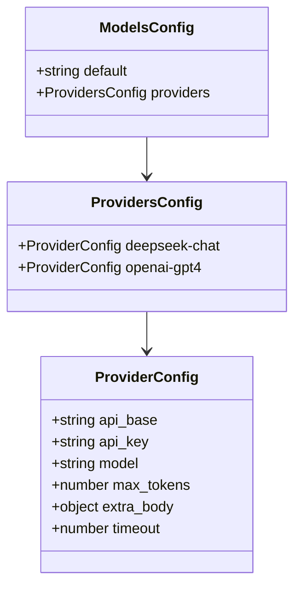
```mermaid
classDiagram
class ModelsConfig {
+string default
+ProvidersConfig providers
}
class ProvidersConfig {
+ProviderConfig deepseek-chat
+ProviderConfig openai-gpt4
}
class ProviderConfig {
+string api_base
+string api_key
+string model
+number max_tokens
+object extra_body
+number timeout
}
ModelsConfig --> ProvidersConfig
ProvidersConfig --> ProviderConfig
```

**图表来源**
- [config.example.json:2-18](file://config.example.json#L2-L18)
- [llm.py:45-83](file://llm.py#L45-L83)

#### 关键参数说明

| 参数名 | 类型 | 必需 | 默认值 | 描述 |
|--------|------|------|--------|------|
| default | string | 是 | - | 默认使用的模型名称 |
| api_base | string | 是 | - | LLM API的基础URL |
| api_key | string | 是 | - | API访问密钥 |
| model | string | 是 | - | 具体的模型标识符 |
| max_tokens | integer | 否 | 8192 | 最大生成token数 |
| extra_body | object | 否 | {} | 额外的请求参数 |
| timeout | integer | 否 | 120 | 请求超时时间（秒） |

#### 动态模型切换机制

系统支持运行时模型切换，通过以下流程实现：

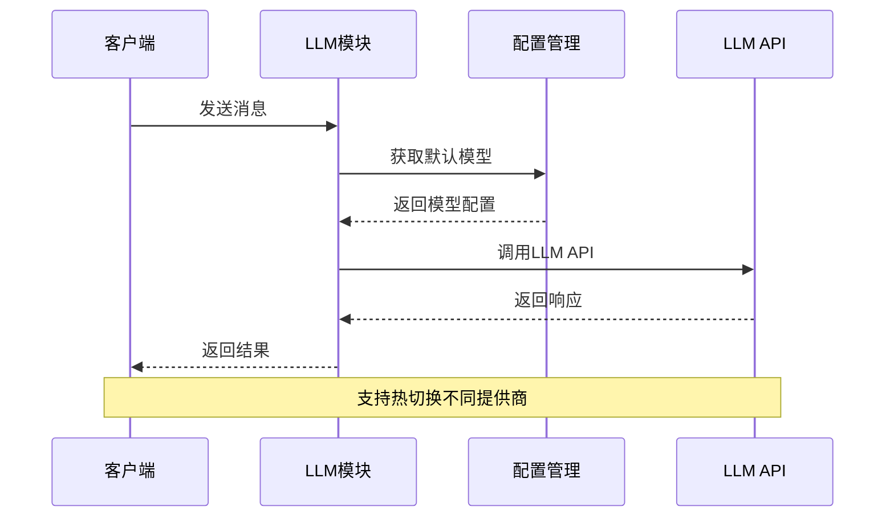
```mermaid
sequenceDiagram
participant Client as 客户端
participant LLM as LLM模块
participant Config as 配置管理
participant API as LLM API
Client->>LLM : 发送消息
LLM->>Config : 获取默认模型
Config-->>LLM : 返回模型配置
LLM->>API : 调用LLM API
API-->>LLM : 返回响应
LLM-->>Client : 返回结果
Note over Client,API : 支持热切换不同提供商
```

**图表来源**
- [llm.py:45-83](file://llm.py#L45-L83)

**章节来源**
- [config.example.json:2-18](file://config.example.json#L2-L18)
- [llm.py:33-83](file://llm.py#L33-L83)

### 消息平台配置（Messaging）

消息平台配置支持多种消息渠道的统一接入：

#### 配置结构
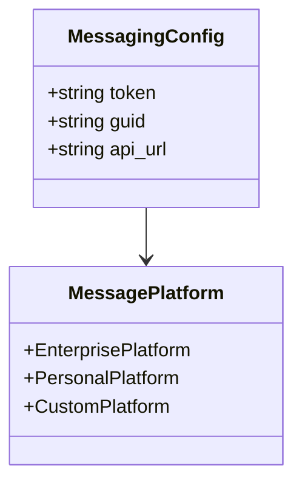
```mermaid
classDiagram
class MessagingConfig {
+string token
+string guid
+string api_url
}
class MessagePlatform {
+EnterprisePlatform
+PersonalPlatform
+CustomPlatform
}
MessagingConfig --> MessagePlatform
```

**图表来源**
- [config.example.json:19-23](file://config.example.json#L19-L23)

#### 支持的消息类型

| 消息类型 | 描述 | 处理方式 |
|----------|------|----------|
| 文本消息 | 纯文本内容 | 直接转发到LLM |
| 图片消息 | 图片文件 | 下载后转为视觉输入 |
| 视频消息 | 视频文件 | 下载后转为多媒体处理 |
| 文件消息 | 各类文件 | 下载后转为文件工具 |
| 语音消息 | 音频文件 | 下载后转ASR识别 |
| 链接消息 | 网页链接 | 提取标题和描述 |
| 位置消息 | 地理位置 | 提取地点信息 |

#### 单用户模式控制

系统支持单用户模式，通过`owner_ids`配置限制访问权限：

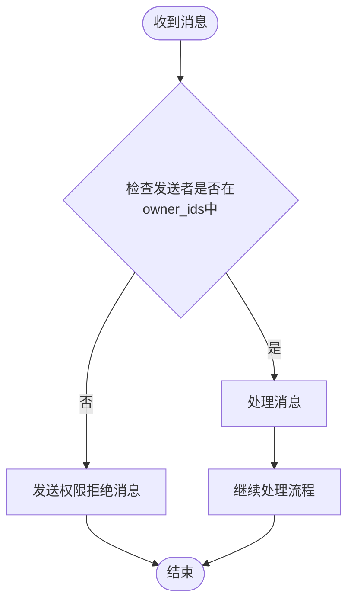
```mermaid
flowchart TD
Start([收到消息]) --> CheckOwner{"检查发送者是否在owner_ids中"}
CheckOwner --> |是| ProcessMessage["处理消息"]
CheckOwner --> |否| SendDenied["发送权限拒绝消息"]
ProcessMessage --> Continue["继续处理流程"]
SendDenied --> End([结束])
Continue --> End
```

**图表来源**
- [xiaowang.py:340-342](file://xiaowang.py#L340-L342)

**章节来源**
- [config.example.json:19-23](file://config.example.json#L19-L23)
- [xiaowang.py:339-362](file://xiaowang.py#L339-L362)

### 内存系统配置（Memory）

内存系统采用三层处理管道，支持长期记忆存储和检索：

#### 配置结构
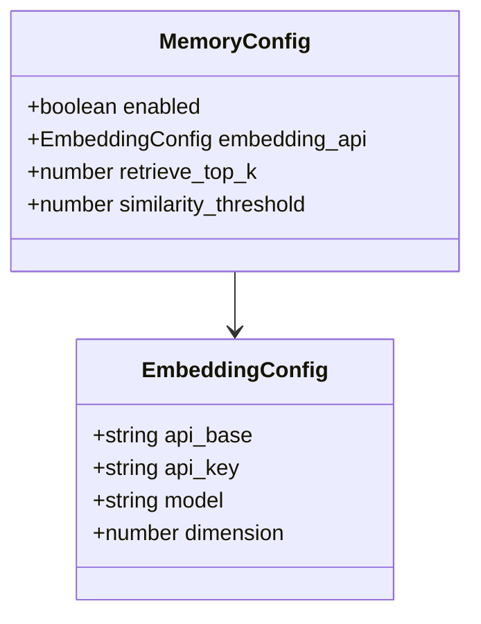
```mermaid
classDiagram
class MemoryConfig {
+boolean enabled
+EmbeddingConfig embedding_api
+number retrieve_top_k
+number similarity_threshold
}
class EmbeddingConfig {
+string api_base
+string api_key
+string model
+number dimension
}
MemoryConfig --> EmbeddingConfig
```

**图表来源**
- [config.example.json:28-38](file://config.example.json#L28-L38)
- [memory.py:40-86](file://memory.py#L40-L86)

#### 三层处理管道

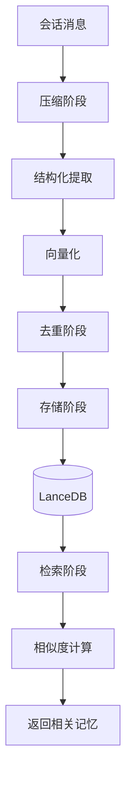
```mermaid
flowchart TD
Input[会话消息] --> Compress[压缩阶段]
Compress --> Extract[结构化提取]
Extract --> Vectorize[向量化]
Vectorize --> Deduplicate[去重阶段]
Deduplicate --> Store[存储阶段]
Store --> DB[(LanceDB)]
DB --> Retrieve[检索阶段]
Retrieve --> Similarity[相似度计算]
Similarity --> Return[返回相关记忆]
```

**图表来源**
- [memory.py:194-282](file://memory.py#L194-L282)

#### 关键配置参数

| 参数名 | 类型 | 必需 | 默认值 | 描述 |
|--------|------|------|--------|------|
| enabled | boolean | 否 | false | 是否启用内存系统 |
| embedding_api.api_base | string | 是 | - | 嵌入向量API基础URL |
| embedding_api.api_key | string | 是 | - | 嵌入向量API密钥 |
| embedding_api.model | string | 否 | "text-embedding-3-small" | 嵌入模型名称 |
| embedding_api.dimension | integer | 否 | 1024 | 向量维度 |
| retrieve_top_k | integer | 否 | 5 | 检索返回数量 |
| similarity_threshold | number | 否 | 0.92 | 相似度阈值 |

#### 记忆压缩流程

系统自动压缩长时间对话为结构化记忆：

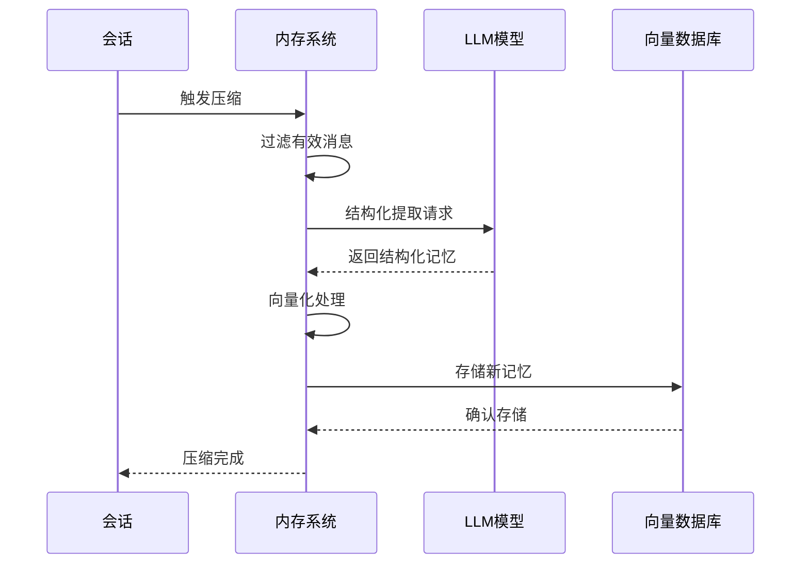
```mermaid
sequenceDiagram
participant Session as 会话
participant Memory as 内存系统
participant LLM as LLM模型
participant VectorDB as 向量数据库
Session->>Memory : 触发压缩
Memory->>Memory : 过滤有效消息
Memory->>LLM : 结构化提取请求
LLM-->>Memory : 返回结构化记忆
Memory->>Memory : 向量化处理
Memory->>VectorDB : 存储新记忆
VectorDB-->>Memory : 确认存储
Memory-->>Session : 压缩完成
```

**图表来源**
- [memory.py:294-361](file://memory.py#L294-L361)

**章节来源**
- [config.example.json:28-38](file://config.example.json#L28-L38)
- [memory.py:40-187](file://memory.py#L40-L187)

### 长期记忆系统配置（新增）

长期记忆系统是NL2SQL模块的Layer 2功能，专门负责用户长期记忆的提取、存储、检索和维护。

#### 配置结构
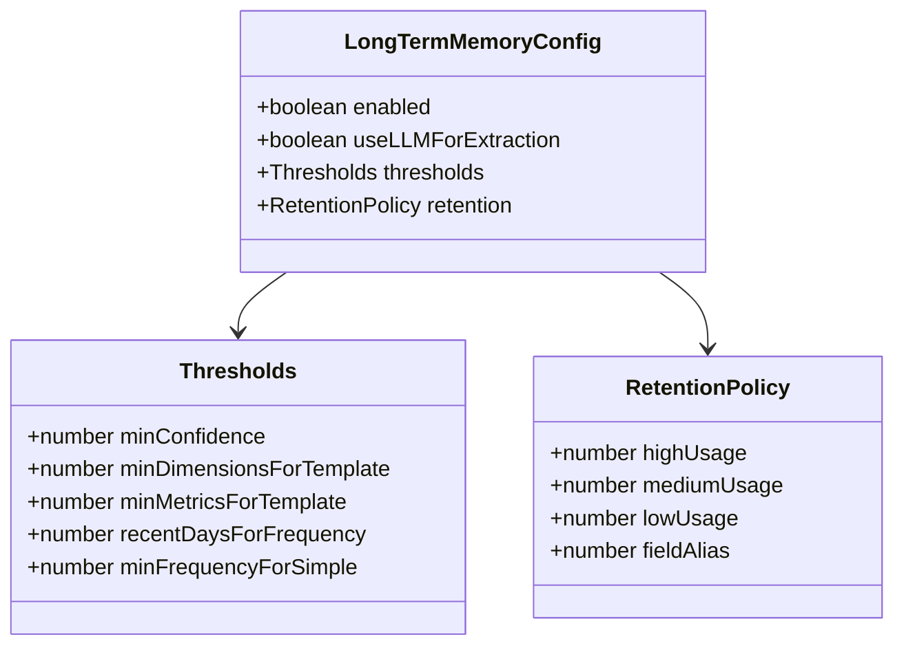
```mermaid
classDiagram
class LongTermMemoryConfig {
+boolean enabled
+boolean useLLMForExtraction
+Thresholds thresholds
+RetentionPolicy retention
}
class Thresholds {
+number minConfidence
+number minDimensionsForTemplate
+number minMetricsForTemplate
+number recentDaysForFrequency
+number minFrequencyForSimple
}
class RetentionPolicy {
+number highUsage
+number mediumUsage
+number lowUsage
+number fieldAlias
}
LongTermMemoryConfig --> Thresholds
LongTermMemoryConfig --> RetentionPolicy
```

**图表来源**
- [config.js:254-288](file://NL2SQL/backend/src/core/config.js#L254-L288)
- [longTermMemory.js:26-41](file://NL2SQL/backend/src/memory/longTermMemory.js#L26-L41)

#### 关键配置参数

| 参数名 | 类型 | 必需 | 默认值 | 描述 |
|--------|------|------|--------|------|
| enabled | boolean | 否 | true | 是否启用长期记忆功能 |
| useLLMForExtraction | boolean | 否 | false | 是否使用LLM进行智能提炼 |
| thresholds.minConfidence | number | 否 | 0.7 | 最小置信度阈值 |
| thresholds.minDimensionsForTemplate | number | 否 | 2 | 高价值模板最小维度数 |
| thresholds.minMetricsForTemplate | number | 否 | 1 | 高价值模板最小指标数 |
| thresholds.recentDaysForFrequency | number | 否 | 7 | 频率判断天数 |
| thresholds.minFrequencyForSimple | number | 否 | 2 | 简单查询最小频率 |
| retention.highUsage | number/null | 否 | null | 高频使用保留天数（永久） |
| retention.mediumUsage | number | 否 | 90 | 中频使用保留天数 |
| retention.lowUsage | number | 否 | 30 | 低频使用保留天数 |
| retention.fieldAlias | number | 否 | 365 | 字段别名保留天数 |

#### 环境变量支持

长期记忆系统支持通过环境变量进行动态配置：

| 环境变量名 | 默认值 | 描述 |
|------------|--------|------|
| LTM_ENABLED | 不等于'false' | 控制长期记忆功能启用状态 |
| LTM_USE_LLM | false | 控制是否使用LLM智能提炼 |

#### 存储筛选策略

长期记忆系统采用多层筛选机制：

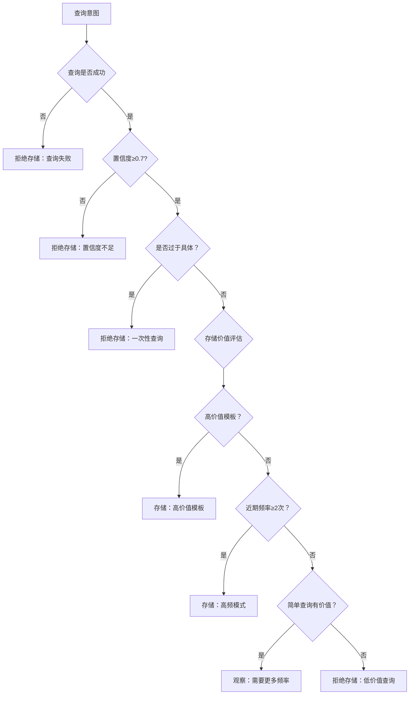
```mermaid
flowchart TD
Input[查询意图] --> SuccessCheck{"查询是否成功"}
SuccessCheck --> |否| Reject1["拒绝存储：查询失败"]
SuccessCheck --> |是| ConfidenceCheck{"置信度≥0.7?"}
ConfidenceCheck --> |否| Reject2["拒绝存储：置信度不足"]
ConfidenceCheck --> |是| SpecificCheck{"是否过于具体？"}
SpecificCheck --> |是| Reject3["拒绝存储：一次性查询"]
SpecificCheck --> |否| StorageDecision{"存储价值评估"}
StorageDecision --> HighValue{"高价值模板？"}
HighValue --> |是| Store1["存储：高价值模板"]
HighValue --> |否| FrequencyCheck{"近期频率≥2次？"}
FrequencyCheck --> |是| Store2["存储：高频模式"]
FrequencyCheck --> |否| SimpleCheck{"简单查询有价值？"}
SimpleCheck --> |是| Observe["观察：需要更多频率"]
SimpleCheck --> |否| Reject4["拒绝存储：低价值查询"]
```

**图表来源**
- [longTermMemory.js:251-295](file://NL2SQL/backend/src/memory/longTermMemory.js#L251-L295)

#### 分级保留策略

系统实现智能的分级保留策略：

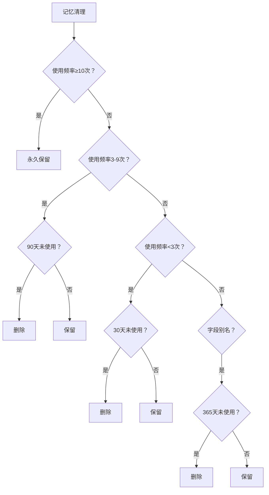
```mermaid
flowchart TD
Cleanup[记忆清理] --> HighUsage{"使用频率≥10次？"}
HighUsage --> |是| KeepHigh["永久保留"]
HighUsage --> |否| MediumUsage{"使用频率3-9次？"}
MediumUsage --> |是| CheckMedium{"90天未使用？"}
CheckMedium --> |是| DeleteMedium["删除"]
CheckMedium --> |否| KeepMedium["保留"]
MediumUsage --> |否| LowUsage{"使用频率<3次？"}
LowUsage --> |是| CheckLow{"30天未使用？"}
CheckLow --> |是| DeleteLow["删除"]
CheckLow --> |否| KeepLow["保留"]
LowUsage --> |否| FieldAlias{"字段别名？"}
FieldAlias --> |是| CheckAlias{"365天未使用？"}
CheckAlias --> |是| DeleteAlias["删除"]
CheckAlias --> |否| KeepAlias["保留"]
```

**图表来源**
- [memoryMaintenance.js:24-46](file://NL2SQL/backend/src/memory/memoryMaintenance.js#L24-L46)

#### LLM智能提炼（可选）

当启用`useLLMForExtraction`时，系统会使用LLM进行智能分析：

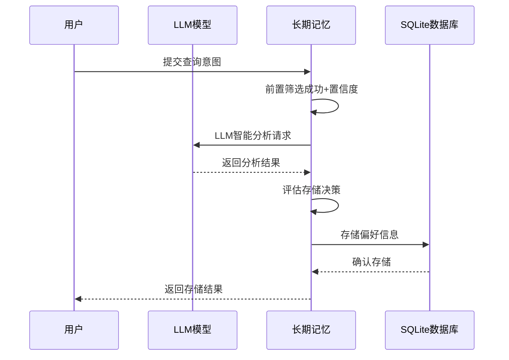
```mermaid
sequenceDiagram
participant User as 用户
participant LLM as LLM模型
participant LongTermMemory as 长期记忆
participant DB as SQLite数据库
User->>LongTermMemory : 提交查询意图
LongTermMemory->>LongTermMemory : 前置筛选成功+置信度
LongTermMemory->>LLM : LLM智能分析请求
LLM-->>LongTermMemory : 返回分析结果
LongTermMemory->>LongTermMemory : 评估存储决策
LongTermMemory->>DB : 存储偏好信息
DB-->>LongTermMemory : 确认存储
LongTermMemory-->>User : 返回存储结果
```

**图表来源**
- [longTermMemory.js:355-421](file://NL2SQL/backend/src/memory/longTermMemory.js#L355-L421)

**章节来源**
- [config.js:247-289](file://NL2SQL/backend/src/core/config.js#L247-L289)
- [longTermMemory.js:1-484](file://NL2SQL/backend/src/memory/longTermMemory.js#L1-L484)
- [memoryMaintenance.js:1-415](file://NL2SQL/backend/src/memory/memoryMaintenance.js#L1-L415)

### 上下文管理配置（新增）

上下文管理系统是NL2SQL模块新增的重要功能，负责令牌预算管理和对话摘要，确保LLM上下文的有效管理和优化。

#### 配置结构
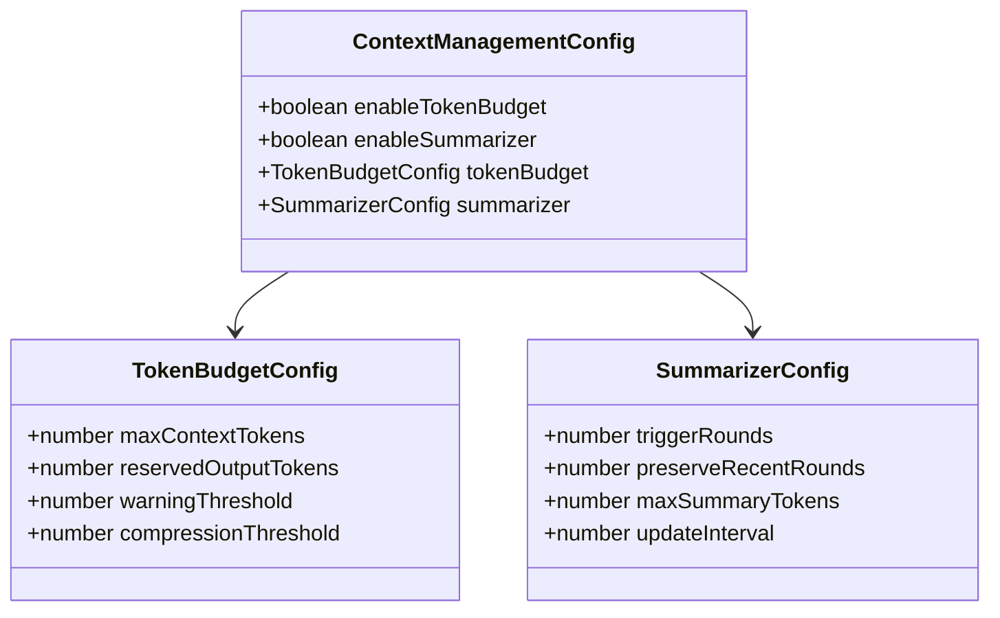
```mermaid
classDiagram
class ContextManagementConfig {
+boolean enableTokenBudget
+boolean enableSummarizer
+TokenBudgetConfig tokenBudget
+SummarizerConfig summarizer
}
class TokenBudgetConfig {
+number maxContextTokens
+number reservedOutputTokens
+number warningThreshold
+number compressionThreshold
}
class SummarizerConfig {
+number triggerRounds
+number preserveRecentRounds
+number maxSummaryTokens
+number updateInterval
}
ContextManagementConfig --> TokenBudgetConfig
ContextManagementConfig --> SummarizerConfig
```

**图表来源**
- [config.js:303-333](file://NL2SQL/backend/src/core/config.js#L303-L333)
- [tokenBudget.js:29-44](file://NL2SQL/backend/src/utils/tokenBudget.js#L29-L44)
- [summarizer.js:23-34](file://NL2SQL/backend/src/memory/summarizer.js#L23-L34)

#### 关键配置参数

| 参数名 | 类型 | 必需 | 默认值 | 描述 |
|--------|------|------|--------|------|
| enableTokenBudget | boolean | 否 | true | 是否启用令牌预算检查 |
| enableSummarizer | boolean | 否 | true | 是否启用对话摘要 |
| tokenBudget.maxContextTokens | number | 否 | 102400 | 最大上下文Token数（默认128k的80%） |
| tokenBudget.reservedOutputTokens | number | 否 | 8192 | 为模型输出预留的Token数 |
| tokenBudget.warningThreshold | number | 否 | 0.8 | 触发警告的阈值比例（0-1） |
| tokenBudget.compressionThreshold | number | 否 | 0.9 | 触发压缩的阈值比例（0-1） |
| summarizer.triggerRounds | number | 否 | 8 | 触发摘要的对话轮数阈值 |
| summarizer.preserveRecentRounds | number | 否 | 4 | 保留的最近对话轮数 |
| summarizer.maxSummaryTokens | number | 否 | 500 | 摘要的最大Token数 |
| summarizer.updateInterval | number | 否 | 4 | 摘要更新间隔（轮数） |

#### 环境变量支持

上下文管理系统支持通过环境变量进行动态配置：

| 环境变量名 | 默认值 | 描述 |
|------------|--------|------|
| ENABLE_TOKEN_BUDGET | 不等于'false' | 控制令牌预算检查启用状态 |
| ENABLE_SUMMARIZER | 不等于'false' | 控制对话摘要启用状态 |
| MAX_CONTEXT_TOKENS | 102400 | 最大上下文Token数 |
| RESERVED_OUTPUT_TOKENS | 8192 | 为模型输出预留的Token数 |
| SUMMARIZER_TRIGGER_ROUNDS | 8 | 触发摘要的对话轮数阈值 |
| SUMMARIZER_PRESERVE_ROUNDS | 4 | 保留的最近对话轮数 |
| SUMMARIZER_MAX_TOKENS | 500 | 摘要的最大Token数 |
| SUMMARIZER_UPDATE_INTERVAL | 4 | 摘要更新间隔（轮数） |

#### 令牌预算管理

系统提供智能的令牌预算控制，防止LLM上下文窗口溢出：

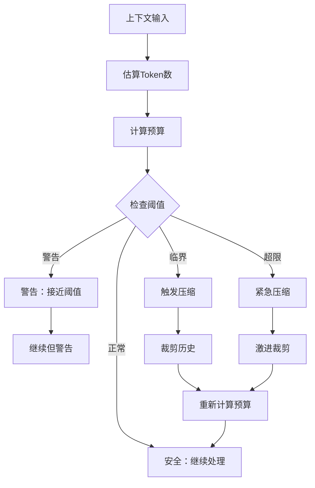
```mermaid
flowchart TD
Input[上下文输入] --> Estimate[估算Token数]
Estimate --> Budget[计算预算]
Budget --> Check{"检查阈值"}
Check --> |正常| Safe["安全：继续处理"]
Check --> |警告| Warn["警告：接近阈值"]
Check --> |临界| Compress["触发压缩"]
Check --> |超限| Emergency["紧急压缩"]
Warn --> Continue["继续但警告"]
Compress --> TrimHistory["裁剪历史"]
Emergency --> AggressiveTrim["激进裁剪"]
TrimHistory --> Recalculate[重新计算预算]
AggressiveTrim --> Recalculate
Recalculate --> Safe
```

**图表来源**
- [tokenBudget.js:115-179](file://NL2SQL/backend/src/utils/tokenBudget.js#L115-L179)
- [tokenBudget.js:315-372](file://NL2SQL/backend/src/utils/tokenBudget.js#L315-L372)

#### 对话摘要机制

系统自动管理长对话历史，通过摘要技术优化上下文：

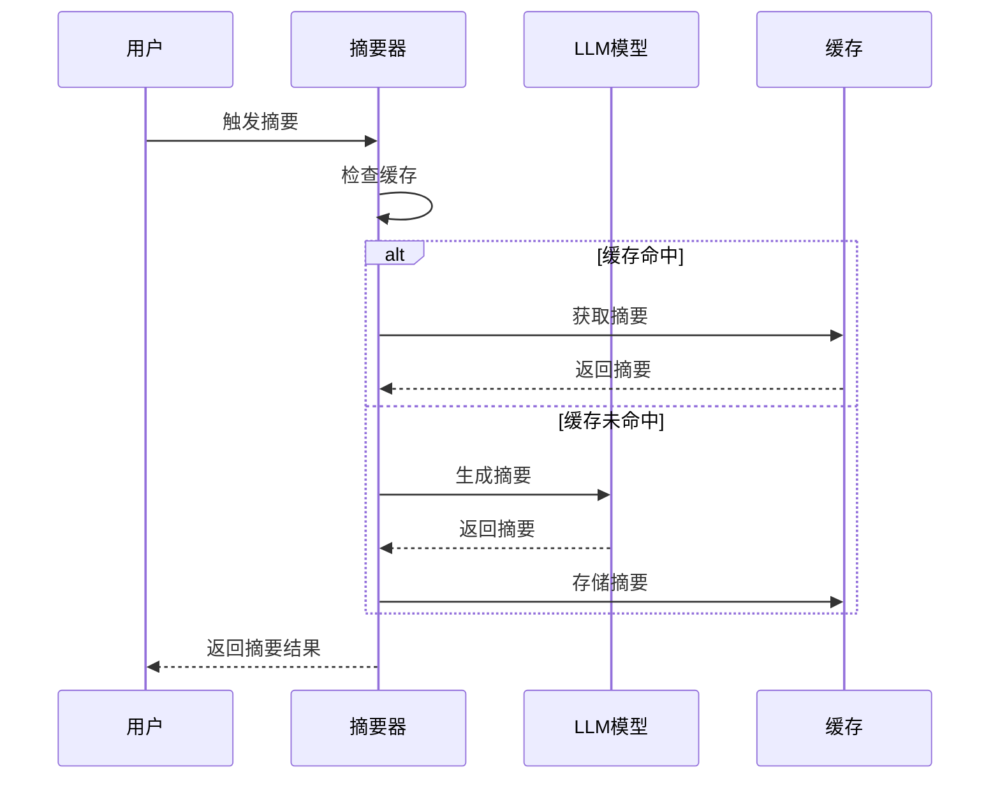
```mermaid
sequenceDiagram
participant User as 用户
participant Summarizer as 摘要器
participant LLM as LLM模型
participant Cache as 缓存
User->>Summarizer : 触发摘要
Summarizer->>Summarizer : 检查缓存
alt 缓存命中
Summarizer->>Cache : 获取摘要
Cache-->>Summarizer : 返回摘要
else 缓存未命中
Summarizer->>LLM : 生成摘要
LLM-->>Summarizer : 返回摘要
Summarizer->>Cache : 存储摘要
end
Summarizer-->>User : 返回摘要结果
```

**图表来源**
- [summarizer.js:450-492](file://NL2SQL/backend/src/memory/summarizer.js#L450-L492)

#### 上下文压缩策略

系统实现多层次的上下文压缩策略：

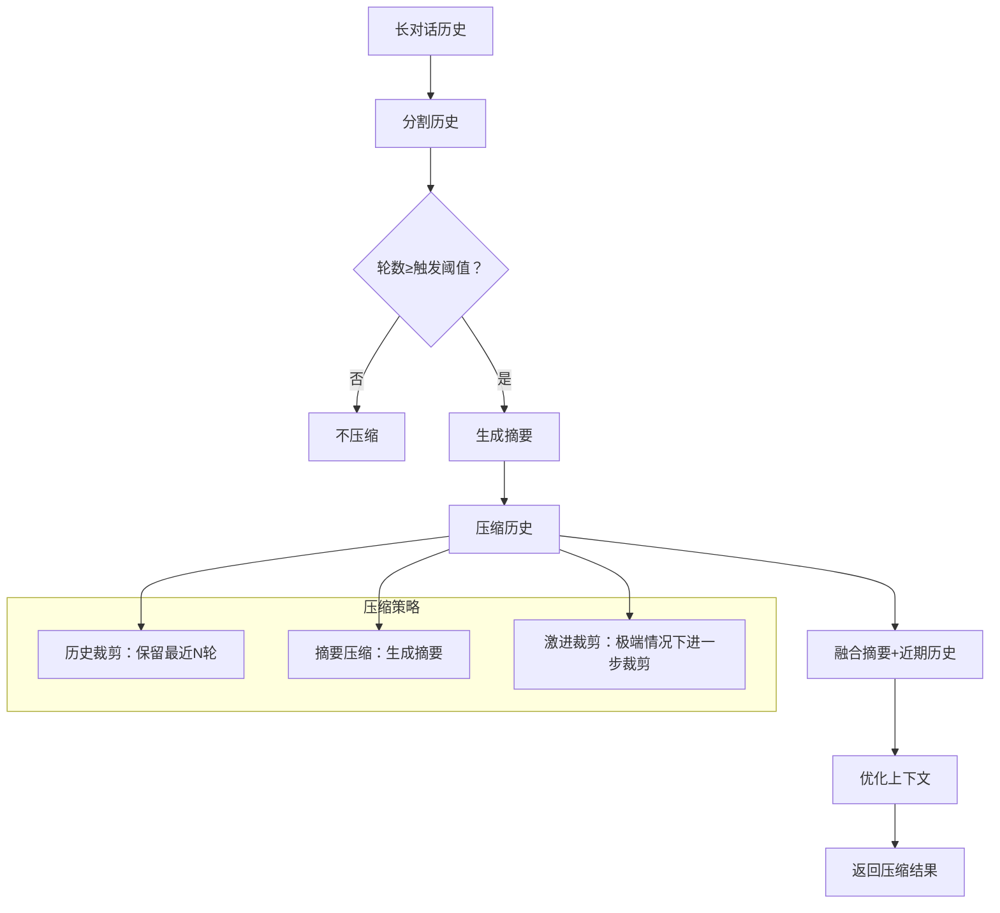
```mermaid
flowchart TD
History[长对话历史] --> Split[分割历史]
Split --> CheckTrigger{"轮数≥触发阈值？"}
CheckTrigger --> |否| NoCompress["不压缩"]
CheckTrigger --> |是| GenerateSummary["生成摘要"]
GenerateSummary --> CompressHistory["压缩历史"]
CompressHistory --> Merge[融合摘要+近期历史]
Merge --> Optimize[优化上下文]
Optimize --> Return[返回压缩结果]
subgraph "压缩策略"
Strategy1["历史裁剪：保留最近N轮"]
Strategy2["摘要压缩：生成摘要"]
Strategy3["激进裁剪：极端情况下进一步裁剪"]
end
CompressHistory --> Strategy1
CompressHistory --> Strategy2
CompressHistory --> Strategy3
```

**图表来源**
- [summarizer.js:264-331](file://NL2SQL/backend/src/memory/summarizer.js#L264-L331)

**章节来源**
- [config.js:303-333](file://NL2SQL/backend/src/core/config.js#L303-L333)
- [tokenBudget.js:1-392](file://NL2SQL/backend/src/utils/tokenBudget.js#L1-L392)
- [summarizer.js:1-518](file://NL2SQL/backend/src/memory/summarizer.js#L1-L518)

### 语音识别配置（ASR）

语音识别系统支持WebSocket流式识别，适用于实时语音转文字：

#### 配置结构
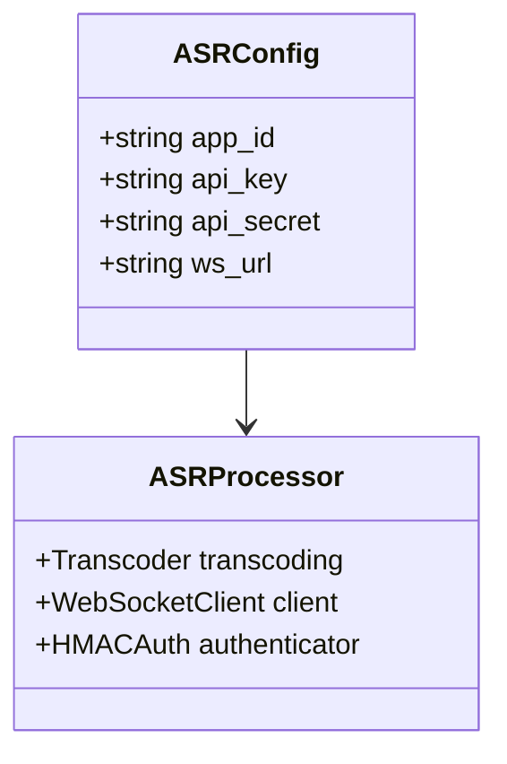
```mermaid
classDiagram
class ASRConfig {
+string app_id
+string api_key
+string api_secret
+string ws_url
}
class ASRProcessor {
+Transcoder transcoding
+WebSocketClient client
+HMACAuth authenticator
}
ASRConfig --> ASRProcessor
```

**图表来源**
- [config.example.json:39-44](file://config.example.json#L39-L44)
- [xiaowang.py:140-284](file://xiaowang.py#L140-L284)

#### ASR处理流程

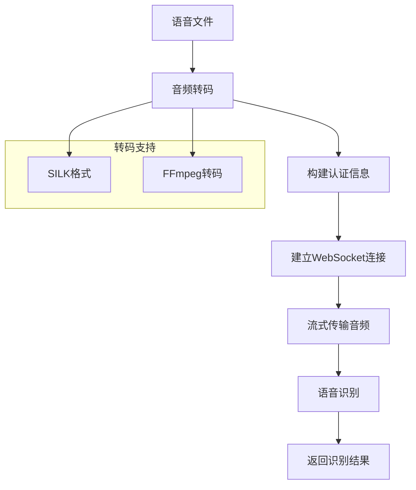
```mermaid
flowchart TD
Voice[语音文件] --> Transcode[音频转码]
Transcode --> BuildAuth[构建认证信息]
BuildAuth --> Connect[建立WebSocket连接]
Connect --> Stream[流式传输音频]
Stream --> Recognize[语音识别]
Recognize --> Result[返回识别结果]
subgraph "转码支持"
Silk[SILK格式]
FFmpeg[FFmpeg转码]
end
Transcode --> Silk
Transcode --> FFmpeg
```

**图表来源**
- [xiaowang.py:140-284](file://xiaowang.py#L140-L284)

#### 认证机制

ASR使用HMAC-SHA256签名进行安全认证：

| 认证要素 | 用途 | 生成方式 |
|----------|------|----------|
| app_id | 应用标识 | 配置文件中的应用ID |
| api_key | API密钥 | 配置文件中的API密钥 |
| api_secret | 密钥 | 配置文件中的API密钥 |
| date | 时间戳 | 当前UTC时间 |
| signature | 签名 | HMAC-SHA256计算 |

**章节来源**
- [config.example.json:39-44](file://config.example.json#L39-L44)
- [xiaowang.py:140-284](file://xiaowang.py#L140-L284)

### MCP服务器配置（MCP Servers）

MCP（Model Context Protocol）服务器配置支持外部工具扩展：

#### 配置结构
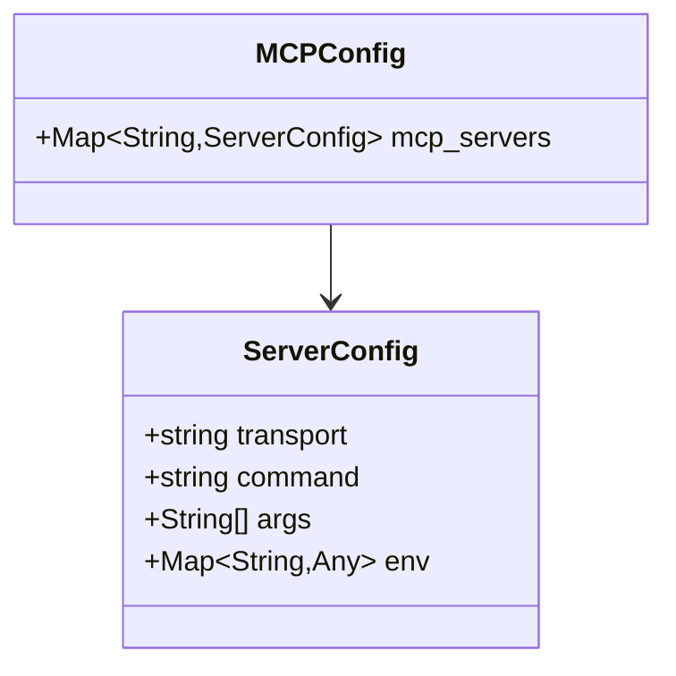
```mermaid
classDiagram
class MCPConfig {
+Map~String,ServerConfig~ mcp_servers
}
class ServerConfig {
+string transport
+string command
+String[] args
+Map~String,Any~ env
}
MCPConfig --> ServerConfig
```

**图表来源**
- [config.example.json:52-59](file://config.example.json#L52-L59)
- [mcp_client.py:27-48](file://mcp_client.py#L27-L48)

#### 支持的传输方式

| 传输方式 | 描述 | 使用场景 |
|----------|------|----------|
| stdio | 标准输入输出 | 本地进程通信 |
| http | HTTP协议 | 远程服务器通信 |

#### MCP协议实现

系统实现了MCP协议的核心方法：

```mermaid
sequenceDiagram
participant Client as MCP客户端
participant Server as MCP服务器
participant Tools as 工具定义
Client->>Server : initialize
Server-->>Client : 初始化确认
Client->>Server : tools/list
Server-->>Client : 返回工具列表
Client->>Server : tools/call
Server-->>Client : 返回执行结果
Note over Client,Tools : 工具命名空间 : servername__toolname
```

**图表来源**
- [mcp_client.py:191-242](file://mcp_client.py#L191-L242)

#### 热重载机制

系统支持MCP服务器的热重载：

```mermaid
flowchart TD
ConfigChange[配置变更] --> Shutdown[关闭旧连接]
Shutdown --> Init[初始化新连接]
Init --> Connect[建立新连接]
Connect --> Ready[准备就绪]
Ready --> Monitor[监控连接状态]
Monitor --> Crash{"连接崩溃?"}
Crash --> |是| Reconnect[自动重连]
Crash --> |否| Monitor
Reconnect --> Monitor
```

**图表来源**
- [mcp_client.py:312-322](file://mcp_client.py#L312-L322)

**章节来源**
- [config.example.json:52-59](file://config.example.json#L52-L59)
- [mcp_client.py:27-334](file://mcp_client.py#L27-L334)

### Trace级别日志配置（新增）

Trace级别日志系统提供详细的执行流程追踪，支持NL2SQL调试和性能分析。

#### 日志级别体系

```mermaid
classDiagram
class LogLevel {
+TRACE : 0
+DEBUG : 1
+INFO : 2
+WARN : 3
+ERROR : 4
}
class Logger {
+parseLevel(level)
+ensureLogDirectory()
+rotateLogFile()
+formatMessage(level, message, meta)
+writeToFile(message)
+writeToConsole(message, color)
+log(level, message, meta)
+trace(message, meta)
+debug(message, meta)
+info(message, meta)
+warn(message, meta)
+error(message, error)
+startTrace(traceId, operation, context)
+traceStep(traceId, step, data, status)
+endTrace(traceId, result)
+getTrace(traceId)
+setLevel(level)
}
LogLevel --> Logger
```

**图表来源**
- [logger.js:29-44](file://NL2SQL/backend/src/utils/logger.js#L29-L44)
- [logger.js:54-427](file://NL2SQL/backend/src/utils/logger.js#L54-L427)

#### Trace追踪机制

系统提供完整的执行流程追踪能力：

```mermaid
sequenceDiagram
participant Client as 客户端
participant Logger as 日志系统
participant Trace as Trace追踪
participant File as 日志文件
Client->>Logger : startTrace(traceId, operation)
Logger->>Trace : 创建追踪会话
Trace->>File : 写入开始日志
Client->>Logger : traceStep(step, data, status)
Logger->>Trace : 记录步骤日志
Trace->>File : 写入步骤日志
Client->>Logger : endTrace(result)
Logger->>Trace : 结束追踪会话
Trace->>File : 写入结束日志
```

**图表来源**
- [logger.js:322-408](file://NL2SQL/backend/src/utils/logger.js#L322-L408)

#### Trace配置参数

| 参数名 | 类型 | 必需 | 默认值 | 描述 |
|--------|------|------|--------|------|
| log.level | string | 否 | 'info' | 日志级别：trace, debug, info, warn, error |
| log.file | string | 否 | './logs/app.log' | 日志文件路径 |
| log.console | boolean | 否 | true | 是否输出到控制台 |
| log.fileOutput | boolean | 否 | true | 是否输出到文件 |
| log.maxSize | number | 否 | 10MB | 日志文件最大大小 |
| log.maxFiles | number | 否 | 5 | 保留的历史日志文件数量 |

#### Trace日志级别说明

| 日志级别 | 用途 | 特点 |
|----------|------|------|
| TRACE | 详细流程追踪 | 最详细级别，记录所有执行步骤 |
| DEBUG | 开发调试信息 | 详细调试信息，用于开发环境 |
| INFO | 一般信息 | 默认级别，记录正常运行信息 |
| WARN | 警告信息 | 记录可能的问题和异常情况 |
| ERROR | 错误信息 | 记录错误和异常 |

**章节来源**
- [config.js:195-213](file://NL2SQL/backend/src/core/config.js#L195-L213)
- [logger.js:1-442](file://NL2SQL/backend/src/utils/logger.js#L1-L442)

## 依赖关系分析

### 配置依赖图

```mermaid
graph TB
subgraph "配置源"
ConfigFile[config.example.json]
EnvVars[环境变量]
LongTermEnv[LTM_* 环境变量]
ContextEnv[上下文管理环境变量]
TraceEnv[Trace日志环境变量]
end
subgraph "配置消费者"
MainApp[xiaowang.py]
LLMModule[llm.py]
MemoryModule[memory.py]
MCPModule[mcp_client.py]
RouterModule[router.py]
LongTermConfig[config.js:247-289]
LongTermMemory[longTermMemory.js]
MemoryMaintenance[memoryMaintenance.js]
ContextConfig[config.js:303-333]
TokenBudget[tokenBudget.js]
Summarizer[summarizer.js]
Logger[logger.js]
end
ConfigFile --> MainApp
EnvVars --> RouterModule
LongTermEnv --> LongTermConfig
ContextEnv --> ContextConfig
TraceEnv --> Logger
LongTermConfig --> LongTermMemory
LongTermConfig --> MemoryMaintenance
ContextConfig --> TokenBudget
ContextConfig --> Summarizer
MainApp --> LLMModule
MainApp --> MemoryModule
MainApp --> MCPModule
MainApp --> LongTermMemory
MainApp --> TokenBudget
MainApp --> Summarizer
MainApp --> Logger
LongTermMemory --> MemoryMaintenance
LongTermMemory --> VectorDB
MemoryModule --> LLMModule
```

**图表来源**
- [xiaowang.py:35-75](file://xiaowang.py#L35-L75)
- [llm.py:33-401](file://llm.py#L33-L401)
- [memory.py:40-361](file://memory.py#L40-L361)
- [mcp_client.py:272-334](file://mcp_client.py#L272-L334)
- [router.py:23-42](file://router.py#L23-L42)
- [config.js:247-333](file://NL2SQL/backend/src/core/config.js#L247-L333)
- [longTermMemory.js:1-50](file://NL2SQL/backend/src/memory/longTermMemory.js#L1-L50)
- [memoryMaintenance.js:1-10](file://NL2SQL/backend/src/memory/memoryMaintenance.js#L1-L10)
- [tokenBudget.js:1-392](file://NL2SQL/backend/src/utils/tokenBudget.js#L1-L392)
- [summarizer.js:1-518](file://NL2SQL/backend/src/memory/summarizer.js#L1-L518)
- [logger.js:1-442](file://NL2SQL/backend/src/utils/logger.js#L1-L442)

### 配置加载流程

```mermaid
sequenceDiagram
participant Process as 进程启动
participant ConfigLoader as 配置加载器
participant EnvLoader as 环境变量加载器
participant LongTermEnvLoader as 长期记忆环境变量
participant ContextEnvLoader as 上下文管理环境变量
participant TraceEnvLoader as Trace日志环境变量
participant Modules as 模块初始化
Process->>ConfigLoader : 加载config.json
ConfigLoader-->>Process : 返回配置对象
Process->>EnvLoader : 加载环境变量
EnvLoader-->>Process : 返回环境变量
Process->>LongTermEnvLoader : 加载LTM_*变量
LongTermEnvLoader-->>Process : 返回长期记忆配置
Process->>ContextEnvLoader : 加载上下文管理变量
ContextEnvLoader-->>Process : 返回上下文配置
Process->>TraceEnvLoader : 加载Trace日志变量
TraceEnvLoader-->>Process : 返回日志配置
Process->>Modules : 初始化各模块
Modules-->>Process : 初始化完成
```

**图表来源**
- [xiaowang.py:38-75](file://xiaowang.py#L38-L75)
- [config.js:254-333](file://NL2SQL/backend/src/core/config.js#L254-L333)

**章节来源**
- [xiaowang.py:35-75](file://xiaowang.py#L35-L75)
- [router.py:467-493](file://router.py#L467-L493)
- [config.js:247-333](file://NL2SQL/backend/src/core/config.js#L247-L333)

## 性能考虑

### 配置性能优化

1. **缓存策略**
   - LLM响应缓存
   - 工具调用结果缓存
   - 消息去抖动减少重复处理
   - 长期记忆查询结果缓存
   - **新增**：对话摘要缓存（30分钟过期）
   - **新增**：令牌预算计算缓存

2. **异步处理**
   - 内存压缩后台线程
   - 文件下载异步处理
   - WebSocket流式识别
   - 长期记忆存储异步处理
   - **新增**：令牌预算异步检查
   - **新增**：对话摘要异步生成

3. **资源管理**
   - 连接池管理
   - 内存使用监控
   - 超时控制机制
   - 向量数据库批量操作
   - **新增**：上下文管理资源池
   - **新增**：Trace日志轮转管理

### 配置最佳实践

- **模型选择**：根据任务复杂度选择合适的模型
- **超时设置**：合理设置API调用超时时间
- **并发控制**：限制同时进行的任务数量
- **错误重试**：实现指数退避重试机制
- **长期记忆优化**：
  - 合理设置阈值参数
  - 定期执行记忆清理
  - 根据使用模式调整保留策略
- **上下文管理优化**（新增）：
  - 根据模型能力调整令牌预算
  - 合理设置摘要触发阈值
  - 监控上下文压缩效果
  - 优化摘要更新频率
- **日志系统优化**（新增）：
  - 生产环境使用info级别
  - 开发环境使用debug级别
  - 合理设置日志轮转参数
  - 使用trace级别进行深度调试

## 故障排除指南

### 常见配置问题

#### LLM模型配置问题
- **问题**：API密钥无效
- **解决方案**：检查API密钥格式和有效期
- **验证方法**：测试API连通性

#### 内存系统问题
- **问题**：向量数据库初始化失败
- **解决方案**：检查数据库路径权限和磁盘空间
- **验证方法**：查看日志错误信息

#### 长期记忆系统问题（新增）
- **问题**：长期记忆功能异常
- **解决方案**：检查LTM_*环境变量设置，验证SQLite数据库连接
- **验证方法**：查看长期记忆日志，确认偏好存储状态

#### 上下文管理系统问题（新增）
- **问题**：令牌预算检查异常
- **解决方案**：检查ENABLE_TOKEN_BUDGET环境变量，验证MAX_CONTEXT_TOKENS设置
- **验证方法**：查看令牌预算计算日志，确认预算状态
- **问题**：对话摘要功能异常
- **解决方案**：检查ENABLE_SUMMARIZER环境变量，验证摘要配置参数
- **验证方法**：查看摘要生成日志，确认摘要质量

#### Trace日志系统问题（新增）
- **问题**：Trace日志级别无效
- **解决方案**：检查LOG_LEVEL环境变量，确保使用正确的级别
- **验证方法**：查看日志输出，确认级别生效
- **问题**：Trace追踪会话异常
- **解决方案**：检查traceId格式，验证追踪上下文管理
- **验证方法**：查看Trace日志完整性，确认会话状态

#### MCP服务器问题
- **问题**：服务器连接失败
- **解决方案**：检查服务器进程状态和网络连接
- **验证方法**：使用热重载功能重新连接

### 调试技巧

1. **启用详细日志**：设置日志级别为DEBUG或TRACE
2. **监控资源使用**：观察CPU和内存使用情况
3. **检查网络连接**：验证API端点可达性
4. **验证配置格式**：确保JSON配置语法正确
5. **长期记忆调试**：
   - 检查环境变量LTM_ENABLED和LTM_USE_LLM
   - 验证SQLite数据库user_preferences表结构
   - 监控向量数据库初始化状态
6. **上下文管理调试**（新增）：
   - 检查环境变量ENABLE_TOKEN_BUDGET和ENABLE_SUMMARIZER
   - 验证令牌预算配置参数
   - 监控摘要生成和缓存状态
   - 查看上下文压缩效果
7. **Trace日志调试**（新增）：
   - 使用trace级别进行深度调试
   - 验证Trace会话生命周期
   - 检查日志轮转和存储状态

**章节来源**
- [llm.py:74-82](file://llm.py#L74-L82)
- [memory.py:84-86](file://memory.py#L84-L86)
- [mcp_client.py:312-322](file://mcp_client.py#L312-L322)
- [longTermMemory.js:311-484](file://NL2SQL/backend/src/memory/longTermMemory.js#L311-L484)
- [tokenBudget.js:174-179](file://NL2SQL/backend/src/utils/tokenBudget.js#L174-L179)
- [summarizer.js:450-492](file://NL2SQL/backend/src/memory/summarizer.js#L450-L492)
- [logger.js:322-408](file://NL2SQL/backend/src/utils/logger.js#L322-L408)

## 结论

724 Office的配置管理系统提供了灵活而强大的配置管理能力，支持：

- **多模型支持**：轻松切换不同的LLM提供商
- **可扩展架构**：通过MCP协议扩展外部工具
- **智能记忆**：长期记忆存储和检索
- **多平台集成**：统一的消息平台接入
- **安全配置**：敏感信息保护和访问控制
- **长期记忆管理**：新增的Layer 2长期记忆系统，支持智能偏好提取和分级保留策略
- **上下文管理**：新增的令牌预算控制和对话摘要功能，确保LLM上下文的有效管理
- **高级日志系统**：支持trace级别日志追踪，提供详细的执行流程监控

系统的配置管理遵循以下原则：
- **模块化设计**：每个功能模块独立配置
- **环境隔离**：开发、测试、生产环境分离
- **安全优先**：敏感信息加密存储和传输
- **可观测性**：完善的日志和监控机制
- **智能优化**：长期记忆的智能筛选和清理机制
- **性能优化**：上下文管理的智能压缩和缓存策略
- **调试友好**：trace级别的详细流程追踪

通过合理的配置管理，724 Office能够适应各种应用场景，为企业提供智能化的办公助手服务。新增的上下文管理系统进一步增强了系统的智能化水平，能够学习和记住用户的查询习惯、偏好和工作模式，提供更加个性化和高效的服务体验。同时，高级日志系统为系统的调试和优化提供了强有力的支持，确保系统在各种复杂场景下的稳定运行。