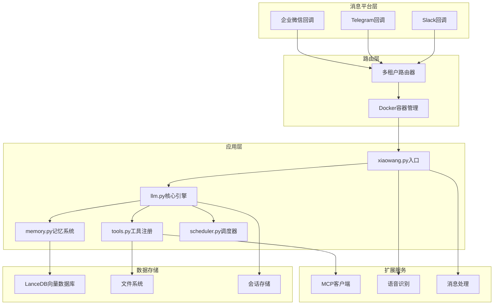
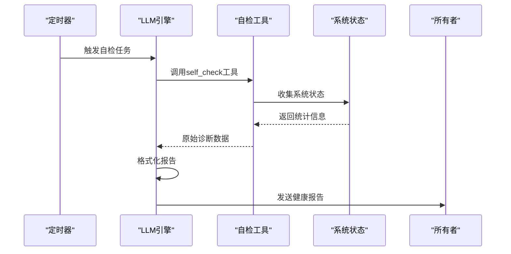

# 项目概述

<cite>
**本文档引用的文件**
- [README.md](file://README.md)
- [xiaowang.py](file://xiaowang.py)
- [llm.py](file://llm.py)
- [tools.py](file://tools.py)
- [memory.py](file://memory.py)
- [scheduler.py](file://scheduler.py)
- [router.py](file://router.py)
- [mcp_client.py](file://mcp_client.py)
- [self_check_tool.py](file://self_check_tool.py)
</cite>

## 目录
1. [项目简介](#项目简介)
2. [核心价值与设计理念](#核心价值与设计理念)
3. [技术特色与架构优势](#技术特色与架构优势)
4. [系统架构概览](#系统架构概览)
5. [核心组件详解](#核心组件详解)
6. [26个内置工具体系](#26个内置工具体系)
7. [自修复机制](#自修复机制)
8. [部署与运行特性](#部署与运行特性)
9. [应用场景与适用性](#应用场景与适用性)
10. [总结](#总结)

## 项目简介

724 Office智能AI助手系统是一个基于纯Python构建的生产级AI代理系统，具有以下核心特点：

- **纯Python实现**：约3500行纯Python代码，零框架依赖
- **生产级稳定性**：支持24/7不间断运行，经过实际生产环境验证
- **零隐藏抽象**：每个代码行都可见且可调试，无魔法代码
- **轻量级设计**：仅依赖3个小包（croniter、lancedb、websocket-client）

该项目采用"AI协同开发"的方式，在3个月内完成，展现了极高的开发效率和代码质量。

## 核心价值与设计理念

### 设计哲学

1. **零框架依赖**：不使用任何第三方AI框架，确保代码透明度和可控性
2. **单文件工具扩展**：新增功能只需在tools.py中添加一个函数和装饰器
3. **边缘部署友好**：专为Jetson Orin Nano等边缘设备设计，内存预算控制在2GB以内
4. **自我进化能力**：系统能够创建新工具、诊断问题并通知所有者
5. **离线可用性**：核心功能无需云API即可运行，支持本地嵌入模型

### 架构原则

- **透明性**：每个模块职责明确，代码结构清晰
- **可维护性**：模块间低耦合，高内聚
- **可扩展性**：支持插件系统和MCP协议扩展
- **可靠性**：完善的错误处理和自恢复机制

## 技术特色与架构优势

### 系统特性总览

1. **工具使用循环**：支持OpenAI兼容的函数调用，自动重试，每对话最多20次迭代
2. **三层记忆系统**：会话历史 + LLM压缩的长期记忆 + LanceDB向量检索
3. **MCP/插件系统**：通过JSON-RPC连接外部MCP服务器，热重载无需重启
4. **运行时工具创建**：代理可以编写、保存和加载新的Python工具
5. **自修复机制**：每日自检、会话健康诊断、错误日志分析、失败自动通知
6. **定时调度**：一次性和周期性任务，跨重启持久化，支持时区感知
7. **多租户路由**：基于Docker的自动分配，每个用户一个容器，健康检查
8. **多模态处理**：图像/视频/文件/语音/链接处理，支持语音转文字
9. **网络搜索**：多引擎（Tavily、网页搜索、GitHub、HuggingFace）自动路由
10. **视频处理**：剪辑、添加背景音乐、AI视频生成，全部通过ffmpeg + API

### 架构优势

- **零隐藏抽象**：完全透明的代码结构，便于调试和维护
- **单文件工具添加**：新增能力 = 在tools.py中添加一个带装饰器的函数
- **边缘部署能力**：专为资源受限环境优化
- **自适应学习**：通过三层记忆系统实现持续改进
- **插件生态**：支持外部工具和服务集成

## 系统架构概览

**图表来源**
- [router.py:1-493](file://router.py#L1-L493)
- [xiaowang.py:1-626](file://xiaowang.py#L1-L626)
- [llm.py:1-401](file://llm.py#L1-L401)
- [memory.py:1-361](file://memory.py#L1-L361)

## 核心组件详解

### 入口控制器（xiaowang.py）

作为系统的主入口，负责：
- HTTP服务器启动和请求处理
- 消息平台回调接收和解析
- 多媒体文件下载和持久化
- 语音转文字（ASR）处理
- 会话去抖动（debounce）机制
- 与各子系统的初始化协调

### LLM核心引擎（llm.py）

实现工具使用循环的核心逻辑：
- OpenAI兼容的函数调用接口
- 会话管理和状态持久化
- 多模态消息构建（文本+图像）
- 系统提示词构建和上下文注入
- 性能监控和错误处理
- 线程安全的并发控制

### 工具注册系统（tools.py）

提供统一的工具注册和执行框架：
- 装饰器模式的工具定义
- 运行时工具创建能力
- 插件系统支持
- 内置26个实用工具
- MCP工具桥接

### 记忆系统（memory.py）

三层记忆架构：
1. **压缩阶段**：对话 -> LLM提取结构化记忆
2. **去重阶段**：余弦相似度去重（阈值0.92）
3. **检索阶段**：用户消息 -> 嵌入 -> LanceDB向量搜索

### 调度器（scheduler.py）

提供灵活的任务调度能力：
- 一次性延迟任务
- Cron表达式周期性任务
- 跨重启持久化
- 时区感知的时间处理
- 心跳监控和错误通知

### 多租户路由器（router.py）

支持多用户隔离的Docker容器化部署：
- 自动容器创建和配置
- 健康检查和故障恢复
- 动态路由表管理
- 消息平台API集成
- 容器数量限制和资源控制

### MCP客户端（mcp_client.py）

实现MCP协议的JSON-RPC通信：
- 支持stdio和HTTP两种传输方式
- 自动重连和错误恢复
- 工具定义转换和命名空间管理
- 热重载支持

## 26个内置工具体系

系统提供了26个精心设计的内置工具，按功能分类如下：

### 核心工具
- `exec`：在服务器上执行shell命令
- `message`：通过消息平台发送文本消息给所有者

### 文件操作工具
- `read_file`：读取文件内容
- `write_file`：写入文件（覆盖模式）
- `edit_file`：替换文件中的文本
- `list_files`：列出接收的文件

### 调度工具
- `schedule`：创建定时任务
- `list_schedules`：列出所有定时任务
- `remove_schedule`：删除定时任务

### 媒体发送工具
- `send_image`：发送图片给所有者
- `send_file`：发送文件给所有者
- `send_video`：发送视频给所有者
- `send_link`：发送富文本链接卡片

### 视频处理工具
- `trim_video`：视频剪辑（毫秒级快速处理）
- `add_bgm`：添加背景音乐
- `generate_video`：AI视频生成

### 搜索工具
- `web_search`：多引擎网络搜索（Tavily、GitHub、HuggingFace等）

### 记忆工具
- `search_memory`：关键词搜索记忆文件
- `recall`：向量语义搜索

### 诊断工具
- `self_check`：系统健康检查
- `diagnose`：深度诊断分析

### 扩展工具
- `create_tool`：运行时创建新工具
- `list_custom_tools`：列出自定义工具
- `remove_tool`：删除自定义工具
- `reload_mcp`：热重载MCP服务器

**章节来源**
- [README.md:86-100](file://README.md#L86-L100)
- [tools.py:108-800](file://tools.py#L108-L800)

## 自修复机制

系统实现了完整的自修复闭环：

### 日常自检流程

**图表来源**
- [self_check_tool.py:18-31](file://self_check_tool.py#L18-L31)
- [scheduler.py:171-186](file://scheduler.py#L171-L186)

### 自修复能力
1. **问题检测**：每日自检收集系统指标
2. **深度诊断**：使用diagnose工具进行根因分析
3. **自动修复**：通过exec工具执行修复命令
4. **工具增强**：使用create_tool创建新诊断工具
5. **透明报告**：通过message工具向所有者汇报

### 监控指标
- 当日对话统计（会话数、消息数、工具调用数）
- 错误日志摘要（journalctl）
- 服务运行时间
- 内存和磁盘使用情况
- 定时任务状态和最后运行时间
- 记忆文件状态（MEMORY.md、日常日志）

**章节来源**
- [self_check_tool.py:7-31](file://self_check_tool.py#L7-L31)
- [tools.py:764-800](file://tools.py#L764-L800)

## 部署与运行特性

### 运行要求
- **硬件要求**：Jetson Orin Nano（8GB RAM，ARM64 + GPU）
- **内存预算**：控制在2GB以内
- **依赖包**：croniter、lancedb、websocket-client
- **可选依赖**：pilk（用于WeChat silk音频解码）

### 部署模式

#### 单机部署
适用于个人使用或小规模部署：
- 单个进程包含所有功能
- 简单的HTTP服务器
- 本地文件存储

#### 多租户部署
适用于企业级大规模部署：
- 多用户隔离的Docker容器
- 自动容器创建和管理
- 健康检查和故障恢复
- 负载均衡和资源控制

### 24/7运行保障

1. **进程监控**：自动重启失败的服务
2. **内存管理**：会话截断和压缩
3. **磁盘清理**：过期文件自动清理
4. **网络容错**：API调用重试机制
5. **日志轮转**：避免日志文件过大

**章节来源**
- [router.py:141-250](file://router.py#L141-L250)
- [xiaowang.py:597-626](file://xiaowang.py#L597-L626)

## 应用场景与适用性

### 适用场景

1. **企业内部助手**
   - 自动回复常见问题
   - 文件管理和共享
   - 会议记录和摘要
   - 任务提醒和跟踪

2. **个人助理**
   - 日常任务管理
   - 信息整理和归档
   - 学习资料管理
   - 生活助手功能

3. **开发者工具**
   - 代码审查辅助
   - 文档生成和整理
   - 项目管理支持
   - 开发环境自动化

4. **教育领域**
   - 学生作业管理
   - 学习资源整理
   - 课程内容组织
   - 学习进度跟踪

### 技术选型说明

#### 为什么选择纯Python？
- **易部署**：无需复杂的编译过程
- **易调试**：每个代码行都可见
- **易维护**：单一语言减少复杂性
- **易迁移**：标准库保证兼容性

#### 为什么选择这些依赖？
- **croniter**：精确的Cron表达式解析
- **lancedb**：高性能向量数据库
- **websocket-client**：实时语音识别支持

#### 为什么不使用主流AI框架？
- **透明度**：避免框架抽象带来的不确定性
- **可控性**：完全掌握代码逻辑
- **稳定性**：减少框架版本兼容问题
- **性能**：直接API调用避免框架开销

## 总结

724 Office智能AI助手系统代表了AI代理系统设计的新范式：

### 核心优势
- **完全透明**：零隐藏抽象，代码完全可调试
- **高度可扩展**：单文件工具添加，插件生态丰富
- **生产级稳定**：24/7运行验证，自修复机制完善
- **边缘友好**：专为资源受限环境优化
- **成本效益**：零框架依赖，降低维护成本

### 技术创新
- **三层记忆系统**：实现真正的长期记忆
- **多模态处理**：统一的多媒体处理框架
- **自适应学习**：通过记忆系统持续改进
- **插件生态**：支持外部服务无缝集成

### 价值定位
该系统适合需要：
- 高度定制化的AI代理解决方案
- 对系统透明度和可控性有严格要求的场景
- 边缘部署和资源受限环境的应用
- 需要24/7稳定运行的企业级应用

通过其独特的设计理念和技术实现，724 Office智能AI助手系统为AI代理系统的开发提供了全新的思路和实践范例。