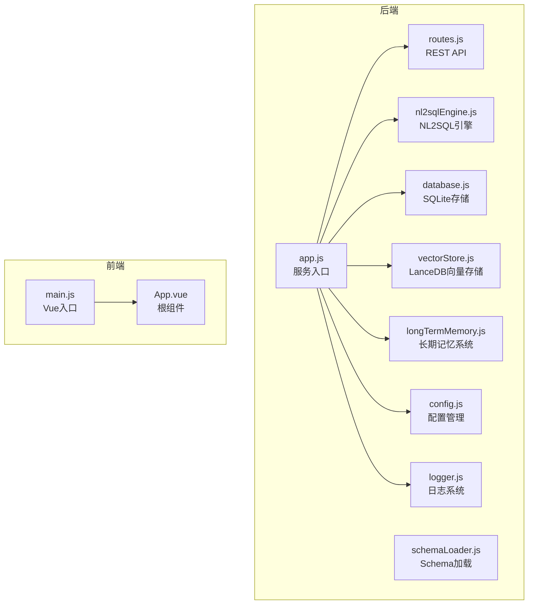
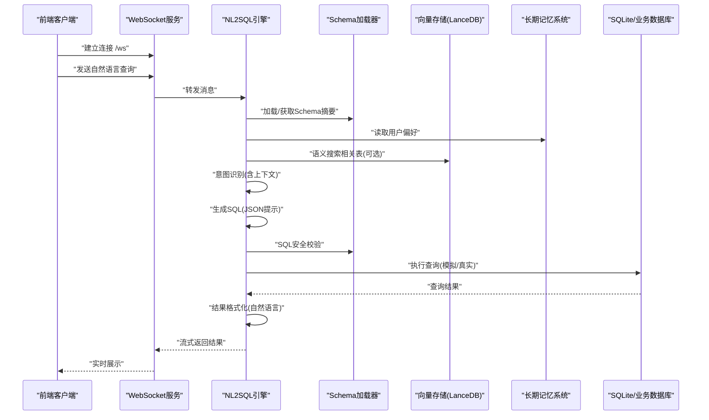
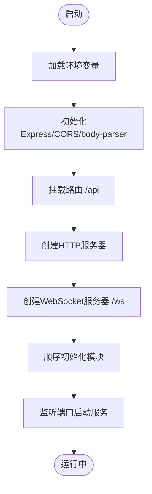
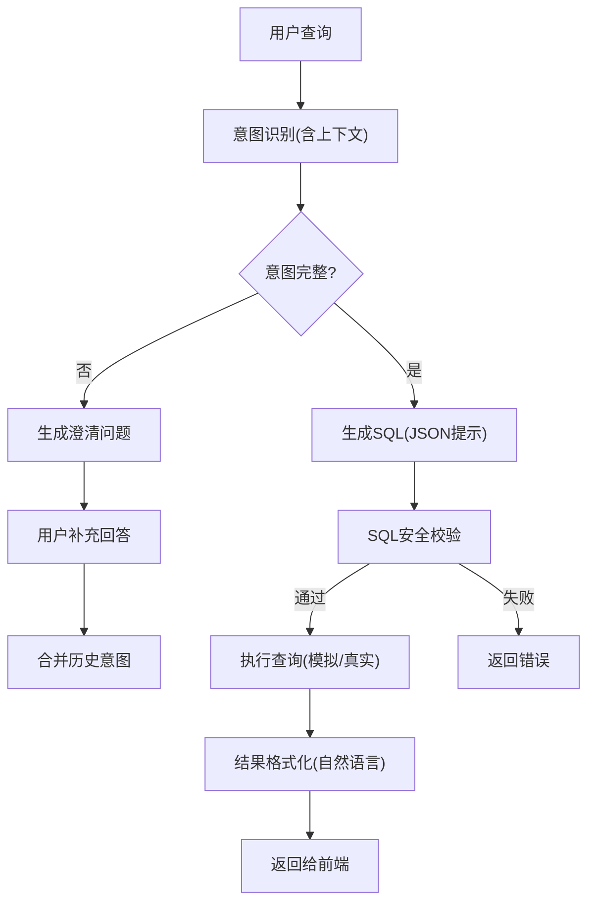
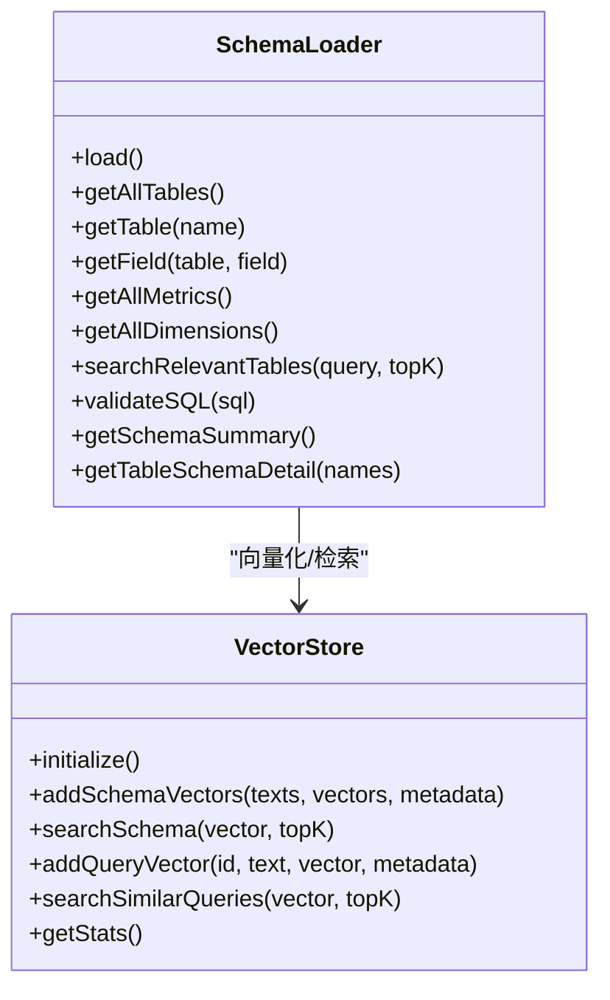
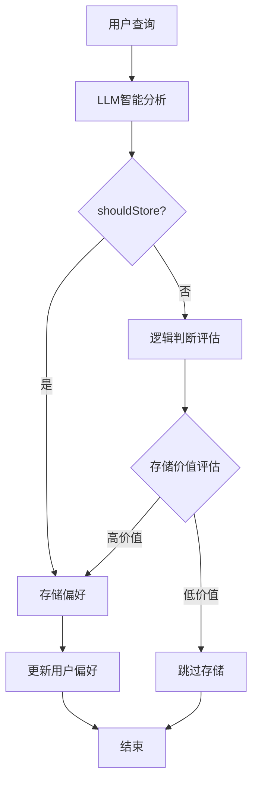
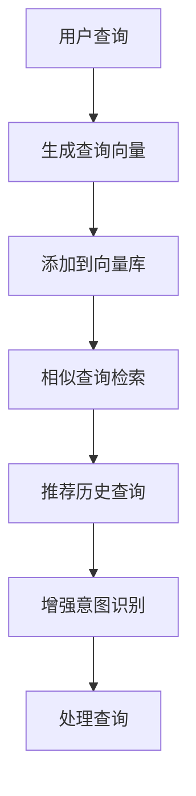
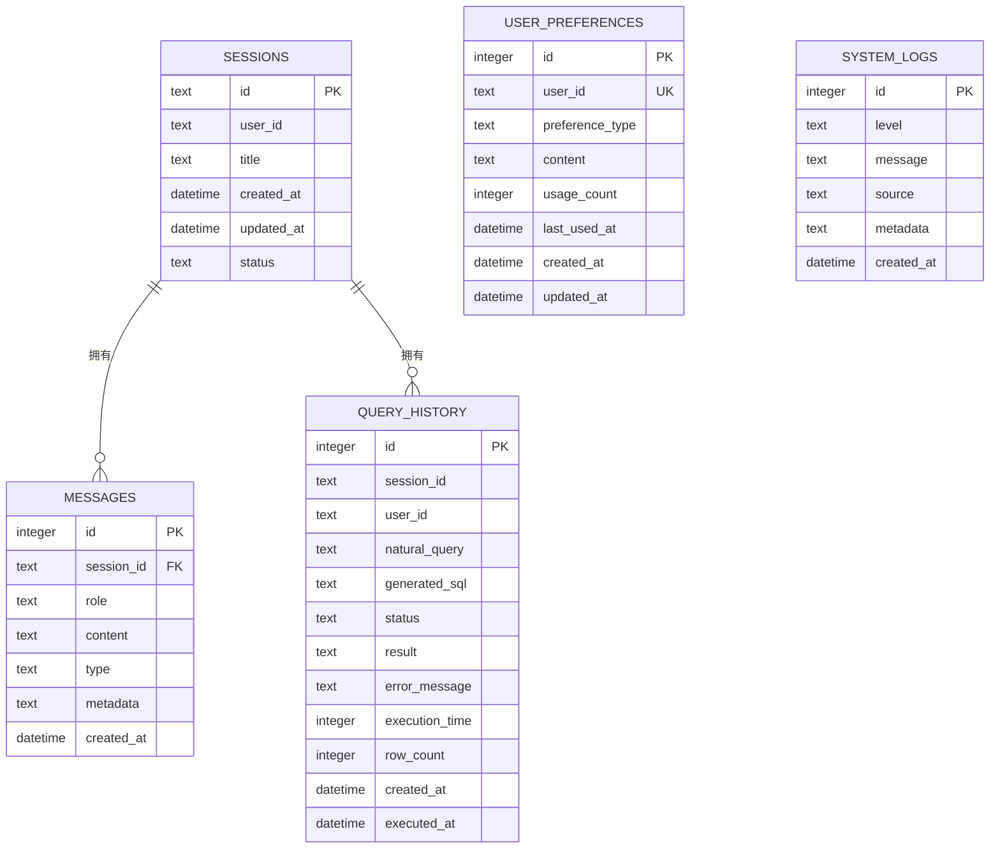
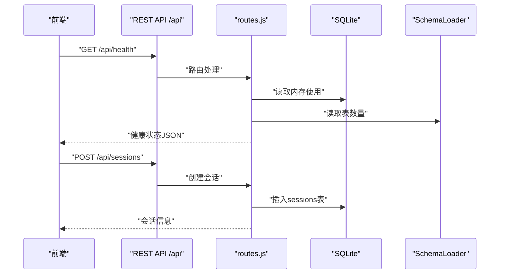
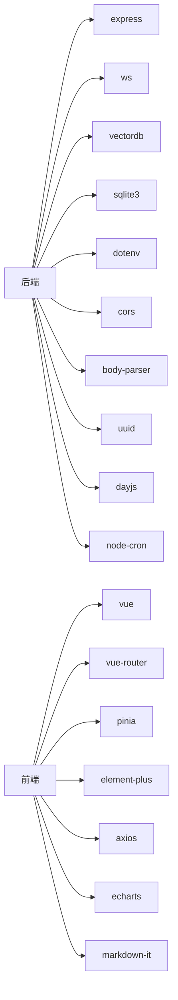

# NL2SQL-进度追踪

<cite>
**本文引用的文件**
- [app.js](file://NL2SQL/backend/src/app.js)
- [nl2sqlEngine.js](file://NL2SQL/backend/src/core/nl2sqlEngine.js)
- [routes.js](file://NL2SQL/backend/src/core/routes.js)
- [vectorStore.js](file://NL2SQL/backend/src/memory/vectorStore.js)
- [longTermMemory.js](file://NL2SQL/backend/src/memory/longTermMemory.js)
- [config.js](file://NL2SQL/backend/src/core/config.js)
- [database.js](file://NL2SQL/backend/src/core/database.js)
- [schemaLoader.js](file://NL2SQL/backend/src/core/schemaLoader.js)
- [logger.js](file://NL2SQL/backend/src/utils/logger.js)
- [main.js](file://NL2SQL/frontend/src/main.js)
- [App.vue](file://NL2SQL/frontend/src/App.vue)
- [package.json](file://NL2SQL/backend/package.json)
- [package.json](file://NL2SQL/frontend/package.json)
- [schema-metadata.example.json](file://NL2SQL/backend/config/schema-metadata.example.json)
- [NL2SQL-进度追踪.md](file://NL2SQL/docs/NL2SQL-进度追踪.md)
</cite>

## 更新摘要
**所做更改**
- 更新MVP阶段完成度至90%
- 更新核心功能完成度至85%
- 新增长期记忆系统实现状态
- 新增查询历史向量化实现状态
- 更新相关章节以反映最新开发成果

## 目录
1. [简介](#简介)
2. [项目结构](#项目结构)
3. [核心组件](#核心组件)
4. [架构总览](#架构总览)
5. [详细组件分析](#详细组件分析)
6. [依赖分析](#依赖分析)
7. [性能考虑](#性能考虑)
8. [故障排查指南](#故障排查指南)
9. [结论](#结论)
10. [附录](#附录)

## 简介
本项目是一个"自然语言转SQL"的数据查询服务，目标是让用户通过自然语言描述即可生成并执行SQL查询，最终以自然语言形式呈现结果。系统采用前后端分离架构：后端基于Node.js + Express + WebSocket，前端基于Vue3 + Element Plus，配合SQLite存储会话历史、LanceDB向量数据库实现Schema语义检索与查询历史向量化，以及完善的日志与安全校验体系。

## 项目结构
项目分为后端、前端、文档三大部分：
- 后端：核心服务、路由、引擎、数据库、向量存储、配置、日志等模块
- 前端：Vue3应用，包含聊天界面、Schema查看、历史记录等视图
- 文档：进度追踪与任务清单

**图表来源**
- [app.js:1-266](file://NL2SQL/backend/src/app.js#L1-L266)
- [routes.js:1-538](file://NL2SQL/backend/src/core/routes.js#L1-L538)
- [nl2sqlEngine.js:1-1066](file://NL2SQL/backend/src/core/nl2sqlEngine.js#L1-L1066)
- [schemaLoader.js:1-655](file://NL2SQL/backend/src/core/schemaLoader.js#L1-L655)
- [database.js:1-531](file://NL2SQL/backend/src/core/database.js#L1-L531)
- [vectorStore.js:1-442](file://NL2SQL/backend/src/memory/vectorStore.js#L1-L442)
- [longTermMemory.js:1-1141](file://NL2SQL/backend/src/memory/longTermMemory.js#L1-L1141)
- [config.js:1-289](file://NL2SQL/backend/src/core/config.js#L1-L289)
- [logger.js:1-318](file://NL2SQL/backend/src/utils/logger.js#L1-L318)
- [main.js:1-89](file://NL2SQL/frontend/src/main.js#L1-L89)
- [App.vue:1-307](file://NL2SQL/frontend/src/App.vue#L1-L307)

**章节来源**
- [app.js:1-266](file://NL2SQL/backend/src/app.js#L1-L266)
- [main.js:1-89](file://NL2SQL/frontend/src/main.js#L1-L89)

## 核心组件
- 服务入口与初始化：负责加载环境变量、初始化数据库/LanceDB、加载Schema、启动HTTP与WebSocket、优雅关闭
- NL2SQL引擎：意图识别（含上下文）、澄清机制、SQL生成（基于LLM）、SQL安全校验、结果格式化
- Schema管理：从JSON配置加载表/字段/指标/维度，构建映射，向量化并支持语义搜索
- 向量存储：基于LanceDB的Schema与查询历史向量存储与检索
- 长期记忆系统：用户偏好自动提取、字段别名映射学习、查询模板存储
- SQLite存储：会话、消息、查询历史、用户偏好等数据持久化
- REST API：健康检查、Schema查询、会话管理、查询历史、统计信息、配置等接口
- 日志系统：统一日志输出、文件轮转、结构化日志
- 前端应用：聊天界面、Schema查看、历史记录、会话管理

**章节来源**
- [app.js:121-190](file://NL2SQL/backend/src/app.js#L121-L190)
- [nl2sqlEngine.js:118-279](file://NL2SQL/backend/src/core/nl2sqlEngine.js#L118-L279)
- [schemaLoader.js:69-122](file://NL2SQL/backend/src/core/schemaLoader.js#L69-L122)
- [vectorStore.js:55-85](file://NL2SQL/backend/src/memory/vectorStore.js#L55-L85)
- [longTermMemory.js:1-1141](file://NL2SQL/backend/src/memory/longTermMemory.js#L1-L1141)
- [database.js:198-252](file://NL2SQL/backend/src/core/database.js#L198-L252)
- [routes.js:70-135](file://NL2SQL/backend/src/core/routes.js#L70-L135)
- [logger.js:51-318](file://NL2SQL/backend/src/utils/logger.js#L51-L318)
- [main.js:55-89](file://NL2SQL/frontend/src/main.js#L55-L89)

## 架构总览
系统采用"服务端驱动 + 前端交互"的架构，后端提供REST API与WebSocket实时通信，前端负责渲染与用户交互。核心数据流如下：

**图表来源**
- [app.js:98-111](file://NL2SQL/backend/src/app.js#L98-L111)
- [nl2sqlEngine.js:490-639](file://NL2SQL/backend/src/core/nl2sqlEngine.js#L490-L639)
- [schemaLoader.js:404-430](file://NL2SQL/backend/src/core/schemaLoader.js#L404-L430)
- [vectorStore.js:201-230](file://NL2SQL/backend/src/memory/vectorStore.js#L201-L230)
- [longTermMemory.js:977-1019](file://NL2SQL/backend/src/memory/longTermMemory.js#L977-L1019)
- [database.js:698-765](file://NL2SQL/backend/src/core/database.js#L698-L765)

## 详细组件分析

### 服务入口与初始化
- 加载dotenv环境变量
- 初始化Express、CORS、body-parser
- 挂载路由到 /api
- 创建HTTP服务器与WebSocket服务器，绑定 /ws
- 顺序初始化：数据目录 -> SQLite -> LanceDB -> Schema -> 自修复调度器 -> 启动HTTP
- 优雅关闭：关闭HTTP、WebSocket、定时任务、数据库连接

**图表来源**
- [app.js:15-182](file://NL2SQL/backend/src/app.js#L15-L182)

**章节来源**
- [app.js:121-190](file://NL2SQL/backend/src/app.js#L121-L190)

### NL2SQL核心引擎
- 意图识别：结合Schema与对话历史，提取时间范围、维度、指标、筛选条件、排序、限制等
- 澄清机制：当信息不足时生成澄清问题
- SQL生成：基于LLM生成JSON格式SQL与解释说明
- SQL安全校验：禁止DML、要求SELECT/WITH、强制LIMIT
- 结果格式化：将查询结果转为自然语言总结
- 实体解析：模糊实体（如游戏名）映射到具体ID

**图表来源**
- [nl2sqlEngine.js:118-279](file://NL2SQL/backend/src/core/nl2sqlEngine.js#L118-L279)
- [nl2sqlEngine.js:490-639](file://NL2SQL/backend/src/core/nl2sqlEngine.js#L490-L639)
- [nl2sqlEngine.js:648-685](file://NL2SQL/backend/src/core/nl2sqlEngine.js#L648-L685)
- [nl2sqlEngine.js:779-800](file://NL2SQL/backend/src/core/nl2sqlEngine.js#L779-L800)

**章节来源**
- [nl2sqlEngine.js:118-279](file://NL2SQL/backend/src/core/nl2sqlEngine.js#L118-L279)
- [nl2sqlEngine.js:490-639](file://NL2SQL/backend/src/core/nl2sqlEngine.js#L490-L639)
- [nl2sqlEngine.js:648-685](file://NL2SQL/backend/src/core/nl2sqlEngine.js#L648-L685)
- [nl2sqlEngine.js:779-800](file://NL2SQL/backend/src/core/nl2sqlEngine.js#L779-L800)

### Schema管理与向量检索
- 从JSON配置加载表、字段、指标、维度、关系
- 构建表/字段映射，支持中英文名
- 向量化Schema（表/字段描述）并存储到LanceDB
- 语义搜索相关表，关键词匹配回退
- SQL安全校验：禁止关键字、白名单表、提取表名验证

**图表来源**
- [schemaLoader.js:69-122](file://NL2SQL/backend/src/core/schemaLoader.js#L69-L122)
- [schemaLoader.js:404-430](file://NL2SQL/backend/src/core/schemaLoader.js#L404-L430)
- [schemaLoader.js:493-529](file://NL2SQL/backend/src/core/schemaLoader.js#L493-L529)
- [vectorStore.js:55-85](file://NL2SQL/backend/src/memory/vectorStore.js#L55-L85)
- [vectorStore.js:160-191](file://NL2SQL/backend/src/memory/vectorStore.js#L160-L191)
- [vectorStore.js:201-230](file://NL2SQL/backend/src/memory/vectorStore.js#L201-L230)

**章节来源**
- [schemaLoader.js:69-122](file://NL2SQL/backend/src/core/schemaLoader.js#L69-L122)
- [schemaLoader.js:404-430](file://NL2SQL/backend/src/core/schemaLoader.js#L404-L430)
- [schemaLoader.js:493-529](file://NL2SQL/backend/src/core/schemaLoader.js#L493-L529)
- [vectorStore.js:55-85](file://NL2SQL/backend/src/memory/vectorStore.js#L55-L85)
- [vectorStore.js:160-191](file://NL2SQL/backend/src/memory/vectorStore.js#L160-L191)
- [vectorStore.js:201-230](file://NL2SQL/backend/src/memory/vectorStore.js#L201-L230)

### 长期记忆系统（Layer 2）
- 用户偏好自动提取：支持LLM智能分析和逻辑判断双模式
- 字段别名映射学习：支持游戏映射、数据源映射、字段别名
- 查询模板存储：自动提取+手动存储
- 澄清轮即时学习：支持Markdown表格、键值对、显式声明
- 在意图识别时读取用户偏好，提升查询质量

**图表来源**
- [longTermMemory.js:57-189](file://NL2SQL/backend/src/memory/longTermMemory.js#L57-L189)
- [longTermMemory.js:252-296](file://NL2SQL/backend/src/memory/longTermMemory.js#L252-L296)
- [longTermMemory.js:312-485](file://NL2SQL/backend/src/memory/longTermMemory.js#L312-L485)

**章节来源**
- [longTermMemory.js:1-1141](file://NL2SQL/backend/src/memory/longTermMemory.js#L1-L1141)

### 查询历史向量化
- 在processQuery完成后调用addQueryVector（带增强元数据）
- 实现相似查询推荐功能（searchSimilarQueries）
- 在意图识别阶段检索相似历史查询
- 优化向量检索的准确性和性能（支持重要性评分、查询类型分类、复杂度分析）

**图表来源**
- [vectorStore.js:426-452](file://NL2SQL/backend/src/memory/vectorStore.js#L426-L452)
- [vectorStore.js:462-493](file://NL2SQL/backend/src/memory/vectorStore.js#L462-L493)
- [vectorStore.js:48-82](file://NL2SQL/backend/src/memory/vectorStore.js#L48-L82)

**章节来源**
- [vectorStore.js:1-633](file://NL2SQL/backend/src/memory/vectorStore.js#L1-L633)

### SQLite存储与会话管理
- 初始化数据库表：sessions、messages、query_history、user_preferences、system_logs
- 提供会话创建、查询、消息添加、历史查询等接口
- 事务封装、参数化查询防注入
- 会话touch更新时间，定期清理过期会话

**图表来源**
- [database.js:39-187](file://NL2SQL/backend/src/core/database.js#L39-L187)
- [database.js:374-408](file://NL2SQL/backend/src/core/database.js#L374-L408)
- [database.js:432-473](file://NL2SQL/backend/src/core/database.js#L432-L473)

**章节来源**
- [database.js:198-252](file://NL2SQL/backend/src/core/database.js#L198-L252)
- [database.js:374-408](file://NL2SQL/backend/src/core/database.js#L374-L408)
- [database.js:432-473](file://NL2SQL/backend/src/core/database.js#L432-L473)

### REST API与WebSocket
- REST API：健康检查、Schema查询、会话管理、查询历史、统计信息、配置
- WebSocket：实时通信，支持流式响应
- 错误处理：404与全局错误中间件

**图表来源**
- [routes.js:70-135](file://NL2SQL/backend/src/core/routes.js#L70-L135)
- [routes.js:264-288](file://NL2SQL/backend/src/core/routes.js#L264-L288)
- [routes.js:427-474](file://NL2SQL/backend/src/core/routes.js#L427-L474)

**章节来源**
- [routes.js:70-135](file://NL2SQL/backend/src/core/routes.js#L70-L135)
- [routes.js:264-288](file://NL2SQL/backend/src/core/routes.js#L264-L288)
- [routes.js:427-474](file://NL2SQL/backend/src/core/routes.js#L427-L474)

### 日志系统
- 统一日志输出：控制台彩色输出 + 文件轮转
- 结构化日志：时间戳、级别、消息、元数据
- 事件发射：可被其他模块监听

**章节来源**
- [logger.js:51-318](file://NL2SQL/backend/src/utils/logger.js#L51-L318)

### 前端应用
- Vue3 + Element Plus + Vue Router + Pinia
- 根组件App.vue：侧边栏、会话列表、Schema查看弹窗
- 入口main.js：创建应用实例、安装插件、挂载

**章节来源**
- [main.js:55-89](file://NL2SQL/frontend/src/main.js#L55-L89)
- [App.vue:1-307](file://NL2SQL/frontend/src/App.vue#L1-L307)

## 依赖分析
- 后端依赖：express、ws、vectordb、sqlite3、dotenv、cors、body-parser、uuid、dayjs、node-cron
- 前端依赖：vue、vue-router、pinia、element-plus、axios、echarts、markdown-it等

**图表来源**
- [package.json:10-24](file://NL2SQL/backend/package.json#L10-L24)
- [package.json:11-34](file://NL2SQL/frontend/package.json#L11-L34)

**章节来源**
- [package.json:10-24](file://NL2SQL/backend/package.json#L10-L24)
- [package.json:11-34](file://NL2SQL/frontend/package.json#L11-L34)

## 性能考虑
- SQL限制：默认添加LIMIT，防止大查询
- 向量检索：分批Embedding，避免超时
- 日志轮转：文件大小限制与历史文件数量控制
- 会话清理：定期清理过期会话，降低存储压力
- 建议：后续可引入Redis缓存、数据库连接池优化、前端虚拟滚动

## 故障排查指南
- 服务启动失败：检查环境变量（LLM API密钥、数据库URL等）
- WebSocket连接失败：确认端口占用与CORS配置
- Schema加载失败：检查配置文件路径与格式
- SQL执行失败：查看安全校验错误与日志
- 向量数据库不可用：确认LanceDB路径与权限

**章节来源**
- [config.js:257-279](file://NL2SQL/backend/src/core/config.js#L257-L279)
- [app.js:184-189](file://NL2SQL/backend/src/app.js#L184-L189)
- [schemaLoader.js:77-80](file://NL2SQL/backend/src/core/schemaLoader.js#L77-L80)
- [nl2sqlEngine.js:648-685](file://NL2SQL/backend/src/core/nl2sqlEngine.js#L648-L685)
- [logger.js:187-204](file://NL2SQL/backend/src/utils/logger.js#L187-L204)

## 结论
NL2SQL项目已完成MVP基础架构与核心NL2SQL引擎，具备意图识别、澄清机制、SQL生成与安全校验能力，并实现了Schema管理与向量检索、SQLite存储与REST/WebSocket接口。**最新的开发状态显示MVP阶段已完成90%，核心功能完成85%，长期记忆系统和查询历史向量化已完全实现**。当前处于"核心功能部分完成"阶段，下一步重点在于完善三层记忆系统（Layer 2）、结果可视化、SQL验证与测试工具、数据安全增强以及真实数据库连接。

## 附录

### 进度与任务清单摘要
- 已完成功能：基础架构、NL2SQL核心引擎、Schema管理、三层记忆系统Layer 1、前端界面、自修复机制框架
- **更新**：长期记忆系统（Layer 2）已完全实现，查询历史向量化已完全实现
- 高优先级：Layer 2长期记忆、查询历史向量化
- 中优先级：结果可视化、SQL验证与测试工具、数据安全增强、自修复机制完善
- 低优先级：前端优化、性能优化、用户反馈、运维监控、真实数据库连接

**章节来源**
- [NL2SQL-进度追踪.md:8-265](file://NL2SQL/docs/NL2SQL-进度追踪.md#L8-L265)

### Schema配置示例
- 表定义：包含字段、主键、外键、时间粒度、聚合支持等
- 指标定义：销售额、订单数、用户数等预定义指标
- 维度定义：时间、地区、用户类型、订单状态、品类等

**章节来源**
- [schema-metadata.example.json:1-328](file://NL2SQL/backend/config/schema-metadata.example.json#L1-L328)