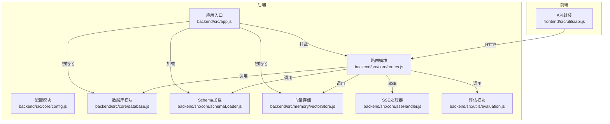
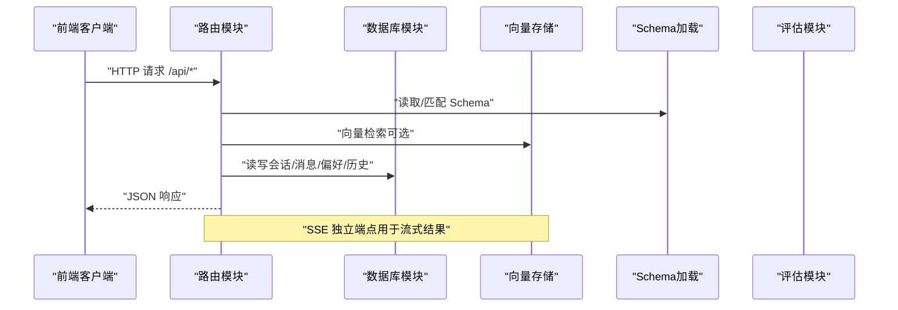
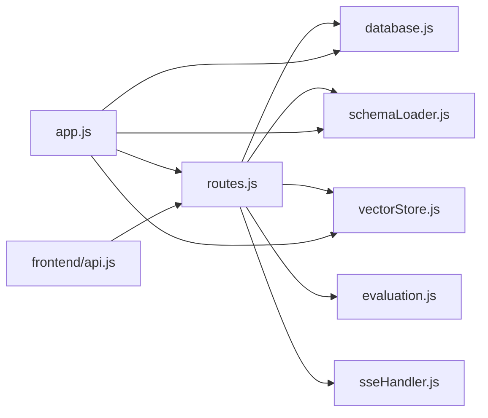

# API 参考

<cite>
**本文引用的文件**
- [backend/src/app.js](file://backend/src/app.js)
- [backend/src/core/routes.js](file://backend/src/core/routes.js)
- [backend/src/core/config.js](file://backend/src/core/config.js)
- [backend/src/core/database.js](file://backend/src/core/database.js)
- [backend/src/core/schemaLoader.js](file://backend/src/core/schemaLoader.js)
- [backend/src/core/sseHandler.js](file://backend/src/core/sseHandler.js)
- [backend/src/utils/evaluation.js](file://backend/src/utils/evaluation.js)
- [backend/src/memory/vectorStore.js](file://backend/src/memory/vectorStore.js)
- [backend/src/memory/longTermMemory.js](file://backend/src/memory/longTermMemory.js)
- [backend/config/schema-metadata.example.json](file://backend/config/schema-metadata.example.json)
- [frontend/src/utils/api.js](file://frontend/src/utils/api.js)
</cite>

## 目录
1. [简介](#简介)
2. [项目结构](#项目结构)
3. [核心组件](#核心组件)
4. [架构总览](#架构总览)
5. [详细组件分析](#详细组件分析)
6. [依赖分析](#依赖分析)
7. [性能考量](#性能考量)
8. [故障排查指南](#故障排查指南)
9. [结论](#结论)
10. [附录](#附录)

## 简介
本文件为 NL2SQL 项目的完整 API 参考文档，涵盖后端 REST API 的端点、请求参数、响应格式、错误处理、认证与安全、速率限制与重试策略、版本管理与迁移、以及前端客户端集成示例与最佳实践。项目采用 Node.js + Express 构建，提供自然语言到 SQL 的转换能力，并通过 SSE 流式返回结果。

## 项目结构
后端服务通过 Express 挂载路由模块，统一在 /api 前缀下提供 REST 接口；SSE 端点独立暴露；数据库采用 SQLite，向量数据库采用 LanceDB；配置集中于 config 模块，支持环境变量注入；前端通过 axios 封装 API 调用。

图表来源
- [backend/src/app.js:78-80](file://backend/src/app.js#L78-L80)
- [backend/src/core/routes.js:35-36](file://backend/src/core/routes.js#L35-L36)
- [backend/src/core/database.js:200-261](file://backend/src/core/database.js#L200-L261)
- [backend/src/core/schemaLoader.js:69-122](file://backend/src/core/schemaLoader.js#L69-L122)
- [backend/src/memory/vectorStore.js:231-261](file://backend/src/memory/vectorStore.js#L231-L261)
- [backend/src/core/sseHandler.js:43-112](file://backend/src/core/sseHandler.js#L43-L112)
- [backend/src/utils/evaluation.js:158-266](file://backend/src/utils/evaluation.js#L158-L266)
- [frontend/src/utils/api.js:25-34](file://frontend/src/utils/api.js#L25-L34)

章节来源
- [backend/src/app.js:56-80](file://backend/src/app.js#L56-L80)
- [backend/src/core/routes.js:35-36](file://backend/src/core/routes.js#L35-L36)

## 核心组件
- 应用入口与中间件：初始化数据库、向量库、Schema，挂载路由，配置 CORS、JSON 解析、CORS。
- 路由模块：定义 /api 下全部 REST 端点，包含健康检查、Schema 查询、会话与消息、查询历史、用户偏好、评估接口等。
- 配置模块：集中管理端口、LLM/Embedding、数据库、向量库、安全策略、会话、日志、自修复、Schema、长期记忆、上下文管理、评估等配置。
- 数据库模块：SQLite 表结构（sessions、messages、query_history、user_preferences、system_logs），提供 CRUD 与事务。
- Schema 加载：从 JSON 配置加载表结构、字段、关系、指标、维度，支持缓存与向量化。
- 向量存储：基于 LanceDB 的表级向量存储与语义检索，支持智能搜索与过滤。
- SSE 处理器：管理 SSE 连接、流式消息、进度回调、连接统计。
- 评估模块：向量化质量评估、记忆命中率统计、运行时统计与重置。

章节来源
- [backend/src/app.js:97-166](file://backend/src/app.js#L97-L166)
- [backend/src/core/routes.js:46-54](file://backend/src/core/routes.js#L46-L54)
- [backend/src/core/config.js:16-398](file://backend/src/core/config.js#L16-L398)
- [backend/src/core/database.js:39-189](file://backend/src/core/database.js#L39-L189)
- [backend/src/core/schemaLoader.js:69-122](file://backend/src/core/schemaLoader.js#L69-L122)
- [backend/src/memory/vectorStore.js:231-261](file://backend/src/memory/vectorStore.js#L231-L261)
- [backend/src/core/sseHandler.js:43-112](file://backend/src/core/sseHandler.js#L43-L112)
- [backend/src/utils/evaluation.js:158-266](file://backend/src/utils/evaluation.js#L158-L266)

## 架构总览
后端通过路由模块统一暴露 REST API，内部依赖数据库与向量存储模块；SSE 独立处理流式查询；前端通过 axios 封装统一调用 /api 前缀下的端点。

图表来源
- [backend/src/core/routes.js:150-186](file://backend/src/core/routes.js#L150-L186)
- [backend/src/core/schemaLoader.js:567-657](file://backend/src/core/schemaLoader.js#L567-L657)
- [backend/src/memory/vectorStore.js:378-435](file://backend/src/memory/vectorStore.js#L378-L435)
- [backend/src/core/database.js:361-424](file://backend/src/core/database.js#L361-L424)

## 详细组件分析

### 健康检查接口
- GET /api/health
  - 响应字段：status、timestamp、version、uptime、memory.used、memory.total
  - 状态码：200
- GET /api/health/detail
  - 响应字段：status、timestamp、components.database、components.llm、components.schema、components.sse
  - 状态码：200 或 503（任一组件异常）

章节来源
- [backend/src/core/routes.js:72-94](file://backend/src/core/routes.js#L72-L94)
- [backend/src/core/routes.js:100-137](file://backend/src/core/routes.js#L100-L137)

### Schema 接口
- GET /api/schema
  - 查询参数：type（tables|metrics|dimensions|默认返回完整）
  - 响应：version、tables、metrics、dimensions（按 type 返回子集）
  - 状态码：200
- GET /api/schema/tables/:tableName
  - 路径参数：tableName
  - 响应：table、relatedTables
  - 状态码：200 或 404（表不存在）
- GET /api/schema/search
  - 查询参数：q（关键词）、limit（默认5）
  - 响应：query、count、tables
  - 状态码：200 或 400/500

章节来源
- [backend/src/core/routes.js:150-186](file://backend/src/core/routes.js#L150-L186)
- [backend/src/core/routes.js:192-215](file://backend/src/core/routes.js#L192-L215)
- [backend/src/core/routes.js:225-250](file://backend/src/core/routes.js#L225-L250)
- [backend/src/core/schemaLoader.js:567-657](file://backend/src/core/schemaLoader.js#L567-L657)

### 会话与消息接口
- POST /api/sessions
  - 请求体：user_id、title
  - 响应：新建会话对象（id、user_id、title）
  - 状态码：201 或 500
- GET /api/sessions/:sessionId
  - 响应：会话信息
  - 状态码：200 或 404
- DELETE /api/sessions/:sessionId
  - 响应：success、message
  - 状态码：200 或 404/500
- GET /api/sessions/:sessionId/messages
  - 查询参数：limit（默认50）
  - 响应：session_id、count、messages
  - 状态码：200 或 500
- GET /api/users/:userId/sessions
  - 查询参数：limit（默认20）
  - 响应：user_id、count、sessions
  - 状态码：200 或 500

章节来源
- [backend/src/core/routes.js:266-290](file://backend/src/core/routes.js#L266-L290)
- [backend/src/core/routes.js:296-314](file://backend/src/core/routes.js#L296-L314)
- [backend/src/core/routes.js:320-345](file://backend/src/core/routes.js#L320-L345)
- [backend/src/core/routes.js:354-373](file://backend/src/core/routes.js#L354-L373)
- [backend/src/core/routes.js:379-398](file://backend/src/core/routes.js#L379-L398)
- [backend/src/core/database.js:458-492](file://backend/src/core/database.js#L458-L492)
- [backend/src/core/database.js:582-596](file://backend/src/core/database.js#L582-L596)

### 查询历史接口
- GET /api/queries/history
  - 查询参数：user_id、session_id、limit（默认20）
  - 响应：count、history
  - 状态码：200 或 500

章节来源
- [backend/src/core/routes.js:413-450](file://backend/src/core/routes.js#L413-L450)
- [backend/src/core/database.js:418-438](file://backend/src/core/database.js#L418-L438)

### 用户偏好（长期记忆）接口
- GET /api/preferences/:userId/raw
  - 查询参数：type
  - 响应：success、user_id、total_count、data.grouped
  - 状态码：200 或 500
- GET /api/preferences/:userId/stats
  - 响应：success、user_id、data
  - 状态码：200 或 500
- GET /api/preferences/:userId
  - 查询参数：type（query_pattern|field_alias|metric_preference|dimension_preference）、limit（默认50）
  - 响应：success、user_id、data
  - 状态码：200 或 500
- POST /api/preferences/:userId/templates
  - 请求体：name、dimensions、metrics、default_time_range
  - 响应：success、message、data
  - 状态码：200 或 400/500
- DELETE /api/preferences/:preferenceId
  - 响应：success、message 或 404/500
- POST /api/preferences/:userId/learn-alias
  - 请求体：user_term、schema_field、field_type（默认metric）
  - 响应：success、message、data 或 400/500

章节来源
- [backend/src/core/routes.js:461-517](file://backend/src/core/routes.js#L461-L517)
- [backend/src/core/routes.js:524-543](file://backend/src/core/routes.js#L524-L543)
- [backend/src/core/routes.js:553-592](file://backend/src/core/routes.js#L553-L592)
- [backend/src/core/routes.js:606-633](file://backend/src/core/routes.js#L606-L633)
- [backend/src/core/routes.js:639-664](file://backend/src/core/routes.js#L639-L664)
- [backend/src/core/routes.js:677-716](file://backend/src/core/routes.js#L677-L716)
- [backend/src/memory/longTermMemory.js:615-659](file://backend/src/memory/longTermMemory.js#L615-L659)
- [backend/src/memory/longTermMemory.js:772-806](file://backend/src/memory/longTermMemory.js#L772-L806)

### 评估接口
- GET /api/evaluation/stats
  - 响应：success、data（向量检索命中率、长期记忆命中率等）
  - 状态码：200 或 500
- POST /api/evaluation/stats/reset
  - 响应：success、message
  - 状态码：200 或 500
- POST /api/evaluation/schema-quality
  - 请求体：testQueries（可选）
  - 响应：success、data（评估结果）
  - 状态码：200 或 403/500
- POST /api/evaluation/query-quality
  - 请求体：testPairs（可选）
  - 响应：success、data（相似度评估结果）
  - 状态码：200 或 500

章节来源
- [backend/src/core/routes.js:726-760](file://backend/src/core/routes.js#L726-L760)
- [backend/src/core/routes.js:771-796](file://backend/src/core/routes.js#L771-L796)
- [backend/src/utils/evaluation.js:158-266](file://backend/src/utils/evaluation.js#L158-L266)
- [backend/src/utils/evaluation.js:276-334](file://backend/src/utils/evaluation.js#L276-L334)

### SSE 流式查询接口
- POST /api/sse/query
  - 请求体：session_id、query
  - 响应：提交成功（SSE 流式返回结果）
  - 状态码：200（提交成功），后续流式事件：connected、processing、progress、result、error
- GET /api/sse/stream
  - SSE 端点，用于客户端订阅流式事件
  - 响应：SSE 事件流

章节来源
- [backend/src/core/sseHandler.js:43-112](file://backend/src/core/sseHandler.js#L43-L112)
- [backend/src/core/sseHandler.js:218-280](file://backend/src/core/sseHandler.js#L218-L280)
- [backend/src/app.js:151-158](file://backend/src/app.js#L151-L158)

### 前端 API 封装示例
- 基础配置：baseURL="/api"、timeout=30000、Content-Type: application/json
- 健康检查：getHealth()、getHealthDetail()
- Schema：getSchema()、getTableDetail()、searchSchema()
- 会话：getSessions()、createSession()、getSession()、getSessionMessages()、deleteSession()
- 查询历史：getQueryHistory()
- SSE：sendQuery(sessionId, query)
- 评估：evaluationApi.getStats()、resetStats()、getConfig()、evaluateSchemaQuality()、evaluateQueryQuality()

章节来源
- [frontend/src/utils/api.js:25-34](file://frontend/src/utils/api.js#L25-L34)
- [frontend/src/utils/api.js:98-108](file://frontend/src/utils/api.js#L98-L108)
- [frontend/src/utils/api.js:118-141](file://frontend/src/utils/api.js#L118-L141)
- [frontend/src/utils/api.js:160-195](file://frontend/src/utils/api.js#L160-L195)
- [frontend/src/utils/api.js:206-208](file://frontend/src/utils/api.js#L206-L208)
- [frontend/src/utils/api.js:246-251](file://frontend/src/utils/api.js#L246-L251)
- [frontend/src/utils/api.js:265-302](file://frontend/src/utils/api.js#L265-L302)

## 依赖分析
- 路由模块依赖数据库、Schema、向量存储、评估、SSE 处理器。
- 应用入口负责初始化数据库、向量库、Schema，并挂载路由。
- 前端通过 axios 统一访问 /api 前缀。

图表来源
- [backend/src/core/routes.js:21-29](file://backend/src/core/routes.js#L21-L29)
- [backend/src/app.js:97-166](file://backend/src/app.js#L97-L166)
- [frontend/src/utils/api.js:25-34](file://frontend/src/utils/api.js#L25-L34)

章节来源
- [backend/src/core/routes.js:21-29](file://backend/src/core/routes.js#L21-L29)
- [backend/src/app.js:97-166](file://backend/src/app.js#L97-L166)

## 性能考量
- 请求体大小限制：bodyParser.json({ limit: '10mb' })
- 查询超时与行数限制：config.security.queryTimeout、config.security.maxQueryRows
- 向量检索：智能搜索与过滤，减少无关表返回；评估模块记录命中率与距离分布
- 日志轮转与级别：避免过多 IO；生产环境建议调整日志级别
- SSE：单会话多连接支持，连接数统计与清理

章节来源
- [backend/src/app.js:69](file://backend/src/app.js#L69)
- [backend/src/core/config.js:154-157](file://backend/src/core/config.js#L154-L157)
- [backend/src/utils/evaluation.js:37-60](file://backend/src/utils/evaluation.js#L37-L60)
- [backend/src/core/sseHandler.js:291-297](file://backend/src/core/sseHandler.js#L291-L297)

## 故障排查指南
- 健康检查：使用 /api/health 与 /api/health/detail 快速定位数据库、LLM、Schema、SSE 状态
- 数据库：检查 sessions、messages、query_history、user_preferences、system_logs 表结构与索引
- 向量库：确认 LanceDB 初始化成功，schema_vectors 与 query_vectors 表存在
- SSE：确认 /api/sse/stream 可用，连接数统计正常
- 评估：开启 EVALUATION_ENABLED 后方可使用评估接口

章节来源
- [backend/src/core/routes.js:72-137](file://backend/src/core/routes.js#L72-L137)
- [backend/src/core/database.js:39-189](file://backend/src/core/database.js#L39-L189)
- [backend/src/memory/vectorStore.js:231-261](file://backend/src/memory/vectorStore.js#L231-L261)
- [backend/src/core/sseHandler.js:291-318](file://backend/src/core/sseHandler.js#L291-L318)
- [backend/src/utils/evaluation.js:19-31](file://backend/src/utils/evaluation.js#L19-L31)

## 结论
本 API 参考文档覆盖了 NL2SQL 项目的主要 REST 接口与 SSE 流式查询能力，明确了请求/响应结构、错误码、安全与性能要点，并提供了前端集成示例。建议在生产环境中严格配置白名单、超时与行数限制，启用评估与日志监控，合理使用 SSE 与向量检索以提升用户体验与系统稳定性。

## 附录

### 认证与安全
- 认证机制：当前路由未实现鉴权中间件，建议在网关或路由层增加鉴权与授权策略
- 安全配置：ALLOWED_TABLES 白名单、禁止关键字过滤、敏感字段脱敏、dryRun 调试模式
- CORS：开发环境允许所有来源，生产需限定域名

章节来源
- [backend/src/app.js:65](file://backend/src/app.js#L65)
- [backend/src/core/config.js:144-170](file://backend/src/core/config.js#L144-L170)

### 速率限制与重试策略
- 速率限制：未内置限流中间件，建议在网关或路由层增加限流
- 重试策略：LLM 请求具备最大重试次数与延迟配置，可在配置中调整

章节来源
- [backend/src/core/config.js:71-73](file://backend/src/core/config.js#L71-L73)

### 错误码与状态码
- 200：成功
- 201：创建成功
- 400：缺少参数或参数非法
- 404：资源不存在
- 500：服务器内部错误
- 503：健康检查组件异常

章节来源
- [backend/src/core/routes.js:230-233](file://backend/src/core/routes.js#L230-L233)
- [backend/src/core/routes.js:131-134](file://backend/src/core/routes.js#L131-L134)

### 请求/响应 JSON Schema 定义
- 健康检查响应
  - 字段：status、timestamp、version、uptime、memory（used、total）
- Schema 查询响应
  - 字段：version、tables[]、metrics[]、dimensions[]
- 会话创建响应
  - 字段：id、user_id、title
- 查询历史响应
  - 字段：count、history[]
- 用户偏好响应
  - 字段：success、user_id、data（按 type 返回）
- 评估统计响应
  - 字段：success、data（包含 vectorSearch、longTermMemory、generatedAt、config）

章节来源
- [backend/src/core/routes.js:74-94](file://backend/src/core/routes.js#L74-L94)
- [backend/src/core/routes.js:150-186](file://backend/src/core/routes.js#L150-L186)
- [backend/src/core/routes.js:269-284](file://backend/src/core/routes.js#L269-L284)
- [backend/src/core/routes.js:418-444](file://backend/src/core/routes.js#L418-L444)
- [backend/src/core/routes.js:559-592](file://backend/src/core/routes.js#L559-L592)
- [backend/src/utils/evaluation.js:397-407](file://backend/src/utils/evaluation.js#L397-L407)

### API 版本管理与迁移
- 版本：服务版本在健康检查响应中返回（1.0.0）
- Schema 版本：schema 元数据包含 version 字段
- 迁移：数据库迁移脚本自动修复旧表结构（如移除 UNIQUE 约束）

章节来源
- [backend/src/core/routes.js:80](file://backend/src/core/routes.js#L80)
- [backend/config/schema-metadata.example.json:3](file://backend/config/schema-metadata.example.json#L3)
- [backend/src/core/database.js:271-336](file://backend/src/core/database.js#L271-L336)

### 客户端集成示例与最佳实践
- 基础配置：baseURL="/api"、超时 30 秒、JSON 请求头
- 健康检查：定期调用 /api/health
- SSE：使用 sendQuery 提交查询，订阅 /api/sse/stream 接收事件
- 错误处理：统一拦截器处理 4xx/5xx 错误，记录日志

章节来源
- [frontend/src/utils/api.js:25-34](file://frontend/src/utils/api.js#L25-L34)
- [frontend/src/utils/api.js:98-108](file://frontend/src/utils/api.js#L98-L108)
- [frontend/src/utils/api.js:246-251](file://frontend/src/utils/api.js#L246-L251)