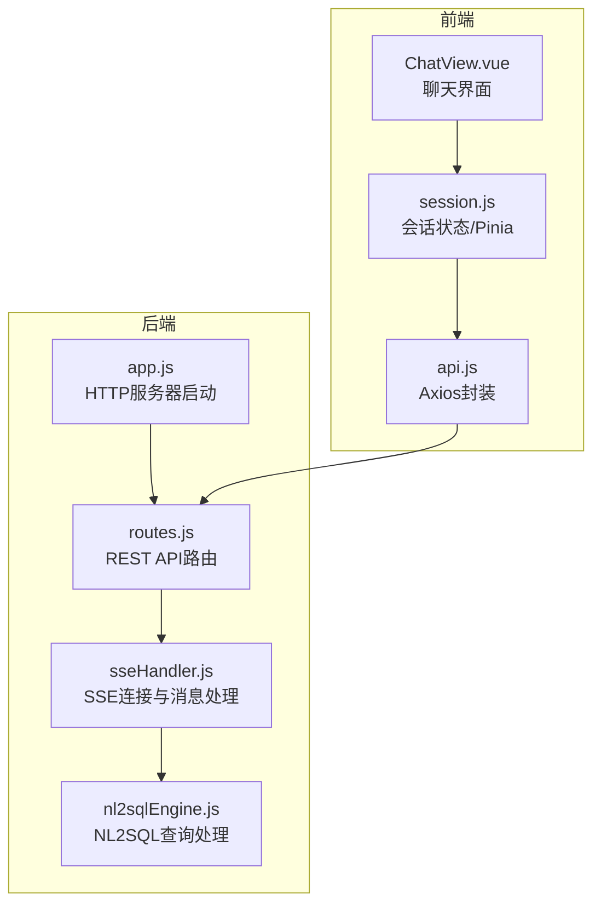
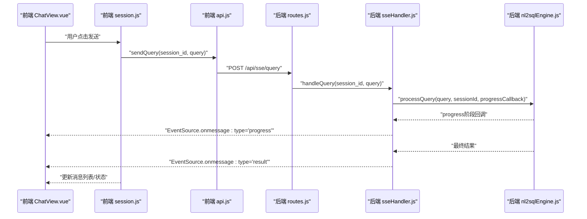
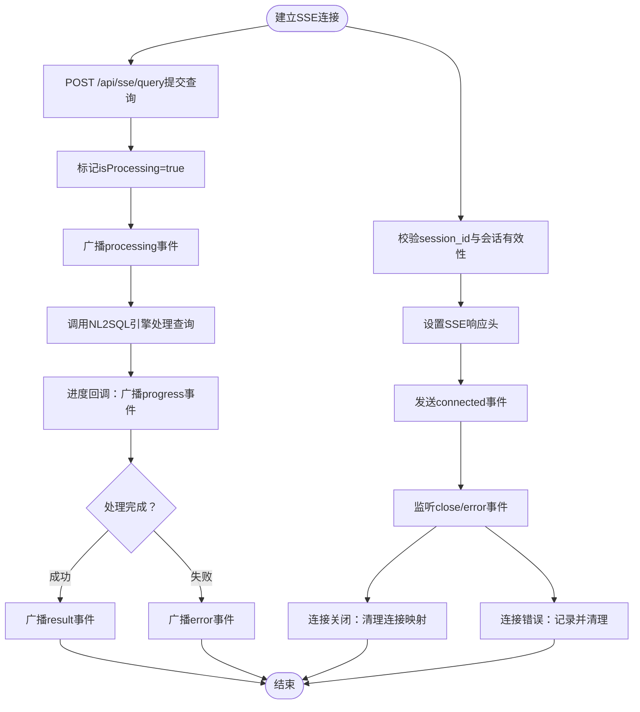
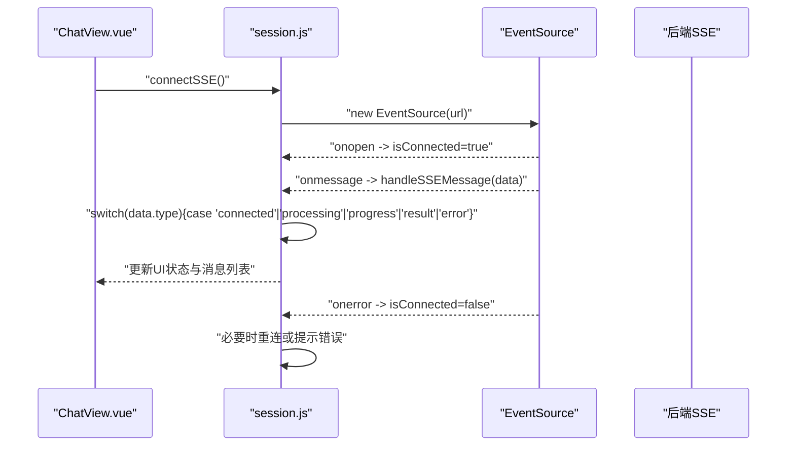
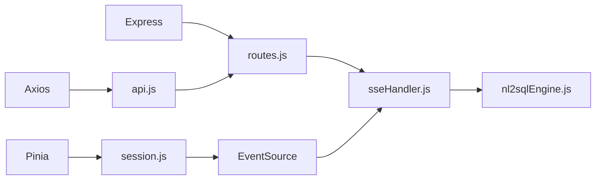

# 实时通信 API

<cite>
**本文档引用的文件**
- [backend/src/core/sseHandler.js](file://backend/src/core/sseHandler.js)
- [backend/src/core/routes.js](file://backend/src/core/routes.js)
- [backend/src/app.js](file://backend/src/app.js)
- [backend/src/core/nl2sqlEngine.js](file://backend/src/core/nl2sqlEngine.js)
- [frontend/src/utils/api.js](file://frontend/src/utils/api.js)
- [frontend/src/stores/session.js](file://frontend/src/stores/session.js)
- [frontend/src/views/ChatView.vue](file://frontend/src/views/ChatView.vue)
- [backend/package.json](file://backend/package.json)
</cite>

## 目录
1. [简介](#简介)
2. [项目结构](#项目结构)
3. [核心组件](#核心组件)
4. [架构总览](#架构总览)
5. [详细组件分析](#详细组件分析)
6. [依赖关系分析](#依赖关系分析)
7. [性能考虑](#性能考虑)
8. [故障排除指南](#故障排除指南)
9. [结论](#结论)
10. [附录](#附录)

## 简介
本文件专注于 NL2SQL 项目中的实时通信 API，特别是 Server-Sent Events (SSE) 实时查询接口。文档围绕以下目标展开：
- 详细介绍 SSE 接口 /api/sse/query 的工作原理与生命周期
- 解释连接建立、消息推送、断线重连与错误处理机制
- 说明 SSE 协议的工作方式、事件格式与消息类型
- 提供前端 EventSource 集成示例与最佳实践
- 分析连接池管理、并发连接限制与性能优化策略
- 解释实时查询的生命周期管理与状态同步机制

## 项目结构
后端采用 Express 框架，SSE 通过独立的处理器模块管理连接与消息推送；前端使用 Vue + Pinia 管理会话状态，并通过 Axios 封装的 API 与后端交互。

图表来源
- [backend/src/app.js:150-158](file://backend/src/app.js#L150-L158)
- [backend/src/core/routes.js:948-1002](file://backend/src/core/routes.js#L948-L1002)
- [backend/src/core/sseHandler.js:43-112](file://backend/src/core/sseHandler.js#L43-L112)
- [backend/src/core/nl2sqlEngine.js:2475-2492](file://backend/src/core/nl2sqlEngine.js#L2475-L2492)
- [frontend/src/utils/api.js:246-251](file://frontend/src/utils/api.js#L246-L251)
- [frontend/src/stores/session.js:185-221](file://frontend/src/stores/session.js#L185-L221)

章节来源
- [backend/src/app.js:150-158](file://backend/src/app.js#L150-L158)
- [backend/src/core/routes.js:948-1002](file://backend/src/core/routes.js#L948-L1002)
- [frontend/src/utils/api.js:246-251](file://frontend/src/utils/api.js#L246-L251)
- [frontend/src/stores/session.js:185-221](file://frontend/src/stores/session.js#L185-L221)

## 核心组件
- SSE 连接处理器：负责连接建立、消息发送、广播、连接清理与统计
- 路由层：暴露 /api/sse/stream（GET）与 /api/sse/query（POST）两个端点
- NL2SQL 引擎：处理查询、生成进度与结果，通过回调函数驱动 SSE 推送
- 前端 API 封装：提供 /api/sse/query 的 HTTP POST 调用
- 前端会话 Store：使用 EventSource 建立 SSE 连接，解析消息并更新 UI 状态

章节来源
- [backend/src/core/sseHandler.js:36-112](file://backend/src/core/sseHandler.js#L36-L112)
- [backend/src/core/routes.js:948-1002](file://backend/src/core/routes.js#L948-L1002)
- [backend/src/core/nl2sqlEngine.js:2475-2492](file://backend/src/core/nl2sqlEngine.js#L2475-L2492)
- [frontend/src/utils/api.js:246-251](file://frontend/src/utils/api.js#L246-L251)
- [frontend/src/stores/session.js:185-221](file://frontend/src/stores/session.js#L185-L221)

## 架构总览
SSE 实时查询的整体流程如下：
- 前端通过 /api/sse/query 提交查询（POST）
- 后端路由层校验参数并异步调用 SSE 处理器
- SSE 处理器广播“开始处理”、“进度”等事件
- NL2SQL 引擎在处理过程中通过回调函数推送阶段性结果
- 前端通过 EventSource 接收事件，更新 UI 状态

图表来源
- [frontend/src/views/ChatView.vue:196-330](file://frontend/src/views/ChatView.vue#L196-L330)
- [frontend/src/stores/session.js:299-330](file://frontend/src/stores/session.js#L299-L330)
- [frontend/src/utils/api.js:246-251](file://frontend/src/utils/api.js#L246-L251)
- [backend/src/core/routes.js:972-1002](file://backend/src/core/routes.js#L972-L1002)
- [backend/src/core/sseHandler.js:218-280](file://backend/src/core/sseHandler.js#L218-L280)
- [backend/src/core/nl2sqlEngine.js:2000-2436](file://backend/src/core/nl2sqlEngine.js#L2000-L2436)

## 详细组件分析

### SSE 连接与消息处理
- 连接建立：/api/sse/stream（GET）接收 session_id 与 user_id，设置 SSE 响应头，记录连接信息并发送“connected”事件
- 连接清理：监听 close/error 事件，从连接映射中移除
- 消息发送：sendMessage 将消息对象序列化为 JSON 并写入 SSE 流；broadcastToSession 对同一会话的所有连接广播
- 查询处理：/api/sse/query（POST）校验参数，异步调用 handleQuery；handleQuery 标记 isProcessing，广播“processing”，调用 NL2SQL 引擎并通过回调推送“progress”，最终推送“result”或“error”

图表来源
- [backend/src/core/routes.js:957-1002](file://backend/src/core/routes.js#L957-L1002)
- [backend/src/core/sseHandler.js:43-112](file://backend/src/core/sseHandler.js#L43-L112)
- [backend/src/core/sseHandler.js:165-204](file://backend/src/core/sseHandler.js#L165-L204)
- [backend/src/core/sseHandler.js:218-280](file://backend/src/core/sseHandler.js#L218-L280)

章节来源
- [backend/src/core/sseHandler.js:26-153](file://backend/src/core/sseHandler.js#L26-L153)
- [backend/src/core/routes.js:957-1002](file://backend/src/core/routes.js#L957-L1002)

### NL2SQL 引擎与进度回调
- 引擎在处理流程中通过回调函数发送多个阶段的进度信息（如“analyzing”、“generating”、“validating”、“executing”、“formatting”）
- 回调函数被传递给 SSE 处理器，后者广播“progress”事件
- 处理完成后，引擎返回最终结果，SSE 处理器广播“result”事件

章节来源
- [backend/src/core/nl2sqlEngine.js:2000-2436](file://backend/src/core/nl2sqlEngine.js#L2000-L2436)
- [backend/src/core/sseHandler.js:248-266](file://backend/src/core/sseHandler.js#L248-L266)

### 前端 EventSource 集成
- 建立连接：/api/sse/stream?session_id=xxx
- 事件处理：onopen/onmessage/onerror
- 消息类型解析：connected/processing/progress/result/clarify/error
- 状态同步：根据消息类型更新 isProcessing、processingStatus、processingProgress，并将结果渲染到 UI

图表来源
- [frontend/src/stores/session.js:185-221](file://frontend/src/stores/session.js#L185-L221)
- [frontend/src/stores/session.js:227-295](file://frontend/src/stores/session.js#L227-L295)
- [frontend/src/views/ChatView.vue:196-330](file://frontend/src/views/ChatView.vue#L196-L330)

章节来源
- [frontend/src/stores/session.js:185-221](file://frontend/src/stores/session.js#L185-L221)
- [frontend/src/stores/session.js:227-295](file://frontend/src/stores/session.js#L227-L295)
- [frontend/src/views/ChatView.vue:196-330](file://frontend/src/views/ChatView.vue#L196-L330)

### SSE 协议与消息格式
- 协议特性：基于 HTTP 的单向服务器推送，客户端使用 EventSource
- 事件格式：后端以“data: JSON字符串”的形式发送消息，前端通过 onmessage 接收
- 消息类型：connected、processing、progress、result、clarify、error
- 断线重连：前端在 onerror 中设置 isConnected=false，可根据业务需要进行重连策略

章节来源
- [backend/src/core/sseHandler.js:165-176](file://backend/src/core/sseHandler.js#L165-L176)
- [frontend/src/stores/session.js:227-295](file://frontend/src/stores/session.js#L227-L295)

## 依赖关系分析
- 后端依赖
  - Express：HTTP 服务器与路由
  - UUID：会话 ID 生成
  - 日志模块：统一记录日志
- 前端依赖
  - Axios：HTTP 请求封装
  - Element Plus：UI 组件
  - Pinia：状态管理

图表来源
- [backend/src/app.js:23-49](file://backend/src/app.js#L23-L49)
- [backend/src/core/routes.js:16-36](file://backend/src/core/routes.js#L16-L36)
- [backend/src/core/sseHandler.js:15-21](file://backend/src/core/sseHandler.js#L15-L21)
- [frontend/src/utils/api.js:14-34](file://frontend/src/utils/api.js#L14-L34)
- [frontend/src/stores/session.js:16-22](file://frontend/src/stores/session.js#L16-L22)

章节来源
- [backend/package.json:10-20](file://backend/package.json#L10-L20)
- [frontend/src/utils/api.js:14-34](file://frontend/src/utils/api.js#L14-L34)
- [frontend/src/stores/session.js:16-22](file://frontend/src/stores/session.js#L16-L22)

## 性能考虑
- 连接池与并发控制
  - 当前实现使用 Map 以 session_id 为键存储连接列表，支持多标签页场景
  - 通过 isProcessing 字段避免同一会话并发处理多个请求
- 缓冲与延迟
  - SSE 响应头设置 X-Accel-Buffering=no，禁用 Nginx 缓冲，保证实时性
- 资源释放
  - 监听 close/error 事件清理连接映射，避免内存泄漏
- 前端状态管理
  - 使用 Pinia 管理 SSE 连接实例与状态，便于统一控制与重连

章节来源
- [backend/src/core/sseHandler.js:30-92](file://backend/src/core/sseHandler.js#L30-L92)
- [backend/src/core/sseHandler.js:119-153](file://backend/src/core/sseHandler.js#L119-L153)
- [backend/src/app.js:65-70](file://backend/src/app.js#L65-L70)

## 故障排除指南
- 常见错误与处理
  - 缺少 session_id：/api/sse/query 返回 400
  - 查询内容为空：/api/sse/query 返回 400
  - 会话不存在：/api/sse/stream 返回 404
  - 连接关闭/错误：记录日志并清理连接映射
- 前端重连建议
  - 在 onerror 中设置 isConnected=false，并根据业务需要实现指数退避重连
  - 在 UI 上提示用户网络状态或服务不可用
- 监控与诊断
  - /api/health 与 /api/health/detail 提供服务与 SSE 连接状态
  - 日志模块记录连接建立、关闭、错误与查询处理过程

章节来源
- [backend/src/core/routes.js:972-1002](file://backend/src/core/routes.js#L972-L1002)
- [backend/src/core/sseHandler.js:48-62](file://backend/src/core/sseHandler.js#L48-L62)
- [backend/src/core/sseHandler.js:119-153](file://backend/src/core/sseHandler.js#L119-L153)
- [backend/src/core/routes.js:72-137](file://backend/src/core/routes.js#L72-L137)

## 结论
本项目通过 SSE 实现实时查询反馈，结合前端 EventSource 与后端 NL2SQL 引擎，实现了从查询提交到结果呈现的完整链路。当前实现具备清晰的连接管理、消息类型划分与错误处理机制。为进一步提升稳定性与用户体验，建议在前端增加断线重连策略与更细粒度的进度展示，并在后端引入连接数上限与超时控制等扩展能力。

## 附录

### SSE 接口规范
- 建立连接
  - 方法：GET
  - 路径：/api/sse/stream
  - 参数：session_id（必填）、user_id（可选，默认 anonymous）
  - 成功响应：connected 事件
- 提交查询
  - 方法：POST
  - 路径：/api/sse/query
  - 请求体：{ session_id, query }
  - 成功响应：立即返回 { success: true, message }

章节来源
- [backend/src/core/routes.js:948-1002](file://backend/src/core/routes.js#L948-L1002)

### 前端集成要点
- 使用 EventSource 连接 /api/sse/stream?session_id=xxx
- 监听 onopen/onmessage/onerror
- 根据 data.type 分发到对应 UI 状态更新
- 在 UI 中展示 processingStatus 与 processingProgress

章节来源
- [frontend/src/stores/session.js:185-221](file://frontend/src/stores/session.js#L185-L221)
- [frontend/src/stores/session.js:227-295](file://frontend/src/stores/session.js#L227-L295)
- [frontend/src/utils/api.js:246-251](file://frontend/src/utils/api.js#L246-L251)