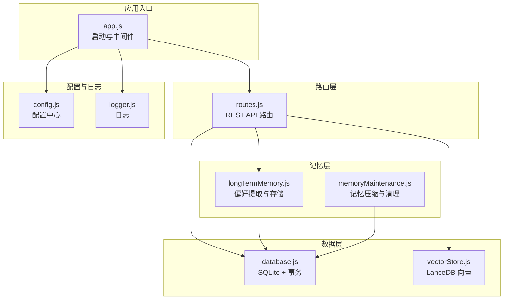
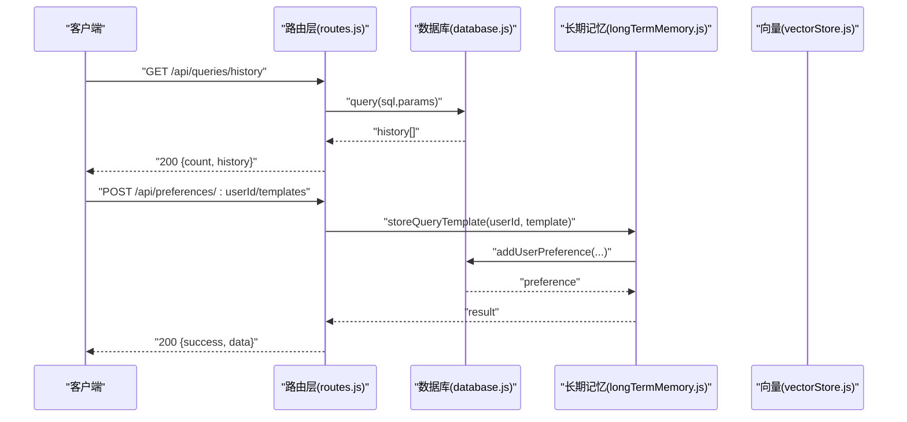
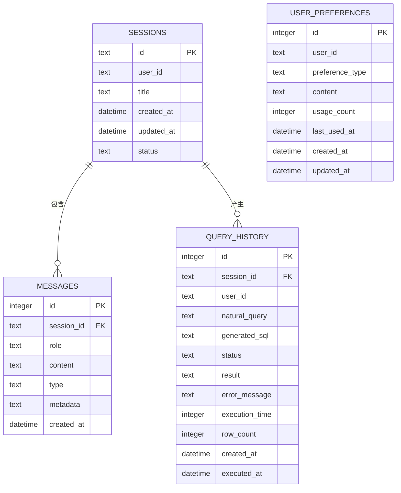

# 数据管理 API

<cite>
**本文引用的文件**
- [app.js](file://backend/src/app.js)
- [routes.js](file://backend/src/core/routes.js)
- [database.js](file://backend/src/core/database.js)
- [longTermMemory.js](file://backend/src/memory/longTermMemory.js)
- [memoryMaintenance.js](file://backend/src/memory/memoryMaintenance.js)
- [vectorStore.js](file://backend/src/memory/vectorStore.js)
- [config.js](file://backend/src/core/config.js)
- [logger.js](file://backend/src/utils/logger.js)
- [package.json](file://backend/package.json)
</cite>

## 目录
1. [简介](#简介)
2. [项目结构](#项目结构)
3. [核心组件](#核心组件)
4. [架构总览](#架构总览)
5. [详细组件分析](#详细组件分析)
6. [依赖分析](#依赖分析)
7. [性能考量](#性能考量)
8. [故障排查指南](#故障排查指南)
9. [结论](#结论)
10. [附录](#附录)

## 简介
本文件面向数据管理相关 API 的使用者与维护者，系统性梳理以下接口：
- 查询历史管理接口：/api/queries/history
- 用户偏好（长期记忆）管理接口：/api/preferences
- 用户会话管理接口：/api/sessions、/api/users/:userId/sessions、/api/sessions/:sessionId/messages

文档涵盖：
- 数据模型与表结构
- CRUD 操作与数据验证规则
- 请求参数与响应格式
- 错误码与错误处理
- 分页、过滤与排序实现
- 数据一致性与事务处理
- 性能与扩展建议

## 项目结构
后端采用 Express 框架，核心模块包括：
- 应用入口与中间件：app.js
- 路由定义：core/routes.js
- 数据库与事务：core/database.js
- 长期记忆与偏好：memory/longTermMemory.js、memory/memoryMaintenance.js
- 向量数据库：memory/vectorStore.js
- 配置与日志：core/config.js、utils/logger.js
- 依赖与脚本：package.json

图表来源
- [app.js:1-238](file://backend/src/app.js#L1-L238)
- [routes.js:1-800](file://backend/src/core/routes.js#L1-L800)
- [database.js:1-850](file://backend/src/core/database.js#L1-L850)
- [longTermMemory.js:1-1141](file://backend/src/memory/longTermMemory.js#L1-L1141)
- [memoryMaintenance.js:1-415](file://backend/src/memory/memoryMaintenance.js#L1-L415)
- [vectorStore.js:1-759](file://backend/src/memory/vectorStore.js#L1-L759)
- [config.js:1-398](file://backend/src/core/config.js#L1-L398)
- [logger.js:1-442](file://backend/src/utils/logger.js#L1-L442)

章节来源
- [app.js:1-238](file://backend/src/app.js#L1-L238)
- [routes.js:1-800](file://backend/src/core/routes.js#L1-L800)

## 核心组件
- 查询历史表（query_history）：记录用户自然语言查询、生成 SQL、执行状态、耗时、结果等。
- 用户偏好表（user_preferences）：记录查询模式、字段别名、指标/维度偏好等。
- 会话表（sessions）与消息表（messages）：会话生命周期与消息历史。
- 长期记忆模块：从查询意图中提取并存储用户偏好，支持阈值筛选、LLM 智能分析、相似模式合并与分级清理。
- 向量数据库：Schema 与查询历史向量化，支持语义检索与智能排序。

章节来源
- [database.js:94-165](file://backend/src/core/database.js#L94-L165)
- [longTermMemory.js:24-46](file://backend/src/memory/longTermMemory.js#L24-L46)
- [memoryMaintenance.js:24-46](file://backend/src/memory/memoryMaintenance.js#L24-L46)
- [vectorStore.js:27-130](file://backend/src/memory/vectorStore.js#L27-L130)

## 架构总览
数据管理 API 的调用链路如下：
- 客户端请求进入 Express 路由层
- 路由层调用数据库模块执行 CRUD
- 长期记忆模块参与偏好提取与存储
- 向量数据库用于语义检索与增强

图表来源
- [routes.js:404-450](file://backend/src/core/routes.js#L404-L450)
- [routes.js:594-633](file://backend/src/core/routes.js#L594-L633)
- [database.js:608-618](file://backend/src/core/database.js#L608-L618)
- [longTermMemory.js:614-659](file://backend/src/memory/longTermMemory.js#L614-L659)

## 详细组件分析

### 查询历史管理接口
- 路径：/api/queries/history
- 方法：GET
- 功能：按用户或会话筛选查询历史，支持 limit 限制与按时间倒序排序

请求参数
- user_id: 可选，按用户ID筛选
- session_id: 可选，按会话ID筛选
- limit: 可选，默认20，限制返回数量

响应
- count: 返回条目数
- history: 查询历史数组，每条记录包含：
  - id、session_id、user_id、natural_query、generated_sql、status、result、error_message、execution_time、row_count、created_at、executed_at

错误处理
- 500：数据库查询失败时返回错误对象

分页、过滤与排序
- 过滤：动态拼接 WHERE 条件，支持 user_id 与 session_id
- 排序：按 created_at DESC
- 限制：LIMIT + 参数 limit

数据模型
- 表：query_history
- 字段：见“核心组件”章节

章节来源
- [routes.js:404-450](file://backend/src/core/routes.js#L404-L450)
- [database.js:94-135](file://backend/src/core/database.js#L94-L135)

### 用户偏好（长期记忆）管理接口
- 路径：/api/preferences
- 方法：GET/POST/DELETE
- 功能：获取用户偏好、添加查询模板、删除偏好、学习字段别名、获取原始数据与统计

1) 获取用户偏好列表
- 路径：/api/preferences/:userId
- 方法：GET
- 查询参数：
  - type: 可选，类型过滤（query_pattern、field_alias、metric_preference、dimension_preference）
  - limit: 可选，默认50
- 响应：success、user_id、data（按 type 返回对应字段）

2) 手动添加查询模板
- 路径：/api/preferences/:userId/templates
- 方法：POST
- 请求体：
  - name、dimensions、metrics、default_time_range
- 响应：success、message、data

3) 删除用户偏好
- 路径：/api/preferences/:preferenceId
- 方法：DELETE
- 响应：success、message 或 404 错误

4) 手动学习字段别名
- 路径：/api/preferences/:userId/learn-alias
- 方法：POST
- 请求体：
  - user_term、schema_field、field_type（metric/dimension/filter）
- 响应：success、message、data 或 400 错误

5) 获取原始数据（调试）
- 路径：/api/preferences/:userId/raw
- 方法：GET
- 查询参数：type（可选）
- 响应：success、user_id、total_count、data（all、grouped）

6) 获取用户记忆统计
- 路径：/api/preferences/:userId/stats
- 方法：GET
- 响应：success、user_id、data

数据模型
- 表：user_preferences
- 字段：id、user_id、preference_type、content、usage_count、last_used_at、created_at、updated_at

数据验证规则
- POST /api/preferences/:userId/templates：name 必填
- POST /api/preferences/:userId/learn-alias：user_term、schema_field 必填

事务与一致性
- 长期记忆存储使用数据库事务封装，确保偏好写入原子性
- 记忆维护模块按使用频率与时间进行分级清理，避免冗余偏好占用空间

章节来源
- [routes.js:545-716](file://backend/src/core/routes.js#L545-L716)
- [database.js:137-165](file://backend/src/core/database.js#L137-L165)
- [longTermMemory.js:312-485](file://backend/src/memory/longTermMemory.js#L312-L485)
- [memoryMaintenance.js:69-189](file://backend/src/memory/memoryMaintenance.js#L69-L189)

### 用户会话管理接口
- 路径：/api/sessions
- 方法：POST/GET/DELETE
- 功能：创建会话、获取会话、删除会话

1) 创建会话
- 路径：/api/sessions
- 方法：POST
- 请求体：user_id、title（可选）
- 响应：201 + 会话对象

2) 获取会话
- 路径：/api/sessions/:sessionId
- 方法：GET
- 响应：会话对象或 404

3) 删除会话
- 路径：/api/sessions/:sessionId
- 方法：DELETE
- 响应：success、message 或 404

- 路径：/api/sessions/:sessionId/messages
- 方法：GET
- 查询参数：limit（默认50）
- 响应：session_id、count、messages

- 路径：/api/users/:userId/sessions
- 方法：GET
- 查询参数：limit（默认20）
- 响应：user_id、count、sessions

数据模型
- 表：sessions、messages
- 字段：见“核心组件”章节

事务与一致性
- 删除会话时，使用事务先删除消息再删除会话，保证外键约束下的数据一致性

章节来源
- [routes.js:256-398](file://backend/src/core/routes.js#L256-L398)
- [database.js:448-540](file://backend/src/core/database.js#L448-L540)

### 数据模型与表结构
- sessions
  - id、user_id、title、created_at、updated_at、status
  - 索引：user_id、status、updated_at
- messages
  - id、session_id、role、content、type、metadata、created_at
  - 索引：session_id、created_at
  - 外键：session_id -> sessions.id (CASCADE)
- query_history
  - id、session_id、user_id、natural_query、generated_sql、status、result、error_message、execution_time、row_count、created_at、executed_at
  - 索引：user_id、session_id、created_at、status
  - 外键：session_id -> sessions.id (SET NULL)
- user_preferences
  - id、user_id、preference_type、content、usage_count、last_used_at、created_at、updated_at
  - 索引：user_id、preference_type、user_id+preference_type

章节来源
- [database.js:39-189](file://backend/src/core/database.js#L39-L189)

### 分页、过滤与排序实现
- 查询历史：按 created_at DESC + LIMIT
- 用户偏好：按 usage_count DESC、last_used_at DESC + LIMIT
- 会话消息：按 created_at ASC + LIMIT
- 会话列表：按 updated_at DESC + LIMIT

章节来源
- [routes.js:413-450](file://backend/src/core/routes.js#L413-L450)
- [database.js:627-649](file://backend/src/core/database.js#L627-L649)
- [database.js:582-596](file://backend/src/core/database.js#L582-L596)
- [database.js:484-492](file://backend/src/core/database.js#L484-L492)

### 数据一致性与事务处理
- 外键约束：启用 PRAGMA foreign_keys = ON
- 事务封装：deleteSession 使用事务，先删消息再删会话
- 偏好存储：findExistingPreference + updateUserUsage，避免重复写入
- 记忆维护：按使用频率与时间阈值清理，支持相似模式合并

章节来源
- [database.js:228-236](file://backend/src/core/database.js#L228-L236)
- [database.js:523-540](file://backend/src/core/database.js#L523-L540)
- [database.js:724-751](file://backend/src/core/database.js#L724-L751)
- [memoryMaintenance.js:133-189](file://backend/src/memory/memoryMaintenance.js#L133-L189)

## 依赖分析
- Express：路由与中间件
- sqlite3：SQLite 数据库
- uuid：会话ID生成
- dayjs：时间处理
- node-cron：定时任务
- vectordb：LanceDB 向量数据库

章节来源
- [package.json:10-20](file://backend/package.json#L10-L20)

## 性能考量
- 索引优化：为高频查询字段建立索引（user_id、session_id、created_at、status）
- 限制返回：默认 limit 控制响应大小，避免大查询导致内存压力
- 向量检索：智能排序与过滤，减少无关结果
- 事务批处理：删除会话时批量清理消息，降低锁竞争
- 配置化阈值：长期记忆分级保留策略，平衡存储与召回

[本节为通用指导，无需特定文件引用]

## 故障排查指南
常见错误与定位
- 400：缺少必填参数（如模板 name、字段别名的 user_term/schema_field）
- 404：资源不存在（会话、偏好）
- 500：数据库查询/执行失败、向量数据库未初始化
- 日志：使用 logger 记录错误堆栈与上下文，便于定位

排查步骤
- 检查路由参数与查询参数是否正确
- 查看数据库表结构与索引是否完整
- 确认向量数据库初始化状态
- 检查配置项（如 allowedTables、maxQueryRows、dryRun）

章节来源
- [routes.js:594-716](file://backend/src/core/routes.js#L594-L716)
- [database.js:271-336](file://backend/src/core/database.js#L271-L336)
- [vectorStore.js:231-261](file://backend/src/memory/vectorStore.js#L231-L261)
- [logger.js:299-309](file://backend/src/utils/logger.js#L299-L309)

## 结论
本数据管理 API 以 SQLite 为核心持久化，结合长期记忆与向量检索，提供完善的查询历史、用户偏好与会话管理能力。通过事务与索引保障数据一致性与性能，配合配置化阈值与定时维护，实现可持续演进的记忆体系。

[本节为总结，无需特定文件引用]

## 附录

### API 定义与示例路径
- 查询历史
  - GET /api/queries/history?user_id={id}&session_id={id}&limit={n}
  - 示例路径：[routes.js:404-450](file://backend/src/core/routes.js#L404-L450)
- 用户偏好
  - GET /api/preferences/:userId?type={type}&limit={n}
  - POST /api/preferences/:userId/templates
  - DELETE /api/preferences/:preferenceId
  - POST /api/preferences/:userId/learn-alias
  - GET /api/preferences/:userId/raw?type={type}
  - GET /api/preferences/:userId/stats
  - 示例路径：[routes.js:545-716](file://backend/src/core/routes.js#L545-L716)
- 会话管理
  - POST /api/sessions
  - GET /api/sessions/:sessionId
  - DELETE /api/sessions/:sessionId
  - GET /api/sessions/:sessionId/messages?limit={n}
  - GET /api/users/:userId/sessions?limit={n}
  - 示例路径：[routes.js:256-398](file://backend/src/core/routes.js#L256-L398)

### 数据模型 ER 图

图表来源
- [database.js:39-189](file://backend/src/core/database.js#L39-L189)