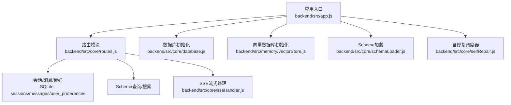
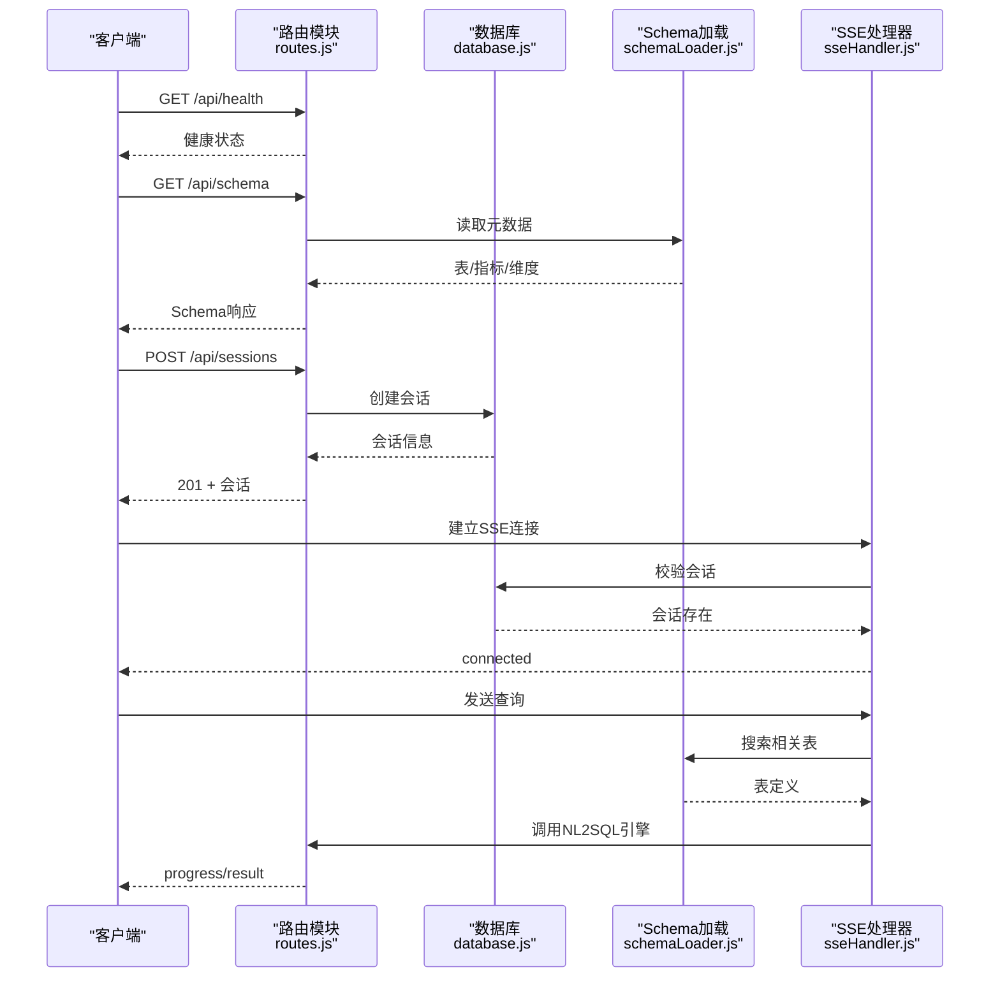
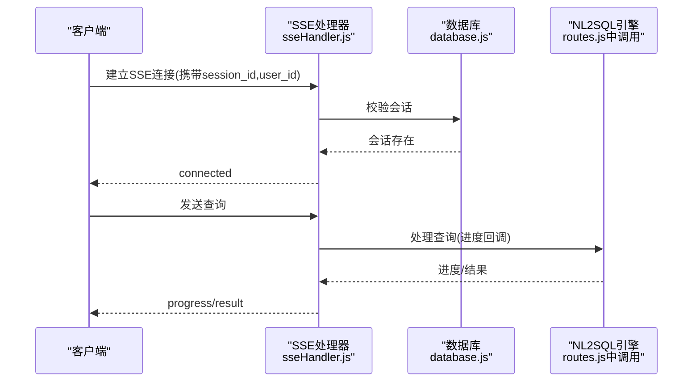
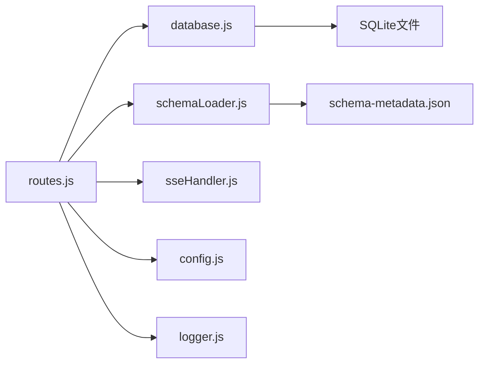

# 核心 API

<cite>
**本文引用的文件**
- [backend/src/app.js](file://backend/src/app.js)
- [backend/src/core/routes.js](file://backend/src/core/routes.js)
- [backend/src/core/database.js](file://backend/src/core/database.js)
- [backend/src/core/schemaLoader.js](file://backend/src/core/schemaLoader.js)
- [backend/src/core/sseHandler.js](file://backend/src/core/sseHandler.js)
- [backend/src/core/config.js](file://backend/src/core/config.js)
- [backend/src/utils/logger.js](file://backend/src/utils/logger.js)
- [backend/package.json](file://backend/package.json)
- [backend/config/schema-metadata.example.json](file://backend/config/schema-metadata.example.json)
</cite>

## 目录
1. [简介](#简介)
2. [项目结构](#项目结构)
3. [核心组件](#核心组件)
4. [架构总览](#架构总览)
5. [详细组件分析](#详细组件分析)
6. [依赖分析](#依赖分析)
7. [性能考虑](#性能考虑)
8. [故障排查指南](#故障排查指南)
9. [结论](#结论)
10. [附录](#附录)

## 简介
本文件聚焦 NL2SQL 核心 API 接口，围绕以下三大主题展开：
- 健康检查：/api/health 与 /api/health/detail
- Schema 查询：/api/schema、/api/schema/tables/:tableName、/api/schema/search
- 会话管理：/api/sessions、/api/sessions/:sessionId、/api/sessions/:sessionId/messages、/api/users/:userId/sessions

文档将逐项说明 HTTP 方法、URL 路径、请求参数、响应格式、错误处理，并给出成功与失败示例；同时解释接口之间的依赖关系与调用顺序，提供性能与限流建议及最佳实践。

## 项目结构
后端采用 Express 框架，核心入口负责初始化数据库、向量库、Schema 元数据与自修复任务，随后挂载路由模块至 /api 前缀。路由模块集中定义上述核心 API。

**图表来源**
- [backend/src/app.js:78-158](file://backend/src/app.js#L78-L158)
- [backend/src/core/routes.js:35-137](file://backend/src/core/routes.js#L35-L137)

**章节来源**
- [backend/src/app.js:56-158](file://backend/src/app.js#L56-L158)
- [backend/src/core/routes.js:35-137](file://backend/src/core/routes.js#L35-L137)

## 核心组件
- 路由层：集中定义 /api 下的 REST 接口，包含健康检查、Schema 查询、会话管理等。
- 数据层：SQLite 持久化会话、消息、查询历史与用户偏好。
- Schema 层：加载 JSON 元数据，提供表/字段/指标/维度查询与语义搜索。
- SSE 层：处理实时流式响应，承载 NL2SQL 查询过程的进度与结果推送。
- 配置与日志：统一配置与日志记录，支撑健康检查与错误追踪。

**章节来源**
- [backend/src/core/routes.js:56-137](file://backend/src/core/routes.js#L56-L137)
- [backend/src/core/database.js:39-189](file://backend/src/core/database.js#L39-L189)
- [backend/src/core/schemaLoader.js:69-122](file://backend/src/core/schemaLoader.js#L69-L122)
- [backend/src/core/sseHandler.js:43-112](file://backend/src/core/sseHandler.js#L43-L112)
- [backend/src/core/config.js:16-398](file://backend/src/core/config.js#L16-L398)

## 架构总览
下图展示了核心 API 的调用链与依赖关系：路由层调用数据库与 Schema 模块，SSE 层在查询处理过程中进行流式推送。

**图表来源**
- [backend/src/core/routes.js:72-137](file://backend/src/core/routes.js#L72-L137)
- [backend/src/core/routes.js:266-398](file://backend/src/core/routes.js#L266-L398)
- [backend/src/core/database.js:458-540](file://backend/src/core/database.js#L458-L540)
- [backend/src/core/schemaLoader.js:567-657](file://backend/src/core/schemaLoader.js#L567-L657)
- [backend/src/core/sseHandler.js:43-112](file://backend/src/core/sseHandler.js#L43-L112)

## 详细组件分析

### 健康检查接口
- GET /api/health
  - 功能：返回服务基本健康状态（状态、时间戳、版本、运行时长、内存使用）。
  - 成功响应：200，包含 status、timestamp、version、uptime、memory。
  - 失败响应：通常不会 500，除非系统异常；若需扩展，可在后续增加组件状态检查。
  - 示例：
    - 成功：{"status":"ok","timestamp":"2025-04-05T08:00:00Z","version":"1.0.0","uptime":120,"memory":{"used":120,"total":512}}
- GET /api/health/detail
  - 功能：返回详细健康状态，包含数据库、LLM、Schema、SSE 连接等组件状态。
  - 成功响应：200，包含 status、timestamp、components.*。
  - 失败响应：当任一组件异常时返回 503，status="error"。
  - 示例：
    - 成功：{"status":"ok","timestamp":"2025-04-05T08:00:00Z","components":{"database":{"status":"ok","message":"SQLite连接正常"},"llm":{"status":"ok","message":"LLM API配置正常"},"schema":{"status":"ok","tables":12},"sse":{"status":"ok","connections":3}}}
    - 失败：{"status":"error","timestamp":"...","components":{"..."}}

**章节来源**
- [backend/src/core/routes.js:72-137](file://backend/src/core/routes.js#L72-L137)

### Schema 查询接口
- GET /api/schema
  - 查询参数：
    - type: 可选，取值 tables|metrics|dimensions，用于筛选返回内容。
  - 成功响应：
    - type=tables：返回 {"tables": [...]}
    - type=metrics：返回 {"metrics": [...]}
    - type=dimensions：返回 {"dimensions": [...]}
    - 无 type：返回完整 Schema {"version","tables","metrics","dimensions"}
  - 示例：
    - 成功：{"version":"1.0","tables":[...],"metrics":[...],"dimensions":[...]}

- GET /api/schema/tables/:tableName
  - 路径参数：tableName
  - 成功响应：{"table": {...},"relatedTables": [...]}
  - 失败响应：404，{"error":"表不存在","tableName": "..."}
  - 示例：
    - 成功：{"table":{"name":"sales_order","fields":[...]}}，“relatedTables”为关联表名数组

- GET /api/schema/search
  - 查询参数：
    - q: 必填，搜索关键词
    - limit: 可选，默认5
  - 成功响应：{"query","count","tables": [...]}
  - 失败响应：400（缺少 q）、500（内部错误）
  - 示例：
    - 成功：{"query":"订单","count":2,"tables":[{"name":"sales_order","name_cn":"销售订单表",...}]}

- 依赖关系与调用顺序
  - /api/schema 依赖 schemaLoader 的元数据缓存与映射。
  - /api/schema/tables/:tableName 依赖 schemaLoader.getTable 与 getRelatedTables。
  - /api/schema/search 依赖向量存储与语义搜索（若可用）。

**章节来源**
- [backend/src/core/routes.js:150-250](file://backend/src/core/routes.js#L150-L250)
- [backend/src/core/schemaLoader.js:437-527](file://backend/src/core/schemaLoader.js#L437-L527)
- [backend/src/core/schemaLoader.js:567-714](file://backend/src/core/schemaLoader.js#L567-L714)

### 会话管理接口
- POST /api/sessions
  - 请求体：
    - user_id: 用户ID（可选，匿名用户）
    - title: 会话标题（可选）
  - 成功响应：201，返回新建会话对象（包含 id、user_id、title 等）。
  - 失败响应：500，{"error":"..."}
  - 示例：
    - 成功：{"id":"abcd-efgh","user_id":"user123","title":"新会话"}

- GET /api/sessions/:sessionId
  - 路径参数：sessionId
  - 成功响应：会话对象
  - 失败响应：404，{"error":"会话不存在"}
  - 示例：
    - 成功：{"id":"abcd-efgh","user_id":"user123","title":"新会话","status":"active"}

- DELETE /api/sessions/:sessionId
  - 路径参数：sessionId
  - 成功响应：{"success":true,"message":"会话已删除"}
  - 失败响应：404（会话不存在）、500（内部错误）
  - 示例：
    - 成功：{"success":true,"message":"会话已删除"}

- GET /api/sessions/:sessionId/messages
  - 路径参数：sessionId
  - 查询参数：limit（默认50）
  - 成功响应：{"session_id","count","messages": [...]}
  - 失败响应：500
  - 示例：
    - 成功：{"session_id":"abcd-efgh","count":2,"messages":[{"role":"user","content":"..."}...]}

- GET /api/users/:userId/sessions
  - 路径参数：userId
  - 查询参数：limit（默认20）
  - 成功响应：{"user_id","count","sessions": [...]}
  - 失败响应：500
  - 示例：
    - 成功：{"user_id":"user123","count":5,"sessions":[...]}

- 依赖关系与调用顺序
  - 以上接口均依赖 database 模块的会话与消息 CRUD 操作。
  - 删除会话会级联清理消息。

**章节来源**
- [backend/src/core/routes.js:266-398](file://backend/src/core/routes.js#L266-L398)
- [backend/src/core/database.js:458-596](file://backend/src/core/database.js#L458-L596)

### SSE 流式查询（与会话管理的协同）
- 建立连接：客户端通过 SSE 端点建立连接，携带 session_id 与 user_id。
- 校验：SSE 处理器校验会话存在性，否则返回 404。
- 查询处理：SSE 接收查询后，调用 NL2SQL 引擎，期间通过流式事件推送进度与最终结果。
- 断开：客户端断开或错误时，SSE 清理连接。

**图表来源**
- [backend/src/core/sseHandler.js:43-112](file://backend/src/core/sseHandler.js#L43-L112)
- [backend/src/core/sseHandler.js:218-280](file://backend/src/core/sseHandler.js#L218-L280)
- [backend/src/core/routes.js:266-398](file://backend/src/core/routes.js#L266-L398)

**章节来源**
- [backend/src/core/sseHandler.js:43-112](file://backend/src/core/sseHandler.js#L43-L112)
- [backend/src/core/sseHandler.js:218-280](file://backend/src/core/sseHandler.js#L218-L280)

## 依赖分析
- 路由层依赖：
  - database.js：会话、消息、偏好、查询历史的 CRUD。
  - schemaLoader.js：Schema 元数据读取与搜索。
  - sseHandler.js：SSE 连接与流式事件。
  - config.js：全局配置（端口、白名单、超时、行数限制等）。
  - logger.js：统一日志记录。
- 数据层：
  - SQLite 表：sessions、messages、query_history、user_preferences。
- Schema 层：
  - JSON 元数据文件（示例）：schema-metadata.example.json。
- 外部依赖：
  - Express、sqlite3、uuid、dayjs、node-cron、vectordb（向量库）。

**图表来源**
- [backend/src/core/routes.js:35-54](file://backend/src/core/routes.js#L35-L54)
- [backend/src/core/database.js:39-189](file://backend/src/core/database.js#L39-L189)
- [backend/src/core/schemaLoader.js:69-122](file://backend/src/core/schemaLoader.js#L69-L122)
- [backend/src/core/sseHandler.js:43-112](file://backend/src/core/sseHandler.js#L43-L112)
- [backend/src/core/config.js:16-398](file://backend/src/core/config.js#L16-L398)
- [backend/src/utils/logger.js:54-442](file://backend/src/utils/logger.js#L54-L442)
- [backend/config/schema-metadata.example.json:1-328](file://backend/config/schema-metadata.example.json#L1-L328)

**章节来源**
- [backend/src/core/routes.js:35-54](file://backend/src/core/routes.js#L35-L54)
- [backend/src/core/database.js:39-189](file://backend/src/core/database.js#L39-L189)
- [backend/src/core/schemaLoader.js:69-122](file://backend/src/core/schemaLoader.js#L69-L122)
- [backend/src/core/sseHandler.js:43-112](file://backend/src/core/sseHandler.js#L43-L112)
- [backend/src/core/config.js:16-398](file://backend/src/core/config.js#L16-L398)
- [backend/src/utils/logger.js:54-442](file://backend/src/utils/logger.js#L54-L442)
- [backend/config/schema-metadata.example.json:1-328](file://backend/config/schema-metadata.example.json#L1-L328)

## 性能考虑
- 健康检查：
  - /api/health 返回轻量信息，适合高频探活。
  - /api/health/detail 会检查多个组件，建议降低调用频率或仅在运维巡检时使用。
- Schema 查询：
  - /api/schema 读取内存缓存的元数据，响应快；/api/schema/search 若启用向量库，注意 Embedding 与检索延迟。
- 会话与消息：
  - SQLite 适合中小规模数据；若并发高，建议引入连接池与索引优化（已创建索引）。
- SSE：
  - 流式推送需关注客户端缓冲与网络稳定性；生产环境建议配合反向代理禁用缓冲。
- 安全与限制：
  - 配置白名单表、最大返回行数、查询超时、禁止关键字等，避免资源滥用与安全风险。

**章节来源**
- [backend/src/core/routes.js:72-137](file://backend/src/core/routes.js#L72-L137)
- [backend/src/core/schemaLoader.js:567-714](file://backend/src/core/schemaLoader.js#L567-L714)
- [backend/src/core/database.js:39-189](file://backend/src/core/database.js#L39-L189)
- [backend/src/core/sseHandler.js:64-70](file://backend/src/core/sseHandler.js#L64-L70)
- [backend/src/core/config.js:140-170](file://backend/src/core/config.js#L140-L170)

## 故障排查指南
- 健康检查
  - /api/health.detail 返回 503：检查数据库、LLM、Schema、SSE 组件状态。
- Schema 查询
  - /api/schema/search 返回 500：检查向量库初始化与 Embedding 服务可用性。
- 会话管理
  - /api/sessions/:sessionId 返回 404：确认会话 ID 是否正确或已被删除。
  - /api/sessions/:sessionId/messages 返回 500：检查 SQLite 连接与查询参数。
- SSE
  - 建立连接返回 404：确认 session_id 存在且 active。
  - 处理查询报错：查看 SSE 广播错误事件与后端日志。
- 日志
  - 使用 logger 统一记录错误与追踪，定位问题根因。

**章节来源**
- [backend/src/core/routes.js:100-137](file://backend/src/core/routes.js#L100-L137)
- [backend/src/core/routes.js:225-250](file://backend/src/core/routes.js#L225-L250)
- [backend/src/core/routes.js:296-314](file://backend/src/core/routes.js#L296-L314)
- [backend/src/core/sseHandler.js:56-62](file://backend/src/core/sseHandler.js#L56-L62)
- [backend/src/utils/logger.js:299-309](file://backend/src/utils/logger.js#L299-L309)

## 结论
本文梳理了 NL2SQL 的核心 API：健康检查、Schema 查询与会话管理，并阐明了它们与数据库、Schema 加载与 SSE 的依赖关系。通过合理的配置与限流策略，可在保证安全与性能的前提下，稳定地支撑自然语言到 SQL 的转换与交互。

## 附录

### 接口一览与示例（汇总）
- 健康检查
  - GET /api/health
    - 成功：{"status":"ok","timestamp":"...","version":"1.0.0","uptime":...,"memory":{"used":...,"total":...}}
  - GET /api/health/detail
    - 成功：{"status":"ok","timestamp":"...","components":{"database":{"status":"ok",...},"llm":{"status":"ok",...},"schema":{"status":"ok","tables":...},"sse":{"status":"ok","connections":...}}}
    - 失败：{"status":"error","timestamp":"...","components":{"..."}}
- Schema 查询
  - GET /api/schema?type=tables|metrics|dimensions
    - 成功：{"tables": [...] | "metrics": [...] | "dimensions": [...]}
  - GET /api/schema/tables/:tableName
    - 成功：{"table": {...},"relatedTables": [...]}
    - 失败：{"error":"表不存在","tableName": "..."}
  - GET /api/schema/search?q=&limit=
    - 成功：{"query":"...","count":...,"tables":[...]}
    - 失败：{"error":"缺少搜索关键词（q参数）"} 或 {"error":"搜索失败: ..."}
- 会话管理
  - POST /api/sessions
    - 成功：201，{"id":"...","user_id":"...","title":"..."}
  - GET /api/sessions/:sessionId
    - 成功：{"id":"...","user_id":"...","title":"...","status":"active"}
    - 失败：{"error":"会话不存在"}
  - DELETE /api/sessions/:sessionId
    - 成功：{"success":true,"message":"会话已删除"}
    - 失败：{"error":"..."}
  - GET /api/sessions/:sessionId/messages?limit=
    - 成功：{"session_id":"...","count":...,"messages":[...]}
    - 失败：{"error":"..."}
  - GET /api/users/:userId/sessions?limit=
    - 成功：{"user_id":"...","count":...,"sessions":[...]}
    - 失败：{"error":"..."}

**章节来源**
- [backend/src/core/routes.js:72-137](file://backend/src/core/routes.js#L72-L137)
- [backend/src/core/routes.js:150-250](file://backend/src/core/routes.js#L150-L250)
- [backend/src/core/routes.js:266-398](file://backend/src/core/routes.js#L266-L398)

### 配置与环境变量（节选）
- 服务器端口：PORT（默认 3000）
- LLM API：LLM_API_BASE、LLM_API_KEY、LLM_MODEL、LLM_TIMEOUT
- 数据库：DB_PATH（SQLite）、SR_DATABASE_URL（业务库）
- 安全：ALLOWED_TABLES、MAX_QUERY_ROWS、QUERY_TIMEOUT、FORBIDDEN_KEYWORDS
- 日志：LOG_LEVEL、LOG_FILE、LOG_CONSOLE、LOG_FILE_OUTPUT
- Schema：SCHEMA_CONFIG_PATH、SCHEMA_REVECTORIZE
- 自修复：SELF_REPAIR_ENABLED、DAILY_CHECK_CRON、SESSION_CHECK_INTERVAL

**章节来源**
- [backend/src/core/config.js:26-398](file://backend/src/core/config.js#L26-L398)