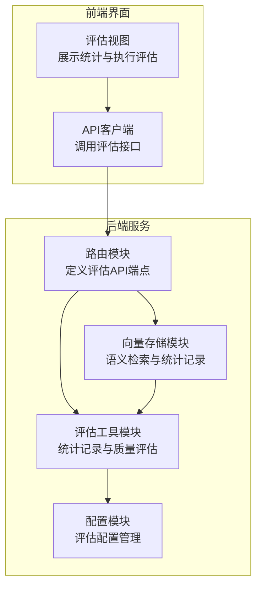
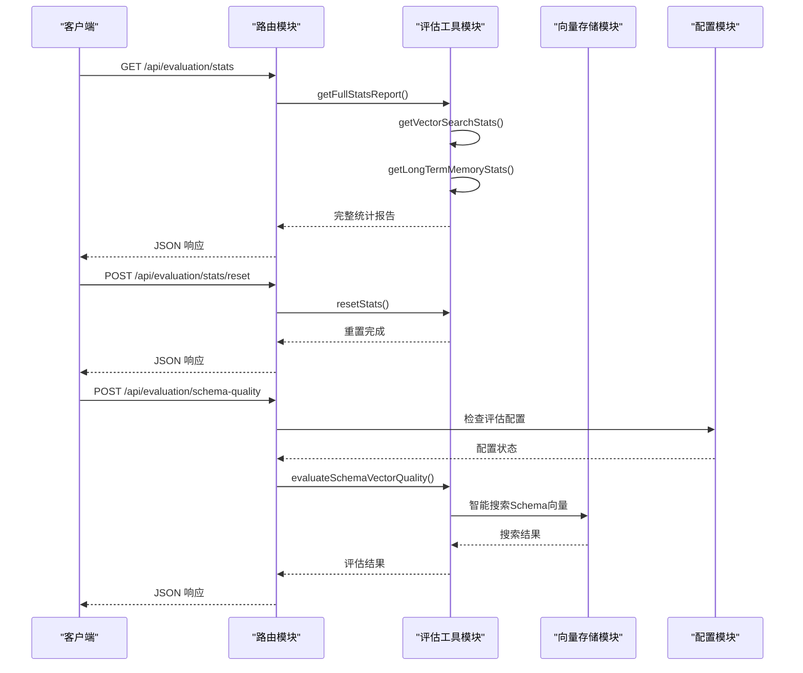
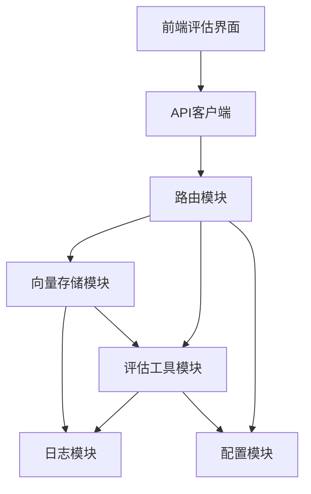

# 评估统计 API

<cite>
**本文档引用的文件**
- [evaluation.js](file://backend/src/utils/evaluation.js)
- [routes.js](file://backend/src/core/routes.js)
- [app.js](file://backend/src/app.js)
- [vectorStore.js](file://backend/src/memory/vectorStore.js)
- [config.js](file://backend/src/core/config.js)
- [EvaluationView.vue](file://frontend/src/views/EvaluationView.vue)
- [api.js](file://frontend/src/utils/api.js)
- [package.json](file://backend/package.json)
</cite>

## 目录
1. [简介](#简介)
2. [项目结构](#项目结构)
3. [核心组件](#核心组件)
4. [架构概览](#架构概览)
5. [详细组件分析](#详细组件分析)
6. [依赖关系分析](#依赖关系分析)
7. [性能考量](#性能考量)
8. [故障排查指南](#故障排查指南)
9. [结论](#结论)

## 简介
本文件详细介绍了 NL2SQL 系统中的评估统计 API，涵盖以下接口：
- 运行时统计报告接口：`/api/evaluation/stats`
- 统计数据重置接口：`/api/evaluation/stats/reset`
- Schema 向量化质量评估接口：`/api/evaluation/schema-quality`

文档内容包括评估指标计算方法、数据收集机制、统计分析过程、结果解读指南、性能基准参考、配置选项、启用条件、安全考虑以及评估数据的存储方式和隐私保护措施。

## 项目结构
评估统计功能位于后端服务中，采用模块化设计，主要涉及以下文件：
- 后端核心路由：定义 REST API 端点
- 评估工具模块：提供统计记录、质量评估和报告生成
- 向量存储模块：提供向量检索并记录统计
- 配置模块：集中管理评估相关配置
- 前端评估界面：展示统计结果和执行评估

**图表来源**
- [routes.js:722-803](file://backend/src/core/routes.js#L722-L803)
- [evaluation.js:1-488](file://backend/src/utils/evaluation.js#L1-L488)
- [vectorStore.js:1-759](file://backend/src/memory/vectorStore.js#L1-L759)
- [config.js:335-354](file://backend/src/core/config.js#L335-L354)
- [EvaluationView.vue:1-699](file://frontend/src/views/EvaluationView.vue#L1-L699)
- [api.js:258-302](file://frontend/src/utils/api.js#L258-L302)

**章节来源**
- [routes.js:722-803](file://backend/src/core/routes.js#L722-L803)
- [evaluation.js:1-488](file://backend/src/utils/evaluation.js#L1-L488)
- [vectorStore.js:1-759](file://backend/src/memory/vectorStore.js#L1-L759)
- [config.js:335-354](file://backend/src/core/config.js#L335-L354)
- [EvaluationView.vue:1-699](file://frontend/src/views/EvaluationView.vue#L1-L699)
- [api.js:258-302](file://frontend/src/utils/api.js#L258-L302)

## 核心组件
评估统计 API 的核心组件包括：
- 评估配置模块：管理评估功能开关、统计跟踪开关和阈值
- 统计记录模块：记录向量检索命中、距离分布和长期记忆命中
- 质量评估模块：执行 Schema 向量化质量评估和查询相似度评估
- 路由模块：定义 REST API 端点并处理请求
- 向量存储模块：提供语义检索并记录统计

**章节来源**
- [evaluation.js:19-31](file://backend/src/utils/evaluation.js#L19-L31)
- [evaluation.js:37-60](file://backend/src/utils/evaluation.js#L37-L60)
- [evaluation.js:158-266](file://backend/src/utils/evaluation.js#L158-L266)
- [routes.js:722-803](file://backend/src/core/routes.js#L722-L803)
- [vectorStore.js:426-429](file://backend/src/memory/vectorStore.js#L426-L429)

## 架构概览
评估统计 API 的整体架构如下：

**图表来源**
- [routes.js:722-803](file://backend/src/core/routes.js#L722-L803)
- [evaluation.js:397-429](file://backend/src/utils/evaluation.js#L397-L429)
- [vectorStore.js:450-536](file://backend/src/memory/vectorStore.js#L450-L536)
- [config.js:342-354](file://backend/src/core/config.js#L342-L354)

## 详细组件分析

### 运行时统计报告接口
- 接口路径：`/api/evaluation/stats`
- 方法：GET
- 功能：返回当前内存中的运行时统计报告，包括向量检索命中率、距离分布和长期记忆命中率
- 响应结构：
  - success: 布尔值，请求是否成功
  - data: 包含向量搜索统计、长期记忆统计、生成时间、配置状态的对象

统计指标说明：
- 向量检索统计：
  - schema.searches: Schema 检索总次数
  - schema.hits: Schema 检索命中次数
  - schema.hitRate: Schema 检索命中率（百分比）
  - query.searches: 查询历史检索总次数
  - query.hits: 查询历史检索命中次数
  - query.hitRate: 查询历史检索命中率（百分比）
  - distanceDistribution: 距离分布统计（极近、较近、中等、较远）

- 长期记忆统计：
  - overall.hitRate: 总体记忆命中率
  - overall.totalQueries: 总查询次数
  - overall.totalHits: 总命中次数
  - overall.totalMisses: 总未命中次数
  - byType: 按类型统计（字段别名、查询模式、指标偏好、维度偏好）

**章节来源**
- [routes.js:722-740](file://backend/src/core/routes.js#L722-L740)
- [evaluation.js:344-407](file://backend/src/utils/evaluation.js#L344-L407)

### 统计数据重置接口
- 接口路径：`/api/evaluation/stats/reset`
- 方法：POST
- 功能：重置内存中的统计数据，包括向量检索统计和长期记忆统计
- 响应结构：
  - success: 布尔值，请求是否成功
  - message: 操作结果消息

重置内容：
- 向量搜索统计重置为初始状态
- 长期记忆统计重置为初始状态
- 记录重置日志

**章节来源**
- [routes.js:742-760](file://backend/src/core/routes.js#L742-L760)
- [evaluation.js:412-429](file://backend/src/utils/evaluation.js#L412-L429)

### Schema 向量化质量评估接口
- 接口路径：`/api/evaluation/schema-quality`
- 方法：POST
- 功能：执行 Schema 向量化质量评估，计算准确率、精确率、召回率和 F1 分数
- 请求体：
  - testQueries: 自定义测试查询数组（可选）
  - 每个测试查询包含：
    - query: 用户查询语句
    - expectedTables: 期望检索到的表名数组

- 响应结构：
  - success: 布尔值，请求是否成功
  - data: 包含评估结果的对象

评估指标计算：
- 准确率（Accuracy）：正确检索到期望表的比例
- 平均精确率（Average Precision）：所有测试用例精确率的平均值
- 平均召回率（Average Recall）：所有测试用例召回率的平均值
- 平均 F1 分数（Average F1 Score）：所有测试用例 F1 分数的平均值
- Top1 命中：第一个检索结果是否包含期望表

评估流程：
1. 生成查询向量
2. 使用智能搜索（带查询意图识别和重排序）
3. 从表级向量元数据中提取表名
4. 计算精确率、召回率和 F1 分数
5. 统计整体指标

**章节来源**
- [routes.js:762-803](file://backend/src/core/routes.js#L762-L803)
- [evaluation.js:158-266](file://backend/src/utils/evaluation.js#L158-L266)
- [vectorStore.js:450-536](file://backend/src/memory/vectorStore.js#L450-L536)

### 查询历史向量化质量评估接口
- 接口路径：`/api/evaluation/query-quality`
- 方法：POST
- 功能：评估查询历史向量化质量，测试相似查询的召回能力
- 请求体：
  - testPairs: 自定义测试对数组（可选）
  - 每个测试对包含：
    - query1: 查询语句1
    - query2: 查询语句2
    - expectedSimilarity: 期望相似度（0-1）

- 响应结构：
  - success: 布尔值，请求是否成功
  - data: 包含评估结果的对象

评估指标计算：
- 平均误差（Average Error）：所有测试对实际相似度与期望相似度差值的平均值
- 高相似度对数量：实际相似度大于高阈值（0.8）的对数
- 中相似度对数量：实际相似度在中阈值（0.5）范围内的对数
- 低相似度对数量：实际相似度小于低阈值的对数

相似度计算：
- 使用余弦相似度计算两个查询向量之间的相似度
- 余弦相似度 = (A·B) / (||A|| × ||B||)

**章节来源**
- [routes.js:805-841](file://backend/src/core/routes.js#L805-L841)
- [evaluation.js:276-334](file://backend/src/utils/evaluation.js#L276-L334)

### 评估配置选项
评估配置通过环境变量和配置模块管理：

配置项：
- EVALUATION_ENABLED: 是否启用评估功能（默认 false）
- EVALUATION_TRACK_STATS: 是否记录运行时统计（默认 false）
- 阈值配置：
  - highSimilarity: 0.8
  - mediumSimilarity: 0.5
  - highQuality: 0.8
  - mediumQuality: 0.5

配置来源：
- 环境变量：通过 process.env 读取
- 配置模块：集中管理并提供默认值
- 路由层：在执行评估前检查配置状态

**章节来源**
- [config.js:342-354](file://backend/src/core/config.js#L342-L354)
- [evaluation.js:19-31](file://backend/src/utils/evaluation.js#L19-L31)
- [routes.js:773-778](file://backend/src/core/routes.js#L773-L778)

### 数据收集机制
数据收集采用非侵入式设计，不影响主业务流程：

统计记录位置：
- 向量检索统计：在向量存储模块的搜索函数中记录
- 长期记忆统计：在记忆模块中记录命中情况
- 静默失败：统计记录失败不会影响主流程

记录内容：
- 向量检索：记录搜索类型、结果数量、距离分布
- 长期记忆：记录命中/未命中、按类型分类
- 质量评估：记录详细结果和整体指标

**章节来源**
- [evaluation.js:71-122](file://backend/src/utils/evaluation.js#L71-L122)
- [vectorStore.js:426-429](file://backend/src/memory/vectorStore.js#L426-L429)
- [evaluation.js:344-407](file://backend/src/utils/evaluation.js#L344-L407)

### 统计分析过程
统计分析过程包括以下步骤：

1. 数据收集阶段：
   - 向量检索命中率统计
   - 长期记忆命中率统计
   - 距离分布统计

2. 指标计算阶段：
   - 命中率 = 命中次数 / 总查询次数
   - 精确率 = TP / (TP + FP)
   - 召回率 = TP / (TP + FN)
   - F1 分数 = 2 × (精确率 × 召回率) / (精确率 + 召回率)

3. 结果汇总阶段：
   - 生成完整统计报告
   - 包含生成时间、配置状态
   - 提供详细统计数据和摘要指标

**章节来源**
- [evaluation.js:344-407](file://backend/src/utils/evaluation.js#L344-L407)
- [evaluation.js:248-258](file://backend/src/utils/evaluation.js#L248-L258)

### 评估结果解读指南
评估结果解读要点：

Schema 向量化质量评估：
- 准确率：反映整体检索正确性
- 精确率：反映检索结果的相关性
- 召回率：反映检索结果的完整性
- F1 分数：综合考虑精确率和召回率

查询相似度评估：
- 平均误差：衡量向量化质量的准确性
- 相似度分布：评估相似度阈值设置的合理性

命中率统计：
- Schema 检索命中率：反映 Schema 向量质量
- 查询历史命中率：反映查询历史向量质量
- 长期记忆命中率：反映记忆系统有效性

**章节来源**
- [evaluation.js:248-258](file://backend/src/utils/evaluation.js#L248-L258)
- [evaluation.js:344-407](file://backend/src/utils/evaluation.js#L344-L407)

### 性能基准参考
性能基准参考值（基于系统配置）：

推荐阈值设置：
- 高质量：召回率 ≥ 0.8
- 中等质量：召回率 ≥ 0.5
- 高相似度：相似度 > 0.8
- 中相似度：相似度 > 0.5

系统性能要求：
- Node.js 版本：≥ 18.0.0
- LLM API：支持 OpenAI API 格式
- 向量维度：1536（text-embedding-3-small）
- 向量数据库：LanceDB

**章节来源**
- [package.json:24-26](file://backend/package.json#L24-L26)
- [config.js:80-87](file://backend/src/core/config.js#L80-L87)
- [evaluation.js:25-30](file://backend/src/utils/evaluation.js#L25-L30)

### 启用条件
评估功能的启用条件：

1. 环境变量配置：
   - EVALUATION_ENABLED=true
   - EVALUATION_TRACK_STATS=true（可选）

2. 路由层检查：
   - 在执行评估前检查配置状态
   - 未启用时返回 403 错误

3. 前端界面：
   - 显示配置状态提示
   - 评估按钮根据配置状态启用/禁用

**章节来源**
- [routes.js:773-778](file://backend/src/core/routes.js#L773-L778)
- [EvaluationView.vue:17-25](file://frontend/src/views/EvaluationView.vue#L17-L25)

### 安全考虑
安全考虑措施：

1. 配置控制：
   - 评估功能默认关闭，需显式启用
   - 仅在受控环境中启用评估功能

2. 数据隔离：
   - 统计数据存储在内存中，不持久化
   - 不记录用户敏感查询内容

3. 接口保护：
   - 评估接口需要正确的配置状态
   - 错误处理避免泄露内部信息

4. 性能保护：
   - 评估操作异步执行
   - 阈值设置防止误报

**章节来源**
- [evaluation.js:19-31](file://backend/src/utils/evaluation.js#L19-L31)
- [routes.js:773-778](file://backend/src/core/routes.js#L773-L778)

### 评估数据存储方式
评估数据存储方式：

1. 内存存储：
   - 运行时统计存储在内存中
   - 不持久化到磁盘
   - 重启后数据丢失

2. 向量数据库：
   - Schema 向量存储在 LanceDB 中
   - 查询历史向量存储在 LanceDB 中
   - 评估不修改向量数据

3. 配置存储：
   - 评估配置通过环境变量管理
   - 配置文件不存储敏感信息

**章节来源**
- [evaluation.js:37-60](file://backend/src/utils/evaluation.js#L37-L60)
- [vectorStore.js:204-220](file://backend/src/memory/vectorStore.js#L204-L220)
- [config.js:106-109](file://backend/src/core/config.js#L106-L109)

### 隐私保护措施
隐私保护措施：

1. 数据最小化：
   - 仅收集必要的统计信息
   - 不存储用户查询的具体内容

2. 数据匿名化：
   - 统计数据不包含可识别信息
   - 向量数据不包含敏感字段

3. 访问控制：
   - 评估接口需要正确的配置状态
   - 仅授权用户可访问评估功能

4. 数据生命周期：
   - 内存中的统计数据仅在运行时有效
   - 重启后自动清理

**章节来源**
- [evaluation.js:19-31](file://backend/src/utils/evaluation.js#L19-L31)
- [vectorStore.js:426-429](file://backend/src/memory/vectorStore.js#L426-L429)

## 依赖关系分析

**图表来源**
- [routes.js:28-29](file://backend/src/core/routes.js#L28-L29)
- [evaluation.js:12-13](file://backend/src/utils/evaluation.js#L12-L13)
- [vectorStore.js:19-21](file://backend/src/memory/vectorStore.js#L19-L21)

**章节来源**
- [routes.js:28-29](file://backend/src/core/routes.js#L28-L29)
- [evaluation.js:12-13](file://backend/src/utils/evaluation.js#L12-L13)
- [vectorStore.js:19-21](file://backend/src/memory/vectorStore.js#L19-L21)

## 性能考量
性能考量要点：

1. 异步处理：
   - 评估操作使用 Promise.all 并行执行
   - 避免阻塞主线程

2. 缓存策略：
   - 向量数据库使用 LanceDB 提供高性能检索
   - 配置缓存减少重复计算

3. 资源管理：
   - 评估操作完成后及时释放资源
   - 控制并发数量避免资源耗尽

4. 监控指标：
   - 记录评估执行时间
   - 监控内存使用情况

## 故障排查指南
故障排查指南：

常见问题及解决方案：

1. 评估功能未启用：
   - 检查环境变量 EVALUATION_ENABLED
   - 确认配置状态
   - 查看路由层错误信息

2. 统计数据为空：
   - 确认 EVALUATION_TRACK_STATS 已启用
   - 检查向量数据库初始化状态
   - 验证向量检索是否正常

3. 评估结果异常：
   - 检查 LLM API 配置
   - 验证嵌入模型设置
   - 确认阈值配置合理

4. 性能问题：
   - 监控内存使用情况
   - 检查向量维度设置
   - 优化查询向量生成

**章节来源**
- [routes.js:773-778](file://backend/src/core/routes.js#L773-L778)
- [evaluation.js:19-31](file://backend/src/utils/evaluation.js#L19-L31)
- [vectorStore.js:231-261](file://backend/src/memory/vectorStore.js#L231-L261)

## 结论
NL2SQL 系统的评估统计 API 提供了全面的向量化质量评估和运行时统计功能。通过非侵入式的设计，评估功能不影响主业务流程，同时提供了详细的指标和可视化界面。合理的配置管理和安全措施确保了评估功能的安全性和可靠性。建议在受控环境中启用评估功能，并定期监控评估结果以持续改进系统性能。