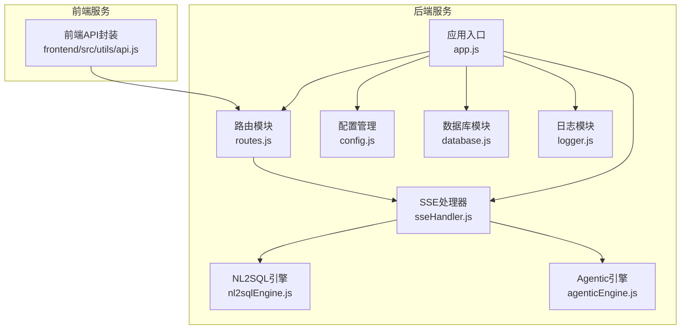
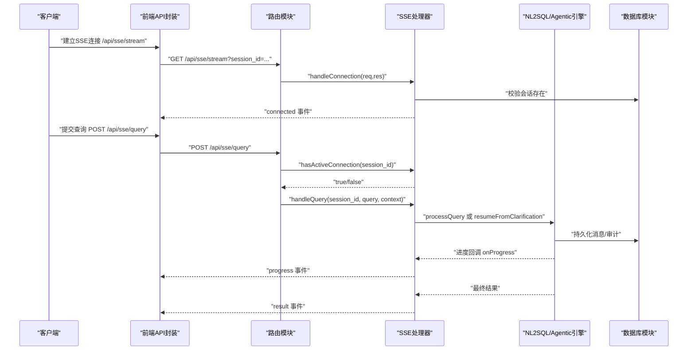
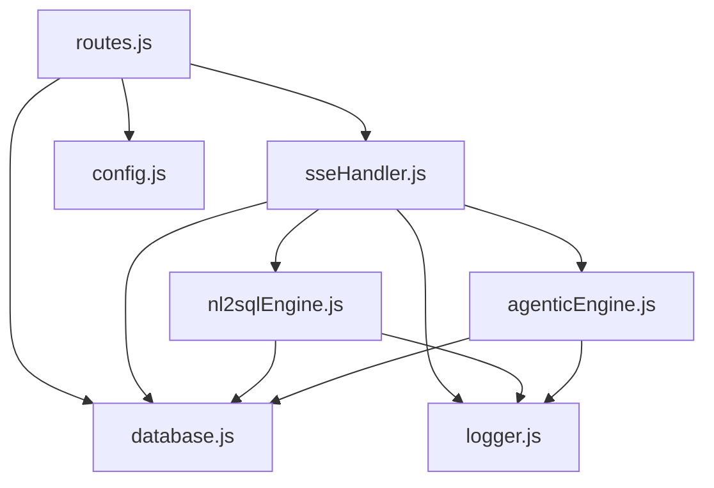

# API 接口文档

<cite>
**本文档引用的文件**
- [backend/src/app.js](file://backend/src/app.js)
- [backend/src/core/routes.js](file://backend/src/core/routes.js)
- [backend/src/core/sseHandler.js](file://backend/src/core/sseHandler.js)
- [backend/src/core/config.js](file://backend/src/core/config.js)
- [backend/src/core/nl2sqlEngine.js](file://backend/src/core/nl2sqlEngine.js)
- [backend/src/core/agenticEngine.js](file://backend/src/core/agenticEngine.js)
- [backend/src/core/database.js](file://backend/src/core/database.js)
- [backend/src/utils/logger.js](file://backend/src/utils/logger.js)
- [backend/package.json](file://backend/package.json)
- [frontend/src/utils/api.js](file://frontend/src/utils/api.js)
- [backend/config/feature-flags.js](file://backend/config/feature-flags.js)
- [backend/test/phase3/sse-clarify-answer-route.test.js](file://backend/test/phase3/sse-clarify-answer-route.test.js)
- [backend/test/phase1/test-sse-error-feedback.js](file://backend/test/phase1/test-sse-error-feedback.js)
</cite>

## 目录
1. [简介](#简介)
2. [项目结构](#项目结构)
3. [核心组件](#核心组件)
4. [架构概览](#架构概览)
5. [详细组件分析](#详细组件分析)
6. [依赖关系分析](#依赖关系分析)
7. [性能考虑](#性能考虑)
8. [故障排除指南](#故障排除指南)
9. [结论](#结论)
10. [附录](#附录)

## 简介
本文件为 NL2SQL 系统的完整 API 接口文档，涵盖 RESTful API 端点、SSE 流式接口、认证与授权机制、错误处理、性能优化与最佳实践。系统采用 Node.js + Express 构建后端服务，Vue3 + Element Plus 构建前端界面，支持自然语言到 SQL 的智能转换，并提供实时流式交互能力。

## 项目结构
后端服务通过 Express 应用启动，统一挂载在 `/api` 路径下，包含以下主要模块：
- 路由模块：定义所有 REST API 和 SSE 端点
- SSE 处理器：管理长连接、流式消息推送与错误兜底
- 引擎模块：NL2SQL 核心引擎与 Agentic 引擎
- 配置模块：集中管理环境变量与运行配置
- 数据库模块：SQLite 会话存储与查询历史
- 工具模块：日志、评估、安全策略等

**图表来源**
- [backend/src/app.js:1-279](file://backend/src/app.js#L1-L279)
- [backend/src/core/routes.js:1-1099](file://backend/src/core/routes.js#L1-L1099)
- [backend/src/core/sseHandler.js:1-688](file://backend/src/core/sseHandler.js#L1-L688)

**章节来源**
- [backend/src/app.js:58-96](file://backend/src/app.js#L58-L96)
- [backend/src/core/routes.js:37-56](file://backend/src/core/routes.js#L37-L56)

## 核心组件
- 应用入口与初始化：负责加载环境变量、初始化数据库与向量库、启动 HTTP 服务器与 SSE 服务、注册优雅关闭钩子。
- 路由模块：定义 REST API 与 SSE 端点，包含健康检查、Schema 查询、会话管理、查询历史、评估接口、统计信息、配置信息等。
- SSE 处理器：管理 SSE 连接生命周期、消息广播、进度回调、澄清回答处理、错误兜底推送。
- 引擎模块：NL2SQL 核心引擎与 Agentic 引擎，负责查询意图识别、SQL 生成、验证与执行、结果格式化与审计。
- 配置模块：集中管理 LLM、数据库、安全、会话、日志、自修复、Schema、长期记忆、上下文管理、评估等配置。
- 数据库模块：SQLite 会话存储、查询历史、消息持久化、用户偏好与长期记忆。
- 工具模块：日志记录、评估统计、安全策略（脱敏、RLS）、SQL 限制与重写。

**章节来源**
- [backend/src/app.js:99-204](file://backend/src/app.js#L99-L204)
- [backend/src/core/routes.js:11-38](file://backend/src/core/routes.js#L11-L38)
- [backend/src/core/sseHandler.js:32-120](file://backend/src/core/sseHandler.js#L32-L120)
- [backend/src/core/config.js:20-439](file://backend/src/core/config.js#L20-L439)

## 架构概览
系统采用前后端分离架构，前端通过 HTTP REST API 与 SSE 与后端交互。SSE 用于实时流式推送查询处理进度与结果，POST /api/sse/query 与 /api/sse/clarify-answer 为关键的流式接口。

**图表来源**
- [backend/src/core/routes.js:959-1017](file://backend/src/core/routes.js#L959-L1017)
- [backend/src/core/sseHandler.js:49-120](file://backend/src/core/sseHandler.js#L49-L120)
- [backend/src/core/sseHandler.js:258-410](file://backend/src/core/sseHandler.js#L258-L410)

**章节来源**
- [backend/src/core/routes.js:946-1064](file://backend/src/core/routes.js#L946-L1064)
- [backend/src/core/sseHandler.js:258-410](file://backend/src/core/sseHandler.js#L258-L410)

## 详细组件分析

### RESTful API 端点

#### 健康检查接口
- GET /api/health
  - 功能：返回服务基本健康状态、版本、运行时间与内存使用情况
  - 响应：包含 status、timestamp、version、uptime、memory
  - 状态码：200 成功
- GET /api/health/detail
  - 功能：返回详细健康状态，包含数据库、LLM、Schema、SSE 连接状态
  - 响应：包含 components（database、llm、schema、sse）与整体 status
  - 状态码：200 成功，503 组件异常

**章节来源**
- [backend/src/core/routes.js:74-139](file://backend/src/core/routes.js#L74-L139)

#### Schema 接口
- GET /api/schema
  - 功能：获取完整 Schema 信息，支持按 type 过滤（tables、metrics、dimensions）
  - 查询参数：type（可选）
  - 响应：根据 type 返回对应部分或完整 Schema
  - 状态码：200 成功，400 参数错误
- GET /api/schema/tables/:tableName
  - 功能：获取指定表的详细信息及关联表
  - 路径参数：tableName
  - 响应：包含 table 与 relatedTables
  - 状态码：200 成功，404 表不存在
- GET /api/schema/search
  - 功能：搜索相关表
  - 查询参数：q（关键词，必填）、limit（默认5）
  - 响应：包含 query、count、tables
  - 状态码：200 成功，400 缺少关键词，500 搜索失败

**章节来源**
- [backend/src/core/routes.js:152-252](file://backend/src/core/routes.js#L152-L252)

#### 会话管理接口
- POST /api/sessions
  - 功能：创建新会话
  - 请求体：{ user_id, title }
  - 响应：创建的会话信息（201 Created）
  - 状态码：201 成功，500 创建失败
- GET /api/sessions/:sessionId
  - 功能：获取会话信息
  - 路径参数：sessionId
  - 响应：会话详情
  - 状态码：200 成功，404 会话不存在
- DELETE /api/sessions/:sessionId
  - 功能：删除会话
  - 路径参数：sessionId
  - 响应：删除成功信息
  - 状态码：200 成功，404 会话不存在，500 删除失败
- GET /api/sessions/:sessionId/messages
  - 功能：获取会话消息历史
  - 路径参数：sessionId
  - 查询参数：limit（默认50）
  - 响应：包含 session_id、count、messages
  - 状态码：200 成功，500 获取失败
- GET /api/users/:userId/sessions
  - 功能：获取用户的所有会话
  - 路径参数：userId
  - 查询参数：limit（默认20）
  - 响应：包含 user_id、count、sessions
  - 状态码：200 成功，500 获取失败

**章节来源**
- [backend/src/core/routes.js:268-400](file://backend/src/core/routes.js#L268-L400)

#### 查询历史接口
- GET /api/queries/history
  - 功能：获取查询历史
  - 查询参数：user_id（可选）、session_id（可选）、limit（默认20）
  - 响应：包含 count、history
  - 状态码：200 成功，500 获取失败

**章节来源**
- [backend/src/core/routes.js:415-452](file://backend/src/core/routes.js#L415-L452)

#### 用户偏好（长期记忆）接口
- GET /api/preferences/:userId/raw
  - 功能：获取用户长期记忆原始数据（调试用途）
  - 路径参数：userId
  - 查询参数：type（可选）
  - 响应：包含 success、user_id、total_count、data（all、grouped）
  - 状态码：200 成功，500 获取失败
- GET /api/preferences/:userId/stats
  - 功能：获取用户记忆统计
  - 路径参数：userId
  - 响应：包含 success、user_id、data
  - 状态码：200 成功，500 获取失败
- GET /api/preferences/:userId
  - 功能：获取用户偏好列表
  - 路径参数：userId
  - 查询参数：type（可选）、limit（默认50）
  - 响应：包含 success、user_id、data
  - 状态码：200 成功，500 获取失败
- POST /api/preferences/:userId/templates
  - 功能：手动添加查询模板
  - 路径参数：userId
  - 请求体：{ name, dimensions, metrics, default_time_range }
  - 响应：包含 success、message、data
  - 状态码：200 成功，400 缺少模板名称，500 保存失败
- DELETE /api/preferences/:preferenceId
  - 功能：删除用户偏好
  - 路径参数：preferenceId
  - 响应：包含 success、message 或错误信息
  - 状态码：200 成功，404 偏好不存在或删除失败，500 删除失败
- POST /api/preferences/:userId/learn-alias
  - 功能：手动学习字段别名
  - 路径参数：userId
  - 请求体：{ user_term, schema_field, field_type（默认metric） }
  - 响应：包含 success、message、data
  - 状态码：200 成功，400 缺少必要参数，500 学习失败

**章节来源**
- [backend/src/core/routes.js:463-718](file://backend/src/core/routes.js#L463-L718)

#### 评估接口
- GET /api/evaluation/stats
  - 功能：获取运行时统计报告（向量检索命中率、记忆命中率）
  - 响应：包含 success、data
  - 状态码：200 成功，500 获取失败
- POST /api/evaluation/stats/reset
  - 功能：重置统计数据
  - 响应：包含 success、message
  - 状态码：200 成功，500 重置失败
- POST /api/evaluation/schema-quality
  - 功能：执行 Schema 向量化质量评估
  - 请求体：{ testQueries（可选） }
  - 响应：包含 success、data
  - 状态码：200 成功，403 评估功能未启用，500 评估失败
- POST /api/evaluation/query-quality
  - 功能：执行查询历史向量化质量评估
  - 请求体：{ testPairs（可选） }
  - 响应：包含 success、data
  - 状态码：200 成功，403 评估功能未启用，500 评估失败
- GET /api/evaluation/config
  - 功能：获取评估配置
  - 响应：包含 success、data（enabled、trackStats、thresholds）
  - 状态码：200 成功

**章节来源**
- [backend/src/core/routes.js:728-858](file://backend/src/core/routes.js#L728-L858)

#### 统计信息接口
- GET /api/stats
  - 功能：获取服务统计信息（今日查询统计、连接数、Schema 统计、系统信息）
  - 响应：包含 timestamp、connections、queries、schema、system
  - 状态码：200 成功，500 获取失败

**章节来源**
- [backend/src/core/routes.js:868-915](file://backend/src/core/routes.js#L868-L915)

#### 配置接口
- GET /api/config
  - 功能：获取公开配置信息（不包含敏感信息如 API 密钥）
  - 响应：包含 version、llm（model、api_base）、security（max_query_rows、query_timeout）、features（streaming、clarification、vector_search）
  - 状态码：200 成功

**章节来源**
- [backend/src/core/routes.js:926-944](file://backend/src/core/routes.js#L926-L944)

### SSE 流式接口

#### 建立连接
- GET /api/sse/stream
  - 功能：建立 Server-Sent Events 长连接
  - 查询参数：session_id（必填）、user_id（可选，默认 anonymous）
  - 响应：SSE 流，首次推送 connected 事件
  - 状态码：200 成功，400 缺少 session_id，404 会话不存在

**章节来源**
- [backend/src/core/routes.js:959-961](file://backend/src/core/routes.js#L959-L961)
- [backend/src/core/sseHandler.js:49-120](file://backend/src/core/sseHandler.js#L49-L120)

#### 提交查询
- POST /api/sse/query
  - 功能：通过 HTTP POST 提交查询，结果通过 SSE 推送
  - 请求体：{ session_id（必填）、query（必填） }
  - 响应：立即返回 { success: true, message: '查询已提交，请通过SSE接收结果' }
  - 状态码：200 成功，400 缺少参数，409 SSE 连接未建立，500 提交失败
  - 流式事件：processing（开始处理）、progress（进度回调）、result（最终结果）、error（错误）

**章节来源**
- [backend/src/core/routes.js:974-1017](file://backend/src/core/routes.js#L974-L1017)
- [backend/src/core/sseHandler.js:258-410](file://backend/src/core/sseHandler.js#L258-L410)

#### 澄清回答接续
- POST /api/sse/clarify-answer
  - 功能：批次 B：澄清回答接续，前端点选澄清选项或自由输入后，经此端点回传 parent_message_id + option
  - 请求体：{ session_id（必填）、parent_message_id（必填）、option（必填） }
  - 响应：立即返回 { success: true, message: '澄清回答已提交，请通过 SSE 接收结果' }
  - 状态码：200 成功，400 缺少必填参数，409 SSE 连接未建立，500 提交失败
  - 流式事件：processing（应用澄清回答）、result（最终结果）、error（错误）

**章节来源**
- [backend/src/core/routes.js:1032-1064](file://backend/src/core/routes.js#L1032-L1064)
- [backend/src/core/sseHandler.js:511-615](file://backend/src/core/sseHandler.js#L511-L615)

#### SSE 消息格式与事件类型
- connected：连接建立成功，包含 session_id 与 message
- processing：开始处理查询或澄清回答
- progress：进度回调，包含 step 与数据
- result：最终结果，包含引擎类型标记（engineUsed、fallbackUsed）与结果数据
- error：错误事件，包含 message 与可选 timestamp

**章节来源**
- [backend/src/core/sseHandler.js:103-198](file://backend/src/core/sseHandler.js#L103-L198)
- [backend/src/core/sseHandler.js:336-395](file://backend/src/core/sseHandler.js#L336-L395)

### 认证与授权机制
- 会话与用户标识：SSE 连接与 API 请求均支持通过查询参数或请求头传递 user_id、user_role、tenant_id、request_source 等上下文信息，用于审计与权限控制。
- 请求上下文提取：后端通过 requestContext.extractContext 统一提取并合并上下文，支持多来源优先级与默认值。
- 安全配置：配置模块提供安全策略，包括禁止的关键字列表、最大查询行数、查询超时、结果脱敏规则、行级权限（RLS）等。
- 功能开关：通过环境变量控制功能开关，支持快速回滚与渐进式发布。

**章节来源**
- [backend/src/core/routes.js:1001-1002](file://backend/src/core/routes.js#L1001-L1002)
- [backend/src/core/config.js:153-211](file://backend/src/core/config.js#L153-L211)
- [backend/config/feature-flags.js:16-141](file://backend/config/feature-flags.js#L16-L141)

### 错误处理与兜底
- SSE 连接校验：POST /api/sse/query 与 /api/sse/clarify-answer 前置校验 hasActiveConnection，避免“提交成功但连接不在”的假成功场景。
- 异步错误兜底：后台处理异常时通过 pushError 统一推送 error 事件，避免“200 OK + 前端无反馈”。
- 全局错误处理：路由中间件捕获未处理错误，返回标准化错误响应。
- 测试覆盖：提供 SSE 错误反馈链路的回归测试，确保无连接时的行为符合预期。

**章节来源**
- [backend/src/core/routes.js:986-991](file://backend/src/core/routes.js#L986-L991)
- [backend/src/core/routes.js:1042-1047](file://backend/src/core/routes.js#L1042-L1047)
- [backend/src/core/sseHandler.js:232-242](file://backend/src/core/sseHandler.js#L232-L242)
- [backend/src/core/routes.js:1086-1092](file://backend/src/core/routes.js#L1086-L1092)
- [backend/test/phase1/test-sse-error-feedback.js:18-44](file://backend/test/phase1/test-sse-error-feedback.js#L18-L44)

### 使用示例
- 健康检查：GET /api/health
- Schema 查询：GET /api/schema?type=tables
- 创建会话：POST /api/sessions（请求体：{ user_id: "user123", title: "会话标题" }）
- 建立 SSE 连接：GET /api/sse/stream?session_id=xxx&user_id=user123
- 提交查询：POST /api/sse/query（请求体：{ session_id: "xxx", query: "查询内容" }）
- 澄清回答：POST /api/sse/clarify-answer（请求体：{ session_id: "xxx", parent_message_id: 123, option: "选项文本" }）

**章节来源**
- [frontend/src/utils/api.js:98-108](file://frontend/src/utils/api.js#L98-L108)
- [frontend/src/utils/api.js:160-165](file://frontend/src/utils/api.js#L160-L165)
- [frontend/src/utils/api.js:246-251](file://frontend/src/utils/api.js#L246-L251)
- [frontend/src/utils/api.js:262-268](file://frontend/src/utils/api.js#L262-L268)

### 性能考虑与最佳实践
- SSE 连接复用：同一会话支持多标签页连接，处理器会广播到所有连接，避免重复处理。
- 进度回调：引擎通过 onProgress 回调推送 progress 事件，前端可显示实时进度。
- 引擎选择：根据功能开关 AGENTIC_ENGINE 选择 Agentic 引擎或传统 NL2SQL 引擎，失败时可自动回退。
- 资源限制：配置最大查询行数、查询超时、禁止关键字，防止资源滥用。
- 日志与审计：统一的日志记录与审计字段（user_role、tenant_id、request_source、requestIp、rlsApplied），便于问题定位与合规审计。

**章节来源**
- [backend/src/core/sseHandler.js:206-213](file://backend/src/core/sseHandler.js#L206-L213)
- [backend/src/core/sseHandler.js:324-326](file://backend/src/core/sseHandler.js#L324-L326)
- [backend/src/core/config.js:153-211](file://backend/src/core/config.js#L153-L211)
- [backend/src/core/nl2sqlEngine.js:147-155](file://backend/src/core/nl2sqlEngine.js#L147-L155)

### API 版本管理与兼容性
- 版本号：服务版本在健康检查与配置接口中返回，当前为 1.0.0。
- 向后兼容：路由模块通过中间件与错误处理保障现有接口稳定；SSE 事件类型保持稳定，新增字段向后兼容。
- 功能开关：通过环境变量控制功能开关，支持渐进式发布与快速回滚，保证向后兼容性。

**章节来源**
- [backend/src/core/routes.js:82-83](file://backend/src/core/routes.js#L82-L83)
- [backend/src/core/routes.js:930-933](file://backend/src/core/routes.js#L930-L933)
- [backend/config/feature-flags.js:16-141](file://backend/config/feature-flags.js#L16-L141)

### 接口测试指南与调试工具
- 单元测试：提供 SSE 错误反馈链路的回归测试，覆盖无连接时的行为。
- 集成测试：提供澄清回答接续的全链路测试，覆盖多种场景（父消息完整、降级、metadata 缺失、空回答）。
- 调试工具：前端 API 封装提供统一的请求/响应拦截与错误处理；后端日志模块记录详细执行步骤与错误信息。

**章节来源**
- [backend/test/phase1/test-sse-error-feedback.js:18-44](file://backend/test/phase1/test-sse-error-feedback.js#L18-L44)
- [backend/test/phase3/sse-clarify-answer-route.test.js:74-261](file://backend/test/phase3/sse-clarify-answer-route.test.js#L74-L261)
- [frontend/src/utils/api.js:44-88](file://frontend/src/utils/api.js#L44-L88)
- [backend/src/utils/logger.js](file://backend/src/utils/logger.js)

## 依赖关系分析

**图表来源**
- [backend/src/core/routes.js:16-31](file://backend/src/core/routes.js#L16-L31)
- [backend/src/core/sseHandler.js:15-26](file://backend/src/core/sseHandler.js#L15-L26)
- [backend/src/core/nl2sqlEngine.js:20-37](file://backend/src/core/nl2sqlEngine.js#L20-L37)
- [backend/src/core/agenticEngine.js:20-31](file://backend/src/core/agenticEngine.js#L20-L31)

**章节来源**
- [backend/src/core/routes.js:16-31](file://backend/src/core/routes.js#L16-L31)
- [backend/src/core/sseHandler.js:15-26](file://backend/src/core/sseHandler.js#L15-L26)

## 性能考虑
- SSE 连接池：同一会话允许多连接，处理器会广播到所有连接，减少重复计算。
- 引擎异步处理：查询处理在后台异步执行，避免阻塞 HTTP 请求。
- 资源限制：通过配置限制最大查询行数、查询超时与禁止关键字，防止资源滥用。
- 日志级别：根据环境变量调整日志级别，平衡可观测性与性能。

[本节为通用指导，无需特定文件引用]

## 故障排除指南
- SSE 连接未建立：确认已先建立 /api/sse/stream 长连接，再提交查询或澄清回答。
- 无连接时行为：handleQuery 与 pushError 在无连接时返回 null 与静默处理，避免异常传播。
- 全局错误：检查路由中间件的全局错误处理，查看标准化错误响应。
- 日志定位：利用日志模块记录的详细执行步骤与错误堆栈，定位问题根因。

**章节来源**
- [backend/src/core/routes.js:986-991](file://backend/src/core/routes.js#L986-L991)
- [backend/src/core/routes.js:1042-1047](file://backend/src/core/routes.js#L1042-L1047)
- [backend/src/core/sseHandler.js:262-264](file://backend/src/core/sseHandler.js#L262-L264)
- [backend/src/core/sseHandler.js:232-242](file://backend/src/core/sseHandler.js#L232-L242)
- [backend/src/core/routes.js:1086-1092](file://backend/src/core/routes.js#L1086-L1092)

## 结论
NL2SQL 系统提供了完整的 RESTful API 与 SSE 流式接口，支持自然语言到 SQL 的智能转换与实时交互。通过统一的配置管理、功能开关与安全策略，系统具备良好的可扩展性、可维护性与安全性。建议在生产环境中合理配置安全参数与资源限制，并结合功能开关进行渐进式发布与回滚。

[本节为总结性内容，无需特定文件引用]

## 附录
- 环境变量与配置：参考配置模块中的各项配置项，确保 LLM API 密钥、数据库连接、安全策略等正确设置。
- 前端集成：前端通过 axios 封装统一调用后端 API，支持请求/响应拦截与错误处理。
- 版本与依赖：后端使用 Node.js 18+，依赖 Express、SQLite3、MySQL2、UUID、vectordb 等。

**章节来源**
- [backend/src/core/config.js:407-439](file://backend/src/core/config.js#L407-L439)
- [frontend/src/utils/api.js:25-34](file://frontend/src/utils/api.js#L25-L34)
- [backend/package.json:32-34](file://backend/package.json#L32-L34)