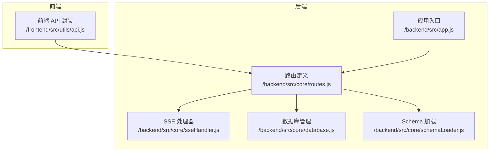
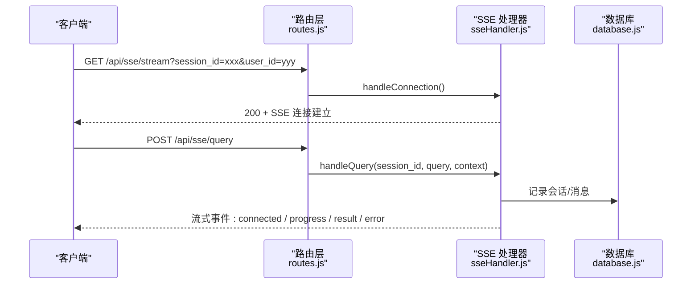
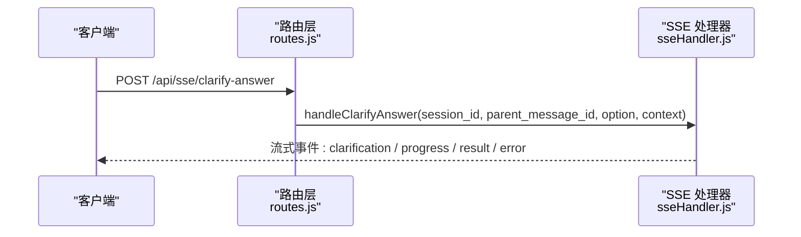
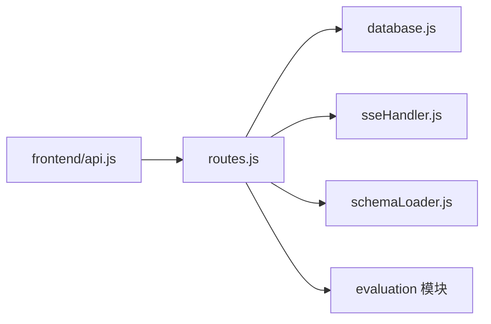

# RESTful API 参考

<cite>
**本文引用的文件**
- [后端入口 app.js](file://backend/src/app.js)
- [路由定义 routes.js](file://backend/src/core/routes.js)
- [SSE 处理器 sseHandler.js](file://backend/src/core/sseHandler.js)
- [数据库管理 database.js](file://backend/src/core/database.js)
- [Schema 加载 schemaLoader.js](file://backend/src/core/schemaLoader.js)
- [前端 API 封装 api.js](file://frontend/src/utils/api.js)
- [Schema 元数据 schema-metadata.json](file://backend/config/schema-metadata.json)
- [功能开关 feature-flags.js](file://backend/config/feature-flags.js)
- [包配置 package.json](file://backend/package.json)
</cite>

## 目录
1. [简介](#简介)
2. [项目结构](#项目结构)
3. [核心组件](#核心组件)
4. [架构概览](#架构概览)
5. [详细组件分析](#详细组件分析)
6. [依赖分析](#依赖分析)
7. [性能考虑](#性能考虑)
8. [故障排除指南](#故障排除指南)
9. [结论](#结论)
10. [附录](#附录)

## 简介
本文件为 NL2SQL 系统的完整 RESTful API 参考文档，涵盖健康检查、Schema 查询、会话管理、查询历史、用户偏好（长期记忆）、评估接口以及基于 SSE 的流式查询处理。文档详细描述了每个端点的 HTTP 方法、URL 模式、请求参数、响应格式、状态码，并提供错误处理说明、最佳实践与常见问题解决方案。

## 项目结构
后端采用 Express 框架，通过统一的路由模块集中管理所有 API；前端通过 axios 封装统一的 API 调用；SSE 用于实时流式结果推送；SQLite 用于会话与查询历史的本地持久化；Schema 元数据通过 JSON 配置文件加载。

**图表来源**
- [后端入口 app.js:58-90](file://backend/src/app.js#L58-L90)
- [路由定义 routes.js:1-38](file://backend/src/core/routes.js#L1-L38)
- [SSE 处理器 sseHandler.js:49-120](file://backend/src/core/sseHandler.js#L49-L120)
- [数据库管理 database.js:39-150](file://backend/src/core/database.js#L39-L150)
- [Schema 加载 schemaLoader.js:75-131](file://backend/src/core/schemaLoader.js#L75-L131)

**章节来源**
- [后端入口 app.js:58-90](file://backend/src/app.js#L58-L90)
- [路由定义 routes.js:1-38](file://backend/src/core/routes.js#L1-L38)

## 核心组件
- 健康检查：提供服务状态与组件健康度检查。
- Schema 查询：支持获取完整 Schema、表详情、Schema 搜索。
- 会话管理：创建、查询、删除会话，获取消息历史与用户会话列表。
- 查询历史：按用户或会话筛选查询历史。
- 用户偏好（长期记忆）：获取/学习/删除用户偏好与查询模板。
- 评估接口：运行时统计、重置统计、Schema/查询向量化质量评估。
- SSE 接口：建立长连接、提交查询、澄清回答接续。
- 配置接口：获取公开配置信息。

**章节来源**
- [路由定义 routes.js:62-139](file://backend/src/core/routes.js#L62-L139)
- [路由定义 routes.js:152-252](file://backend/src/core/routes.js#L152-L252)
- [路由定义 routes.js:268-400](file://backend/src/core/routes.js#L268-L400)
- [路由定义 routes.js:415-452](file://backend/src/core/routes.js#L415-L452)
- [路由定义 routes.js:555-718](file://backend/src/core/routes.js#L555-L718)
- [路由定义 routes.js:728-843](file://backend/src/core/routes.js#L728-L843)
- [路由定义 routes.js:868-944](file://backend/src/core/routes.js#L868-L944)
- [路由定义 routes.js:959-1064](file://backend/src/core/routes.js#L959-L1064)

## 架构概览
后端通过 Express 挂载统一的 /api 前缀路由，SSE 通过独立端点提供长连接能力，数据库与向量存储分别支撑会话历史与 Schema 向量化。

**图表来源**
- [路由定义 routes.js:959-1017](file://backend/src/core/routes.js#L959-L1017)
- [SSE 处理器 sseHandler.js:49-120](file://backend/src/core/sseHandler.js#L49-L120)
- [数据库管理 database.js:44-150](file://backend/src/core/database.js#L44-L150)

## 详细组件分析

### 健康检查接口
- GET /api/health
  - 响应字段：状态、时间戳、版本、运行时长、内存使用。
  - 状态码：200。
- GET /api/health/detail
  - 响应字段：组件状态（数据库、LLM、Schema、SSE 连接数）。
  - 状态码：200 或 503（任一组件异常）。

**章节来源**
- [路由定义 routes.js:74-96](file://backend/src/core/routes.js#L74-L96)
- [路由定义 routes.js:102-139](file://backend/src/core/routes.js#L102-L139)

### Schema 查询接口
- GET /api/schema
  - 查询参数：type（tables|metrics|dimensions|默认全部）。
  - 响应：版本号与对应集合。
  - 状态码：200。
- GET /api/schema/tables/:tableName
  - 响应：表定义与关联表。
  - 状态码：200 或 404（表不存在）。
- GET /api/schema/search
  - 查询参数：q（关键词）、limit（默认5）。
  - 响应：查询词、数量与结果表列表。
  - 状态码：200 或 400/500。

**章节来源**
- [路由定义 routes.js:152-188](file://backend/src/core/routes.js#L152-L188)
- [路由定义 routes.js:194-217](file://backend/src/core/routes.js#L194-L217)
- [路由定义 routes.js:227-252](file://backend/src/core/routes.js#L227-L252)
- [Schema 加载 schemaLoader.js:75-131](file://backend/src/core/schemaLoader.js#L75-L131)

### 会话管理接口
- POST /api/sessions
  - 请求体：user_id、title。
  - 响应：新建会话信息（201）。
  - 状态码：201 或 500。
- GET /api/sessions/:sessionId
  - 响应：会话详情。
  - 状态码：200 或 404。
- DELETE /api/sessions/:sessionId
  - 响应：删除成功消息。
  - 状态码：200 或 404/500。
- GET /api/sessions/:sessionId/messages
  - 查询参数：limit（默认50）。
  - 响应：消息列表。
  - 状态码：200 或 500。
- GET /api/users/:userId/sessions
  - 查询参数：limit（默认20）。
  - 响应：会话列表。
  - 状态码：200 或 500。

**章节来源**
- [路由定义 routes.js:268-292](file://backend/src/core/routes.js#L268-L292)
- [路由定义 routes.js:298-316](file://backend/src/core/routes.js#L298-L316)
- [路由定义 routes.js:322-347](file://backend/src/core/routes.js#L322-L347)
- [路由定义 routes.js:356-375](file://backend/src/core/routes.js#L356-L375)
- [路由定义 routes.js:381-400](file://backend/src/core/routes.js#L381-L400)
- [数据库管理 database.js:44-150](file://backend/src/core/database.js#L44-L150)

### 查询历史接口
- GET /api/queries/history
  - 查询参数：user_id、session_id、limit（默认20）。
  - 响应：历史记录列表。
  - 状态码：200 或 500。

**章节来源**
- [路由定义 routes.js:415-452](file://backend/src/core/routes.js#L415-L452)
- [数据库管理 database.js:98-150](file://backend/src/core/database.js#L98-L150)

### 用户偏好（长期记忆）接口
- GET /api/preferences/:userId/raw
  - 查询参数：type。
  - 响应：原始偏好记录（按类型分组）。
  - 状态码：200 或 500。
- GET /api/preferences/:userId/stats
  - 响应：用户记忆统计。
  - 状态码：200 或 500。
- GET /api/preferences/:userId
  - 查询参数：type（query_pattern|field_alias|metric_preference|dimension_preference）、limit（默认50）。
  - 响应：偏好数据。
  - 状态码：200 或 500。
- POST /api/preferences/:userId/templates
  - 请求体：模板名称、维度、指标、默认时间范围。
  - 响应：保存结果。
  - 状态码：200 或 400/500。
- DELETE /api/preferences/:preferenceId
  - 响应：删除结果。
  - 状态码：200 或 404/500。
- POST /api/preferences/:userId/learn-alias
  - 请求体：user_term、schema_field、field_type（默认 metric）。
  - 响应：学习结果。
  - 状态码：200 或 400/500。

**章节来源**
- [路由定义 routes.js:463-519](file://backend/src/core/routes.js#L463-L519)
- [路由定义 routes.js:526-545](file://backend/src/core/routes.js#L526-L545)
- [路由定义 routes.js:555-594](file://backend/src/core/routes.js#L555-L594)
- [路由定义 routes.js:608-635](file://backend/src/core/routes.js#L608-L635)
- [路由定义 routes.js:641-666](file://backend/src/core/routes.js#L641-L666)
- [路由定义 routes.js:679-718](file://backend/src/core/routes.js#L679-L718)

### 评估接口
- GET /api/evaluation/stats
  - 响应：运行时统计报告。
  - 状态码：200 或 500。
- POST /api/evaluation/stats/reset
  - 响应：重置结果。
  - 状态码：200 或 500。
- GET /api/evaluation/config
  - 响应：评估配置。
  - 状态码：200。
- POST /api/evaluation/schema-quality
  - 请求体：testQueries（可选）。
  - 响应：Schema 向量化质量评估结果。
  - 状态码：200 或 403/500。
- POST /api/evaluation/query-quality
  - 请求体：testPairs（可选）。
  - 响应：查询历史向量化质量评估结果。
  - 状态码：200 或 403/500。

**章节来源**
- [路由定义 routes.js:728-762](file://backend/src/core/routes.js#L728-L762)
- [路由定义 routes.js:849-858](file://backend/src/core/routes.js#L849-L858)
- [路由定义 routes.js:773-805](file://backend/src/core/routes.js#L773-L805)
- [路由定义 routes.js:816-843](file://backend/src/core/routes.js#L816-L843)

### 统计信息与配置接口
- GET /api/stats
  - 响应：连接数、今日查询统计、Schema 统计、系统信息。
  - 状态码：200 或 500。
- GET /api/config
  - 响应：公开配置（模型、安全阈值、特性开关）。
  - 状态码：200。

**章节来源**
- [路由定义 routes.js:868-915](file://backend/src/core/routes.js#L868-L915)
- [路由定义 routes.js:926-944](file://backend/src/core/routes.js#L926-L944)

### SSE 接口
- GET /api/sse/stream
  - 查询参数：session_id（必填）、user_id（可选）。
  - 响应：SSE 连接建立。
  - 状态码：200、400、404。
- POST /api/sse/query
  - 请求体：session_id、query。
  - 响应：提交成功提示（立即返回，实际结果通过 SSE 推送）。
  - 状态码：200、400、409、500。
- POST /api/sse/clarify-answer
  - 请求体：session_id、parent_message_id、option。
  - 响应：提交成功提示（通过 SSE 推送后续事件）。
  - 状态码：200、400、409、500。

**图表来源**
- [路由定义 routes.js:1032-1064](file://backend/src/core/routes.js#L1032-L1064)
- [SSE 处理器 sseHandler.js:258-350](file://backend/src/core/sseHandler.js#L258-L350)

**章节来源**
- [路由定义 routes.js:959-1017](file://backend/src/core/routes.js#L959-L1017)
- [路由定义 routes.js:1032-1064](file://backend/src/core/routes.js#L1032-L1064)
- [SSE 处理器 sseHandler.js:49-120](file://backend/src/core/sseHandler.js#L49-L120)
- [SSE 处理器 sseHandler.js:258-350](file://backend/src/core/sseHandler.js#L258-L350)

## 依赖分析
- 路由层依赖数据库、SSE 处理器、Schema 加载器与评估模块。
- SSE 处理器依赖数据库与 NL2SQL/Agentic 引擎（通过请求上下文传递审计字段）。
- 前端通过 axios 封装统一调用 /api 前缀下的端点。

**图表来源**
- [路由定义 routes.js:16-31](file://backend/src/core/routes.js#L16-L31)
- [前端 API 封装 api.js:25-34](file://frontend/src/utils/api.js#L25-L34)

**章节来源**
- [路由定义 routes.js:16-31](file://backend/src/core/routes.js#L16-L31)
- [前端 API 封装 api.js:25-34](file://frontend/src/utils/api.js#L25-L34)

## 性能考虑
- SSE 连接管理：支持多标签页连接，断线自动清理，避免僵尸连接。
- 数据库索引：会话、消息、查询历史均建立关键字段索引，提升查询性能。
- 向量检索：Schema 元数据向量化，支持快速语义搜索。
- 功能开关：通过环境变量控制特性开关，支持灰度发布与快速回滚。

**章节来源**
- [SSE 处理器 sseHandler.js:36-100](file://backend/src/core/sseHandler.js#L36-L100)
- [数据库管理 database.js:59-150](file://backend/src/core/database.js#L59-L150)
- [功能开关 feature-flags.js:16-141](file://backend/config/feature-flags.js#L16-L141)

## 故障排除指南
- 健康检查
  - 详细健康接口返回 503：检查数据库、LLM、Schema、SSE 组件状态。
- SSE 相关
  - 提交查询返回 409：先建立 /api/sse/stream 长连接再提交查询。
  - 无 SSE 连接时 handleQuery 返回 null：确认连接状态与会话有效性。
- Schema 查询
  - 表不存在：确认表名大小写与中文名映射。
- 评估接口
  - 403：评估功能未启用，需设置 EVALUATION_ENABLED=true。
- 数据库
  - 查询历史为空：确认筛选条件与 limit 参数。

**章节来源**
- [路由定义 routes.js:102-139](file://backend/src/core/routes.js#L102-L139)
- [路由定义 routes.js:986-1017](file://backend/src/core/routes.js#L986-L1017)
- [SSE 处理器 sseHandler.js:221-242](file://backend/src/core/sseHandler.js#L221-L242)
- [路由定义 routes.js:775-779](file://backend/src/core/routes.js#L775-L779)

## 结论
本参考文档系统性地梳理了 NL2SQL 后端的 RESTful API，覆盖健康检查、Schema 查询、会话管理、查询历史、用户偏好、评估与 SSE 流式处理等核心能力。通过明确的请求/响应规范、状态码说明与错误处理策略，开发者可快速集成并稳定使用该 API。建议在生产环境中配合功能开关与健康检查持续监控服务状态。

## 附录

### API 版本管理与兼容性
- 服务版本：1.0.0（健康检查与配置接口返回）。
- Schema 版本：由 schema-metadata.json 中 version 字段定义。
- 兼容性策略：当前路由以 /api 前缀统一管理，未发现破坏性变更；建议通过功能开关与可选字段维持向后兼容。

**章节来源**
- [路由定义 routes.js:76-84](file://backend/src/core/routes.js#L76-L84)
- [Schema 元数据 schema-metadata.json](file://backend/config/schema-metadata.json#L3)
- [包配置 package.json](file://backend/package.json#L3)

### 接口使用最佳实践
- SSE 使用：先建立 /api/sse/stream 长连接，再提交查询；在前端统一通过响应拦截器处理错误。
- 会话管理：首次查询自动更新会话标题；合理设置 limit 参数控制返回数量。
- 用户偏好：模板与别名学习需提供必要字段；定期清理低频偏好提升性能。
- 评估接口：仅在测试环境启用评估功能，避免影响生产性能。

**章节来源**
- [前端 API 封装 api.js:67-88](file://frontend/src/utils/api.js#L67-L88)
- [路由定义 routes.js:993-999](file://backend/src/core/routes.js#L993-L999)
- [路由定义 routes.js:608-635](file://backend/src/core/routes.js#L608-L635)
- [路由定义 routes.js:775-779](file://backend/src/core/routes.js#L775-L779)