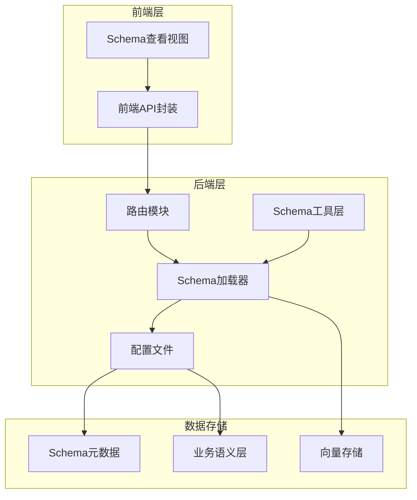
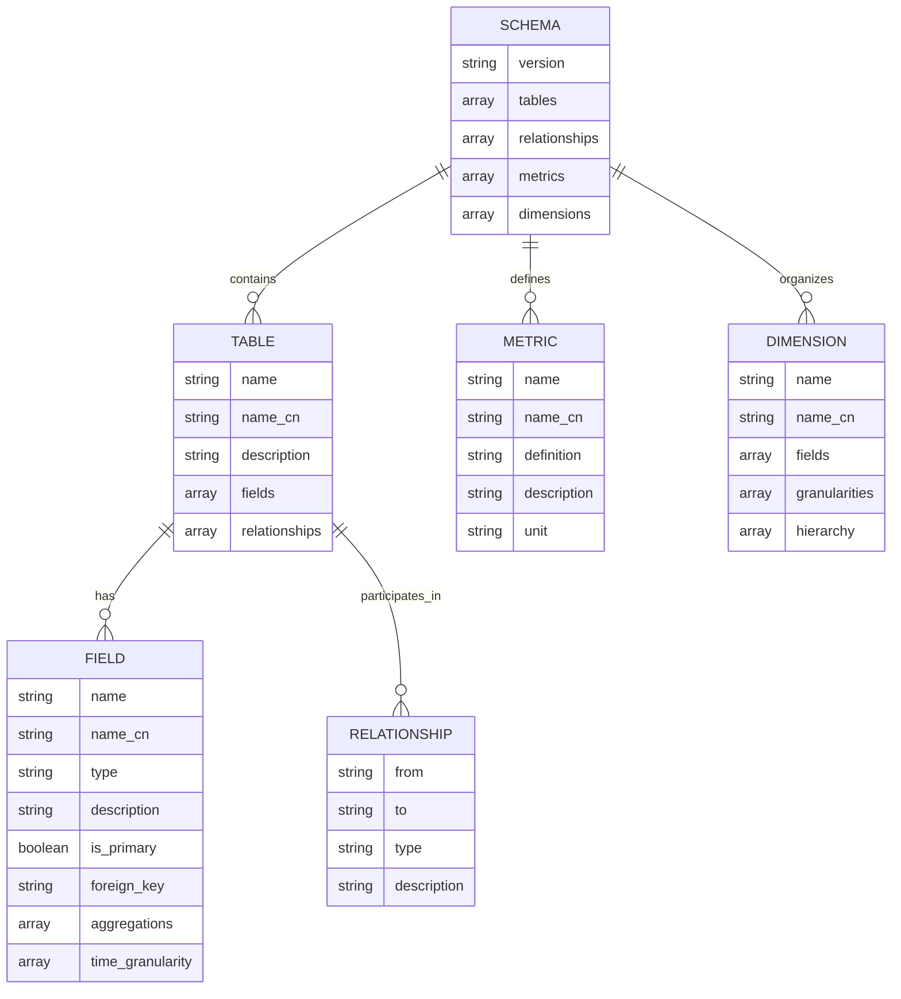
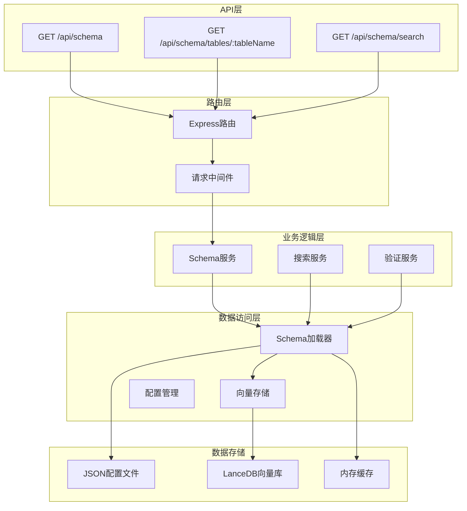
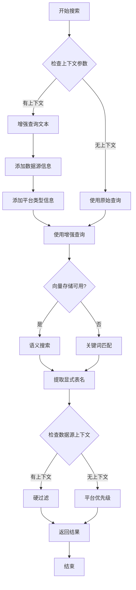
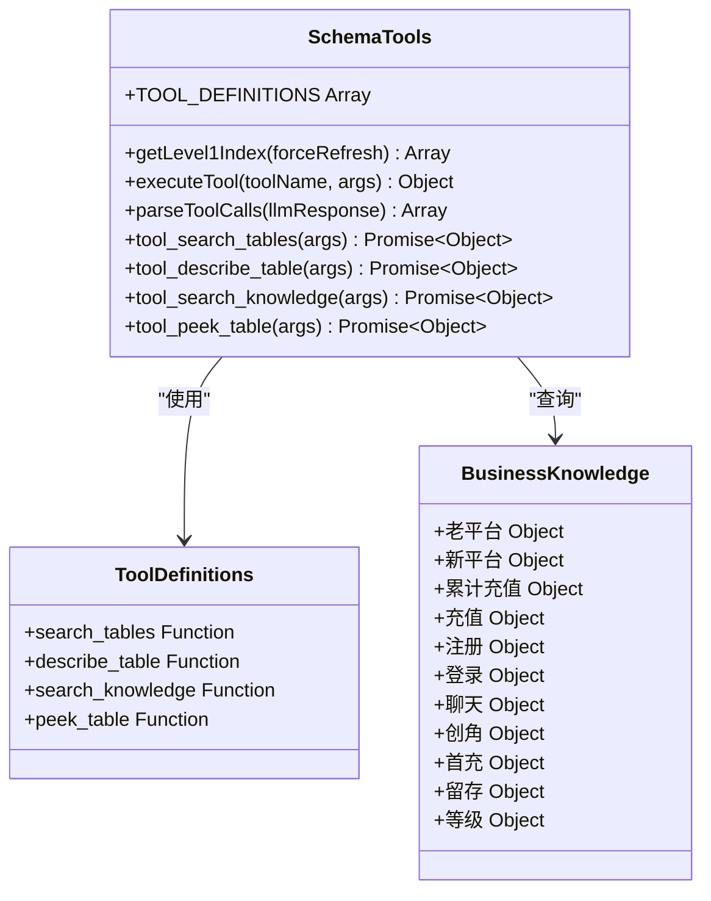
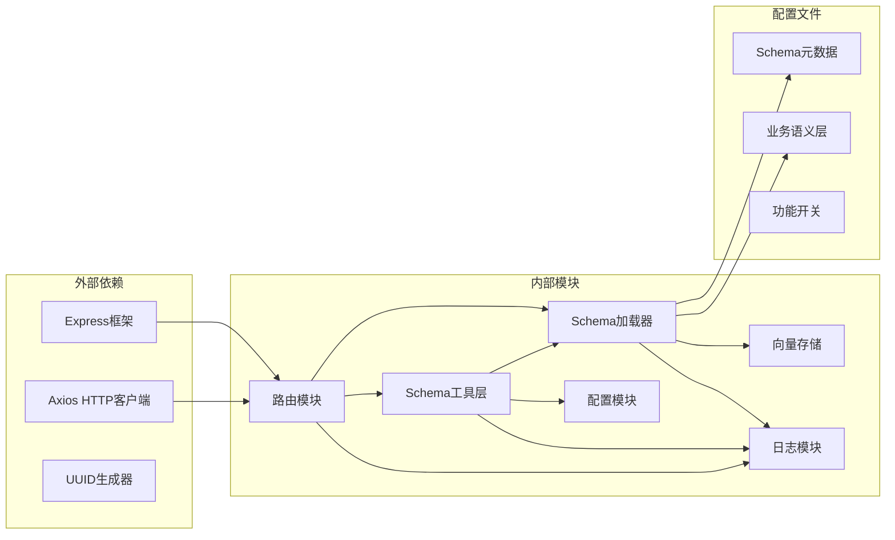
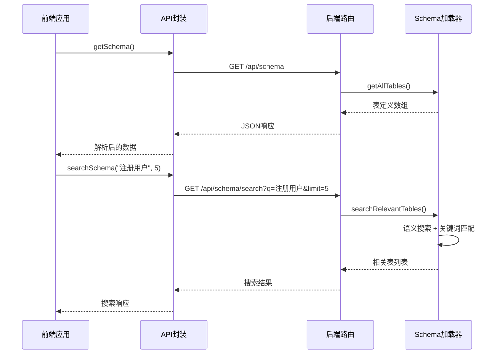

# Schema 管理接口

<cite>
**本文档引用的文件**
- [routes.js](file://backend/src/core/routes.js)
- [schemaLoader.js](file://backend/src/core/schemaLoader.js)
- [schemaTools.js](file://backend/src/core/schemaTools.js)
- [schema-metadata.example.json](file://backend/config/schema-metadata.example.json)
- [business-semantic-layer.json](file://backend/config/business-semantic-layer.json)
- [api.js](file://frontend/src/utils/api.js)
- [SchemaView.vue](file://frontend/src/views/SchemaView.vue)
</cite>

## 目录
1. [简介](#简介)
2. [项目结构](#项目结构)
3. [核心组件](#核心组件)
4. [架构概览](#架构概览)
5. [详细组件分析](#详细组件分析)
6. [依赖分析](#依赖分析)
7. [性能考虑](#性能考虑)
8. [故障排除指南](#故障排除指南)
9. [结论](#结论)

## 简介

NL2SQL 系统的 Schema 管理接口提供了完整的数据模式管理能力，包括 Schema 查询、表详情获取、Schema 搜索等功能。该接口支持多种查询参数和响应格式，能够满足不同场景下的 Schema 管理需求。

## 项目结构

NL2SQL 系统采用前后端分离架构，Schema 管理接口位于后端核心模块中，通过 RESTful API 提供服务。

**图表来源**
- [routes.js:141-252](file://backend/src/core/routes.js#L141-L252)
- [schemaLoader.js:1-131](file://backend/src/core/schemaLoader.js#L1-L131)
- [schemaTools.js:1-124](file://backend/src/core/schemaTools.js#L1-L124)

**章节来源**
- [routes.js:1-1099](file://backend/src/core/routes.js#L1-L1099)
- [schemaLoader.js:1-1261](file://backend/src/core/schemaLoader.js#L1-L1261)
- [schemaTools.js:1-632](file://backend/src/core/schemaTools.js#L1-L632)

## 核心组件

### Schema 数据结构

Schema 系统采用标准化的数据结构来组织表定义、指标和维度信息：

**图表来源**
- [schema-metadata.example.json:1-328](file://backend/config/schema-metadata.example.json#L1-L328)

### Schema 查询接口

系统提供三种主要的 Schema 查询方式：

1. **完整 Schema 查询** - 返回所有表、指标和维度信息
2. **分类查询** - 仅返回特定类型的 Schema 元素
3. **搜索查询** - 基于关键词的智能搜索

**章节来源**
- [schema-metadata.example.json:1-328](file://backend/config/schema-metadata.example.json#L1-L328)
- [business-semantic-layer.json:1-189](file://backend/config/business-semantic-layer.json#L1-L189)

## 架构概览

Schema 管理接口采用分层架构设计，确保系统的可维护性和扩展性。

**图表来源**
- [routes.js:141-252](file://backend/src/core/routes.js#L141-L252)
- [schemaLoader.js:1-131](file://backend/src/core/schemaLoader.js#L1-L131)

## 详细组件分析

### Schema 查询接口

#### GET /api/schema

**功能描述**: 获取完整的 Schema 信息，支持按类型筛选。

**请求参数**:
- 查询参数 `type`: 可选值包括 `tables`、`metrics`、`dimensions`

**响应结构**:
- 默认响应: 包含版本号、表定义、指标定义、维度定义
- `type=tables`: 仅返回表定义数组
- `type=metrics`: 仅返回指标定义数组  
- `type=dimensions`: 仅返回维度定义数组

**错误处理**:
- 400: 当 `type` 参数值无效时返回错误信息

**章节来源**
- [routes.js:145-188](file://backend/src/core/routes.js#L145-L188)

#### GET /api/schema/tables/:tableName

**功能描述**: 获取指定表的详细信息，包括表定义和关联表信息。

**路径参数**:
- `tableName`: 表名（支持英文名或中文名）

**响应结构**:
- `table`: 表的完整定义
- `relatedTables`: 与该表关联的其他表名列表

**错误处理**:
- 404: 当表不存在时返回错误信息

**章节来源**
- [routes.js:190-217](file://backend/src/core/routes.js#L190-L217)

#### GET /api/schema/search

**功能描述**: 搜索相关的表，支持关键词搜索和结果数量限制。

**请求参数**:
- 查询参数 `q`: 必需，搜索关键词
- 查询参数 `limit`: 可选，默认值为 5，返回结果数量限制

**响应结构**:
- `query`: 搜索关键词
- `count`: 匹配的表数量
- `tables`: 匹配的表定义数组

**错误处理**:
- 400: 当缺少 `q` 参数时返回错误信息
- 500: 搜索过程中发生错误时返回错误信息

**章节来源**
- [routes.js:219-252](file://backend/src/core/routes.js#L219-L252)

### Schema 搜索算法

Schema 搜索采用多阶段智能匹配策略：

**图表来源**
- [schemaLoader.js:571-679](file://backend/src/core/schemaLoader.js#L571-L679)

**章节来源**
- [schemaLoader.js:571-679](file://backend/src/core/schemaLoader.js#L571-L679)

### Schema 工具层

Schema 工具层提供 LLM 可调用的工具函数，支持按需索取 Schema 信息：

**图表来源**
- [schemaTools.js:40-124](file://backend/src/core/schemaTools.js#L40-L124)
- [schemaTools.js:405-542](file://backend/src/core/schemaTools.js#L405-L542)

**章节来源**
- [schemaTools.js:1-632](file://backend/src/core/schemaTools.js#L1-L632)

## 依赖分析

Schema 管理接口的依赖关系体现了清晰的分层架构：

**图表来源**
- [routes.js:17-31](file://backend/src/core/routes.js#L17-L31)
- [schemaLoader.js:16-26](file://backend/src/core/schemaLoader.js#L16-L26)

**章节来源**
- [routes.js:1-1099](file://backend/src/core/routes.js#L1-L1099)
- [schemaLoader.js:1-1261](file://backend/src/core/schemaLoader.js#L1-L1261)

## 性能考虑

### 缓存策略

Schema 系统实现了多层次的缓存机制：

1. **内存缓存**: Schema 数据在内存中缓存，减少重复加载
2. **向量缓存**: 向量存储中的 Schema 向量缓存，支持快速语义搜索
3. **索引缓存**: Level 1 索引缓存，用于初步筛选

### 搜索优化

1. **智能回退**: 当语义搜索失败时自动回退到关键词匹配
2. **结果去重**: 搜索结果自动去重，确保唯一性
3. **平台优先级**: 根据游戏 ID 推断平台类型，优先返回相关表

### 前端集成

前端通过 API 封装模块提供统一的接口：

**图表来源**
- [api.js:118-141](file://frontend/src/utils/api.js#L118-L141)
- [routes.js:145-252](file://backend/src/core/routes.js#L145-L252)

**章节来源**
- [api.js:1-320](file://frontend/src/utils/api.js#L1-L320)
- [SchemaView.vue:184-200](file://frontend/src/views/SchemaView.vue#L184-L200)

## 故障排除指南

### 常见问题及解决方案

#### 1. Schema 文件加载失败

**症状**: 应用启动时报 Schema 文件不存在错误

**原因**: Schema 配置文件路径配置错误或文件缺失

**解决方案**:
- 检查 `configPath` 配置项是否正确
- 确认 `schema-metadata.json` 文件存在于指定路径
- 验证文件格式是否为有效的 JSON

#### 2. 搜索结果为空

**症状**: 调用 `/api/schema/search` 返回空结果

**原因**: 
- 查询关键词过于具体或模糊
- 向量存储未初始化
- 缓存过期

**解决方案**:
- 尝试使用更通用的关键词
- 检查向量存储服务状态
- 清除缓存后重试

#### 3. 表详情查询失败

**症状**: 调用 `/api/schema/tables/:tableName` 返回 404 错误

**原因**: 表名不存在或拼写错误

**解决方案**:
- 确认表名是否存在于 Schema 定义中
- 检查表名大小写是否正确
- 使用 `/api/schema` 获取所有表名列表

#### 4. 性能问题

**症状**: API 响应时间过长

**原因**:
- 向量搜索性能瓶颈
- 缓存未生效
- 数据库连接问题

**解决方案**:
- 优化向量存储配置
- 检查缓存配置和过期时间
- 监控数据库连接池状态

**章节来源**
- [routes.js:18-31](file://backend/src/core/routes.js#L18-L31)
- [schemaLoader.js:75-131](file://backend/src/core/schemaLoader.js#L75-L131)

## 结论

NL2SQL 系统的 Schema 管理接口提供了完整、灵活的数据模式管理能力。通过标准化的数据结构、智能的搜索算法和完善的错误处理机制，该接口能够满足各种复杂的 Schema 管理需求。

系统的主要优势包括：
- **模块化设计**: 清晰的分层架构便于维护和扩展
- **智能搜索**: 支持语义搜索和关键词匹配的混合算法
- **性能优化**: 多层次缓存和向量存储提升查询性能
- **前端集成**: 完善的前端 API 封装和可视化界面

建议在生产环境中重点关注缓存配置、向量存储性能和错误监控，以确保系统的稳定性和高性能运行。