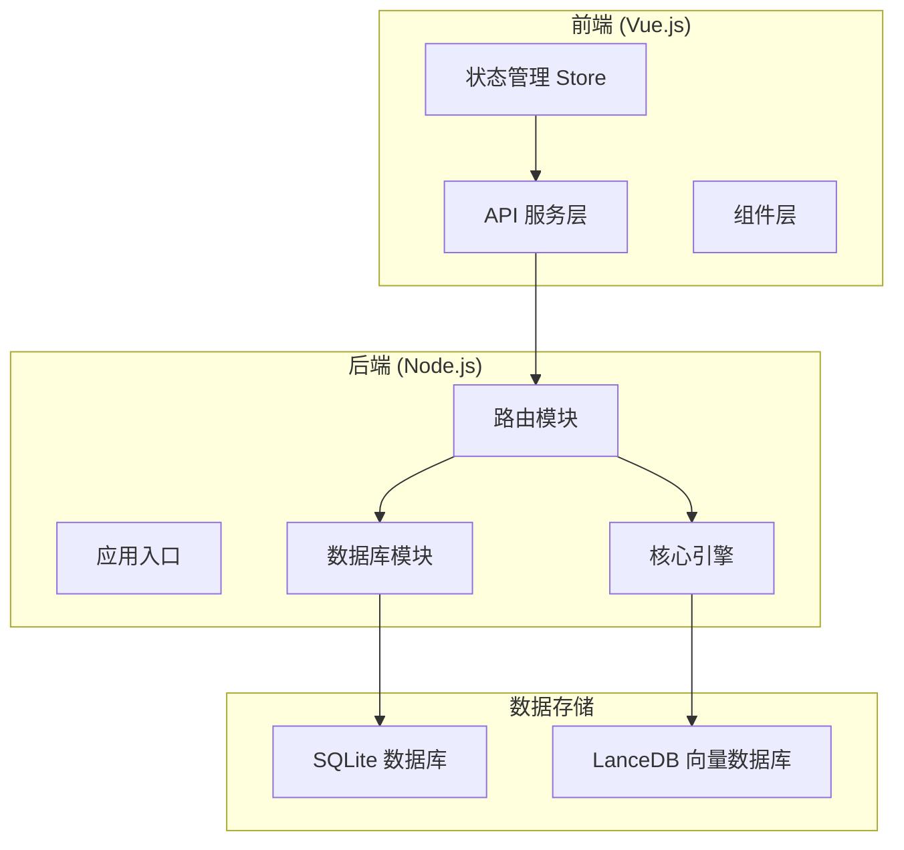
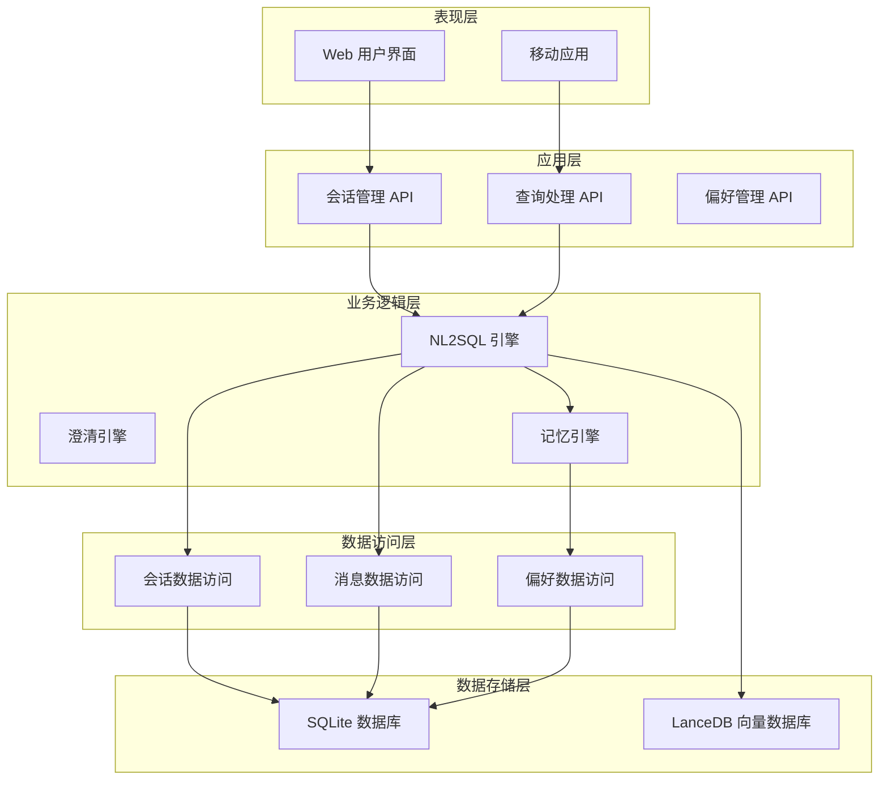
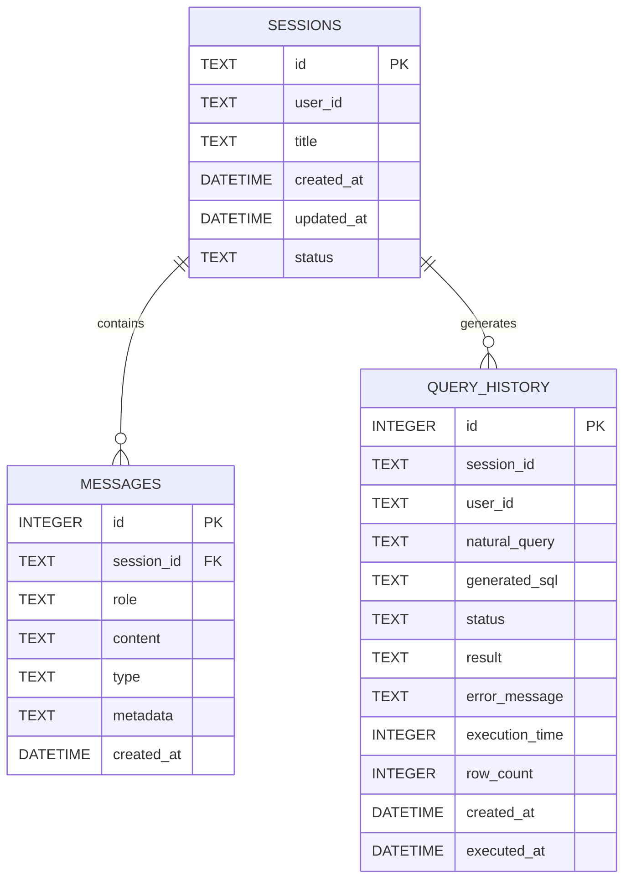
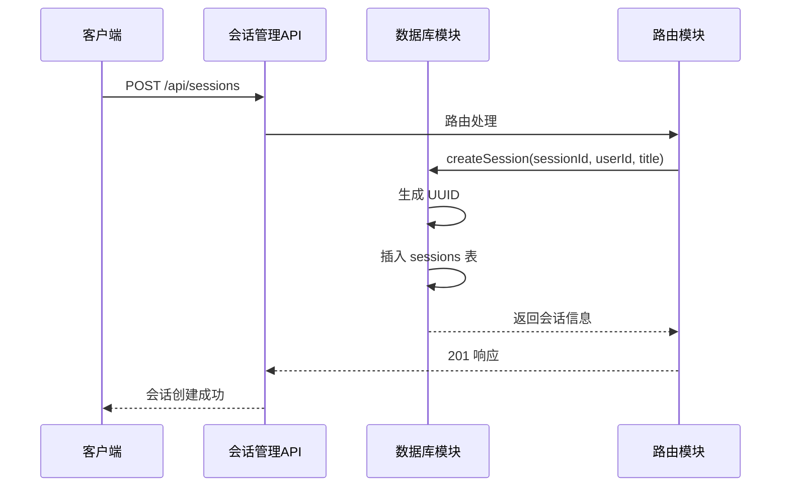
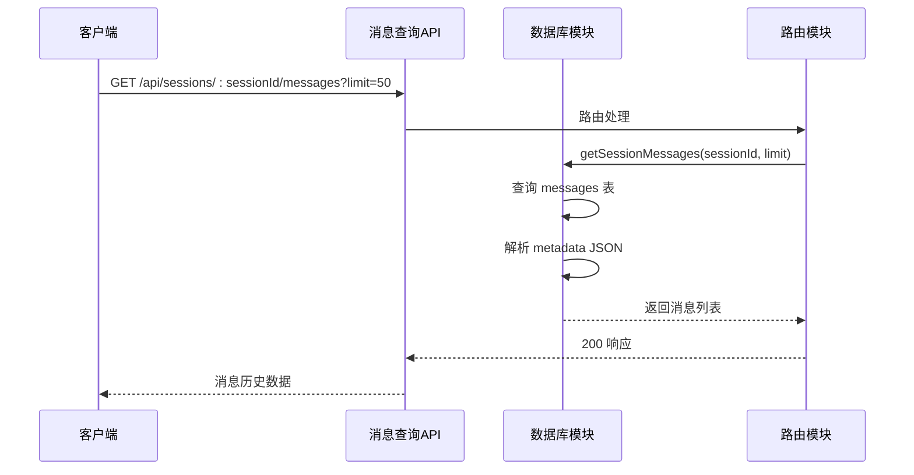
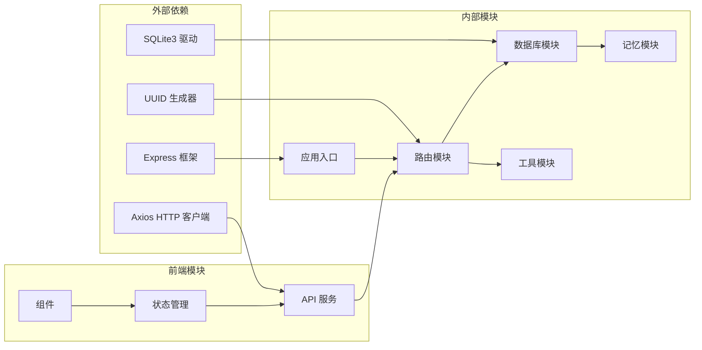

# 会话管理接口

<cite>
**本文档引用的文件**
- [app.js](file://backend/src/app.js)
- [routes.js](file://backend/src/core/routes.js)
- [database.js](file://backend/src/core/database.js)
- [session.js](file://frontend/src/stores/session.js)
- [api.js](file://frontend/src/utils/api.js)
- [package.json](file://backend/package.json)
</cite>

## 目录
1. [简介](#简介)
2. [项目结构](#项目结构)
3. [核心组件](#核心组件)
4. [架构概览](#架构概览)
5. [详细组件分析](#详细组件分析)
6. [依赖关系分析](#依赖关系分析)
7. [性能考虑](#性能考虑)
8. [故障排除指南](#故障排除指南)
9. [结论](#结论)

## 简介

NL2SQL 系统的会话管理接口提供了完整的对话生命周期管理功能，包括会话创建、获取、删除、消息历史查询以及用户会话列表管理。该系统采用前后端分离架构，后端使用 Node.js + Express 提供 RESTful API，前端使用 Vue.js + Pinia 进行状态管理。

会话管理接口支持以下主要功能：
- 创建新的用户会话
- 获取单个会话的详细信息
- 删除指定会话及其相关数据
- 查询会话的消息历史记录
- 获取用户的会话列表
- 实时消息流处理（通过 SSE）

## 项目结构

NL2SQL 系统采用模块化设计，核心架构如下：



**图表来源**
- [app.js:1-279](file://backend/src/app.js#L1-L279)
- [routes.js:1-800](file://backend/src/core/routes.js#L1-L800)

**章节来源**
- [app.js:58-83](file://backend/src/app.js#L58-L83)
- [package.json:16-27](file://backend/package.json#L16-L27)

## 核心组件

### 后端核心组件

NL2SQL 系统的后端由多个核心模块组成，每个模块负责特定的功能领域：

#### 应用入口模块
应用入口负责初始化整个系统，包括环境配置、模块加载、服务器启动等关键功能。

#### 路由模块
路由模块定义了所有 RESTful API 端点，包括会话管理、Schema 查询、消息处理等功能。

#### 数据库模块
数据库模块封装了 SQLite 数据库操作，提供了会话、消息、查询历史等数据的持久化存储。

#### 核心引擎模块
核心引擎模块包含了 NL2SQL 的核心业务逻辑，包括自然语言理解、SQL 生成、查询执行等功能。

### 前端核心组件

#### API 服务层
API 服务层封装了所有与后端的 HTTP 通信，提供了统一的请求/响应拦截和错误处理机制。

#### 状态管理 Store
状态管理 Store 使用 Pinia 管理会话相关的状态，包括会话列表、当前会话、消息历史、SSE 连接等。

#### 组件层
组件层包含了用户界面的各种组件，负责与用户交互和展示数据。

**章节来源**
- [routes.js:255-400](file://backend/src/core/routes.js#L255-L400)
- [database.js:39-236](file://backend/src/core/database.js#L39-L236)

## 架构概览

NL2SQL 系统采用分层架构设计，确保了良好的可维护性和扩展性：



**图表来源**
- [app.js:105-204](file://backend/src/app.js#L105-L204)
- [routes.js:255-380](file://backend/src/core/routes.js#L255-L380)

## 详细组件分析

### 会话管理 API 接口规范

#### 1. 创建会话接口

**端点**: `POST /api/sessions`

**功能**: 创建一个新的用户会话

**请求体参数**:
| 参数名 | 类型 | 必需 | 描述 | 默认值 |
|--------|------|------|------|--------|
| user_id | string | 否 | 用户标识符 | 'anonymous' |
| title | string | 否 | 会话标题 | '新会话' |

**响应**:
- **201 Created**: 创建成功的会话信息
- **500 Internal Server Error**: 服务器内部错误

**响应体示例**:
```json
{
  "id": "uuid-string",
  "user_id": "user-123",
  "title": "新会话"
}
```

#### 2. 获取会话信息接口

**端点**: `GET /api/sessions/:sessionId`

**功能**: 获取指定会话的详细信息

**路径参数**:
| 参数名 | 类型 | 必需 | 描述 |
|--------|------|------|------|
| sessionId | string | 是 | 会话唯一标识符 |

**响应**:
- **200 OK**: 会话信息
- **404 Not Found**: 会话不存在
- **500 Internal Server Error**: 服务器内部错误

**响应体示例**:
```json
{
  "id": "uuid-string",
  "user_id": "user-123",
  "title": "新会话",
  "created_at": "2024-01-01T00:00:00Z",
  "updated_at": "2024-01-01T00:00:00Z",
  "status": "active"
}
```

#### 3. 删除会话接口

**端点**: `DELETE /api/sessions/:sessionId`

**功能**: 删除指定会话及其所有相关数据

**路径参数**:
| 参数名 | 类型 | 必需 | 描述 |
|--------|------|------|------|
| sessionId | string | 是 | 会话唯一标识符 |

**响应**:
- **200 OK**: 删除成功
- **404 Not Found**: 会话不存在
- **500 Internal Server Error**: 服务器内部错误

**响应体示例**:
```json
{
  "success": true,
  "message": "会话已删除"
}
```

#### 4. 获取会话消息历史接口

**端点**: `GET /api/sessions/:sessionId/messages`

**功能**: 获取会话的消息历史记录

**路径参数**:
| 参数名 | 类型 | 必需 | 描述 |
|--------|------|------|------|
| sessionId | string | 是 | 会话唯一标识符 |

**查询参数**:
| 参数名 | 类型 | 必需 | 描述 | 默认值 |
|--------|------|------|------|--------|
| limit | number | 否 | 返回消息数量限制 | 50 |

**响应**:
- **200 OK**: 消息历史列表
- **500 Internal Server Error**: 服务器内部错误

**响应体示例**:
```json
{
  "session_id": "uuid-string",
  "count": 10,
  "messages": [
    {
      "id": 1,
      "session_id": "uuid-string",
      "role": "user",
      "content": "查询销售数据",
      "type": "text",
      "metadata": null,
      "created_at": "2024-01-01T00:00:00Z"
    }
  ]
}
```

#### 5. 获取用户会话列表接口

**端点**: `GET /api/users/:userId/sessions`

**功能**: 获取指定用户的所有会话

**路径参数**:
| 参数名 | 类型 | 必需 | 描述 |
|--------|------|------|------|
| userId | string | 是 | 用户唯一标识符 |

**查询参数**:
| 参数名 | 类型 | 必需 | 描述 | 默认值 |
|--------|------|------|------|--------|
| limit | number | 否 | 返回会话数量限制 | 20 |

**响应**:
- **200 OK**: 会话列表
- **500 Internal Server Error**: 服务器内部错误

**响应体示例**:
```json
{
  "user_id": "user-123",
  "count": 5,
  "sessions": [
    {
      "id": "uuid-string",
      "user_id": "user-123",
      "title": "销售数据分析",
      "created_at": "2024-01-01T00:00:00Z",
      "updated_at": "2024-01-01T00:00:00Z",
      "status": "active"
    }
  ]
}
```

### 数据模型定义

#### 会话数据模型

会话表 (`sessions`) 定义了会话的基本信息和状态管理：



**图表来源**
- [database.js:44-149](file://backend/src/core/database.js#L44-L149)

#### 消息数据模型

消息表 (`messages`) 存储会话中的所有消息记录，支持多种消息类型：

| 字段名 | 类型 | 描述 | 约束 |
|--------|------|------|------|
| id | INTEGER | 消息唯一标识符 | 主键，自增 |
| session_id | TEXT | 所属会话ID | 外键，引用 sessions.id |
| role | TEXT | 消息角色 | 必填，枚举值 |
| content | TEXT | 消息内容 | 必填 |
| type | TEXT | 消息类型 | 默认 'text' |
| metadata | TEXT | 附加元数据 | JSON 格式 |
| created_at | DATETIME | 创建时间 | 默认当前时间 |

**消息类型枚举**:
- `text`: 文本消息
- `sql`: SQL 代码
- `result`: 查询结果
- `error`: 错误信息
- `clarification`: 澄清消息

**章节来源**
- [database.js:70-92](file://backend/src/core/database.js#L70-L92)
- [database.js:816-830](file://backend/src/core/database.js#L816-L830)

### 处理流程分析

#### 会话创建流程



**图表来源**
- [routes.js:268-292](file://backend/src/core/routes.js#L268-L292)
- [database.js:638-646](file://backend/src/core/database.js#L638-L646)

#### 消息历史查询流程



**图表来源**
- [routes.js:356-375](file://backend/src/core/routes.js#L356-L375)
- [database.js:816-830](file://backend/src/core/database.js#L816-L830)

### 错误处理机制

NL2SQL 系统实现了完善的错误处理机制，确保 API 的稳定性和可靠性：

#### 错误响应格式

所有错误响应都遵循统一的格式：

```json
{
  "error": "错误描述信息"
}
```

#### 常见错误场景

| HTTP 状态码 | 错误类型 | 触发条件 | 响应示例 |
|-------------|----------|----------|----------|
| 404 | Not Found | 会话不存在 | `{ "error": "会话不存在" }` |
| 500 | Internal Server Error | 服务器内部错误 | `{ "error": "创建会话失败: 数据库连接异常" }` |
| 400 | Bad Request | 请求参数缺失 | `{ "error": "缺少搜索关键词（q参数）" }` |

#### 错误处理策略

1. **数据库错误**: 捕获数据库操作异常，记录详细错误信息
2. **参数验证**: 验证请求参数的有效性，提供清晰的错误提示
3. **资源不存在**: 对于不存在的资源返回 404 状态码
4. **服务器错误**: 对于服务器内部错误返回 500 状态码

**章节来源**
- [routes.js:286-291](file://backend/src/core/routes.js#L286-L291)
- [routes.js:309-315](file://backend/src/core/routes.js#L309-L315)

## 依赖关系分析

NL2SQL 系统的依赖关系体现了清晰的分层架构：



**图表来源**
- [package.json:16-27](file://backend/package.json#L16-L27)
- [app.js:23-50](file://backend/src/app.js#L23-L50)

### 核心依赖分析

#### 后端核心依赖

| 依赖包 | 版本 | 用途 | 重要性 |
|--------|------|------|--------|
| express | ^4.18.2 | Web 框架 | 核心 |
| sqlite3 | ^5.1.6 | SQLite 数据库驱动 | 核心 |
| uuid | ^9.0.0 | UUID 生成器 | 核心 |
| cors | ^2.8.5 | 跨域处理 | 基础 |
| body-parser | ^1.20.2 | 请求体解析 | 基础 |
| dotenv | ^16.3.1 | 环境变量管理 | 基础 |

#### 前端核心依赖

| 依赖包 | 版本 | 用途 | 重要性 |
|--------|------|------|--------|
| axios | ^1.6.0 | HTTP 客户端 | 核心 |
| pinia | ^2.1.7 | 状态管理 | 核心 |
| vue | ^3.3.13 | 前端框架 | 核心 |
| uuid | ^9.0.0 | UUID 生成器 | 基础 |

**章节来源**
- [package.json:16-31](file://backend/package.json#L16-L31)

## 性能考虑

### 数据库性能优化

NL2SQL 系统在数据库层面实现了多项性能优化措施：

#### 索引优化
- 会话表: `user_id`, `status`, `updated_at` 索引
- 消息表: `session_id`, `created_at` 索引  
- 查询历史表: `user_id`, `session_id`, `created_at`, `status` 索引

#### 查询优化
- 使用参数化查询防止 SQL 注入
- 限制查询结果数量避免大数据量传输
- 使用事务确保数据一致性

#### 缓存策略
- 使用内存缓存减少数据库访问
- 实现智能缓存失效机制
- 支持缓存预热和更新

### 前端性能优化

#### 状态管理优化
- 使用 Pinia 的响应式状态管理
- 实现状态持久化避免页面刷新丢失
- 支持状态分片和懒加载

#### API 调用优化
- 实现请求去重和缓存
- 支持并发请求管理和节流
- 提供请求取消机制

#### 用户体验优化
- 实现无限滚动加载
- 支持本地搜索和过滤
- 提供加载状态指示器

### 系统监控和诊断

#### 性能指标
- API 响应时间监控
- 数据库查询性能跟踪
- 内存使用情况监控
- 错误率统计分析

#### 诊断工具
- 实时日志查看
- 性能分析报告
- 资源使用监控
- 异常堆栈跟踪

## 故障排除指南

### 常见问题及解决方案

#### 1. 会话创建失败

**症状**: 创建会话时返回 500 错误

**可能原因**:
- 数据库连接异常
- UUID 生成器故障
- 磁盘空间不足

**解决步骤**:
1. 检查数据库连接状态
2. 验证磁盘空间
3. 查看应用日志
4. 重启服务

#### 2. 消息历史查询异常

**症状**: 获取消息历史时返回空数组

**可能原因**:
- 会话 ID 不存在
- 消息数量超过限制
- 数据库查询超时

**解决步骤**:
1. 验证会话 ID 有效性
2. 检查 limit 参数设置
3. 查看数据库查询日志
4. 优化查询性能

#### 3. 前端状态不同步

**症状**: 前端显示的会话状态与实际不符

**可能原因**:
- SSE 连接中断
- 状态管理缓存问题
- 网络延迟导致的状态不同步

**解决步骤**:
1. 检查 SSE 连接状态
2. 刷新页面重新同步
3. 清除浏览器缓存
4. 检查网络连接

### 调试技巧

#### 后端调试
- 启用详细日志记录
- 使用调试工具进行断点调试
- 监控数据库查询性能
- 分析内存使用情况

#### 前端调试
- 使用浏览器开发者工具
- 检查网络请求和响应
- 监控状态变化
- 分析组件渲染性能

#### 系统监控
- 设置性能指标告警
- 监控错误率和响应时间
- 分析用户行为模式
- 识别系统瓶颈

**章节来源**
- [app.js:262-271](file://backend/src/app.js#L262-L271)
- [routes.js:48-56](file://backend/src/core/routes.js#L48-L56)

## 结论

NL2SQL 系统的会话管理接口设计合理，功能完善，具有良好的扩展性和稳定性。通过采用模块化架构、完善的错误处理机制和性能优化策略，系统能够满足复杂的自然语言查询需求。

### 主要优势

1. **清晰的 API 设计**: RESTful 接口规范明确，易于理解和使用
2. **完整的功能覆盖**: 支持会话全生命周期管理
3. **强大的数据模型**: 支持多种消息类型和元数据
4. **优秀的性能表现**: 通过索引优化和缓存策略提升响应速度
5. **可靠的错误处理**: 完善的错误处理和恢复机制

### 未来改进方向

1. **安全性增强**: 添加身份认证和授权机制
2. **扩展性优化**: 支持水平扩展和分布式部署
3. **监控完善**: 增强系统监控和诊断能力
4. **用户体验**: 优化前端交互和响应速度
5. **文档完善**: 提供更详细的 API 文档和示例

该系统为 NL2SQL 功能提供了坚实的基础，能够有效支撑企业级的数据查询和分析需求。