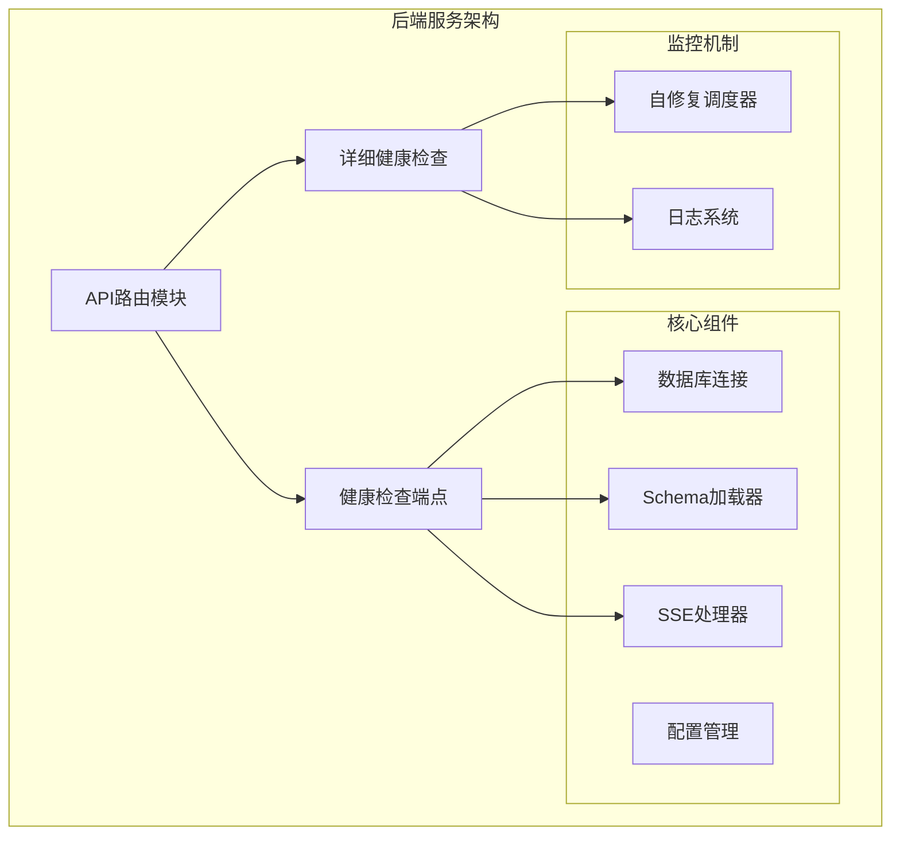
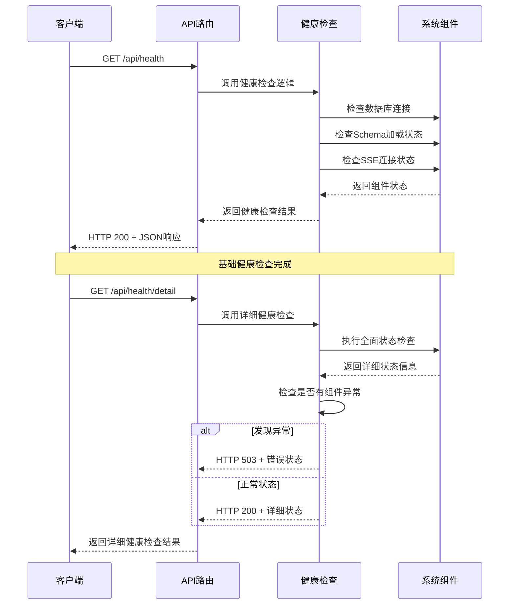
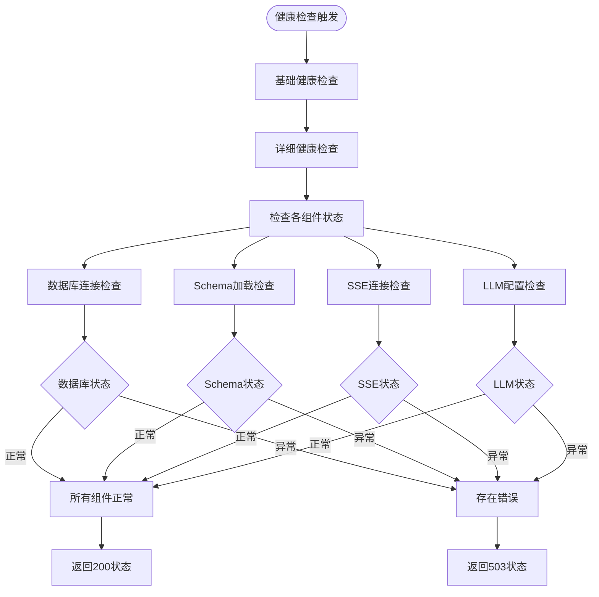
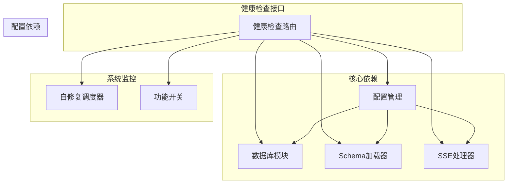
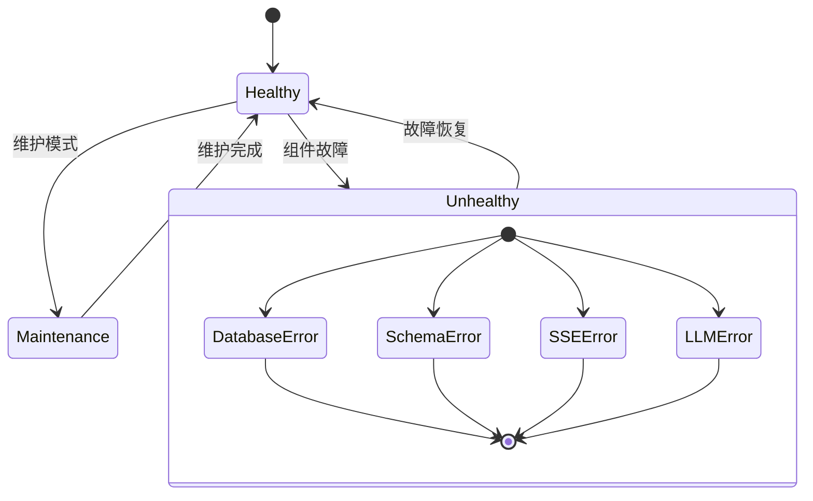

# 健康检查接口

<cite>
**本文档引用的文件**
- [routes.js](file://backend/src/core/routes.js)
- [app.js](file://backend/src/app.js)
- [selfRepair.js](file://backend/src/core/selfRepair.js)
- [schemaLoader.js](file://backend/src/core/schemaLoader.js)
- [sseHandler.js](file://backend/src/core/sseHandler.js)
- [config.js](file://backend/src/core/config.js)
- [feature-flags.js](file://backend/config/feature-flags.js)
- [schema-metadata.json](file://backend/config/schema-metadata.json)
</cite>

## 目录
1. [简介](#简介)
2. [项目结构](#项目结构)
3. [核心组件](#核心组件)
4. [架构概览](#架构概览)
5. [详细组件分析](#详细组件分析)
6. [依赖关系分析](#依赖关系分析)
7. [性能考虑](#性能考虑)
8. [故障排除指南](#故障排除指南)
9. [结论](#结论)

## 简介

NL2SQL 系统提供了两个健康检查接口，用于监控服务状态和组件健康状况。这些接口对于系统运维、负载均衡器探活、容器编排和自动化监控至关重要。

## 项目结构

NL2SQL 健康检查接口位于后端服务的核心路由模块中，采用 RESTful API 设计：



**图表来源**
- [routes.js:59-139](file://backend/src/core/routes.js#L59-L139)
- [app.js:78-82](file://backend/src/app.js#L78-L82)

**章节来源**
- [routes.js:1-154](file://backend/src/core/routes.js#L1-L154)
- [app.js:78-82](file://backend/src/app.js#L78-L82)

## 核心组件

### 健康检查接口概述

NL2SQL 系统提供两个层次的健康检查接口：

1. **基础健康检查** (`/api/health`)
2. **详细健康检查** (`/api/health/detail`)

这两个接口都采用 GET 方法，返回 JSON 格式的响应，用于监控服务的整体状态和组件健康状况。

**章节来源**
- [routes.js:62-139](file://backend/src/core/routes.js#L62-L139)

## 架构概览



**图表来源**
- [routes.js:74-139](file://backend/src/core/routes.js#L74-L139)
- [selfRepair.js:215-427](file://backend/src/core/selfRepair.js#L215-L427)

## 详细组件分析

### 基础健康检查接口

#### 接口规范

**端点**: `GET /api/health`

**请求参数**: 无

**响应格式**:
```json
{
  "status": "ok",
  "timestamp": "ISO时间字符串",
  "version": "服务版本",
  "uptime": 运行时间（秒）,
  "memory": {
    "used": 已使用内存（MB）,
    "total": 总内存（MB）
  }
}
```

**状态码**:
- `200 OK`: 服务正常运行
- `503 Service Unavailable`: 服务异常（在详细检查中使用）

#### 实现细节

基础健康检查主要关注以下方面：

1. **服务状态**: 检查服务进程的基本运行状态
2. **时间戳**: 提供当前服务器时间
3. **版本信息**: 返回服务版本号
4. **运行时间**: 提供进程运行时长
5. **内存使用**: 报告当前内存使用情况

**章节来源**
- [routes.js:74-96](file://backend/src/core/routes.js#L74-L96)

### 详细健康检查接口

#### 接口规范

**端点**: `GET /api/health/detail`

**请求参数**: 无

**响应格式**:
```json
{
  "status": "ok|error",
  "timestamp": "ISO时间字符串",
  "components": {
    "database": {
      "status": "ok",
      "message": "SQLite连接正常"
    },
    "llm": {
      "status": "ok",
      "message": "LLM API配置正常"
    },
    "schema": {
      "status": schemaLoader.getAllTables().length > 0 ? 'ok' : 'error',
      "tables": 表数量
    },
    "sse": {
      "status": "ok",
      "connections": 活跃连接数
    }
  }
}
```

**状态码**:
- `200 OK`: 所有组件正常
- `503 Service Unavailable`: 至少一个组件异常

#### 组件检查机制

详细健康检查包含四个核心组件的状态检查：

1. **数据库组件** (`database`)
   - 检查 SQLite 数据库连接
   - 返回连接状态和消息

2. **LLM 组件** (`llm`)
   - 验证 LLM API 配置
   - 检查 API 密钥和基础 URL

3. **Schema 组件** (`schema`)
   - 检查 Schema 元数据加载状态
   - 统计可用表的数量
   - 返回表数量信息

4. **SSE 组件** (`sse`)
   - 检查 Server-Sent Events 连接状态
   - 统计活跃连接数量

**章节来源**
- [routes.js:102-139](file://backend/src/core/routes.js#L102-L139)
- [schemaLoader.js:441-443](file://backend/src/core/schemaLoader.js#L441-L443)
- [sseHandler.js:626-632](file://backend/src/core/sseHandler.js#L626-L632)

### 自修复机制集成



**图表来源**
- [routes.js:131-136](file://backend/src/core/routes.js#L131-L136)
- [selfRepair.js:215-427](file://backend/src/core/selfRepair.js#L215-L427)

**章节来源**
- [selfRepair.js:215-427](file://backend/src/core/selfRepair.js#L215-L427)

## 依赖关系分析

### 组件依赖图



**图表来源**
- [routes.js:16-31](file://backend/src/core/routes.js#L16-L31)
- [config.js:20-438](file://backend/src/core/config.js#L20-L438)

### 关键依赖关系

1. **Schema 加载器依赖**
   - 健康检查依赖 `schemaLoader.getAllTables()` 获取表数量
   - 用于验证 Schema 元数据是否正确加载

2. **SSE 处理器依赖**
   - 健康检查使用 `sseHandler.getConnectionCount()` 统计活跃连接
   - 用于监控实时连接状态

3. **配置管理依赖**
   - 健康检查不直接依赖配置，但自修复机制依赖配置
   - 配置用于控制各种功能开关和阈值

**章节来源**
- [routes.js:108-127](file://backend/src/core/routes.js#L108-L127)
- [schemaLoader.js:441-443](file://backend/src/core/schemaLoader.js#L441-L443)
- [sseHandler.js:626-632](file://backend/src/core/sseHandler.js#L626-L632)

## 性能考虑

### 健康检查性能特征

1. **轻量级操作**: 健康检查执行简单的状态查询，对系统性能影响极小
2. **内存使用**: 基础检查仅使用少量内存，详细检查涉及连接统计
3. **响应时间**: 健康检查通常在毫秒级别完成
4. **并发处理**: 支持高并发健康检查请求

### 监控最佳实践

1. **检查频率**: 建议每 30-60 秒进行一次健康检查
2. **超时设置**: 健康检查超时应设置为 5-10 秒
3. **重试策略**: 建议最多重试 3 次，间隔 1 秒
4. **告警阈值**: 基础检查失败即触发告警，详细检查出现异常组件时告警

## 故障排除指南

### 常见问题诊断

#### 数据库连接问题
**症状**: 数据库组件状态为 `error`
**可能原因**:
- SQLite 数据库文件损坏
- 数据库权限不足
- 数据库文件路径配置错误

**解决方法**:
1. 检查数据库文件是否存在和可访问
2. 验证数据库文件权限设置
3. 确认数据库配置路径正确

#### Schema 加载问题
**症状**: Schema 组件状态为 `error`
**可能原因**:
- Schema 配置文件不存在或格式错误
- Schema 元数据文件损坏
- LLM 服务不可用（影响向量化）

**解决方法**:
1. 检查 `schema-metadata.json` 文件完整性
2. 验证 Schema 配置文件格式
3. 确认 LLM 服务配置正确

#### SSE 连接问题
**症状**: SSE 组件状态异常
**可能原因**:
- SSE 服务未启动
- 连接池耗尽
- 网络连接问题

**解决方法**:
1. 检查 SSE 服务启动状态
2. 监控连接池使用情况
3. 验证网络连接稳定性

#### LLM 配置问题
**症状**: LLM 组件状态为 `error`
**可能原因**:
- API 密钥配置错误
- API 基础 URL 配置错误
- 网络连接问题

**解决方法**:
1. 验证 LLM API 密钥设置
2. 检查 API 基础 URL 配置
3. 确认网络连接正常

### 健康检查自动化



**图表来源**
- [selfRepair.js:215-427](file://backend/src/core/selfRepair.js#L215-L427)

**章节来源**
- [selfRepair.js:215-427](file://backend/src/core/selfRepair.js#L215-L427)

## 结论

NL2SQL 系统的健康检查接口提供了完整的系统监控能力，包括基础健康检查和详细健康检查两个层次。这些接口设计简洁、性能优异，能够有效监控服务状态和组件健康状况。

### 主要优势

1. **双层次监控**: 基础检查快速响应，详细检查全面覆盖
2. **组件化设计**: 独立检查各个核心组件，便于定位问题
3. **自动化集成**: 与自修复机制无缝集成，支持自动故障检测
4. **易于使用**: 简单的 HTTP 接口，便于各种监控工具集成

### 最佳实践建议

1. **监控策略**: 结合基础检查和详细检查，实现多层次监控
2. **告警配置**: 根据业务重要性设置不同的告警级别
3. **性能监控**: 结合系统资源监控，全面了解服务状态
4. **故障处理**: 建立完善的故障处理流程和应急预案

通过合理使用这些健康检查接口，可以有效提升 NL2SQL 系统的可靠性和可维护性。