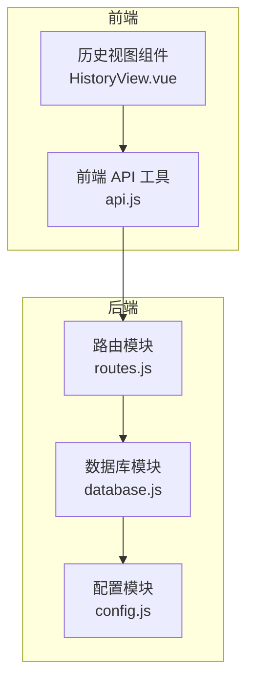
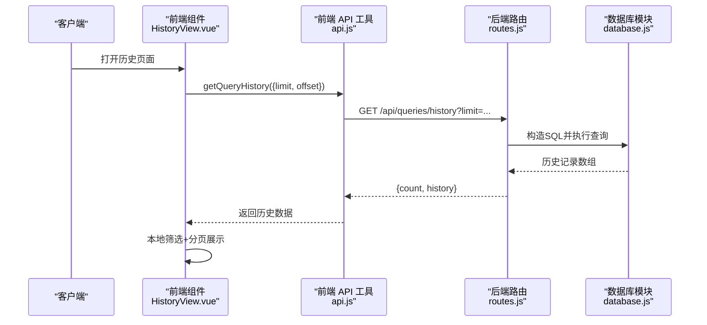
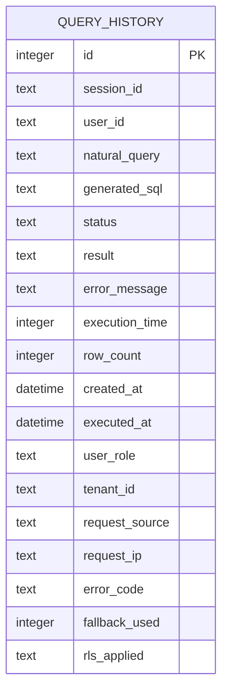
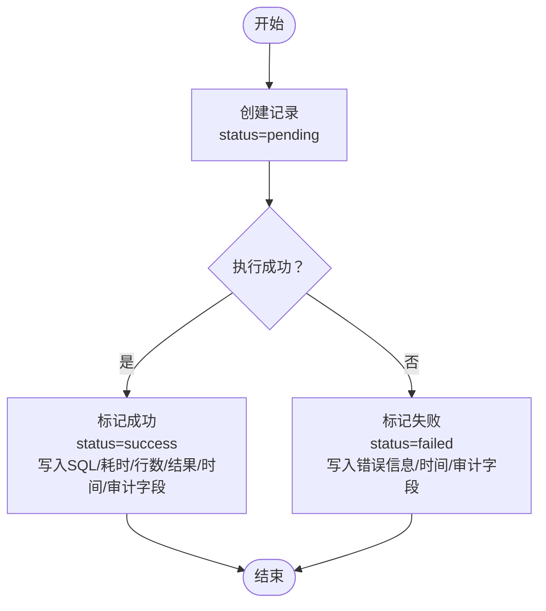

# 查询历史接口

<cite>
**本文引用的文件**
- [routes.js](file://backend/src/core/routes.js)
- [database.js](file://backend/src/core/database.js)
- [api.js](file://frontend/src/utils/api.js)
- [HistoryView.vue](file://frontend/src/views/HistoryView.vue)
- [test-query-history.js](file://backend/test/phase1/test-query-history.js)
- [config.js](file://backend/src/core/config.js)
</cite>

## 目录
1. [简介](#简介)
2. [项目结构](#项目结构)
3. [核心组件](#核心组件)
4. [架构总览](#架构总览)
5. [详细组件分析](#详细组件分析)
6. [依赖关系分析](#依赖关系分析)
7. [性能考量](#性能考量)
8. [故障排查指南](#故障排查指南)
9. [结论](#结论)
10. [附录](#附录)

## 简介
本文件为 NL2SQL 系统的查询历史接口提供完整的 API 文档。重点覆盖 /api/queries/history 端点的规范，包括 HTTP 方法、查询参数、过滤条件、分页机制；解释查询历史的数据结构与字段含义；说明时间范围筛选、用户与会话关联方式；给出检索、筛选、排序的完整示例；并阐述查询历史的存储策略、数据保留规则与性能考虑，以及最佳实践与使用场景。

## 项目结构
查询历史接口位于后端路由模块中，数据持久化由 SQLite 数据库模块负责，前端通过 API 工具调用该接口并在历史视图中展示。

图表来源
- [routes.js:406-452](file://backend/src/core/routes.js#L406-L452)
- [database.js:94-151](file://backend/src/core/database.js#L94-L151)
- [api.js:206-208](file://frontend/src/utils/api.js#L206-L208)
- [HistoryView.vue:226-243](file://frontend/src/views/HistoryView.vue#L226-L243)

章节来源
- [routes.js:406-452](file://backend/src/core/routes.js#L406-L452)
- [database.js:94-151](file://backend/src/core/database.js#L94-L151)
- [api.js:206-208](file://frontend/src/utils/api.js#L206-L208)
- [HistoryView.vue:226-243](file://frontend/src/views/HistoryView.vue#L226-L243)

## 核心组件
- 路由层：定义 /api/queries/history GET 接口，支持 user_id、session_id、limit 等查询参数，并按 created_at 降序返回历史记录。
- 数据层：SQLite 表 query_history 存储查询历史，包含用户、会话、自然语言查询、生成 SQL、执行状态、结果摘要、错误信息、执行耗时、行数、时间戳及审计字段等。
- 前端层：HistoryView.vue 调用 getQueryHistory 并实现本地筛选与分页；api.js 封装 /queries/history 请求。

章节来源
- [routes.js:406-452](file://backend/src/core/routes.js#L406-L452)
- [database.js:94-151](file://backend/src/core/database.js#L94-L151)
- [api.js:206-208](file://frontend/src/utils/api.js#L206-L208)
- [HistoryView.vue:226-243](file://frontend/src/views/HistoryView.vue#L226-L243)

## 架构总览
查询历史接口的端到端流程如下：

图表来源
- [HistoryView.vue:226-243](file://frontend/src/views/HistoryView.vue#L226-L243)
- [api.js:206-208](file://frontend/src/utils/api.js#L206-L208)
- [routes.js:415-452](file://backend/src/core/routes.js#L415-L452)
- [database.js:541-580](file://backend/src/core/database.js#L541-L580)

## 详细组件分析

### 接口规范：/api/queries/history
- HTTP 方法：GET
- 路径：/api/queries/history
- 查询参数：
  - user_id：用户ID筛选
  - session_id：会话ID筛选
  - limit：返回数量限制（默认20）
- 响应：
  - count：本次查询返回的历史条数
  - history：历史记录数组，每条记录包含以下字段（见“数据结构”）

章节来源
- [routes.js:406-452](file://backend/src/core/routes.js#L406-L452)

### 数据结构与字段含义
查询历史表 query_history 的核心字段（部分）：
- id：自增主键
- session_id：所属会话ID（可空）
- user_id：用户标识
- natural_query：用户的自然语言查询
- generated_sql：生成的SQL语句（可空）
- status：执行状态（pending/success/failed）
- result：结果摘要（JSON字符串，长度受限）
- error_message：错误信息（可空）
- execution_time：执行耗时（毫秒，可空）
- row_count：返回行数（可空）
- created_at：创建时间
- executed_at：执行时间
- 审计字段（新增）：user_role、tenant_id、request_source、request_ip、error_code、fallback_used、rls_applied

索引（加速查询）：
- idx_query_history_user_id
- idx_query_history_session_id
- idx_query_history_created_at
- idx_query_history_status
- idx_query_history_tenant_id（迁移后保证存在）

章节来源
- [database.js:94-151](file://backend/src/core/database.js#L94-L151)
- [database.js:319-350](file://backend/src/core/database.js#L319-L350)

### 过滤条件与排序
- 过滤条件：
  - user_id：精确匹配
  - session_id：精确匹配
- 排序与限制：
  - 按 created_at 降序
  - 限制返回条数（limit）

章节来源
- [routes.js:415-452](file://backend/src/core/routes.js#L415-L452)

### 分页机制
- 后端：limit 控制返回条数
- 前端：HistoryView.vue 实现本地分页与筛选，调用时传入 limit 与 offset（offset = (page-1)*pageSize）。注意：当前后端接口未直接支持 offset 参数，前端应自行管理分页与本地筛选。

章节来源
- [routes.js:415-452](file://backend/src/core/routes.js#L415-L452)
- [HistoryView.vue:226-243](file://frontend/src/views/HistoryView.vue#L226-L243)
- [api.js:206-208](file://frontend/src/utils/api.js#L206-L208)

### 时间范围筛选
- 后端：接口未提供 created_at 起止时间参数
- 前端：HistoryView.vue 支持日期范围选择器，通过本地过滤 created_at 在指定区间内的记录

章节来源
- [routes.js:415-452](file://backend/src/core/routes.js#L415-L452)
- [HistoryView.vue:206-214](file://frontend/src/views/HistoryView.vue#L206-L214)

### 用户与会话关联
- user_id：用于按用户筛选历史
- session_id：用于按会话筛选历史
- created_at：用于排序与时间范围筛选

章节来源
- [routes.js:415-452](file://backend/src/core/routes.js#L415-L452)
- [database.js:94-151](file://backend/src/core/database.js#L94-L151)

### 示例：查询历史检索、筛选、排序
- 基础查询（最近20条）
  - GET /api/queries/history?limit=20
- 按用户筛选
  - GET /api/queries/history?user_id=alice&limit=20
- 按会话筛选
  - GET /api/queries/history?session_id=abc-123&limit=20
- 按用户+会话筛选
  - GET /api/queries/history?user_id=alice&session_id=abc-123&limit=20
- 前端本地筛选（日期范围）
  - 前端根据 created_at 过滤指定日期范围内的记录

章节来源
- [routes.js:415-452](file://backend/src/core/routes.js#L415-L452)
- [HistoryView.vue:206-214](file://frontend/src/views/HistoryView.vue#L206-L214)

### 写入与更新流程（内部）
- 创建记录：insert 一条 status=pending 的记录，返回自增 id
- 成功更新：status=sucess，写入 generated_sql、execution_time、row_count、result、executed_at、fallback_used、rls_applied
- 失败更新：status=failed，写入 generated_sql、execution_time、error_message、executed_at、error_code、fallback_used、rls_applied

章节来源
- [database.js:1041-1144](file://backend/src/core/database.js#L1041-L1144)
- [test-query-history.js:27-68](file://backend/test/phase1/test-query-history.js#L27-L68)

## 依赖关系分析
- 路由依赖数据库模块执行 SQL 查询
- 数据库模块依赖 SQLite 引擎与配置模块（DB 路径）
- 前端依赖 API 工具封装请求，HistoryView.vue 调用该工具并实现本地筛选与分页

图表来源
- [routes.js:406-452](file://backend/src/core/routes.js#L406-L452)
- [database.js:94-151](file://backend/src/core/database.js#L94-L151)
- [config.js:104-107](file://backend/src/core/config.js#L104-L107)
- [api.js:206-208](file://frontend/src/utils/api.js#L206-L208)
- [HistoryView.vue:226-243](file://frontend/src/views/HistoryView.vue#L226-L243)

## 性能考量
- 索引优化：query_history 表具备 user_id、session_id、created_at、status、tenant_id 等索引，有助于按用户/会话/时间/状态快速检索
- SQL 构造：后端采用动态拼接 WHERE 条件与 ORDER BY created_at DESC LIMIT，避免全表扫描
- 结果大小：result 字段在成功路径中被截断（长度上限），避免单条记录过大
- 前端分页：当前后端未提供 offset，前端本地分页可减少网络往返，但会增加前端筛选成本

章节来源
- [database.js:94-151](file://backend/src/core/database.js#L94-L151)
- [database.js:1085-1101](file://backend/src/core/database.js#L1085-L1101)
- [routes.js:415-452](file://backend/src/core/routes.js#L415-L452)

## 故障排查指南
- 常见错误
  - 数据库连接失败：检查 DB_PATH 配置与文件权限
  - 表不存在或结构不一致：确认数据库初始化与迁移是否完成
  - 查询失败：检查 generated_sql 与错误信息字段
- 建议排查步骤
  - 确认数据库文件路径与权限
  - 查看 created_at 最近记录，核对 user_id/session_id 是否正确
  - 检查 limit 是否过大导致响应缓慢
  - 若需时间范围筛选，使用前端本地过滤或扩展后端参数

章节来源
- [config.js:104-107](file://backend/src/core/config.js#L104-L107)
- [database.js:247-308](file://backend/src/core/database.js#L247-L308)
- [routes.js:446-451](file://backend/src/core/routes.js#L446-L451)

## 结论
查询历史接口提供了按用户/会话筛选、按时间倒序排序、限制返回条数的能力。结合前端本地分页与筛选，可满足日常查询历史浏览需求。若需更精细的时间范围筛选与服务端分页，可在现有基础上扩展查询参数与后端实现。

## 附录

### API 定义概览
- 方法：GET
- 路径：/api/queries/history
- 查询参数：
  - user_id：字符串，可选
  - session_id：字符串，可选
  - limit：整数，默认20，可选
- 响应：
  - count：整数
  - history：数组，元素为查询历史记录对象

章节来源
- [routes.js:406-452](file://backend/src/core/routes.js#L406-L452)

### 数据模型（简化）

图表来源
- [database.js:94-151](file://backend/src/core/database.js#L94-L151)

### 写入与更新流程（内部）

图表来源
- [database.js:1041-1144](file://backend/src/core/database.js#L1041-L1144)