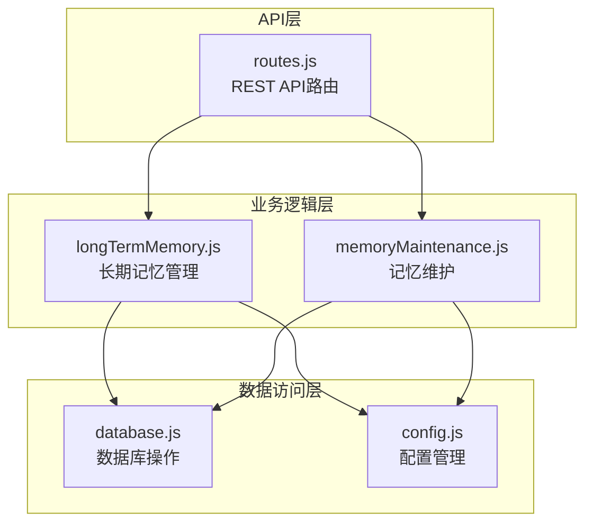
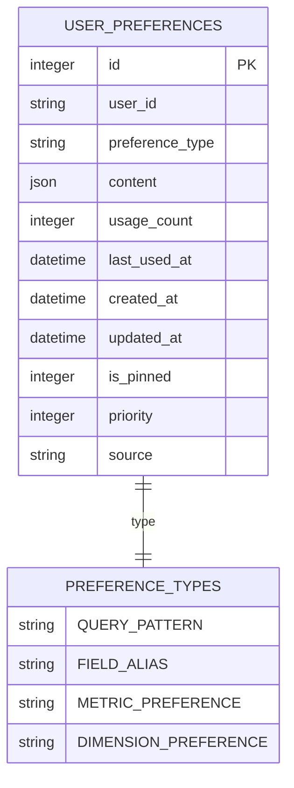
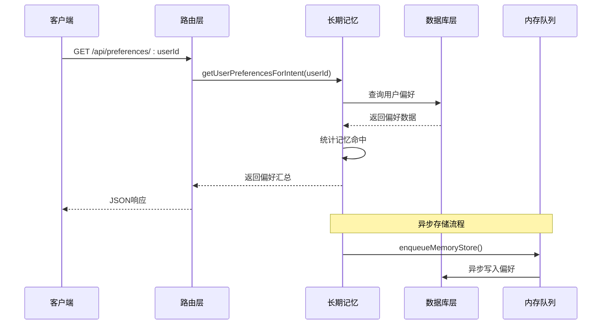
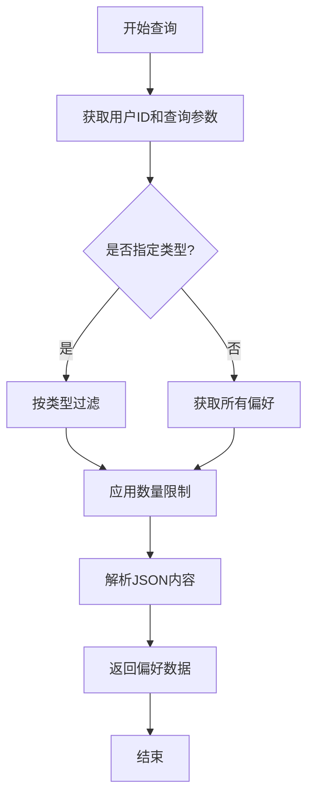
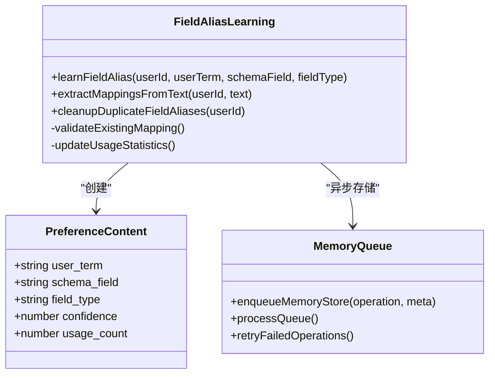
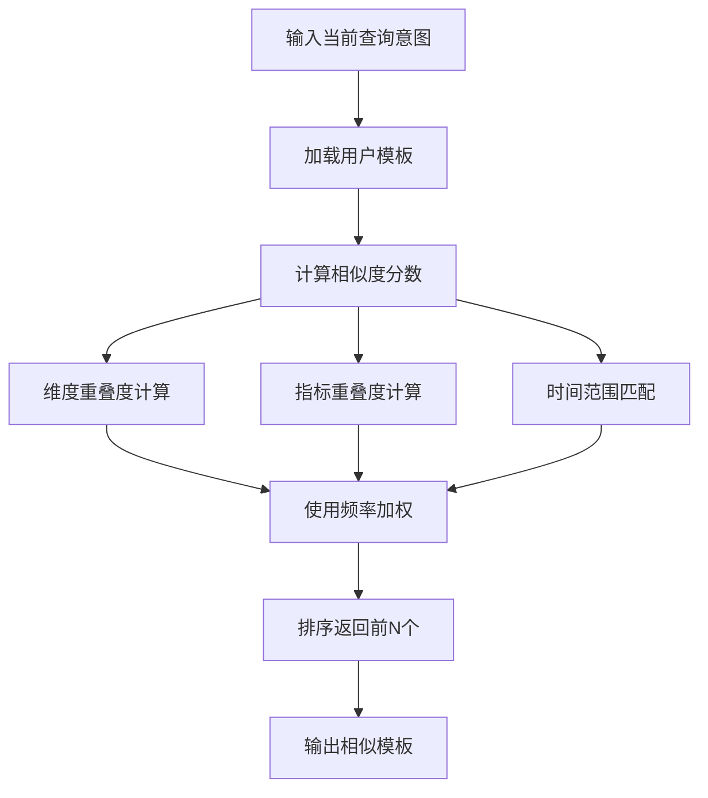
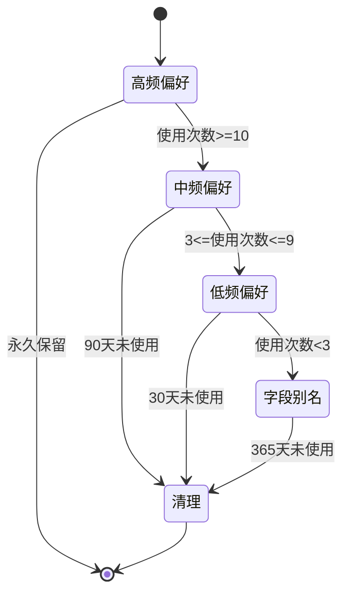
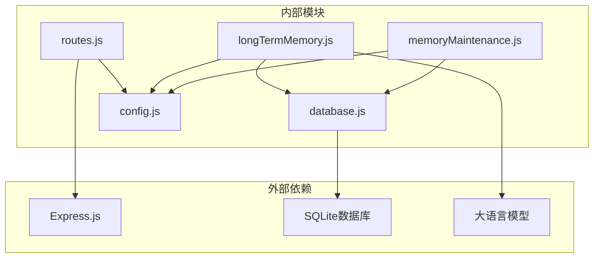
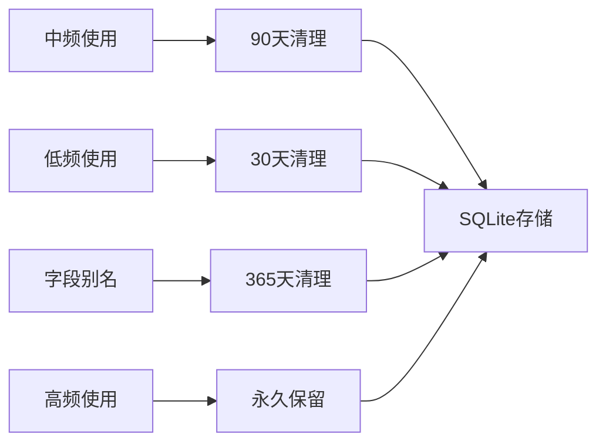

# 用户偏好接口

<cite>
**本文档引用的文件**
- [routes.js](file://backend/src/core/routes.js)
- [longTermMemory.js](file://backend/src/memory/longTermMemory.js)
- [memoryMaintenance.js](file://backend/src/memory/memoryMaintenance.js)
- [database.js](file://backend/src/core/database.js)
- [config.js](file://backend/src/core/config.js)
</cite>

## 目录
1. [简介](#简介)
2. [项目结构](#项目结构)
3. [核心组件](#核心组件)
4. [架构概览](#架构概览)
5. [详细组件分析](#详细组件分析)
6. [依赖关系分析](#依赖关系分析)
7. [性能考虑](#性能考虑)
8. [故障排除指南](#故障排除指南)
9. [结论](#结论)

## 简介

NL2SQL 系统的用户偏好接口是一套完整的长期记忆管理系统，旨在为用户提供个性化的查询体验。该系统通过学习和存储用户的查询习惯、字段别名、指标偏好和维度偏好，实现智能化的意图识别和查询优化。

系统支持四种主要的偏好类型：
- **查询模式（query_pattern）**：存储常用的查询模板和模式
- **字段别名（field_alias）**：记录用户术语与数据库字段的映射关系
- **指标偏好（metric_preference）**：保存用户常用的指标偏好
- **维度偏好（dimension_preference）**：记录用户偏好的维度组合

## 项目结构

用户偏好接口位于后端服务的核心路由模块中，采用模块化设计，与长期记忆管理和数据库层紧密集成。

**图表来源**
- [routes.js:458-718](file://backend/src/core/routes.js#L458-L718)
- [longTermMemory.js:1-1168](file://backend/src/memory/longTermMemory.js#L1-L1168)
- [memoryMaintenance.js:1-421](file://backend/src/memory/memoryMaintenance.js#L1-L421)

**章节来源**
- [routes.js:458-718](file://backend/src/core/routes.js#L458-L718)
- [longTermMemory.js:1-1168](file://backend/src/memory/longTermMemory.js#L1-L1168)

## 核心组件

### API路由定义

系统提供完整的REST API端点，涵盖用户偏好管理的各个方面：

| 端点 | 方法 | 功能描述 |
|------|------|----------|
| `/api/preferences/:userId` | GET | 获取用户偏好列表 |
| `/api/preferences/:userId/raw` | GET | 获取用户偏好原始数据 |
| `/api/preferences/:userId/stats` | GET | 获取用户记忆统计 |
| `/api/preferences/:userId/templates` | POST | 手动添加查询模板 |
| `/api/preferences/:userId/learn-alias` | POST | 手动学习字段别名 |
| `/api/preferences/:preferenceId` | DELETE | 删除用户偏好 |

### 偏好数据结构

系统使用统一的JSON格式存储偏好内容，支持灵活的数据扩展：

**图表来源**
- [database.js:160-179](file://backend/src/core/database.js#L160-L179)

**章节来源**
- [routes.js:458-718](file://backend/src/core/routes.js#L458-L718)
- [database.js:837-1004](file://backend/src/core/database.js#L837-L1004)

## 架构概览

用户偏好接口采用分层架构设计，确保功能分离和代码可维护性。

**图表来源**
- [routes.js:548-594](file://backend/src/core/routes.js#L548-L594)
- [longTermMemory.js:1004-1046](file://backend/src/memory/longTermMemory.js#L1004-L1046)

## 详细组件分析

### 用户偏好管理

#### 获取用户偏好列表

系统提供灵活的偏好查询接口，支持按类型筛选和数量限制：

**图表来源**
- [routes.js:555-594](file://backend/src/core/routes.js#L555-L594)
- [database.js:861-883](file://backend/src/core/database.js#L861-L883)

#### 字段别名学习机制

系统支持自动和手动两种字段别名学习方式：

**图表来源**
- [longTermMemory.js:773-853](file://backend/src/memory/longTermMemory.js#L773-L853)
- [longTermMemory.js:872-993](file://backend/src/memory/longTermMemory.js#L872-L993)

**章节来源**
- [longTermMemory.js:773-853](file://backend/src/memory/longTermMemory.js#L773-L853)
- [longTermMemory.js:872-993](file://backend/src/memory/longTermMemory.js#L872-L993)

### 查询模板管理

#### 手动模板存储

系统允许用户手动创建和管理查询模板，支持复杂的维度和指标组合：

| 模板字段 | 类型 | 描述 | 示例 |
|----------|------|------|------|
| name | string | 模板名称 | "每日销售报表" |
| dimensions | array | 维度列表 | ["日期", "地区"] |
| metrics | array | 指标列表 | ["销售额", "订单数"] |
| default_time_range | object | 默认时间范围 | `{type: "relative", value: "最近7天"}` |
| filter_pattern | array | 过滤条件模式 | `[{field: "status", op: "=", value: "active"}]` |
| is_manual | boolean | 标记手动创建 | true |

#### 模板相似度匹配

系统提供智能的模板相似度计算，帮助用户快速找到合适的查询模式：

**图表来源**
- [longTermMemory.js:1054-1097](file://backend/src/memory/longTermMemory.js#L1054-L1097)

**章节来源**
- [longTermMemory.js:1109-1133](file://backend/src/memory/longTermMemory.js#L1109-L1133)
- [longTermMemory.js:1054-1097](file://backend/src/memory/longTermMemory.js#L1054-L1097)

### 记忆统计与维护

#### 用户记忆统计

系统提供全面的记忆使用统计信息，帮助用户了解偏好使用情况：

| 统计指标 | 描述 | 计算方式 |
|----------|------|----------|
| total | 总偏好数量 | COUNT(*) |
| byType.count | 按类型分组数量 | GROUP BY preference_type |
| byType.avg_usage | 平均使用次数 | AVG(usage_count) |
| byType.max_usage | 最高使用次数 | MAX(usage_count) |
| byType.oldest_use | 最早使用时间 | MIN(last_used_at) |

#### 记忆清理策略

系统采用智能的分级清理策略，平衡存储效率和用户体验：

**图表来源**
- [memoryMaintenance.js:24-46](file://backend/src/memory/memoryMaintenance.js#L24-L46)
- [memoryMaintenance.js:69-195](file://backend/src/memory/memoryMaintenance.js#L69-L195)

**章节来源**
- [memoryMaintenance.js:326-355](file://backend/src/memory/memoryMaintenance.js#L326-L355)
- [memoryMaintenance.js:24-46](file://backend/src/memory/memoryMaintenance.js#L24-L46)

## 依赖关系分析

用户偏好接口的依赖关系清晰明确，遵循单一职责原则：

**图表来源**
- [routes.js:17-31](file://backend/src/core/routes.js#L17-L31)
- [longTermMemory.js:17-22](file://backend/src/memory/longTermMemory.js#L17-L22)

### 核心依赖关系

| 模块 | 主要依赖 | 用途 |
|------|----------|------|
| routes.js | express, logger, config | HTTP路由处理 |
| longTermMemory.js | database, llmService, config | 长期记忆管理 |
| memoryMaintenance.js | database, config | 记忆维护和清理 |
| database.js | sqlite3, config | 数据库操作封装 |
| config.js | process.env | 配置管理 |

**章节来源**
- [routes.js:17-31](file://backend/src/core/routes.js#L17-L31)
- [longTermMemory.js:17-22](file://backend/src/memory/longTermMemory.js#L17-L22)

## 性能考虑

### 查询优化

系统采用多种优化策略确保高性能：

1. **索引优化**：为 `user_id` 和 `preference_type` 创建复合索引
2. **查询缓存**：使用内存队列异步处理存储操作
3. **批量处理**：支持批量删除重复字段别名记录
4. **智能清理**：定期清理低使用率的偏好记录

### 存储策略

**图表来源**
- [memoryMaintenance.js:24-46](file://backend/src/memory/memoryMaintenance.js#L24-L46)

## 故障排除指南

### 常见问题及解决方案

| 问题类型 | 症状 | 可能原因 | 解决方案 |
|----------|------|----------|----------|
| API调用失败 | 500错误 | 数据库连接问题 | 检查数据库配置和连接状态 |
| 偏好未生效 | 查询结果不符合预期 | 偏好存储失败 | 验证偏好内容格式和存储状态 |
| 性能下降 | 响应时间变长 | 记忆数据过多 | 执行记忆清理操作 |
| LLM集成失败 | 字段别名学习失败 | API密钥配置错误 | 检查LLM配置和API密钥 |

### 调试工具

系统提供多种调试接口：

1. **原始数据查看**：`GET /api/preferences/:userId/raw`
2. **统计信息**：`GET /api/preferences/:userId/stats`
3. **内存队列状态**：检查 `memory_failed_queue` 表

**章节来源**
- [routes.js:458-545](file://backend/src/core/routes.js#L458-L545)
- [database.js:1300-1348](file://backend/src/core/database.js#L1300-L1348)

## 结论

NL2SQL系统的用户偏好接口提供了一个完整、高效、可扩展的长期记忆管理解决方案。通过智能的学习算法、灵活的API设计和完善的维护机制，系统能够显著提升用户的查询体验和系统性能。

关键优势包括：
- **智能化学习**：支持自动和手动两种学习方式
- **灵活的API设计**：提供完整的CRUD操作接口
- **高效的存储策略**：智能的分级保留和清理机制
- **强大的扩展性**：模块化设计便于功能扩展和维护

该系统为构建下一代智能查询系统奠定了坚实的技术基础，能够有效提升用户的工作效率和满意度。