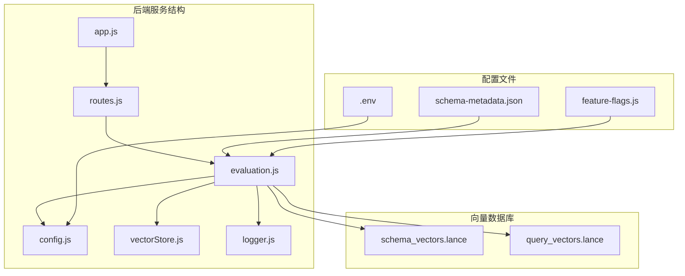
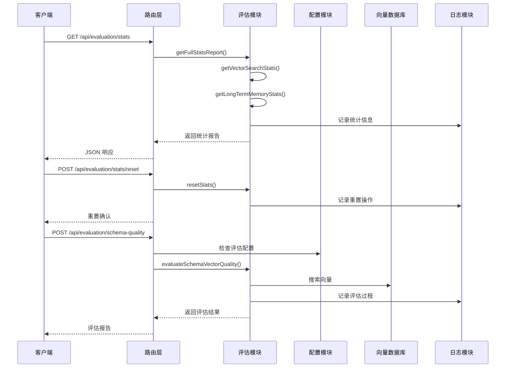
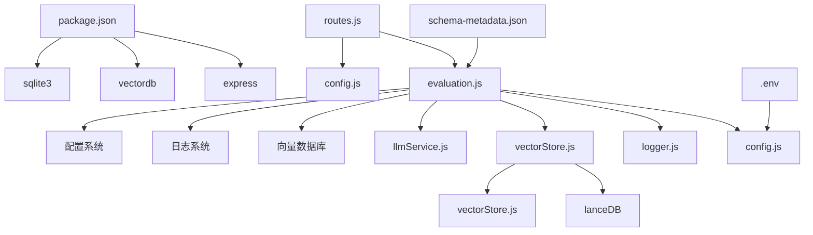

# 评估统计接口

<cite>
**本文档引用的文件**
- [evaluation.js](file://backend/src/utils/evaluation.js)
- [routes.js](file://backend/src/core/routes.js)
- [config.js](file://backend/src/core/config.js)
- [vectorStore.js](file://backend/src/memory/vectorStore.js)
- [package.json](file://backend/package.json)
</cite>

## 目录
1. [简介](#简介)
2. [项目结构](#项目结构)
3. [核心组件](#核心组件)
4. [架构概览](#架构概览)
5. [详细组件分析](#详细组件分析)
6. [依赖关系分析](#依赖关系分析)
7. [性能考虑](#性能考虑)
8. [故障排除指南](#故障排除指南)
9. [结论](#结论)

## 简介

NL2SQL 系统的评估统计接口是一套完整的监控和质量保证工具，旨在帮助开发者和运维人员了解系统的运行状况和向量化质量。该接口提供了三个主要端点：`/api/evaluation/stats`（运行时统计）、`/api/evaluation/stats/reset`（统计数据重置）和 `/api/evaluation/schema-quality`（Schema 向量化质量评估）。

这套接口的设计遵循非侵入式原则，不会影响主业务流程的正常运行，同时提供了详细的统计信息和质量评估报告，帮助团队持续改进系统的性能和准确性。

## 项目结构

NL2SQL 评估统计接口位于后端服务的特定模块中，采用模块化设计，便于维护和扩展。



**图表来源**
- [routes.js:720-843](file://backend/src/core/routes.js#L720-L843)
- [evaluation.js:1-50](file://backend/src/utils/evaluation.js#L1-L50)

**章节来源**
- [routes.js:1-100](file://backend/src/core/routes.js#L1-L100)
- [evaluation.js:1-50](file://backend/src/utils/evaluation.js#L1-L50)

## 核心组件

评估统计接口由多个核心组件构成，每个组件都有明确的职责和功能：

### 1. 评估配置模块
负责管理评估功能的全局配置，包括功能开关、统计跟踪和阈值设置。

### 2. 运行时统计模块
维护内存中的实时统计数据，包括向量检索命中率和长期记忆命中率。

### 3. 质量评估模块
提供向量化质量评估功能，支持 Schema 向量和查询历史向量的质量检测。

### 4. API 路由模块
定义和实现 RESTful API 端点，提供对外的评估接口。

**章节来源**
- [evaluation.js:19-31](file://backend/src/utils/evaluation.js#L19-L31)
- [evaluation.js:37-60](file://backend/src/utils/evaluation.js#L37-L60)
- [routes.js:720-843](file://backend/src/core/routes.js#L720-L843)

## 架构概览

评估统计接口采用分层架构设计，确保功能的模块化和可维护性。



**图表来源**
- [routes.js:728-805](file://backend/src/core/routes.js#L728-L805)
- [evaluation.js:397-429](file://backend/src/utils/evaluation.js#L397-L429)

## 详细组件分析

### 运行时统计接口

运行时统计接口提供实时的系统性能监控，包括向量检索命中率和长期记忆命中率。

#### 统计指标说明

| 指标类别 | 具体指标 | 描述 | 计算公式 |
|---------|---------|------|---------|
| 向量检索统计 | schema.searches | Schema 向量搜索总数 | 直接计数 |
| | schema.hits | Schema 向量搜索命中数 | 直接计数 |
| | schema.hitRate | Schema 向量搜索命中率 | hits/searches × 100% |
| | query.searches | 查询向量搜索总数 | 直接计数 |
| | query.hits | 查询向量搜索命中数 | 直接计数 |
| | query.hitRate | 查询向量搜索命中率 | hits/searches × 100% |
| | distanceDistribution.veryClose | 距离分布：非常接近 (<0.3) | 直接计数 |
| | distanceDistribution.close | 距离分布：接近 (0.3-0.5) | 直接计数 |
| | distanceDistribution.moderate | 距离分布：中等 (0.5-0.7) | 直接计数 |
| | distanceDistribution.far | 距离分布：较远 (>0.7) | 直接计数 |
| 长期记忆统计 | overall.hitRate | 总体记忆命中率 | totalHits/totalQueries × 100% |
| | overall.totalQueries | 总查询数 | 直接计数 |
| | overall.totalHits | 总命中数 | 直接计数 |
| | overall.totalMisses | 总未命中数 | totalQueries - totalHits |
| | byType.type | 记忆类型 | 类型标识（field_alias, query_pattern等） |
| | byType.hitRate | 类型命中率 | hits/(hits+misses) × 100% |
| | byType.hits | 类型命中数 | 直接计数 |
| | byType.misses | 类型未命中数 | 直接计数 |

#### API 规范

**GET /api/evaluation/stats**
- 功能：获取完整的运行时统计报告
- 请求头：无特殊要求
- 响应体：包含向量检索统计、长期记忆统计和配置信息
- 成功状态码：200
- 错误状态码：500（内部服务器错误）

**POST /api/evaluation/stats/reset**
- 功能：重置所有统计数据
- 请求头：无特殊要求
- 响应体：重置确认信息
- 成功状态码：200
- 错误状态码：500（内部服务器错误）

**章节来源**
- [routes.js:728-762](file://backend/src/core/routes.js#L728-L762)
- [evaluation.js:344-429](file://backend/src/utils/evaluation.js#L344-L429)

### Schema 向量化质量评估接口

Schema 向量化质量评估接口用于检测和评估系统对数据库 Schema 的向量化理解能力。

#### 评估方法

评估过程采用以下步骤：

1. **查询向量生成**：使用 LLM 服务为测试查询生成嵌入向量
2. **智能搜索**：通过向量存储执行智能搜索，包含查询意图识别和重排序
3. **结果提取**：从表级向量元数据中提取表名
4. **质量评估**：计算精确率、召回率和 F1 分数
5. **结果分类**：根据召回率阈值将结果分为正确、部分正确和错误三类

#### 评估指标

| 指标 | 描述 | 计算公式 | 评估标准 |
|------|------|----------|----------|
| 精确率 (Precision) | 检索到的正确表数 / 检索到的表总数 | TP / (TP + FP) | 数值越高越好 |
| 召回率 (Recall) | 检索到的正确表数 / 实际期望表总数 | TP / (TP + FN) | 数值越高越好 |
| F1 分数 | 精确率和召回率的调和平均数 | 2 × Precision × Recall / (Precision + Recall) | 数值越高越好 |
| 准确率 (Accuracy) | 正确分类的查询数 / 总查询数 | 正确数 / 总数 | 数值越高越好 |
| 平均精确率 | 所有查询的精确率平均值 | ΣPrecision / n | 数值越高越好 |
| 平均召回率 | 所有查询的召回率平均值 | ΣRecall / n | 数值越高越好 |
| 平均 F1 分数 | 所有查询的 F1 分数平均值 | ΣF1 / n | 数值越高越好 |

#### API 规范

**POST /api/evaluation/schema-quality**
- 功能：执行 Schema 向量化质量评估
- 请求体：可选的测试查询数组，若省略则使用默认测试集
- 响应体：包含评估统计、详细结果和整体指标
- 成功状态码：200
- 错误状态码：403（功能未启用）、500（内部服务器错误）

**请求体示例**
```json
{
  "testQueries": [
    {
      "query": "昨天渠道520的新注册用户有多少",
      "expectedTables": ["tzpingtai_tz_sdk_log_pf_reg"]
    }
  ]
}
```

**响应体示例**
```json
{
  "success": true,
  "data": {
    "total": 8,
    "correct": 6,
    "partial": 2,
    "incorrect": 0,
    "accuracy": 0.75,
    "avgPrecision": 0.85,
    "avgRecall": 0.82,
    "avgF1": 0.83,
    "details": [
      {
        "query": "昨天渠道520的新注册用户有多少",
        "expected": ["tzpingtai_tz_sdk_log_pf_reg"],
        "retrieved": ["tzpingtai_tz_sdk_log_pf_reg"],
        "precision": 1.0,
        "recall": 1.0,
        "f1Score": 1.0,
        "top1Correct": true
      }
    ]
  }
}
```

**章节来源**
- [routes.js:773-805](file://backend/src/core/routes.js#L773-L805)
- [evaluation.js:158-266](file://backend/src/utils/evaluation.js#L158-L266)

### 查询历史向量化质量评估接口

查询历史向量化质量评估接口用于检测相似查询的向量化表示能力。

#### 评估方法

该接口通过计算查询对之间的余弦相似度来评估向量化质量：

1. **向量生成**：为查询对中的两个查询分别生成嵌入向量
2. **相似度计算**：使用余弦相似度公式计算两个向量的相似度
3. **误差计算**：比较计算得到的相似度与预期相似度的差异
4. **统计分析**：计算平均误差和相似度分布

#### 评估指标

| 指标 | 描述 | 计算公式 | 评估标准 |
|------|------|----------|----------|
| 高相似度查询对 | 两个查询高度相似的对数 | 相似度 > 高相似度阈值 | 数值越高越好 |
| 中相似度查询对 | 两个查询中度相似的对数 | 阈值1 < 相似度 ≤ 阈值2 | 数值越高越好 |
| 低相似度查询对 | 两个查询低度相似的对数 | 相似度 ≤ 阈值1 | 数值越高越好 |
| 平均误差 | 所有查询对实际相似度与预期相似度差值的平均值 | Σ|实际-预期| / n | 数值越低越好 |

#### API 规范

**POST /api/evaluation/query-quality**
- 功能：执行查询历史向量化质量评估
- 请求体：可选的查询对数组，若省略则使用默认测试集
- 响应体：包含相似度分布统计和详细结果
- 成功状态码：200
- 错误状态码：403（功能未启用）、500（内部服务器错误）

**请求体示例**
```json
{
  "testPairs": [
    {
      "query1": "昨天收入多少",
      "query2": "昨日的营收数据",
      "expectedSimilarity": 0.9
    }
  ]
}
```

**响应体示例**
```json
{
  "success": true,
  "data": {
    "total": 5,
    "highSimilarity": 3,
    "mediumSimilarity": 1,
    "lowSimilarity": 1,
    "avgError": 0.05,
    "details": [
      {
        "query1": "昨天收入多少",
        "query2": "昨日的营收数据",
        "expectedSimilarity": 0.9,
        "actualSimilarity": 0.92,
        "error": 0.02
      }
    ]
  }
}
```

**章节来源**
- [routes.js:816-843](file://backend/src/core/routes.js#L816-L843)
- [evaluation.js:276-334](file://backend/src/utils/evaluation.js#L276-L334)

### 评估配置接口

评估配置接口允许动态获取和管理评估相关的配置信息。

#### 配置选项

| 配置项 | 类型 | 默认值 | 描述 |
|--------|------|--------|------|
| EVALUATION_ENABLED | boolean | false | 是否启用评估功能 |
| EVALUATION_TRACK_STATS | boolean | false | 是否记录运行时统计 |
| HIGH_SIMILARITY_THRESHOLD | number | 0.8 | 高相似度阈值 |
| MEDIUM_SIMILARITY_THRESHOLD | number | 0.5 | 中相似度阈值 |
| HIGH_QUALITY_THRESHOLD | number | 0.8 | 高质量评估阈值 |
| MEDIUM_QUALITY_THRESHOLD | number | 0.5 | 中等质量评估阈值 |

#### API 规范

**GET /api/evaluation/config**
- 功能：获取评估配置信息
- 请求头：无特殊要求
- 响应体：包含当前的评估配置状态
- 成功状态码：200

**章节来源**
- [routes.js:849-852](file://backend/src/core/routes.js#L849-L852)
- [config.js:383-395](file://backend/src/core/config.js#L383-L395)

## 依赖关系分析

评估统计接口涉及多个模块和外部依赖，形成了复杂的依赖关系网络。



**图表来源**
- [evaluation.js:12-13](file://backend/src/utils/evaluation.js#L12-L13)
- [routes.js:28-29](file://backend/src/core/routes.js#L28-L29)
- [package.json:16-27](file://backend/package.json#L16-L27)

### 外部依赖

评估接口依赖以下外部组件：

1. **向量数据库**：使用 LanceDB 作为底层存储，支持高效的向量相似度搜索
2. **LLM 服务**：提供文本嵌入生成功能，用于向量化查询和 Schema
3. **日志系统**：记录评估过程和统计信息
4. **配置系统**：管理评估功能的运行时配置

### 内部依赖

评估接口内部依赖关系清晰，模块职责明确：

1. **路由层**：处理 HTTP 请求和响应
2. **评估模块**：核心业务逻辑实现
3. **配置模块**：提供运行时配置管理
4. **向量存储模块**：处理向量数据的存储和检索

**章节来源**
- [evaluation.js:12-13](file://backend/src/utils/evaluation.js#L12-L13)
- [routes.js:28-29](file://backend/src/core/routes.js#L28-L29)
- [package.json:16-27](file://backend/package.json#L16-L27)

## 性能考虑

评估统计接口在设计时充分考虑了性能影响，采用了多种优化策略：

### 1. 非侵入式设计
- 统计记录采用轻量级实现，失败时静默处理，不影响主业务流程
- 评估功能默认关闭，需要显式启用
- 统计跟踪可选择性开启，避免不必要的性能开销

### 2. 内存优化
- 运行时统计数据存储在内存中，避免频繁的磁盘 I/O 操作
- 使用简单数据结构存储统计信息，减少内存占用
- 提供统计数据重置功能，防止内存泄漏

### 3. 异步处理
- 质量评估使用异步操作，避免阻塞主线程
- 向量搜索和 LLM 调用采用并发处理，提高效率
- 日志记录采用异步方式，不影响请求响应时间

### 4. 缓存策略
- 配置信息缓存，减少重复读取
- 向量搜索结果可以利用缓存机制
- 评估结果可以进行适当的缓存

## 故障排除指南

### 常见问题及解决方案

#### 1. 评估功能未启用
**症状**：调用评估接口返回 403 状态码
**原因**：EVALUATION_ENABLED 环境变量未设置为 true
**解决方案**：
```bash
export EVALUATION_ENABLED=true
export EVALUATION_TRACK_STATS=true
```

#### 2. 向量数据库连接失败
**症状**：评估过程中出现向量数据库相关错误
**原因**：向量数据库路径配置错误或数据库未初始化
**解决方案**：
```javascript
// 检查向量数据库配置
console.log('Vector DB Path:', process.env.VECTOR_DB_PATH);

// 确保向量数据库已初始化
await vectorStore.initialize();
```

#### 3. LLM API 调用超时
**症状**：评估过程中 LLM API 调用超时
**原因**：网络延迟或 LLM 服务不可用
**解决方案**：
```javascript
// 增加 LLM 超时时间
process.env.LLM_TIMEOUT = 120000;

// 检查 LLM API 密钥配置
console.log('LLM API Key:', process.env.LLM_API_KEY);
```

#### 4. 统计数据异常
**症状**：统计数据不准确或出现负值
**原因**：统计逻辑错误或并发访问问题
**解决方案**：
```javascript
// 检查统计重置逻辑
evaluation.resetStats();

// 验证统计数据一致性
console.log('Vector Search Stats:', evaluation.getVectorSearchStats());
```

### 调试技巧

1. **启用详细日志**：设置 LOG_LEVEL=debug 查看详细的评估过程
2. **检查配置**：使用 GET /api/evaluation/config 端点验证配置状态
3. **单元测试**：运行评估相关的测试用例验证功能正常
4. **性能监控**：监控评估接口的响应时间和资源使用情况

**章节来源**
- [routes.js:775-780](file://backend/src/core/routes.js#L775-L780)
- [evaluation.js:412-429](file://backend/src/utils/evaluation.js#L412-L429)

## 结论

NL2SQL 系统的评估统计接口提供了一套完整、可靠的监控和质量保证工具。通过运行时统计、向量化质量评估和配置管理，该接口能够帮助团队：

1. **实时监控系统性能**：通过运行时统计了解系统的实际表现
2. **持续改进质量**：通过质量评估发现向量化过程中的问题
3. **优化资源配置**：通过统计数据指导系统优化方向
4. **保障服务质量**：通过配置管理确保评估功能的正确启用

该接口的设计遵循了非侵入式原则，不会影响主业务流程的正常运行，同时提供了丰富的统计信息和质量评估报告。建议团队定期使用这些接口来监控系统状态，及时发现问题并进行优化。

通过合理配置和使用这些评估接口，NL2SQL 系统能够持续提升其自然语言到 SQL 的转换质量和用户体验。