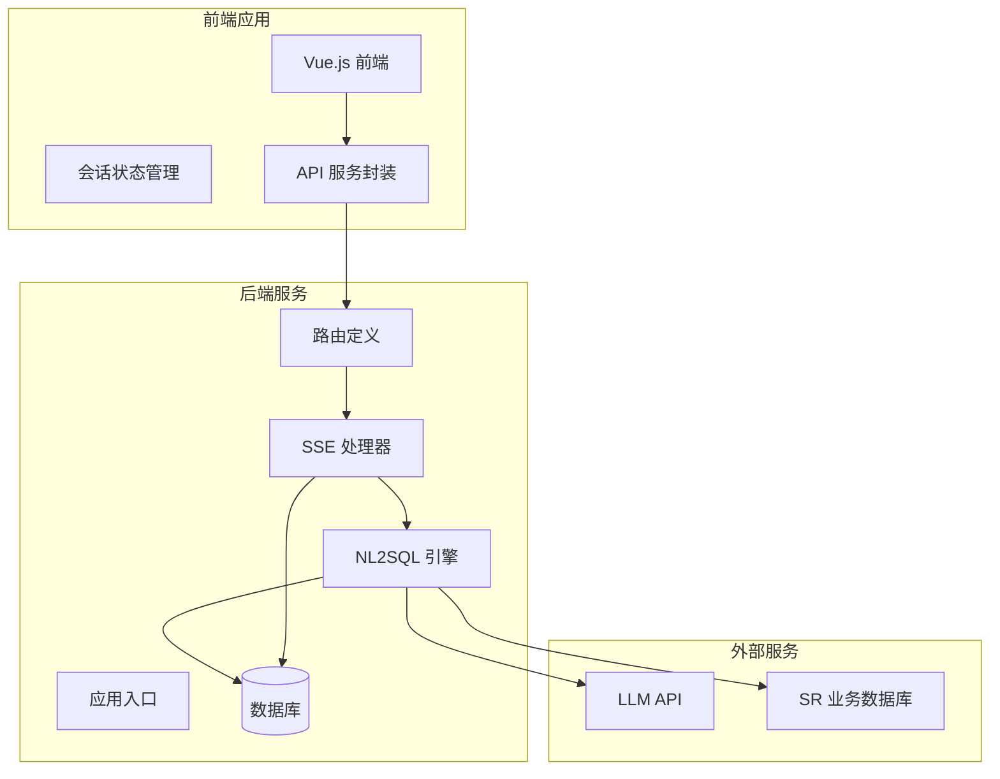
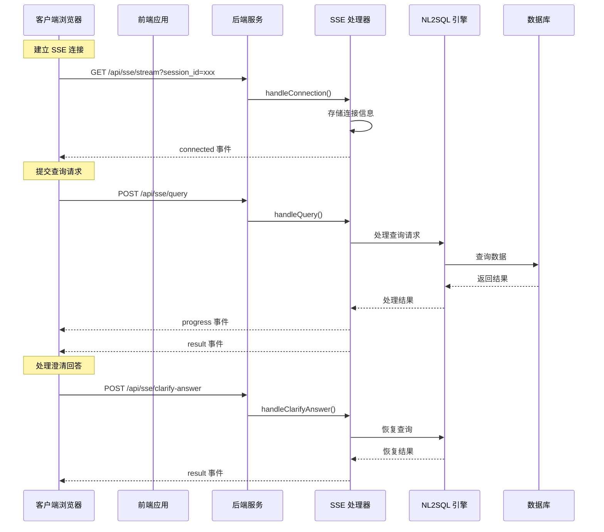
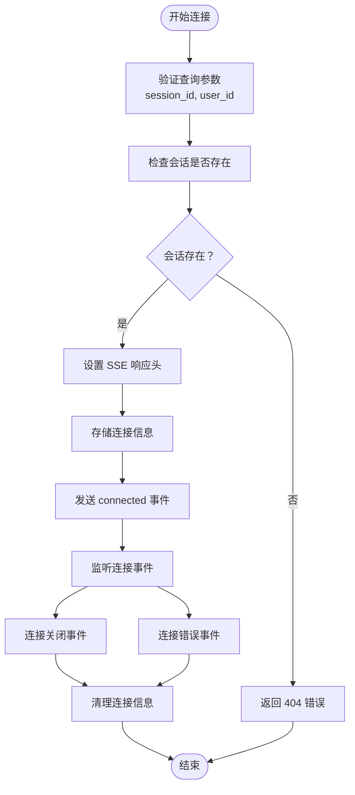
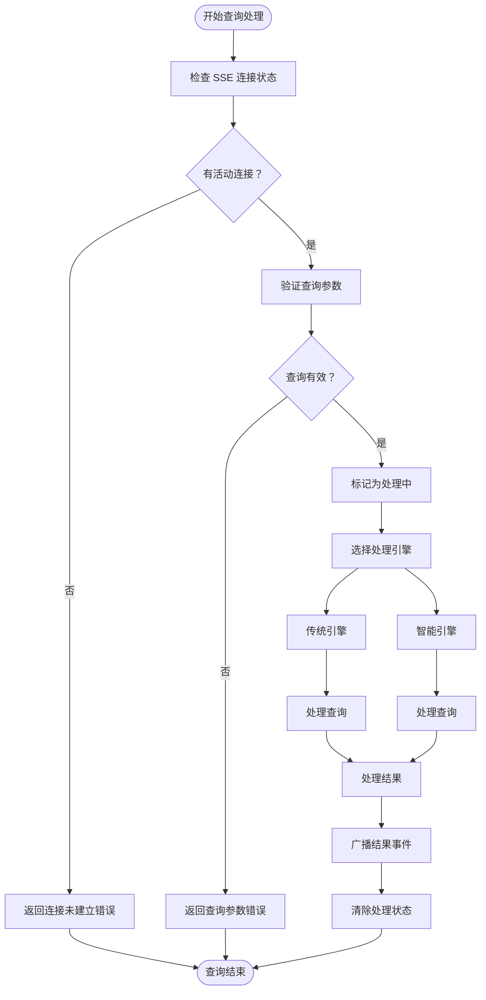
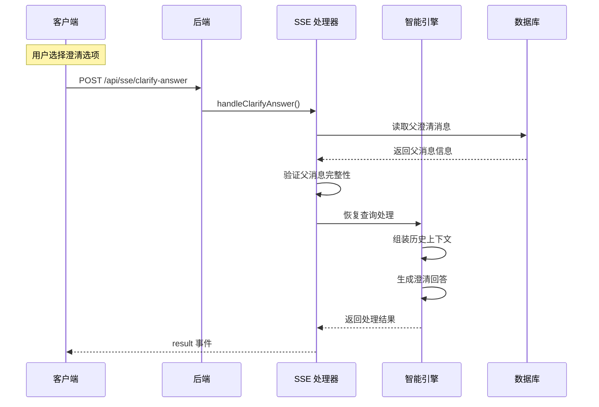
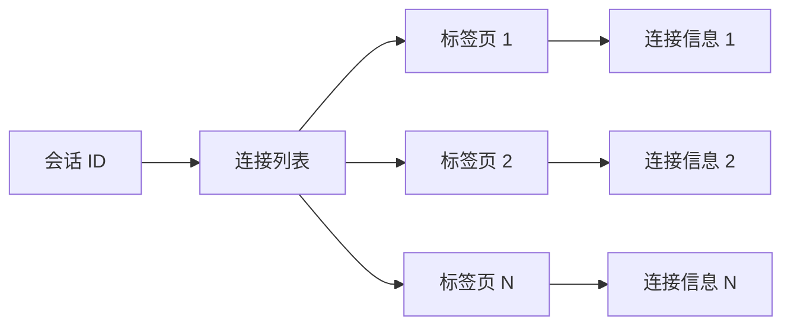
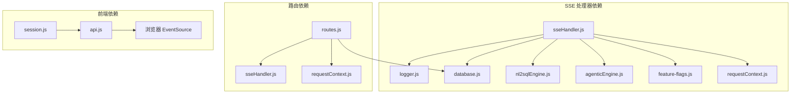

# SSE 流式通信接口

<cite>
**本文档引用的文件**
- [sseHandler.js](file://backend/src/core/sseHandler.js)
- [routes.js](file://backend/src/core/routes.js)
- [app.js](file://backend/src/app.js)
- [session.js](file://frontend/src/stores/session.js)
- [api.js](file://frontend/src/utils/api.js)
- [test-sse-error-feedback.js](file://backend/test/phase1/test-sse-error-feedback.js)
- [sse-clarify-answer-route.test.js](file://backend/test/phase3/sse-clarify-answer-route.test.js)
</cite>

## 目录
1. [简介](#简介)
2. [项目结构](#项目结构)
3. [核心组件](#核心组件)
4. [架构概览](#架构概览)
5. [详细组件分析](#详细组件分析)
6. [依赖关系分析](#依赖关系分析)
7. [性能考虑](#性能考虑)
8. [故障排除指南](#故障排除指南)
9. [结论](#结论)
10. [附录](#附录)

## 简介

NL2SQL 系统的 SSE（Server-Sent Events）流式通信接口是一个关键的实时通信组件，它为自然语言到 SQL 查询的转换过程提供了高效的流式数据传输能力。该接口支持多标签页并发连接、实时进度反馈、错误处理和自动重连机制。

SSE 接口主要包含两个核心端点：
- `/api/sse/stream` - 建立长连接的 SSE 连接端点
- `/api/sse/query` - 通过 HTTP POST 发送查询请求，结果通过 SSE 推送

## 项目结构

NL2SQL 系统采用前后端分离的架构设计，SSE 接口位于后端核心模块中，前端通过 Vue.js 应用进行集成。



**图表来源**
- [app.js:190-196](file://backend/src/app.js#L190-L196)
- [routes.js:950-1064](file://backend/src/core/routes.js#L950-L1064)

**章节来源**
- [app.js:1-279](file://backend/src/app.js#L1-L279)
- [routes.js:1-1099](file://backend/src/core/routes.js#L1-L1099)

## 核心组件

### SSE 处理器模块

SSE 处理器是整个流式通信系统的核心，负责管理连接生命周期、处理查询请求和广播消息。

#### 主要功能特性

1. **连接管理**
   - 支持多标签页并发连接
   - 会话级别的连接映射
   - 连接状态跟踪和清理

2. **消息协议**
   - 统一的事件格式
   - 实时进度回调
   - 错误处理和恢复

3. **查询处理**
   - 引擎选择和回退机制
   - 澄清回答处理
   - 消息持久化

**章节来源**
- [sseHandler.js:1-688](file://backend/src/core/sseHandler.js#L1-L688)

### 路由定义模块

路由模块定义了所有 API 端点，包括 SSE 相关的三个核心接口。

#### SSE 端点定义

1. **GET /api/sse/stream**
   - 建立 SSE 连接
   - 参数验证和会话检查
   - 连接生命周期管理

2. **POST /api/sse/query**
   - 提交查询请求
   - 异步处理和错误兜底
   - 会话标题自动更新

3. **POST /api/sse/clarify-answer**
   - 处理澄清回答
   - 父消息验证和恢复
   - 接续查询生成

**章节来源**
- [routes.js:950-1064](file://backend/src/core/routes.js#L950-L1064)

### 前端集成模块

前端通过 Vue.js 和 Pinia 状态管理实现 SSE 集成，提供完整的用户交互体验。

#### 前端功能特性

1. **SSE 连接管理**
   - EventSource 实现
   - 连接状态跟踪
   - 自动重连机制

2. **消息处理**
   - 事件类型解析
   - 实时界面更新
   - 错误状态显示

3. **用户交互**
   - 查询提交
   - 澄清回答
   - 进度反馈

**章节来源**
- [session.js:185-383](file://frontend/src/stores/session.js#L185-L383)
- [api.js:246-268](file://frontend/src/utils/api.js#L246-L268)

## 架构概览

SSE 接口采用事件驱动的架构模式，实现了高效的双向通信机制。



**图表来源**
- [routes.js:950-1064](file://backend/src/core/routes.js#L950-L1064)
- [sseHandler.js:258-410](file://backend/src/core/sseHandler.js#L258-L410)

## 详细组件分析

### SSE 连接建立流程

SSE 连接建立是整个流式通信的基础，涉及多个步骤的验证和初始化。



**图表来源**
- [sseHandler.js:49-120](file://backend/src/core/sseHandler.js#L49-L120)

#### 连接参数规范

| 参数名 | 必需 | 类型 | 默认值 | 描述 |
|--------|------|------|--------|------|
| session_id | 是 | string | - | 会话标识符 |
| user_id | 否 | string | anonymous | 用户标识符 |

#### 响应头配置

SSE 连接使用特定的 HTTP 响应头来确保正确的流式传输：

- `Content-Type: text/event-stream`
- `Cache-Control: no-cache`
- `Connection: keep-alive`
- `X-Accel-Buffering: no`

**章节来源**
- [sseHandler.js:49-120](file://backend/src/core/sseHandler.js#L49-L120)

### 消息协议和事件类型

SSE 接口定义了标准化的消息格式和多种事件类型，确保客户端能够正确解析和处理各种状态变化。

#### 事件类型定义

| 事件类型 | 数据结构 | 描述 | 使用场景 |
|----------|----------|------|----------|
| connected | `{ session_id, message }` | 连接建立确认 | 初始连接成功 |
| processing | `{ message }` | 开始处理通知 | 查询开始处理 |
| progress | `{ message, stage, progress }` | 进度更新 | 处理阶段反馈 |
| result | `{ type, sql, data, message, explanation }` | 查询结果 | 处理完成 |
| error | `{ message }` | 错误信息 | 异常处理 |

#### 消息格式规范

所有消息都遵循统一的 JSON 格式，通过 `data:` 前缀进行 SSE 包装：

```javascript
// 示例消息格式
data: {
  "type": "progress",
  "data": {
    "message": "正在分析查询意图",
    "stage": "intent_analysis",
    "progress": 25
  }
}
```

**章节来源**
- [sseHandler.js:174-198](file://backend/src/core/sseHandler.js#L174-L198)
- [session.js:227-304](file://frontend/src/stores/session.js#L227-L304)

### 查询处理流程

查询处理是 SSE 接口的核心功能，支持两种主要的查询模式：标准查询和澄清回答查询。



**图表来源**
- [sseHandler.js:258-410](file://backend/src/core/sseHandler.js#L258-L410)

#### 引擎选择策略

系统支持两种处理引擎，根据功能开关动态选择：

1. **传统引擎 (Legacy)**: 稳定可靠的查询处理
2. **智能引擎 (Agentic)**: 增强的查询理解和澄清能力

**章节来源**
- [sseHandler.js:328-381](file://backend/src/core/sseHandler.js#L328-L381)

### 澄清回答处理

澄清回答功能是 NL2SQL 系统的重要特性，允许用户对查询进行细化和修正。



**图表来源**
- [sseHandler.js:511-615](file://backend/src/core/sseHandler.js#L511-L615)

#### 澄清处理流程

1. **父消息验证**: 确保父澄清消息包含完整的元数据
2. **历史组装**: 组装查询历史上下文
3. **恢复处理**: 使用智能引擎恢复查询生成
4. **结果广播**: 将处理结果通过 SSE 推送给客户端

**章节来源**
- [sseHandler.js:511-615](file://backend/src/core/sseHandler.js#L511-L615)

### 多标签页支持和并发连接管理

SSE 接口支持多标签页并发连接，通过会话 ID 进行连接分组管理。

#### 连接映射结构



**图表来源**
- [sseHandler.js:36](file://backend/src/core/sseHandler.js#L36)

#### 广播机制

当有多个标签页连接到同一会话时，系统会自动将消息广播到所有连接：

- `broadcastToSession()`: 广播到指定会话的所有连接
- `sendMessage()`: 发送到单个连接
- `pushError()`: 推送错误消息到会话

**章节来源**
- [sseHandler.js:206-242](file://backend/src/core/sseHandler.js#L206-L242)

## 依赖关系分析

SSE 接口的依赖关系相对简洁，主要依赖于核心模块和外部服务。



**图表来源**
- [sseHandler.js:15-26](file://backend/src/core/sseHandler.js#L15-L26)
- [routes.js:16-31](file://backend/src/core/routes.js#L16-L31)

### 外部依赖

SSE 接口依赖以下外部服务：

1. **LLM API**: 用于智能查询处理
2. **SR 业务数据库**: 用于实际的 SQL 查询执行
3. **SQLite 数据库**: 用于会话和消息持久化

**章节来源**
- [app.js:44-52](file://backend/src/app.js#L44-L52)

## 性能考虑

SSE 接口在设计时充分考虑了性能优化，采用了多种策略来确保高效的实时通信。

### 连接池管理

- **连接复用**: 同一会话的多个标签页共享同一个会话连接
- **内存优化**: 使用 Map 数据结构进行连接映射
- **自动清理**: 连接关闭时自动清理内存占用

### 消息优化

- **增量更新**: 只发送必要的进度信息
- **压缩传输**: 减少网络带宽占用
- **批量处理**: 合并相似的进度更新

### 错误处理优化

- **静默降级**: 无连接时的错误处理不会影响系统稳定性
- **快速失败**: 及时发现和处理连接问题
- **重试机制**: 自动重连和错误恢复

## 故障排除指南

### 常见问题和解决方案

#### 连接建立失败

**问题症状**: 客户端无法建立 SSE 连接

**可能原因**:
1. 缺少 `session_id` 参数
2. 会话不存在
3. 服务器配置问题

**解决步骤**:
1. 验证会话 ID 是否正确传递
2. 检查会话是否存在于数据库中
3. 查看服务器日志获取详细错误信息

#### 查询提交错误

**问题症状**: POST /api/sse/query 返回 409 冲突错误

**错误信息**: "SSE 连接未建立，请先建立 /api/sse/stream 长连接再提交查询"

**解决方法**:
1. 确保先建立 SSE 连接
2. 检查连接状态是否为 OPEN
3. 实现自动重连机制

#### 澄清回答处理失败

**问题症状**: 澄清回答提交后无响应

**可能原因**:
1. 父消息不存在或损坏
2. 父消息元数据不完整
3. 连接状态异常

**诊断步骤**:
1. 验证父消息 ID 是否正确
2. 检查消息类型是否为 clarification
3. 确认元数据包含 decomposition 和 originalQuery 字段

**章节来源**
- [routes.js:986-991](file://backend/src/core/routes.js#L986-L991)
- [routes.js:1042-1047](file://backend/src/core/routes.js#L1042-L1047)

### 调试工具使用

#### 后端调试

1. **健康检查**: 访问 `/api/health/detail` 获取详细组件状态
2. **连接统计**: 使用 `getConnectionCount()` 获取活跃连接数
3. **日志分析**: 查看服务器日志中的 SSE 相关信息

#### 前端调试

1. **浏览器开发者工具**: 监控 Network 标签页中的 SSE 连接
2. **控制台日志**: 查看 SSE 事件处理日志
3. **状态检查**: 验证连接状态和消息队列

**章节来源**
- [routes.js:102-139](file://backend/src/core/routes.js#L102-L139)
- [session.js:198-221](file://frontend/src/stores/session.js#L198-L221)

## 结论

NL2SQL 系统的 SSE 流式通信接口是一个设计精良的实时通信解决方案，具有以下显著特点：

1. **高可靠性**: 完善的错误处理和自动重连机制
2. **高性能**: 多标签页并发支持和优化的连接管理
3. **易集成**: 标准化的消息协议和清晰的 API 设计
4. **可扩展**: 支持多种查询模式和引擎选择

该接口为 NL2SQL 查询过程提供了流畅的用户体验，通过实时进度反馈和错误处理，大大提升了系统的可用性和用户满意度。

## 附录

### API 端点参考

#### SSE 连接端点
- **URL**: `/api/sse/stream`
- **方法**: GET
- **参数**: `session_id` (必需), `user_id` (可选)
- **响应**: SSE 流式数据

#### 查询提交端点
- **URL**: `/api/sse/query`
- **方法**: POST
- **请求体**: `{ session_id, query }`
- **响应**: `{ success: true, message: '查询已提交，请通过SSE接收结果' }`

#### 澄清回答端点
- **URL**: `/api/sse/clarify-answer`
- **方法**: POST
- **请求体**: `{ session_id, parent_message_id, option }`
- **响应**: `{ success: true, message: '澄清回答已提交，请通过 SSE 接收结果' }`

### 客户端集成示例

前端通过 EventSource API 实现 SSE 集成，支持自动重连和错误处理。

**章节来源**
- [session.js:185-383](file://frontend/src/stores/session.js#L185-L383)
- [api.js:246-268](file://frontend/src/utils/api.js#L246-L268)