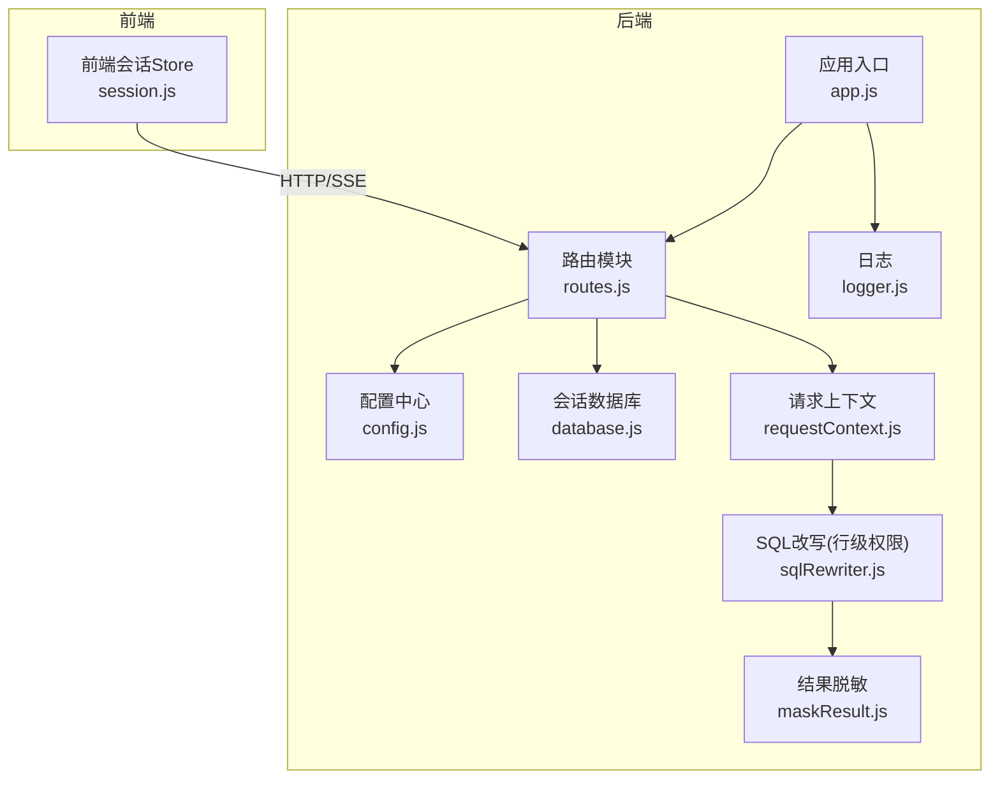
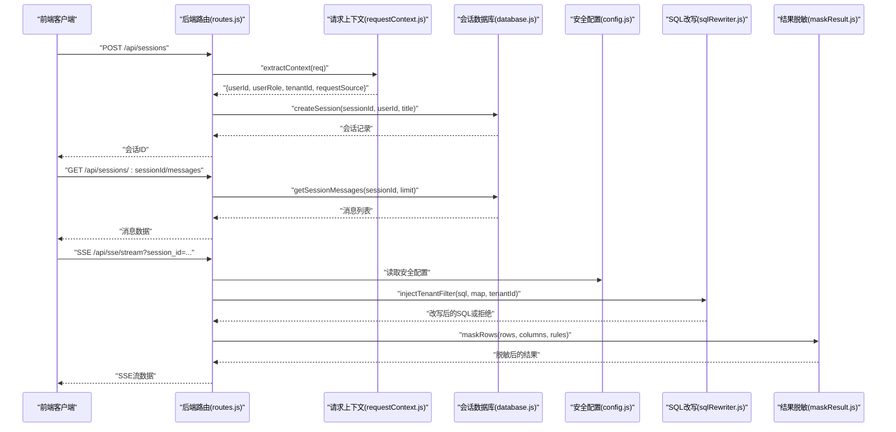
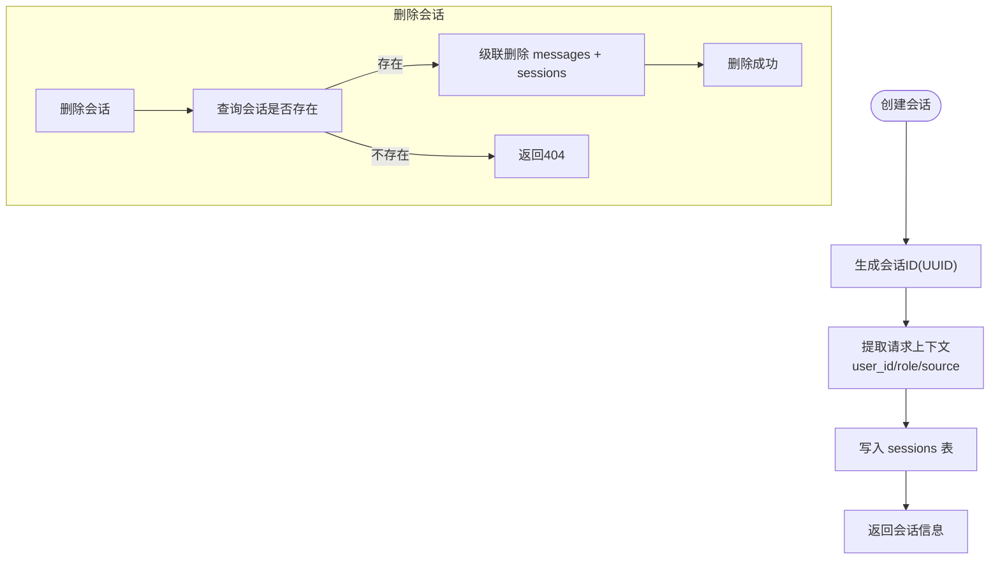
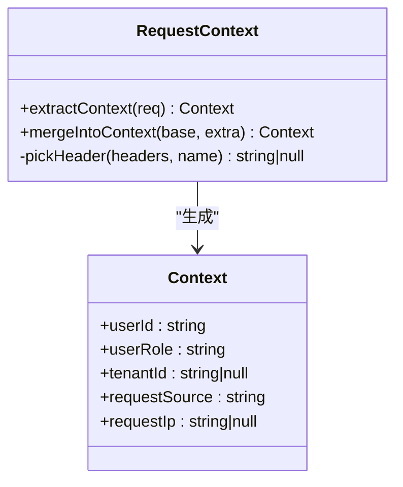
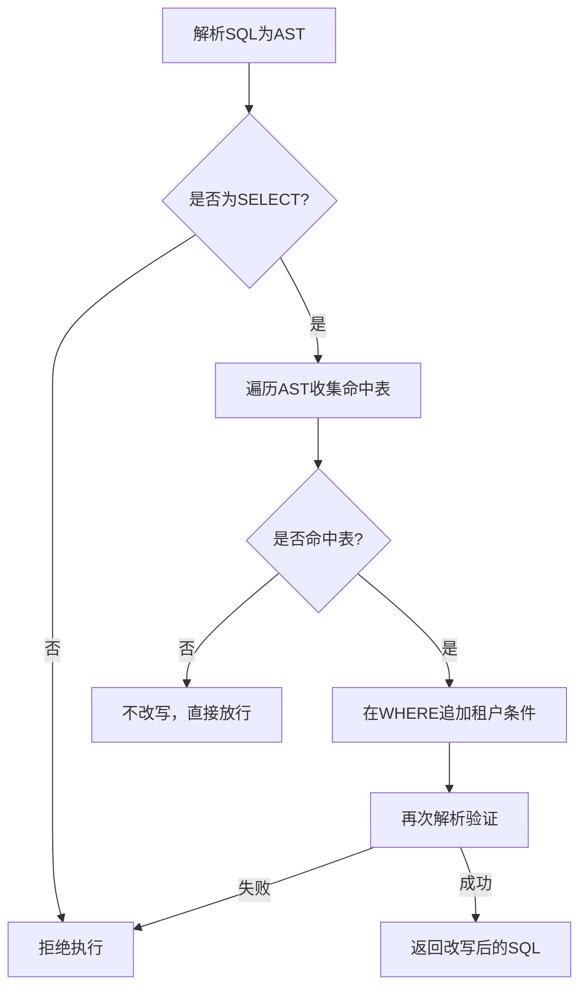
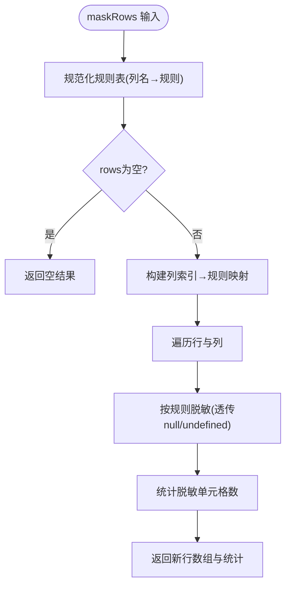
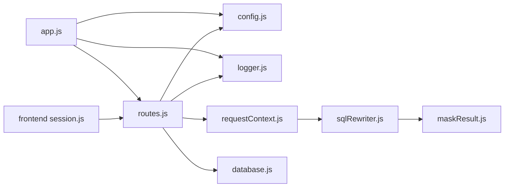

# 认证与授权机制

<cite>
**本文档引用的文件**
- [app.js](file://backend/src/app.js)
- [routes.js](file://backend/src/core/routes.js)
- [config.js](file://backend/src/core/config.js)
- [database.js](file://backend/src/core/database.js)
- [requestContext.js](file://backend/src/core/requestContext.js)
- [sqlRewriter.js](file://backend/src/utils/sqlRewriter.js)
- [maskResult.js](file://backend/src/utils/maskResult.js)
- [logger.js](file://backend/src/utils/logger.js)
- [session.js](file://frontend/src/stores/session.js)
</cite>

## 目录
1. [简介](#简介)
2. [项目结构](#项目结构)
3. [核心组件](#核心组件)
4. [架构总览](#架构总览)
5. [详细组件分析](#详细组件分析)
6. [依赖关系分析](#依赖关系分析)
7. [性能考虑](#性能考虑)
8. [故障排除指南](#故障排除指南)
9. [结论](#结论)
10. [附录](#附录)

## 简介
本文件面向 API 集成开发者，系统性阐述 NL2SQL 系统的认证与授权机制。当前实现采用“无状态信任上游网关”的模式：后端通过 HTTP 请求头提取用户身份与租户信息，并将其注入到查询审计字段与行级权限（RLS）改写流程中。会话管理基于 SQLite 数据库存储，用户 ID 由上游传递，后端不直接进行登录态校验。安全策略包括：白名单表访问、禁止关键字过滤、结果脱敏、查询超时与行数限制等。

## 项目结构
后端通过 Express 应用启动，统一挂载路由模块；前端通过 Pinia Store 管理会话与 SSE 连接。认证与授权的关键点集中在请求上下文提取、SQL 改写与结果脱敏三个环节。

**图表来源**
- [app.js:1-279](file://backend/src/app.js#L1-L279)
- [routes.js:1-1099](file://backend/src/core/routes.js#L1-L1099)
- [config.js:1-439](file://backend/src/core/config.js#L1-L439)
- [database.js:1-1400](file://backend/src/core/database.js#L1-L1400)
- [requestContext.js:1-75](file://backend/src/core/requestContext.js#L1-L75)
- [sqlRewriter.js:1-232](file://backend/src/utils/sqlRewriter.js#L1-L232)
- [maskResult.js:1-198](file://backend/src/utils/maskResult.js#L1-L198)
- [logger.js:1-482](file://backend/src/utils/logger.js#L1-L482)

**章节来源**
- [app.js:1-279](file://backend/src/app.js#L1-L279)
- [routes.js:1-1099](file://backend/src/core/routes.js#L1-L1099)

## 核心组件
- 请求上下文提取：从 HTTP 头部与查询参数中提取用户 ID、角色、租户 ID、请求来源与 IP，并提供合并与规范化能力。
- 行级权限（RLS）SQL 改写：基于 AST 在命中表的 WHERE 子句追加租户过滤条件，拒绝不可解析或不支持的 SQL。
- 结果脱敏：根据列名规则对敏感字段进行脱敏处理，支持多种脱敏策略。
- 会话与用户 ID 管理：会话创建时记录 user_id；查询历史记录 user_id 与审计字段；前端 Store 通过 API 管理会话。
- 安全配置：白名单表、禁止关键字、查询超时、最大行数、脱敏开关与规则等。

**章节来源**
- [requestContext.js:1-75](file://backend/src/core/requestContext.js#L1-L75)
- [sqlRewriter.js:1-232](file://backend/src/utils/sqlRewriter.js#L1-L232)
- [maskResult.js:1-198](file://backend/src/utils/maskResult.js#L1-L198)
- [database.js:1-1400](file://backend/src/core/database.js#L1-L1400)
- [config.js:145-211](file://backend/src/core/config.js#L145-L211)

## 架构总览
后端通过路由模块统一处理 API 请求，提取请求上下文并注入到查询审计字段；在执行阶段，若启用 RLS，则对 SQL 进行改写以追加租户过滤；最终结果根据配置进行脱敏处理。会话与消息持久化于 SQLite，用户 ID 由上游传递。

**图表来源**
- [routes.js:258-400](file://backend/src/core/routes.js#L258-L400)
- [requestContext.js:25-44](file://backend/src/core/requestContext.js#L25-L44)
- [database.js:638-800](file://backend/src/core/database.js#L638-L800)
- [config.js:145-211](file://backend/src/core/config.js#L145-L211)
- [sqlRewriter.js:40-127](file://backend/src/utils/sqlRewriter.js#L40-L127)
- [maskResult.js:131-184](file://backend/src/utils/maskResult.js#L131-L184)

## 详细组件分析

### 会话管理与用户 ID 管理
- 会话创建：前端调用创建会话接口，后端生成 UUID 并记录 user_id 与标题。
- 会话查询与删除：支持按会话 ID 查询与删除；删除会话时级联清理消息。
- 用户 ID 来源：后端不生成用户 ID，而是从请求上下文中提取（优先头部，其次查询参数或请求体），默认为匿名。

**图表来源**
- [routes.js:268-347](file://backend/src/core/routes.js#L268-L347)
- [database.js:638-720](file://backend/src/core/database.js#L638-L720)
- [requestContext.js:25-44](file://backend/src/core/requestContext.js#L25-L44)

**章节来源**
- [routes.js:258-400](file://backend/src/core/routes.js#L258-L400)
- [database.js:638-720](file://backend/src/core/database.js#L638-L720)
- [requestContext.js:25-44](file://backend/src/core/requestContext.js#L25-L44)

### 请求上下文与身份提取
- 提取字段：X-User-Id、X-User-Role、X-Tenant-Id、X-Request-Source、IP。
- 兼容性：user_id 兼容查询参数与请求体；缺失时使用默认值。
- 用途：注入到查询历史审计字段，作为 RLS 改写与日志记录的依据。

**图表来源**
- [requestContext.js:25-74](file://backend/src/core/requestContext.js#L25-L74)

**章节来源**
- [requestContext.js:1-75](file://backend/src/core/requestContext.js#L1-L75)

### 行级权限（RLS）SQL 改写
- 触发条件：配置中启用 RLS 且存在表-租户列映射。
- 改写策略：对命中表的 SELECT 语句在 WHERE 子句追加 `<tenantCol> = <tenantId>`。
- 安全约束：解析失败、类型不支持、改写后验证失败均拒绝执行，绝不静默放行。
- 适用范围：单表 SELECT、JOIN、UNION/EXCEPT、CTE、FROM 子查询；不覆盖 INSERT/UPDATE/DELETE（已被关键字过滤拦截）。

**图表来源**
- [sqlRewriter.js:40-127](file://backend/src/utils/sqlRewriter.js#L40-L127)
- [config.js:204-211](file://backend/src/core/config.js#L204-L211)

**章节来源**
- [sqlRewriter.js:1-232](file://backend/src/utils/sqlRewriter.js#L1-L232)
- [config.js:145-211](file://backend/src/core/config.js#L145-L211)

### 结果脱敏
- 触发条件：配置中启用脱敏，且存在列名到规则的映射。
- 规则类型：mid_4、domain_only、head_tail、redact、first_1、last_4、length_stars。
- 处理方式：对行数组或对象行进行脱敏，返回新数组，不修改输入；列名大小写不敏感。

**图表来源**
- [maskResult.js:131-184](file://backend/src/utils/maskResult.js#L131-L184)
- [config.js:185-202](file://backend/src/core/config.js#L185-L202)

**章节来源**
- [maskResult.js:1-198](file://backend/src/utils/maskResult.js#L1-L198)
- [config.js:185-202](file://backend/src/core/config.js#L185-L202)

### 安全配置与访问控制策略
- 白名单表：仅允许访问配置中列出的表，生产环境务必配置。
- 禁止关键字：默认拦截 UPDATE/DELETE/DROP/INSERT/ALTER/TRUNCATE/CREATE/GRANT/REVOKE/EXEC/EXECUTE 等。
- 查询限制：最大行数、查询超时、DRY_RUN（仅生成SQL不执行）。
- 脱敏策略：可按列名配置脱敏规则，敏感字段自动脱敏。
- RLS 配置：需显式启用并提供表-租户列映射，否则不生效。

**章节来源**
- [config.js:145-211](file://backend/src/core/config.js#L145-L211)

### 认证失败处理与会话超时管理
- 认证失败处理：后端不进行登录态校验，若上游未正确传递用户身份信息，将使用默认值（如 anonymous）。建议在网关层进行统一认证与鉴权。
- 会话超时管理：会话过期时间与清理间隔可在配置中调整；当前实现未在路由层显式校验会话有效性，建议在上游网关层统一处理。

**章节来源**
- [config.js:213-227](file://backend/src/core/config.js#L213-L227)
- [requestContext.js:25-44](file://backend/src/core/requestContext.js#L25-L44)

## 依赖关系分析
- app.js 作为入口，初始化配置、数据库、向量库与路由；路由模块集中处理 API。
- 路由模块依赖请求上下文提取、数据库、配置与日志；SQL 改写与结果脱敏作为工具模块被查询执行流程调用。
- 前端 Store 通过 API 与后端交互，管理会话与 SSE 连接。

**图表来源**
- [app.js:1-279](file://backend/src/app.js#L1-L279)
- [routes.js:1-1099](file://backend/src/core/routes.js#L1-L1099)
- [requestContext.js:1-75](file://backend/src/core/requestContext.js#L1-L75)
- [sqlRewriter.js:1-232](file://backend/src/utils/sqlRewriter.js#L1-L232)
- [maskResult.js:1-198](file://backend/src/utils/maskResult.js#L1-L198)
- [session.js:1-443](file://frontend/src/stores/session.js#L1-L443)

**章节来源**
- [app.js:1-279](file://backend/src/app.js#L1-L279)
- [routes.js:1-1099](file://backend/src/core/routes.js#L1-L1099)

## 性能考虑
- 查询超时与最大行数限制：防止慢查询与大结果集导致资源耗尽。
- RLS 改写：仅对命中表的 SQL 进行 AST 遍历与改写，解析失败即拒绝，避免无效执行。
- 结果脱敏：纯函数与不可变返回，避免重复拷贝；列规则预计算索引提升性能。
- 日志轮转：控制文件大小与保留数量，避免磁盘膨胀。

[本节为通用指导，无需特定文件引用]

## 故障排除指南
- 健康检查：通过 /api/health 与 /api/health/detail 检查数据库、Schema、SSE 连接状态。
- 配置校验：启动时验证 LLM API Key 与 SR 数据库 URL 是否配置；白名单为空时发出警告。
- SQL 改写失败：检查 SQL 类型是否为 SELECT、AST 解析是否成功、改写后是否可再次解析。
- 结果脱敏异常：确认列名大小写与规则映射是否正确；空值与非字符串值将透传。
- 日志定位：使用日志模块的 trace/debug/info/warn/error 级别，结合 Trace 上下文追踪执行步骤。

**章节来源**
- [routes.js:74-139](file://backend/src/core/routes.js#L74-L139)
- [config.js:407-429](file://backend/src/core/config.js#L407-L429)
- [sqlRewriter.js:40-127](file://backend/src/utils/sqlRewriter.js#L40-L127)
- [maskResult.js:131-184](file://backend/src/utils/maskResult.js#L131-L184)
- [logger.js:276-448](file://backend/src/utils/logger.js#L276-L448)

## 结论
NL2SQL 当前采用“无状态信任上游网关”的认证与授权模式：后端通过请求头提取用户身份与租户信息，注入审计字段并参与 RLS 改写与结果脱敏。会话管理基于 SQLite，用户 ID 由上游传递。建议在网关层统一进行认证与鉴权，后端专注于安全策略执行与数据保护。生产环境务必配置白名单表、合理设置查询限制与脱敏规则，并启用 RLS 以满足行级隔离需求。

[本节为总结，无需特定文件引用]

## 附录

### 安全配置选项清单
- 安全配置（security.*）
  - allowedTables：允许访问的表白名单
  - dryRun：仅生成SQL不执行
  - maxQueryRows：单次查询最大返回行数
  - queryTimeout：查询超时时间（毫秒）
  - forbiddenKeywords：禁止关键字列表
  - masking.enabled：是否启用结果脱敏
  - masking.rules：列名到脱敏规则映射
  - rls.enabled：是否启用行级权限
  - rls.tableTenantMap：表到租户列映射

**章节来源**
- [config.js:145-211](file://backend/src/core/config.js#L145-L211)

### API 集成安全最佳实践
- 在网关层统一进行用户认证与会话校验，后端仅信任可信头部（X-User-Id、X-User-Role、X-Tenant-Id、X-Request-Source）。
- 生产环境必须配置 ALLOWED_TABLES 白名单，避免任意表访问风险。
- 启用 RLS 并提供准确的表-租户列映射，确保数据隔离。
- 合理设置 QUERY_TIMEOUT 与 MAX_QUERY_ROWS，防止资源滥用。
- 启用结果脱敏，避免敏感字段明文传输。
- 使用 HTTPS 与 CORS 限制，确保传输安全与跨域可控。

[本节为通用指导，无需特定文件引用]