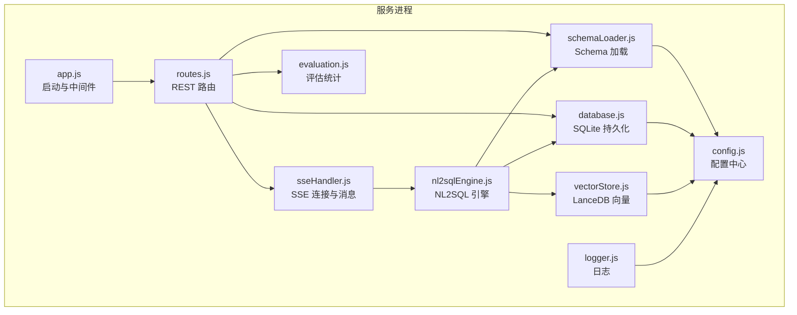
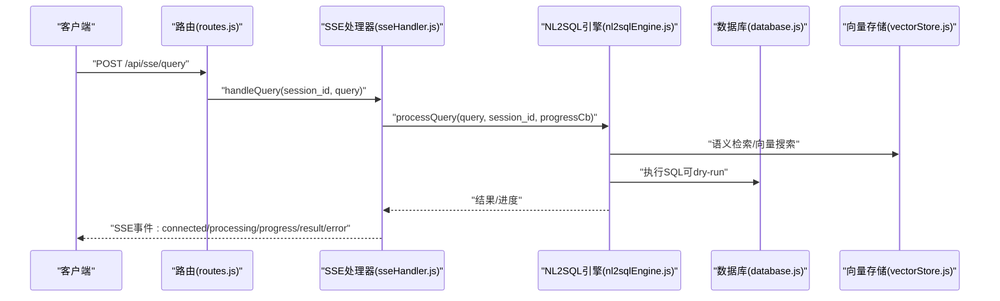
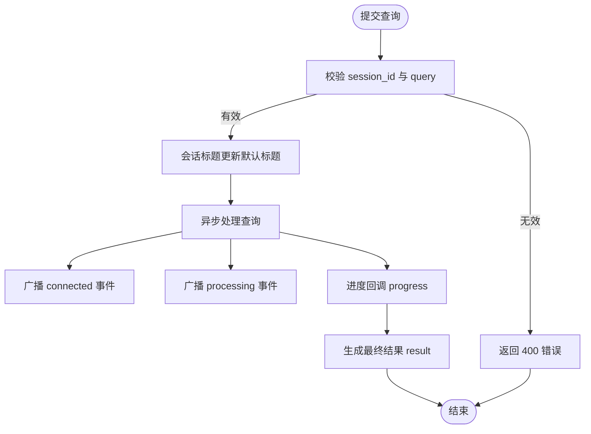
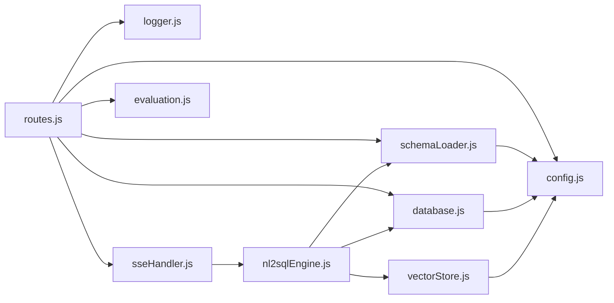

# API参考

<cite>
**本文引用的文件**
- [backend/src/app.js](file://backend/src/app.js)
- [backend/src/core/routes.js](file://backend/src/core/routes.js)
- [backend/src/core/sseHandler.js](file://backend/src/core/sseHandler.js)
- [backend/src/core/nl2sqlEngine.js](file://backend/src/core/nl2sqlEngine.js)
- [backend/src/core/database.js](file://backend/src/core/database.js)
- [backend/src/core/config.js](file://backend/src/core/config.js)
- [backend/src/utils/logger.js](file://backend/src/utils/logger.js)
- [backend/src/utils/evaluation.js](file://backend/src/utils/evaluation.js)
- [backend/src/core/schemaLoader.js](file://backend/src/core/schemaLoader.js)
- [backend/src/memory/vectorStore.js](file://backend/src/memory/vectorStore.js)
- [backend/package.json](file://backend/package.json)
- [backend/config/schema-metadata.json](file://backend/config/schema-metadata.json)
</cite>

## 目录
1. [简介](#简介)
2. [项目结构](#项目结构)
3. [核心组件](#核心组件)
4. [架构总览](#架构总览)
5. [详细组件分析](#详细组件分析)
6. [依赖关系分析](#依赖关系分析)
7. [性能考量](#性能考量)
8. [故障排查指南](#故障排查指南)
9. [结论](#结论)
10. [附录](#附录)

## 简介
本文件为 NL2SQL 服务的完整 RESTful API 文档，覆盖以下能力：
- 查询处理 API：自然语言到 SQL 的生成与执行
- Schema 管理 API：Schema 元数据查询、搜索与表详情
- 历史记录 API：查询历史、会话与消息、用户偏好
- 实时流 API：SSE（Server-Sent Events）流式结果推送
- 安全与限流：认证、安全策略与建议的速率限制
- SDK 使用指南：前端/客户端接入示例与最佳实践

本参考面向 API 消费者，提供端点、请求/响应格式、参数规范、错误码说明与集成建议。

## 项目结构
后端采用 Express 框架，路由集中在 /api 下，核心模块包括：
- 路由与中间件：统一处理请求日志、健康检查、SSE
- 核心引擎：NL2SQL 引擎、Schema 加载、向量存储、数据库
- 工具与评估：日志、评估统计、Token 预算
- 配置中心：集中管理 LLM、数据库、安全、日志、评估等配置

图表来源
- [backend/src/app.js:55-87](file://backend/src/app.js#L55-L87)
- [backend/src/core/routes.js:35-54](file://backend/src/core/routes.js#L35-L54)
- [backend/src/core/sseHandler.js:43-112](file://backend/src/core/sseHandler.js#L43-L112)
- [backend/src/core/nl2sqlEngine.js:16-33](file://backend/src/core/nl2sqlEngine.js#L16-L33)
- [backend/src/core/schemaLoader.js:69-122](file://backend/src/core/schemaLoader.js#L69-L122)
- [backend/src/core/database.js:206-267](file://backend/src/core/database.js#L206-L267)
- [backend/src/memory/vectorStore.js:14-23](file://backend/src/memory/vectorStore.js#L14-L23)
- [backend/src/utils/evaluation.js:12-13](file://backend/src/utils/evaluation.js#L12-L13)
- [backend/src/utils/logger.js:54-85](file://backend/src/utils/logger.js#L54-L85)
- [backend/src/core/config.js:16-355](file://backend/src/core/config.js#L16-L355)

章节来源
- [backend/src/app.js:55-87](file://backend/src/app.js#L55-L87)
- [backend/src/core/routes.js:35-54](file://backend/src/core/routes.js#L35-L54)

## 核心组件
- 路由与中间件：统一日志、CORS、JSON 解析、404/500 处理
- SSE 处理器：连接管理、消息广播、进度回调、连接清理
- NL2SQL 引擎：意图识别、实体解析、SQL 生成与验证、结果格式化
- Schema 加载器：Schema 元数据加载、缓存、向量化
- 数据库：SQLite 会话、消息、查询历史、用户偏好
- 向量存储：LanceDB 表级/查询向量、语义检索
- 评估模块：向量化质量评估、运行时统计
- 日志模块：结构化日志、文件轮转、追踪
- 配置中心：LLM、数据库、安全、日志、评估、功能开关

章节来源
- [backend/src/core/routes.js:46-54](file://backend/src/core/routes.js#L46-L54)
- [backend/src/core/sseHandler.js:30-31](file://backend/src/core/sseHandler.js#L30-L31)
- [backend/src/core/nl2sqlEngine.js:16-33](file://backend/src/core/nl2sqlEngine.js#L16-L33)
- [backend/src/core/schemaLoader.js:69-122](file://backend/src/core/schemaLoader.js#L69-L122)
- [backend/src/core/database.js:206-267](file://backend/src/core/database.js#L206-L267)
- [backend/src/memory/vectorStore.js:14-23](file://backend/src/memory/vectorStore.js#L14-L23)
- [backend/src/utils/evaluation.js:12-13](file://backend/src/utils/evaluation.js#L12-L13)
- [backend/src/utils/logger.js:54-85](file://backend/src/utils/logger.js#L54-L85)
- [backend/src/core/config.js:16-355](file://backend/src/core/config.js#L16-L355)

## 架构总览
NL2SQL 服务通过 /api 路由暴露 REST 接口，SSE 用于实时流式结果推送。核心链路如下：
- 客户端发起查询（HTTP 或 SSE）
- 服务端通过 NL2SQL 引擎解析自然语言，结合 Schema 与向量检索生成 SQL
- 执行 SQL（可配置为 dry-run 模式），返回结果并通过 SSE 推送

图表来源
- [backend/src/core/routes.js:972-1002](file://backend/src/core/routes.js#L972-L1002)
- [backend/src/core/sseHandler.js:218-280](file://backend/src/core/sseHandler.js#L218-L280)
- [backend/src/core/nl2sqlEngine.js:16-33](file://backend/src/core/nl2sqlEngine.js#L16-L33)
- [backend/src/core/database.js:370-433](file://backend/src/core/database.js#L370-L433)
- [backend/src/memory/vectorStore.js:14-23](file://backend/src/memory/vectorStore.js#L14-L23)

## 详细组件分析

### 健康检查接口
- GET /api/health
  - 响应字段：status、timestamp、version、uptime、memory.used、memory.total
  - 状态码：200
- GET /api/health/detail
  - 响应字段：status、timestamp、components.database、components.llm、components.schema、components.sse
  - 状态码：200（正常）或 503（异常）

章节来源
- [backend/src/core/routes.js:72-137](file://backend/src/core/routes.js#L72-L137)

### Schema 管理接口
- GET /api/schema
  - 查询参数：type（可选，tables|metrics|dimensions）
  - 响应：根据 type 返回相应片段或完整 Schema（包含 version、tables、metrics、dimensions）
- GET /api/schema/tables/:tableName
  - 路径参数：tableName
  - 响应：table、relatedTables
  - 404：表不存在
- GET /api/schema/search
  - 查询参数：q（关键词）、limit（默认5）
  - 响应：query、count、tables
  - 400：缺少 q
  - 500：搜索失败

章节来源
- [backend/src/core/routes.js:150-250](file://backend/src/core/routes.js#L150-L250)
- [backend/src/core/schemaLoader.js:69-122](file://backend/src/core/schemaLoader.js#L69-L122)

### 会话与消息接口
- POST /api/sessions
  - 请求体：user_id、title（可选）
  - 响应：新建会话（id、user_id、title）
  - 500：创建失败
- GET /api/sessions/:sessionId
  - 响应：会话信息
  - 404：会话不存在
- DELETE /api/sessions/:sessionId
  - 响应：success、message
  - 404：会话不存在
- GET /api/sessions/:sessionId/messages
  - 查询参数：limit（默认50）
  - 响应：session_id、count、messages
- GET /api/users/:userId/sessions
  - 查询参数：limit（默认20）
  - 响应：user_id、count、sessions

章节来源
- [backend/src/core/routes.js:266-398](file://backend/src/core/routes.js#L266-L398)
- [backend/src/core/database.js:467-501](file://backend/src/core/database.js#L467-L501)

### 查询历史接口
- GET /api/queries/history
  - 查询参数：user_id（可选）、session_id（可选）、limit（默认20）
  - 响应：count、history（查询历史列表）

章节来源
- [backend/src/core/routes.js:413-450](file://backend/src/core/routes.js#L413-L450)
- [backend/src/core/database.js:370-433](file://backend/src/core/database.js#L370-L433)

### 用户偏好（长期记忆）接口
- GET /api/preferences/:userId/raw
  - 查询参数：type（可选）
  - 响应：success、user_id、total_count、data.grouped
- GET /api/preferences/:userId/stats
  - 响应：success、user_id、data（用户记忆统计）
- GET /api/preferences/:userId
  - 查询参数：type（可选）、limit（默认50）
  - 响应：success、user_id、data（按类型聚合）
- POST /api/preferences/:userId/templates
  - 请求体：name、dimensions、metrics、default_time_range
  - 响应：success、message、data
  - 400：模板名称为空
- DELETE /api/preferences/:preferenceId
  - 响应：success/message（或 404）
- POST /api/preferences/:userId/learn-alias
  - 请求体：user_term、schema_field、field_type（默认 metric）
  - 响应：success/message/data（或无需学习）

章节来源
- [backend/src/core/routes.js:461-716](file://backend/src/core/routes.js#L461-L716)
- [backend/src/core/database.js:618-772](file://backend/src/core/database.js#L618-L772)

### 评估接口（新增）
- GET /api/evaluation/stats
  - 响应：success、data（评估统计）
- POST /api/evaluation/stats/reset
  - 响应：success、message
- POST /api/evaluation/schema-quality
  - 请求体：testQueries（可选）
  - 响应：success、data
  - 403：评估未启用
- POST /api/evaluation/query-quality
  - 请求体：testPairs（可选）
  - 响应：success、data
- GET /api/evaluation/config
  - 响应：success、data（enabled、trackStats、thresholds）

章节来源
- [backend/src/core/routes.js:726-856](file://backend/src/core/routes.js#L726-L856)
- [backend/src/utils/evaluation.js:12-13](file://backend/src/utils/evaluation.js#L12-L13)

### 统计信息接口
- GET /api/stats
  - 响应：timestamp、connections.sse、queries.today、schema、system

章节来源
- [backend/src/core/routes.js:866-913](file://backend/src/core/routes.js#L866-L913)

### 配置接口
- GET /api/config
  - 响应：version、llm（model、api_base）、security（max_query_rows、query_timeout）、features（streaming、clarification、vector_search）

章节来源
- [backend/src/core/routes.js:924-942](file://backend/src/core/routes.js#L924-L942)

### 实时流 API（SSE）
- GET /api/sse/stream
  - 查询参数：session_id（必需）、user_id（可选，默认 anonymous）
  - 响应：text/event-stream，事件类型：connected、processing、progress、result、error
- POST /api/sse/query
  - 请求体：session_id、query
  - 响应：success/message
  - 400：缺少 session_id 或 query 为空
  - 500：提交失败

SSE 消息格式（事件类型与数据结构）
- connected：{ type: "connected", data: { session_id, message } }
- processing：{ type: "processing", data: { message } }
- progress：{ type: "progress", data: { /* 引擎进度回调数据 */ } }
- result：{ type: "result", data: { /* 引擎最终结果 */ } }
- error：{ type: "error", data: { message } }

章节来源
- [backend/src/core/routes.js:957-1002](file://backend/src/core/routes.js#L957-L1002)
- [backend/src/core/sseHandler.js:43-112](file://backend/src/core/sseHandler.js#L43-L112)
- [backend/src/core/sseHandler.js:159-189](file://backend/src/core/sseHandler.js#L159-L189)
- [backend/src/core/sseHandler.js:197-204](file://backend/src/core/sseHandler.js#L197-L204)

### 查询处理流程（SSE）

图表来源
- [backend/src/core/routes.js:972-1002](file://backend/src/core/routes.js#L972-L1002)
- [backend/src/core/sseHandler.js:218-280](file://backend/src/core/sseHandler.js#L218-L280)

## 依赖关系分析
- 路由依赖：routes.js 依赖 logger、config、schemaLoader、database、sseHandler、evaluation
- SSE 依赖：sseHandler 依赖 database、nl2sqlEngine
- 引擎依赖：nl2sqlEngine 依赖 config、llmService、schemaLoader、database、tokenBudget、summarizer、longTermMemory、vectorStore
- 数据层：database.js 管理 SQLite 表结构与 CRUD
- 向量层：vectorStore.js 基于 LanceDB 实现向量检索
- 配置层：config.js 提供统一配置与校验

图表来源
- [backend/src/core/routes.js:16-30](file://backend/src/core/routes.js#L16-L30)
- [backend/src/core/sseHandler.js:15-20](file://backend/src/core/sseHandler.js#L15-L20)
- [backend/src/core/nl2sqlEngine.js:16-33](file://backend/src/core/nl2sqlEngine.js#L16-L33)
- [backend/src/core/schemaLoader.js:15-26](file://backend/src/core/schemaLoader.js#L15-L26)
- [backend/src/core/database.js:12-19](file://backend/src/core/database.js#L12-L19)
- [backend/src/memory/vectorStore.js:14-23](file://backend/src/memory/vectorStore.js#L14-L23)
- [backend/src/utils/evaluation.js:12-13](file://backend/src/utils/evaluation.js#L12-L13)
- [backend/src/utils/logger.js:16-23](file://backend/src/utils/logger.js#L16-L23)
- [backend/src/core/config.js:16-355](file://backend/src/core/config.js#L16-L355)

章节来源
- [backend/src/core/routes.js:16-30](file://backend/src/core/routes.js#L16-L30)
- [backend/src/core/sseHandler.js:15-20](file://backend/src/core/sseHandler.js#L15-L20)
- [backend/src/core/nl2sqlEngine.js:16-33](file://backend/src/core/nl2sqlEngine.js#L16-L33)
- [backend/src/core/schemaLoader.js:15-26](file://backend/src/core/schemaLoader.js#L15-L26)
- [backend/src/core/database.js:12-19](file://backend/src/core/database.js#L12-L19)
- [backend/src/memory/vectorStore.js:14-23](file://backend/src/memory/vectorStore.js#L14-L23)
- [backend/src/utils/evaluation.js:12-13](file://backend/src/utils/evaluation.js#L12-L13)
- [backend/src/utils/logger.js:16-23](file://backend/src/utils/logger.js#L16-L23)
- [backend/src/core/config.js:16-355](file://backend/src/core/config.js#L16-L355)

## 性能考量
- 数据库与索引：SQLite 表包含多处索引，建议在高频查询列上保持索引策略
- 向量检索：Schema 与查询向量分别存储，建议合理设置 revectorize 与缓存策略
- 查询限制：maxQueryRows、queryTimeout、forbiddenKeywords 等安全配置可防止大查询与危险 SQL
- 日志与评估：评估统计可选开启，避免影响主流程性能

章节来源
- [backend/src/core/database.js:39-195](file://backend/src/core/database.js#L39-L195)
- [backend/src/core/config.js:140-170](file://backend/src/core/config.js#L140-L170)
- [backend/src/utils/evaluation.js:19-31](file://backend/src/utils/evaluation.js#L19-L31)

## 故障排查指南
- 健康检查
  - /api/health：确认服务可用、内存使用、运行时长
  - /api/health/detail：检查数据库、LLM、Schema、SSE 连接状态
- 常见错误
  - 400：缺少必要参数（如 session_id、query、q）
  - 404：资源不存在（会话、表）
  - 500：服务器内部错误，查看日志定位
- 日志与追踪
  - 日志模块提供结构化输出与文件轮转，支持 TRACE/DEBUG/INFO/WARN/ERROR 级别
  - 可通过 logger.startTrace/logger.endTrace 进行流程追踪

章节来源
- [backend/src/core/routes.js:1012-1030](file://backend/src/core/routes.js#L1012-L1030)
- [backend/src/utils/logger.js:263-309](file://backend/src/utils/logger.js#L263-L309)

## 结论
NL2SQL 提供了从自然语言到 SQL 的完整链路，配合 SSE 实现实时流式结果推送。通过统一的 REST API 与配置中心，服务具备良好的可扩展性与安全性。建议在生产环境中：
- 明确白名单与查询限制
- 启用评估与日志追踪
- 合理配置向量与缓存策略
- 使用 SSE 进行实时交互，提升用户体验

## 附录

### 认证与安全
- 认证方式：当前路由未内置鉴权中间件，建议在网关或反向代理层添加认证（如 API Key、OAuth）
- 安全策略：
  - 白名单 allowedTables：限制可访问表
  - 禁止关键字 forbiddenKeywords：阻止危险 SQL
  - 查询限制：maxQueryRows、queryTimeout
  - 敏感字段脱敏：sensitiveFields
- 建议的速率限制策略：
  - 基于 IP/用户维度的令牌桶或滑动窗口
  - 对 SSE 连接数与查询频率进行限制
  - 对评估接口单独限流

章节来源
- [backend/src/core/config.js:140-170](file://backend/src/core/config.js#L140-L170)

### 端点一览与错误码
- 健康检查
  - GET /api/health → 200
  - GET /api/health/detail → 200/503
- Schema
  - GET /api/schema → 200
  - GET /api/schema/tables/:tableName → 200/404
  - GET /api/schema/search → 200/400/500
- 会话与消息
  - POST /api/sessions → 201/500
  - GET /api/sessions/:sessionId → 200/404
  - DELETE /api/sessions/:sessionId → 200/404
  - GET /api/sessions/:sessionId/messages → 200
  - GET /api/users/:userId/sessions → 200
- 查询历史
  - GET /api/queries/history → 200
- 用户偏好
  - GET /api/preferences/:userId/raw → 200
  - GET /api/preferences/:userId/stats → 200
  - GET /api/preferences/:userId → 200
  - POST /api/preferences/:userId/templates → 200/400
  - DELETE /api/preferences/:preferenceId → 200/404
  - POST /api/preferences/:userId/learn-alias → 200/400
- 评估
  - GET /api/evaluation/stats → 200
  - POST /api/evaluation/stats/reset → 200
  - POST /api/evaluation/schema-quality → 200/403/500
  - POST /api/evaluation/query-quality → 200/403/500
  - GET /api/evaluation/config → 200
- 统计
  - GET /api/stats → 200
- 配置
  - GET /api/config → 200
- SSE
  - GET /api/sse/stream → 200（SSE）
  - POST /api/sse/query → 200/400/500

章节来源
- [backend/src/core/routes.js:72-137](file://backend/src/core/routes.js#L72-L137)
- [backend/src/core/routes.js:150-250](file://backend/src/core/routes.js#L150-L250)
- [backend/src/core/routes.js:266-398](file://backend/src/core/routes.js#L266-L398)
- [backend/src/core/routes.js:413-450](file://backend/src/core/routes.js#L413-L450)
- [backend/src/core/routes.js:461-716](file://backend/src/core/routes.js#L461-L716)
- [backend/src/core/routes.js:726-856](file://backend/src/core/routes.js#L726-L856)
- [backend/src/core/routes.js:866-942](file://backend/src/core/routes.js#L866-L942)
- [backend/src/core/routes.js:947-1002](file://backend/src/core/routes.js#L947-L1002)

### SDK 使用指南（前端/客户端）
- 健康检查
  - GET /api/health
- Schema 查询
  - GET /api/schema?type=tables|metrics|dimensions
  - GET /api/schema/tables/:tableName
  - GET /api/schema/search?q=关键词&limit=5
- 会话与消息
  - POST /api/sessions（携带 user_id、title）
  - GET /api/sessions/:sessionId
  - DELETE /api/sessions/:sessionId
  - GET /api/sessions/:sessionId/messages?limit=50
  - GET /api/users/:userId/sessions?limit=20
- 查询历史
  - GET /api/queries/history?user_id=...&session_id=...&limit=20
- 用户偏好
  - GET /api/preferences/:userId/raw?type=...
  - GET /api/preferences/:userId/stats
  - GET /api/preferences/:userId?type=...&limit=50
  - POST /api/preferences/:userId/templates
  - DELETE /api/preferences/:preferenceId
  - POST /api/preferences/:userId/learn-alias
- 评估
  - GET /api/evaluation/stats
  - POST /api/evaluation/stats/reset
  - POST /api/evaluation/schema-quality
  - POST /api/evaluation/query-quality
  - GET /api/evaluation/config
- 统计与配置
  - GET /api/stats
  - GET /api/config
- SSE 实时流
  - 建立连接：GET /api/sse/stream?session_id=...&user_id=...
  - 发送查询：POST /api/sse/query（session_id、query）
  - 监听事件：connected、processing、progress、result、error

章节来源
- [backend/src/core/routes.js:72-137](file://backend/src/core/routes.js#L72-L137)
- [backend/src/core/routes.js:150-250](file://backend/src/core/routes.js#L150-L250)
- [backend/src/core/routes.js:266-398](file://backend/src/core/routes.js#L266-L398)
- [backend/src/core/routes.js:413-450](file://backend/src/core/routes.js#L413-L450)
- [backend/src/core/routes.js:461-716](file://backend/src/core/routes.js#L461-L716)
- [backend/src/core/routes.js:726-856](file://backend/src/core/routes.js#L726-L856)
- [backend/src/core/routes.js:866-942](file://backend/src/core/routes.js#L866-L942)
- [backend/src/core/routes.js:947-1002](file://backend/src/core/routes.js#L947-L1002)

### 配置项速览
- 服务器与环境：port、nodeEnv
- LLM：apiBase、apiKey、model、timeout、maxRetries、retryDelay
- Embedding：model、dimension、timeout
- 数据库：database.path、srDatabase.url、pool
- 安全：allowedTables、dryRun、maxQueryRows、queryTimeout、forbiddenKeywords、sensitiveFields
- 会话：maxHistory、expireTime、cleanupInterval
- 日志：level、file、console、fileOutput、maxSize、maxFiles
- 自修复：enabled、dailyCheckCron、sessionCheckInterval、slowQueryThreshold
- Schema：configPath、enableCache、cacheExpireTime、revectorize
- 长期记忆：enabled、useLLMForExtraction、thresholds、retention
- 上下文管理：enableTokenBudget、enableSummarizer、tokenBudget、summarizer
- 评估：enabled、trackStats、thresholds

章节来源
- [backend/src/core/config.js:16-355](file://backend/src/core/config.js#L16-L355)