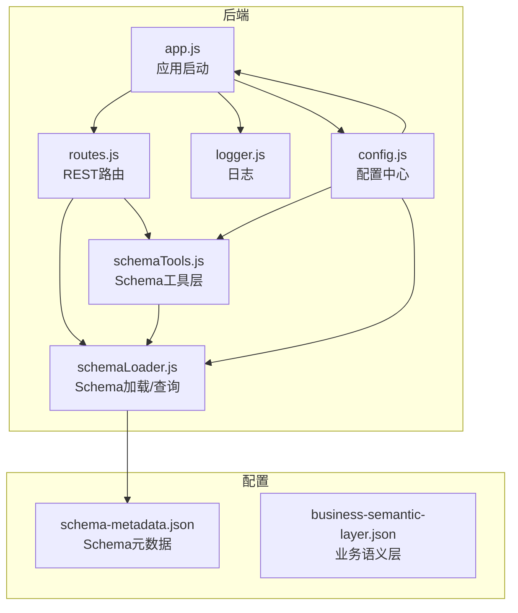
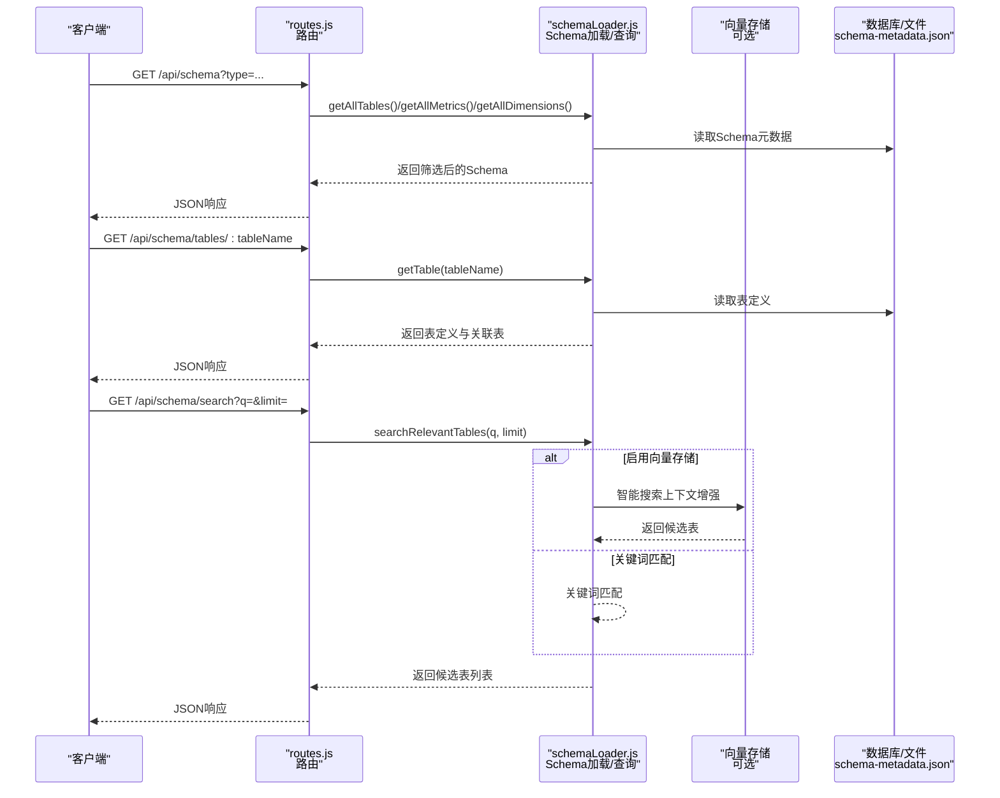
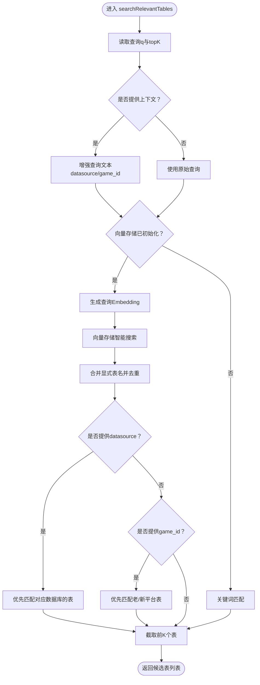
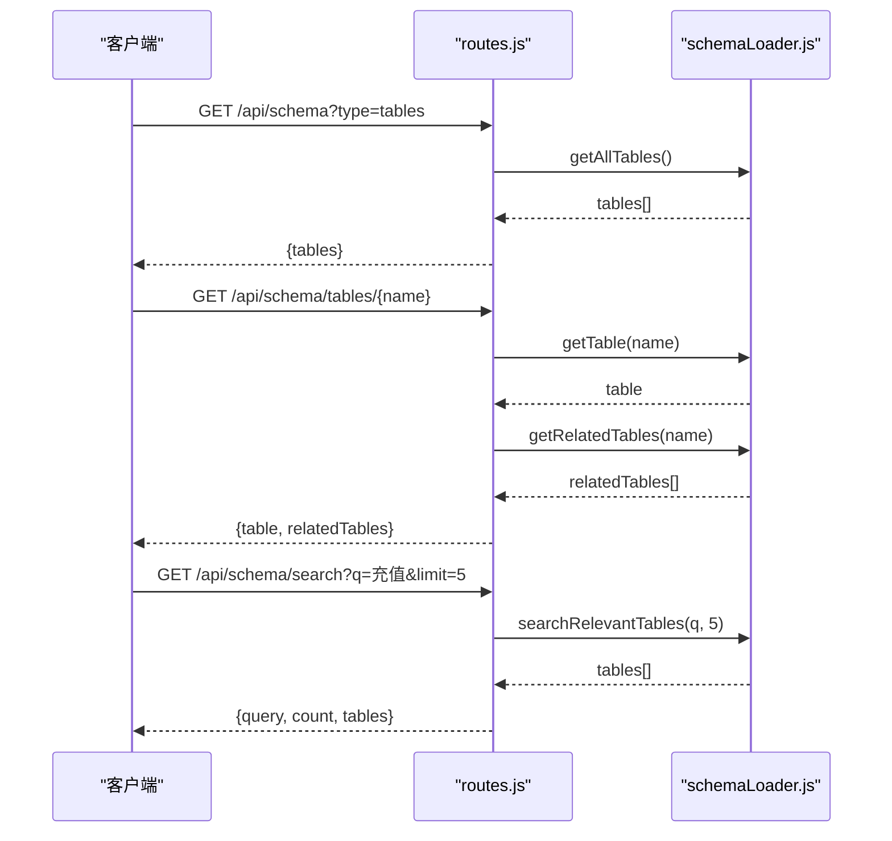
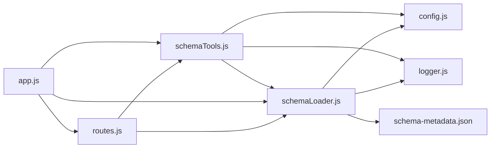

# Schema管理API

<cite>
**本文引用的文件**
- [routes.js](file://backend/src/core/routes.js)
- [schemaLoader.js](file://backend/src/core/schemaLoader.js)
- [schemaTools.js](file://backend/src/core/schemaTools.js)
- [config.js](file://backend/src/core/config.js)
- [app.js](file://backend/src/app.js)
- [schema-metadata.example.json](file://backend/config/schema-metadata.example.json)
- [schema-metadata.json](file://backend/config/schema-metadata.json)
- [business-semantic-layer.json](file://backend/config/business-semantic-layer.json)
- [logger.js](file://backend/src/utils/logger.js)
</cite>

## 目录
1. [简介](#简介)
2. [项目结构](#项目结构)
3. [核心组件](#核心组件)
4. [架构总览](#架构总览)
5. [详细组件分析](#详细组件分析)
6. [依赖关系分析](#依赖关系分析)
7. [性能考量](#性能考量)
8. [故障排查指南](#故障排查指南)
9. [结论](#结论)
10. [附录](#附录)

## 简介
本文件为NL2SQL项目的Schema管理API的完整RESTful API文档，聚焦以下接口：
- GET /api/schema：Schema查询接口，支持按类型筛选（tables/metrics/dimensions）
- GET /api/schema/tables/:tableName：表详情查询
- GET /api/schema/search：Schema搜索接口

文档同时解释Schema元数据结构、字段类型与关系映射，以及Schema动态加载机制、缓存策略与版本管理、增量更新实现方式。

## 项目结构
后端采用Express框架，核心路由集中在routes.js中，Schema相关逻辑由schemaLoader.js与schemaTools.js实现，配置集中于config.js，应用启动在app.js中完成。

图表来源
- [app.js:1-260](file://backend/src/app.js#L1-L260)
- [routes.js:1-800](file://backend/src/core/routes.js#L1-L800)
- [schemaLoader.js:1-800](file://backend/src/core/schemaLoader.js#L1-L800)
- [schemaTools.js:1-632](file://backend/src/core/schemaTools.js#L1-L632)
- [config.js:1-398](file://backend/src/core/config.js#L1-L398)

章节来源
- [app.js:1-260](file://backend/src/app.js#L1-L260)
- [routes.js:1-800](file://backend/src/core/routes.js#L1-L800)

## 核心组件
- REST路由模块：定义Schema相关接口，调用schemaLoader与schemaTools进行数据查询与工具执行。
- Schema加载模块：负责从配置文件加载Schema元数据，构建映射表，提供查询接口，支持向量化与智能搜索。
- Schema工具层：提供LLM可调用的Schema探索工具，实现“按需索取”，包含Level 1索引缓存与工具定义。
- 配置中心：集中管理Schema配置、缓存过期时间、向量化开关等。
- 应用启动：初始化数据库、向量库、Schema元数据，并启动HTTP服务。

章节来源
- [routes.js:140-250](file://backend/src/core/routes.js#L140-L250)
- [schemaLoader.js:69-122](file://backend/src/core/schemaLoader.js#L69-L122)
- [schemaTools.js:40-124](file://backend/src/core/schemaTools.js#L40-L124)
- [config.js:240-250](file://backend/src/core/config.js#L240-L250)
- [app.js:97-188](file://backend/src/app.js#L97-L188)

## 架构总览
Schema管理API的调用链路如下：

图表来源
- [routes.js:140-250](file://backend/src/core/routes.js#L140-L250)
- [schemaLoader.js:432-709](file://backend/src/core/schemaLoader.js#L432-L709)

## 详细组件分析

### REST路由与接口定义
- GET /api/schema
  - 查询参数：type（可选，支持tables/metrics/dimensions）
  - 返回：按type返回对应集合；默认返回完整Schema（version + tables + metrics + dimensions）
- GET /api/schema/tables/:tableName
  - 路径参数：tableName
  - 返回：table定义 + relatedTables（通过关系映射计算）
  - 404：当表不存在时
- GET /api/schema/search
  - 查询参数：q（关键词）、limit（默认5）
  - 返回：query、count、tables（候选表列表）
  - 400：缺少q参数
  - 500：搜索失败

章节来源
- [routes.js:140-250](file://backend/src/core/routes.js#L140-L250)

### Schema元数据结构与字段类型
Schema元数据由配置文件提供，核心字段如下：
- version：Schema版本号
- tables：表定义数组
  - name/name_cn：表名与中文名
  - description：表描述
  - fields：字段定义数组
    - name/name_cn/type：字段名、中文名、类型
    - description：字段描述
    - is_primary：是否主键
    - foreign_key：外键引用（如users.user_id）
    - aggregations：可聚合函数列表（如SUM、AVG）
    - time_granularity：时间粒度（如hour/day/week/month/year）
- relationships：表关系数组
  - from/to：关系两端（如sales_order.user_id）
  - type：关系类型（如MANY_TO_ONE）
  - description：关系描述
- metrics：指标定义数组
  - name/name_cn：指标名与中文名
  - definition：指标计算表达式（如SUM(sales_order.order_amount)）
  - description：指标描述
  - unit：指标单位（如元、笔、人）
- dimensions：维度定义数组
  - name/name_cn：维度名与中文名
  - fields：参与维度的字段列表
  - granularities/hierarchy：时间粒度或层级关系

章节来源
- [schema-metadata.example.json:1-328](file://backend/config/schema-metadata.example.json#L1-L328)
- [schema-metadata.json:1-800](file://backend/config/schema-metadata.json#L1-L800)

### Schema查询与匹配逻辑
- getAllTables/getAllMetrics/getAllDimensions：直接返回缓存中的Schema集合
- getTable：通过表名映射快速查找
- getRelatedTables：遍历relationships，提取与目标表相连的其他表名
- searchRelevantTables：支持上下文增强（game_id、datasource）与智能搜索（向量检索+关键词匹配）
  - 启用向量存储时：先生成增强查询文本，再调用向量检索，最后合并显式表名并去重
  - 未启用向量存储时：回退到关键词匹配

图表来源
- [schemaLoader.js:562-709](file://backend/src/core/schemaLoader.js#L562-L709)

章节来源
- [schemaLoader.js:432-709](file://backend/src/core/schemaLoader.js#L432-L709)

### Schema动态加载机制与缓存策略
- 动态加载：应用启动时调用schemaLoader.load()，从配置文件读取并校验Schema，构建表/字段映射，更新缓存时间戳
- 缓存策略：
  - schemaData：内存缓存Schema数据
  - cacheTimestamp：缓存时间戳，用于判断是否过期
  - Level 1索引缓存：schemaTools中提供极简索引（表名+业务注释），带过期时间（默认1小时）
- 向量化与增量更新：
  - 启动时可选择是否强制重新向量化（SCHEMA_REVECTORIZE）
  - 使用增量更新（upsert）逐表更新向量，避免全量重建
  - 表级表征文本包含域标签、数据源类型、核心特征词，提升检索效果

章节来源
- [schemaLoader.js:69-122](file://backend/src/core/schemaLoader.js#L69-L122)
- [schemaLoader.js:201-276](file://backend/src/core/schemaLoader.js#L201-L276)
- [schemaTools.js:136-173](file://backend/src/core/schemaTools.js#L136-L173)
- [config.js:240-250](file://backend/src/core/config.js#L240-L250)

### Schema版本管理与增量更新
- 版本管理：Schema元数据包含version字段，作为版本标识
- 增量更新：
  - 向量存储：逐表upsert，记录updated/skipped/errors，支持强制重新向量化
  - 关键词匹配：基于表名、中文名、描述、字段名进行评分排序
- 业务语义层：business-semantic-layer.json提供业务概念到物理表/字段的映射，辅助理解与检索

章节来源
- [schema-metadata.json:1-800](file://backend/config/schema-metadata.json#L1-L800)
- [schemaLoader.js:201-276](file://backend/src/core/schemaLoader.js#L201-L276)
- [business-semantic-layer.json:1-189](file://backend/config/business-semantic-layer.json#L1-L189)

### API调用序列图（Schema查询）

图表来源
- [routes.js:140-250](file://backend/src/core/routes.js#L140-L250)
- [schemaLoader.js:432-709](file://backend/src/core/schemaLoader.js#L432-L709)

## 依赖关系分析
- routes.js依赖schemaLoader与schemaTools，提供REST接口
- schemaLoader依赖配置中心（config.js）与日志（logger.js），并可选依赖向量存储
- schemaTools依赖schemaLoader与配置中心，提供工具定义与Level 1索引缓存
- app.js负责初始化数据库、向量库与Schema加载，然后启动HTTP服务

图表来源
- [routes.js:1-800](file://backend/src/core/routes.js#L1-L800)
- [schemaLoader.js:1-800](file://backend/src/core/schemaLoader.js#L1-L800)
- [schemaTools.js:1-632](file://backend/src/core/schemaTools.js#L1-L632)
- [config.js:1-398](file://backend/src/core/config.js#L1-L398)
- [app.js:1-260](file://backend/src/app.js#L1-L260)

章节来源
- [routes.js:1-800](file://backend/src/core/routes.js#L1-L800)
- [schemaLoader.js:1-800](file://backend/src/core/schemaLoader.js#L1-L800)
- [schemaTools.js:1-632](file://backend/src/core/schemaTools.js#L1-L632)
- [config.js:1-398](file://backend/src/core/config.js#L1-L398)
- [app.js:1-260](file://backend/src/app.js#L1-L260)

## 性能考量
- 内存缓存：schemaData与Level 1索引缓存减少重复解析与查询成本
- 向量检索：启用向量存储时，优先使用语义搜索，结合关键词匹配回退，兼顾准确与性能
- 增量更新：向量存储采用upsert，避免全量重建，降低启动与更新成本
- 限流与超时：配置中包含查询超时、最大行数限制等安全参数，防止资源耗尽

[本节为通用指导，无需列出具体文件来源]

## 故障排查指南
- 健康检查
  - GET /api/health：返回服务状态、版本、运行时间与内存使用
  - GET /api/health/detail：返回数据库、LLM、Schema、SSE等组件状态
- Schema加载失败
  - 检查配置文件路径与权限（SCHEMA_CONFIG_PATH）
  - 确认Schema元数据格式正确（tables、fields等字段）
- 搜索失败
  - 确认q参数存在
  - 检查向量存储初始化状态与网络连通性
- 表不存在
  - GET /api/schema/tables/:tableName返回404时，确认表名拼写与Schema中一致

章节来源
- [routes.js:72-137](file://backend/src/core/routes.js#L72-L137)
- [routes.js:192-215](file://backend/src/core/routes.js#L192-L215)
- [routes.js:225-250](file://backend/src/core/routes.js#L225-L250)
- [schemaLoader.js:69-122](file://backend/src/core/schemaLoader.js#L69-L122)

## 结论
NL2SQL的Schema管理API通过清晰的REST接口与强大的Schema加载/匹配能力，实现了灵活的Schema查询、表详情与语义搜索。结合内存缓存、向量检索与增量更新，既保证了性能，又提升了可维护性与扩展性。业务语义层进一步增强了对复杂业务场景的理解与检索准确性。

[本节为总结性内容，无需列出具体文件来源]

## 附录

### API定义与示例
- GET /api/schema
  - 查询参数：type=tables|metrics|dimensions
  - 成功响应：按type返回对应集合；默认返回version + tables + metrics + dimensions
- GET /api/schema/tables/:tableName
  - 成功响应：{table, relatedTables}
  - 失败响应：{error, tableName}（404）
- GET /api/schema/search
  - 查询参数：q（必填）、limit（默认5）
  - 成功响应：{query, count, tables}
  - 失败响应：{error}（400/500）

章节来源
- [routes.js:140-250](file://backend/src/core/routes.js#L140-L250)

### Schema元数据字段说明
- 表定义（tables[].fields[]）
  - name/name_cn/type：字段名、中文名、类型
  - description/is_primary/foreign_key/aggregations/time_granularity：描述、是否主键、外键、聚合函数、时间粒度
- 关系定义（relationships[]）
  - from/to/type/description：关系两端、关系类型、描述
- 指标定义（metrics[]）
  - name/name_cn/definition/description/unit：指标名、中文名、定义、描述、单位
- 维度定义（dimensions[]）
  - name/name_cn/fields/granularities/hierarchy：维度名、中文名、字段、粒度或层级

章节来源
- [schema-metadata.example.json:1-328](file://backend/config/schema-metadata.example.json#L1-L328)
- [schema-metadata.json:1-800](file://backend/config/schema-metadata.json#L1-L800)

### 配置要点
- SCHEMA_CONFIG_PATH：Schema配置文件路径
- SCHEMA_REVECTORIZE：是否强制重新向量化
- SCHEMA缓存过期时间：默认1小时
- 向量维度与模型：Embedding模型与维度配置

章节来源
- [config.js:240-250](file://backend/src/core/config.js#L240-L250)